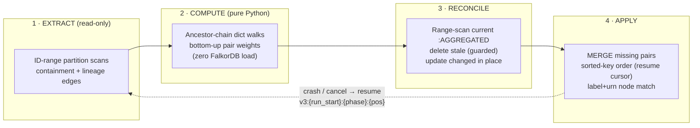

# Aggregation Materialization Pipeline

How `:AGGREGATED` rollup edges are computed and written to FalkorDB, and
how the system protects the graph provider while doing it. This replaces
the three legacy strategies (wipe-first bulk rebuild, epoch-swept
streaming rebuild, cursor-paged MERGE loop) with a single resumable
pipeline: **EXTRACT → COMPUTE → RECONCILE → APPLY**
(`backend/app/providers/falkordb_materialize.py`).

**Who it's for:** backend engineers working on aggregation, and operators
tuning or debugging materialization jobs on large graphs.

**What you'll find here:** the aggregation semantics and the structural
materialization boundary, the four pipeline phases, the resume model,
provider-protection controls, the full tuning knob reference, and the
completeness contract.



> **Note:** The pipeline is **resumable and non-destructive by design**. RECONCILE guards deletes with `latestUpdate < run_start`, and there is **no epoch sweep** — a failed or resumed run can never wipe good edges.

## Semantics

Given an ontology hierarchy (e.g. `Domain ⊃ Application ⊃ Database ⊃
Table ⊃ Column`), each lineage edge between two leaf nodes produces
`:AGGREGATED` edges for the **full cross-product of both ancestor
chains** — column→table, table→table, table→database, domain→domain, and
every other combination — weighted by the number of underlying lineage
edges and stamped with `sourceLevel`/`targetLevel` from the ontology's
entity-type levels. Containment and lineage edge types are the
ontology-resolved sets frozen onto the job row at trigger time; the
worker re-validates the ontology fingerprint before running.

**Materialization modes (FULL CUBE by default).** The shipped default
(`AGGREGATION_MATERIALIZE_FINE_PAIRS=true`) always stores the FULL CUBE:
every ancestor combination (column→table, table→table, column→domain, …)
physically exists, so every canvas granularity and expansion answers from
storage alone. That is the point of the default — boundary mode has a
caveat on SELF-NESTING types, where the on-demand reader still reasons in
ontology type levels and mixed-granularity drill answers can come back
incomplete (depth-aware on-demand reads are the tracked follow-up).

The cost is stated plainly because it is real: a FORCED cube is checked
against the WRITE BUDGET **before it starts** — the same up-front estimate
Auto runs, an upper bound with `AGGREGATION_ESTIMATE_MARGIN_PCT` of slack,
against the free memory of the shard that owns the graph — and a graph
that cannot fit is refused with nothing computed and nothing written. The
exact count is checked again after COMPUTE and before every overflow wave,
so a shard that fills up mid-run (another graph landing on it) still fails
the job loudly rather than filling the shard; that late refusal is the one
case that leaves a partial cube over the previous generation's cells,
which the next successful rebuild reconciles.

`auto` is the mode that degrades instead of failing: it ESTIMATES the full
ancestor cross-product volume up front (one counting scan: Σ ancestors(src)+1
× ancestors(tgt)+1 — a conservative upper bound), stores the cube when it fits
`AGGREGATION_MAX_CUBE_EDGES` **and** the owning shard has room for it, and
falls back to the structural boundary below otherwise, so it can never pick a
cube that exceeds the budget. `false` forces the boundary. Operators move a whole fleet between these from Ingestion →
Freshness → Automation (③ Act → Advanced) without a redeploy; a single run is
set in the trigger dialog's Rollup storage control.

**The STRUCTURAL materialization boundary (the scale contract):**
only CANONICAL DEPTH-BRIDGED pairs are materialized: a node is a
container because it HAS CONTAINMENT CHILDREN (never because of its
ontology type — a self-nesting type like ``Node ⊃ Node ⊃ Node`` rolls
up at every nesting depth), and for each raw lineage edge and each
containment DEPTH d, the pair is each side's deepest container ancestor
at depth ≤ d. On graphs whose types encode the hierarchy
(domain ⊃ table ⊃ column) depth ≡ type level and the output is
identical to the previous level-based selection. Ontology type levels
survive as the ``sourceLevel``/``targetLevel`` STAMPS the read path
filters on (omitted when a label has no mapped level). On aligned chains that is exactly the
same-level diagonal — table→table, database→database, domain→domain. On
RAGGED chains (a column hanging directly under a domain, skipping
levels) it is the mixed-level cell the canvas shows at that granularity
(table→domain) — the cell a pure level-equality filter would silently
drop. Cross-level raw lineage (a raw table→database edge) falls out of
the same rule. Each raw edge contributes at most one pair per level,
and the per-level pair sets shrink monotonically going up the hierarchy
(database→database pairs are a quotient of table→table pairs), so this
is the minimal spanning set. Everything else is computed ON DEMAND by
`get_aggregated_edges_between`:

* pairs involving LEAF nodes (column→table, column→domain,
  column→column) — raw lineage fan-out from the requested leaf nodes
  plus `*0..k` upward containment walks (these scale as edges × depth
  if materialized; observed: 1.17M edges → 5.6M pairs → FalkorDB OOM);
* MIXED-LEVEL container pairs (table→domain, domain→table) — anchored
  on the finer endpoint's materialized canonical `:AGGREGATED` cells
  (far side at-or-below the finer level: each raw edge appears in
  exactly one such cell per anchored endpoint), with the coarser
  endpoint resolved by a STRICT upward walk. The derived sum is
  therefore disjoint from any directly-materialized canonical cell for
  the same pair (whose edges resolve AT the coarser endpoint), and the
  read path ADDS the two — exact weights even on doubly-ragged graphs.
  (Materializing these instead would scale with raw-edge count × depth²
  level combinations; observed: still 2.33M pairs on the same graph
  after only the leaf cut.)

All reads are index-driven and bounded by the visible set —
milliseconds even 8 levels deep on multi-million-edge graphs. Same
answers, same response shape. Trace is unaffected: trace-at-level reads
same-level cells (still materialized) and already uses raw edges at the
finest level. The write budget fails a job loudly — terminally, no
retries, with every number a person needs in the error — rather than ever
letting a result OOM the shared instance.

**The budget is MEASURED from the shard that owns the graph.** A FalkorDB
graph key lives entirely on one node — Redis Cluster does NOT split a
graph, so sharding scales the *number* of graphs you can host, not the
size of any one, and running on a cluster gives a single large graph zero
extra headroom (`backend/app/providers/falkordb_connection.py` module
docstring). So before it writes, the pipeline reads `INFO memory` on that
one shard — the projection graph's shard in dedicated mode — through the
client it already holds, and allows the write when the NEW edges fit
under a reserve:

```
allowed_growth = (maxmemory - reserve_pct% x maxmemory - used_memory - held_by_other_rebuilds) / bytes_per_edge
```

Only growth is charged (edges the graph already holds are re-written in
place), and the reading is fresh at every check: the up-front estimate,
the exact count after COMPUTE, and each overflow wave. Adding memory to a
shard is therefore visible to the very next rebuild. The refusal names the
shard, the edges and bytes needed, what was free of what `maxmemory`, the
shortfall and the ways out, and `run_stats.write_budget` records the same
decision on success (`governed_by: shard`). Read the shard yourself with
`redis-cli -h <shard> INFO memory` — the same two numbers.

Three operator limits sit on top, resolved per-job tuning → Ingestion →
Freshness → Defaults → env, like every other knob: **`shardReservePct`**
(`AGGREGATION_SHARD_RESERVE_PCT`, 20) is how much of the shard must stay
free for live queries and every other graph on it; **`bytesPerEdge`**
(`AGGREGATION_BYTES_PER_EDGE`, 512) overrides what one edge is assumed to
cost — a planning figure until a fresh rebuild with material growth has
CALIBRATED it from the shard's own before/after usage, per graph, which
the next rebuild of that graph then uses; and **`maxMaterializedEdges`**
is an OPTIONAL explicit ceiling on the total, layered over the measured
budget for a graph you want held BELOW what its shard could take. No
preset sets it — a ceiling on the job wins over the measurement, which is
exactly how a pinned 25M made adding shard memory change nothing.

When the shard cannot be measured — no `maxmemory` configured (the five
`deploy/topologies/docker-compose.falkordb-*.yml` files), or the read
timed out — the budget degrades to the static count rule: the explicit
ceiling if set, else `AGGREGATION_MAX_MATERIALIZED_EDGES` (25M, ~12.5GB
at the default bytes/edge), and the message says that the static cap
governed and why.

Because keyslot placement is deterministic rather than load-aware, the
case to watch is two graphs landing on the same shard. Two rebuilds racing
onto one shard cannot both pass on the same headroom: a rebuild that passes
a budget check enters what it still has to write in the node's reservation
ledger (`agg:reserve:{node}` on the job-bus Redis, beside the write lease
in `admission.py` — the whole growth before the apply, one wave for an
overflow flush, the remainder at each mid-apply recheck, released with the
lease), and every other rebuild's budget subtracts it as used memory until
the writes land or the job ends. The ledger fails open like the rest of
admission. Still monitor per-shard `used_memory` and rebalance by moving a
graph, per [Infrastructure: Launch Scale](/docs/infra-launch-scale) §7.4.

Under `noeviction` a full shard fails writes for every graph on it, and
with `cluster-require-full-coverage no` the rest of the cluster keeps
serving, so that failure is partial and confusing rather than obvious —
which is why the budget refuses BEFORE the shard fills, not at the cap.

**The apply re-measures.** The post-compute check answered for the whole
result at one instant; a multi-million-edge APPLY can run for a long time
while another graph's rebuild lands on the same shard. Every
`AGGREGATION_BUDGET_RECHECK_EDGES` first-touch edges written, the pipeline
re-reads the shard and refuses — with the numbers, and with "mid-apply
recheck" in the message — when the REMAINDER would not fit. The refusal
comes after the chunk's checkpoint, so the job can be resumed from its
cursor once memory is freed; `run_stats.budget_rechecks` counts them.

**Rollup storage per source.** A source can be pinned to Auto (or Full
detail) on its own, from the drawer's ③ Act, before its first build if need
be; the override is resolved into the job's frozen tuning at trigger time,
so automation and manual rebuilds honour it alike and a per-job request
still wins. The freshness row and doc carry the resolved value and where it
came from (`rollupStorageOverride` / `resolvedRollupStorage` /
`rollupStorageSource`).

### The capacity API

What the budget measures, for people: `GET /api/v1/admin/aggregation/capacity`
lists EVERY master of every graph store — with or without sources on it — and
places each aggregated source on one by hashing its rollup key (the projection
graph in dedicated mode). Per node: used, `maxmemory`, the reserve, what
running rebuilds hold in its ledger, what is free after both, how many more
rollup edges that is at the fleet bytes-per-edge, and the sources on the
shard with their footprint and what their last run learned. `GET /api/v1/admin/data-sources/{id}/capacity`
adds the pre-flight: the pipeline's own verdict on the last run's cube
estimate against the live reading (Full detail fits / short by / unknown
until a first run; Auto is never refused). Both are ingestion-read like the
settings GET and are served in-process in every mode — they read the graph
store topology snapshot the web tier builds for itself
(`services/graph_store`, `GRAPH_STORE_TOPOLOGY_*`), so capacity dials nothing
of its own. Placement is arithmetic over that snapshot rather than a
per-source provider resolution, which is why every master now appears, the
row order never moves, and a failed refresh keeps the last good figures with
`stale`/`lastError` set instead of blanking the card. Anything that cannot be
placed is reported with a coarse reason; nothing raises; the assembly is
cached for `AGGREGATION_CAPACITY_CACHE_TTL_S`. The Freshness page's capacity
card, the drawer's Capacity block, the re-trigger fit check, the Defaults
dialog's what-if and the Infrastructure page's memory headroom all read it —
and **Admin → Graph store** is the full view behind them, with the replicas
and the graphs per shard the capacity rows do not carry. `AGGREGATION_MATERIALIZE_FINE_PAIRS=
true` restores the legacy full cube (budget-guarded); jobs without an
ontology level map — or with a SINGLE-LEVEL map (no container types) —
fall back to it automatically. An empty graph completes as a clean
no-op; a non-empty graph whose labels match no non-leaf ontology label
fails terminally (`MaterializationPreconditionFailed`, no retry burn)
instead of wiping. Coverage is verified by an exhaustive cross-product
matrix test (`test_full_cross_product_matrix_six_levels`): every
source-level × target-level combination on a 6-level hierarchy answers
exactly from canonical cells + on-demand derivation.

**Storage-regime gate.** The mixed-level derivation is exact ONLY
against canonical cells — run against a legacy/fine full cube it would
double-count every mixed weight. The pipeline stamps the regime
(`{graph}:agg:regime` = `boundary`/`fine`) into Redis on completion;
the reader gates the derivation on it, falling back to a cached graph
probe for non-conforming rows (NULL `aggKey`/`sourceLevel`). Unknown or
legacy state degrades to stored-only mixed answers (the original
behavior) — so the post-upgrade transition window and the fine-pairs
escape hatch can never inflate weights; they heal at the first
boundary-mode run. Incremental writers stay canonical too: the
versioning projector derives the same canonical selection from the
ontology level map (level-stamped, digest-stamped), and the write hook
alias-translates observed label spellings before level lookup. The
delete hook mirrors the write hook (shared chain/level resolution and
canonical selection) and only ever DECREMENTS: a pair is touched only
when SREM proves this edge's id was tracked in its `agg_members` set,
via the `AGGREGATED(aggKey)` index seek (weight 0 deletes the cell).
Untracked pairs — anything only the batch pipeline wrote, or after a
Redis flush — are deliberately left for the next reconcile; the old
SCARD-based overwrite/empty-set-delete could destroy pipeline-computed
cells (one raw deletion collapsing a 12,000-weight rollup).

Endpoints whose label is OUTSIDE the ontology (messy ingests) are
served as raw anchors (exact edges + upward rollups) rather than
dropped. Residual known gap: a mapped→unmapped pair whose raw edge
lands strictly BELOW the unmapped node is not derivable without
enumerating the unmapped subtree.

## Phases

1. **EXTRACT** (read-only): containment and lineage edges are scanned
   with fixed **ID-range partitions** (`WHERE ID(r) >= lo AND ID(r) <
   hi`, no ORDER BY/LIMIT) — tens of queries per edge type instead of the
   legacy thousands of sorted re-scans (which were O(E²) end-to-end and
   the main reason multi-million-edge graphs took hours).
2. **COMPUTE** (pure Python, zero FalkorDB load): ancestor chains are
   dict walks over the extracted child→parent map; pair weights are
   aggregated bottom-up through the ancestor lattice. Deterministic —
   a crashed run just recomputes (minutes). Memory is bounded by
   `AGGREGATION_MAX_PENDING_PAIRS` and, under a cgroup limit, by the
   memory-aware flush (`AGGREGATION_FLUSH_MEM_PCT` of the limit, once
   `AGGREGATION_FLUSH_MIN_PAIRS` are pending); either triggers an early
   flush with first-touch-overwrite semantics that keeps weights exact.
3. **RECONCILE**: the current `:AGGREGATED` set is range-scanned once;
   stale edges are deleted precisely (guarded by `latestUpdate <
   run_start`, so edges written during the run — by overflow flushes, a
   prior attempt, or `on_lineage_edge_written` — are never deleted),
   changed edges are updated in place. There is **no epoch sweep**: a
   failed or resumed run can never wipe good edges.
4. **APPLY**: missing pairs are MERGE-created in sorted-key order
   (deterministic resume cursor), with nodes matched by **label+urn**
   (per-label URN index seek) in both projection modes.

> **Caution: no ID-equality under UNWIND.** FalkorDB does not drive
> ``WHERE ID(n) = x`` from a NodeByIdSeek inside an UNWIND — it scans all
> nodes per row (observed: 30s+ per 5k-row batch on a 500k-node graph,
> producing a timeout/quiesce/retry loop). The pipeline therefore resolves
> node IDs → (urn, label) through a lazily-built, range-scanned **node
> directory** (one bounded pass; only loaded when a write/delete actually
> needs it), writes via label+urn MERGE, and deletes via the aggKey edge
> index. Internal IDs are used only in range predicates
> (``ID(x) >= lo AND ID(x) < hi``), which are cheap filters.

In steady state a re-run after small source changes writes only the
diff — near-zero load. Full recompute *is* the incremental strategy.

## What the run reports about itself

The four phases above are the pipeline's. A *run* has six stages, and the
two the pipeline does not own used to be invisible:

| Stage | Owner | What happens | Its unit of work |
| --- | --- | --- | --- |
| `preparing` | worker | `set_entity_type_levels`, `ensure_indices` (~131 `CREATE INDEX` on a 20-type ontology), `stamp_identity_urns` over the whole node ID space, and the **before**-fingerprint (three full graph scans) | none countable |
| `extracting` | pipeline | EXTRACT | lineage edges scanned |
| `computing` | pipeline | COMPUTE | none countable |
| `reconciling` | pipeline | RECONCILE | ID-range scans of the stored cube |
| `applying` | pipeline | APPLY | aggregated edges written of those found missing |
| `finalizing` | worker | the **after**-fingerprint, the data-source state row, the workspace row, the audit row, the terminal events | none countable |

**Why the two bookends matter.** On a large graph they are minutes at each
end of the run, and before the ledger the row said nothing during either:
`current_phase` is set only by the pipeline's checkpoints, and the UI's
whole progress block was gated on `total_edges > 0`, which EXTRACT has not
set yet. A run looked idle at the start and wedged at "Applying, 100%" at
the end.

**Why per-stage units matter.** `_checkpoint` sends `processed` / `total`
= the EXTRACT counters *whatever phase is running* — by design, because
that is what the resume cursor and the coverage figure are about. So from
RECONCILE onwards those counters are frozen and `progress` (a
phase-weighted 0-100) is the only moving number, with its denominator
nowhere. Each phase already computed that denominator one line above its
checkpoint call and folded it into the percentage; it is now passed as
`unit_done` / `unit_total` / `unit` and kept.

### The step ledger

`backend/app/services/aggregation/steps.py`. One ordered record per run,
written into **`run_stats["steps"]`** — so the same document is the live
view while the job runs and the run's history once it is over. Per stage:

* `state` — `pending` before it is entered, `running` while it holds the
  run, `waiting` while it holds the run but is parked on something outside
  it, `done` once a later stage opens, `failed` / `cancelled` when the run
  ended inside it.
* `started_at` / `ended_at` / `secs` — seconds accumulated across **every**
  visit. The open stage's elapsed time is deliberately *not* baked in
  (that would mark the document dirty on every checkpoint and collapse the
  commit cadence into one PG write per batch); readers add the difference
  from `started_at` themselves.
* `visits` — >1 means a transient failure sent the run back to this stage.
* `done` / `total` / `unit` — the stage's own unit of work, `null` for the
  stages that have none. Inventing one would be worse than saying nothing.
* `waiting_for` — why it is parked.

**Re-entry is honest.** Going back to an earlier stage (a transient
failure resumes from the cursor, and EXTRACT+COMPUTE always re-run) resets
every later stage to `pending` while keeping the seconds it already
accumulated. Nothing claims work that is about to be redone is finished.

**Waiting is a state, not a silence.** A retry backoff, a quiesce park and
a failover park are real time the run spends not running, and they used to
read exactly like a hang: the same stage, the same frozen counters, nothing
said. Each now marks the open stage `waiting` with its reason; the next
checkpoint clears it.

**Commit cadence.** Checkpoints coalesce their PG commit (2s or 5 batches),
but a **stage boundary commits immediately** — there are five per run and
it is the thing an operator is watching. One slow RECONCILE range is longer
than the two-second window, so riding the cadence could leave the row
saying EXTRACT a minute into RECONCILE.

**Reading it in the UI.** `frontend/src/components/admin/job-history/runSteps.ts`
turns the ledger into the stepper's segments: each segment fills with its
own `done/total` while it runs, carries its duration live, and explains
itself; one line under the stepper says what the running stage does and
what is left of it. A failed or cancelled run renders it too — it names the
stage the run died in. Runs from before the ledger existed fall back to the
four segments derived from `current_phase`.

**The estimated finish** (`historicalEta` in `JobRow.tsx`) projects from
the previous run's ledger when both runs have one: the unfinished part of
the current stage, at the larger of last run's rate and this run's own, plus
the full duration of every later stage — the two bookends included.

## Resume

The job cursor is `v3:{run_start_ms}:{phase}:{pos}` and is persisted from
the **first checkpoint**, before any graph work. Resume rules:

* `aggregate` phase (or a legacy/garbage cursor): restart from zero —
  cheap by design. Legacy `v2:` cursors from in-flight jobs at upgrade
  time resume as clean fresh runs **without wiping** existing edges; the
  first RECONCILE also cleans up any stale generations left by the old
  epoch machinery.
* `reconcile`: EXTRACT+COMPUTE re-run (deterministic), then the scan
  continues from its recorded range lower bound.
* `apply`: EXTRACT+COMPUTE and the full RECONCILE re-run; the rebuilt
  `existing` set already excludes everything the prior attempt wrote, so
  apply writes exactly the still-missing pairs. The recorded position is
  progress display only — fast-forwarding past it would skip pairs that
  are new since the crashed attempt. All writes are idempotent.

## Provider protection

* **Server-side query kill**: every deploy manifest now sets
  `TIMEOUT_MAX` (FalkorDB ignores per-query timeouts on *write* queries
  without it), `TIMEOUT_DEFAULT`, `MAX_QUEUED_QUERIES`,
  `QUERY_MEM_CAPACITY` (overridable as `FALKORDB_QUERY_MEM_CAPACITY`; size
  it WITH the container limit, never alone), and — critically —
  `OMP_THREAD_COUNT 1`
  (unbounded per-query OpenMP threads on a big node under a small cgroup
  quota were the main cause of the 150% CPU spikes). `TIMEOUT_MAX` and
  `QUERY_MEM_CAPACITY` can also be changed at runtime from Infrastructure →
  Memory headroom (`services/aggregation/graph_store_limits.py`: read,
  validate against the container formula, `GRAPH.CONFIG SET`, verify, tell
  the providers) — until the next restart. See
  `docs/FALKORDB_DEPLOYMENT.md` for sizing rules.
* **Distributed admission control**
  (`backend/app/services/aggregation/admission.py`, on the job-bus
  Redis): a per-graph write lease (one materializing job per graph across
  all pods) and a per-endpoint write-slot semaphore
  (`FALKORDB_ENDPOINT_WRITE_SLOTS`, default 2) so an HPA-scaled worker
  fleet cannot stampede one FalkorDB, and a per-node reservation ledger
  (`agg:reserve:{node}`: what each running rebuild has been allowed to
  write but the node's `used_memory` does not show yet, subtracted from
  every other rebuild's write budget so two rebuilds cannot both pass on
  the same headroom). Fails **open** to the per-process limits if Redis
  is down.
* **Pacing — one batch settled, then a pause, then the next**: a write
  batch is sized by an AIMD sizer against `AGGREGATION_WRITE_BATCH_TARGET_S`
  (default 1.0 s: a batch that ran longer halves the next; five in a row
  under two fifths of it grow it by 100 rows) up to
  `AGGREGATION_WRITE_BATCH_MAX` (default 500 rows). The target is the
  number that matters for users: a write query holds the graph's write
  lock from its first mutation to its end, so one batch is the longest
  stall a reader of that graph sees, and the same rows in more, shorter
  batches cost readers less than fewer, longer ones. Each batch is
  *settled* before the next: the write governor has read the node and
  found it inside the envelope, the query has returned, the replicas have
  acknowledged it (`replicaAckMin`), and then the run pauses for
  `duration × AGGREGATION_WRITE_PACING_RATIO` (default 1.0 → ≤ ~50% write
  duty cycle), never less than `AGGREGATION_WRITE_MIN_GAP_MS` (100 ms, so
  fast small batches never run back to back), never more than 30 s. The
  ratio is a sleep multiplier, so RAISING it slows the job down and
  LOWERING it speeds it up — 0.5 → ≤ ~66%, 0.25 → ≤ ~80%, 0 → only the
  minimum gap. Short of a hold the run *eases*: replicas half way to the
  limit the master drops them at, or the container's fork line within an
  eighth of the limit, halve the batch ceiling and double the pause until
  the reading is back. The run's progress carries all of it live (batch
  rows, seconds per batch, the pause, the rolling duty cycle and rate,
  whether it is holding or eased and why) and the run record keeps it.
* **Interactive reads first**
  (`backend/app/services/aggregation/read_pressure.py`): the writers'
  only feedback used to be their OWN write latency, so a job issuing
  small, fast MERGEs while the canvas's reads queued behind them looked
  healthy and never yielded. Now the web tier stamps
  `agg:readpressure:{endpoint}` on the job-bus Redis (TTL
  `AGGREGATION_READ_PRESSURE_TTL_S`, default 30 s, refreshed by every
  signal) whenever FalkorDB starves an interactive read — its queue-full
  rejection, its server-side query kill, or a client deadline — and every
  write batch on that endpoint is then paced at
  `AGGREGATION_READ_PRESSURE_PACING_RATIO` (default 4.0 → ≤ ~20% write
  duty cycle) instead of the base ratio until the key expires. Jobs finish
  later; users never queue behind a background rebuild. Fails **open**
  both ways (no Redis → no signal → no slowdown). Counted under
  `/api/v1/health/deps` → `resilience.read_pressure`.
* **Progress-aware watchdog** (worker): a job is killed only when it
  makes no forward progress for `AGGREGATION_STALL_TIMEOUT_SECS`
  (default 10800 — 3h, the same window every UI trigger path sends
  explicitly as `timeoutSecs`) or exceeds `AGGREGATION_JOB_MAX_WALL_SECS`
  (default 86400). The old fixed 2-hour kill (which terminated healthy
  3-hour jobs mid-flight) is gone; `job.timeout_secs` overrides the stall
  window per job. The default matters because only the MACHINE paths leave
  that column NULL — reconciliation drift and first builds, the cron drift
  sweep, the stale-marker reconciler, Refresh rollups, the projector heal
  hook — so at 900 they were the only rebuilds being killed for going
  quiet, on exactly the graphs large enough to do it. Both windows are
  re-read from the job row while it runs (`PATCH …/jobs/{id}/limits`), so
  an operator can give a running job more time without cancelling it.
* **The pressure ladder**: every per-query refusal the graph store can
  make — the memory ceiling (`QUERY_MEM_CAPACITY`) and the per-query
  timeout, whether the client deadline or the server's own *Query timed
  out* — is absorbed by reading less per query: the first event of a run
  pins wave concurrency to 1; a RECONCILE scan switches to the keys-only
  two-pass strategy under `AGGREGATION_RECONCILE_KEYS_ONLY_WIDTH`; the
  sticky scan width halves down to `AGGREGATION_SCAN_SHRINK_FLOOR` (default
  one row) and re-grows after sustained successes, never straight back into
  a width that failed; write and delete batches halve the same way. At the
  narrowest width a timeout is retried with backoff and heartbeats
  (`AGGREGATION_SCAN_TIMEOUT_RETRIES`) and only then raised as
  `MaterializationScanTimedOut` — a `TimeoutError` the worker treats as an
  outage (resumable from the checkpoint); a memory refusal on a single row
  is the one terminal outcome. What a run learned is persisted per source
  (`data_source_state.observed_tuning`) and seeds the next run's ladder
  where it is stricter than the knobs (`ignoreObserved` opts out).

### Replication backpressure, outage holds, and failing-over reads

Four behaviours keep a rebuild from taking a shard down, and keep users from
seeing it as an outage when a node is replaced anyway.

- **The write governor.** Before every write batch the pipeline reads the node
  it writes to — `INFO memory server persistence replication`, one round trip,
  no config — and holds while the node is outside the envelope a rebuild may
  write inside: a fork in flight (`BGSAVE`, an AOF rewrite running or
  scheduled, a replica receiving a full resync), fewer replicas attached than
  the run started with, a replica further behind than a fraction of the limit
  the master drops it at (`AGGREGATION_REPLICA_LAG_HOLD_BYTES`, derived from
  the node's own `client-output-buffer-limit` and `repl-backlog-size`), or RSS
  past what the container could survive a fork at (`FALKORDB_CONTAINER_MEMORY_BYTES`
  less `AGGREGATION_FORK_COW_PCT` × RSS, what replication holds and the
  overhead). Every one of those is true of the node now and false a little
  later, which is why it is a hold — heartbeating, backing off, re-reading —
  and not a refusal. Writing through a fork is what turns the dataset's size
  into twice the dataset's size: the rebuild dirties nearly every page the
  child holds a copy of, the container limit is reached, the master is killed,
  and its replica flushes the whole dataset to follow the promotion — the
  incident in full. A hold ends when the node recovers, or after
  `AGGREGATION_HOLD_MAX_SECS` with `MaterializationStoreUnstable` (a kind of
  unreachable: checkpoint kept, a person looks). `replicaAckMin` 0 on the
  running job waves the two replica reasons through; a fork and the memory
  line are about the master's own survival and no knob waves them through.
  The run records `store_holds`, `store_hold_s` and `store_hold_last` by
  reason, and the run settings panel says so. After a hold the next batch is
  half the size and re-grows additively.
- **The replica gate.** After every apply/delete batch the pipeline asks the
  master how many replicas have acknowledged (`WAIT replicaAckMin
  replicaAckTimeoutMs`). Acknowledged: the batch is settled, and the sizer
  judges it by the master's time or the wait, whichever was longer — a replica
  that re-runs every batch on its main thread gets shorter batches, but a
  replica that is merely behind is paced by the wait itself, never by a
  shrunken batch on top of it (which helps no replica and starves the run).
  Not acknowledged: the run HOLDS — heartbeating, re-reading
  replication state, retrying — bounded only by the job's stall window, and
  releasable live by setting `replicaAckMin` to 0, and bounded like every
  hold by `AGGREGATION_HOLD_MAX_SECS`. A run that starts against a master
  with no replicas never waits; one that LOSES a replica mid-run holds for
  its return rather than writing into its resync. The run records `replica_waits`, `replica_wait_s`,
  `replica_holds` and `replica_max_lag_bytes`, and warns at the start when a
  master has replicas and an `EFFECTS_THRESHOLD` above 0 (see
  `FALKORDB_DEPLOYMENT.md` §5aa — that is the setting that decides whether a
  replica applies a change log or re-runs your whole batch).
- **The outage hold.** A refused connection is not pressure: narrowing a query
  does not help a node that is not there. Any connection fault inside the
  ladder becomes a wait — heartbeat, backoff, re-resolve the owner (which finds
  a promoted replica), then the SAME operation at the SAME width from the same
  checkpoint — bounded by `AGGREGATION_STORE_OUTAGE_HOLD_S`. Past that the run
  fails with `MaterializationStoreUnreachable`, whose message names the node,
  how long it waited and what to check; the worker reports it as
  `reason: "connection"` and the job resumes from its checkpoint.
- **A retry that wrote is converging, not stuck.** A rebuild of a graph too
  large for one wall clock fails in the same SHAPE every time, and the
  reconciliation breaker used to read that as a poison source and suspend it —
  for making progress. It is the opposite case: APPLY writes only the cells the
  reconcile scan did not find, and the writes are durable, so each attempt
  writes strictly less than the last and the source converges across runs. The
  marker reconciler now reads the last attempt's `run_stats.writes` (committed
  at every checkpoint, so a watchdog kill leaves an honest count) and, when it
  is non-zero, clears the retry count instead of counting it. The breaker still
  bounds attempts that achieve nothing, which is what it is for.
- **One dead shard is not a dead cluster.** The circuit breaker is per
  PROVIDER, and on a cluster a provider is every shard — so an error counted
  against it while one shard is being replaced refuses every graph on every
  other shard too. A refused connection to a cluster node was already reported
  as `ProviderFailingOver` (logical, uncounted) for exactly that reason, but the
  branch where the RECONNECT itself failed raised the raw error and counted it.
  It now reports a failover as well, unless the reconnect failed on credentials
  — a real provider fault, which the breaker is the right place for. The test
  narrows on the reconnect error itself rather than its cause chain: the code
  runs inside an `except`, so every reconnect failure carries the original
  refused connection as its context and a chain-walking classifier calls all of
  them transient, the password included.
- **Reads from in-sync replicas.** A shard's master took every write AND
  answered every read, so on a cluster with two replicas per shard two thirds
  of the hardware sat idle while the master's query threads were the
  bottleneck for a hundred people opening canvases. Read-only Cypher is now
  offered to a replica, under four gates, any of which sends it to the master:
  the provider allows it (`readFromReplicas`, default `auto`, per provider in
  the wizard or fleet-wide via `FALKORDB_READ_FROM_REPLICAS`); the replica is
  online and owes the replication stream no more than
  `FALKORDB_REPLICA_READ_MAX_LAG_BYTES` (8 MiB), sampled once per shard per
  few seconds rather than per read; this process has not written to that graph
  inside `FALKORDB_REPLICA_READ_SETTLE_S` (30s), so a caller always sees its
  own writes; and the replica is not in the short penalty box a failed read
  puts it in. Lag is measured in bytes and never in the `lag` seconds `INFO`
  reports — a replica acknowledges the stream about once a second whatever it
  has applied, so those seconds read 0 for one that is gigabytes behind. A
  connection fault, a `MOVED` or a replica still loading re-issues the read on
  the master once; a query the store refused for its size, or aborted at its
  own time limit, is raised as it stands, because re-running it on the master
  would fail the same way and double the load the routing exists to shed. A
  replica that lets the caller's deadline expire is benched like any other
  fault, but the read is not started again — a second full-length run would
  make its timeout no bound on how long the caller waits.

  **A master that stops answering does not close the gate.** The lag reading
  comes from the master, so a master that is gone would otherwise leave no
  replica qualified and send every read to the node that just failed — at the
  one moment its replicas hold the only copies of the graph still standing.
  The replicas it vouched for when it last spoke stand instead (and if it
  never spoke, whichever the client still lists); it is asked once per sample
  window rather than once per read; the settle window stops pinning a freshly
  written graph to it; and the failing-over memo, a verdict about the master,
  no longer fast-fails a read already addressed to a replica. Reads therefore
  keep flowing through a pod rotation. **Every read a rebuild makes is pinned to the master** for
  the whole run — RECONCILE reads what APPLY just wrote — via a contextvar the
  pipeline sets, so replica reads can never make a run see a graph it has
  already changed.
- **Failing-over reads.** When a cluster node stops answering, the provider
  reports `ProviderFailingOver` — a logical exception the circuit breaker never
  counts, so a routine pod rotation can no longer answer every user with
  "Circuit open" for a reset window. A read gives up after one topology
  re-resolve (and for the next couple of seconds is answered from a short memo
  without dialling the dead address, so a hundred concurrent readers cost one
  socket); the API maps it to 503 `PROVIDER_FAILING_OVER` with `Retry-After: 3`
  and the endpoint; the canvas serves its last good document with
  `staleReason: "failing_over"` behind a "Reconnecting" line and retries
  itself. Writes still spend the whole failover window, because the rebuild is
  the one caller that should keep trying.

## Tuning

Resolution order per knob: **job `tuning` (frozen at trigger) → the
source's Rollup storage override (`rollup_storage` on its state row, set
from the drawer's ③ Act; the one per-source knob) → stored global defaults
(`GET/PUT /api/v1/admin/aggregation/settings`, editable in the Defaults
dialog, which shows every knob's live env default and where each value
came from) → env var → code default.** Per-job
overrides ride the trigger/resume APIs (`tuning` object with camelCase
fields mirroring the env vars below plus `extractConcurrency`); the
control plane freezes the merged dict onto the job row so workers stay
stateless. `batch_size` is deprecated (accepted, ignored by the
pipeline).

| Env var | Default | Meaning |
|---|---|---|
| `AGGREGATION_SCAN_RANGE_WIDTH` | 200000 | Edge-ID range width per scan query. Cappable live on a running job (Job History → Adjust this run → Halve scans) |
| `AGGREGATION_MAX_PENDING_PAIRS` | 50000000 | In-memory pair cap before overflow flush — the flush-free ceiling, not the memory wall |
| `AGGREGATION_FLUSH_MEM_PCT` | 60 | Memory-aware flush: share of the worker's cgroup memory limit at which the accumulator (and the extract base map) flushes early, whatever the count (30-90). Defaults as `flushMemPct`. Fail-open when RSS or the limit cannot be read |
| `AGGREGATION_FLUSH_MIN_PAIRS` | 100000 | Pairs the accumulator must hold before a memory-aware flush fires (10k-50M) |
| `AGGREGATION_APPLY_CHUNK` | 20000 | Keys resolved+written per apply chunk |
| `AGGREGATION_DELETE_CHUNK` | 10000 | Stale edges deleted per query |
| `AGGREGATION_WRITE_PACING_RATIO` | 1.0 | Sleep-after-write ratio — HIGHER is gentler and slower (1.0 → ≤ ~50% duty cycle); 0 disables pacing. Changeable live on a running job (Pace ×2 / ×4), from the next write |
| `AGGREGATION_WRITE_BATCH_MAX` | 500 | Ceiling on rows per write batch (10-2000). A write batch holds the graph's write lock, so this bounds the longest stall a reader of the graph sees. Per-job / Defaults as `writeBatchMax`; lowerable live on a running job (Smaller batches) |
| `AGGREGATION_WRITE_BATCH_TARGET_S` | 1.0 | What one write batch should take, seconds (0.1-10): the sizer halves a batch that ran longer and grows one that stays under two fifths of it, up to the ceiling. Per-job / Defaults as `writeBatchTargetS`; changeable live |
| `AGGREGATION_WRITE_MIN_GAP_MS` | 100 | Floor under the pause between two write batches, ms (0-10000) — the pause is a share of the batch's own duration, and fast small batches would otherwise run back to back. Per-job / Defaults as `writeMinGapMs` |
| `AGGREGATION_WRITE_PACING_MIN_RATIO` | 0.25 | The sleep-after-write ratio on a node with ROOM TO SPARE: measured, no fork in flight, every replica the run started with attached and barely behind, and a quarter of the container still free (0-10). `AGGREGATION_WRITE_PACING_RATIO` is the CEILING on the pause and this is the floor; the governor's own reading picks between them, and starving interactive readers still override both. Per-job / Defaults as `writePacingMinRatio` |
| `AGGREGATION_READ_PRESSURE_PACING_RATIO` | 4.0 | Sleep-after-write ratio used while the web tier reports interactive reads starving on the endpoint (≤ ~20% duty cycle). The LARGER of this and the live pacing ratio wins, so a job told not to pace itself still yields while users are being starved. Env-only |
| `AGGREGATION_READ_PRESSURE_TTL_S` | 30 | How long one starved-read signal keeps the writers yielding (5–600; every new signal refreshes it) |
| `AGGREGATION_READ_PRESSURE_POLL_SECS` | 2 | How long a worker reuses its last read-pressure verdict before asking Redis again |
| `PROVIDER_CLOSE_TIMEOUT_S` | 2.0 | Ceiling on one provider's `close()`. The warmup cycle's idle reap and the cross-process invalidation listener both walk providers serially, so an unbounded close against a blackholed host froze both for every provider |
| `FALKORDB_SCAN_RANGE_TIMEOUT` | 30 | Per-scan-query budget (s). Per-job / Defaults as `scanTimeoutS` (5-600); the server caps any query at its `TIMEOUT_MAX`, read from the node (`FALKORDB_SERVER_TIMEOUT_MAX_MS` is the fallback until then; raisable at runtime from Infrastructure → Memory headroom). Raisable on a running job |
| `FALKORDB_BULK_CREATE_TIMEOUT_S` | 60 | Per-query budget for the pipeline's write and delete batches (s). Per-job / Defaults as `writeTimeoutS` (5-600), capped by the server like the scan budget. Raisable on a running job |
| `AGGREGATION_SCAN_SHRINK_FLOOR` | 1 | Narrowest range width the pressure ladder descends to. Per-job / Defaults as `scanShrinkFloor`. At 1 the only terminal outcome is a single row larger than `QUERY_MEM_CAPACITY`; a floor-width timeout is retried with backoff and then reported as an outage (resumable) |
| `AGGREGATION_SCAN_TIMEOUT_RETRIES` | 6 | Backoff retries (2s, 4s … 60s + jitter, heartbeating between) a floor-width scan gets before the run raises `MaterializationScanTimedOut` (0-20) |
| `AGGREGATION_RECONCILE_KEYS_ONLY_WIDTH` | 5000 | Width at or below which a RECONCILE scan under pressure switches to the keys-only two-pass strategy instead of halving (1-5M) |
| `AGGREGATION_MATERIALIZE_LEAF_PAIRS` | false | Restore leaf↔leaf mirror pairs (legacy mode only) |
| `AGGREGATION_MATERIALIZE_FINE_PAIRS` | true | Rollup storage. `true` (shipped default) always stores the full cube — leaf-involving and mixed-level pairs included — and FAILS above the write budget; `auto` picks cube-vs-boundary by estimate and degrades instead; `false` forces the boundary. Per-job as `materializeFinePairs`, fleet-wide from Ingestion → Freshness → Automation (③ Act → Advanced) |
| `AGGREGATION_SHARD_RESERVE_PCT` | 20 | Write budget: share of the owning shard's `maxmemory` a rebuild must leave free. New rollup edges are allowed while they fit under it (0-90). Per-job / Defaults as `shardReservePct` |
| `AGGREGATION_BYTES_PER_EDGE` | 512 | Write budget: bytes one stored `:AGGREGATED` edge is assumed to cost until a fresh rebuild has calibrated the figure for that graph (64-16384). Per-job / Defaults as `bytesPerEdge`, which also overrides the calibrated value |
| `AGGREGATION_ESTIMATE_MARGIN_PCT` | 25 | Write budget: slack applied to the pre-write UPPER-BOUND estimate (and to the static cap) so a loose estimate does not refuse a cube the exact post-compute check would pass (0-100). Fleet-wide from Defaults as `estimateMarginPct` |
| `AGGREGATION_MAX_MATERIALIZED_EDGES` | 25000000 | Static edge cap, in force ONLY when the owning shard cannot be measured (no `maxmemory`, or the `INFO` read failed). Per-job / Defaults as `maxMaterializedEdges` it is instead an optional explicit ceiling layered over the measured budget; no preset sets it. Bound 500M |
| `AGGREGATION_MAX_CUBE_EDGES` | 50000000 | OPTIONAL appetite ceiling on Auto's full cube (10k-50M), defaulting to its bound so it does not bind. It used to default to 8M and was what actually decided whether a graph got full detail; two measurements do that now — the write budget (can the owning shard hold the cube) and the apply projection (can this job's wall clock finish writing it, at the rate this source measured last run). A fixed cell count answers neither for any particular graph. Fleet-wide from Defaults as `maxCubeEdges`; not per-job |
| `AGGREGATION_BUDGET_RECHECK_EDGES` | 1000000 | Write budget: how many first-touch edges APPLY writes between re-reads of the owning shard. A shard that fills up mid-run (another graph landing on it) is refused loudly after a checkpoint — resumable from the cursor — instead of at its cap (100k-100M) |
| `AGGREGATION_CAPACITY_CACHE_TTL_S` | 10 | Capacity API: how long one fleet sweep is served to every viewer before the next |
| `GRAPH_STORE_TOPOLOGY_CACHE_TTL_S` | 30 | How long one reading of every node is served to every viewer (and to the capacity API) before the next |
| `GRAPH_STORE_TOPOLOGY_DEADLINE_S` | 8 | Deadline for one wave of nodes (8 are read at a time), so the whole sweep scales with the fleet instead of starving the same tail nodes every time; capped at 60s. A node not read in time is reported as unreachable with that reason, never dropped |
| `AGGREGATION_REPLICA_ACK_MIN` | 1 | Replicas of the write node that must acknowledge each rollup batch before the next is sent (0-5). 0 disables the gate. Per-job / Defaults as `replicaAckMin`, and raisable or clearable on a RUNNING job |
| `AGGREGATION_REPLICA_ACK_TIMEOUT_MS` | 5000 | How long one acknowledgement wait may block before the run holds, re-reads replication state and retries (500-60000). Per-job / Defaults as `replicaAckTimeoutMs` |
| `AGGREGATION_STORE_OUTAGE_HOLD_S` | 900 | How long one run waits out a graph store node that is not answering before giving up and keeping its checkpoint (30-7200) |
| `AGGREGATION_HOLD_MAX_SECS` | 1800 | The write governor: how long ONE hold may last — the run waiting, before a write batch, for the node to come back inside the envelope (a fork to finish, the replicas it started with to reattach and catch up, RSS to drop under the container's line) — before it stops for a person with its checkpoint intact (60-21600). Per hold, not per run |
| `AGGREGATION_FORK_COW_PCT` | 125 | Copy-on-write allowance over RSS that a fork is budgeted at, for the container-aware write budget and the memory hold line (100-200). 125 is the deployment guide's figure, and is valid only because the pipeline holds its writes through a fork |
| `AGGREGATION_REPLICA_LAG_HOLD_BYTES` | derived | How far behind a replica may fall before the governor holds. Unset: a quarter of the replica output-buffer hard limit or half the backlog, whichever is smaller — both read from the node — so the master never drops a replica because of a rebuild |
| `FALKORDB_READ_FROM_REPLICAS` | auto | Whether read-only Cypher may be served by a shard's in-sync replicas. `never` pins every read to the master; per provider as `readFromReplicas` in the connection settings |
| `FALKORDB_REPLICA_READ_MAX_LAG_BYTES` | 8388608 | How much of the replication stream a replica may still owe and answer a read anyway. Bytes, not the `lag` seconds `INFO` reports, which stay near 0 however far behind it is |
| `FALKORDB_REPLICA_READ_SETTLE_S` | 30 | How long this process's own write to a graph pins that graph's reads to its master |
| `AGGREGATION_CAPACITY_MAX_SOURCES` | 500 | Capacity API: sources per sweep, largest first; the response says when it was truncated |
| `FALKORDB_ENDPOINT_WRITE_SLOTS` | 2 | Cross-pod write budget per endpoint |
| `AGGREGATION_EXTRACT_CONCURRENCY` | 1 | Concurrent read-only range scans (waves). Cappable live on a running job (Serial reads), from the next wave |
| `AGGREGATION_STALL_TIMEOUT_SECS` | 10800 | Watchdog stall window. The job's `timeoutSecs` wins; a job that sends none (the machine paths: reconciliation, Refresh rollups, the projector heal hook) takes the fleet Defaults' `stallTimeoutSecs`, then this. Bound 7 days. Keep below `2 × AGGREGATION_JOB_TIMEOUT_SECS`. Raisable on a running job |
| `AGGREGATION_JOB_MAX_WALL_SECS` | 86400 | Watchdog wall-clock safety net; per-job / Defaults as `maxWallSecs` (1h-7d), never lower than the job's stall window. Raisable on a running job |
| `AGGREGATION_MEM_HIGH_WATER_PCT` | 75 | Worker defers new claims above this RSS/limit % |
| `AGGREGATION_LARGE_JOB_EDGE_THRESHOLD` | 500000 | Edge count classifying a job as "large" |
| `AGGREGATION_MAX_LARGE_JOBS_PER_WORKER` | 1 | Large jobs one worker may hold concurrently |
| `AGGREGATION_PENDING_NO_WORKER_SECS` | 900 | Reconciler fails pending rows this old when NO worker is registered (worker-less config detector) |
| `AGGREGATION_PENDING_TIMEOUT_SECS` | 21600 | Reconciler backstop for pending rows never picked up (lost dispatch) |

## Worker fleet

Each worker heartbeats a TTL'd registry entry (`agg:worker:{id}` on the
job-bus Redis) with its active jobs, large-job count, RSS vs cgroup
limit, and drain state. `GET /api/v1/admin/aggregation/workers` returns
the fleet plus job-stream depth (the right signal for queue-based HPA);
the workspace aggregation dashboard renders it as the Workers panel.
Before executing a delivered job, a worker applies the **memory-aware
claim policy** — draining, RSS above the high-water mark, or a second
"large" job (estimated edges over the threshold) are deferred by
re-enqueueing the job for an idle sibling, so one pod's big jobs can
never OOM-stack while another idles. SIGTERM flips drain (no new
claims; running jobs checkpoint and hand over via exec-lock expiry).
Every job records `worker_id` and a `run_stats` document: at the first
checkpoint, `effective_tuning` (every knob's value and its source — `job`,
`hint`, `env` — plus the stall window, wall clock and retries) and, as the
ladder engages, `adapted` (current and narrowest scan width, shrinks, the
concurrency and reconcile strategy in force, write batch / delete chunk,
timeout retries, the last pressure events, `from_last_run`); on success the
per-phase durations, writes/deletes, the write budget, `query_mem_capacity`
and the final `adapted` are merged over it. Job History's *Run settings*
disclosure renders it for every status; the `adapted` scalars also ride the
live progress events (`adapted_*`).

Memory budget per large job at 2M nodes / 5M edges: child→parent map
~200MB + accumulator ~250MB + ID cache ~125MB ≈ under 1GB; worker pods
ship with a 4Gi limit. This is WORKER memory, not graph memory — it is
unaffected by FalkorDB's topology. Note the accumulator is bounded by the
PAIRS a graph actually produces, not by `AGGREGATION_MAX_PENDING_PAIRS` —
the cap is only the early-flush trigger. At the 50M default the cap is far
above the 4Gi budget (~50M pairs is ~5GB packed), so on its own it would
not fire before the pod's memory limit did; the memory-aware flush
(`AGGREGATION_FLUSH_MEM_PCT`) is what fires first under a cgroup limit,
at 60% of it by default. The high cap is deliberate for graphs in the
low-millions of pairs, where flushing costs write round-trips and buys
nothing; lower it (or raise the worker limit) before aggregating a graph
expected to exceed ~30M pairs.

### Many workers, one graph store

Four things can be true at once: several pods, several jobs per pod, several
graphs per shard, and a worker that died mid-run. What bounds each of them:

| Situation | What stops it | Where |
| --- | --- | --- |
| Two executors for **one job** | `agg:exec:{job}` — `SET NX PX 90s`, renewed, released by token. A duplicate delivery ACKs and exits. | `__main__.py` |
| Two jobs writing **one graph** | `agg:graphwrite:{endpoint}:{graph}` lease, held for the job, renewed in the background. Contention raises `ProviderBusy` → park-and-resume, not a retry. | `admission.py` |
| Two rebuilds spending **the same free memory** on one node | `agg:reserve:{node}` ledger: the write budget subtracts every OTHER job's entry from the node's free memory. | `admission.py` + `_check_write_budget` |
| Too many write queries in flight **against one node** | `agg:writeslots:{node}` — a Lua sorted-set semaphore, default 2, matched to that node's `THREAD_COUNT` so interactive readers keep a thread. | `admission.py` |
| Two rebuilds each **pacing as if alone** on one node | The pacing FLOOR is only for a node this run has to itself: the governor reads the node's ledger on its own cadence, and any other holder puts the run back on the configured ceiling. | `_is_roomy` |
| A worker that **died mid-run** | The exec lock is the liveness signal. The reconciler re-dispatches only when it is gone (≥90 s), by which time the graph lease (60 s) has expired too, so the resumed run does not park on a dead holder's lease. Auto-resumes are capped and the counter never slides. | `reconciler.py` |
| A **cancel** issued through another pod | A durable Redis flag, polled by the running job's watchdog and checked again at pickup. | `cancel.py`, `worker.py` |

**Which node a run writes is on the run.** `run_stats.node`, written from the
first checkpoint with a measured reading and re-read every checkpoint so it
follows a failover — earlier and more current than the copy inside
`write_budget.shard`, which is the node as it was at the budget check. Job
History groups the running jobs by it (*Graph store nodes being written*), so
"what else is on this shard right now" — the first question during the
incident — is a group-by over rows the page already has, not a question for
the store.

Two of these were wrong until the multi-writer audit:

* **The write slots were keyed by `endpoint_key`** — the connection config's
  host:port, which on a cluster is a *seed address* shared by every shard. One
  semaphore therefore covered the whole cluster: two rebuilds on two different
  masters contended with each other, while nothing bounded either master on
  its own. They are keyed by the node the caller's shard reading names now —
  the same identity the reservation ledger already used, and for the same
  reason.
* **The pacing floor did not know about other rebuilds.** `writePacingMinRatio`
  is the floor a run drops to when the node has room to spare. Two runs each
  read the same healthy node, each concluded the same thing, and the master
  took twice the write rate either of them believed it was asking for — the
  incident's shape, reached from two directions instead of one. The ledger's
  holder count now gates the floor; a shared node gets the configured ceiling
  from everyone on it. The running job says so (*sharing the node with another
  rebuild* on the Steady load line), because otherwise it just looks slow.

The **read-pressure** signal (`agg:readpressure:{node}`) was the third one
keyed by the connection endpoint: pressure on one shard made a rebuild on a
different, idle shard yield. Both halves now key by the owning node — the web
tier resolves it from the client's current slot map (no round trip once the
map is there), the writer asks about the node its governor last read. Outside
cluster mode the two strings are the same. Across one rolling deploy the two
halves can briefly disagree and a cluster's reads lose the yield; that is the
same fail-open direction the rest of admission takes, and both halves ship in
one image.

## Hardening wave (2026-07-10): what changed, why, and the impact

**12. Type-level boundary broke self-nesting graphs (2026-07-11,
live).** The canonical selection keyed on ontology TYPE levels, so any
type nesting under itself (``Node ⊃ Node`` — folders, systems,
components) made every intermediate container a "leaf": a live
two-type graph with 246 Node→Node containments materialized only 9
Roots→Roots cells and Context View showed no aggregated lineage below
the roots. The boundary is now STRUCTURAL (containment parents, ranked
by depth) across all three writers — pipeline, write/delete hooks,
versioning projector — with type levels kept as stamps. The old
label-mismatch precondition guard became obsolete (unmapped labels now
aggregate fine) and was replaced by a sharper one: declared containment
types matching ZERO edges while rollup cells exist fails loudly
instead of wiping them.


A full audit of this pipeline (old implementation vs the rewrite, plus
every integration edge) confirmed the EXTRACT→COMPUTE→RECONCILE→APPLY
core sound and found a ring of defects around it that kept production
failing. Each fix below records the SYMPTOM it removes, the root cause,
and the operational impact. All are covered by unit tests that failed
before the fix, plus the live suite (see Validation).

**1. Automatic re-aggregation was dead (trigger sources).** After every
purge — which deletes ALL `:AGGREGATED` edges — the promised rebuild
500'd against the jobs-table CHECK constraint (`post_purge` wasn't an
allowed `trigger_source`); the read-path backfill's `auto` died the
same way, silently. Container-level lineage stayed blank until someone
manually re-aggregated. Both values are now first-class
(`TRIGGER_SOURCES` in `models.py` builds the constraint; migration
`20260711_1200_agg_job_guards`), unknown sources 422 instead of 500,
and caller-minted `purge` rows are rejected (they mark the purge
lifecycle itself and are excluded from recovery). *Impact: purge and
empty-read backfill heal without operator action.*

**2. Crash recovery existed only in the monolith (topology).** The
lock-aware reconciler (exec-lock absent ⇒ auto-resume from
`last_cursor`) never started in the split topology: the dedicated
control plane didn't run it, and workers ACK stream messages BEFORE
executing by design. A worker crash mid-job sat `running` until the
scheduler's ~4h sweep marked it FAILED — the reported "jobs keep
breaking and I resume manually". The control plane now runs the
reconciler (advisory-lock guarded for replicas), the scheduler's
mark-failed sweep stands down whenever the job bus is available, and
the fallback sweep excludes purge rows (their progress is Redis-only,
so every >4h purge was being hijacked to failed). *Impact: worker
death → automatic resume from the last checkpoint in ~90s (lock TTL +
sweep interval), capped at 5 attempts; zero manual resumes for
transient crashes; purges can run long safely.*

**3. The load path used the banned scan-per-row pattern — with no
timeouts.** The versioning projector matched every edge endpoint with
unlabeled `MATCH (a {urn})` under UNWIND — a full node scan per row,
for EVERY edge of a full seed — as did its rollup upserts and deletes
(`MATCH ()-[r {id}]->()` was untyped and unindexed), and no projector
query carried a timeout, so the fleet's new `TIMEOUT_DEFAULT 30000`
killed big seed batches mid-load. All node lookups are now label+urn
index seeks (labels resolved from committed `entityType`s), edge
deletes are typed and endpoint-anchored, and every query carries
`PROJECTION_FALKOR_{WRITE,READ}_TIMEOUT_S`. The same fix on
`save_custom_graph`'s bulk path measured **~2000× (17min → 4s per 100k
edges)**. The lint test now scans `projection.py` and catches the
f-string brace form that had let `save_custom_graph` evade it.
*Impact: seeds and incremental projections scale as E·log N instead of
N·E, and a degraded write is killed by the server instead of outliving
the client.*

**4. The lineage-delete hook could destroy pipeline-written cells
(data loss).** `on_lineage_edge_deleted` overwrote `r.weight` from a
Redis SCARD — an accounting system the batch pipeline never populates —
and DELETED any pair whose members-set was empty, i.e. every
batch-written cell (the observed "12,000 → 1" class). It also built the
full ancestor cross-product instead of the canonical selection. It now
mirrors the write hook (shared chain/level resolution + canonical
pairs) and only ever DECREMENTS, gated on SREM proving this edge's
tracked contribution, via the `AGGREGATED(aggKey)` index seek; weight 0
deletes the cell in the same query. Untracked pairs are left for the
next reconcile. *Impact: a raw-edge deletion can never collapse or
delete a rollup it didn't contribute to; worst case is a briefly
stale-high weight that the next run reconciles.*

**5. One slow — or one oversized — range scan failed the whole run.**
Scan timeouts are deliberately never retried at the connection layer (a
slow query must not be multiplied), so a briefly-busy server or one dense
ID range sent a multi-hour job back through worker retry into a full
EXTRACT re-run. `_fetch_range` now halves the failing range down to
`AGGREGATION_SCAN_SHRINK_FLOOR` (sticky for the rest of the run,
re-growing after sustained health). *Impact: multi-hour jobs absorb
transient provider slowness instead of restarting; a partial scan is
never silently treated as complete.*

Two later findings changed the ladder's shape. First, the timeout arm was
effectively dead in production: every query goes out with a server
`TIMEOUT` 500 ms under the client budget, so a slow scan is aborted by the
SERVER and arrives as a `ResponseError("Query timed out")`, which the
ladder — listening for `asyncio.TimeoutError` only — re-raised; the real
signal escaped to the worker's generic retry and restarted the run from
its cursor. `_is_query_timeout_error` now matches it beside the memory
matcher. Second, halving alone was the wrong lever for RECONCILE: its
11-column projection is ~10× heavier per row than EXTRACT's two integers,
so under pressure it now switches to a keys-only two-pass strategy (pass 1
reads `ID(a), ID(b), ID(r), aggKey, latestUpdate`; pass 2 seeks the
comparison columns by `aggKey` for exactly the desired, not-yet-flushed
keys), the first event of a run pins wave concurrency to 1, the floor
defaults to one row, and a floor-width timeout is retried with backoff
before it is declared an outage. Writes and deletes halve their batches
under the same signals. Only a single row over the ceiling is terminal.

The same ladder now also catches the server's PER-QUERY memory refusal
(`QUERY_MEM_CAPACITY`: *"Query's mem consumption exceeded capacity"*).
That signal used to escape it entirely — the `except` was
`asyncio.TimeoutError` only — so the job failed, the circuit breaker
relabelled it `ProviderUnavailable`, and the worker retried the IDENTICAL
query three times: exactly enough failures to open the breaker for every
reader of that provider, while the UI told the operator the graph store
was offline. It is shrinkable because FalkorDB buffers a query's whole
result set inside the tracked budget (it does not stream), so the bytes
scale linearly with rows returned; at floor width it raises
`MaterializationQueryMemoryExceeded` — a `ValueError`, hence
breaker-ignored and terminal — carrying the scan label, the range, the
width and the ordered fixes. Exposure is very uneven across the four
scan shapes: RECONCILE projects 11 columns including `aggKey` (two
concatenated URNs) and the `sourceEdgeTypes` array, while EXTRACT returns
two integers at the same range width — so the full-cube regime, which
multiplies RECONCILE's row count, is what brings a graph within reach of
the ceiling. A run that survived by degrading reports `scan_width_min`
and `scan_shrinks` in `run_stats` (and, since the ladder's rework, the
full `adapted` record). *Impact: growing past the per-query ceiling costs
a slower run, not a failed job — and never a breaker trip.*

**6. Apply-resume could skip pairs (completeness).** The apply-phase
cursor fast-forward bisected past every key ≤ the recorded position —
including pairs NEW since the crashed attempt that happened to sort
before it. RECONCILE re-runs fully on resume and already excludes
everything the prior attempt wrote, so the bisect was a redundant
optimization with a correctness hole; it is removed and the recorded
position is progress display only. *Impact: resume is exactly
complete — proven live by resuming past every computed key.*

**7. Keyed deletes could run as full scans (index readiness).**
FalkorDB builds indexes in the background; nothing waited for
`AGGREGATED(aggKey)` readiness, so a first run against a large existing
set executed every keyed delete as a full relation scan. The reconcile
phase now polls `db.indexes()` (bounded 60s, version-tolerant,
WARN-and-proceed — an optimization gate, never a correctness one).

**8. Case-sensitivity could silently skip whole types (completeness).**
FalkorDB matching is case-sensitive and the alias map was the only
spelling seam — a casing present in the graph but absent from the map
scanned zero edges, and worker-run jobs inject no entity aliases at
all. The pipeline now probes `db.relationshipTypes()`/`db.labels()`
once per run and unions case-fold variants for every declared spelling
(including graphs holding SEVERAL casings of one type, where
half-scanned containment breaks ancestor chains); a declared type that
matches NOTHING observed warns loudly instead of aggregating nothing in
silence. *Impact: onboarded graphs aggregate correctly whether or not
their casing matches the ontology, and vocabulary mismatches are
diagnosable from the job log.*

**9. Idempotency-key reuse 500'd.** `ix_agg_jobs_idem_active` was
unique forever despite its name while the replay window is 60 minutes,
so a key reused later collided with a completed row's tombstone. The
index now covers only ACTIVE rows (same migration as #1) and a
concurrent-trigger race replays the winner's job instead of surfacing
an IntegrityError.

**10. Unbounded read sorts, then silent truncation.** The
`get_aggregated_edges_between` main queries carried `ORDER BY
r.weight DESC` with no LIMIT — every 5k-urn batch materialized and
sorted its full match set server-side before Python truncated. Putting
`AGGREGATED_EDGE_RESULT_CAP` in the Cypher bounded that work but made
the cap the *answer size*: anything past 100k rows was dropped, and
because `weight` is a COUNT, ties are pervasive and the cut landed
mid-tie-group — with delete-on-oversize (a >1MiB payload is never
cached, so every open re-runs the query) a large model could render a
*different* arbitrary lineage subset each time it was opened.

The read now **pages to completeness**: the LIMIT is a page size
(`AGGREGATED_EDGE_PAGE_SIZE`, default 50k) and the reader walks a
keyset over the total order `coalesce(r.weight, 0) DESC, sUrn, tUrn`
until a short page arrives. `coalesce`, not a bare `r.weight`, because
a null weight compares as null against every integer — a bare column
would strand null-weight cells after page 1 permanently. `(sUrn, tUrn)`
is what makes a mid-tie boundary exact; the materializer keys cells by
pair, so that triple is a unique total order.
`AGGREGATED_EDGE_RESULT_CAP` (default raised to 1M) is now only a
runaway guard: tripping it logs at WARNING and flags `truncated=true`,
and a failure mid-paging keeps the correct prefix while flagging
`degraded`/`stale` so a partial is never cached as complete.
*Verified against FalkorDB v4.18.11: 2452 cells over 5 pages returned
2452 distinct pairs, zero gaps or overlaps, across mid-tie boundaries
and null-weight rows.*

The on-demand synth queries in the same file still use the cap as a
plain LIMIT — their RETURNs aggregate (`collect(DISTINCT type(r))`),
the shape where FalkorDB silently discards `ORDER BY`, so they need a
separate redesign before they can page.

**11. The instance itself had no memory ceiling.** `QUERY_MEM_CAPACITY`
bounds one query; nothing bounded the dataset, so graph growth still
OOM-killed the pod — the incident class the write budget guards
against, from the OS side. Every manifest now passes `REDIS_ARGS`
`--maxmemory` (75% of the container limit; `FALKORDB_MAXMEMORY` in
compose) with `noeviction`, verified against `falkordb/falkordb:v4.16.0`.
*Impact: two-layer protection — the write budget fails a job loudly
before writing an oversized result, and maxmemory fails writes loudly
if anything else grows the instance — the pod is never OOM-killed into
a LOADING/replay cycle.*

**Completeness contract (what the caps do and do NOT do).** No cap in
this pipeline silently drops aggregations: EXTRACT tiles the full ID
space (a floor-width timeout fails the run rather than passing a
partial scan off as complete); the pending-pairs cap is a flush
trigger with exact weight semantics; the write budget fails terminally
and loudly with a per-level composition breakdown and the shard's own
numbers (it reads the instance's headroom itself; the reserve and
bytes-per-edge are the tunable parts); endpoints deleted mid-run are dropped
WITH a warning and recomputed next run; read-path caps are response
top-N contracts over complete stored data. The live suite pins the
observable contract: exact cells/weights/level stamps under mixed
casing, exact deltas on re-run, zero-touch no-op runs, and complete
apply after resume.

## Finding the cluster from a cold start

Seeds are tried in this order, first that answers wins:

1. **Nodes this process saw last sweep** — in memory, masters first.
2. **Nodes ANY process last saw** — `graphstore:seeds:{instance}` on the bus
   Redis, capped at nine, ordered by which answered most recently and then
   masters before replicas.
3. **The provider's configured `startupNodes`.**

Only (3) existed before, and it is a list of masters as of the day someone
wrote the connection down. Masters move, and the list does not follow — which
is invisible while a process is warm, because (1) covers it, and total the
moment a deploy or an eviction makes every process cold.

Three rules the memory follows, and each is load-bearing:

* **Role orders, never filters.** Any node answers `CLUSTER NODES`, so a
  promoted replica is as good a seed as the master it replaced. Keeping only
  the nodes that were masters would rebuild the original bug.
* **A node is never forgotten for failing to answer.** With static allocation
  an address survives its outage; a node that is down sorts below the ones
  that spoke and returns to the front the moment it answers again. An address
  ages out only when the cluster itself stops mentioning it.
* **The memory may never slow a sweep.** It is an optimisation — discovery
  works without it — so every read and write is bounded, and a bus that is
  unreachable arms a cooldown rather than costing a connect timeout per
  instance per sweep.

The store is the bus Redis, deliberately NOT the FalkorDB being described:
memory kept inside the thing it describes is unreadable in exactly the outage
it exists for.

## The cube estimate, and why it may not refuse on its own

Before compute, the pipeline sums — over every raw lineage edge — the product of
its endpoints' ancestor-chain lengths. That is an **upper bound on cells
PRODUCED**. What the graph **stores** is cells **DISTINCT**: the write is
`MERGE (s)-[r:AGGREGATED {aggKey}]->(t)`, so many raw edges between the same
pair of containers collapse onto one cell and increment its weight.

The two differ by roughly the **mean weight of an aggregated edge** — and
aggregation exists to make that number large. A graph compressing 50:1 produces
an estimate fifty times its real size. Refusing on that figure refuses graphs
for being good at the thing they are doing.

So the rule is:

* **The bound fits → proceed.** Sound: an upper bound that fits guarantees the
  real thing fits. This is the fast accept and it costs nothing.
* **The bound does not fit, and the source has never been measured → proceed
  anyway.** The bound can be fifty times too high; it supports no conclusion
  here. `_check_write_budget` runs after compute, is exact, and refuses before
  a single write reaches the shard. Under-estimating is the safe direction
  *because* that gate is there.
* **The bound does not fit, and the source HAS been measured → refuse**, with
  both numbers in the message.

`observed_cell_ratio` on the state row is what a complete run learned:
`cells_exact / cube_estimate_upper`, clamped to (0, 1]. It is a property of the
graph's SHAPE — how much lineage repeats between the same containers — so it is
stable run to run in a way the absolute counts are not. NULL until a complete
run has measured both, and a NULL ratio may never refuse anything.

Three numbers ride on every run's `run_stats`, so the estimator can be held to
account rather than trusted: `cube_estimate_upper` (what was counted),
`cube_estimate` (after the correction) and `cells_exact` with
`cell_ratio_observed` (what actually happened). If the first and last diverge,
the ratio is drifting and the graph's shape has changed.

## Index policy, and cleaning up the retired ones

`backend/app/providers/index_policy.py` is the single declaration of every index
this product creates — node labels and properties, and the `:AGGREGATED` edge
indexes. Each edge entry names **the query shape that enters through it**.

That last part is the rule, not decoration. A FalkorDB edge index is reachable
only when the relationship is the plan's ENTRY POINT — an unanchored
`MATCH ()-[r:T]->() WHERE r.p = $v`. Anchor a node first, as every
`:AGGREGATED` read here does (`WHERE f.urn IN $frontier`, then traverse), and
the planner seeks the NODE index and reads the edge property off the edge it
already holds. The edge index cannot apply, and costs a document per edge in
memory, on every write, and again on every load — indexes are rebuilt from
scratch when a graph is read back off disk.

Four single-column edge indexes are **retired**: no query filters on
`sourceLevel`, `targetLevel`, `sourceDepth` or `targetDepth` alone — every
predicate on them is a pair — so nothing could ever enter through them. Two
composites are declared **conditionally**: they are reachable only via the
unlabelled frontier bucket in `_build`, where `f` carries no label and FalkorDB
offers no label-less node index (see `ensure_projections`). Settle those with a
PROFILE against a real cluster before touching them; better still, make the
frontier reliably label-anchored and that bucket — and their justification —
disappears, taking `:AGGREGATED` from seven indexes to one.

**Nothing in this codebase drops an index**, so a graph keeps every index it was
ever given. To remove the retired ones from an existing environment:

```bash
# Dry run — shows what is there and what would go. Changes nothing.
python backend/scripts/cleanup_graph_indices.py --host <any-node> --all-shards

# Then, once the dry run reads right:
python backend/scripts/cleanup_graph_indices.py --host <any-node> --all-shards --apply
```

A graph is one key on one shard, so `--all-shards` is what reaches all of them;
without it only the graphs owned by `--host` are seen. The script drops only the
exact retired (relationship, property) pairs — node indexes, `aggKey`, the two
composites and anything it does not recognise are left alone and reported. If a
build rejects both DROP spellings the script says so: that build cannot shed an
edge index at all, and the only way to lose them is a rebuild without them.

## Removed (release notes)

* `AGGREGATION_BULK_REBUILD_ENABLED` / `AGGREGATION_STREAMING_REBUILD_ENABLED`
  env flags and all three legacy strategies. Rollback = version rollback.
* The `aggEpoch` edge property is no longer written and its index is no
  longer created; stale epochs are cleaned by the first RECONCILE.
* Job phase IDs changed to `extracting / computing / reconciling /
  applying` (UI label map updated; unknown phases degrade to a generic
  label, so mixed-version windows are safe).
* `AGGREGATION_JOB_TIMEOUT_SECS` no longer bounds a running job (the
  control-plane scheduler still uses it as a stale-row backstop).

## Validation

`backend/scripts/benchmark_aggregation_scan.py` seeds a synthetic graph
into a live FalkorDB and verifies the pipeline's benchmark-gated
assumptions: ID-range scan cost vs the legacy sorted page scan, ID-seek
MERGE vs label+urn MERGE, and that a pathological write is killed
server-side at its timeout (requires `TIMEOUT_MAX`). Unit coverage lives
in `backend/tests/test_falkordb_materialize.py` (semantics, exact
weights under overflow and cancel+resume, no-op re-runs, guarded
deletes) and `backend/tests/test_aggregation_admission.py`.
`backend/tests/integration/test_aggregation_pipeline_live.py`
(`RUN_FALKOR_LIVE=1`) proves the completeness contract on a REAL
engine: mixed-case seed → exact canonical cells/weights/level stamps,
mutate → exact diff, unchanged re-run → zero writes with `latestUpdate`
frozen, resume-mid-apply → every missing pair created, and the
`db.indexes()` shape the readiness probe parses.

**Worker-crash soak (manual):** seed 2M/5M via the benchmark script,
trigger via the UI with the worker container running, then
`docker restart` the worker mid-APPLY — the control plane's reconciler
auto-resumes from `last_cursor` (watch for "auto-resume #1"), no edge
is wiped, and the re-run converges to a zero-write diff.

---

## Related

- [Data Architecture](/docs/data-architecture) — the graph data model, aggregated-edge shape, and Redis job bus
- [Decisions](/docs/decisions) — ADR-020/021/022 (FalkorDB client, Redis roles) that underpin provider protection
- [Architecture](/docs/architecture) — where the aggregation control plane and worker fleet sit in the topology
- [Services Overview](/docs/services-overview) — the WORKER and CONTROLPLANE roles that run this pipeline
- [Technical Debt](/docs/technical-debt) — related scaling and observability gaps
