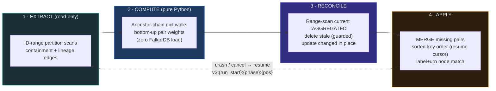

# Aggregation Materialization Pipeline

How `:AGGREGATED` rollup edges are computed and written to FalkorDB, and
how the system protects the graph provider while doing it. This replaces
the three legacy strategies (wipe-first bulk rebuild, epoch-swept
streaming rebuild, cursor-paged MERGE loop) with a single resumable
pipeline: **EXTRACT → COMPUTE → RECONCILE → APPLY**
(`backend/app/providers/falkordb_materialize.py`).

**Who it's for:** backend engineers working on aggregation, and operators
tuning or debugging materialization jobs on large graphs.

**What you'll find here:** the aggregation semantics and the structural
materialization boundary, the four pipeline phases, the resume model,
provider-protection controls, the full tuning knob reference, and the
completeness contract.

> **Note:** The pipeline is **resumable and non-destructive by design**. RECONCILE guards deletes with `latestUpdate < run_start`, and there is **no epoch sweep** — a failed or resumed run can never wipe good edges.

## Semantics

Given an ontology hierarchy (e.g. `Domain ⊃ Application ⊃ Database ⊃
Table ⊃ Column`), each lineage edge between two leaf nodes produces
`:AGGREGATED` edges for the **full cross-product of both ancestor
chains** — column→table, table→table, table→database, domain→domain, and
every other combination — weighted by the number of underlying lineage
edges and stamped with `sourceLevel`/`targetLevel` from the ontology's
entity-type levels. Containment and lineage edge types are the
ontology-resolved sets frozen onto the job row at trigger time; the
worker re-validates the ontology fingerprint before running.

**Materialization modes (auto by default).** The pipeline ESTIMATES
the full ancestor cross-product volume up front (one counting scan:
Σ ancestors(src)+1 × ancestors(tgt)+1 — a conservative upper bound) and,
when it fits `AGGREGATION_MAX_MATERIALIZED_EDGES`, stores the FULL CUBE:
every ancestor combination (column→table, table→table, column→domain,
…) physically exists, so every canvas granularity and expansion answers
from storage alone. Above budget it falls back to the structural
boundary below (`AGGREGATION_MATERIALIZE_FINE_PAIRS=true|false` forces a
mode; a forced cube over budget fails terminally, loudly). Known caveat
of boundary mode on SELF-NESTING types: the on-demand reader still
reasons in ontology type levels, so mixed-granularity drill answers can
be incomplete there — depth-aware on-demand reads are the tracked
follow-up; within-budget graphs never hit this because auto stores the
cube.

**The STRUCTURAL materialization boundary (the scale contract):**
only CANONICAL DEPTH-BRIDGED pairs are materialized: a node is a
container because it HAS CONTAINMENT CHILDREN (never because of its
ontology type — a self-nesting type like ``Node ⊃ Node ⊃ Node`` rolls
up at every nesting depth), and for each raw lineage edge and each
containment DEPTH d, the pair is each side's deepest container ancestor
at depth ≤ d. On graphs whose types encode the hierarchy
(domain ⊃ table ⊃ column) depth ≡ type level and the output is
identical to the previous level-based selection. Ontology type levels
survive as the ``sourceLevel``/``targetLevel`` STAMPS the read path
filters on (omitted when a label has no mapped level). On aligned chains that is exactly the
same-level diagonal — table→table, database→database, domain→domain. On
RAGGED chains (a column hanging directly under a domain, skipping
levels) it is the mixed-level cell the canvas shows at that granularity
(table→domain) — the cell a pure level-equality filter would silently
drop. Cross-level raw lineage (a raw table→database edge) falls out of
the same rule. Each raw edge contributes at most one pair per level,
and the per-level pair sets shrink monotonically going up the hierarchy
(database→database pairs are a quotient of table→table pairs), so this
is the minimal spanning set. Everything else is computed ON DEMAND by
`get_aggregated_edges_between`:

* pairs involving LEAF nodes (column→table, column→domain,
  column→column) — raw lineage fan-out from the requested leaf nodes
  plus `*0..k` upward containment walks (these scale as edges × depth
  if materialized; observed: 1.17M edges → 5.6M pairs → FalkorDB OOM);
* MIXED-LEVEL container pairs (table→domain, domain→table) — anchored
  on the finer endpoint's materialized canonical `:AGGREGATED` cells
  (far side at-or-below the finer level: each raw edge appears in
  exactly one such cell per anchored endpoint), with the coarser
  endpoint resolved by a STRICT upward walk. The derived sum is
  therefore disjoint from any directly-materialized canonical cell for
  the same pair (whose edges resolve AT the coarser endpoint), and the
  read path ADDS the two — exact weights even on doubly-ragged graphs.
  (Materializing these instead would scale with raw-edge count × depth²
  level combinations; observed: still 2.33M pairs on the same graph
  after only the leaf cut.)

All reads are index-driven and bounded by the visible set —
milliseconds even 8 levels deep on multi-million-edge graphs. Same
answers, same response shape. Trace is unaffected: trace-at-level reads
same-level cells (still materialized) and already uses raw edges at the
finest level. A hard write budget (`AGGREGATION_MAX_MATERIALIZED_EDGES`,
default 2M) fails a job loudly — terminally, no retries, with a
per-level composition breakdown in the error — rather than ever letting
a result OOM the shared instance. `AGGREGATION_MATERIALIZE_FINE_PAIRS=
true` restores the legacy full cube (budget-guarded); jobs without an
ontology level map — or with a SINGLE-LEVEL map (no container types) —
fall back to it automatically. An empty graph completes as a clean
no-op; a non-empty graph whose labels match no non-leaf ontology label
fails terminally (`MaterializationPreconditionFailed`, no retry burn)
instead of wiping. Coverage is verified by an exhaustive cross-product
matrix test (`test_full_cross_product_matrix_six_levels`): every
source-level × target-level combination on a 6-level hierarchy answers
exactly from canonical cells + on-demand derivation.

**Storage-regime gate.** The mixed-level derivation is exact ONLY
against canonical cells — run against a legacy/fine full cube it would
double-count every mixed weight. The pipeline stamps the regime
(`{graph}:agg:regime` = `boundary`/`fine`) into Redis on completion;
the reader gates the derivation on it, falling back to a cached graph
probe for non-conforming rows (NULL `aggKey`/`sourceLevel`). Unknown or
legacy state degrades to stored-only mixed answers (the original
behavior) — so the post-upgrade transition window and the fine-pairs
escape hatch can never inflate weights; they heal at the first
boundary-mode run. Incremental writers stay canonical too: the
versioning projector derives the same canonical selection from the
ontology level map (level-stamped, digest-stamped), and the write hook
alias-translates observed label spellings before level lookup. The
delete hook mirrors the write hook (shared chain/level resolution and
canonical selection) and only ever DECREMENTS: a pair is touched only
when SREM proves this edge's id was tracked in its `agg_members` set,
via the `AGGREGATED(aggKey)` index seek (weight 0 deletes the cell).
Untracked pairs — anything only the batch pipeline wrote, or after a
Redis flush — are deliberately left for the next reconcile; the old
SCARD-based overwrite/empty-set-delete could destroy pipeline-computed
cells (one raw deletion collapsing a 12,000-weight rollup).

Endpoints whose label is OUTSIDE the ontology (messy ingests) are
served as raw anchors (exact edges + upward rollups) rather than
dropped. Residual known gap: a mapped→unmapped pair whose raw edge
lands strictly BELOW the unmapped node is not derivable without
enumerating the unmapped subtree.

## Phases

1. **EXTRACT** (read-only): containment and lineage edges are scanned
   with fixed **ID-range partitions** (`WHERE ID(r) >= lo AND ID(r) <
   hi`, no ORDER BY/LIMIT) — tens of queries per edge type instead of the
   legacy thousands of sorted re-scans (which were O(E²) end-to-end and
   the main reason multi-million-edge graphs took hours).
2. **COMPUTE** (pure Python, zero FalkorDB load): ancestor chains are
   dict walks over the extracted child→parent map; pair weights are
   aggregated bottom-up through the ancestor lattice. Deterministic —
   a crashed run just recomputes (minutes). Memory is bounded by
   `AGGREGATION_MAX_PENDING_PAIRS`; overflow triggers an early flush
   with first-touch-overwrite semantics that keeps weights exact.
3. **RECONCILE**: the current `:AGGREGATED` set is range-scanned once;
   stale edges are deleted precisely (guarded by `latestUpdate <
   run_start`, so edges written during the run — by overflow flushes, a
   prior attempt, or `on_lineage_edge_written` — are never deleted),
   changed edges are updated in place. There is **no epoch sweep**: a
   failed or resumed run can never wipe good edges.
4. **APPLY**: missing pairs are MERGE-created in sorted-key order
   (deterministic resume cursor), with nodes matched by **label+urn**
   (per-label URN index seek) in both projection modes.

> **Caution: no ID-equality under UNWIND.** FalkorDB does not drive
> ``WHERE ID(n) = x`` from a NodeByIdSeek inside an UNWIND — it scans all
> nodes per row (observed: 30s+ per 5k-row batch on a 500k-node graph,
> producing a timeout/quiesce/retry loop). The pipeline therefore resolves
> node IDs → (urn, label) through a lazily-built, range-scanned **node
> directory** (one bounded pass; only loaded when a write/delete actually
> needs it), writes via label+urn MERGE, and deletes via the aggKey edge
> index. Internal IDs are used only in range predicates
> (``ID(x) >= lo AND ID(x) < hi``), which are cheap filters.

In steady state a re-run after small source changes writes only the
diff — near-zero load. Full recompute *is* the incremental strategy.

## Resume

The job cursor is `v3:{run_start_ms}:{phase}:{pos}` and is persisted from
the **first checkpoint**, before any graph work. Resume rules:

* `aggregate` phase (or a legacy/garbage cursor): restart from zero —
  cheap by design. Legacy `v2:` cursors from in-flight jobs at upgrade
  time resume as clean fresh runs **without wiping** existing edges; the
  first RECONCILE also cleans up any stale generations left by the old
  epoch machinery.
* `reconcile`: EXTRACT+COMPUTE re-run (deterministic), then the scan
  continues from its recorded range lower bound.
* `apply`: EXTRACT+COMPUTE and the full RECONCILE re-run; the rebuilt
  `existing` set already excludes everything the prior attempt wrote, so
  apply writes exactly the still-missing pairs. The recorded position is
  progress display only — fast-forwarding past it would skip pairs that
  are new since the crashed attempt. All writes are idempotent.

## Provider protection

* **Server-side query kill**: every deploy manifest now sets
  `TIMEOUT_MAX` (FalkorDB ignores per-query timeouts on *write* queries
  without it), `TIMEOUT_DEFAULT`, `MAX_QUEUED_QUERIES`,
  `QUERY_MEM_CAPACITY`, and — critically — `OMP_THREAD_COUNT 1`
  (unbounded per-query OpenMP threads on a big node under a small cgroup
  quota were the main cause of the 150% CPU spikes). See
  `docs/FALKORDB_DEPLOYMENT.md` for sizing rules.
* **Distributed admission control**
  (`backend/app/services/aggregation/admission.py`, on the job-bus
  Redis): a per-graph write lease (one materializing job per graph across
  all pods) and a per-endpoint write-slot semaphore
  (`FALKORDB_ENDPOINT_WRITE_SLOTS`, default 2) so an HPA-scaled worker
  fleet cannot stampede one FalkorDB. Fails **open** to the per-process
  limits if Redis is down.
* **Pacing**: every write sub-batch is AIMD-sized (shrinks on latency
  creep) and followed by `duration × AGGREGATION_WRITE_PACING_RATIO`
  sleep (default 0.5 → ≤ ~66% write duty cycle), on top of the existing
  per-process write semaphore and latency-quiesce circuit.
* **Progress-aware watchdog** (worker): a job is killed only when it
  makes no forward progress for `AGGREGATION_STALL_TIMEOUT_SECS`
  (default 900) or exceeds `AGGREGATION_JOB_MAX_WALL_SECS` (default
  86400). The old fixed 2-hour kill (which terminated healthy 3-hour
  jobs mid-flight) is gone; `job.timeout_secs` now overrides the stall
  window.

## Tuning

Resolution order per knob: **job `tuning` (frozen at trigger) → stored
global defaults (`GET/PUT /api/v1/admin/aggregation/settings`, editable
in the admin Defaults dialog) → env var → code default.** Per-job
overrides ride the trigger/resume APIs (`tuning` object with camelCase
fields mirroring the env vars below plus `extractConcurrency`); the
control plane freezes the merged dict onto the job row so workers stay
stateless. `batch_size` is deprecated (accepted, ignored by the
pipeline).

| Env var | Default | Meaning |
|---|---|---|
| `AGGREGATION_SCAN_RANGE_WIDTH` | 250000 | Edge-ID range width per scan query |
| `AGGREGATION_MAX_PENDING_PAIRS` | 5000000 | In-memory pair cap before overflow flush |
| `AGGREGATION_APPLY_CHUNK` | 20000 | Keys resolved+written per apply chunk |
| `AGGREGATION_DELETE_CHUNK` | 10000 | Stale edges deleted per query |
| `AGGREGATION_WRITE_PACING_RATIO` | 0.5 | Sleep-after-write ratio |
| `FALKORDB_SCAN_RANGE_TIMEOUT` | 30 | Per-scan-query timeout (s) |
| `AGGREGATION_SCAN_SHRINK_FLOOR` | 10000 | Smallest range width the shrink-on-timeout ladder descends to (a floor-width timeout is an outage and fails the run) |
| `AGGREGATION_MATERIALIZE_LEAF_PAIRS` | false | Restore leaf↔leaf mirror pairs (legacy mode only) |
| `AGGREGATION_MATERIALIZE_FINE_PAIRS` | false | Legacy full cube (leaf-involving + mixed-level pairs) |
| `AGGREGATION_MAX_MATERIALIZED_EDGES` | 2000000 | Hard write budget (fail loud, never OOM) |
| `FALKORDB_ENDPOINT_WRITE_SLOTS` | 2 | Cross-pod write budget per endpoint |
| `AGGREGATION_EXTRACT_CONCURRENCY` | 2 | Concurrent read-only range scans (waves) |
| `AGGREGATION_STALL_TIMEOUT_SECS` | 900 | Watchdog stall window |
| `AGGREGATION_JOB_MAX_WALL_SECS` | 86400 | Watchdog wall-clock safety net |
| `AGGREGATION_MEM_HIGH_WATER_PCT` | 75 | Worker defers new claims above this RSS/limit % |
| `AGGREGATION_LARGE_JOB_EDGE_THRESHOLD` | 500000 | Edge count classifying a job as "large" |
| `AGGREGATION_MAX_LARGE_JOBS_PER_WORKER` | 1 | Large jobs one worker may hold concurrently |
| `AGGREGATION_PENDING_NO_WORKER_SECS` | 900 | Reconciler fails pending rows this old when NO worker is registered (worker-less config detector) |
| `AGGREGATION_PENDING_TIMEOUT_SECS` | 21600 | Reconciler backstop for pending rows never picked up (lost dispatch) |

## Worker fleet

Each worker heartbeats a TTL'd registry entry (`agg:worker:{id}` on the
job-bus Redis) with its active jobs, large-job count, RSS vs cgroup
limit, and drain state. `GET /api/v1/admin/aggregation/workers` returns
the fleet plus job-stream depth (the right signal for queue-based HPA);
the workspace aggregation dashboard renders it as the Workers panel.
Before executing a delivered job, a worker applies the **memory-aware
claim policy** — draining, RSS above the high-water mark, or a second
"large" job (estimated edges over the threshold) are deferred by
re-enqueueing the job for an idle sibling, so one pod's big jobs can
never OOM-stack while another idles. SIGTERM flips drain (no new
claims; running jobs checkpoint and hand over via exec-lock expiry).
Every job records `worker_id`, and completed jobs persist `run_stats`
(per-phase durations + writes/deletes) shown in the job detail panel.

Memory budget per large job at 2M nodes / 5M edges: child→parent map
~200MB + accumulator (capped) ~250MB + ID cache ~125MB ≈ under 1GB;
worker pods ship with a 4Gi limit.

## Hardening wave (2026-07-10): what changed, why, and the impact

**12. Type-level boundary broke self-nesting graphs (2026-07-11,
live).** The canonical selection keyed on ontology TYPE levels, so any
type nesting under itself (``Node ⊃ Node`` — folders, systems,
components) made every intermediate container a "leaf": a live
two-type graph with 246 Node→Node containments materialized only 9
Roots→Roots cells and Context View showed no aggregated lineage below
the roots. The boundary is now STRUCTURAL (containment parents, ranked
by depth) across all three writers — pipeline, write/delete hooks,
versioning projector — with type levels kept as stamps. The old
label-mismatch precondition guard became obsolete (unmapped labels now
aggregate fine) and was replaced by a sharper one: declared containment
types matching ZERO edges while rollup cells exist fails loudly
instead of wiping them.

A full audit of this pipeline (old implementation vs the rewrite, plus
every integration edge) confirmed the EXTRACT→COMPUTE→RECONCILE→APPLY
core sound and found a ring of defects around it that kept production
failing. Each fix below records the SYMPTOM it removes, the root cause,
and the operational impact. All are covered by unit tests that failed
before the fix, plus the live suite (see Validation).

**1. Automatic re-aggregation was dead (trigger sources).** After every
purge — which deletes ALL `:AGGREGATED` edges — the promised rebuild
500'd against the jobs-table CHECK constraint (`post_purge` wasn't an
allowed `trigger_source`); the read-path backfill's `auto` died the
same way, silently. Container-level lineage stayed blank until someone
manually re-aggregated. Both values are now first-class
(`TRIGGER_SOURCES` in `models.py` builds the constraint; migration
`20260711_1200_agg_job_guards`), unknown sources 422 instead of 500,
and caller-minted `purge` rows are rejected (they mark the purge
lifecycle itself and are excluded from recovery). *Impact: purge and
empty-read backfill heal without operator action.*

**2. Crash recovery existed only in the monolith (topology).** The
lock-aware reconciler (exec-lock absent ⇒ auto-resume from
`last_cursor`) never started in the split topology: the dedicated
control plane didn't run it, and workers ACK stream messages BEFORE
executing by design. A worker crash mid-job sat `running` until the
scheduler's ~4h sweep marked it FAILED — the reported "jobs keep
breaking and I resume manually". The control plane now runs the
reconciler (advisory-lock guarded for replicas), the scheduler's
mark-failed sweep stands down whenever the job bus is available, and
the fallback sweep excludes purge rows (their progress is Redis-only,
so every >4h purge was being hijacked to failed). *Impact: worker
death → automatic resume from the last checkpoint in ~90s (lock TTL +
sweep interval), capped at 5 attempts; zero manual resumes for
transient crashes; purges can run long safely.*

**3. The load path used the banned scan-per-row pattern — with no
timeouts.** The versioning projector matched every edge endpoint with
unlabeled `MATCH (a {urn})` under UNWIND — a full node scan per row,
for EVERY edge of a full seed — as did its rollup upserts and deletes
(`MATCH ()-[r {id}]->()` was untyped and unindexed), and no projector
query carried a timeout, so the fleet's new `TIMEOUT_DEFAULT 30000`
killed big seed batches mid-load. All node lookups are now label+urn
index seeks (labels resolved from committed `entityType`s), edge
deletes are typed and endpoint-anchored, and every query carries
`PROJECTION_FALKOR_{WRITE,READ}_TIMEOUT_S`. The same fix on
`save_custom_graph`'s bulk path measured **~2000× (17min → 4s per 100k
edges)**. The lint test now scans `projection.py` and catches the
f-string brace form that had let `save_custom_graph` evade it.
*Impact: seeds and incremental projections scale as E·log N instead of
N·E, and a degraded write is killed by the server instead of outliving
the client.*

**4. The lineage-delete hook could destroy pipeline-written cells
(data loss).** `on_lineage_edge_deleted` overwrote `r.weight` from a
Redis SCARD — an accounting system the batch pipeline never populates —
and DELETED any pair whose members-set was empty, i.e. every
batch-written cell (the observed "12,000 → 1" class). It also built the
full ancestor cross-product instead of the canonical selection. It now
mirrors the write hook (shared chain/level resolution + canonical
pairs) and only ever DECREMENTS, gated on SREM proving this edge's
tracked contribution, via the `AGGREGATED(aggKey)` index seek; weight 0
deletes the cell in the same query. Untracked pairs are left for the
next reconcile. *Impact: a raw-edge deletion can never collapse or
delete a rollup it didn't contribute to; worst case is a briefly
stale-high weight that the next run reconciles.*

**5. One slow range scan failed the whole run.** Scan timeouts are
deliberately never retried at the connection layer (a slow query must
not be multiplied), so a briefly-busy server or one dense ID range sent
a multi-hour job back through worker retry into a full EXTRACT re-run.
`_fetch_range` now halves the failing range down to
`AGGREGATION_SCAN_SHRINK_FLOOR` (sticky for the rest of the run,
re-growing after sustained health); only a floor-width timeout — an
outage, not payload size — still fails the run. *Impact: multi-hour
jobs absorb transient provider slowness instead of restarting; a
partial scan is never silently treated as complete.*

**6. Apply-resume could skip pairs (completeness).** The apply-phase
cursor fast-forward bisected past every key ≤ the recorded position —
including pairs NEW since the crashed attempt that happened to sort
before it. RECONCILE re-runs fully on resume and already excludes
everything the prior attempt wrote, so the bisect was a redundant
optimization with a correctness hole; it is removed and the recorded
position is progress display only. *Impact: resume is exactly
complete — proven live by resuming past every computed key.*

**7. Keyed deletes could run as full scans (index readiness).**
FalkorDB builds indexes in the background; nothing waited for
`AGGREGATED(aggKey)` readiness, so a first run against a large existing
set executed every keyed delete as a full relation scan. The reconcile
phase now polls `db.indexes()` (bounded 60s, version-tolerant,
WARN-and-proceed — an optimization gate, never a correctness one).

**8. Case-sensitivity could silently skip whole types (completeness).**
FalkorDB matching is case-sensitive and the alias map was the only
spelling seam — a casing present in the graph but absent from the map
scanned zero edges, and worker-run jobs inject no entity aliases at
all. The pipeline now probes `db.relationshipTypes()`/`db.labels()`
once per run and unions case-fold variants for every declared spelling
(including graphs holding SEVERAL casings of one type, where
half-scanned containment breaks ancestor chains); a declared type that
matches NOTHING observed warns loudly instead of aggregating nothing in
silence. *Impact: onboarded graphs aggregate correctly whether or not
their casing matches the ontology, and vocabulary mismatches are
diagnosable from the job log.*

**9. Idempotency-key reuse 500'd.** `ix_agg_jobs_idem_active` was
unique forever despite its name while the replay window is 60 minutes,
so a key reused later collided with a completed row's tombstone. The
index now covers only ACTIVE rows (same migration as #1) and a
concurrent-trigger race replays the winner's job instead of surfacing
an IntegrityError.

**10. Unbounded read sorts.** The `get_aggregated_edges_between` main
queries carried `ORDER BY r.weight DESC` with no LIMIT — every 5k-urn
batch materialized and sorted its full match set server-side before
Python truncated. The existing `AGGREGATED_EDGE_RESULT_CAP` now rides
in the Cypher; response semantics are unchanged (top-N by weight).

**11. The instance itself had no memory ceiling.** `QUERY_MEM_CAPACITY`
bounds one query; nothing bounded the dataset, so graph growth still
OOM-killed the pod — the incident class the write budget guards
against, from the OS side. Every manifest now passes `REDIS_ARGS`
`--maxmemory` (75% of the container limit; `FALKORDB_MAXMEMORY` in
compose) with `noeviction`, verified against `falkordb/falkordb:v4.16.0`.
*Impact: two-layer protection — the write budget fails a job loudly
before writing an oversized result, and maxmemory fails writes loudly
if anything else grows the instance — the pod is never OOM-killed into
a LOADING/replay cycle.*

**Completeness contract (what the caps do and do NOT do).** No cap in
this pipeline silently drops aggregations: EXTRACT tiles the full ID
space (a floor-width timeout fails the run rather than passing a
partial scan off as complete); the pending-pairs cap is a flush
trigger with exact weight semantics; the write budget fails terminally
and loudly with a per-level composition breakdown (raise it via tuning
when the instance has headroom); endpoints deleted mid-run are dropped
WITH a warning and recomputed next run; read-path caps are response
top-N contracts over complete stored data. The live suite pins the
observable contract: exact cells/weights/level stamps under mixed
casing, exact deltas on re-run, zero-touch no-op runs, and complete
apply after resume.

## Removed (release notes)

* `AGGREGATION_BULK_REBUILD_ENABLED` / `AGGREGATION_STREAMING_REBUILD_ENABLED`
  env flags and all three legacy strategies. Rollback = version rollback.
* The `aggEpoch` edge property is no longer written and its index is no
  longer created; stale epochs are cleaned by the first RECONCILE.
* Job phase IDs changed to `extracting / computing / reconciling /
  applying` (UI label map updated; unknown phases degrade to a generic
  label, so mixed-version windows are safe).
* `AGGREGATION_JOB_TIMEOUT_SECS` no longer bounds a running job (the
  control-plane scheduler still uses it as a stale-row backstop).

## Validation

`backend/scripts/benchmark_aggregation_scan.py` seeds a synthetic graph
into a live FalkorDB and verifies the pipeline's benchmark-gated
assumptions: ID-range scan cost vs the legacy sorted page scan, ID-seek
MERGE vs label+urn MERGE, and that a pathological write is killed
server-side at its timeout (requires `TIMEOUT_MAX`). Unit coverage lives
in `backend/tests/test_falkordb_materialize.py` (semantics, exact
weights under overflow and cancel+resume, no-op re-runs, guarded
deletes) and `backend/tests/test_aggregation_admission.py`.
`backend/tests/integration/test_aggregation_pipeline_live.py`
(`RUN_FALKOR_LIVE=1`) proves the completeness contract on a REAL
engine: mixed-case seed → exact canonical cells/weights/level stamps,
mutate → exact diff, unchanged re-run → zero writes with `latestUpdate`
frozen, resume-mid-apply → every missing pair created, and the
`db.indexes()` shape the readiness probe parses.

**Worker-crash soak (manual):** seed 2M/5M via the benchmark script,
trigger via the UI with the worker container running, then
`docker restart` the worker mid-APPLY — the control plane's reconciler
auto-resumes from `last_cursor` (watch for "auto-resume #1"), no edge
is wiped, and the re-run converges to a zero-write diff.

---

## Related

- [Data Architecture](/docs/data-architecture) — the graph data model, aggregated-edge shape, and Redis job bus
- [Decisions](/docs/decisions) — ADR-020/021/022 (FalkorDB client, Redis roles) that underpin provider protection
- [Architecture](/docs/architecture) — where the aggregation control plane and worker fleet sit in the topology
- [Services Overview](/docs/services-overview) — the WORKER and CONTROLPLANE roles that run this pipeline
- [Technical Debt](/docs/technical-debt) — related scaling and observability gaps
