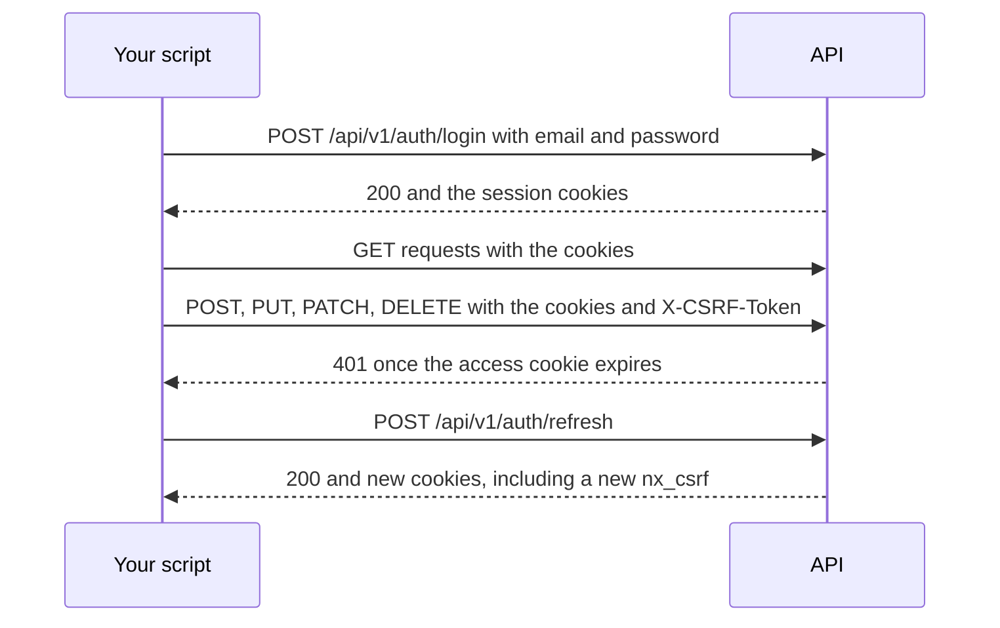

# API Guide for Integrators

*For integrators — anyone who scripts against the API or automates {brand}.*

This page gets a script signed in, shows you where to find any endpoint, explains the
conventions every endpoint shares, and walks through the six integrations people build
most often. Each recipe is a short procedure with the real request.

> **Before you start:** you need the address you open the app at, and an account that holds
> the permissions your task needs (each recipe says which). Scripts sign in with that
> account's password — there are no API tokens yet. You also need `curl` and `jq`, or Python
> 3 with `requests` or `httpx`.

## Your path

1. **API Guide for Integrators** — this page: sign in, find endpoints, conventions, recipes.
2. [Search & Display Rules: developer reference](/docs/feature-search-and-rules-reference) —
   the query model and every search and view-library endpoint, with curl recipes.
3. [Versioning API reference](/docs/versioning-api-reference) — drafts, publishing, history,
   imports and exports over HTTP.
4. [Import / Export](/docs/versioning-import-export) — how a bulk file is read, matched to
   what is already there, and applied.
5. [View portability](/docs/feature-view-portability) — the view file format and the checks
   an import runs.
6. [Feature Switches API](/docs/api-features) — which administrator switch turns which
   endpoint off.

## Sign in from a script

There are no API keys, bearer tokens or service accounts yet. A script signs in the way the
browser does: it posts a password, keeps the session cookies, and copies one cookie into a
header on every write. The script acts as the account it signs in with, and every change it
makes is recorded under that person's name — so use an account that holds only what the
script needs.



1. **Sign in.** `POST /api/v1/auth/login` with `{"email": …, "password": …}`. A `200` sets
   four cookies: `nx_access` (the session, `HttpOnly`), `nx_refresh` (sent only to
   `/api/v1/auth/` routes), `nx_access_exp` (when `nx_access` expires, as Unix seconds) and
   `nx_csrf`. Where the deployment sets `AUTH_ENVIRONMENT_ID`, every name carries it as a
   suffix — `nx_csrf_production` — so match the cookies by prefix.
2. **Send the cookies back** on every request.
3. **On every `POST`, `PUT`, `PATCH` and `DELETE`, send `X-CSRF-Token`** with the current
   value of the `nx_csrf` cookie. Reads that are `POST`s — search, trace — need it too.
   Without it the answer is `403` with `{"detail": {"error": "csrf_failed", …}}`.
4. **Renew before the session lapses.** The access cookie lasts 15 minutes in the shipped
   configuration (`JWT_EXPIRY_MINUTES`). `POST /api/v1/auth/refresh` replaces every cookie,
   `nx_csrf` included, so read `nx_csrf` again after renewing. The simplest rule: on a `401`,
   renew once and retry. A session still ends after 7 days, or after 12 idle hours
   (`SESSION_ABSOLUTE_MAX_HOURS`, `SESSION_IDLE_MAX_HOURS`); then sign in again.
5. **Sign out** when the script finishes: `POST /api/v1/auth/logout`.

### curl

```bash
B=https://lineage.example.com        # the address you open the app at
JAR=$(mktemp)                        # the session's cookies; delete it when you're done

jq -n --arg email "$API_EMAIL" --arg password "$API_PASSWORD" '{$email, $password}' |
  curl -sS -c "$JAR" -X POST "$B/api/v1/auth/login" \
       -H 'Content-Type: application/json' -d @- -o /dev/null -w '%{http_code}\n'

csrf() { awk '$6 ~ /^nx_csrf/ {print $7}' "$JAR"; }
api() {   # api METHOD PATH [more curl options]
  local method=$1 path=$2; shift 2
  curl -sS -b "$JAR" -c "$JAR" -X "$method" "$B$path" \
       -H "X-CSRF-Token: $(csrf)" -H 'Content-Type: application/json' "$@"
}

api GET /api/v1/auth/me | jq -r .user.email
```

```text
200
you@example.com
```

`api` reads the CSRF cookie afresh on every call and writes rotated cookies back to the jar,
so `api POST /api/v1/auth/refresh` is all a long-running script needs to renew. The recipes
below use `B`, `api` and `jq`. Building the login body with `jq` keeps a password that holds
quotes intact and off the command line. The search reference's
[Signing in from a script](/docs/feature-search-and-rules-reference#signing-in-from-a-script)
shows the same sign-in with the token read once into a fixed header list — fine for a session
shorter than 15 minutes.

### Python with requests

```python
import os
import requests

BASE = os.environ["API_BASE"]                      # e.g. https://lineage.example.com
WRITES = {"POST", "PUT", "PATCH", "DELETE"}

session = requests.Session()
session.post(f"{BASE}/api/v1/auth/login",
             json={"email": os.environ["API_EMAIL"], "password": os.environ["API_PASSWORD"]}
             ).raise_for_status()


def csrf_token():
    # A suffix follows the name where AUTH_ENVIRONMENT_ID is set: nx_csrf_production.
    return next(c.value for c in session.cookies if c.name.startswith("nx_csrf"))


def call(method, path, **kwargs):
    """One API call: sends the CSRF header on writes, renews the session once on a 401."""
    for attempt in (1, 2):
        headers = dict(kwargs.pop("headers", {}))
        if method.upper() in WRITES:
            headers["X-CSRF-Token"] = csrf_token()
        response = session.request(method, f"{BASE}{path}", headers=headers, **kwargs)
        if response.status_code != 401 or attempt == 2:
            return response
        session.post(f"{BASE}/api/v1/auth/refresh").raise_for_status()


print(call("GET", "/api/v1/auth/me").json()["user"]["email"])
```

### Python with httpx

```python
import os
import httpx

WRITES = {"POST", "PUT", "PATCH", "DELETE"}


def sign_in(base_url, email, password):
    client = httpx.Client(base_url=base_url, timeout=150)

    def add_csrf(request):
        if request.method in WRITES:
            token = next((c.value for c in client.cookies.jar if c.name.startswith("nx_csrf")), None)
            if token:
                request.headers["X-CSRF-Token"] = token

    client.event_hooks["request"] = [add_csrf]
    client.post("/api/v1/auth/login", json={"email": email, "password": password}).raise_for_status()
    return client


api = sign_in(os.environ["API_BASE"], os.environ["API_EMAIL"], os.environ["API_PASSWORD"])
print(api.get("/api/v1/auth/me").json()["user"]["email"])
```

The hook reads the cookie jar on every request, so a renewal (`api.post("/api/v1/auth/refresh")`)
needs nothing else. The 150-second timeout leaves room for the slowest routes, which the server
stops at 120 seconds.

### Verify

`GET /api/v1/auth/me` answers `200` with your account under `user`, and a write answers
anything but `403 csrf_failed` — for example `404` for a workspace that doesn't exist.

### When sign-in is refused

| Answer | Why | What to do |
|---|---|---|
| `401` `"Invalid email or password"` | Wrong email or password | Check both. Only failures count toward the limit below |
| `429` with `Retry-After` | Too many failed sign-ins for this account in a short time (`RATELIMIT_LOGIN_PER_ACCOUNT`) | Wait the number of seconds in `Retry-After`, then check the password |
| `403` `local_login_disabled` | Password sign-in is switched off for single sign-on | Only system (break-glass) accounts keep a password. Ask your administrator before automating with one |
| `403` `csrf_failed` on sign-in | Your client sent an `Origin` or `Referer` that isn't the deployment's own address or in `CORS_ALLOWED_ORIGINS` | Send neither header, as curl and Python do by default |
| Every later request is `401` | Over plain `http`, the cookies are `Secure` and your client drops them | Use `https`. Only a development stack with `AUTH_COOKIE_SECURE=false` works over `http` |

## Find the endpoint you need

The live OpenAPI explorer lists every route with its parameters and request and response
shapes. Where to open it:

| Where you are | Explorer (Swagger UI) | ReDoc | Machine-readable schema |
|---|---|---|---|
| The app's address, through its web proxy | `/viz-docs` | `/viz-redoc` | `/openapi.json` |
| The API service itself — on a development stack, `http://localhost:8000` | `/docs` | `/redoc` | `/openapi.json` |

> **Note:** On the app's address, `/docs` is this documentation, not the explorer — use
> `/viz-docs` there.

> **If you don't see the explorer:** it is switched off when the API runs with `ENV` set to
> `prod` or `production`. `API_DOCS_ENABLED=true` serves it anyway — operators who do that
> should put it behind their own access control. Ask your operator which applies.

The schema is easy to search from a script:

```bash
curl -s "$B/openapi.json" | jq -r '.paths | keys[]' | grep '/versioning/'
```

For how the routers are grouped and which code owns each, see [Backend](/docs/backend).
Routes the explorer marks **deprecated** still answer, but build nothing new on them.

## Conventions every endpoint follows

### Paths and identifiers

- Everything is under `/api/v1`.
- The data plane is scoped to a workspace: `/api/v1/{ws_id}/graph/…`,
  `/api/v1/{ws_id}/versioning/…`, `/api/v1/{ws_id}/assets/…`,
  `/api/v1/{ws_id}/context-models/…`. Add `?dataSourceId=ds_…` to choose a data source —
  without it, the workspace's primary data source answers — and `?branchId=…` to read or
  write a draft instead of the published graph.
- Views are not workspace-scoped: `/api/v1/views/…`. Administration is under
  `/api/v1/admin/…`.
- Ids carry a prefix: workspaces `ws_…`, data sources `ds_…`, views `view_…`.
  `GET /api/v1/admin/workspaces` lists the workspaces you belong to, each with its
  `dataSources`:

  ```bash
  api GET /api/v1/admin/workspaces | jq '.[] | {id, name, dataSources: [.dataSources[] | {id, label, isPrimary}]}'
  ```

- A URN in a path segment must be percent-encoded: URNs hold `/` and `:`, and an encoded
  `%2F` stays inside its segment. `jq` does it for you:

  ```bash
  api GET "/api/v1/$WS/graph/nodes/$(jq -rn --arg u "$URN" '$u|@uri')?dataSourceId=$DS"
  ```

- JSON keys are camelCase. A few older answers use snake_case; the explorer shows each
  route's exact shape.
- An id that belongs to a different workspace from the one in the path answers `404`, never
  `403`, so whether it exists never leaks across workspaces.

### Errors

Errors come back as `{"detail": …}`. `detail` is a sentence, a list (for a request that
doesn't match the model, `422`), or an object that names the reason in one of three keys:

| Key | Examples | Who sends it |
|---|---|---|
| `type` | `feature_disabled`, `merge_conflict`, `ontology_violation`, `not_up_to_date`, `graph_too_large_to_sync` | Feature switches and the versioned graph |
| `code` | `PROVIDER_BUSY`, `PROVIDER_UNAVAILABLE`, `PROVIDER_TIMEOUT`, `REQUEST_TIMEOUT`, `EXPORTS_BUSY`, `CONFLICT`, `VALIDATION` | The graph store's health, timeouts, exports, the feature-switch API |
| `error` | `csrf_failed`, `local_login_disabled`, `session_foreign`, `sso_reauth_required` | Sign-in and the session |

A feature an administrator switched off answers the same way everywhere:

```json
{"detail": {"type": "feature_disabled", "feature": "traceEnabled",
            "message": "Lineage tracing is turned off for this deployment. An administrator can enable it under Admin → Features."}}
```

Two answers break the envelope: the retired trace route answers `{"error": {"code", "message",
"details"}}` (below), and a per-address rate limit answers `{"error": "Rate limit exceeded: …"}`.

| Status | Means |
|---|---|
| `400` | A rule of the request broken (a value out of range, an invalid combination) |
| `401` | Not signed in, or the session expired — renew and retry |
| `403` | Not allowed; a feature switched off (`feature_disabled`); the CSRF header missing (`csrf_failed`) |
| `404` | Not found, or in a workspace you can't see |
| `409` | A conflict: someone else changed it first, a draft is behind its published graph, a job is already running |
| `410` | A retired route (below) |
| `413` | The request body is too large |
| `422` | The body doesn't match the model, or breaks a rule of the data (an ontology violation) |
| `429` | Too busy right now, or too many attempts — see below |
| `503` | A dependency is starting or recovering |
| `504` | The request ran past its time limit |

### When the server sheds load

`429`, `503` and `504` are "not now", not "no". When they carry `Retry-After`, wait that many
seconds and send the same request again:

| Answer | `detail.code` | What happened |
|---|---|---|
| `429` | `PROVIDER_BUSY` | The graph store, or your workspace's share of it, is at capacity |
| `429` | `EXPORTS_BUSY` | Every export turn on the server is taken (`Retry-After: 120`) |
| `503` | `PROVIDER_LOADING`, `PROVIDER_FAILING_OVER`, `PROVIDER_UNAVAILABLE` | The graph store is starting, failing over, or not answering |
| `503` | `DB_UNAVAILABLE` | A database or Redis call failed |
| `504` | `REQUEST_TIMEOUT`, `PROVIDER_TIMEOUT` | The request, or one graph query, ran out of time |

A `429` with no `Retry-After` comes from a per-address limit: back off for a while before you
retry. Never retry a `400`, `403`, `404` or `422` unchanged — it will fail the same way.

### Retired routes answer 410

A route that has been retired answers `410 Gone` with RFC 8594 headers: `Sunset` (the
retirement date), `Deprecation: true`, and a `Link` to its successor. Today one route does:
`POST /api/v1/{ws_id}/graph/trace`.

> **Note:** That route's `Link` header and body point at `/api/v2/{ws_id}/graph/trace`, which
> this release does not serve. Use `POST /api/v1/{ws_id}/graph/trace/v2` —
> see [Run a lineage trace](#run-a-lineage-trace).

### Lists and paging

There is no single paging scheme; each route documents its own in the explorer.

- **Offset paging** (`limit`, `offset`) on most lists. `GET /api/v1/views/` answers
  `{items, total, hasMore, nextOffset}`; the versioning lists answer a plain array — stop
  when a page comes back shorter than `limit`. `GET /api/v1/admin/workspaces` sends the total
  in `X-Total-Count` when you pass `limit`.
- **Cursors** on long or changing lists: search hands back `cursor`, an entity's history
  hands back `nextBefore`. Send the value back as-is.

### Caching and concurrent edits

- A few frequently polled reads (announcements, the search schema, the graph schema, cached
  statistics) send an `ETag`. Send it back as `If-None-Match` to get `304 Not Modified` when
  nothing changed.
- Writes don't use `If-Match`. Where a write guards against a lost update, the token is in the
  body — `version` on feature switches, `baseVersion` on a graph edit, `expectedVersion` on
  branding — and a stale token answers `409`. Read again, re-apply your change, and retry.

### Size and time limits

| Limit | Default | Applies to | Answer when exceeded |
|---|---|---|---|
| Request body | 8 MB (`MAX_REQUEST_BODY_BYTES`) | Most routes | `413` |
| Request body | 100 MB (`MAX_IMPORT_BODY_BYTES`) | Imports, `/versioning/` routes, view-file routes | `413` |
| Request body through the web proxy | 100 MB | Every `/api/` route | `413` from the proxy |
| Time | 30 s (`HTTP_TIMEOUT_DEFAULT_SECS`) | Most routes | `504 REQUEST_TIMEOUT` |
| Time | 120 s | `/graph/` routes — trace and search included; the rolled-up edge reads get 90 s — and `/versioning/` and view-transfer routes | `504 REQUEST_TIMEOUT` |

Streamed exports and stored exports' downloads have no time limit. Files larger than 100 MB go
in parts — see [Bulk import and export graph data](#bulk-import-and-export-graph-data).

## Recipes

Each recipe assumes the curl sign-in above (`B` and `api`). Set `WS` and `DS` to your workspace
and data source ids first.

### Tell the platform a data source changed

**Needs:** `workspace:datasource:manage` in the data source's workspace.

When something outside {brand} loads data into a graph, the platform notices on its own: a
drift probe reads the graph's counts every minute (`AGGREGATION_PROBE_INTERVAL_SECS`, 60 s by
default) and queues a rebuild of the rollups when they moved. Signal only when you need the
rebuild to start the moment your load finishes.

1. Signal the change, saying why:

   ```bash
   api POST "/api/v1/admin/data-sources/$DS/refresh" -d '{"scope": "auto", "reason": "nightly load finished"}'
   ```

2. Read the answer. `gate` is `changed` when your load moved the graph and a rebuild was
   queued (`jobId`), or `unchanged` when nothing moved — a success, not a failure.

   ```json
   {"scope": "auto", "gate": "changed", "changed": true, "jobId": "agg_…", "deferred": false,
    "actions": ["marker_set", "content_cleared", "stats_nudged", "rebuild_queued"], "eventId": "…"}
   ```

3. Follow the rebuild until `aggregationStatus` is `ready`:

   ```bash
   api GET "/api/v1/admin/data-sources/$DS/readiness" | jq '{aggregationStatus, isReady, driftState}'
   ```

To wait in the same call, send `"wait": "complete"`: the answer comes when the rebuild ends,
or after 60 seconds with `job:timeout` in `actions`. Leave `force` off — it queues a rebuild
whether or not anything changed, and on a large graph that is minutes of work for nothing.
The scopes, the batch verbs and how to check a signal worked are in
[Telling us an external data source changed](/docs/feature-external-change-notification).

### Publish a search and display-rule library

**Needs:** edit access on every target view — you created it, you hold `workspace:view:edit`
in its workspace, or you have an editor grant on it. A dry run needs edit access too.

A library pack (`*.library.json`) carries a view's display rules and saved queries.

1. Export the pack from a view you've set up:

   ```bash
   api GET "/api/v1/views/$VIEW/library/export" -OJ        # saves <view name>.library.json
   ```

2. Dry-run it against the target view. `dryRun` is `true` unless you say otherwise, so this
   changes nothing:

   ```bash
   api POST "/api/v1/views/$TARGET/library/import?strategy=merge" \
       --data-binary @"Data-Lineage.library.json" | jq '{added, skipped, refused, items}'
   ```

3. Read `items`: every rule and query says `add`, `skip` or `refuse`, with the reason.
4. Import for real by sending the same request with `dryRun=false`.

To publish one pack to every view of a data source, the script in the repository lists the
views you can read and imports into each — a dry run unless you pass `--apply`. Run it from a
checkout of the repository; it needs only Python's standard library:

```bash
export SYNODIC_BASE_URL=$B SYNODIC_EMAIL=you@example.com     # it asks for the password
python -m backend.scripts.publish_view_library governance.library.json --data-source "$DS"
python -m backend.scripts.publish_view_library governance.library.json --data-source "$DS" --apply
```

The pack format, the strategies (`merge`, `copy`, `replace`) and the script's exit codes are in
[Search & Display Rules: developer reference](/docs/feature-search-and-rules-reference).

### Move views between environments

**Needs:** the **View versions, import and export** switch on in both environments — it ships
off (`viewPortabilityEnabled`). Read access to the views you export; in the target,
`workspace:view:create` in the workspace for a new view, or edit access to update one.

A view file (`*.view.json`) carries a view's design — its layers, assignments, rules and
settings — and is checked against the target's graph before anything is written.

1. In the source environment, export the view:

   ```bash
   api POST /api/v1/views/transfer/export -d '{"views": [{"viewId": "view_abc"}]}' -OJ
   ```

   The file is named for the view and its version, such as `finance-lineage.v7.view.json`.
2. Sign in to the target environment, and inspect the file. Nothing is written:

   ```bash
   api POST /api/v1/views/transfer/inspect --data-binary @finance-lineage.v7.view.json > inspect.json
   jq '{integrity, targetSuggestions}' inspect.json
   ```

   `targetSuggestions` ranks the data sources here that the file most likely belongs to.
3. Check the first view against your chosen data source. Nothing is written:

   ```bash
   jq --arg ws "$WS" --arg ds "$DS" '{views: [.views[0] | {
         key: "v1", portableId, definition, viewType: .metadata.viewType, manifest,
         history: [.history[].hash],
         target: {workspaceId: $ws, dataSourceId: $ds}, action: "create"}]}' inspect.json |
     api POST /api/v1/views/transfer/reconcile -d @- > reconcile.json
   jq '.views[0].report.summary | {verdict, verdictReason}' reconcile.json
   ```

   The verdict is `ready`, `attention` (something didn't match — read the report) or
   `blocked` (the view's type isn't enabled here, or it looks like a different graph).
4. Import it as a new view. It arrives **Private** unless you add `visibility` to `metadata`:

   ```bash
   jq -n --arg ws "$WS" --arg ds "$DS" --arg rid "move-$(date +%s)" \
         --slurpfile i inspect.json --slurpfile r reconcile.json '
     ($i[0].views[0]) as $v | {
       action: "create", target: {workspaceId: $ws, dataSourceId: $ds},
       metadata: $v.metadata, definition: $r[0].views[0].effectiveDefinition,
       origin: {portableId: $v.portableId, sourceViewId: $v.sourceViewId, version: $v.version,
                definitionHash: $v.definitionHash, name: $v.metadata.name},
       manifest: $v.manifest, history: $v.history, requestId: $rid}' |
     api POST /api/v1/views/transfer/import -d @- | jq '{integrity}'
   ```

   Keep the `requestId`: sending the same request again returns the first result, so a retry
   never creates a second view.

To update a view that already exists, use `"action": "update"` and `"target": {"viewId": …}`.
The actions, merge strategy, staging into a draft and the limits are in
[View portability](/docs/feature-view-portability).

### Bulk import and export graph data

**Needs:** version control on for the data source, and the **Version control** switch on
(`versioningEnabled`). Importing needs `workspace:datasource:manage`; exporting needs
`workspace:datasource:read` and the **Export graph data** switch on (`graphExportEnabled`).

An import never writes to the published graph: it lands in a draft, which you review and
publish.

1. Find the data source's versioned graph:

   ```bash
   GID=$(api GET "/api/v1/$WS/versioning/resolve?dataSourceId=$DS" | jq -r .graphId)
   ```

   A `404` means version control isn't on for this data source.
2. For a file up to 100 MB, send it as the request body. The answer is `202` with the import
   job and the draft it writes to:

   ```bash
   api POST "/api/v1/$WS/versioning/graphs/$GID/imports?format=ndjson&reconcileMode=upsert" \
       --data-binary @lineage.ndjson | jq '{jobId, branchId, status}'
   ```

   `reconcileMode=replace` also deletes everything in scope that the file doesn't mention.
3. For a larger file — up to 10 GiB as NDJSON, CSV or TSV; JSON and Excel files stay at
   100 MB — send it in parts instead. Ask for an upload, send each part (numbered from `0`),
   then complete it:

   ```bash
   SIZE=$(wc -c < lineage.ndjson)
   UP=$(api POST "/api/v1/$WS/versioning/graphs/$GID/imports/uploads" \
            -d "{\"fileName\": \"lineage.ndjson\", \"size\": $SIZE, \"format\": \"ndjson\"}")
   ID=$(jq -r .uploadId <<<"$UP"); PART=$(jq -r .partBytes <<<"$UP"); PARTS=$(jq -r .parts <<<"$UP")
   for ((n = 0; n < PARTS; n++)); do
     (( n > 0 && n % 20 == 0 )) && api POST /api/v1/auth/refresh -o /dev/null   # stay signed in
     dd if=lineage.ndjson bs="$PART" skip="$n" count=1 2>/dev/null |
       api PUT "/api/v1/$WS/versioning/graphs/$GID/imports/uploads/$ID/parts/$n" --data-binary @- -o /dev/null
   done
   api POST "/api/v1/$WS/versioning/graphs/$GID/imports/uploads/$ID/complete?reconcileMode=upsert" | jq .
   ```

   If the loop stops, `GET …/imports/uploads/$ID` lists the parts already `received`; send
   the others and complete. An upload has a day to finish.
4. Poll the job until `status` is `completed` (or `failed`, with `errorMessage`):

   ```bash
   api GET "/api/v1/$WS/versioning/graphs/$GID/imports/$JOB" | jq '{status, summary, errorMessage}'
   ```

5. Review the draft (`branchId` from step 2), then publish it:

   ```bash
   api POST "/api/v1/$WS/versioning/graphs/$GID/branches/$BRANCH/publish" -d '{"message": "Nightly import"}'
   ```

   A `409 not_up_to_date` means the published graph moved since the draft began: pull the
   latest in with `POST …/branches/$BRANCH/rebase` (body `{}`), then publish again. A draft
   that changes more than 20,000 entities publishes as a job: the answer is `202` with a
   `jobId` to poll at `GET …/graphs/$GID/publish-jobs/$JOB`.

To export, ask the workers to write the file, then download it — the download resumes:

```bash
JOB=$(api POST "/api/v1/$WS/versioning/graphs/$GID/exports?format=ndjson" | jq -r .jobId)
api GET "/api/v1/$WS/versioning/graphs/$GID/exports/$JOB" | jq '{status, summary}'   # until "completed"
api GET "/api/v1/$WS/versioning/graphs/$GID/exports/$JOB/download" -C - -o lineage-export.ndjson
```

`-C -` makes curl send a `Range` for what it already has, so an interrupted download carries
on where it stopped. A finished export is kept for a day. For a data source without version
control, stream it instead: `GET /api/v1/$WS/graph/export/stream?dataSourceId=$DS&format=ndjson`
(this one doesn't resume). The formats, columns and limits are in
[Import / Export](/docs/versioning-import-export).

### Run a lineage trace

**Needs:** `workspace:datasource:read` in the workspace — or a view you can read, passed as
`?viewId=` — and the **Lineage trace** switch on (`traceEnabled`).

1. Find the entity's URN. A free-text search returns matching nodes:

   ```bash
   api POST "/api/v1/$WS/graph/search?dataSourceId=$DS" -d '{"query": "orders", "limit": 5}' |
     jq -r '.[] | [.urn, .entityType, .displayName] | @tsv'
   ```

2. Trace it. Only `urn` is required; this asks for five hops downstream, rolled up to the
   level of the `dataset` entity type:

   ```bash
   api POST "/api/v1/$WS/graph/trace/v2?dataSourceId=$DS" -d '{
     "urn": "urn:li:dataset:orders", "direction": "downstream",
     "downstreamDepth": 5, "level": "dataset"}' > trace.json
   jq '{focus, effectiveLevel, nodes: (.nodes | length), downstream: (.downstreamUrns | length),
        truncated, truncationReason}' trace.json
   ```

3. Read the answer:

   | Field | What it holds |
   |---|---|
   | `nodes` | Every entity in the trace, plus each one's containment ancestors up to the top level |
   | `edges` | The lineage between them: `AGGREGATED` rollup edges at the level you asked for (`properties.weight` counts the underlying edges, `properties.sourceEdgeTypes` names their types), or the raw lineage type at the finest level |
   | `containmentEdges` | The parent → child edges that place each node |
   | `upstreamUrns`, `downstreamUrns` | Which nodes are on which side of the focus |
   | `focus` | `{urn, level, entityType}` of the node you traced |
   | `truncated`, `truncationReason` | `true` when a cap stopped the walk, with why (`max_nodes`, `timeout`, `degree_cap`, …) |

   A cap never fails a trace: it answers `200` with what it found and marks it `truncated`.
   The caps are server settings: `TRACE_MAX_NODES` (2,000 nodes) and `TRACE_TIMEOUT_SECS`
   (120 seconds).
4. To drill into a rolled-up edge, send its two ends to `POST …/graph/trace/expand` with
   `{"sourceUrn", "targetUrn", "nextLevel"}`, or many at once to `POST …/graph/trace/expand-batch`
   with `{"pairs": [{"sourceUrn", "targetUrn", "nextLevel"}, …]}`.

| If you want | Use | Because |
|---|---|---|
| Lineage at one level of the hierarchy (domains, datasets, …) | `trace/v2` with `level` | It reads the rollups, so its cost follows the answer's size, not the graph's |
| Exact lineage at the finest grain, page by page | `trace/closure` | It walks raw lineage edges from the focus, at most 25 hops per request, and hands back where to continue (`frontierUp`, `frontierDown`, `seedCursor`) |
| What a draft would change | Either, with `&branchId=…` | Both read the draft instead of the published graph |

`level` takes `0` (the top of the hierarchy — the default), another level number, or an
entity type id such as `"dataset"`. The full request models are in the explorer under
`graph:workspace`.

### Integrate single sign-on over a back channel

**For:** the team that owns your organisation's sign-in service.

In a back-channel (**Enterprise gateway**) sign-in, {brand} never receives an assertion about
the person. It receives an opaque handle, and its server asks your gateway who the handle
belongs to — at sign-in, and again at every session renewal.

1. **Expose a redeem endpoint** (leg 1). It takes the handle — as a cookie, a header or a JSON
   body field, by `GET` or `POST` — and answers with a token in its JSON. The operator
   configures where each piece sits; you don't need to change your format.
2. **Answer `401` or `403` only when the session is over.** On those two, {brand} ends the
   person's session at once. Anything else — a `5xx`, a timeout — counts as an outage: the
   session carries on for a grace period the operator sets on the connection (15 minutes by
   default), measured from your last real answer. So a `500` for an invalid session only
   delays the sign-out, while a `401` during an outage signs everybody out as their sessions
   renew.
3. **Expose a user endpoint** (leg 2) that takes the token and answers the person's details:
   a stable subject id and an email are required; names, groups, the authentication instant
   and a picture URL are optional. Skip this leg if leg 1 already answers the details.
4. **Offer a validate-only endpoint if you have one.** Every renewal re-checks the session, and
   a check that doesn't mint a new token is cheaper for you.
5. **Meet the transport rules:** TLS that validates, no redirects (a `3xx` is an error, never
   followed), and an answer within the configured timeout.
6. **Hand the shape to your operator.** They allow your host and port under
   **Administration → SSO → Settings → Internal gateways SSO may call**, add an
   **Enterprise gateway** connection, and **Rehearse** a sign-in before publishing it.

The full contract — the optional browser-side first call, each leg's request and response, and
what {brand} never does with your tokens — is in
[Back-channel SSO integration contract](/docs/sso-backchannel-contract). The operator's side is
in [Single Sign-On](/guide/sso-setup).

## If it goes wrong

| Symptom | Cause | Fix |
|---|---|---|
| Every write answers `403` `csrf_failed` | The `X-CSRF-Token` header is missing, or holds an old value after a renewal | Read `nx_csrf` again before every write, as the helpers above do |
| Requests work, then all answer `401` | The access cookie expired | Renew with `POST /api/v1/auth/refresh` and retry; sign in again if the renewal is refused too |
| `401` with `{"error": "session_foreign"}` | The cookies belong to another environment or signing key | Start a new cookie jar and sign in again |
| `403` `feature_disabled` | An administrator switched the feature off | Ask them, or see [Feature Switches API](/docs/api-features) for which switch |
| `404` for something you can see in the app | Wrong workspace, data source or id in the path, or a URN not percent-encoded | Check the ids with `GET /api/v1/admin/workspaces`; encode URNs |
| `410` on `POST …/graph/trace` | The route is retired | Use `POST …/graph/trace/v2` |
| `413` | The body is larger than the route accepts | For imports, send the file in parts |
| `429` or `503` repeating | The graph store is busy or recovering | Honour `Retry-After`, and spread your requests out |
| `504` `REQUEST_TIMEOUT` | The request needed more than its time limit | Narrow it (fewer hops, a smaller scope), or use the paged or job-based variant |

## Where in the code

| Concern | File | Symbol |
|---|---|---|
| Sign-in, renewal, sign-out | `backend/auth_service/api/router.py` | `login`, `refresh`, `logout`, `me` |
| Cookie names and the environment suffix | `backend/auth_service/cookies.py` | `ACCESS_COOKIE_NAME`, `CSRF_COOKIE_NAME`, `_scoped` |
| CSRF and origin checks | `backend/auth_service/csrf.py` | `CSRFMiddleware` |
| Session lifetimes and sign-in limits | `backend/auth_service/core/config.py` | `JWT_EXPIRY_MINUTES`, `SESSION_ABSOLUTE_MAX_HOURS`, `RATELIMIT_LOGIN_PER_ACCOUNT` |
| Router mounts and URL prefixes | `backend/app/api/v1/api.py` | `api_router` |
| Explorer switch, error handlers, body and time limits | `backend/app/main.py` | `_DOCS_ENABLED`, `_feature_disabled_handler`, `_provider_busy_handler`, `_BodySizeLimitMiddleware`, `_TimeoutMiddleware` |
| Explorer paths behind the web proxy | `frontend/nginx.conf` | `location = /viz-docs`, `location = /openapi.json` |
| Trace routes and the retired route | `backend/app/api/v1/endpoints/graph.py` | `trace_v2`, `trace_closure`, `trace_expand`, `trace_expand_batch`, `get_lineage_trace_deprecated` |
| Trace request and answer | `backend/common/models/graph.py` | `TraceRequest`, `TraceClosureRequest`, `ExpandRequest`, `TraceResult` |
| Refresh signal | `backend/app/api/v1/endpoints/freshness.py` | `refresh_data_source` |
| Imports, uploads, exports, publish | `backend/app/api/v1/endpoints/versioning.py` | `create_import`, `create_import_upload`, `create_export`, `download_export`, `publish` |
| View files | `backend/app/api/v1/endpoints/view_transfer.py` | `export_view_file`, `inspect_view_file`, `reconcile_view_file`, `import_view_file` |
| Library packs | `backend/app/api/v1/endpoints/views.py`, `backend/scripts/publish_view_library.py` | `import_view_library`, `main` |
| Back-channel SSO | `backend/auth_service/providers/backchannel.py` | `_AUTHORITATIVE_REJECTIONS` |

## Where to next

- [Search & Display Rules: developer reference](/docs/feature-search-and-rules-reference) — when
  you want to search a view or keep display rules in step from a script.
- [Versioning API reference](/docs/versioning-api-reference) — when you need every draft,
  publish, history and import route.
- [Feature Switches API](/docs/api-features) — when an endpoint answers `feature_disabled`.
- [Onboarding a Data Source](/docs/onboarding-a-source) — when the data your script reads
  isn't in {brand} yet.
