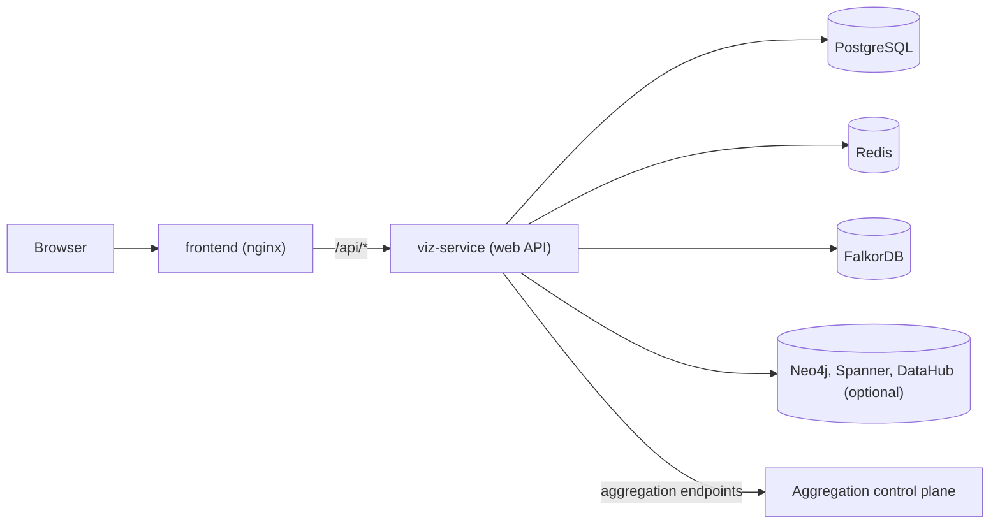
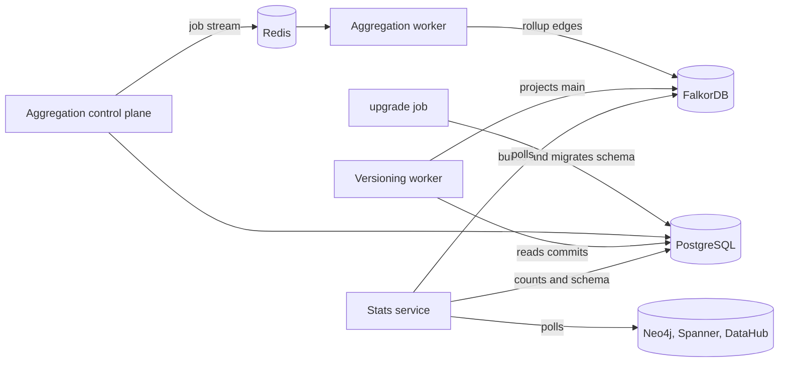
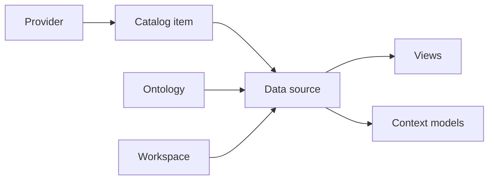
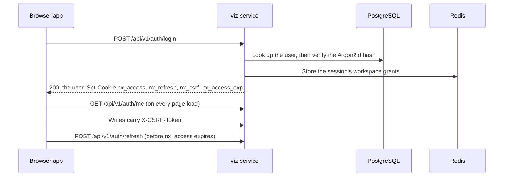
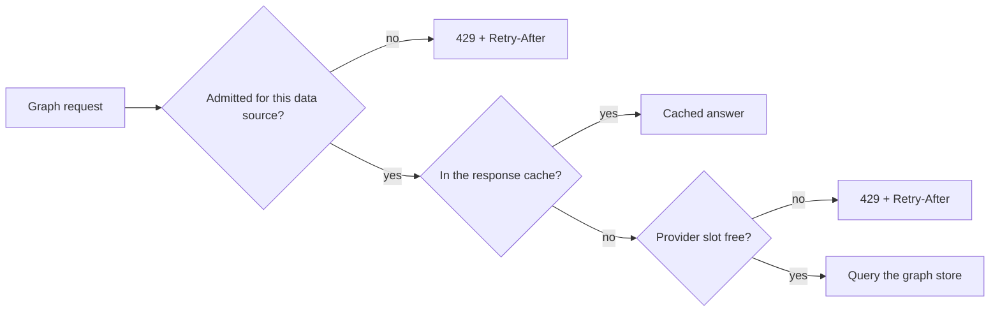

# {brand} Platform Architecture

*For architects and tech leads.*

How is {brand} built, and why that way? After this page you can name every process and store in a deployment, follow a request from sign-in to a lineage trace, and find each part in the code.

## Your path

Read these next, in order:

1. [Data Architecture](/docs/data-architecture) — what each store holds, the caches, and the two Redis roles.
2. [Decisions](/docs/decisions) — why each major choice was made, and what it costs.
3. [Platform Services](/docs/services-overview) — the process roles and the background services in more depth.
4. [Versioning: Overview & Architecture](/docs/versioning-overview) — how drafts, review and publish sit on PostgreSQL and FalkorDB.
5. [Security Overview](/docs/security-overview) — the security controls, end to end.
6. [Architecture When Scaling](/docs/scaling-architecture) — how the tiers scale, and what is still open.

## The system at a glance

{brand} is a React single-page app served by nginx, one FastAPI web API, and a set of background processes. The API and the background processes share one Python code base and three kinds of store:

- **PostgreSQL** — the management database (users, workspaces, providers, ontologies, views, settings), the job tables, and the version store for graph version control.
- **Redis** — work queues and event streams, locks, rate limits, the session store, and caches. It is a dedicated Redis; nothing operational ever lives on FalkorDB.
- **Graph stores** — FalkorDB by default, holding the lineage graph only. Neo4j, Google Cloud Spanner Graph and DataHub can be registered as further providers.

Two pictures show how they connect: the path a user's request takes, and what runs behind it.

### How a request reaches the data

```mermaid
flowchart LR
    B["Browser"] --> FE["frontend (nginx)"]
    FE -->|"/api/*"| API["viz-service (web API)"]
    API --> PG[("PostgreSQL")]
    API --> RD[("Redis")]
    API --> FDB[("FalkorDB")]
    API --> EXT[("Neo4j, Spanner, DataHub (optional)")]
    API -->|"aggregation endpoints"| CP["Aggregation control plane"]
```

### What runs in the background

```mermaid
flowchart LR
    UP["upgrade job"] -->|"builds and migrates schema"| PG[("PostgreSQL")]
    CP["Aggregation control plane"] -->|"job stream"| RD[("Redis")]
    CP --> PG
    RD --> AW["Aggregation worker"]
    AW -->|"rollup edges"| FDB[("FalkorDB")]
    VW["Versioning worker"] -->|"reads commits"| PG
    VW -->|"projects main"| FDB
    ST["Stats service"] -->|"counts and schema"| PG
    ST -->|"polls"| FDB
    ST -->|"polls"| EXT[("Neo4j, Spanner, DataHub")]
```

### Every process and store

As deployed by `docker-compose.yml`. The Kubernetes manifests in `deploy/k8s/base/` run the same processes as Deployments and StatefulSets; how each Kubernetes path runs the schema job is in [Kubernetes](/docs/kubernetes).

| Process (Compose service) | Started with | `SYNODIC_ROLE` | Port | What it does | Scales |
|---|---|---|---|---|---|
| `frontend` | nginx serving the built app (`frontend/Dockerfile`) | — | 80 (3080 on the Compose host) | Serves the app, proxies `/api/` to the API, sets the security headers on the page | Horizontally |
| `viz-service` | `gunicorn backend.app.main:app` with uvicorn workers (4 by default) | `web` | 8000 | The HTTP API: sign-in, workspaces, views, graph reads and writes, traces, version control, administration. Forwards the aggregation endpoints to the control plane | Horizontally; it holds no session state |
| `upgrade` | `python -m backend.scripts.upgrade upgrade` (`backend/Dockerfile.upgrade`) | — | — | Builds and migrates the PostgreSQL schema, then exits. In Compose every backend service waits for it; the Helm chart runs it as a pre-install/pre-upgrade hook | Once per deploy |
| `aggregation-controlplane` | `python -m backend.app.services.aggregation.controlplane` | `controlplane` | 8091 | The aggregation job and settings API, the scheduler, crash recovery, stuck-job reconciliation, drift probes, and the state sync that mirrors job status into the management database | One replica in the base; production runs two, because each loop is single-flight |
| `aggregation-worker` | `python -m backend.app.services.aggregation` | `worker` | 8090 (health) | Takes aggregation jobs off a Redis stream and writes `:AGGREGATED` rollup edges into the graph | Horizontally |
| `versioning-worker` | `python -m backend.app.services.versioning` | `worker` | — | Projects each version-controlled graph's `main` into FalkorDB, and runs the "enable version control", import and export jobs the API queues | Horizontally |
| `stats-service` | `python -m backend.insights_service` (`backend/Dockerfile.insights`) | `stats` | 8092 (health) | Polls every data source for counts and schema so the API serves cached stats; also runs asset discovery, purges and the profiling sweeps | Horizontally; a per-source claim in Redis keeps at most one pending poll per source |
| `postgres` | PostgreSQL 16 | — | 5432 | The management database, the `aggregation` schema and the `graphver` version store (which `GRAPHVER_DB_URL` can move to its own instance) | — |
| `redis` | Redis 7 | — | 6379 (6380 on the Compose host) | The `STREAMS` role (job and event streams, locks, session store) and the `CACHE` role (response and provider caches) | Compose shares one instance between the roles (DB 0 and DB 1); production uses two |
| `falkordb` | FalkorDB | — | 6379 | The lineage graph, and dedicated-mode `{graph}_proj` projection graphs. Nothing else | Standalone, Sentinel or a sharded cluster |

`SYNODIC_ROLE` selects which role-gated subsystems a process starts. The code knows `web`, `worker`, `controlplane` and `dev`; `dev` — also what an unset or unrecognised value becomes — starts every role-gated subsystem in one API process, for local development. The stats service, the versioning worker and the upgrade job run their own entry points rather than the API's startup.

Compose also has an opt-in `seed` service (`docker compose --profile seed up`) that loads demo graphs into FalkorDB.

## The core entity model

Everything a user sees is reached through four entities bound together by a data source:

```mermaid
flowchart LR
    P["Provider"] --> C["Catalog item"]
    C --> DS["Data source"]
    O["Ontology"] --> DS
    W["Workspace"] --> DS
    DS --> V["Views"]
    DS --> CM["Context models"]
```

| Entity | What it holds | Reuse |
|---|---|---|
| **Provider** | A connection to a graph store: type (`falkordb`, `neo4j`, `datahub` or `spanner`), host, port, and credentials encrypted with `CREDENTIAL_ENCRYPTION_KEY` | One provider can serve many workspaces |
| **Catalog item** | One graph on a provider, registered as a governed asset, with the workspaces allowed to use it | Registered once per `(provider, graph)` |
| **Ontology** | The semantic layer: entity types, relationship types, hierarchy and styling. Published versions are immutable | One ontology can be assigned to many data sources |
| **Workspace** | A team's or project's operating context | Holds data sources, views and context models |
| **Data source** | The binding of a provider's graph and an ontology into a workspace | Unique per `(workspace, provider, graph)` among live data sources; a catalog item backs at most one live data source |

> **Important:** A data source is the only unit of data access. Every graph route is addressed as `/api/v1/{ws_id}/graph/...`, naming a data source in the query (or falling back to the workspace's primary one), so a view or query can only reach a graph that is bound into its workspace.

Views and context models are scoped to a workspace and data source. A view's visibility is **Private**, **Workspace** or **Enterprise**.

Why the entities were split this way: [ADR-001](/docs/decisions#adr-001-three-entity-model-provider--ontology--workspace) and [ADR-013](/docs/decisions#adr-013-catalogitem-abstraction-layer). The schema behind them: [Data Architecture](/docs/data-architecture).

## Request lifecycle

The same four steps cover most of what a user does: sign in, open a view, trace lineage, and get an answer from the cache or the graph.

### 1. Sign in: cookies, not bearer tokens

```mermaid
sequenceDiagram
    participant SPA as Browser app
    participant API as viz-service
    participant PG as PostgreSQL
    participant RD as Redis
    SPA->>API: POST /api/v1/auth/login
    API->>PG: Look up the user, then verify the Argon2id hash
    API->>RD: Store the session's workspace grants
    API-->>SPA: 200, the user, Set-Cookie nx_access, nx_refresh, nx_csrf, nx_access_exp
    SPA->>API: GET /api/v1/auth/me (on every page load)
    SPA->>API: Writes carry X-CSRF-Token
    SPA->>API: POST /api/v1/auth/refresh (before nx_access expires)
```

1. The sign-in form posts to `/api/v1/auth/login`. The API rate-limits by address and by account, checks the Argon2id password hash, and creates a session.
2. The response body carries the user, never a token. The session arrives as cookies: `nx_access` and `nx_refresh` are `HttpOnly`, so page scripts cannot read them; `nx_csrf` and `nx_access_exp` are readable so the app can echo the CSRF token and renew in time. With `AUTH_ENVIRONMENT_ID` set, every cookie name carries it as a suffix.
3. On each page load the app asks `GET /api/v1/auth/me` who is signed in; nothing about the session is kept in web storage.
4. Every `POST`, `PUT`, `PATCH` and `DELETE` must send the `nx_csrf` value in an `X-CSRF-Token` header (double-submit). The token is bound to the session by HMAC, and the request's origin must be the app's own or a configured CORS origin.
5. The app renews the session before `nx_access` expires (it reads the expiry from `nx_access_exp`) and, as a fallback, once on a `401`. Refresh tokens rotate on every use.

Single sign-on ends the same way: the identity provider's callback sets the same cookies. Details: [Multi-Environment Sessions](/docs/multi-environment-sessions), [SSO](/docs/sso), and [ADR-024](/docs/decisions#adr-024-cookie-sessions-with-csrf-double-submit-not-bearer-tokens).

### 2. Open a view

1. The browser opens `/views/<viewId>`. nginx serves the app, which fetches the view's definition from `GET /api/v1/views/{view_id}`.
2. The view's layout picks the canvas: **Graph**, **Hierarchy** or **Context View**.
3. The canvas loads its data from the workspace-scoped graph routes, `/api/v1/{ws_id}/graph/...`, adding `dataSourceId`, `viewId` and — inside a draft — `branchId` to the query. For example, a page of top-level entities with their edges and rollups comes from one `POST .../graph/canvas/bootstrap`, and opening a container asks for its children and their edges (`GET .../graph/nodes/{urn}/children-with-edges`).
4. Each graph request is authorised against the workspace, or against the caller's access to the view it names.
5. On the Graph canvas, layout runs with ELK.js (`useElkLayout`) on the browser's main thread — asynchronously, but not in a Web Worker. The Context View lays out its own layer columns.

### 3. Trace lineage

The trace endpoints live in `backend/app/api/v1/endpoints/graph.py`, under `/api/v1/{ws_id}/graph`:

| Endpoint | Used by | Returns |
|---|---|---|
| `POST .../trace/v2` | The Graph and Hierarchy canvases' trace | A skeleton-first picture at one hierarchy level (top level by default), with rollup edges between those entities |
| `POST .../trace/expand` | Opening one rolled-up edge of that picture | The finer entities and edges inside it |
| `POST .../trace/expand-batch` | Opening a traced container with many rolled-up edges | The same, for many edges in one request |
| `POST .../trace/closure` | The Context View's trace and the Lineage Lens | One page of a focus-centred walk over raw lineage, with a frontier and cursors to continue; a `coarse` first page paints rollups in milliseconds |

The original `POST .../trace` is retired and answers `410 Gone`.

Every trace is bounded on the server: a node budget (`TRACE_MAX_NODES`, default 2,000) and a time budget (`TRACE_TIMEOUT_SECS`, default 120 seconds). A trace that hits either still answers `200`, marked `truncated` with a reason, so the app can show what it has. Trace endpoints answer only while the **Lineage trace** feature switch is on.

The trace controls users see are the dock's **Upstream depth** and **Downstream depth** sliders; how fine the picture is follows which containers are open, and the Lineage Lens's **Density** control.

### 4. Caching and load shedding

A graph read passes several guards before it reaches a graph store:

```mermaid
flowchart LR
    R["Graph request"] --> A{"Admitted for this data source?"}
    A -->|"no"| S1["429 + Retry-After"]
    A -->|"yes"| C{"In the response cache?"}
    C -->|"yes"| OK["Cached answer"]
    C -->|"no"| L{"Provider slot free?"}
    L -->|"no"| S2["429 + Retry-After"]
    L -->|"yes"| G["Query the graph store"]
```

- **Readiness gate.** Until startup finishes, the API answers everything except its health probes with `503` and `Retry-After`.
- **Request deadlines.** Each path has a time budget (graph and trace routes get more than the 30-second default); a request that overruns answers `504`.
- **Per-data-source admission.** Before a request takes a database connection, it is admitted against a per-process ceiling in which every data source keeps a reserved share. One slow data source therefore cannot starve the others. A refused request gets `429` with `Retry-After`.
- **Response cache.** Answers are cached in Redis per workspace, data source, branch and physical graph. A write bumps a generation counter, so stale entries are never read again. Concurrent identical misses collapse into one query — inside a process by sharing the result, across processes by electing one to compute. If the store is down or times out, the last good answer is served with `X-Cache-Status: stale-fallback`.
- **Provider slots.** A cache miss must take a slot: per process (`PROVIDER_MAX_CONCURRENCY`, default 8) and across the whole fleet. When none is free the request is shed with `429` rather than piling onto the graph store.
- **Fair share (optional).** With `FAIR_SHARE_ENABLED`, each workspace gets its own token bucket on the hot read paths, including `trace/closure`.
- **Circuit breakers.** Each provider sits behind a breaker; while it is open, requests fail fast with `503` instead of waiting on a dead store.

The app honours `Retry-After` on reads, so a shed request usually becomes a short pause rather than an error.

## Provider connectivity

All providers run in the API process and the workers, behind one interface (`GraphDataProvider` in `backend/common/interfaces/provider.py`):

| Provider type | Implementation | Can write |
|---|---|---|
| `falkordb` | `backend/app/providers/falkordb_provider.py` | Yes; the default store, and the one version control projects into |
| `neo4j` | `backend/graph/adapters/neo4j_provider.py` | Creates only (no edge update or delete) |
| `spanner` | `backend/graph/adapters/spanner_provider.py` | Yes |
| `datahub` | `backend/graph/adapters/datahub_provider.py` | No — a read-only view of an external catalog |

Testing a connection before registering it (`POST /api/v1/admin/providers/test-connection`) and discovering graphs also run inside the API, behind their own bulkheads. A separate `graph-service` once hosted this probe surface; it was never called and was removed — see [ADR-018](/docs/decisions#adr-018-retire-the-graph-service).

## Security controls at a glance

| Layer | Control |
|---|---|
| Passwords | Argon2id hashes; sign-in is rate-limited per address and per account |
| Session transport | `HttpOnly`, `Secure`, `SameSite=Lax` cookies (`nx_access`, `nx_refresh`); no token in web storage |
| Access token | A JWT (HS256) carrying the user, the session id and global permission claims; workspace grants stay in the server-side session store. Lifetime is `JWT_EXPIRY_MINUTES`: 5 minutes by default in code; the Compose files, the Kubernetes manifests and the example environment files set 15, and the Helm chart's values set 60. With `ENV=production`, startup refuses a value above `MAX_ACCESS_TTL_MINUTES` (default 15) |
| Refresh token | Rotates on every use, 7 days by default (`JWT_REFRESH_EXPIRY_DAYS`); each one is backed by a database record, and replaying a used one outside a short grace window revokes its whole family |
| Session ceilings | 12 hours idle and 7 days absolute for every session; SSO sessions re-authenticate with the identity provider every 24 hours |
| CSRF | Double-submit token bound to the session, plus an origin check |
| Signing keys | `JWT_SECRET_KEY` must be at least 32 characters and not a published placeholder; `JWT_SECRET_KEY_PREVIOUS` lets you rotate without signing everyone out |
| Credentials at rest | Provider and identity-provider secrets are Fernet-encrypted with `CREDENTIAL_ENCRYPTION_KEY`; with `ENV=production`, storing one without a key is refused |
| Headers | CSP, HSTS, `X-Frame-Options` and related headers on API responses and, from `frontend/nginx.conf`, on the app's page |
| Requests | Body size caps (8 MiB by default, larger for bulk imports), optional host allowlist (`ALLOWED_HOSTS`), CORS limited to `CORS_ALLOWED_ORIGINS` |
| Internal calls | The control plane requires a shared bearer token (`AGGREGATION_INTERNAL_TOKEN`); with `ENV=production` it will not start without one |
| Authorisation | Global and workspace-scoped roles resolved to permission claims, checked on every request — see [RBAC](/docs/rbac) |

The full picture, with how to configure each control: [Security Overview](/docs/security-overview). Every variable named here is in the [configuration reference](/docs/configuration).

## Scalability considerations

- **A stateless web tier.** Sessions live in cookies and the Redis session store, and caches are shared through Redis, so any API replica can serve any request. The API, the aggregation worker and the frontend autoscale on Kubernetes.
- **Per-process provider caches.** Each process keeps its own cache of connected providers (`ProviderManager`), keyed by provider and graph, capped (`PROVIDER_CACHE_MAX`, default 256) and reaped when idle (`PROVIDER_CACHE_IDLE_TTL_SECS`, default 900 seconds). A provider edit is broadcast over Redis, and the web, aggregation-worker and versioning-worker processes drop their copies; the stats service and the control plane are not subscribed to that broadcast. Background: [ADR-005](/docs/decisions#adr-005-providerregistry-singleton-with-lazy-initialization).
- **PostgreSQL only.** There is no SQLite branch: any `MANAGEMENT_DB_URL` that is not a `postgresql+asyncpg://` URL is rejected at startup, in every environment. The schema is owned by the `upgrade` job — see [ADR-025](/docs/decisions#adr-025-postgresql-only-management-database-schema-owned-by-an-upgrade-job).
- **Version control on two stores.** PostgreSQL holds commits and FalkorDB a rebuildable projection of `main` — see [ADR-023](/docs/decisions#adr-023-postgresql-as-the-version-store-falkordb-as-a-rebuildable-read-cache).

What the scale-out plan still leaves open: [Architecture When Scaling](/docs/scaling-architecture).

## Deployment

Three shapes run the same code:

- **Docker Compose** (`docker-compose.yml`) runs every process and store in the tables above — see [Deployment](/docs/deployment).
- **Kubernetes.** The maintained manifests are a kustomize base with `dev`, `staging`, `production` and `production-cluster` overlays in `deploy/k8s/`, and a Helm chart in `deploy/helm/dataviz/`. How to deploy, configure and scale them is in [Kubernetes](/docs/kubernetes).
- **A developer laptop.** `./dev.sh up` runs the whole stack in containers with hot reload, or `./dev.sh infra` runs just PostgreSQL, Redis and FalkorDB for an API and app started on the host — see [Developer Setup](/docs/setup).

### Container images

Seven backend Dockerfiles and one frontend Dockerfile:

| Dockerfile | Base image | Runs |
|---|---|---|
| `backend/Dockerfile.viz` | `python:3.14-slim` | The API (`viz-service`) under gunicorn |
| `backend/Dockerfile.controlplane` | `python:3.14-slim` | The aggregation control plane |
| `backend/Dockerfile.aggregation` | `python:3.14-slim` | The aggregation worker; Compose and Kubernetes also run the versioning worker from it, with its own command |
| `backend/Dockerfile.insights` | `python:3.14-slim` | The stats service |
| `backend/Dockerfile.upgrade` | `python:3.14-slim` | The `upgrade` job, and the schema check backend pods wait on in the Helm chart |
| `backend/Dockerfile.seed` | `python:3.14-slim` | The demo-data seeder |
| `backend/Dockerfile.viz-quickstart` | `python:3.14-slim` | A quickstart variant of the API, used only by `docker-compose.quickstart.yml` |
| `frontend/Dockerfile` | `node:24-alpine` to build, `nginx:1.31-alpine` to serve | The app and its reverse proxy |

### Technology stack

| Layer | Technology | Version (`package.json` / `requirements.txt` range) |
|---|---|---|
| UI | React | ^19.3.0 |
| Language and build | TypeScript, Vite | ~5.7.2, ^8.3.3 |
| Client state | Zustand, TanStack React Query | ^5.0.15, ^5.104.1 |
| Graph canvas and layout | @xyflow/react, elkjs | ^12.12.0, ^0.12.0 |
| Styling and primitives | Tailwind CSS, Radix UI | ^3.4.17, per-component packages |
| Node.js | for builds and the dev server | 24 (`frontend/.nvmrc`) |
| API | FastAPI on gunicorn + uvicorn, Python 3.14 in the images | fastapi >=0.141.1 |
| Data access | SQLAlchemy (async) with asyncpg, Alembic | >=2.0.54, >=0.31.0, >=1.19.2 |
| Auth | argon2-cffi, PyJWT, Authlib (OIDC), python3-saml | >=23.1.0, >=2.13.0, >=1.8.0, >=1.16.0 |
| Graph clients | FalkorDB, neo4j, google-cloud-spanner | >=1.7.1,<2, >=5.14.0, >=3.71.0 |
| Stores | PostgreSQL, Redis, FalkorDB | 16.14, 7, v4.18.11 (the Compose images) |

## Where in the code

| Concern | Where |
|---|---|
| Process roles | `backend/app/runtime/role.py` (`SynodicRole`, `current_role`) |
| API app, middleware and startup | `backend/app/main.py` (`app`, `lifespan`) |
| Routers | `backend/app/api/v1/api.py` (`api_router`) |
| Trace endpoints | `backend/app/api/v1/endpoints/graph.py` (`trace_v2`, `trace_closure`, `trace_expand`, `trace_expand_batch`) |
| Query orchestration | `backend/app/services/context_engine.py` (`ContextEngine.for_workspace`) |
| Provider cache and admission | `backend/app/providers/manager.py` (`ProviderManager`, `admit_graph_request`) |
| Provider interface and capabilities | `backend/common/interfaces/provider.py` (`GraphDataProvider`, `PROVIDER_CAPABILITIES`) |
| Response cache | `backend/app/services/graph_cache.py` (`GraphCache.get_or_compute`) |
| Sessions and CSRF | `backend/auth_service/cookies.py`, `backend/auth_service/csrf.py` (`CSRFMiddleware`) |
| Aggregation control plane and worker | `backend/app/services/aggregation/controlplane.py`, `backend/app/services/aggregation/__main__.py` |
| Versioning worker | `backend/app/services/versioning/__main__.py` |
| Stats service | `backend/insights_service/__main__.py` |
| Schema ownership | `backend/scripts/upgrade.py`, `backend/app/db/engine.py` (`init_db`) |
| The app's request wrapper and graph client | `frontend/src/services/fetchWithTimeout.ts`, `frontend/src/providers/RemoteGraphProvider.ts` |
| Graph-canvas layout | `frontend/src/hooks/useElkLayout.ts` |
| Deployment | `docker-compose.yml`, `deploy/k8s/base/`, `deploy/helm/dataviz/` |

## See also

- [Overview](/docs/overview) — what the platform does and where it is heading
- [Data Architecture](/docs/data-architecture) — schemas, caches and the Redis roles
- [Decisions](/docs/decisions) — the ADRs behind the choices on this page
- [Backend Reference](/docs/backend) — the router map, middleware and startup
- [Frontend Reference](/docs/frontend) — how the app is organised
- [Aggregation Pipeline](/docs/aggregation-pipeline) — how `:AGGREGATED` rollup edges are built
