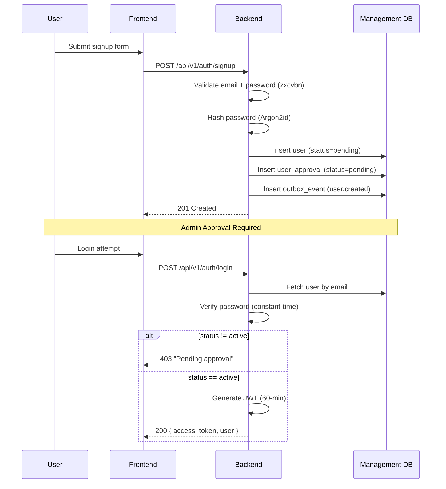
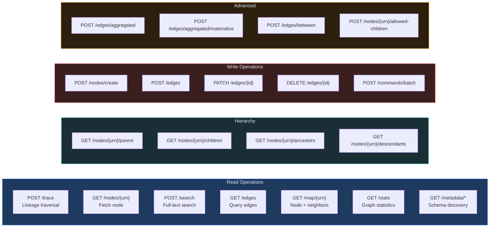
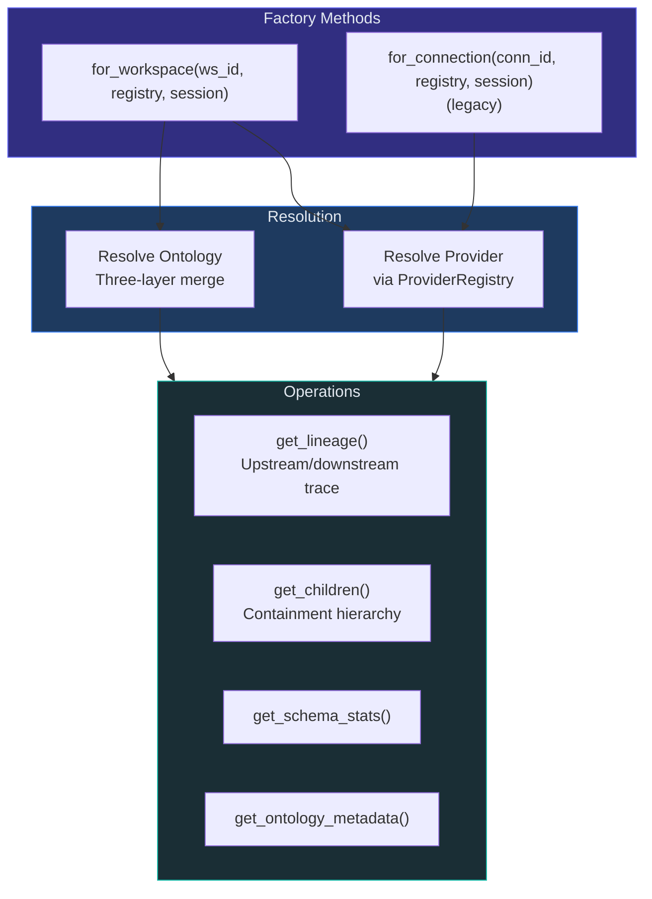
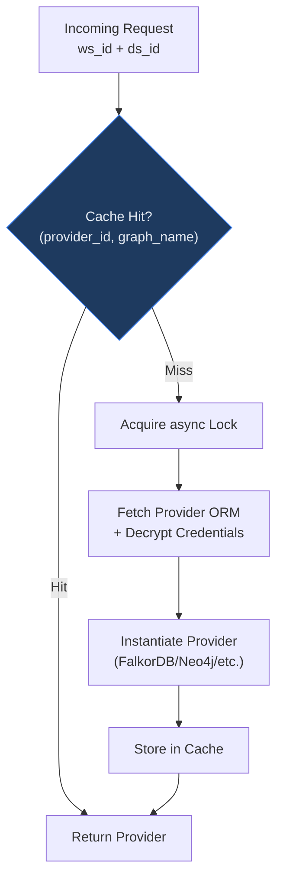
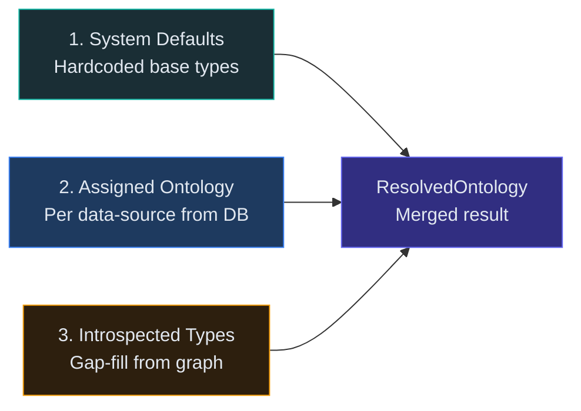
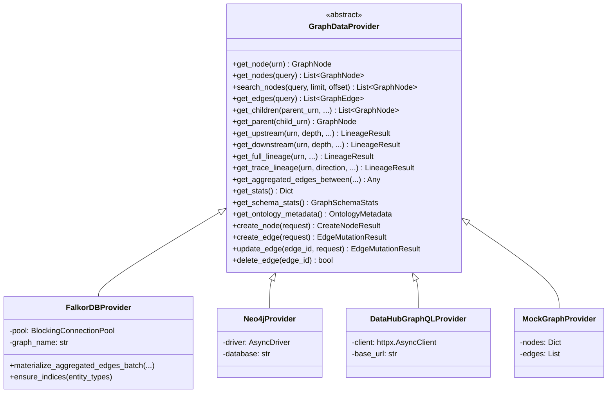
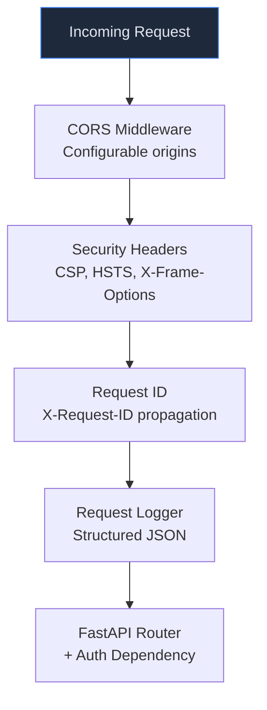
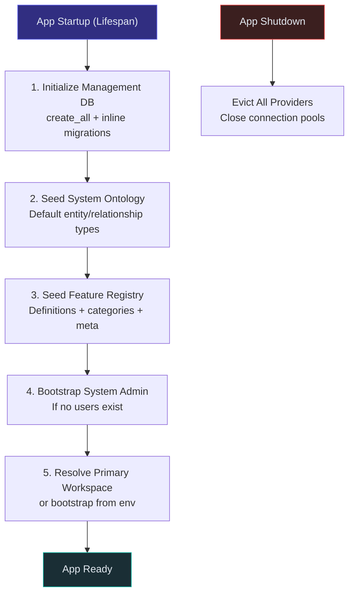

# Backend Technical Documentation

## Overview

The Synodic backend consists of two independent FastAPI services:

| Service | Port | Entry Point | Responsibility |
|---------|------|-------------|----------------|
| **Visualization Service** | 8000 | `backend/app/main.py` | Stateful: auth, workspaces, graph queries, ontology |
| **Graph Service** | 8001 | `backend/graph/main.py` | Stateless: provider discovery, connectivity testing |

---

## 1. API Reference

### Authentication & Users



| Endpoint | Method | Auth | Rate Limit | Purpose |
|----------|--------|------|------------|---------|
| `/api/v1/auth/signup` | POST | Public | 5/min | User registration |
| `/api/v1/auth/login` | POST | Public | 10/min | JWT token generation |
| `/api/v1/auth/forgot-password` | POST | Public | 5/min | Request reset token |
| `/api/v1/auth/reset-password` | POST | Public | 5/min | Apply password reset |
| `/api/v1/users/me` | GET | Bearer | - | Current user profile |
| `/api/v1/admin/users` | GET | Admin | - | List users (filterable by status) |
| `/api/v1/admin/users/{id}/approve` | POST | Admin | - | Approve pending signup |
| `/api/v1/admin/users/{id}/reject` | POST | Admin | - | Reject with reason |
| `/api/v1/admin/users/{id}/suspend` | POST | Admin | - | Disable account |
| `/api/v1/admin/users/{id}/reactivate` | POST | Admin | - | Re-enable account |
| `/api/v1/admin/users/{id}/role` | PUT | Admin | - | Assign role |
| `/api/v1/admin/users/{id}/reset-password` | POST | Admin | - | Generate reset token |

### Admin Infrastructure

| Endpoint | Method | Purpose |
|----------|--------|---------|
| `/api/v1/admin/providers` | GET, POST | List/create providers |
| `/api/v1/admin/providers/{id}` | GET, PUT, DELETE | Provider CRUD |
| `/api/v1/admin/providers/{id}/test` | POST | Test connectivity |
| `/api/v1/admin/providers/{id}/discover-schema` | POST | Discover available graphs/schemas |
| `/api/v1/admin/catalog` | GET, POST | List/create catalog items |
| `/api/v1/admin/catalog/{id}` | GET, PUT, DELETE | Catalog item CRUD |
| `/api/v1/admin/catalog/{id}/impact` | GET | Blast-radius analysis before deletion |
| `/api/v1/admin/workspaces` | GET, POST | List/create workspaces |
| `/api/v1/admin/workspaces/{ws_id}` | GET, PUT, DELETE | Workspace CRUD |
| `/api/v1/admin/workspaces/{ws_id}/set-default` | POST | Set as default workspace |
| `/api/v1/admin/workspaces/{ws_id}/data-sources` | GET, POST | Manage data sources |
| `/api/v1/admin/workspaces/{ws_id}/data-sources/{ds_id}` | PUT, DELETE | Data source CRUD |
| `/api/v1/admin/workspaces/{ws_id}/data-sources/{ds_id}/set-primary` | POST | Set as primary data source |
| `/api/v1/admin/workspaces/{ws_id}/data-sources/{ds_id}/projection-mode` | PATCH | Configure projection mode |
| `/api/v1/admin/workspaces/{ws_id}/data-sources/{ds_id}/impact` | GET | Blast-radius analysis |

### Ontology Management

| Endpoint | Method | Purpose |
|----------|--------|---------|
| `/api/v1/admin/ontologies` | GET, POST | List/create ontology definitions |
| `/api/v1/admin/ontologies/{id}` | GET, PUT, DELETE | Ontology CRUD |
| `/api/v1/admin/ontologies/{id}/publish` | POST | Mark version immutable (with impact check) |
| `/api/v1/admin/ontologies/{id}/clone` | POST | Copy to new editable draft |
| `/api/v1/admin/ontologies/{id}/validate` | POST | Check for cycles, missing refs |
| `/api/v1/admin/ontologies/{id}/coverage` | POST | Analyze against graph schema stats |
| `/api/v1/admin/ontologies/suggest` | POST | Auto-generate from graph introspection |
| `/api/v1/admin/ontologies/{id}/assignments` | GET | List workspaces using this ontology |

### Graph Operations (Workspace-Scoped)

All graph endpoints are scoped to a workspace: `/api/v1/{ws_id}/graph/...`

Optional query params: `?dataSourceId=` (target specific source), `?connectionId=` (legacy).



**Key Graph Endpoints:**

| Endpoint | Method | Purpose |
|----------|--------|---------|
| `/{ws_id}/graph/trace` | POST | Unified lineage (upstream/downstream depth, granularity, edge type filtering) |
| `/{ws_id}/graph/nodes/{urn}` | GET | Single node by URN |
| `/{ws_id}/graph/nodes/{urn}/children` | GET | Containment hierarchy children |
| `/{ws_id}/graph/search` | POST | Full-text node search |
| `/{ws_id}/graph/edges` | GET | Query edges (type, source, target filters) |
| `/{ws_id}/graph/stats` | GET | Entity/edge type counts (cached) |
| `/{ws_id}/graph/nodes/create` | POST | Create node (with optional containment edge) |
| `/{ws_id}/graph/edges` | POST | Create edge (validates against ontology) |
| `/{ws_id}/graph/commands/batch` | POST | Batch mutations (fail-fast by default) |
| `/{ws_id}/graph/edges/aggregated` | POST | Aggregated edges between containers |
| `/{ws_id}/graph/edges/aggregated/materialize` | POST | Batch-create AGGREGATED edges |

### Views & Features

| Endpoint | Method | Purpose |
|----------|--------|---------|
| `/api/v1/views` | GET, POST | List/create saved views |
| `/api/v1/views/{id}` | GET, PUT, DELETE | View CRUD |
| `/api/v1/views/{id}/favourite` | POST | Toggle favourite |
| `/api/v1/views/popular` | GET | Most-favourited views |
| `/api/v1/admin/features` | GET, PATCH | Feature flag management (optimistic concurrency) |

---

## 2. Core Services

### ContextEngine

**File:** `backend/app/services/context_engine.py`

The ContextEngine is the **central orchestrator** for all graph queries. It binds a workspace's provider and ontology together for query execution.



**Key behaviors:**
- **Ontology-driven edge classification:** No hardcoded edge types; containment/lineage classification comes from the resolved ontology
- **Granularity aggregation:** Collapses fine-grained lineage (column-level) to coarser levels (table/dataset) using ontology hierarchy levels
- **TTL caching:** Resolved ontology cached for 5 minutes per ContextEngine instance
- **Legacy support:** `for_connection()` factory preserves backward compatibility

### ProviderRegistry

**File:** `backend/app/registry/provider_registry.py`

Singleton that manages graph provider lifecycle with lazy initialization and async-safe caching.



**Cache structure:**
- **Primary:** `Dict[(provider_id, graph_name), GraphDataProvider]`
- **Legacy:** `Dict[connection_id, GraphDataProvider]`
- **Eviction:** `evict_provider()`, `evict_workspace()`, `evict_data_source()`, `evict_all()`
- **Bootstrap:** `_bootstrap_from_env()` creates Provider + Ontology + Workspace from env vars on empty DB

### Ontology Service

**File:** `backend/app/ontology/service.py`

Implements three-layer ontology resolution:



**Entity Type Definition (per type ID):**
```
EntityTypeDefEntry:
  - name, plural_name, description
  - visual: icon, color, shape, size, border_style, show_in_minimap
  - hierarchy: level, can_contain[], can_be_contained_by[], roll_up_fields[]
  - behavior: selectable, draggable, expandable, traceable, click/double-click actions
  - fields[]: display configuration per property
```

**Relationship Type Definition:**
```
RelationshipTypeDefEntry:
  - name, description, category (structural | flow | metadata | association)
  - is_containment, is_lineage
  - direction, visual (stroke_color, stroke_width, animated, curve_type)
  - source_types[], target_types[]
```

**Versioning rules:**
- Published ontologies are **immutable** -- updates create new version rows
- Evolution policy controls breaking changes: `reject` (default), `deprecate`, `migrate`
- Impact analysis compares draft to latest published version before allowing publish

---

## 3. Graph Data Provider System

### Provider Interface

**File:** `backend/common/interfaces/provider.py`

Abstract base class defining the contract for all graph backends:



### Provider Capabilities

| Capability | FalkorDB | Neo4j | DataHub | Mock |
|-----------|----------|-------|---------|------|
| Multi-graph | Yes | Yes | No | Yes |
| Lineage | Yes | Yes | Yes | Yes |
| Containment | Yes | Yes | No | Yes |
| Write ops | Yes | No | No | Yes |
| Aggregation | Yes | No | No | No |
| Full-text search | Yes | Yes | Yes | Yes |

### FalkorDB Implementation Details

**File:** `backend/app/providers/falkordb_provider.py` (~1000 lines)

- **Connection:** Async Redis BlockingConnectionPool (12 connections, 30s timeout)
- **Projection modes:** `in_source` (AGGREGATED edges in same graph) or `dedicated` (separate projection graph)
- **Indexing:** `ensure_indices()` creates indexes for ontology-defined entity types
- **Aggregation:** `materialize_aggregated_edges_batch()` batch-creates AGGREGATED edges between ancestor pairs using Cypher queries

### Provider Location Note

Providers live in **two different services**:

| Provider | Location | Service |
|----------|----------|---------|
| FalkorDBProvider | `backend/app/providers/falkordb_provider.py` | Visualization Service (8000) |
| MockGraphProvider | `backend/app/providers/mock_provider.py` | Visualization Service (8000) |
| Neo4jProvider | `backend/graph/adapters/neo4j_provider.py` | Graph Service (8001) |
| DataHubGraphQLProvider | `backend/graph/adapters/datahub_provider.py` | Graph Service (8001) |

Neo4j and DataHub adapters live in the Graph Service because they are used for **pre-registration connectivity testing** (stateless). The Visualization Service uses the `GraphDataProvider` interface but currently only instantiates FalkorDB and Mock providers for workspace-scoped queries.

---

## 4. Graph Service (Port 8001)

The Graph Service is a **stateless companion** for provider discovery and connectivity testing. It accepts connection parameters in the request body and requires no management database.

**File:** `backend/graph/main.py`

### Graph Service Endpoints

| Endpoint | Method | Purpose |
|----------|--------|---------|
| `/graph/v1/providers` | GET | List supported provider types and capabilities |
| `/graph/v1/providers/falkordb/ping` | POST | Test FalkorDB connectivity |
| `/graph/v1/providers/falkordb/graphs` | POST | List available graphs on FalkorDB instance |
| `/graph/v1/providers/neo4j/ping` | POST | Test Neo4j connectivity |
| `/graph/v1/providers/neo4j/databases` | POST | List available Neo4j databases |
| `/graph/v1/providers/datahub/ping` | POST | Test DataHub GraphQL connectivity |

### Graph Service Adapters

Located in `backend/graph/adapters/`:

| Adapter | File | Purpose |
|---------|------|---------|
| `neo4j_provider.py` | Neo4j adapter | Bolt protocol connectivity testing |
| `datahub_provider.py` | DataHub adapter | GraphQL endpoint testing |
| `schema_mapping.py` | Schema mapper | Provider-specific label/property mapping |

---

## 5. Additional Backend Services

### LineageAggregator

**File:** `backend/app/services/lineage_aggregator.py`

Handles lineage edge aggregation logic -- collapsing fine-grained column-level edges into coarser table/domain-level aggregated edges.

### AssignmentEngine

**File:** `backend/app/services/assignment_engine.py`

Computes layer assignments for graph nodes based on rule sets. Called via `POST /{ws_id}/graph/assignments/compute`.

### OntologyDriftDetector

**File:** `backend/app/ontology/drift_detector.py`

Detects schema changes between the introspected graph schema and the defined ontology. Flags unmapped types and suggests closest matches.

### MutationValidator

**File:** `backend/app/ontology/mutation_validator.py`

Validates node/edge creation requests against the resolved ontology. Ensures entity types and relationship types conform to ontology rules before writes are committed.

### Stats Polling Service

**File:** `backend/stats_service/main.py`

Asynchronous sidecar service that polls data sources for schema and statistics. Runs concurrently (`asyncio.gather`) to fetch stats, schema, ontology metadata, and graph schema. Writes results to `data_source_stats` and `data_source_polling_configs` tables.

---

## 6. Repository Pattern

All database operations are abstracted into repositories under `backend/app/db/repositories/`:

| Repository | Table(s) | Key Operations |
|-----------|----------|----------------|
| `workspace_repo` | workspaces, workspace_data_sources | CRUD, set_default, list with data sources |
| `provider_repo` | providers | CRUD, credential encrypt/decrypt |
| `ontology_definition_repo` | ontologies | CRUD, publish, clone, version management |
| `data_source_repo` | workspace_data_sources | CRUD, stats cache, polling config |
| `view_repo` | views, view_favourites | CRUD, favourite toggle, popularity |
| `user_repo` | users, user_roles, user_approvals | CRUD, role assignment, approval workflow |
| `connection_repo` | graph_connections | **Legacy** CRUD, credential encryption |
| `catalog_repo` | catalog_items | CRUD, permission filtering |
| `context_model_repo` | context_models | CRUD, template instantiation |
| `assignment_repo` | assignment_rule_sets | CRUD, default selection |
| `feature_flags_repo` | feature_flags, feature_definitions | Read/write with optimistic concurrency |

**Pattern:** Repositories accept an `AsyncSession`, perform ORM queries, and return Pydantic DTOs (not ORM objects). This ensures a clean boundary between data access and business logic.

---

## 5. Middleware Stack



**Security headers applied to every response:**
```
X-Content-Type-Options: nosniff
X-Frame-Options: DENY
X-XSS-Protection: 0
Referrer-Policy: strict-origin-when-cross-origin
Permissions-Policy: camera=(), microphone=(), geolocation=()
Content-Security-Policy: default-src 'self'; script-src 'self'; style-src 'self' 'unsafe-inline'; ...
Strict-Transport-Security: max-age=31536000 (HTTPS only)
```

---

## 6. Startup Lifecycle



### Environment Variables

| Variable | Default | Required | Purpose |
|----------|---------|----------|---------|
| `GRAPH_PROVIDER` | `falkordb` | No | Provider type: mock, falkordb, neo4j, datahub |
| `MANAGEMENT_DB_URL` | SQLite path | No | PostgreSQL URL for production |
| `CREDENTIAL_ENCRYPTION_KEY` | _(none)_ | Prod | Fernet key for credential encryption |
| `JWT_SECRET_KEY` | _(random)_ | Prod | HS256 signing key |
| `JWT_EXPIRY_MINUTES` | `60` | No | Token lifetime |
| `ADMIN_EMAIL` | `admin@nexuslineage.local` | No | Bootstrap admin email |
| `ADMIN_PASSWORD` | `changeme` | No | Bootstrap admin password |
| `CORS_ALLOWED_ORIGINS` | `localhost:3000,5173` | No | Comma-separated origins |
| `FALKORDB_HOST` | `localhost` | No | FalkorDB/Redis hostname |
| `FALKORDB_PORT` | `6379` | No | FalkorDB/Redis port |
| `FALKORDB_GRAPH_NAME` | `nexus_lineage` | No | Default graph name |
| `FALKORDB_SEED_FILE` | _(none)_ | No | JSON path for seeding graph data |
| `DB_ECHO` | `false` | No | SQLAlchemy SQL logging |
