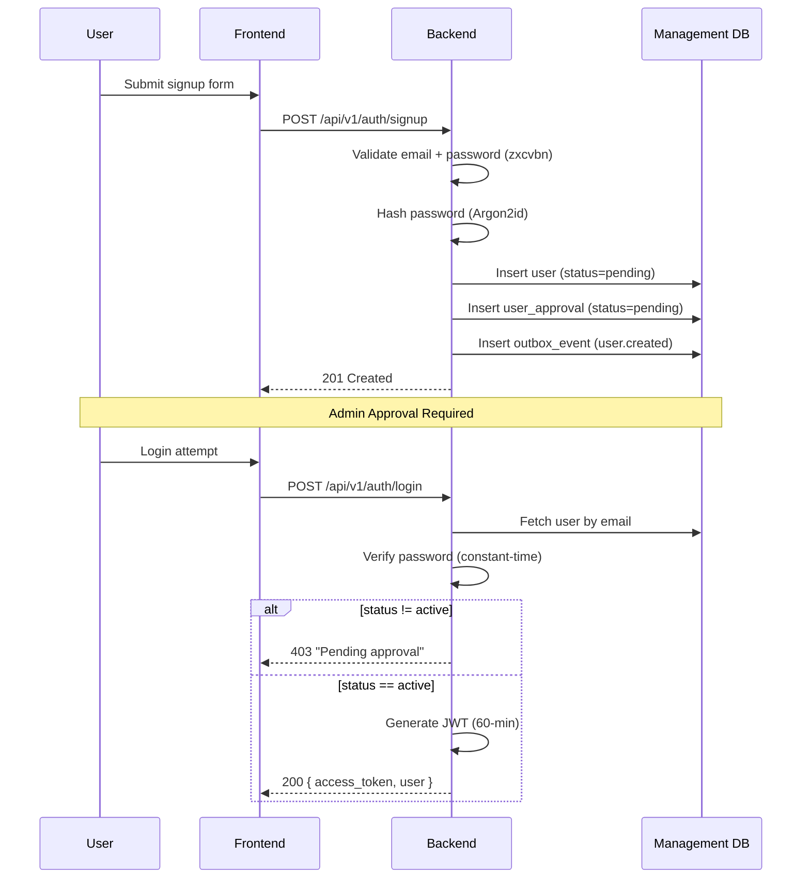
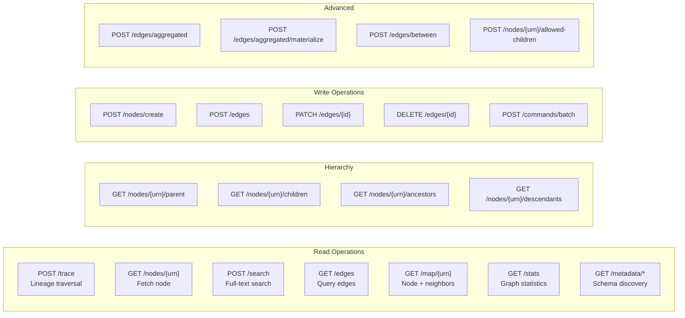
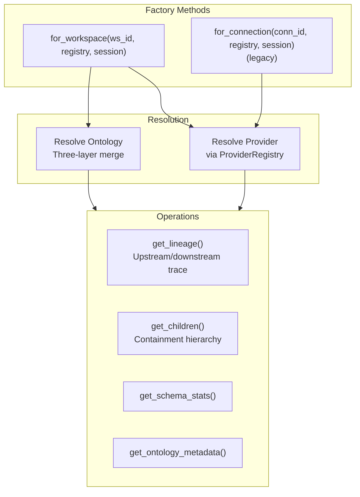
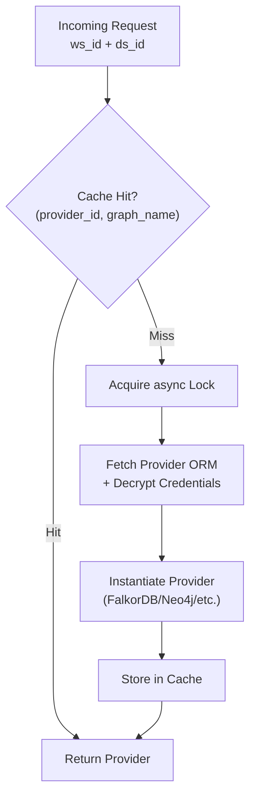
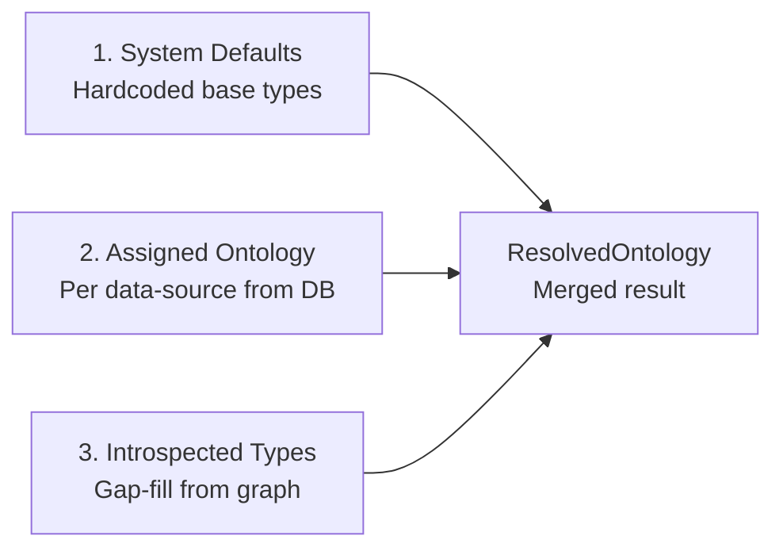
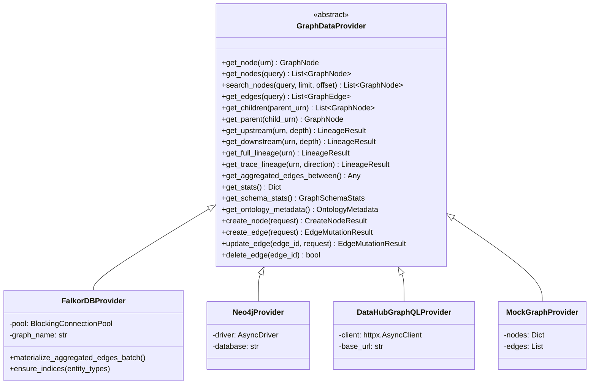
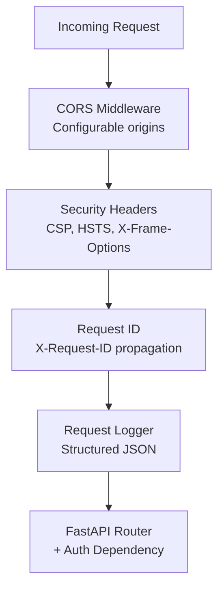
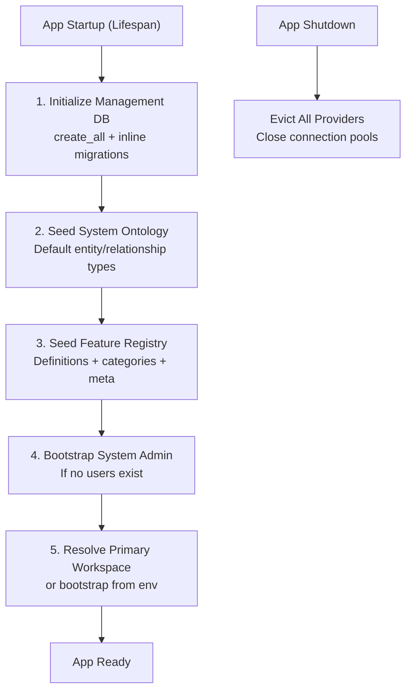

# Backend Technical Documentation

> **At a glance:** How the {brand} backend fits together — its services, the HTTP API surface, the graph-provider abstraction, and the request/startup machinery that ties them together. Written for backend and full-stack engineers working in `backend/`.

**This doc covers:**

- The **API reference** — auth, admin infrastructure, ontology, graph operations, versioning, views, features, announcements
- **Core services** — ContextEngine, ProviderRegistry, Ontology Service
- The **Graph Data Provider** system and in-process connectivity adapters
- **Repositories**, the **middleware stack**, and the **startup lifecycle**

> **Tip:** Reading the codebase alongside this doc? Every section lists the concrete `backend/…` file paths so you can jump straight to source.

## Overview

The {brand} backend is a single FastAPI application (the **Visualization Service**), supported by an out-of-process aggregation pipeline (a control plane plus worker(s)) and an insights service:

| Service | Port | Entry Point | Responsibility |
|---------|------|-------------|----------------|
| **Visualization Service** | 8000 | `backend/app/main.py` | Auth, workspaces, graph queries, ontology, provider connectivity/discovery/testing |
| **Aggregation Control Plane** | 8091 | `backend/app/services/aggregation/controlplane.py` | Orchestrates the rollup/materialization pipeline (schedules + dispatches to worker(s)) |
| **Insights Service** | -- | `backend/insights_service/__main__.py` | Background collection of schema/stats and cache warming |

> A standalone `graph-service` (`:8001`, `backend/graph/main.py`) once handled provider connectivity testing. It was removed per [ADR-018](DECISIONS.md#adr-018-retire-the-graph-service) -- it was built and deployed but never invoked. Its Neo4j/DataHub/Spanner adapters survive in `backend/graph/adapters/` and are now imported **in-process** by the Visualization Service.

> **See also:** [Platform Services overview](/docs/services-overview) for the current service topology and process roles (`SYNODIC_ROLE`: WEB, WORKER, CONTROLPLANE, DEV).

---

## 1. API Reference

### Authentication & Users


```mermaid
sequenceDiagram
    participant U as User
    participant FE as Frontend
    participant BE as Backend
    participant DB as Management DB

    U->>FE: Submit signup form
    FE->>BE: POST /api/v1/auth/signup
    BE->>BE: Validate email + password (zxcvbn)
    BE->>BE: Hash password (Argon2id)
    BE->>DB: Insert user (status=pending)
    BE->>DB: Insert user_approval (status=pending)
    BE->>DB: Insert outbox_event (user.created)
    BE-->>FE: 201 Created

    Note over U,DB: Admin Approval Required

    U->>FE: Login attempt
    FE->>BE: POST /api/v1/auth/login
    BE->>DB: Fetch user by email
    BE->>BE: Verify password (constant-time)
    alt status != active
        BE-->>FE: 403 "Pending approval"
    else status == active
        BE->>BE: Generate JWT (60-min)
        BE-->>FE: 200 { access_token, user }
    end
```

| Endpoint | Method | Auth | Rate Limit | Purpose |
|----------|--------|------|------------|---------|
| `/api/v1/auth/signup` | POST | Public | 20/min | User registration |
| `/api/v1/auth/login` | POST | Public | 10/min | JWT token generation |
| `/api/v1/auth/forgot-password` | POST | Public | 3/min | Flag a reset request (mints no token — see below) |
| `/api/v1/auth/reset-password` | POST | Public | 5/min | Apply password reset |
| `/api/v1/users/me` | GET | Bearer | - | Current user profile |
| `/api/v1/users/me` | PATCH | Bearer | - | Edit own name / display name / avatar |
| `/api/v1/users/me/password` | POST | Bearer | 5/min | Change own password (signs out everywhere) |
| `/api/v1/users/me/sessions/revoke-all` | POST | Bearer | - | Sign out on every device |
| `/api/v1/users/me/activity` | GET | Bearer | - | Own account-security history |
| `/api/v1/admin/users` | GET | Admin | - | List users (filterable by status) |
| `/api/v1/admin/users/{id}/approve` | POST | Admin | - | Approve pending signup |
| `/api/v1/admin/users/{id}/reject` | POST | Admin | - | Reject with reason |
| `/api/v1/admin/users/{id}/suspend` | POST | Admin | - | Disable account |
| `/api/v1/admin/users/{id}/reactivate` | POST | Admin | - | Re-enable account |
| `/api/v1/admin/users/{id}/role` | PUT | Admin | - | Assign role |
| `/api/v1/admin/users/{id}/reset-password` | POST | Admin | - | Set a password directly |
| `/api/v1/admin/users/{id}/generate-reset-token` | POST | Admin | - | Generate a shareable reset token |

**IdP-owned profile fields.** `complete_sso_login` re-applies the name claims it
receives on every sign-in and records which fields it asserted in
`users.metadata_` (see `backend/common/identity_provenance.py`). `PATCH
/users/me` and `PATCH /admin/users/{id}` both refuse those fields with `409
{"error": "idp_managed_field", "fields": [...]}`. Ownership is claimed per
login from what actually arrived — never inferred from a linked identity row —
so a provider that stops releasing a claim hands the field back at the next
sign-in, and the snapshot is replaced rather than merged, which is what makes
"most recently authenticated provider wins" fall out without a precedence
table. `display_name` is never IdP-owned.

**Self-service password change** returns `409` when the account has no local
password (SSO-only), and `403` — deliberately not `401` — when `currentPassword`
is wrong. The frontend treats `401` as a dead session and would silently refresh,
retry, and sign the user out over a typo.

**Session revocation** has two halves, and both are needed. Tombstoning a `sid`
in Redis covers only the life of the access token, because `/auth/refresh` mints
a *fresh* `sid` on every rotation and does not consult the revoked set — so a
client that silently refreshes walks straight back in. `users.sessions_valid_from`
is the durable half: a refresh token minted before that instant is refused and its
family killed. Anything calling `revoke_subject_sessions` for a security purpose
should stamp the cutoff too (see `_revoke_every_session` in `endpoints/users.py`).

**Forced rotation.** `users.must_change_password` rides in the access token as the
`mcp` claim and is enforced in `get_current_user`: every route except a short
allowlist (`_PASSWORD_CHANGE_ALLOWED_PATHS`) returns `403 {"error":
"password_change_required"}`. It is set on the bootstrap admin when
`ADMIN_PASSWORD` is one of the values published in this repo's setup docs.

### Admin Infrastructure

| Endpoint | Method | Purpose |
|----------|--------|---------|
| `/api/v1/admin/providers` | GET, POST | List/create providers |
| `/api/v1/admin/providers/{id}` | GET, PUT, DELETE | Provider CRUD |
| `/api/v1/admin/providers/{id}/test` | POST | Test connectivity |
| `/api/v1/admin/providers/{id}/discover-schema` | POST | Discover available graphs/schemas |
| `/api/v1/admin/catalog` | GET, POST | List/create catalog items |
| `/api/v1/admin/catalog/{id}` | GET, PUT, DELETE | Catalog item CRUD |
| `/api/v1/admin/catalog/{id}/impact` | GET | Blast-radius analysis before deletion |
| `/api/v1/admin/catalog/cleanup` | POST | Deduplicate catalog items by (provider_id, source_identifier), keeps earliest |
| `/api/v1/admin/catalog/bindings` | GET | List catalog items enriched with workspace binding info |
| `/api/v1/admin/workspaces` | GET, POST | List/create workspaces |
| `/api/v1/admin/workspaces/{ws_id}` | GET, PUT, DELETE | Workspace CRUD |
| `/api/v1/admin/workspaces/{ws_id}/set-default` | POST | Set as default workspace |
| `/api/v1/admin/workspaces/{ws_id}/data-sources` | GET, POST | Manage data sources |
| `/api/v1/admin/workspaces/{ws_id}/data-sources/{ds_id}` | PUT, DELETE | Data source CRUD |
| `/api/v1/admin/workspaces/{ws_id}/data-sources/{ds_id}/set-primary` | POST | Set as primary data source |
| `/api/v1/admin/workspaces/{ws_id}/data-sources/{ds_id}/projection-mode` | PATCH | Configure projection mode |
| `/api/v1/admin/workspaces/{ws_id}/data-sources/{ds_id}/impact` | GET | Blast-radius analysis |

### Ontology Management

| Endpoint | Method | Purpose |
|----------|--------|---------|
| `/api/v1/admin/ontologies` | GET, POST | List/create ontology definitions |
| `/api/v1/admin/ontologies/{id}` | GET, PUT, DELETE | Ontology CRUD |
| `/api/v1/admin/ontologies/{id}/publish` | POST | Mark version immutable (with impact check) |
| `/api/v1/admin/ontologies/{id}/clone` | POST | Copy to new editable draft |
| `/api/v1/admin/ontologies/{id}/validate` | POST | Check for cycles, missing refs |
| `/api/v1/admin/ontologies/{id}/coverage` | POST | Analyze against graph schema stats |
| `/api/v1/admin/ontologies/suggest` | POST | Auto-generate from graph introspection |
| `/api/v1/admin/ontologies/{id}/assignments` | GET | List workspaces using this ontology |
| `/api/v1/admin/ontologies/{id}/export` | GET | Export full ontology definition as downloadable JSON |
| `/api/v1/admin/ontologies/import` | POST | Import ontology from exported JSON, creating a new draft |
| `/api/v1/admin/ontologies/{id}/import` | POST | Import into existing ontology (draft: in-place update; published: new version) |
| `/api/v1/admin/ontologies/{id}/audit` | GET | Audit trail for ontology (all versions, paginated, filterable by action) |

### Graph Operations (Workspace-Scoped)

All graph endpoints are scoped to a workspace: `/api/v1/{ws_id}/graph/...`

Optional query params: `?dataSourceId=` (target specific source), `?connectionId=` (legacy).


```mermaid
graph LR
    subgraph Queries["Read Operations"]
        Trace["POST /trace<br/>Lineage traversal"]
        Nodes["GET /nodes/{urn}<br/>Fetch node"]
        Search["POST /search<br/>Full-text search"]
        Edges["GET /edges<br/>Query edges"]
        Map["GET /map/{urn}<br/>Node + neighbors"]
        Stats["GET /stats<br/>Graph statistics"]
        Meta["GET /metadata/*<br/>Schema discovery"]
    end

    subgraph Hierarchy["Hierarchy"]
        Parent["GET /nodes/{urn}/parent"]
        Children["GET /nodes/{urn}/children"]
        Ancestors["GET /nodes/{urn}/ancestors"]
        Descendants["GET /nodes/{urn}/descendants"]
    end

    subgraph Mutations["Write Operations"]
        CreateNode["POST /nodes/create"]
        CreateEdge["POST /edges"]
        UpdateEdge["PATCH /edges/{id}"]
        DeleteEdge["DELETE /edges/{id}"]
        Batch["POST /commands/batch"]
    end

    subgraph Advanced["Advanced"]
        AggEdges["POST /edges/aggregated"]
        Materialize["POST /edges/aggregated/materialize"]
        Between["POST /edges/between"]
        Allowed["POST /nodes/{urn}/allowed-children"]
    end

```

**Key Graph Endpoints:**

| Endpoint | Method | Purpose |
|----------|--------|---------|
| `/{ws_id}/graph/trace` | POST | Unified lineage (upstream/downstream depth, granularity, edge type filtering) |
| `/{ws_id}/graph/nodes/{urn}` | GET | Single node by URN |
| `/{ws_id}/graph/nodes/{urn}/children` | GET | Containment hierarchy children |
| `/{ws_id}/graph/search` | POST | Full-text node search |
| `/{ws_id}/graph/edges` | GET | Query edges (type, source, target filters) |
| `/{ws_id}/graph/stats` | GET | Entity/edge type counts (cached) |
| `/{ws_id}/graph/nodes/create` | POST | Create node (with optional containment edge) |
| `/{ws_id}/graph/edges` | POST | Create edge (validates against ontology) |
| `/{ws_id}/graph/commands/batch` | POST | Batch mutations (fail-fast by default) |
| `/{ws_id}/graph/edges/aggregated` | POST | Aggregated edges between containers |
| `/{ws_id}/graph/edges/aggregated/materialize` | POST | Batch-create AGGREGATED edges |
| `/{ws_id}/graph/nodes/degree` | POST | Total lineage degree (in/out) per URN over the full graph — powers the curated-view "lineage outside this view" chip. Response-cached; a URN absent from the result is UNKNOWN (never zero). Body: `{ urns[], edge_types? }` |

### Graph Versioning & Change Control

> **Note:** The `versioningEnabled` gate is enforced **server-side** on every `/graph` write (drafts, commits, merges, reverts) via `versioning_gate.py` — it is not a UI-only toggle. See the [Features API contract](/docs/api-features#feature-flags-authoritative-set).

Graph versioning (drafts, review & merge, publish, revert, restore) is **shipped** and gated by the `versioningEnabled` feature flag. Enabling version control on a data source is a resumable **async bootstrap job**: it copies the whole source graph into the versioned store as an auditable `import` commit, integrity-checks it against the source, and only then makes it live. Verified on a 7.7M-entity graph.

**Enable-VC bootstrap job** (workspace-scoped, `?dataSourceId=` required):

| Endpoint | Method | Status | Purpose |
|----------|--------|--------|---------|
| `/{ws_id}/graph/bootstrap` | POST | **202** (or 200 `alreadyEnabled`) | Start "enable version control" for a data source. Runs on the versioning worker in resumable windows; returns `{ jobId, graphId, status }`. Idempotent — an in-flight job returns itself |
| `/{ws_id}/graph/bootstrap/status` | GET | 200 | Live progress (phase, counts, percent) and, on a terminal job, the integrity report. Not flag-gated so a job started before versioning was disabled stays observable |
| `/{ws_id}/graph/bootstrap/retry` | POST | 202 | Resume a failed copy from its last committed window (`mode=resume`) or restart it (`mode=restart`) |
| `/{ws_id}/graph/bootstrap/abandon` | POST | 200 | Discard everything the job imported; the data source reads exactly as before. Refused (409) once version control is live |

**Draft & restore** (versioning router, prefix `/api/v1/{ws_id}/versioning`):

| Endpoint | Method | Purpose |
|----------|--------|---------|
| `/{ws_id}/versioning/graphs/{graph_id}/commits/{commit_id}/restore` | POST | Restore the graph to a historical commit ("Restore to this point") as a new commit on `main`. Flag-gated |
| `/{ws_id}/versioning/graphs/{graph_id}/commits/{commit_id}/restore-preview` | GET | Preview the diff a restore would apply, without mutating anything |

> Draft lifecycle (open draft, stage/checkpoint, review/merge PR-style, publish, revert "Undo this change") lives on the versioning router; the draft *editing* surface is the normal `/graph` API plus a `?branchId=` query param. See the [draft lineage & merge engineering notes](https://github.com/rkrumins/dataviz/blob/main/docs/VERSIONING_DRAFTS_LINEAGE_AND_MERGE.md) and [local-integration-testing.md](local-integration-testing.md).

### Views & Features

| Endpoint | Method | Purpose |
|----------|--------|---------|
| `/api/v1/views` | GET, POST | List/create saved views |
| `/api/v1/views/{id}` | GET, PUT, DELETE | View CRUD |
| `/api/v1/views/{id}/favourite` | POST | Toggle favourite |
| `/api/v1/views/popular` | GET | Most-favourited views |
| `/api/v1/admin/features` | GET, PATCH | Feature flag management (optimistic concurrency) |
| `/api/v1/features/values` | GET | **Public**, read-only flag values (no auth, no schema/categories overhead) for client bootstrapping |

### Announcements

| Endpoint | Method | Auth | Purpose |
|----------|--------|------|---------|
| `/api/v1/announcements` | GET | Public | Active announcements for banner display (respects feature flag) |
| `/api/v1/announcements/config` | GET | Public | Global banner config (polling interval, default snooze) |
| `/api/v1/admin/announcements` | GET | Admin | List all announcements (active and inactive) |
| `/api/v1/admin/announcements` | POST | Admin | Create announcement (validates banner_type, snooze duration) |
| `/api/v1/admin/announcements/{id}` | PATCH | Admin | Update announcement |
| `/api/v1/admin/announcements/{id}` | DELETE | Admin | Delete announcement |
| `/api/v1/admin/announcements/config` | GET | Admin | Read global announcement config |
| `/api/v1/admin/announcements/config` | PUT | Admin | Update global announcement config |

### Error Responses

All endpoints use a consistent error response format:

| Status Code | Meaning | Example Causes |
|-------------|---------|----------------|
| 400 | Bad Request | Validation failures (e.g. invalid banner_type, negative snooze duration) |
| 401 | Unauthorized | Missing or invalid JWT token |
| 403 | Forbidden | Insufficient role (e.g. non-admin accessing admin endpoints, pending user login) |
| 404 | Not Found | Resource does not exist (provider, ontology, catalog item, announcement) |
| 409 | Conflict | Duplicate resource, optimistic concurrency failure, deletion blocked by references, publishing blocked by evolution policy |
| 422 | Unprocessable Entity | Semantic validation error (e.g. malformed ontology import JSON) |

---

## 2. Core Services

### ContextEngine

**File:** `backend/app/services/context_engine.py`

The ContextEngine is the **central orchestrator** for all graph queries. It binds a workspace's provider and ontology together for query execution.


```mermaid
graph TB
    subgraph Factory["Factory Methods"]
        FW["for_workspace(ws_id, registry, session)"]
        FC["for_connection(conn_id, registry, session)<br/>(legacy)"]
    end

    subgraph Resolution["Resolution"]
        RP["Resolve Provider<br/>via ProviderRegistry"]
        RO["Resolve Ontology<br/>Three-layer merge"]
    end

    subgraph Operations["Operations"]
        GL["get_lineage()<br/>Upstream/downstream trace"]
        GC["get_children()<br/>Containment hierarchy"]
        GS["get_schema_stats()"]
        GM["get_ontology_metadata()"]
    end

    FW --> RP
    FW --> RO
    FC --> RP

    RP --> Operations
    RO --> Operations

```

**Key behaviors:**
- **Ontology-driven edge classification:** No hardcoded edge types; containment/lineage classification comes from the resolved ontology
- **Granularity aggregation:** Collapses fine-grained lineage (column-level) to coarser levels (table/dataset) using ontology hierarchy levels
- **TTL caching:** Resolved ontology cached for 5 minutes per ContextEngine instance
- **Legacy support:** `for_connection()` factory preserves backward compatibility

### ProviderRegistry

**File:** `backend/app/registry/provider_registry.py`

Singleton that manages graph provider lifecycle with lazy initialization and async-safe caching.


```mermaid
graph TB
    Request["Incoming Request<br/>ws_id + ds_id"]
    Cache{"Cache Hit?<br/>(provider_id, graph_name)"}
    Lock["Acquire async Lock"]
    Fetch["Fetch Provider ORM<br/>+ Decrypt Credentials"]
    Instantiate["Instantiate Provider<br/>(FalkorDB/Neo4j/etc.)"]
    Store["Store in Cache"]
    Return["Return Provider"]

    Request --> Cache
    Cache -->|Hit| Return
    Cache -->|Miss| Lock
    Lock --> Fetch
    Fetch --> Instantiate
    Instantiate --> Store
    Store --> Return

```

**Cache structure:**
- **Primary:** `Dict[(provider_id, graph_name), GraphDataProvider]`
- **Legacy:** `Dict[connection_id, GraphDataProvider]`
- **Eviction:** `evict_provider()`, `evict_workspace()`, `evict_data_source()`, `evict_all()`
- **Bootstrap:** `_bootstrap_from_env()` creates Provider + Ontology + Workspace from env vars on empty DB

### Ontology Service

**File:** `backend/app/ontology/service.py`

Implements three-layer ontology resolution:


```mermaid
graph LR
    SD["1. System Defaults<br/>Hardcoded base types"]
    AO["2. Assigned Ontology<br/>Per data-source from DB"]
    IT["3. Introspected Types<br/>Gap-fill from graph"]
    RO["ResolvedOntology<br/>Merged result"]

    SD --> RO
    AO --> RO
    IT --> RO

```

**Entity Type Definition (per type ID):**
```
EntityTypeDefEntry:
  - name, plural_name, description
  - visual: icon, color, shape, size, border_style, show_in_minimap
  - hierarchy: level, can_contain[], can_be_contained_by[], roll_up_fields[]
  - behavior: selectable, draggable, expandable, traceable, click/double-click actions
  - fields[]: display configuration per property
```

**Relationship Type Definition:**
```
RelationshipTypeDefEntry:
  - name, description, category (structural | flow | metadata | association)
  - is_containment, is_lineage
  - direction, visual (stroke_color, stroke_width, animated, curve_type)
  - source_types[], target_types[]
```

**Versioning rules:**
- Published ontologies are **immutable** -- updates create new version rows
- Evolution policy controls breaking changes: `reject` (default), `deprecate`, `migrate`
- Impact analysis compares draft to latest published version before allowing publish

---

## 3. Graph Data Provider System

### Provider Interface

**File:** `backend/common/interfaces/provider.py`

Abstract base class defining the contract for all graph backends:


```mermaid
classDiagram
    class GraphDataProvider {
        <<abstract>>
        +get_node(urn) GraphNode
        +get_nodes(query) List~GraphNode~
        +search_nodes(query, limit, offset) List~GraphNode~
        +get_edges(query) List~GraphEdge~
        +get_children(parent_urn) List~GraphNode~
        +get_parent(child_urn) GraphNode
        +get_upstream(urn, depth) LineageResult
        +get_downstream(urn, depth) LineageResult
        +get_full_lineage(urn) LineageResult
        +get_trace_lineage(urn, direction) LineageResult
        +get_aggregated_edges_between() Any
        +get_stats() Dict
        +get_schema_stats() GraphSchemaStats
        +get_ontology_metadata() OntologyMetadata
        +create_node(request) CreateNodeResult
        +create_edge(request) EdgeMutationResult
        +update_edge(edge_id, request) EdgeMutationResult
        +delete_edge(edge_id) bool
    }
    class FalkorDBProvider {
        -pool: BlockingConnectionPool
        -graph_name: str
        +materialize_aggregated_edges_batch()
        +ensure_indices(entity_types)
    }
    class Neo4jProvider {
        -driver: AsyncDriver
        -database: str
    }
    class DataHubGraphQLProvider {
        -client: httpx.AsyncClient
        -base_url: str
    }
    class MockGraphProvider {
        -nodes: Dict
        -edges: List
    }
    GraphDataProvider <|-- FalkorDBProvider
    GraphDataProvider <|-- Neo4jProvider
    GraphDataProvider <|-- DataHubGraphQLProvider
    GraphDataProvider <|-- MockGraphProvider
```

### Provider Capabilities

| Capability | FalkorDB | Neo4j | DataHub | Mock |
|-----------|----------|-------|---------|------|
| Multi-graph | Yes | Yes | No | Yes |
| Lineage | Yes | Yes | Yes | Yes |
| Containment | Yes | Yes | No | Yes |
| Write ops | Yes | No | No | Yes |
| Aggregation | Yes | No | No | No |
| Full-text search | Yes | Yes | Yes | Yes |

### FalkorDB Implementation Details

**Location:** `backend/app/providers/falkordb/` (a package — see "FalkorDB Package
Layout" below). `backend/app/providers/falkordb_provider.py` is now a 161-line
compatibility shim that re-exports the package's names unchanged, so every
existing import site keeps working without an edit.

- **Connection:** Async Redis BlockingConnectionPool (12 connections, 30s timeout)
- **Projection modes:** `in_source` (AGGREGATED edges in same graph) or `dedicated` (separate projection graph)
- **Indexing:** `ensure_indices()` creates indexes for ontology-defined entity types
- **Aggregation:** `materialize_aggregated_edges_batch()` batch-creates AGGREGATED edges between ancestor pairs using Cypher queries

### FalkorDB Package Layout

The implementation moved to `backend/app/providers/falkordb/`, one module per
functional area (connection lifecycle, schema/indexing, ontology, caching,
ancestors, reads, browse, simple lineage, aggregation, trace, closure, drill,
stats, navigation, writes). `FalkorDBProvider` (`provider.py`) is a composition
of the resulting fifteen mixins plus `GraphDataProvider` — nothing else lives
in that file.

**Why mixins, not collaborator objects:** the unit suite fakes the database by
assigning over the provider's own methods on a *live instance* (`p._ro_query =
fake`, `p._ensure_connected = noop`, dozens of sites). A mixin keeps every one
of those a plain, shadowable instance method; a delegate object would leave the
assignment bound to an attribute nothing reads, and every faked test would
silently start hitting real code (or a real database) while still reporting
green.

Two engine-neutral seams sit alongside the mixins, unused by most call sites today:
- **Executor** (`falkordb/executor.py`) — adapts the five query chokepoints to a
  database-neutral `run`/`run_tolerant` shape a future engine can implement too.
- **Dialect** (`falkordb/dialect.py`) — a plain data value holding FalkorDB's
  Cypher fragments (labels, relationship types, index DDL), so a second engine
  is a new value plus an executor, not another adapter class.

### Checking a Query's Plan

To confirm a Cypher query is not doing a full scan, `PROFILE` it directly
against a graph and read the plan for `Results`/`Project` with no `All Node
Scan` or `Node By Label Scan` (an index seek shows as `Node By Index Scan`):

```python
from falkordb import FalkorDB
g = FalkorDB(host="localhost", port=6399).select_graph("<graph_name>")
print(g.profile("MATCH (n:Thing) WHERE n.urn = $urn RETURN n"))
```

`backend/scripts/check_trace_query_plans.py` does this for a fixed list of
trace hot-path queries only (`HOT_PATH_QUERIES`) — it has no entry point for
an arbitrary query, so use the snippet above for anything else.

### Known Follow-ups

Left deliberately unfinished by the FalkorDB package split, for a later PR:

- **No full lane exists over this PR's final tip — run one before trusting this PR is fully measured.**
  Measured on the final tree: the required CI lane (1,465 passed / 11 failed,
  `comm -23` against `failures-0.txt` empty — zero new failures), the
  targeted set (98 tests), both goldens, the live contract snapshot on
  `:6399` (passed, not skipped), and import smoke in both orders. **Not**
  measured on the final tree: the ~4,700 tests outside the required lane's
  `-k` filter. The last complete full lane was 27 failed / 6,163 passed at
  `798506de`; `git diff --stat 798506de..HEAD` is 28 files / 1,110
  insertions / 270 deletions (the dialect seam, the `stats.py` pilot, and
  this finishing task's five commits) — real, substantial work landed
  since that number, not a docs-only gap. Five attempts to run a full lane
  here were all defeated by the environment, not the code: three
  background runs killed at 84%/90%/early, two foreground runs past a 600s
  cap, and splitting into smaller batches made it *worse* (an explicit
  120-file list reached only 29% in 580s where the whole `tests` directory
  completes in 580-880s) — machine load average was 34.37 during these
  attempts. Do not infer from this PR's other fifteen tasks' measured
  numbers that this last one was measured too; it wasn't.
- **The full-lane gap above is no longer the only CI-shaped caveat.**
  `.github/workflows/backend-tests.yml`'s `connectivity-suite` job now runs
  a `falkordb/falkordb:v4.18.11` service container and a reachability step
  that exits non-zero if it isn't up, so
  `tests/regression/test_falkordb_provider_contract.py` actually runs in
  CI instead of silently skipping (an unstarted service previously meant
  a green job with the contract test never exercised at all). This
  changes what a green required job means from here on — it now includes
  a real, live-verified contract snapshot, not just the unit lane above.
- **The provider-interface mermaid diagram and the capability table above**
  (`### Provider Interface`, `### Provider Capabilities`) still show
  `MockGraphProvider` as a real, implemented class with its own capability
  column — the same gap as the provider-location table row just above this
  note (`provider_type = 'mock'` is a valid DB value with no adapter class
  behind it). Not redrawn here — a future doc pass should either implement
  the class or strip it from the diagram and table too.
- **Six files still import a private helper straight from the shim** rather
  than the package's leaf modules — `backend/tests/test_falkordb_package_guards.py`'s
  guard 1 allow-lists exactly these (`_sanitize_label`, `_node_from_props`,
  `_edge_from_row`, `_sanitize_node_properties`, `_compute_searchable_text`,
  `_split_user_properties`), all under `services/versioning/` plus
  `api/v1/endpoints/versioning.py`. A later PR repoints them and deletes the
  allow-list.
- **`CursorMismatchError`** is defined in `falkordb/cursors.py`, not the
  provider contract (`backend/common/interfaces/provider.py`) — a later PR
  moves it there and re-exports it from both places.
- **Expression-level dialect routing** (`labels(x)[0]` ~49 sites, `id(r)`/`ID(n)`
  ~13, `type(r)` ~49) is deliberately deferred to the PR that lifts these
  modules wholesale — see `falkordb/dialect.py`'s module docstring for exactly
  which fields are defined but not yet wired.
- **`get_aggregated_edges_between`** (`falkordb/aggregation.py:1342`) does a
  lazy `from fastapi import HTTPException` — an HTTP-framework import inside a
  provider. Noted, not fixed here.
- **Neo4j has its own near-duplicate** `_sanitize_label` / `_node_from_props` /
  `_edge_from_row` at `backend/graph/adapters/neo4j_provider.py:50-90`,
  unrelated to this split's kernel extraction
  (`backend/common/providers/rowmap.py`) — a future PR could point Neo4j at
  the same kernel functions instead.
- **Two kernel functions changed logger name, operationally, not behaviourally.**
  `node_from_props` and `split_user_properties` (`backend/common/providers/rowmap.py`)
  now log under that module's own name instead of the historic
  `backend.app.providers.falkordb_provider` — unavoidable, since the kernel
  must not import `backend.app` to reach the package's log setup. No test
  depends on the old name for these two functions, but log-based alerting
  keyed to it would silently stop matching.
- **`docs/VERSIONING_DRAFTS_LINEAGE_AND_MERGE.md`'s prose will go stale.**
  Lines 45, 66, and 105 describe live FalkorDB reads as going through
  `falkordb_provider.py` — true today only because the compatibility shim
  exists; repointing those consumers at the package directly (as above) will
  make that specific phrasing wrong even though the behaviour it describes
  will not change.
- **Two halves of the executor seam have no caller anywhere yet.** `stats.py`
  is the only module converted to it so far; from that task's report: "Every
  call in this module is a read. Nine `run()` + five `run_tolerant()`, zero
  `run(..., readonly=False)`. The write path through the executor is
  unit-tested … but this is not a second, independent proof of it on real
  code — that's still open for whichever of the next eight modules has the
  first write chokepoint." And separately: "`projection_executor` has no
  caller anywhere yet, this module included. Same caveat as above, restated
  because it's the other seam half."

### Provider Location Note

All providers run **in-process** in the Visualization Service, split across two packages:

| Provider | Location |
|----------|----------|
| FalkorDBProvider | `backend/app/providers/falkordb/` (compatibility shim at `backend/app/providers/falkordb_provider.py`) |
| MockGraphProvider | not implemented as a class today — `provider_type = 'mock'` is a valid `ProviderORM` value (`backend/app/db/models.py`) with no adapter behind it |
| Neo4jProvider | `backend/graph/adapters/neo4j_provider.py` |
| DataHubGraphQLProvider | `backend/graph/adapters/datahub_provider.py` |

The `backend/graph/adapters/` package (Neo4j, DataHub, Spanner) was formerly loaded by the standalone graph-service for **pre-registration connectivity testing**; since that service was removed ([ADR-018](DECISIONS.md#adr-018-retire-the-graph-service)) the Visualization Service imports these adapters directly. Workspace-scoped queries are served primarily by the FalkorDB provider (`mock` is a DB-level `provider_type` value with no adapter class behind it — see the table above).

---

## 4. Provider Connectivity Adapters (In-Process)

Pre-registration provider discovery and connectivity testing runs **in-process** in the Visualization Service. A standalone `graph-service` (`:8001`, `backend/graph/main.py`) previously exposed this over HTTP, but it was built and deployed yet **never invoked**, and was removed per [ADR-018](DECISIONS.md#adr-018-retire-the-graph-service). The onboarding wizard calls the Visualization Service's own `POST /admin/providers/test-connection` (and the per-provider `POST /admin/providers/{id}/test`) instead.

The provider adapters that service depended on **survive** and are imported directly by the Visualization Service (`backend/app/providers/manager.py`, `backend/app/registry/provider_registry.py`).

### Provider Adapters

Located in `backend/graph/adapters/`:

| Adapter | File | Purpose |
|---------|------|---------|
| `neo4j_provider.py` | Neo4j adapter | Bolt protocol connectivity + queries |
| `datahub_provider.py` | DataHub adapter | GraphQL endpoint connectivity + queries |
| `spanner_provider.py` | Spanner adapter | Cloud Spanner connectivity + queries |
| `schema_mapping.py` | Schema mapper | Provider-specific label/property mapping |

---

## 5. Additional Backend Services

### LineageAggregator

**File:** `backend/app/services/lineage_aggregator.py`

Handles lineage edge aggregation logic -- collapsing fine-grained column-level edges into coarser table/domain-level aggregated edges.

### AssignmentEngine

**File:** `backend/app/services/assignment_engine.py`

Computes layer assignments for graph nodes based on rule sets. Called via `POST /{ws_id}/graph/assignments/compute`.

### OntologyDriftDetector

**File:** `backend/app/ontology/drift_detector.py`

Detects schema changes between the introspected graph schema and the defined ontology. Flags unmapped types and suggests closest matches.

### MutationValidator

**File:** `backend/app/ontology/mutation_validator.py`

Validates node/edge creation requests against the resolved ontology. Ensures entity types and relationship types conform to ontology rules before writes are committed.

### Insights Service

**File:** `backend/insights_service/__main__.py`

Out-of-process service that collects schema and statistics for data sources and warms provider caches. Writes results to the `data_source_stats` and `data_source_polling_configs` tables. Supersedes the former `backend/stats_service/` skeleton, which was removed per [ADR-018](DECISIONS.md#adr-018-retire-the-graph-service).

---

## 6. Repository Pattern

All database operations are abstracted into repositories under `backend/app/db/repositories/`:

| Repository | Table(s) | Key Operations |
|-----------|----------|----------------|
| `workspace_repo` | workspaces, workspace_data_sources | CRUD, set_default, list with data sources |
| `provider_repo` | providers | CRUD, credential encrypt/decrypt |
| `ontology_definition_repo` | ontologies | CRUD, publish, clone, version management |
| `data_source_repo` | workspace_data_sources | CRUD, stats cache, polling config |
| `view_repo` | views, view_favourites | CRUD, favourite toggle, popularity |
| `user_repo` | users, user_roles, user_approvals | CRUD, role assignment, approval workflow |
| `connection_repo` | graph_connections | **Legacy** CRUD, credential encryption |
| `catalog_repo` | catalog_items | CRUD, dedup cleanup, bindings query, impact analysis |
| `announcement_repo` | announcements, announcement_config | CRUD, config management |
| `context_model_repo` | context_models | CRUD, template instantiation |
| `assignment_repo` | assignment_rule_sets | CRUD, default selection |
| `feature_flags_repo` | feature_flags, feature_definitions | Read/write with optimistic concurrency |

**Pattern:** Repositories accept an `AsyncSession`, perform ORM queries, and return Pydantic DTOs (not ORM objects). This ensures a clean boundary between data access and business logic.

---

## 7. Middleware Stack


```mermaid
graph TB
    Req[Incoming Request] --> CORS
    CORS[CORS Middleware<br/>Configurable origins] --> SecH
    SecH[Security Headers<br/>CSP, HSTS, X-Frame-Options] --> ReqID
    ReqID[Request ID<br/>X-Request-ID propagation] --> Log
    Log[Request Logger<br/>Structured JSON] --> Route
    Route[FastAPI Router<br/>+ Auth Dependency]

```

**Security headers applied to every response:**
```
X-Content-Type-Options: nosniff
X-Frame-Options: DENY
X-XSS-Protection: 0
Referrer-Policy: strict-origin-when-cross-origin
Permissions-Policy: camera=(), microphone=(), geolocation=()
Content-Security-Policy: default-src 'self'; script-src 'self'; style-src 'self' 'unsafe-inline'; ...
Strict-Transport-Security: max-age=31536000 (HTTPS only)
```

---

## 8. Startup Lifecycle


```mermaid
graph TB
    Start["App Startup (Lifespan)"]
    InitDB["1. Initialize Management DB<br/>create_all + inline migrations"]
    SeedOnt["2. Seed System Ontology<br/>Default entity/relationship types"]
    SeedFeat["3. Seed Feature Registry<br/>Definitions + categories + meta"]
    BootAdmin["4. Bootstrap System Admin<br/>If no users exist"]
    ResolvePrimary["5. Resolve Primary Workspace<br/>or bootstrap from env"]
    Ready["App Ready"]
    Shutdown["App Shutdown"]
    Evict["Evict All Providers<br/>Close connection pools"]

    Start --> InitDB --> SeedOnt --> SeedFeat --> BootAdmin --> ResolvePrimary --> Ready
    Shutdown --> Evict

```

### Environment Variables

| Variable | Default | Required | Purpose |
|----------|---------|----------|---------|
| `GRAPH_PROVIDER` | `falkordb` | No | Provider type: mock, falkordb, neo4j, datahub |
| `MANAGEMENT_DB_URL` | SQLite path | No | PostgreSQL URL for production |
| `CREDENTIAL_ENCRYPTION_KEY` | _(none)_ | Prod | Fernet key for credential encryption |
| `JWT_SECRET_KEY` | _(none — required)_ | **All** | HS256 signing key, ≥32 chars. There is no fallback: the process refuses to start without it, in every environment — nor with one of the placeholder values this repo publishes in its example files |
| `JWT_SECRET_KEY_PREVIOUS` | _(none)_ | No | Comma-separated retired keys, verification only. Set this **before** rotating `JWT_SECRET_KEY`, or every live session dies the instant the new value lands — and during a rolling update, pods on the old and new key flip the same user between authenticated and 401 |
| `AUTH_ENVIRONMENT_ID` | _(none)_ | No | Scopes the session cookie names (`nx_access_uat`) and binds the JWT issuer. Set it when two deployments can be open in the same browser — cookie jars are keyed by domain, not by cluster, so identically-named cookies overwrite each other |
| `JWT_REFRESH_EXPIRY_DAYS` | `7` | No | Refresh-cookie lifetime — how long "stay signed in" lasts. The window slides on every rotation |
| `REFRESH_ROTATION_GRACE_SECONDS` | `30` | No | How long a re-presented refresh token reads as a concurrent refresh rather than a stolen chain. `0` = strict rotation, which signs users out of every tab when two rotate at once |
| `REFRESH_ADOPT_RECORDLESS` | `true` | No | Migration ramp for allow-by-record. Refresh tokens are refused unless a row in `refresh_tokens` says otherwise, and every session live at the deploy holds one with no row — so this accepts such a token once and writes the row it should have had. **Set to `false` once `JWT_REFRESH_EXPIRY_DAYS` have passed since the deploy**; adoptions log at INFO, so watch them drain to zero first. Leaving it on indefinitely keeps the old deny-by-exception behaviour available to anything holding a pre-deploy token |
| `JWT_CLOCK_SKEW_LEEWAY_SECONDS` | `60` | No | How far outside its stated validity a token we issued is still honoured, absorbing clock drift between replicas — every pod both mints and verifies, so `exp`/`iat`/`nbf` are compared across two clocks. The OIDC path always allowed the same for an IdP. Raising it widens the window a revoked token survives by the same amount, which is why the revocation TTL derives from it |
| `RBAC_REVOCATION_TTL_SECONDS` | _(derived)_ | No | Leave unset. Derived from `JWT_EXPIRY_MINUTES` + `JWT_CLOCK_SKEW_LEEWAY_SECONDS` + 60s; a value below the window in which an access token is still accepted makes forced revocation stop taking effect before the token does, and startup refuses it |
| `JWT_EXPIRY_MINUTES` | `5` (code) | No | Access-token lifetime. Global permission claims ride in the token, so this is also how long a revoked or demoted session keeps its old rights, and how long the fail-open revocation tier stays open during a Redis outage. Every shipped config now sets `15`; both Compose files used to default to `60` and have been corrected. Startup **refuses** a value above `MAX_ACCESS_TTL_MINUTES` (15) when `ENV` is `prod`/`production`, and warns elsewhere — a warning had been in the log the whole time the configs disagreed and nobody read it. The Redis revocation TTL derives from this value, so raising it does not silently break forced sign-out — it just lengthens the window |
| `MAX_ACCESS_TTL_MINUTES` | `15` | No | Ceiling that `JWT_EXPIRY_MINUTES` is checked against at boot. Raise it only deliberately: it is the revocation latency you are agreeing to |
| `ADMIN_EMAIL` | `admin@nexuslineage.local` | No | Bootstrap admin email |
| `ADMIN_PASSWORD` | `admin123` | No | Bootstrap admin password (from `.env.example`) |
| `CORS_ALLOWED_ORIGINS` | `localhost:3000,5173` | No | Comma-separated origins |
| `FALKORDB_HOST` | `localhost` | No | FalkorDB/Redis hostname |
| `FALKORDB_PORT` | `6379` | No | FalkorDB/Redis port |
| `FALKORDB_GRAPH_NAME` | `nexus_lineage` | No | Default graph name |
| `FALKORDB_SEED_FILE` | _(none)_ | No | JSON path for seeding graph data |
| `DB_ECHO` | `false` | No | SQLAlchemy SQL logging |

> **Warning:** In production, set `CREDENTIAL_ENCRYPTION_KEY` and override the bootstrap
> `ADMIN_PASSWORD`. Without the encryption key, provider credentials are stored in
> plaintext. `JWT_SECRET_KEY` is mandatory everywhere — the process will not start without
> one, so there is no auto-generated key to worry about. The strength check is still a
> **length** check, which cannot tell a weak secret from a strong one; what it does now
> catch is the case that actually happens, a placeholder copied forward from one of this
> repo's example files. Those three literals are rejected by name and the error says which
> file the value came from. Generate yours with
> `python -c 'import secrets; print(secrets.token_urlsafe(48))'`.
> See the [Developer Setup — Production Environment Checklist](/docs/setup) and
> [Multi-Environment Sessions](/docs/multi-environment-sessions) for rotating the key
> without signing everyone out.

---

## Related

- [Developer Setup](/docs/setup) — running the backend locally and env-var reference
- [Frontend & UX](/docs/frontend) — the SPA that consumes this API
- [Features API contract](/docs/api-features) — the feature-flag endpoints in depth
- [Platform Services overview](/docs/services-overview) — process roles and runtime topology
- [Aggregation pipeline](/docs/aggregation-pipeline) · [RBAC](/docs/rbac)
