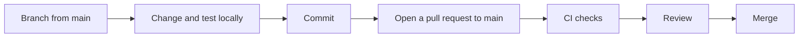

# Contributing

*For New Engineers.*

Find where things live, make a change the way this repository expects, and get it through review. The second half of the page is a set of short recipes for the changes people make most: an endpoint, a table, a feature switch, a setting, a documentation page, a screenshot.

> **Before you start:** have the stack running ([Developer Setup](/docs/setup)) and skim [Testing & CI](/docs/testing-and-ci), so you know which checks your pull request will face.

## Where things live

| Path | What lives there |
|---|---|
| `backend/app/` | The API (FastAPI). `main.py` builds the app and runs start-up; `api/v1/` holds the routers, registered in `api/v1/api.py`; `services/` the business logic, including `aggregation/` and `versioning/`; `providers/` FalkorDB and the provider manager; `db/` the engine, ORM models and repositories; `config/` feature switches, the role and permission seed and other settings; `auth/` the permission checks |
| `backend/auth_service/` | Sign-in, sessions, tokens and CSRF, kept separable from the rest of the API |
| `backend/insights_service/` | The stats service: data-source statistics, discovery and purges |
| `backend/graph/adapters/` | The Neo4j, DataHub and Spanner provider adapters |
| `backend/common/` | Models and interfaces shared between the services |
| `backend/alembic/` | Database migrations, in `versions/` |
| `backend/scripts/` | Command-line tools: demo-data seeders, the schema tool (`upgrade.py`), schema and reference generators, repair scripts |
| `backend/tests/` | Backend tests; `integration/` holds the ones that need live services |
| `frontend/src/` | The React app: `routes.tsx` and `pages/`, `components/`, `features/`, `services/` (API clients), `store/` (Zustand stores), `hooks/`, `lib/` |
| `frontend/scripts/` | Generators, browser probes and screenshot scripts |
| `frontend/public/docs-assets/` | Images used by the documentation |
| `docs/` | The documentation. `docs/guide/` is the User Guide; the app serves both, at `/docs` and `/guide`. |
| `deploy/` | Kubernetes manifests (`k8s/`), the Helm chart (`helm/`), Postgres start-up scripts for Compose (`postgres-init/`), and alternative FalkorDB and Redis topologies for testing (`topologies/`) |
| `scripts/` | Repository-level scripts: the checks behind `./dev.sh doctor`, entrypoints for the development containers, smoke tests |
| `loadtest/` | A Locust load-testing harness with its own dependencies |
| `landing/` | A separate Vite app for the public landing page |
| `data/quickstart/` | The pre-seeded FalkorDB image used by `docker-compose.quickstart.yml` |
| `.github/` | CI workflows and the Dependabot configuration |

At the root: `dev.sh` (development), `deploy.sh` (server install), the `docker-compose*.yml` files, `.env.example` (every development setting, with comments), `.env.prod.example` and `CHANGELOG.md`.

### Which process runs what

One backend codebase runs as several processes. `SYNODIC_ROLE` decides what each one does:

| `SYNODIC_ROLE` | Runs | In the development stack |
|---|---|---|
| `web` | The HTTP API only, with no scheduler or background loops | `viz-service`, which forwards aggregation requests to the control plane |
| `controlplane` | The aggregation API, the scheduler and crash recovery | `aggregation-controlplane` |
| `worker` | Background jobs, with no scheduler | `aggregation-worker`, and `versioning-worker` (which runs `python -m backend.app.services.versioning`) |
| `dev` (when unset) | The HTTP API plus the scheduler, crash recovery and background loops in one process. It runs aggregation jobs itself only when `REDIS_URL` is unset. | The API when you run it on your machine |

[Platform Services](/docs/services-overview) and [Architecture](/docs/architecture) explain why the work is split this way.

## Make a change



1. Start from an up-to-date `main` and create a branch:

   ```bash
   git switch main && git pull
   git switch -c <your-branch>
   ```

2. Make the change with the stack running. [Which changes reload by themselves](/docs/setup#which-changes-reload-by-themselves) tells you when a restart or rebuild is needed.
3. Run the checks for what you touched: the backend test files near your change, `npx vitest run <files>` in `frontend/`, and the [guards](/docs/testing-and-ci#guards) if you touched migrations, feature switches or settings.
4. Commit. Write the subject as one imperative sentence about the outcome, in sentence case, with no type prefix and no full stop, around 65 characters. Recent examples: `Let every page scroll when it is taller than the window`, `Fix late pages and Escape in the entity browser's Orphans only`. An area prefix is fine when it helps (`Orphans panel: reset its list on a provider switch, focus on open`). Use the body to say why the change was needed.
5. Push and open a pull request against `main`. Say what changed and why, and how you tested it.
6. Watch the checks. When one is red, [CI is red — what now?](/docs/testing-and-ci#ci-is-red--what-now) tells you where to start.
7. Merge once the checks are green and the review is done.

## Conventions

| Area | Tool | Configured in | A CI gate? |
|---|---|---|---|
| Backend tests | pytest, with `asyncio_mode = auto` | `backend/pytest.ini` | Yes, the required backend job |
| Python lint, format, types | None configured | | No. Match the code around your change. |
| Frontend tests | Vitest in jsdom | `frontend/vite.config.ts` | Yes, the required frontend job |
| TypeScript lint | ESLint (`npm run lint`, zero warnings allowed) | `frontend/eslint.config.js` | No: it reports errors on `main` today |
| TypeScript types | `npx tsc --noEmit` | `frontend/tsconfig.json` | No: it reports errors on `main` today. The production image builds with `vite build`, which doesn't type-check. |
| Documentation | Integrity, Mermaid and tour-anchor tests | `frontend/src/components/docs/`, `frontend/src/features/tour/` | Yes, inside the required frontend job |
| Migrations | Revision-id and additive-mirror guards; three Schema jobs | `backend/tests/`, `.github/workflows/schema.yml` | Yes |
| Feature switches | Wiring guard | `backend/tests/test_feature_wiring.py` | Yes |
| Settings | Configuration reference check | `backend/scripts/export_config_reference.py` | Yes |

Patterns the code relies on:

- **Endpoints name the permission they need** with `requires("<permission>")` from `backend/app/auth/dependencies.py`. A route any signed-in user may call depends on `get_current_user` instead.
- **Feature switches are enforced by the server first**: `require_feature("<key>")` on routes, and `useFeature('<key>')` wherever the UI offers the feature.
- **Settings are environment variables**, read in the backend and described in `.env.example`; the [Configuration reference](/docs/configuration) is generated from both.
- **The product name is never hard-coded.** The UI reads it with `useBrand()` (`frontend/src/store/branding.ts`); documentation writes &#123;brand} or &#123;brandShort}.
- **Comments record why.** Many explain the incident that shaped a line. Read them before you change it, and leave the same for the next person.

## Common tasks

### Add an API endpoint

1. Create a router module, `backend/app/api/v1/endpoints/<name>.py`:

   ```python
   from fastapi import APIRouter, Depends

   from backend.app.auth.dependencies import requires
   from backend.auth_service.interface import User

   router = APIRouter()


   @router.get("/summary")
   async def get_summary(
       _user: User = Depends(requires("<permission>")),
   ) -> dict:
       return {"ok": True}
   ```

   Use a permission that already exists in `backend/app/config/rbac_seed.py`. For a route under a workspace, also name the path parameter that holds the workspace id, for example `requires("<permission>", workspace="ws_id")`. A new permission is a change to roles; read [Roles & Permissions](/docs/rbac) first.

2. Register it in `backend/app/api/v1/api.py`: add `<name>` to the `from .endpoints import (...)` list, then

   ```python
   api_router.include_router(<name>.router, prefix="/<prefix>", tags=["<tag>"])
   ```

   The API mounts `api_router` under `/api/v1`, so the route answers at `/api/v1/<prefix>/summary`.

3. If a feature switch should turn it off, add `dependencies=[Depends(require_feature("<key>"))]` to the route (`backend/app/api/v1/feature_gate.py`).
4. Add a test, `backend/tests/test_<name>.py`. The `test_client` fixture calls the real app against an in-memory database, signed in as an administrator:

   ```python
   async def test_summary_answers(test_client):
       resp = await test_client.get("/api/v1/<prefix>/summary")
       assert resp.status_code == 200
   ```

5. Run it: `cd backend && python -m pytest tests/test_<name>.py -q`.
6. If users would feel a regression in this route, make the file a merge gate: add `tests/test_<name>.py` to `backend/tests/ci-required-files.txt`, keeping the list sorted.
7. Call it from the frontend through a service in `frontend/src/services/`, using the shared helpers in `apiClient.ts` (`authFetch`).

The interactive API docs at `http://localhost:8000/docs` list your route as soon as the API reloads. [Backend](/docs/backend) maps the existing routers.

### Add a table or a column

1. Declare it on the ORM model in `backend/app/db/models.py` (aggregation tables: `backend/app/services/aggregation/models.py`).
2. Create the migration, in your virtual environment:

   ```bash
   cd backend
   alembic revision -m "<what it does>" --rev-id <YYYYMMDD_HHMM_short_name>
   ```

   Alembic writes `backend/alembic/versions/<YYYYMMDD_HHMM>_<slug>.py` with `down_revision` set to the current head. Keep the revision id to 32 characters or fewer (`YYYYMMDD_HHMM_` leaves 18); a longer id fails the guard.

3. Write the migration so it works however the database was built: guard the DDL (`ADD COLUMN IF NOT EXISTS`, a `has_table` check), and never guard data changes. [Database Migrations](/docs/migrations) explains why, with examples.
4. If you also add the column to `_additive_migrations` in `backend/app/services/aggregation/db_init.py`, the migration must add it too; `test_additive_migrations_mirror.py` checks the pair.
5. Apply it. In Docker, `./dev.sh rebuild` (the `upgrade` service runs migrations from its image), then `./dev.sh logs upgrade`. On your machine, `python -m backend.scripts.upgrade upgrade`.
6. Run the [guards](/docs/testing-and-ci#guards) and the [schema checks](/docs/testing-and-ci#schema-checks).

### Add a feature switch

The full contract, with the reasons, is in [Feature switch lifecycle](/docs/feature-flags-lifecycle). In short:

1. Declare the facts in `backend/app/config/feature_wiring.py` with `stage="experimental"` while you build.
2. Add the definition to `SEED_DEFINITIONS` in `backend/app/config/features_seed.py`, with every required field: `key`, `name`, `description`, `impact_when_off`, `category_id`, `type`, `default_value` (OFF while experimental) and `sort_order`.
3. Gate the server with `require_feature("<key>")` and the UI with `useFeature('<key>')`, and seed the key's default in `DEFAULT_FEATURES` in `frontend/src/store/features.ts`.
4. Run the guard: `python -m pytest backend/tests/test_feature_wiring.py -q --noconftest`.
5. Let the API restart (in Docker it reloads by itself when you save). Start-up adds the definition, and the switch appears on **Administration → Features** with the **Preview — still being built** badge.

[Feature Switches](/guide/feature-switches) is what administrators read about the page.

### Add an environment variable

1. Read it in the backend, with its default: `os.getenv("<NAME>", "<default>")`.
2. Describe it in `.env.example` with a comment on its line or directly above it. The configuration reference takes its description from there (production-only settings go in `.env.prod.example`).
3. If a service in the Docker stack needs it, pass it in that service's `environment:` in `docker-compose.yml`. `.env.dev` only fills in the `${…}` values in the Compose files; a container sees only the variables its service lists.
4. Regenerate the reference and commit the result:

   ```bash
   python3 backend/scripts/export_config_reference.py
   ```

   It rewrites `docs/CONFIGURATION.md`. CI runs the same script with `--check` and fails while the committed page is out of date.

5. If production needs it, set it in the Kubernetes configuration too; [Kubernetes](/docs/kubernetes) shows where.

### Add a documentation or guide page

1. Write the Markdown: `docs/<FILE>.md` for the engineering documentation, `docs/guide/<FILE>.md` for the User Guide. Open with an italic audience line and the reader's goal; end with **Where to next**.
2. Register it:
   - A doc: add an entry to `docEntries` in `frontend/src/components/docs/docsConfig.ts`: `slug`, then `section` on the next line, `title`, `description`, and `importFn: () => import('@docs/<FILE>.md?raw')`. The integrity test reads entries in that shape.
   - A guide page: add an entry to `guideEntries` in `frontend/src/components/guide/guideConfig.ts` with `slug`, `section`, `persona`, `title`, `description` and `importFn: () => import('@docs/guide/<FILE>.md?raw')`.
3. For a doc, give it a Diátaxis type in `DOC_TYPES` in `frontend/src/components/docs/reading/DocTypeBadge.tsx` (`tutorial`, `how-to`, `reference` or `explanation`); the test fails without one. If other docs will link to the file by name, add `'<FILE>.md': '<slug>'` to `filenameMap` in `frontend/src/components/docs/MarkdownComponents.tsx`.
4. Write for the reader:
   - &#123;brand} and &#123;brandShort} instead of the product name; the reader substitutes the live brand.
   - Link with routes: `/docs/<slug>`, `/guide/<slug>`, `/docs/<slug>#<heading-anchor>`. A doc may also link a registered file relatively (`MIGRATIONS.md`); a guide page may not.
   - No raw HTML (the reader shows it as text), no GitHub links, and no links to repository-only files such as the technical-debt register, `docs/security/` or the release notes. Name those in `code` instead.
   - Mermaid diagrams must parse; keep them small (`flowchart`, `sequenceDiagram` or `stateDiagram-v2`) and quote any label with punctuation.
5. Run the [documentation checks](/docs/testing-and-ci#documentation-checks), then open `http://localhost:5173/docs/<slug>` or `/guide/<slug>`. The development frontend reads `docs/` straight from your working copy.

### Add or refresh a screenshot

1. Guide images live in `frontend/public/docs-assets/guide/`, and a page shows one with an ordinary Markdown image whose path is `/docs-assets/guide/<name>.png`. The integrity test fails if the file is missing.
2. Shots are captured with `frontend/scripts/guide-shots.mjs`, which signs in and photographs the running app. Before you run it:
   - The stack is up, with the API on 8000 and Vite on `http://localhost:5173`, and the demo data onboarded ([Developer Setup](/docs/setup#load-demo-data)).
   - `ADMIN_PASSWORD` in `.env.dev` holds the password you chose at the first sign-in. The script signs in with `ADMIN_EMAIL` and `ADMIN_PASSWORD`, and the published default can't get past the password change.
   - Chrome or Chromium is available. The script uses one listening on remote-debugging port 9222, or starts a headless one if it finds Chrome installed.
3. Take the shots:

   ```bash
   cd frontend
   node scripts/guide-shots.mjs
   ```

   It writes the images to `frontend/.harness/guide-shots/` (ignored by git), prints `✓ <name>.png` for each one, and exits non-zero if any shot failed. To take only some, pass the output folder and then the shot names (file names without `.png`). The list of shots lives in the script.

4. Copy the images you want into `frontend/public/docs-assets/guide/`.

Pages mark a screenshot that is still needed with an invisible line, `[screenshot-pending]: # "<page-slug>-<short-name> — <what the shot should show>"`. Find them with `grep -rn "screenshot-pending" docs`.

## What to document next

Two signals say where readers get stuck:

- **Administration → Telemetry** (needs the `system:audit:read` permission). **Content gaps — searches that found nothing** lists up to 15 searches in the docs and guide search box that returned no results, most frequent first. **Helpful by page** counts the 👍 and 👎 votes from the **Was this helpful?** question at the foot of every page. Switch the window between **7d**, **30d** (the default) and **90d**. Only signed-in readers are counted. [The Admin Console](/guide/governance-ops) describes the page for administrators.
- `python3 scripts/docs_coverage.py` lists feature switches, backend services and API router groups with no mention anywhere in the documentation. A miss means "check by hand", not "certainly undocumented".

Pick a content gap or a page with 👎 votes, fix it with the recipe above, and check the numbers again after a release.

## Debugging

| To | Run |
|---|---|
| Follow a service's log | `./dev.sh logs viz-service` (any service name) |
| Open a shell in a service | `./dev.sh shell viz-service` |
| Query the database | `./dev.sh exec postgres psql -U synodic -d synodic` |
| See recent aggregation jobs | In `psql`: `SELECT id, status, progress, data_source_id FROM aggregation.aggregation_jobs ORDER BY created_at DESC LIMIT 10;` |
| Check the aggregation queue | `./dev.sh exec redis redis-cli XLEN aggregation.jobs` and `./dev.sh exec redis redis-cli XINFO GROUPS aggregation.jobs` |
| Query the graph | The FalkorDB browser at `http://localhost:3000`, or `./dev.sh exec falkordb redis-cli GRAPH.QUERY nexus_lineage "MATCH (n) RETURN count(n)"` |
| Try a request by hand | The interactive API docs at `http://localhost:8000/docs` |

## Where to next

- [Testing & CI](/docs/testing-and-ci) — when you want to know exactly what your pull request will be checked against.
- [Architecture](/docs/architecture) — before a change that crosses services.
- [Backend](/docs/backend) or [Frontend](/docs/frontend) — for the internals of the half you're changing.
- [API Guide](/docs/api-guide) — when you're building against the API rather than inside it.
