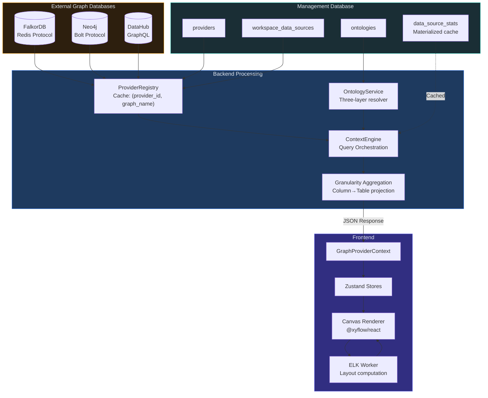
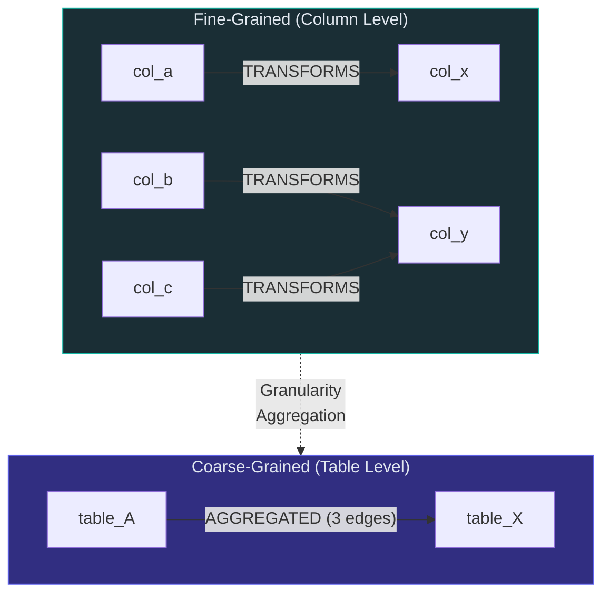
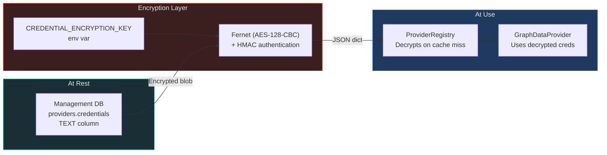
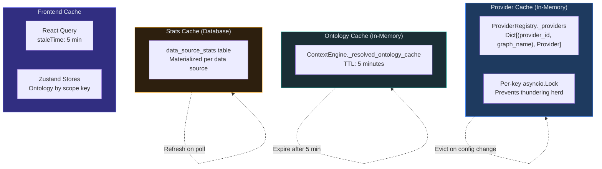
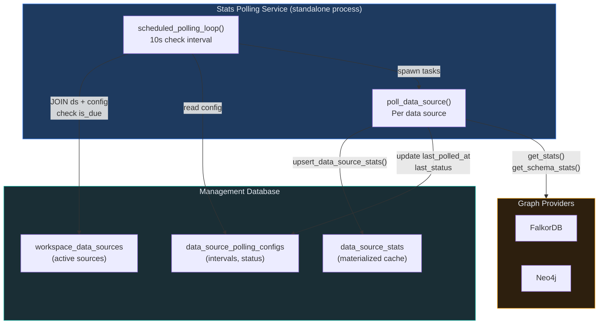
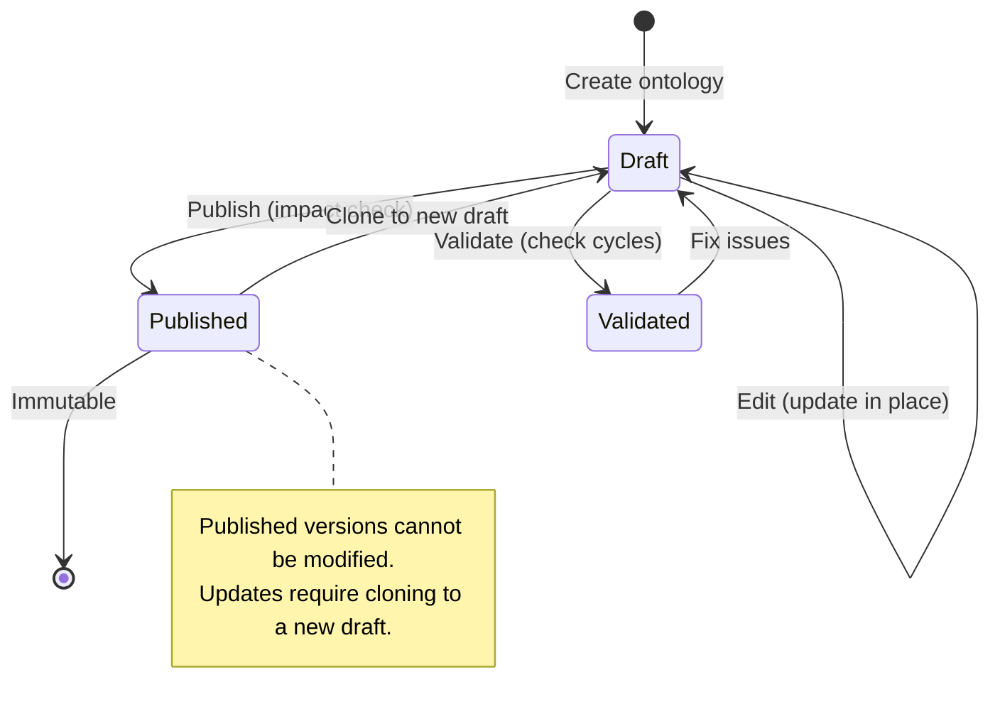

# Data Architecture

## Overview

Synodic's data architecture spans two distinct layers:
1. **Management Database** (SQLite/PostgreSQL) -- stores platform metadata: users, workspaces, providers, ontologies, views, feature flags
2. **Graph Databases** (FalkorDB, Neo4j, DataHub) -- stores the actual graph data: nodes, edges, lineage, containment hierarchies

The management layer is accessed through SQLAlchemy 2.0 async ORM. Graph data is accessed through the pluggable `GraphDataProvider` interface.

---

## 1. Entity-Relationship Diagram

```mermaid
erDiagram
    providers ||--o{ workspace_data_sources : "hosts"
    providers ||--o{ catalog_items : "catalogs"
    ontologies ||--o{ workspace_data_sources : "defines"
    workspaces ||--o{ workspace_data_sources : "contains"
    workspaces ||--o{ views : "scopes"
    workspaces ||--o{ context_models : "scopes"
    workspaces ||--o{ assignment_rule_sets : "scopes"
    workspace_data_sources ||--o| catalog_items : "references"
    workspace_data_sources ||--o| data_source_stats : "cached stats"
    workspace_data_sources ||--o| data_source_polling_configs : "polling"
    workspace_data_sources ||--o| ontology_source_mappings : "type mapping"
    context_models ||--o{ views : "templates"
    views ||--o{ view_favourites : "bookmarked by"
    users ||--o{ user_roles : "has roles"
    users ||--o{ user_approvals : "approval trail"
    users ||--o{ view_favourites : "favourites"
    users ||--o{ outbox_events : "triggers"

    providers {
        text id PK "prov_*"
        text name
        text provider_type "falkordb|neo4j|datahub|mock"
        text host
        int port
        text credentials "Fernet-encrypted JSON"
        bool tls_enabled
        bool is_active
        json permitted_workspaces
        json extra_config
        datetime created_at
        datetime updated_at
    }

    ontologies {
        text id PK "bp_*"
        text name
        int version
        text description
        bool is_published "immutable when true"
        bool is_system
        text scope "universal|workspace"
        text evolution_policy "reject|deprecate|migrate"
        json containment_edge_types "legacy flat list"
        json lineage_edge_types "legacy flat list"
        json entity_type_definitions "rich Dict"
        json relationship_type_definitions "rich Dict"
        json edge_type_metadata "legacy flat"
        json entity_type_hierarchy "legacy flat"
        json root_entity_types "legacy flat"
        datetime created_at
        datetime updated_at
    }

    workspaces {
        text id PK "ws_*"
        text name
        text description
        bool is_default
        bool is_active
        datetime created_at
        datetime updated_at
    }

    workspace_data_sources {
        text id PK "ds_*"
        text workspace_id FK
        text provider_id FK
        text graph_name
        text ontology_id FK "nullable"
        text catalog_item_id FK "nullable"
        text label
        bool is_primary
        bool is_active
        text projection_mode "in_source|dedicated"
        text dedicated_graph_name
        text access_level "read|write|admin"
        json extra_config
        datetime created_at
        datetime updated_at
    }

    catalog_items {
        text id PK "cat_*"
        text provider_id FK
        text source_identifier
        text name
        text description
        json permitted_workspaces
        text status "active|archived|deprecated"
        datetime created_at
        datetime updated_at
    }

    ontology_source_mappings {
        text id PK
        text data_source_id FK
        text ontology_id FK "nullable"
        json entity_type_mappings
        json relationship_type_mappings
        text last_seen_schema_hash
        datetime last_seen_at
        bool has_drift
        json drift_details
    }

    views {
        text id PK "view_*"
        text name
        text description
        text workspace_id FK
        text data_source_id FK "nullable"
        text context_model_id FK "nullable"
        text visibility "enterprise|team|personal"
        text owner_user_id
        text creator_user_id
        json config
        json tags
        bool is_pinned
        datetime created_at
        datetime updated_at
    }

    view_favourites {
        text id PK
        text view_id FK
        text user_id
    }

    context_models {
        text id PK
        text name
        text description
        text workspace_id FK "nullable for templates"
        text data_source_id FK "nullable"
        bool is_template
        text category
        json layers_config
        json scope_filter
        json instance_assignments
        json scope_edge_config
        bool is_active
        datetime created_at
        datetime updated_at
    }

    data_source_stats {
        text data_source_id PK "FK"
        int node_count
        int edge_count
        json entity_type_counts
        json edge_type_counts
        json schema_stats
        json ontology_metadata
        json graph_schema
        datetime updated_at
    }

    data_source_polling_configs {
        text data_source_id PK "FK"
        bool is_enabled
        int interval_seconds
        text last_polled_at
        text last_status "pending|success|error"
        text last_error
    }

    assignment_rule_sets {
        text id PK
        text workspace_id FK "nullable"
        text connection_id FK "legacy, nullable"
        text data_source_id FK "nullable"
        text name
        text description
        bool is_default
        json layers_config
        datetime created_at
        datetime updated_at
    }

    users {
        text id PK "usr_*"
        text email UK
        text password_hash "Argon2id"
        text first_name
        text last_name
        text status "pending|active|suspended"
        text auth_provider "local|saml2|oidc"
        text external_id
        json metadata "SSO claims"
        text reset_token_hash
        datetime reset_token_expires_at
        datetime created_at
        datetime updated_at
        datetime deleted_at "soft delete"
    }

    user_roles {
        text id PK
        text user_id FK
        text role_name "admin|user|viewer"
        datetime created_at
    }

    user_approvals {
        text id PK
        text user_id FK
        text approved_by FK "nullable"
        text status "pending|approved|rejected"
        text rejection_reason
        datetime created_at
        datetime resolved_at
    }

    outbox_events {
        text id PK "evt_*"
        text event_type "user.created|user.approved|..."
        text payload "JSON"
        bool processed "default false"
        text created_at
    }
```



### Single-Row Tables (Configuration)

| Table | Purpose | Key Fields |
|-------|---------|------------|
| `feature_flags` | Global feature toggle values | `config` (JSON), `version` (optimistic concurrency) |
| `feature_registry_meta` | Admin UI experimental notice | `experimental_notice_enabled`, `title`, `message` |

### Feature Definition Tables

| Table | Purpose |
|-------|---------|
| `feature_definitions` | Feature metadata: key, name, type, default, category, implemented flag |
| `feature_categories` | Category UI metadata: label, icon, color, sort_order, preview mode |

### Legacy Table (Migration Path)

| Table | Purpose | Status |
|-------|---------|--------|
| `graph_connections` | Pre-workspace connection model | **Deprecated** -- being replaced by Provider + WorkspaceDataSource |

---

## 2. Data Flow: End to End



### Detailed Query Flow

1. **Frontend** sends `POST /api/v1/{ws_id}/graph/trace` with JWT
2. **Auth middleware** validates JWT, extracts user
3. **Endpoint** calls `get_context_engine(ws_id, data_source_id?)`
4. **ContextEngine factory** resolves:
   - WorkspaceDataSource from management DB
   - Provider from ProviderRegistry (cached or instantiated)
   - Ontology via OntologyService (system default + assigned + introspected, cached 5 min)
5. **ContextEngine** calls provider's `get_trace_lineage(urn, direction, depth, containment_edges, lineage_edges)`
6. **Provider** (e.g., FalkorDB) executes Cypher queries against graph DB
7. **ContextEngine** applies granularity aggregation if requested (collapses fine-grained edges to coarser entity type levels)
8. **Response** serialized as JSON with camelCase aliases and returned to frontend
9. **Frontend** stores nodes/edges in `useCanvasStore`, triggers ELK layout in Web Worker
10. **Canvas** renders updated graph

---

## 3. Graph Data Model

### Node & Edge Representation

```mermaid
graph LR
    subgraph Node["GraphNode"]
        URN["urn: unique resource name"]
        ET["entityType: from ontology"]
        DN["displayName"]
        Props["properties: Dict[str, Any]"]
        Tags["tags: List[str]"]
        Layer["layerAssignment: from context model"]
    end

    subgraph Edge["GraphEdge"]
        EID["id: edge identifier"]
        Src["sourceUrn"]
        Tgt["targetUrn"]
        EType["edgeType: from ontology"]
        Conf["confidence: 0.0-1.0"]
        EProps["properties: Dict[str, Any]"]
    end

    Node --- Edge

    style Node fill:#1e3a5f,stroke:#3b82f6,color:#e2e8f0
    style Edge fill:#2d1f0e,stroke:#f59e0b,color:#e2e8f0
```



### Edge Classification

Edges are classified by the ontology, not hardcoded:

| Category | Examples | Ontology Flag | Purpose |
|----------|---------|---------------|---------|
| **Containment** | CONTAINS, BELONGS_TO | `is_containment: true` | Parent-child hierarchy |
| **Lineage** | TRANSFORMS, PRODUCES, CONSUMES | `is_lineage: true` | Data flow / dependencies |
| **Aggregated** | AGGREGATED | materialized | Coarse-grained rollup edges |
| **Structural** | RELATES_TO, REFERENCES | neither flag | General associations |

### Aggregated Edges



**AggregatedEdgeInfo:**
- `edgeCount`: Number of underlying fine-grained edges
- `edgeTypes`: Types of underlying edges
- `sourceEdgeIds`: Traceability back to original edges
- `confidence`: Derived from underlying edges

---

## 4. Credential Management



**Credential fields** (per `ConnectionCredentials` Pydantic model):
- `username: Optional[str]`
- `password: Optional[str]`
- `token: Optional[str]`

**Security rules:**
- Credentials are **never returned in API responses** (stripped from ProviderResponse, ConnectionResponse)
- Decrypted only when instantiating a provider connection
- Falls back to plaintext if `CREDENTIAL_ENCRYPTION_KEY` not set (development only)
- Fernet key: base64-encoded 32-byte key, generate with `Fernet.generate_key()`

---

## 5. Caching Strategy



| Cache | Location | Key | TTL | Invalidation |
|-------|----------|-----|-----|--------------|
| **Provider instances** | ProviderRegistry (process memory) | `(provider_id, graph_name)` | Forever (until evicted) | `evict_provider()`, `evict_workspace()`, `evict_all()` |
| **Resolved ontology** | ContextEngine (per instance) | Per ContextEngine | 5 minutes | `invalidate_ontology_cache()` or TTL expiry |
| **Graph stats** | `data_source_stats` table | `data_source_id` | Manual refresh | Polling service or API trigger |
| **Frontend ontology** | Zustand `useSchemaStore` | `workspaceId/dataSourceId` | Until scope change | Scope key change |
| **Frontend queries** | React Query | Per query key | 5 minutes | Automatic stale/refetch |

---

## 6. Stats Polling Service

The Stats Polling Service (`backend/stats_service/main.py`) is a standalone async process that periodically refreshes materialized statistics for each active data source.



**Polling lifecycle:**
1. Loop wakes every 10 seconds and queries all active data sources joined with their polling configs
2. Auto-creates default config (enabled, 300s interval) for any unconfigured data source
3. Checks elapsed time since `last_polled_at` against `interval_seconds`
4. Due sources are polled concurrently via `asyncio.gather`
5. Each poll creates its own DB session and instantiates a `ContextEngine` to access the provider
6. Four queries run concurrently per source: `get_stats()`, `get_schema_stats()`, `get_ontology_metadata()`, `get_graph_schema()`
7. Results are upserted to `data_source_stats` and polling config is updated with status/timestamp
8. On failure, error status and message are recorded in the polling config

---

## 7. Transactional Outbox Pattern

The `outbox_events` table implements a transactional outbox for domain events, ensuring reliable event publishing alongside database writes.

| Column | Type | Purpose |
|--------|------|---------|
| `id` | `evt_*` text | Unique event ID |
| `event_type` | text | Domain event name (e.g. `user.created`, `user.approved`) |
| `payload` | JSON text | Serialized event data |
| `processed` | boolean | Whether event has been consumed |
| `created_at` | text (ISO) | Event timestamp |

**Index:** `idx_outbox_processed_created` on `(processed, created_at)` for efficient consumer queries.

**Usage pattern:**
- Events are written in the same transaction as the domain operation (e.g., user signup writes both the user row and the outbox event)
- A consumer process polls for `processed = false` events, processes them, and marks them as processed
- This decouples domain actions from side effects (email notifications, audit logs) without distributed transactions

---

## 8. Schema Migration Strategy

### Current Approach: Inline Migrations

The project uses **inline ALTER TABLE statements** in `init_db()` rather than Alembic:

```python
# backend/app/db/engine.py: init_db()
migrations = [
    "ALTER TABLE workspace_data_sources ADD COLUMN projection_mode TEXT",
    "ALTER TABLE workspace_data_sources ADD COLUMN dedicated_graph_name TEXT",
    "ALTER TABLE ontologies ADD COLUMN entity_type_definitions TEXT DEFAULT '{}'",
    "ALTER TABLE ontologies ADD COLUMN evolution_policy TEXT DEFAULT 'reject'",
    # ... 15+ more
]
for stmt in migrations:
    try:
        await conn.execute(sqlalchemy.text(stmt))
    except Exception:
        pass  # Column already exists, safe to ignore
```

**Characteristics:**
- All migrations are idempotent (safe to re-run)
- No version tracking or ordering
- No rollback capability
- Tables created via `Base.metadata.create_all()` on startup

### Phased Migration History

| Phase | Changes |
|-------|---------|
| **0a** | Rename `ontology_blueprints` to `ontologies`, `blueprint_id` to `ontology_id` |
| **1** | Add `entity_type_definitions`, `relationship_type_definitions` columns |
| **2** | Add `description`, `evolution_policy` columns |
| **3+** | Multi-source support, schema drift detection, polling config |

---

## 9. Ontology Versioning



**Versioning rules:**
- Each ontology has a `name` + `version` (integer)
- `is_published = false` (draft): editable in place
- `is_published = true`: **immutable** -- all modifications rejected
- To update a published ontology: clone it (creates draft at version N+1), edit, publish
- Publishing runs impact analysis against latest published version

**Evolution policies:**
| Policy | Behavior on Breaking Change |
|--------|----------------------------|
| `reject` | Block publish (default, safest) |
| `deprecate` | Allow, mark removed types as deprecated |
| `migrate` | Allow with auto-rename/remap manifest |

---

## 10. Data Integrity & Constraints

### Primary Keys

All tables use text UUIDs with semantic prefixes:
- `prov_*` -- Providers
- `bp_*` -- Ontologies
- `ws_*` -- Workspaces
- `ds_*` -- Data Sources
- `usr_*` -- Users
- `view_*` -- Views
- `cat_*` -- Catalog Items
- `conn_*` -- Legacy Connections

### Foreign Keys & Cascades

| FK | On Delete |
|----|-----------|
| `workspace_data_sources.workspace_id` -> `workspaces.id` | CASCADE |
| `workspace_data_sources.provider_id` -> `providers.id` | CASCADE |
| `workspace_data_sources.ontology_id` -> `ontologies.id` | SET NULL |
| `workspace_data_sources.catalog_item_id` -> `catalog_items.id` | SET NULL |
| `catalog_items.provider_id` -> `providers.id` | CASCADE |
| `views.workspace_id` -> `workspaces.id` | CASCADE |
| `assignment_rule_sets.workspace_id` -> `workspaces.id` | CASCADE |
| `user_roles.user_id` -> `users.id` | CASCADE |
| `user_approvals.user_id` -> `users.id` | CASCADE |

### Unique Constraints

| Constraint | Purpose |
|-----------|---------|
| `workspace_data_sources(workspace_id, provider_id, graph_name)` | One binding per triple |
| `users.email` | Unique emails |
| `user_roles(user_id, role_name)` | No duplicate roles |
| `view_favourites(view_id, user_id)` | One favourite per user per view |

### Single-Row Table Enforcement

| Table | Constraint |
|-------|-----------|
| `feature_flags` | `id = 1` always |
| `feature_registry_meta` | Single row by convention |
| `management_db_config` | `id = 1` always |
