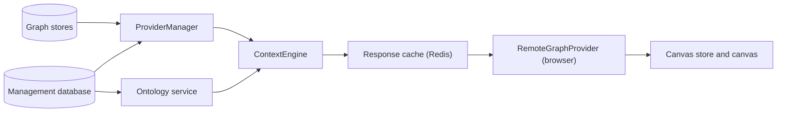
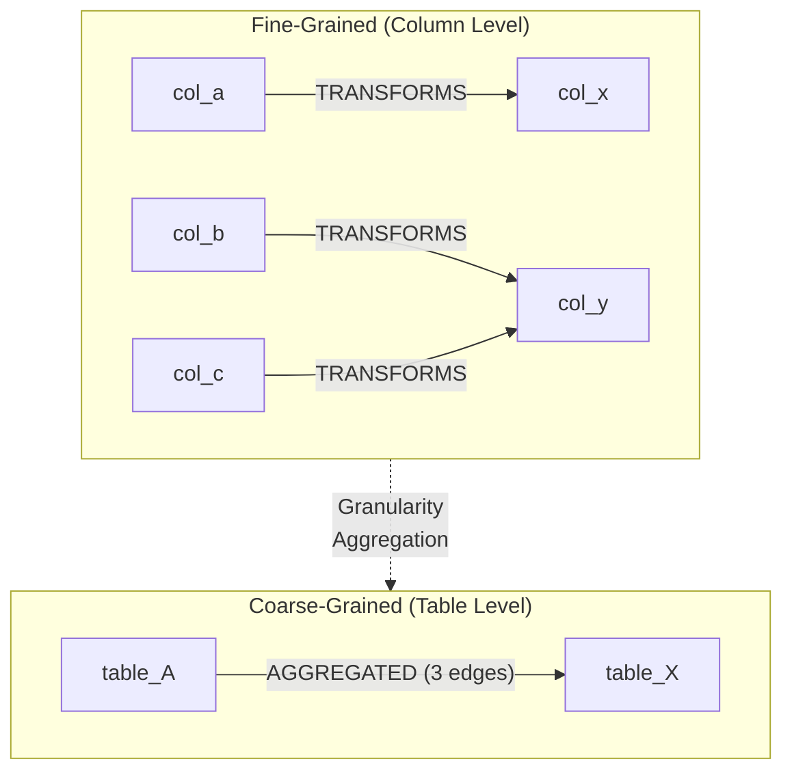
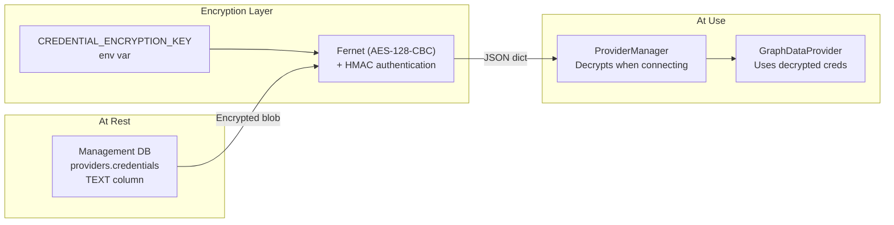
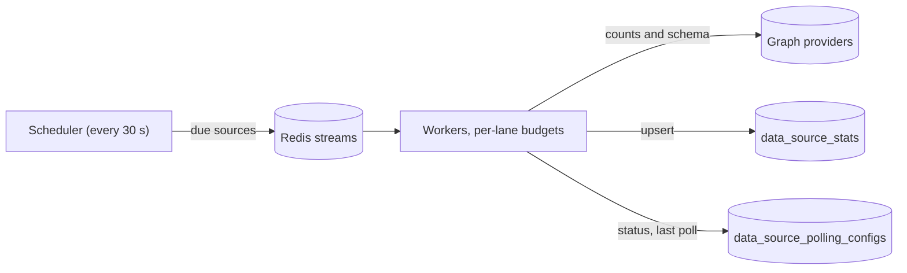
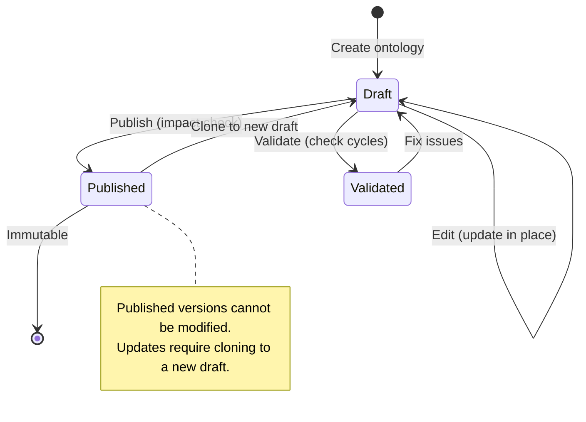

# Data Architecture

*For architects, backend engineers, DBAs and operators.*

This page explains where {brand} keeps its data and how it moves: what each store holds, how the core management tables relate, how a read travels from a graph store to the canvas, and how caching, credentials, events and schema changes work.

**What you'll find here:**
- Where every table belongs, and the core management-database model
- End-to-end query flow and the graph data model
- Credential encryption, caching, and Redis role decoupling
- Stats polling, the transactional outbox, migrations, and data-integrity constraints

---

## Overview

{brand} keeps its data in three kinds of store:
- **PostgreSQL** — in every environment; there is no SQLite branch, and any `MANAGEMENT_DB_URL` that is not a `postgresql+asyncpg://` URL is rejected at startup. It holds the management database (users, workspaces, providers, ontologies, views, feature switches), the `aggregation` job tables, and the `graphver` version store for graph version control, which `GRAPHVER_DB_URL` can move to its own instance.
- **Graph databases** (FalkorDB by default; Neo4j, DataHub and Google Cloud Spanner Graph as further providers) — the graph itself: nodes, edges, lineage and containment hierarchies.
- **Redis** — job and event streams, locks, rate limits, the session store and caches. Never on FalkorDB; see [Redis Topology & Decoupling](#redis-topology--decoupling).

The management database is accessed through the SQLAlchemy 2.0 async ORM, and its schema is built and migrated only by the `upgrade` job ([§8](#8-schema-migration-strategy)). Graph data is accessed through the pluggable `GraphDataProvider` interface.

> **See also:** [Platform Services](/docs/services-overview) for the process roles (`SYNODIC_ROLE`: `web`, `worker`, `controlplane`, `dev`) that operate over these stores.

## Where every table belongs

The ORM maps 87 tables across four PostgreSQL schemas. This page details the core management tables only; the map below places the rest. Which module may read which table — the boundary a lint test guards — is set out in [Domain Ownership](/docs/domain-ownership).

| Area | Schema | Tables | Examples |
|---|---|---|---|
| Identity and sessions | `public` | 9 | `users`, `user_identities`, `refresh_tokens`, `revoked_refresh_jti`, `invites` |
| Access control | `public` | 8 | `roles`, `permissions`, `role_bindings`, `groups`, `resource_grants`, `access_requests` |
| Single sign-on | `public` | 4 | `idp_providers`, `idp_group_role_mappings`, `sso_backchannel_hosts`, `app_auth_config` |
| Workspaces and data sources | `public` | 3 | `workspaces`, `workspace_data_sources`, `assignment_rule_sets` |
| Providers and catalog | `public` | 5 | `providers`, `catalog_items`, `provider_admission_config`, `asset_discovery_cache` |
| Semantic layer | `public` | 3 | `ontologies`, `ontology_audit_log`, `ontology_source_mappings` |
| Views | `public` | 10 | `views`, `view_versions`, `view_favourites`, `context_models`, `object_store_objects` |
| Stats and profiling | `public` | 4 | `data_source_stats`, `data_source_count_snapshots`, `data_source_count_rollups`, `data_source_count_alerts` |
| Aggregation and freshness | `public` | 2 | `data_source_polling_configs`, `refresh_events` |
| Platform settings | `public` | 11 | `feature_flags`, `feature_definitions`, `platform_settings`, `application_branding`, `announcements` |
| Events and audit | `public` | 4 | `outbox_events`, `auth_audit_log`, `product_events`, `notifications` |
| Legacy | `public` | 1 | `graph_connections` — do not write to it |
| Aggregation jobs | `aggregation` | 6 | `aggregation_jobs`, `data_source_state`, `reconcile_runs`, `job_event_log` |
| Version store | `graphver` (`GRAPHVER_SCHEMA`) | 13 | `graphs`, `branches`, `commits`, `node_versions`, `edge_versions`, `entity_heads`, `merge_requests` |
| Property side index | `propidx` | 4 | `node_props`, `prop_keys`, `graph_state`, `hot_indexes` — created, not yet used ([Property storage](/docs/property-storage)) |

The version store's design is in [Versioning: Data Model](/docs/versioning-data-model).

---

## 1. Entity-Relationship Diagram

The core management tables and how they relate. Two related tables are not drawn: a user's sign-in identities (one row per linked identity provider) live in `user_identities`, and role assignments live in `role_bindings` — `user_roles` is a legacy copy kept for display. See [RBAC](/docs/rbac).


```mermaid
erDiagram
    providers ||--o{ workspace_data_sources : "hosts"
    providers ||--o{ catalog_items : "catalogs"
    ontologies ||--o{ workspace_data_sources : "defines"
    ontologies ||--o{ ontology_audit_log : "audit trail"
    workspaces ||--o{ workspace_data_sources : "contains"
    workspaces ||--o{ views : "scopes"
    workspaces ||--o{ context_models : "scopes"
    workspaces ||--o{ assignment_rule_sets : "scopes"
    workspace_data_sources ||--o| catalog_items : "references"
    workspace_data_sources ||--o| data_source_stats : "cached stats"
    workspace_data_sources ||--o| data_source_polling_configs : "polling"
    workspace_data_sources ||--o| ontology_source_mappings : "type mapping"
    context_models ||--o{ views : "templates"
    views ||--o{ view_favourites : "bookmarked by"
    users ||--o{ user_roles : "has roles"
    users ||--o{ user_approvals : "approval trail"
    users ||--o{ view_favourites : "favourites"
    users ||--o{ outbox_events : "triggers"

    providers {
        text id PK "prov_*"
        text name
        text provider_type "falkordb|neo4j|datahub|spanner"
        text host
        int port
        text credentials "Fernet-encrypted JSON"
        bool tls_enabled
        bool is_active
        json permitted_workspaces
        json extra_config
        datetime created_at
        datetime updated_at
    }

    ontologies {
        text id PK "bp_*"
        text name
        int version
        text description
        bool is_published "immutable when true"
        bool is_system
        text scope "universal|workspace"
        text evolution_policy "reject|deprecate|migrate"
        json containment_edge_types "legacy flat list"
        json lineage_edge_types "legacy flat list"
        json entity_type_definitions "rich Dict"
        json relationship_type_definitions "rich Dict"
        json edge_type_metadata "legacy flat"
        json entity_type_hierarchy "legacy flat"
        json root_entity_types "legacy flat"
        datetime created_at
        datetime updated_at
    }

    workspaces {
        text id PK "ws_*"
        text name
        text description
        bool is_default
        bool is_active
        datetime created_at
        datetime updated_at
    }

    workspace_data_sources {
        text id PK "ds_*"
        text workspace_id FK
        text provider_id FK
        text graph_name
        text ontology_id FK "nullable"
        text catalog_item_id FK "nullable"
        text label
        bool is_primary
        bool is_active
        text projection_mode "in_source|dedicated"
        text dedicated_graph_name
        text access_level "read|write|admin"
        json extra_config
        datetime created_at
        datetime updated_at
    }

    catalog_items {
        text id PK "cat_*"
        text provider_id FK
        text source_identifier
        text name
        text description
        json permitted_workspaces
        text status "active|archived|deprecated"
        datetime created_at
        datetime updated_at
    }

    ontology_source_mappings {
        text id PK
        text data_source_id FK
        text ontology_id FK "nullable"
        json entity_type_mappings
        json relationship_type_mappings
        text last_seen_schema_hash
        datetime last_seen_at
        bool has_drift
        json drift_details
    }

    views {
        text id PK "view_*"
        text name
        text description
        text workspace_id FK
        text data_source_id FK "nullable"
        text context_model_id FK "nullable"
        text visibility "private|workspace|enterprise"
        text created_by
        text updated_by
        json config
        json tags
        bool is_pinned
        datetime created_at
        datetime updated_at
    }

    view_favourites {
        text id PK
        text view_id FK
        text user_id
    }

    context_models {
        text id PK
        text name
        text description
        text workspace_id FK "nullable for templates"
        text data_source_id FK "nullable"
        bool is_template
        text category
        json layers_config
        json scope_filter
        json instance_assignments
        json scope_edge_config
        bool is_active
        datetime created_at
        datetime updated_at
    }

    data_source_stats {
        text data_source_id PK "FK"
        int node_count
        int edge_count
        json entity_type_counts
        json edge_type_counts
        json schema_stats
        json ontology_metadata
        json graph_schema
        datetime updated_at
    }

    data_source_polling_configs {
        text data_source_id PK "FK"
        bool is_enabled
        int interval_seconds
        text last_polled_at
        text last_status "pending|success|error"
        text last_error
    }

    assignment_rule_sets {
        text id PK
        text workspace_id FK "nullable"
        text connection_id FK "legacy, nullable"
        text data_source_id FK "nullable"
        text name
        text description
        bool is_default
        json layers_config
        datetime created_at
        datetime updated_at
    }

    users {
        text id PK "usr_*"
        text email UK
        text password_hash "Argon2id"
        text first_name
        text last_name
        text status "pending|active|suspended"
        text signup_source "local_signup|sso_jit|invite|admin_created|admin_linked"
        json metadata "SSO claims"
        text reset_token_hash
        datetime reset_token_expires_at
        datetime created_at
        datetime updated_at
        datetime deleted_at "soft delete"
    }

    user_roles {
        text id PK
        text user_id FK
        text role_name "legacy copy of the global role"
        datetime created_at
    }

    user_approvals {
        text id PK
        text user_id FK
        text approved_by FK "nullable"
        text status "pending|approved|rejected"
        text rejection_reason
        datetime created_at
        datetime resolved_at
    }

    outbox_events {
        text id PK "evt_*"
        text event_type "user.created|user.approved|..."
        text payload "JSON"
        bool processed "default false"
        text created_at
    }

    announcements {
        text id PK "ann_*"
        text title
        text message
        text banner_type "info|warning|success"
        bool is_active
        int snooze_duration_minutes
        text cta_text
        text cta_url
        text created_by
        text updated_by
        datetime created_at
        datetime updated_at
    }

    announcement_config {
        int id PK "single-row, id=1"
        int poll_interval_seconds
        int default_snooze_minutes
        text updated_by
        datetime updated_at
    }

    ontology_audit_log {
        text id PK "oal_*"
        text ontology_id FK
        text schema_id "groups versions"
        text action "created|updated|published|deleted|restored|cloned"
        text actor
        int version
        text summary
        json changes
        datetime created_at
    }
```

### Single-Row Tables (Configuration)

| Table | Purpose | Key Fields |
|-------|---------|------------|
| `feature_flags` | Global feature toggle values | `config` (JSON), `version` (optimistic concurrency) |
| `feature_registry_meta` | Admin UI experimental notice | `experimental_notice_enabled`, `experimental_notice_title`, `experimental_notice_message` |
| `platform_settings` | Platform-wide defaults | node identity and name properties, profiling retention and alert policy |

### Feature Definition Tables

| Table | Purpose |
|-------|---------|
| `feature_definitions` | Feature metadata: key, name, type, default, category, implemented flag |
| `feature_categories` | Category UI metadata: label, icon, color, sort_order, preview mode |

### Legacy Table (Migration Path)

| Table | Purpose | Status |
|-------|---------|--------|
| `graph_connections` | Pre-workspace connection model | **Deprecated** — replaced by Provider + WorkspaceDataSource; do not write to it |

---

## 2. Data Flow: End to End


```mermaid
flowchart LR
    GS[("Graph stores")] --> PM["ProviderManager"]
    MDB[("Management database")] --> PM
    MDB --> OS["Ontology service"]
    PM --> CE["ContextEngine"]
    OS --> CE
    CE --> GC["Response cache (Redis)"]
    GC --> RGP["RemoteGraphProvider (browser)"]
    RGP --> CV["Canvas store and canvas"]
```

### Detailed Query Flow

A lineage trace on the Graph canvas, from click to picture:

1. **The app** sends `POST /api/v1/{ws_id}/graph/trace/v2` with the session cookies and the data source in the query.
2. **The API** authenticates the session (`get_current_user`) and checks access to the workspace, or to the view the request names.
3. **Admission.** The request is admitted for its data source before it takes a database connection, or shed with `429` and `Retry-After`.
4. **`get_context_engine`** builds a `ContextEngine` for the workspace and data source (`ContextEngine.for_workspace`), which resolves:
   - the data source from the management database;
   - its provider from `ProviderManager` — cached per process, or connected and cached on first use;
   - its ontology — system defaults, plus the assigned ontology, plus types introspected from the graph — from a process-wide cache that a Redis generation bump refreshes on every change, with a 5-minute backstop.
5. **The response cache** answers if it can; otherwise one caller computes while identical requests wait for it.
6. **`ContextEngine.trace`** asks the provider for the trace at the requested hierarchy level (`trace_at_level`); FalkorDB runs it as set-based Cypher, bounded by the node and time budgets.
7. **The response** is serialised as JSON with camelCase names, cached, and returned; a capped trace says `truncated: true`.
8. **The app** merges the nodes and edges into `useCanvasStore`, and the Graph canvas lays them out with ELK.js on the browser's main thread.

The other trace endpoints, and the guards a read passes, are described in [Architecture → Request lifecycle](/docs/architecture#request-lifecycle).

---

## 3. Graph Data Model

### Node & Edge Representation


```mermaid
graph LR
    subgraph Node["GraphNode"]
        URN["urn: unique resource name"]
        ET["entityType: from ontology"]
        DN["displayName"]
        Props["properties: Dict[str, Any]"]
        Tags["tags: List[str]"]
        Layer["layerAssignment: from context model"]
    end

    subgraph Edge["GraphEdge"]
        EID["id: edge identifier"]
        Src["sourceUrn"]
        Tgt["targetUrn"]
        EType["edgeType: from ontology"]
        Conf["confidence: 0.0-1.0"]
        EProps["properties: Dict[str, Any]"]
    end

    Node --- Edge

```

### Edge Classification

Edges are classified by the ontology, not hardcoded:

| Category | Examples | Ontology Flag | Purpose |
|----------|---------|---------------|---------|
| **Containment** | CONTAINS, BELONGS_TO | `is_containment: true` | Parent-child hierarchy |
| **Lineage** | TRANSFORMS, PRODUCES, CONSUMES | `is_lineage: true` | Data flow / dependencies |
| **Aggregated** | AGGREGATED | materialized | Coarse-grained rollup edges |
| **Structural** | RELATES_TO, REFERENCES | neither flag | General associations |

### Aggregated Edges


```mermaid
graph TB
    subgraph Fine["Fine-Grained (Column Level)"]
        C1["col_a"] -->|TRANSFORMS| C2["col_x"]
        C3["col_b"] -->|TRANSFORMS| C4["col_y"]
        C5["col_c"] -->|TRANSFORMS| C4
    end

    subgraph Coarse["Coarse-Grained (Table Level)"]
        T1["table_A"] -->|"AGGREGATED (3 edges)"| T2["table_X"]
    end

    Fine -.->|"Granularity<br/>Aggregation"| Coarse

```

**AggregatedEdgeInfo:**
- `edgeCount`: Number of underlying fine-grained edges
- `edgeTypes`: Types of underlying edges
- `sourceEdgeIds`: Traceability back to original edges
- `confidence`: Derived from underlying edges

---

## 4. Credential Management


```mermaid
graph LR
    subgraph Store["At Rest"]
        DB["Management DB<br/>providers.credentials<br/>TEXT column"]
    end

    subgraph Encrypt["Encryption Layer"]
        Fernet["Fernet (AES-128-CBC)<br/>+ HMAC authentication"]
        Key["CREDENTIAL_ENCRYPTION_KEY<br/>env var"]
    end

    subgraph Use["At Use"]
        Registry["ProviderManager<br/>Decrypts when connecting"]
        Provider["GraphDataProvider<br/>Uses decrypted creds"]
    end

    Key --> Fernet
    DB -->|"Encrypted blob"| Fernet
    Fernet -->|"JSON dict"| Registry
    Registry --> Provider

```

**Credential fields** (the `ConnectionCredentials` Pydantic model): `username`, `password` and `token`, plus provider-specific secrets — a Spanner service-account key (`service_account_json`) and the credentials of a dedicated cache or Sentinel endpoint.

> **Important:** Set `CREDENTIAL_ENCRYPTION_KEY` before you store real credentials. With it set, credentials are Fernet-encrypted at rest. Without it, a development deployment stores them unencrypted, and with `ENV` set to `prod` or `production` the write is refused. Generate a key with `Fernet.generate_key()`. See [ADR-008](/docs/decisions#adr-008-fernet-for-credential-encryption).

**Security rules:**
- Credentials are **never returned in API responses**; a provider's response says only whether a secret is set, and secrets inside `extra_config` are masked.
- They are decrypted in the backend when a provider is connected, and when an update merges new values into the stored set.
- Identity-provider settings (`idp_providers`) are encrypted the same way, with the same key.
- The Fernet key is a base64-encoded 32-byte key from `Fernet.generate_key()`.

---

## 5. Caching Strategy

Four layers of cache sit between a graph store and the canvas. None is a source of truth: each can be dropped and rebuilt.

| Cache | Location | Key | Lifetime | Invalidation |
|-------|----------|-----|-----|--------------|
| **Provider instances** | `ProviderManager`, in each process's memory | `(provider_id, graph_name)` | Until evicted; at most `PROVIDER_CACHE_MAX` (256), and reaped after `PROVIDER_CACHE_IDLE_TTL_SECS` (900 s) idle | A provider edit is broadcast over Redis; also `evict_provider()`, `evict_data_source()`, `evict_workspace()`, `evict_all()` |
| **Resolved ontology** | Process-wide (`backend/app/services/resolved_ontology_cache.py`) | `(workspace_id, data_source_id)` | 300 s backstop | Any ontology change or reassignment bumps a Redis generation counter (`ontgen:{ws}:{ds}`), so every process re-resolves on its next read |
| **Graph read responses** | Redis: payloads on the `CACHE` role, generation counters on the `STREAMS` role | Workspace, data source, branch, physical graph, generation, endpoint and parameters | 300 s for traces; 3,600 s for children, rollups, top-level pages and canvas pages; a last-known-good copy for 24 h | Every graph write bumps the generation; the last-known-good copy is served only when the store is down or times out |
| **Graph stats** | `data_source_stats` table | `data_source_id` | Until the next poll | The stats service refreshes it; write paths ask for a poll within seconds, and the reconcile interval is 900 s by default |
| **Graph responses in the browser** | `RemoteGraphProvider` | `GET` requests, by URL | 2 seconds by default, up to 60 seconds for metadata | Expiry |
| **Frontend ontology** | `useSchemaStore` | Scope key, `workspaceId/dataSourceId` | Until the scope changes | Scope change |
| **Frontend queries** | React Query | Query key | 5 minutes stale time | Automatic refetch |

---

## Redis Topology & Decoupling

> **Important:** FalkorDB hosts the graph **only**. Every operational Redis structure (streams, cache, locks, rate-limit, revocation) lives on a dedicated Redis — never on FalkorDB. This is enforced by construction, not convention ([ADR-020](/docs/decisions#adr-020-dedicated-redis-decoupled-from-falkordb-by-construction)): a FalkorDB restart or OOM can never wipe the cache or contend with graph queries.

There are **two distinct Redis roles**, and they must never be confused:

| Role | Server | Hosts | Rule |
|------|--------|-------|------|
| **Graph** | FalkorDB (`falkordb:6379`) | The lineage graph (`GRAPH.QUERY`) + dedicated-mode `{graph}_proj` projection graphs | Graph data **only** |
| **Operational** | Dedicated Redis (`redis:6379`) | Everything else (see map below) | Never on FalkorDB |

FalkorDB *is* a Redis-module process, so it is physically possible to put
application data on it. We forbid that **by construction** (ADR-020): a FalkorDB
restart/OOM must never wipe the cache or make cache traffic contend with graph
queries on FalkorDB's single-threaded process. `build_cache_client` returns
`None` (cache disabled, best-effort) rather than ever building on FalkorDB
nodes. At startup a deployed role must resolve the `STREAMS` endpoint; the
`CACHE` role may be configured globally or only per provider, so it is
resolved and logged rather than required.

### Role-prefixed config surface

Each role is configured independently via `REDIS_STREAMS_*` / `REDIS_CACHE_*`
(host/port/db/username/password/password-file, TLS, Sentinel, pool tuning —
see [ADR-022](DECISIONS.md#adr-022-central-role-keyed-redis-config-cachestreams-independent)
for the full var list). This is now the canonical way to configure each role.

Legacy `REDIS_URL` (+ `REDIS_USERNAME`/`_PASSWORD`/`_TLS_*`) and
`CACHE_REDIS_URL` remain supported as **role-scoped back-compat** —
`REDIS_URL` maps only to `STREAMS`, `CACHE_REDIS_URL` maps only to `CACHE` —
and role-prefixed vars win when both are set. The use-case map and runbooks
below still reference `REDIS_URL` / `CACHE_REDIS_URL` for brevity; read those
as the `STREAMS` / `CACHE` roles respectively (either the legacy var or its
`REDIS_STREAMS_*` / `REDIS_CACHE_*` equivalent).

A provider can also override the `CACHE` role entirely for itself via
`extra_config.cacheConnection` (+ encrypted per-provider credentials) — a
whole-endpoint override that never inherits the global cache's password or CA
(ADR-022).

### Use-case map (everything operational is on the dedicated Redis)

| Use-case | Redis structure | Endpoint | Loss profile |
|----------|-----------------|----------|--------------|
| Aggregation job dispatch | **Stream** (`XREADGROUP`) | `REDIS_URL` db0 | Durable (MAXLEN-bounded) |
| Aggregation status → state-sync | **Stream** (`viz-state-sync` group) | `REDIS_URL` db0 | Durable |
| Versioning projection dispatch | **Stream** | `REDIS_URL` | Durable |
| Job SSE events + live-state | **Stream + KV** | `REDIS_URL` | Durable / TTL |
| Cancel bridge | **Pub/Sub** | `REDIS_URL` | Ephemeral |
| Exec / advisory locks | `SET NX PX` / PG lock | `REDIS_URL` / Postgres | TTL (design-tolerant) |
| Rate-limit (fair-share, admission) | Lua token-bucket | `REDIS_URL` | TTL (self-heals) |
| Session store: revocation tombstones and workspace grants | KV | `REDIS_URL` | TTL (session-bounded) |
| Graph read response cache (`graph_cache`) | KV cache + generation counters | payloads on `CACHE_REDIS_URL` db1, counters on `REDIS_URL` db0 | TTL (recomputable) |
| FalkorDB ancestor/URN/stats cache | KV/Hash cache | `CACHE_REDIS_URL` db1 | TTL (recomputable) |

### Streams vs Cache vs Pub/Sub — why they differ

- **Streams** (`XADD`/`XREADGROUP`) — a durable, ordered, replayable append-log
  with consumer groups. Used for **work queues + event delivery**: at-least-once,
  survives a consumer crash (Pending-Entry-List + `XAUTOCLAIM`), bounded by
  `MAXLEN`. Must-not-lose, low volume.
- **Cache** (`GET`/`SET EX`, hashes) — ephemeral, TTL'd, **loss-tolerant** KV
  (recomputable from source). High volume, memory-heavy, evictable.
- **Pub/Sub** (`PUBLISH`/`SUBSCRIBE`) — fire-and-forget fan-out with **no
  persistence**: a down subscriber misses the message and every subscriber gets
  every message. Fine for the cancel bridge; wrong for state-sync (which is why
  ADR-017 moved state-sync from Pub/Sub → Streams).

### One instance vs. splitting (the dedicated Redis)

`STREAMS` and `CACHE` are independently configurable roles (see [Role-prefixed
config surface](#role-prefixed-config-surface) below) — they are never
required to share an instance. **Dev co-locates the two roles on one Redis**
via DB indices (`db0` streams, `db1` cache) as a zero-config convenience.
**Production points them at two separate Memorystore instances**
(`synodic-redis-coord` / `synodic-redis-cache` — see
[INFRASTRUCTURE_LAUNCH_SCALE.md §6](INFRASTRUCTURE_LAUNCH_SCALE.md#6-memorystore-for-redis--cache--coordination-never-combined)),
each with its own host, credential, and TLS/mTLS PKI. A Redis DB index
(`db0` bus vs `db1` cache) is **namespace-only** — it does *not* isolate CPU
(Redis is single-threaded), memory, eviction policy, connections, or the
failure domain, which is exactly why production splits onto two instances
rather than relying on DB-index separation alone.

The correctness-critical risk of sharing — cache pressure evicting durable data
— is already handled:

- **`maxmemory-policy volatile-lru`** (compose + k8s): only keys **with a TTL**
  are evictable. Streams carry **no TTL**, so job/event streams are structurally
  protected; the high-volume, LRU cache is evicted first.
- **Streams are `MAXLEN`-bounded**, so they can't grow unbounded and OOM the
  instance.
- Everything else that's TTL'd (locks, rate-limit, revocation) is loss-tolerant
  by design and evicted only *after* the cache.

So a single shared instance is safe for any environment that colocates the two
roles — dev's default. The residual coupling is *performance/availability*
(single-threaded CPU contention; a failover blips everything at once), not
correctness.

### Runbook — when to split the cache onto a second Redis

**Production has already done this** (`synodic-redis-coord` / `synodic-redis-cache`
— [INFRASTRUCTURE_LAUNCH_SCALE.md §6](INFRASTRUCTURE_LAUNCH_SCALE.md#6-memorystore-for-redis--cache--coordination-never-combined)).
This runbook is the reference for any other environment (dev, staging, a
smaller self-hosted deploy) that still colocates the two roles and needs to
split them.

`REDIS_CACHE_*` and `REDIS_STREAMS_*` (or the legacy `CACHE_REDIS_URL` /
`REDIS_URL`) are already **two independent config values** that may resolve to
the same instance. Splitting is therefore **deploy-only, no code change**:
point the `CACHE` role at a second Redis and it gets its own CPU / memory /
eviction / failover domain.

**Split when any of these is true:**

1. **CPU** on the MemoryStore is consistently high — cache reads are starving
   stream/bus throughput on the single thread.
2. **Memory** sits near `maxmemory` with heavy eviction churn — the cache is
   evicting itself constantly and hit-rate is collapsing.
3. You move the cache to a Redis **Cluster** — then the split is *forced*: the
   bus cannot run on Cluster (Streams/consumer-groups + Pub/Sub don't shard
   cleanly — `build_bus_redis` rejects Cluster), and `CACHE_REDIS_URL=.../1`
   breaks because **Cluster supports DB 0 only** (use `.../0` or key-prefixing).

**How to split (zero code):**

1. Provision a second Redis/MemoryStore for the cache.
2. Set `CACHE_REDIS_URL` (web/worker/controlplane) to the new instance; leave
   `REDIS_URL` on the original bus instance.
3. Give the **cache** instance `volatile-lru` + generous `maxmemory`; keep the
   **bus** instance protective (`noeviction` or ample headroom — streams/locks
   must never be evicted).
4. Roll the deployment. No migration: the cache is recomputable, so a cold
   cache on the new instance simply warms from source.

> Note: FalkorDB running in **Cluster or Sentinel** mode is independent of all
> of the above — that is the *graph* connection (`build_graph_client`), which is
> unaffected by cache/bus placement.

### Migration notes (behavior deltas from the role-keyed factory, ADR-022)

- **Sentinel daemon auth.** The old bus builder sent the data-plane
  `REDIS_USERNAME`/`REDIS_PASSWORD` to the Sentinel **daemons** themselves,
  unconditionally. The factory now gates daemon auth behind
  `REDIS_{R}_SENTINEL_AUTH_ENABLED` (or explicit
  `_SENTINEL_USERNAME`/`_SENTINEL_PASSWORD`) — sending a data-plane password to
  an unauthenticated Sentinel daemon broke `discover_master`, so the new
  default fixes that. Deployments with authenticated Sentinel daemons must set
  `REDIS_{R}_SENTINEL_AUTH_ENABLED=true`.
- **Legacy `rediss://` cache release note.** A deployment that set
  `CACHE_REDIS_URL=rediss://…` previously inherited the FalkorDB connection's
  client certificate for the cache's TLS; it now uses system-trust TLS for the
  cache — correct per the decoupling above, but a behavior delta for that one
  shape.
- **Override precedence.** A data source's `extra_config.cacheConnection`
  overrides the provider's at the top level (`_merge_extra_config`);
  validation on both refuses secrets and cluster settings there.

---

## 6. Stats Polling Service

The stats service (`python -m backend.insights_service`, image `backend/Dockerfile.insights`) keeps `data_source_stats` fresh, so the API serves cached counts and schema instead of querying a provider on every read. It replaced the retired `backend/stats_service/` skeleton ([ADR-018](/docs/decisions#adr-018-retire-the-graph-service)).


```mermaid
flowchart LR
    SCH["Scheduler (every 30 s)"] -->|"due sources"| RS[("Redis streams")]
    RS --> WK["Workers, per-lane budgets"]
    WK -->|"counts and schema"| GP[("Graph providers")]
    WK -->|"upsert"| ST[("data_source_stats")]
    WK -->|"status, last poll"| PC[("data_source_polling_configs")]
```

**Polling lifecycle:**
1. Each scheduler tick (`STATS_SCHEDULER_TICK_SECS`, 30 seconds by default) finds the data sources that are due, creating a polling config for any that has none (enabled, `STATS_DEFAULT_INTERVAL_SECS` — 900 seconds by default).
2. Due sources are put on Redis streams; a per-source claim keeps at most one pending poll per source across replicas.
3. Workers in the same process take them off the streams in separate lanes — quick counts, deep schema scans, discovery and purges — each with its own concurrency budget, so a slow scan never holds up counts.
4. Results are upserted into `data_source_stats`, and the polling config records the status and time of the poll.

The interval is a safety net, not the freshness mechanism: the API's write paths ask for a counts poll within seconds, and a read of stale stats queues one. If Redis is down the pipeline pauses and the API keeps serving the last stored stats, marked stale. Lanes, knobs and limits: [Insights](/docs/services-insights).

---

## 7. Transactional Outbox Pattern

The `outbox_events` table implements a transactional outbox for domain events, so an event is recorded if and only if the change it describes is committed.

| Column | Type | Purpose |
|--------|------|---------|
| `id` | `evt_*` text | Unique event ID |
| `event_type` | text | Domain event name (e.g. `user.created`, `user.approved`) |
| `event_version` | integer | Payload schema version, bumped on an incompatible change |
| `aggregate_type`, `aggregate_id` | text | The kind of entity the event is about, and its id |
| `payload` | JSON text | Serialized event data |
| `processed` | boolean | Whether the event has been consumed |
| `created_at` | text (ISO) | Event timestamp |

**Indexes:** `idx_outbox_processed_created` on `(processed, created_at)` for the consumer, plus indexes on the aggregate and on the event type.

**Usage pattern:**
- Events are written in the same transaction as the domain operation (for example, a sign-up writes both the user row and the outbox event).
- The outbox relay (`backend/app/services/outbox_relay.py`) drains unprocessed events into the append-only `auth_audit_log` and marks them processed in the same transaction. A unique source-event id means a retry cannot record an event twice.
- This decouples domain actions from their side effects, such as the audit trail, without distributed transactions.

---

## 8. Schema Migration Strategy

### Current Approach: Alembic Migrations

The project uses **versioned Alembic migrations** as the source of schema truth,
alongside the SQLAlchemy ORM models. Migrations live in
`backend/alembic/versions/` (a linear/merge-able revision chain from
`0001_baseline` forward), and are the authoritative record of every schema
change.

**Applying migrations** is owned by a dedicated `synodic-upgrade` job
(`backend/scripts/upgrade.py`, image `backend/Dockerfile.upgrade`) — a one-shot
`upgrade` service that every backend service waits for in Docker Compose, and a
pre-install/pre-upgrade hook Job in the Helm chart. On an empty database it
builds the schema at head from `0001_baseline`, seeds the RBAC reference rows and
stamps head, rather than replaying every revision. Developers running `uvicorn`
directly apply migrations first with:

```bash
python -m backend.scripts.upgrade upgrade   # alembic upgrade head, under pg_advisory_lock
python -m backend.scripts.upgrade check     # exits 0 iff the DB matches every head
```

**The API process never migrates the schema.** `init_db()`
(`backend/app/db/engine.py`) only *verifies* that `alembic_version` matches the
expected head(s):

```python
# backend/app/db/engine.py: init_db() (abridged)
expected_heads = sorted(ScriptDirectory.from_config(cfg).get_heads())
result = await conn.execute(sa_text("SELECT version_num FROM alembic_version"))
applied = sorted({r[0] for r in result.fetchall()})

at_head = applied == expected_heads
# missing alembic_version  → BootstrapError("schema_not_initialised") (degraded mode)
# revision mismatch        → loud error, keep serving; /health/ready surfaces it
```

**Characteristics:**
- Full version tracking and ordering via the Alembic revision graph
- Rollback capability (`downgrade`) where migrations define it
- Migrations run exactly once, under a `pg_advisory_lock`, by the upgrade job
- With the Helm chart, a `wait-for-schema` init container (`upgrade check --wait`)
  holds every backend pod until the migration has completed
- The aggregation control plane and worker still create their own `aggregation`
  tables if missing (`create_all(checkfirst=True)` in
  `backend/app/services/aggregation/db_init.py`), as a safety net for start-order
  races

Why the schema is owned this way: [ADR-025](/docs/decisions#adr-025-postgresql-only-management-database-schema-owned-by-an-upgrade-job). The rules a new migration has to follow: [Migrations](/docs/migrations).

### Migration History

The earliest schema evolution — renaming `ontology_blueprints` → `ontologies`
(and `blueprint_id` → `ontology_id`), the first
`entity_type_definitions`/`relationship_type_definitions` and
`evolution_policy` columns, and the multi-source / schema-drift / polling-config
work — predates Alembic and is consolidated into the `0001_baseline` revision.
Everything since is an individual dated revision in
`backend/alembic/versions/`.

---

## 9. Ontology Versioning


```mermaid
stateDiagram-v2
    [*] --> Draft: Create ontology
    Draft --> Draft: Edit (update in place)
    Draft --> Published: Publish (impact check)
    Published --> [*]: Immutable
    Published --> Draft: Clone to new draft
    Draft --> Validated: Validate (check cycles)
    Validated --> Draft: Fix issues

    note right of Published
        Published versions cannot be modified.
        Updates require cloning to a new draft.
    end note
```

**Versioning rules:**
- Each ontology has a `name` + `version` (integer)
- `is_published = false` (draft): editable in place
- `is_published = true`: **immutable** -- all modifications rejected
- To update a published ontology: clone it (creates draft at version N+1), edit, publish
- Publishing runs impact analysis against latest published version

**Evolution policies:**
| Policy | Behavior on Breaking Change |
|--------|----------------------------|
| `reject` | Block publish (default, safest) |
| `deprecate` | Allow, mark removed types as deprecated |
| `migrate` | Allow with auto-rename/remap manifest |

---

## 10. Data Integrity & Constraints

### Primary Keys

Most management tables use text ids with semantic prefixes:
- `prov_*` -- Providers
- `bp_*` -- Ontologies
- `ws_*` -- Workspaces
- `ds_*` -- Data Sources
- `usr_*` -- Users
- `view_*` -- Views
- `cat_*` -- Catalog Items
- `ann_*` -- Announcements
- `oal_*` -- Ontology Audit Log
- `evt_*` -- Outbox events

The legacy `graph_connections` table uses unprefixed UUIDs.

### Foreign Keys & Cascades

| FK | On Delete |
|----|-----------|
| `workspace_data_sources.workspace_id` -> `workspaces.id` | CASCADE |
| `workspace_data_sources.provider_id` -> `providers.id` | CASCADE |
| `workspace_data_sources.ontology_id` -> `ontologies.id` | SET NULL |
| `workspace_data_sources.catalog_item_id` -> `catalog_items.id` | SET NULL |
| `catalog_items.provider_id` -> `providers.id` | CASCADE |
| `views.workspace_id` -> `workspaces.id` | CASCADE |
| `assignment_rule_sets.workspace_id` -> `workspaces.id` | CASCADE |
| `user_roles.user_id` -> `users.id` | CASCADE |
| `user_approvals.user_id` -> `users.id` | CASCADE |

### Unique Constraints

| Constraint | Purpose |
|-----------|---------|
| `workspace_data_sources(workspace_id, provider_id, graph_name)`, among live rows (`deleted_at IS NULL`) | One binding per triple |
| `workspace_data_sources(catalog_item_id)`, among live rows | A catalog item backs at most one live data source |
| `users.email` | Unique emails |
| `user_roles(user_id, role_name)` | No duplicate roles |
| `view_favourites(view_id, user_id)` | One favourite per user per view |
| `catalog_items(provider_id, source_identifier)` | One catalog entry per source per provider |

### Single-Row Table Enforcement

| Table | Constraint |
|-------|-----------|
| `feature_flags` | `id = 1` always |
| `feature_registry_meta` | `id = 1` always |
| `platform_settings` | `id = 1` always |
| `management_db_config` | `id = 1` always |
| `announcement_config` | `id = 1` always |

---

## Where in the code

| Concern | Where |
|---|---|
| Management tables | `backend/app/db/models.py` |
| Aggregation, version-store and property-index tables | `backend/app/services/aggregation/models.py`, `backend/app/jobs/models.py`, `backend/app/services/versioning/models.py`, `backend/app/db/propidx_models.py` |
| Engine, pools and the schema check | `backend/app/db/engine.py` (`init_db`) |
| Migrations | `backend/alembic/versions/`, `backend/scripts/upgrade.py` |
| Provider cache | `backend/app/providers/manager.py` (`ProviderManager`) |
| Resolved-ontology cache | `backend/app/services/resolved_ontology_cache.py` |
| Response cache | `backend/app/services/graph_cache.py` (`GraphCache`) |
| Redis roles | `backend/common/adapters/redis_endpoint.py` (`resolve_redis_config`, `build_redis_client`) |
| Credential encryption | `backend/app/db/repositories/connection_repo.py` (`_encrypt`, `_decrypt`) |
| Outbox relay | `backend/app/services/outbox_relay.py` |
| Stats service | `backend/insights_service/` |

## See also

- [Architecture](/docs/architecture) — the processes, the stores and a request's lifecycle
- [Domain Ownership](/docs/domain-ownership) — which module owns which table
- [Decisions](/docs/decisions) — the ADRs behind the entity model, the Redis roles and the schema ownership
- [Versioning: Data Model](/docs/versioning-data-model) — the version store's tables
- [Aggregation Pipeline](/docs/aggregation-pipeline) — how `:AGGREGATED` rollup edges are computed and written
- [Migrations](/docs/migrations) — how the schema is built and changed
