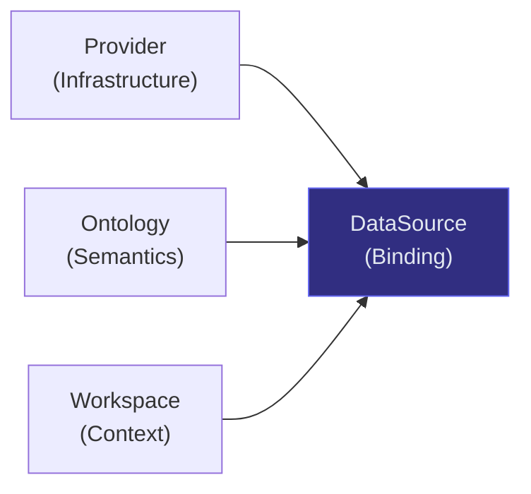
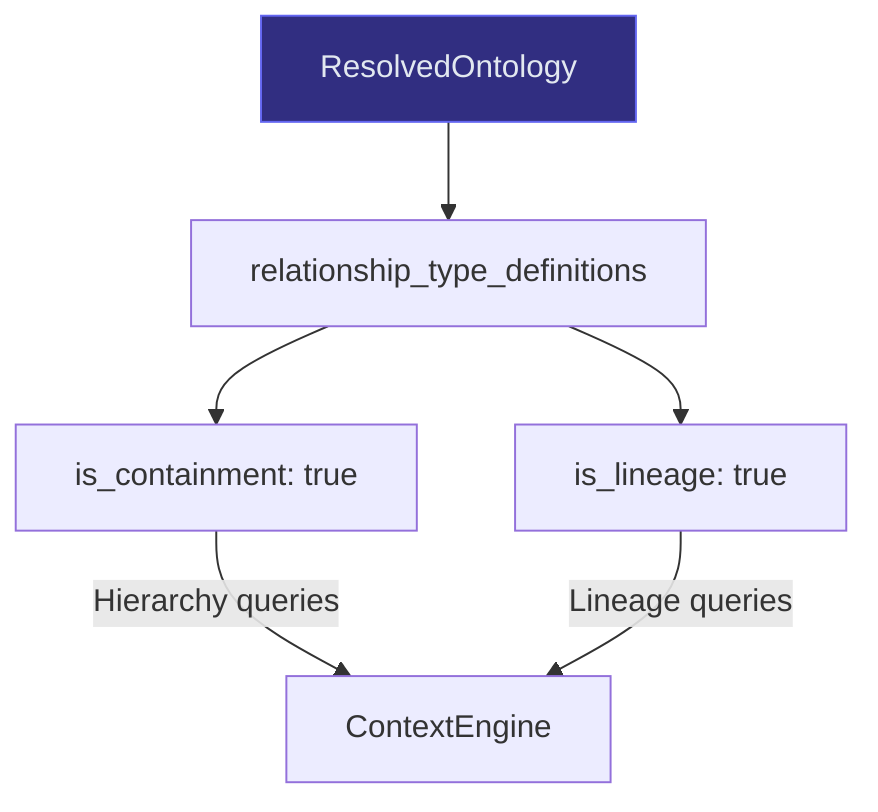
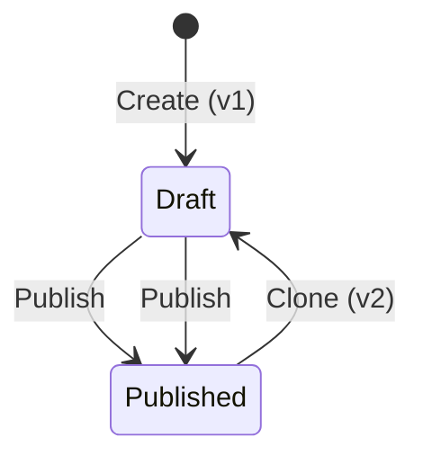
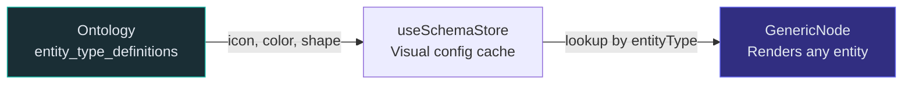
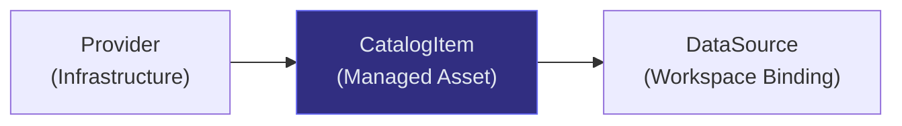

# Architectural Decision Records (ADRs)

This document captures the key architectural decisions made in Synodic, their reasoning, trade-offs, and status.

---

## ADR-001: Three-Entity Model (Provider + Ontology + Workspace)

**Status:** Accepted
**Date:** 2025 Q4
**Context:** The original system used a single "connection" concept that coupled infrastructure (host/port), semantics (schema), and operational context (team/project) together. This made it impossible to reuse a single database connection across teams or version semantic schemas independently.

**Decision:** Split into three orthogonal entities:

| Entity | Responsibility | Reuse Pattern |
|--------|---------------|---------------|
| Provider | Connection params, credentials, host/port | One FalkorDB cluster serves N workspaces |
| Ontology | Entity types, relationship types, hierarchy, visual config | One ontology version assigned to M data sources |
| Workspace | Team/project operational context | Contains N data sources, each binding Provider + Ontology |
| DataSource | The binding within a workspace | Unique per (workspace, provider, graph_name) |

**Reasoning:**
- Providers are infrastructure-level: same cluster can host many graphs
- Ontologies are semantic: teams may share the same schema or customize independently
- Workspaces are organizational: different teams get isolated views
- Separation enables independent versioning, permissioning, and lifecycle management

**Trade-offs:**
- (+) Flexible multi-tenancy
- (+) Independent ontology versioning without affecting infrastructure
- (+) Provider reuse without credential duplication
- (-) More tables and relationships to manage
- (-) Migration complexity from legacy connection model
- (-) Steeper learning curve for new developers

**Alternatives considered:**
- Single "connection" entity (original approach) -- too coupled, couldn't version schemas
- Two-entity model (Provider + Workspace) -- semantics still coupled to workspace

---

## ADR-002: Dual FastAPI Services

**Status:** Accepted
**Date:** 2025 Q4
**Context:** Users need to test database connectivity before registering a provider. This testing should not require database access or authentication.

**Decision:** Run two independent FastAPI services:

| Service | Port | Stateful | DB Access | Auth |
|---------|------|----------|-----------|------|
| Visualization Service | 8000 | Yes | Yes (management DB) | JWT required |
| Graph Service | 8001 | No | No | None |

**Reasoning:**
- Graph Service is stateless: accepts credentials in request body, tests connectivity, returns result
- No management DB dependency means it can be scaled independently
- Pre-registration UX: users test connection before committing to provider creation
- Separation of concerns: discovery vs. operation

**Trade-offs:**
- (+) Graph Service can scale independently without DB bottleneck
- (+) Clean pre-registration UX flow
- (-) Developers must run two services locally
- (-) Shared provider instantiation code duplicated across services
- (-) Additional operational complexity (two Docker containers, two health checks)

**Alternatives considered:**
- Single service with unauthenticated endpoint -- mixes auth concerns
- WebSocket-based testing -- unnecessary complexity for simple ping tests

---

## ADR-003: Ontology-Driven Edge Classification

**Status:** Accepted
**Date:** 2025 Q4
**Context:** Early versions hardcoded edge type classification (e.g., `CONTAINS` = containment, `TRANSFORMS` = lineage). This broke when connecting to external systems with different naming conventions.

**Decision:** Edge classification comes entirely from the resolved ontology, not hardcoded values.

**Reasoning:**
- External systems (DataHub, Neo4j) use different edge type names
- Ontology source mappings translate external types to Synodic types
- Classification is per-ontology, not global -- different workspaces can classify edges differently
- Granularity aggregation uses hierarchy levels from ontology, not hardcoded entity types

**Trade-offs:**
- (+) Works with any graph backend without code changes
- (+) Users can customize classification per workspace
- (-) More complex resolution logic (three-layer merge)
- (-) Harder to reason about without ontology context

---

## ADR-004: Immutable Published Ontologies

**Status:** Accepted
**Date:** 2025 Q4
**Context:** Users accidentally modified ontology definitions that were in use by active workspaces, causing rendering breaks and data inconsistencies.

**Decision:** Published ontologies are **immutable**. Updates require cloning to a new draft version.

**Reasoning:**
- Prevents accidental breaking changes to active workspaces
- Enables rollback by re-assigning a previous version
- Impact analysis compares draft to published before allowing publish
- Evolution policy (`reject`, `deprecate`, `migrate`) gates breaking changes

**Trade-offs:**
- (+) Safe schema evolution
- (+) Audit trail of ontology changes
- (+) Rollback capability
- (-) Version proliferation over time (need cleanup tooling)
- (-) Users must explicitly clone/publish, more steps than direct edit

---

## ADR-005: ProviderRegistry Singleton with Lazy Initialization

**Status:** Accepted
**Date:** 2025 Q4
**Context:** Graph database connections are expensive to establish (connection pools, TLS handshakes). Creating a new connection per request is unacceptable.

**Decision:** Module-level singleton `ProviderRegistry` with lazy initialization and async-safe caching keyed by `(provider_id, graph_name)`.

**Reasoning:**
- Lazy init: providers are only connected when first requested
- Cache key is (provider_id, graph_name) -- same provider with different graphs gets different instances
- Per-key async locks prevent thundering herd on first access
- Eviction API for config changes: `evict_provider()`, `evict_workspace()`, `evict_all()`

**Trade-offs:**
- (+) Connection reuse across requests
- (+) Prevents redundant connection establishment
- (-) Each Uvicorn worker gets its own cache (no cross-process sharing)
- (-) Stale cache if provider config changes in another worker
- (-) Memory leak potential if providers fail and aren't cleaned up

**Future consideration:** Redis-backed shared cache for multi-worker deployments.

---

## ADR-006: SQLite for Development, PostgreSQL for Production

**Status:** Accepted
**Date:** 2025 Q4
**Context:** Need zero-setup development experience while maintaining production-grade database support.

**Decision:** SQLAlchemy 2.0 async ORM supports both backends via `MANAGEMENT_DB_URL` env var. SQLite is the default (falls back to file-based `nexus_core.db`).

**Reasoning:**
- SQLite: zero setup, file-based, ideal for laptop development
- PostgreSQL: concurrent writes, scalable, production-ready
- Single ORM abstraction means code works identically on both
- JSON columns stored as TEXT for SQLite compatibility

**Trade-offs:**
- (+) Frictionless development setup
- (+) Same ORM code for both backends
- (-) SQLite limitations: no concurrent writers, no connection pooling, no replication
- (-) JSON stored as TEXT (no native JSONB queries in SQLite)
- (-) Must test on both backends to ensure compatibility

**Risk:** SQLite in production would cause data corruption under load. Mitigated by requiring `MANAGEMENT_DB_URL` in production environments.

---

## ADR-007: Zustand over Redux for Frontend State

**Status:** Accepted
**Date:** 2025 Q3
**Context:** Redux was considered but deemed too verbose for the application's state management needs.

**Decision:** Use Zustand with localStorage persistence middleware.

**Reasoning:**
- Simpler API: no action types, reducers, or middleware configuration
- Built-in `persist` middleware for localStorage sync
- `partialize` controls exactly what gets persisted
- Selector hooks for granular re-render optimization
- Smaller bundle size

**Trade-offs:**
- (+) Less boilerplate, faster development
- (+) Easy persistence configuration
- (-) Smaller community and middleware ecosystem
- (-) No built-in devtools (though zustand devtools middleware exists)
- (-) Cross-store coordination requires manual wiring

---

## ADR-008: Fernet for Credential Encryption

**Status:** Accepted
**Date:** 2025 Q4
**Context:** Provider credentials (database passwords, API tokens) must be encrypted at rest in the management database.

**Decision:** Use Fernet symmetric encryption from Python's `cryptography` library. Key provided via `CREDENTIAL_ENCRYPTION_KEY` env var.

**Reasoning:**
- Fernet provides authenticated encryption (AES-128-CBC + HMAC)
- Single key management (symmetric)
- Encrypted blob is a URL-safe base64 string, easy to store in TEXT columns
- Decryption is only performed in ProviderRegistry when instantiating a provider

**Trade-offs:**
- (+) Simple key management (one env var)
- (+) Authenticated encryption prevents tampering
- (+) Compatible with any storage backend
- (-) Key rotation requires re-encrypting all stored credentials
- (-) Falls back to plaintext if key not set (development convenience, production risk)

---

## ADR-009: Schema-Driven Frontend Rendering

**Status:** Accepted
**Date:** 2025 Q4
**Context:** The original frontend had separate React components for each entity type (DatasetNode, ColumnNode, etc.), creating tight coupling between frontend and backend schema.

**Decision:** Single `GenericNode` component renders all entity types. Visual properties come from ontology definitions via `useSchemaStore`.

**Reasoning:**
- Adding new entity types requires only ontology configuration, no frontend code
- Consistent rendering behavior across all entity types
- Frontend stays decoupled from backend schema evolution

**Trade-offs:**
- (+) Zero frontend code changes for new entity types
- (+) Ontology controls visual presentation
- (-) Less fine-grained customization per entity type
- (-) More complex rendering logic in single component

---

## ADR-010: ELK Layout in Web Worker

**Status:** Accepted
**Date:** 2025 Q4
**Context:** Graph layout computation (ELK algorithm) blocks the UI thread for 100-500ms on large graphs, causing visible jank.

**Decision:** Run ELK layout in a dedicated Web Worker (`elk-layout.worker.ts`).

**Reasoning:**
- Layout computation is CPU-intensive and deterministic
- Web Worker runs on a separate thread, keeping UI responsive
- Signature-based skip: if node/edge IDs haven't changed, skip re-layout
- Viewport stabilization anchors to focus node during expansion

**Trade-offs:**
- (+) Zero UI jank during layout
- (+) Can handle larger graphs without freezing
- (-) Worker setup complexity and message serialization overhead
- (-) Harder to debug (no direct DOM access, separate console)
- (-) Asynchronous layout means brief moment where nodes are unpositioned

---

## ADR-011: Workspace-Scoped API Paths

**Status:** Accepted
**Date:** 2026 Q1
**Context:** The original API used query parameters for context: `?connectionId=`. This was error-prone and didn't enforce workspace isolation.

**Decision:** Graph API routes include workspace ID in the path: `/api/v1/{ws_id}/graph/...`

**Reasoning:**
- Path-based routing enforces workspace context at the URL level
- Easier to implement per-workspace access control
- RESTful resource hierarchy: workspace > graph > operation
- Legacy `?connectionId=` still supported for backward compatibility

**Trade-offs:**
- (+) Clear resource hierarchy
- (+) Easy to add middleware-level workspace authorization
- (+) Self-documenting URLs
- (-) Dual code path during migration from legacy query-param style
- (-) Longer URLs

---

## ADR-012: Transactional Outbox for User Events

**Status:** Accepted
**Date:** 2026 Q1
**Context:** User creation and approval events need to be reliably communicated to other parts of the system (notifications, audit). Direct service-to-service calls within a transaction are fragile.

**Decision:** Use the Transactional Outbox pattern. Events are written to `outbox_events` table in the same transaction as the user mutation.

**Reasoning:**
- Atomic: event is guaranteed to be written if user is created
- Decoupled: consumers read events asynchronously
- Idempotent: event ID serves as deduplication key
- Future-proof: when User Service is extracted, outbox publishes to message bus

**Trade-offs:**
- (+) Guaranteed event delivery (same-transaction write)
- (+) Clean domain boundary
- (+) Idempotent consumption
- (-) Additional table and processing logic
- (-) Events are eventually consistent (not real-time)
- (-) Must handle duplicate delivery (at-least-once semantics)

---

## ADR-013: CatalogItem Abstraction Layer

**Status:** Accepted
**Date:** 2026 Q1
**Context:** WorkspaceDataSource directly referenced providers, making it hard to manage physical assets as governed data products. There was no permission control at the asset level -- any workspace could bind to any provider graph if it knew the graph name.

**Decision:** Introduce a `CatalogItem` entity between Provider and DataSource. CatalogItems abstract physical provider graphs into managed products with `(provider_id, source_identifier)` uniqueness.

| Field | Purpose |
|-------|---------|
| `source_identifier` | Physical graph name on the provider |
| `permitted_workspaces` | JSON list of workspace IDs; `["*"]` = all |
| `status` | `active` / `archived` / `deprecated` lifecycle |

**Reasoning:**
- Physical assets need governance boundaries independent of workspace bindings
- Permission control (`permitted_workspaces`) gates which workspaces can consume an asset
- Impact analysis before deletion: cascading deletes on `provider_id` FK propagate cleanly
- Unique constraint on `(provider_id, source_identifier)` prevents duplicate registrations

**Trade-offs:**
- (+) Permission-controlled asset access at the catalog level
- (+) Impact analysis before deletion (which workspaces are affected?)
- (+) Clean governance boundaries between infrastructure and consumption
- (-) Additional entity and joins in queries
- (-) Migration complexity for existing data sources without catalog items
- (-) `catalog_item_id` on DataSource is nullable during transition period

**Alternatives considered:**
- Adding permission fields directly to WorkspaceDataSource -- doesn't solve the shared-asset problem
- Provider-level permissions only -- too coarse, can't control per-graph access

---

## ADR-014: Asset Onboarding Wizard

**Status:** Accepted
**Date:** 2026 Q1
**Context:** Setting up providers, catalog items, workspaces, data sources, and ontologies required navigating multiple admin screens with no guidance on correct ordering. New admins frequently misconfigured data sources or skipped ontology assignment entirely.

**Decision:** 4-step guided wizard triggered after catalog item registration:

| Step | Name | Purpose |
|------|------|---------|
| 1 | Workspace Allocation | Assign each catalog item to a workspace (existing or new) |
| 2 | Aggregation Strategy | Choose projection mode (`in_source` or `dedicated`) |
| 3 | Semantic Layer | Select or auto-suggest ontology per data source |
| 4 | Review & Confirm | Summary of all bindings before committing |

**Reasoning:**
- Mirrors the existing `ViewWizard` architecture: centralized `formData`, `canProceed` via `useMemo`, spring animations, `AnimatePresence` step transitions, `previousSteps` stack
- Reduces time-to-first-value by guiding admins through the correct ordering
- Each step validates before allowing progression (e.g., workspace must be selected before aggregation)
- Ontology auto-suggestion via coverage stats reduces guesswork

**Trade-offs:**
- (+) Reduces time-to-first-value for new admins
- (+) Enforces correct setup ordering
- (+) Consistent UX pattern with existing ViewWizard
- (-) Power users may find the wizard slower than direct admin panel configuration
- (-) Additional frontend component complexity (4 step sub-components)
- (-) Wizard state management adds to bundle size

**Alternatives considered:**
- Documentation-only approach -- doesn't prevent misconfiguration
- Single-page form -- too overwhelming with all options visible simultaneously

---

## ADR-015: Projection Modes (in_source vs dedicated)

**Status:** Accepted
**Date:** 2026 Q1
**Context:** Aggregated lineage edges (`AGGREGATED` type) materialized in the source graph polluted the original data, making it difficult to distinguish provider data from computed artifacts.

**Decision:** Two projection modes on WorkspaceDataSource:

| Mode | Behavior | Use Case |
|------|----------|----------|
| `in_source` | Aggregated edges written to source graph (default) | Simple setups, single-consumer graphs |
| `dedicated` | Separate projection graph per data source | Multi-consumer graphs, source data integrity required |

**Reasoning:**
- `in_source` is simpler and sufficient for most single-workspace-per-graph setups
- `dedicated` mode stores the projection graph name in `dedicated_graph_name` column
- Mode is set per-data-source, allowing mixed strategies within a workspace
- `None` (null) inherits from provider-level default, avoiding repetitive configuration

**Trade-offs:**
- (+) Preserves source data integrity when needed
- (+) Per-data-source granularity allows mixed strategies
- (+) Default `in_source` keeps simple cases simple
- (-) `dedicated` mode requires additional graph management and storage
- (-) Two code paths for edge materialization
- (-) Cleanup of dedicated graphs on data source deletion

**Alternatives considered:**
- Global projection mode per workspace -- too coarse when workspace has mixed needs
- Always-separate projection -- unnecessary overhead for simple setups

---

## ADR-016: Ontology Audit Trail

**Status:** Accepted
**Date:** 2026 Q1
**Context:** No visibility into who changed ontology definitions, when, or why. Debugging ontology-related issues required git blame on the management DB or manual inspection of backup snapshots.

**Decision:** Immutable `ontology_audit_log` table recording all lifecycle events with actor, version, summary, and JSON changes diff.

| Column | Purpose |
|--------|---------|
| `action` | One of: `created`, `updated`, `published`, `deleted`, `restored`, `cloned` |
| `actor` | User who performed the action |
| `version` | Ontology version at time of action |
| `summary` | Human-readable description |
| `changes` | JSON diff of added/removed types and changed fields |

**Reasoning:**
- Immutable rows (insert-only) ensure audit integrity
- `schema_id` groups events across ontology versions for cross-version queries
- `CheckConstraint` on `action` enforces valid event types at the database level
- Composite index on `(actor, action, created_at)` supports compliance queries
- Separate indexes on `ontology_id` and `schema_id` for fast per-ontology and per-schema lookups

**Trade-offs:**
- (+) Full audit trail for compliance and debugging
- (+) Immutable rows prevent tampering
- (+) Rich indexing for fast queries
- (-) Storage grows with every ontology edit (no retention policy yet)
- (-) JSON `changes` column stored as TEXT (no native JSONB queries in SQLite)
- (-) No automated alerting on audit events (future enhancement)

**Alternatives considered:**
- Application-level logging only -- not queryable, no structured diff
- Database triggers -- less portable across SQLite/PostgreSQL

---

## Decision Summary

| # | Decision | Status | Risk Level |
|---|----------|--------|------------|
| 001 | Three-entity model (evolved to four with CatalogItem — see ADR-013) | Accepted | Low |
| 002 | Dual FastAPI services | Accepted | Medium |
| 003 | Ontology-driven edge classification | Accepted | Low |
| 004 | Immutable published ontologies | Accepted | Low |
| 005 | ProviderRegistry singleton | Accepted | Medium (scaling) |
| 006 | SQLite dev / PostgreSQL prod | Accepted | Medium (misuse) |
| 007 | Zustand over Redux | Accepted | Low |
| 008 | Fernet credential encryption | Accepted | Medium (key mgmt) |
| 009 | Schema-driven frontend rendering | Accepted | Low |
| 010 | ELK layout in Web Worker | Accepted | Low |
| 011 | Workspace-scoped API paths | Accepted | Low |
| 012 | Transactional outbox | Accepted | Low |
| 013 | CatalogItem abstraction layer | Accepted | Medium (migration) |
| 014 | Asset onboarding wizard | Accepted | Low |
| 015 | Projection modes (in_source/dedicated) | Accepted | Medium (complexity) |
| 016 | Ontology audit trail | Accepted | Low |
