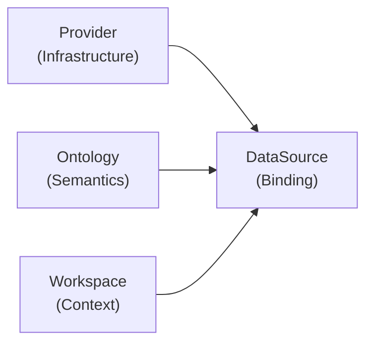
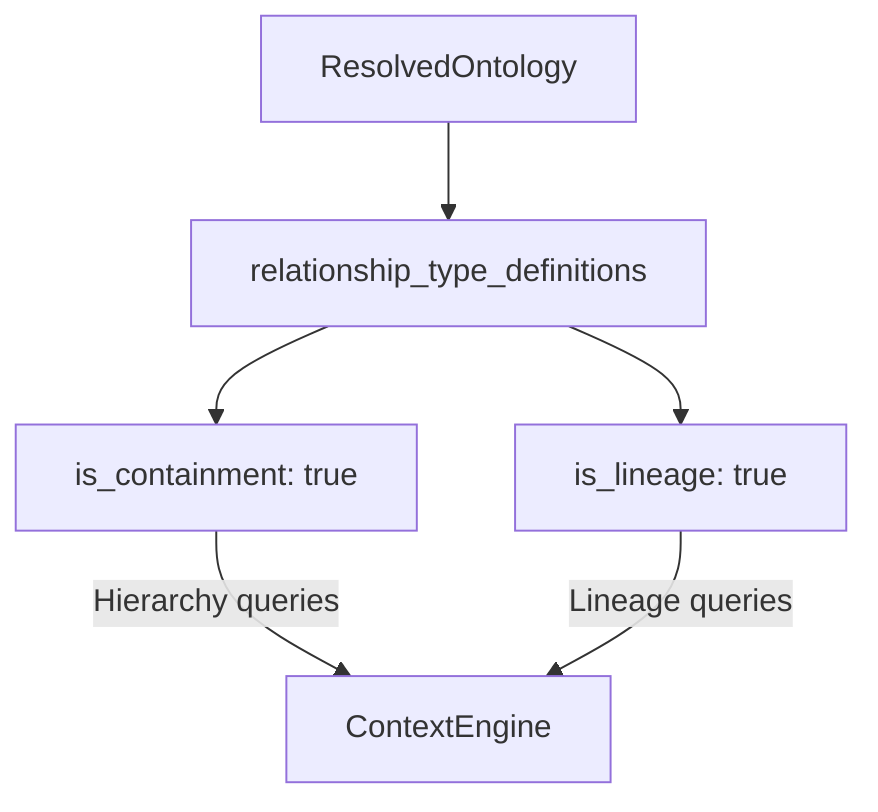
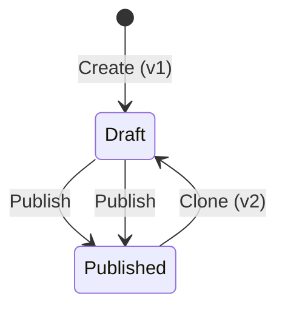
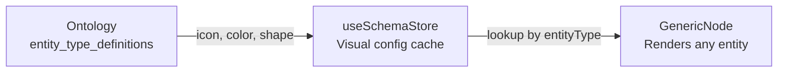
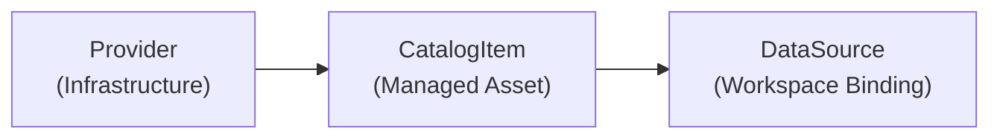

# Architectural Decision Records (ADRs)

This document captures the key architectural decisions made in {brand} — the context, the decision, its trade-offs, and current status.

**Who it's for:** developers and architects who want to understand *why* the system is shaped the way it is before changing it.

**How to read an ADR:** each record states the **Context** (the problem), the **Decision**, the **Reasoning**, the **Trade-offs** (`+` benefit / `-` cost), and any **Alternatives considered**. Jump to the [Decision Summary](#decision-summary) table for the full index at a glance.

> **Note:** ADRs are historical records, not living docs. A **Superseded** ADR (e.g. [ADR-002](#adr-002-dual-fastapi-services)) is kept for context even though its decision was later reversed — always check the **Status** line before treating an ADR as current.

---

## ADR-001: Three-Entity Model (Provider + Ontology + Workspace)

**Status:** Accepted
**Date:** 2025 Q4
**Context:** The original system used a single "connection" concept that coupled infrastructure (host/port), semantics (schema), and operational context (team/project) together. This made it impossible to reuse a single database connection across teams or version semantic schemas independently.

**Decision:** Split into three orthogonal entities:

```mermaid
graph LR
    Provider["Provider<br/>(Infrastructure)"]
    Ontology["Ontology<br/>(Semantics)"]
    Workspace["Workspace<br/>(Context)"]
    DS["DataSource<br/>(Binding)"]

    Provider --> DS
    Ontology --> DS
    Workspace --> DS

```

| Entity | Responsibility | Reuse Pattern |
|--------|---------------|---------------|
| Provider | Connection params, credentials, host/port | One FalkorDB cluster serves N workspaces |
| Ontology | Entity types, relationship types, hierarchy, visual config | One ontology version assigned to M data sources |
| Workspace | Team/project operational context | Contains N data sources, each binding Provider + Ontology |
| DataSource | The binding within a workspace | Unique per (workspace, provider, graph_name) |

**Reasoning:**
- Providers are infrastructure-level: same cluster can host many graphs
- Ontologies are semantic: teams may share the same schema or customize independently
- Workspaces are organizational: different teams get isolated views
- Separation enables independent versioning, permissioning, and lifecycle management

**Trade-offs:**
- (+) Flexible multi-tenancy
- (+) Independent ontology versioning without affecting infrastructure
- (+) Provider reuse without credential duplication
- (-) More tables and relationships to manage
- (-) Migration complexity from legacy connection model
- (-) Steeper learning curve for new developers

**Alternatives considered:**
- Single "connection" entity (original approach) -- too coupled, couldn't version schemas
- Two-entity model (Provider + Workspace) -- semantics still coupled to workspace

---

## ADR-002: Dual FastAPI Services

**Status:** Superseded by [ADR-018](#adr-018-retire-the-graph-service) — the standalone `graph-service` was retired and pre-registration connectivity testing now runs in-process in the Visualization Service. Retained here for historical context.
**Date:** 2025 Q4
**Context:** Users need to test database connectivity before registering a provider. This testing should not require database access or authentication.

**Decision:** Run two independent FastAPI services:

| Service | Port | Stateful | DB Access | Auth |
|---------|------|----------|-----------|------|
| Visualization Service | 8000 | Yes | Yes (management DB) | JWT required |
| Graph Service | 8001 | No | No | None |

**Reasoning:**
- Graph Service is stateless: accepts credentials in request body, tests connectivity, returns result
- No management DB dependency means it can be scaled independently
- Pre-registration UX: users test connection before committing to provider creation
- Separation of concerns: discovery vs. operation

**Trade-offs:**
- (+) Graph Service can scale independently without DB bottleneck
- (+) Clean pre-registration UX flow
- (-) Developers must run two services locally
- (-) Shared provider instantiation code duplicated across services
- (-) Additional operational complexity (two Docker containers, two health checks)

**Alternatives considered:**
- Single service with unauthenticated endpoint -- mixes auth concerns
- WebSocket-based testing -- unnecessary complexity for simple ping tests

---

## ADR-003: Ontology-Driven Edge Classification

**Status:** Accepted
**Date:** 2025 Q4
**Context:** Early versions hardcoded edge type classification (e.g., `CONTAINS` = containment, `TRANSFORMS` = lineage). This broke when connecting to external systems with different naming conventions.

**Decision:** Edge classification comes entirely from the resolved ontology, not hardcoded values.

```mermaid
graph TB
    Ontology["ResolvedOntology"]
    RDef["relationship_type_definitions"]
    IsC["is_containment: true"]
    IsL["is_lineage: true"]
    CE["ContextEngine"]

    Ontology --> RDef
    RDef --> IsC
    RDef --> IsL
    IsC -->|"Hierarchy queries"| CE
    IsL -->|"Lineage queries"| CE

```

**Reasoning:**
- External systems (DataHub, Neo4j) use different edge type names
- Ontology source mappings translate external types to {brand} types
- Classification is per-ontology, not global -- different workspaces can classify edges differently
- Granularity aggregation uses hierarchy levels from ontology, not hardcoded entity types

**Trade-offs:**
- (+) Works with any graph backend without code changes
- (+) Users can customize classification per workspace
- (-) More complex resolution logic (three-layer merge)
- (-) Harder to reason about without ontology context

---

## ADR-004: Immutable Published Ontologies

**Status:** Accepted
**Date:** 2025 Q4
**Context:** Users accidentally modified ontology definitions that were in use by active workspaces, causing rendering breaks and data inconsistencies.

**Decision:** Published ontologies are **immutable**. Updates require cloning to a new draft version.

```mermaid
stateDiagram-v2
    [*] --> Draft: Create (v1)
    Draft --> Published: Publish
    Published --> Draft: Clone (v2)
    Draft --> Published: Publish
```

**Reasoning:**
- Prevents accidental breaking changes to active workspaces
- Enables rollback by re-assigning a previous version
- Impact analysis compares draft to published before allowing publish
- Evolution policy (`reject`, `deprecate`, `migrate`) gates breaking changes

**Trade-offs:**
- (+) Safe schema evolution
- (+) Audit trail of ontology changes
- (+) Rollback capability
- (-) Version proliferation over time (need cleanup tooling)
- (-) Users must explicitly clone/publish, more steps than direct edit

---

## ADR-005: ProviderRegistry Singleton with Lazy Initialization

**Status:** Accepted
**Date:** 2025 Q4
**Context:** Graph database connections are expensive to establish (connection pools, TLS handshakes). Creating a new connection per request is unacceptable.

**Decision:** Module-level singleton `ProviderRegistry` with lazy initialization and async-safe caching keyed by `(provider_id, graph_name)`.

**Reasoning:**
- Lazy init: providers are only connected when first requested
- Cache key is (provider_id, graph_name) -- same provider with different graphs gets different instances
- Per-key async locks prevent thundering herd on first access
- Eviction API for config changes: `evict_provider()`, `evict_workspace()`, `evict_all()`

**Trade-offs:**
- (+) Connection reuse across requests
- (+) Prevents redundant connection establishment
- (-) Each Uvicorn worker gets its own cache (no cross-process sharing)
- (-) Stale cache if provider config changes in another worker
- (-) Memory leak potential if providers fail and aren't cleaned up

**Future consideration:** Redis-backed shared cache for multi-worker deployments.

---

## ADR-006: SQLite for Development, PostgreSQL for Production

**Status:** Accepted
**Date:** 2025 Q4
**Context:** Need zero-setup development experience while maintaining production-grade database support.

**Decision:** SQLAlchemy 2.0 async ORM supports both backends via `MANAGEMENT_DB_URL` env var. SQLite is the default (falls back to file-based `nexus_core.db`).

**Reasoning:**
- SQLite: zero setup, file-based, ideal for laptop development
- PostgreSQL: concurrent writes, scalable, production-ready
- Single ORM abstraction means code works identically on both
- JSON columns stored as TEXT for SQLite compatibility

**Trade-offs:**
- (+) Frictionless development setup
- (+) Same ORM code for both backends
- (-) SQLite limitations: no concurrent writers, no connection pooling, no replication
- (-) JSON stored as TEXT (no native JSONB queries in SQLite)
- (-) Must test on both backends to ensure compatibility

**Risk:** SQLite in production would cause data corruption under load. Mitigated by requiring `MANAGEMENT_DB_URL` in production environments.

---

## ADR-007: Zustand over Redux for Frontend State

**Status:** Accepted
**Date:** 2025 Q3
**Context:** Redux was considered but deemed too verbose for the application's state management needs.

**Decision:** Use Zustand with localStorage persistence middleware.

**Reasoning:**
- Simpler API: no action types, reducers, or middleware configuration
- Built-in `persist` middleware for localStorage sync
- `partialize` controls exactly what gets persisted
- Selector hooks for granular re-render optimization
- Smaller bundle size

**Trade-offs:**
- (+) Less boilerplate, faster development
- (+) Easy persistence configuration
- (-) Smaller community and middleware ecosystem
- (-) No built-in devtools (though zustand devtools middleware exists)
- (-) Cross-store coordination requires manual wiring

---

## ADR-008: Fernet for Credential Encryption

**Status:** Accepted
**Date:** 2025 Q4
**Context:** Provider credentials (database passwords, API tokens) must be encrypted at rest in the management database.

**Decision:** Use Fernet symmetric encryption from Python's `cryptography` library. Key provided via `CREDENTIAL_ENCRYPTION_KEY` env var.

**Reasoning:**
- Fernet provides authenticated encryption (AES-128-CBC + HMAC)
- Single key management (symmetric)
- Encrypted blob is a URL-safe base64 string, easy to store in TEXT columns
- Decryption is only performed in ProviderRegistry when instantiating a provider

**Trade-offs:**
- (+) Simple key management (one env var)
- (+) Authenticated encryption prevents tampering
- (+) Compatible with any storage backend
- (-) Key rotation requires re-encrypting all stored credentials
- (-) Falls back to plaintext if key not set (development convenience, production risk)

---

## ADR-009: Schema-Driven Frontend Rendering

**Status:** Accepted
**Date:** 2025 Q4
**Context:** The original frontend had separate React components for each entity type (DatasetNode, ColumnNode, etc.), creating tight coupling between frontend and backend schema.

**Decision:** Single `GenericNode` component renders all entity types. Visual properties come from ontology definitions via `useSchemaStore`.

```mermaid
graph LR
    Ontology["Ontology<br/>entity_type_definitions"]
    Schema["useSchemaStore<br/>Visual config cache"]
    Node["GenericNode<br/>Renders any entity"]

    Ontology -->|"icon, color, shape"| Schema
    Schema -->|"lookup by entityType"| Node

```

**Reasoning:**
- Adding new entity types requires only ontology configuration, no frontend code
- Consistent rendering behavior across all entity types
- Frontend stays decoupled from backend schema evolution

**Trade-offs:**
- (+) Zero frontend code changes for new entity types
- (+) Ontology controls visual presentation
- (-) Less fine-grained customization per entity type
- (-) More complex rendering logic in single component

---

## ADR-010: ELK Layout in Web Worker

**Status:** Accepted
**Date:** 2025 Q4
**Context:** Graph layout computation (ELK algorithm) blocks the UI thread for 100-500ms on large graphs, causing visible jank.

**Decision:** Run ELK layout in a dedicated Web Worker (`elk-layout.worker.ts`).

**Reasoning:**
- Layout computation is CPU-intensive and deterministic
- Web Worker runs on a separate thread, keeping UI responsive
- Signature-based skip: if node/edge IDs haven't changed, skip re-layout
- Viewport stabilization anchors to focus node during expansion

**Trade-offs:**
- (+) Zero UI jank during layout
- (+) Can handle larger graphs without freezing
- (-) Worker setup complexity and message serialization overhead
- (-) Harder to debug (no direct DOM access, separate console)
- (-) Asynchronous layout means brief moment where nodes are unpositioned

---

## ADR-011: Workspace-Scoped API Paths

**Status:** Accepted
**Date:** 2026 Q1
**Context:** The original API used query parameters for context: `?connectionId=`. This was error-prone and didn't enforce workspace isolation.

**Decision:** Graph API routes include workspace ID in the path: `/api/v1/{ws_id}/graph/...`

**Reasoning:**
- Path-based routing enforces workspace context at the URL level
- Easier to implement per-workspace access control
- RESTful resource hierarchy: workspace > graph > operation
- Legacy `?connectionId=` still supported for backward compatibility

**Trade-offs:**
- (+) Clear resource hierarchy
- (+) Easy to add middleware-level workspace authorization
- (+) Self-documenting URLs
- (-) Dual code path during migration from legacy query-param style
- (-) Longer URLs

---

## ADR-012: Transactional Outbox for User Events

**Status:** Accepted
**Date:** 2026 Q1
**Context:** User creation and approval events need to be reliably communicated to other parts of the system (notifications, audit). Direct service-to-service calls within a transaction are fragile.

**Decision:** Use the Transactional Outbox pattern. Events are written to `outbox_events` table in the same transaction as the user mutation.

**Reasoning:**
- Atomic: event is guaranteed to be written if user is created
- Decoupled: consumers read events asynchronously
- Idempotent: event ID serves as deduplication key
- Future-proof: when User Service is extracted, outbox publishes to message bus

**Trade-offs:**
- (+) Guaranteed event delivery (same-transaction write)
- (+) Clean domain boundary
- (+) Idempotent consumption
- (-) Additional table and processing logic
- (-) Events are eventually consistent (not real-time)
- (-) Must handle duplicate delivery (at-least-once semantics)

---

## ADR-013: CatalogItem Abstraction Layer

**Status:** Accepted
**Date:** 2026 Q1
**Context:** WorkspaceDataSource directly referenced providers, making it hard to manage physical assets as governed data products. There was no permission control at the asset level -- any workspace could bind to any provider graph if it knew the graph name.

**Decision:** Introduce a `CatalogItem` entity between Provider and DataSource. CatalogItems abstract physical provider graphs into managed products with `(provider_id, source_identifier)` uniqueness.

```mermaid
graph LR
    Provider["Provider<br/>(Infrastructure)"]
    Catalog["CatalogItem<br/>(Managed Asset)"]
    DS["DataSource<br/>(Workspace Binding)"]

    Provider --> Catalog
    Catalog --> DS

```

| Field | Purpose |
|-------|---------|
| `source_identifier` | Physical graph name on the provider |
| `permitted_workspaces` | JSON list of workspace IDs; `["*"]` = all |
| `status` | `active` / `archived` / `deprecated` lifecycle |

**Reasoning:**
- Physical assets need governance boundaries independent of workspace bindings
- Permission control (`permitted_workspaces`) gates which workspaces can consume an asset
- Impact analysis before deletion: cascading deletes on `provider_id` FK propagate cleanly
- Unique constraint on `(provider_id, source_identifier)` prevents duplicate registrations

**Trade-offs:**
- (+) Permission-controlled asset access at the catalog level
- (+) Impact analysis before deletion (which workspaces are affected?)
- (+) Clean governance boundaries between infrastructure and consumption
- (-) Additional entity and joins in queries
- (-) Migration complexity for existing data sources without catalog items
- (-) `catalog_item_id` on DataSource is nullable during transition period

**Alternatives considered:**
- Adding permission fields directly to WorkspaceDataSource -- doesn't solve the shared-asset problem
- Provider-level permissions only -- too coarse, can't control per-graph access

---

## ADR-014: Asset Onboarding Wizard

**Status:** Accepted
**Date:** 2026 Q1
**Context:** Setting up providers, catalog items, workspaces, data sources, and ontologies required navigating multiple admin screens with no guidance on correct ordering. New admins frequently misconfigured data sources or skipped ontology assignment entirely.

**Decision:** 4-step guided wizard triggered after catalog item registration:

| Step | Name | Purpose |
|------|------|---------|
| 1 | Workspace Allocation | Assign each catalog item to a workspace (existing or new) |
| 2 | Aggregation Strategy | Choose projection mode (`in_source` or `dedicated`) |
| 3 | Semantic Layer | Select or auto-suggest ontology per data source |
| 4 | Review & Confirm | Summary of all bindings before committing |

**Reasoning:**
- Mirrors the existing `ViewWizard` architecture: centralized `formData`, `canProceed` via `useMemo`, spring animations, `AnimatePresence` step transitions, `previousSteps` stack
- Reduces time-to-first-value by guiding admins through the correct ordering
- Each step validates before allowing progression (e.g., workspace must be selected before aggregation)
- Ontology auto-suggestion via coverage stats reduces guesswork

**Trade-offs:**
- (+) Reduces time-to-first-value for new admins
- (+) Enforces correct setup ordering
- (+) Consistent UX pattern with existing ViewWizard
- (-) Power users may find the wizard slower than direct admin panel configuration
- (-) Additional frontend component complexity (4 step sub-components)
- (-) Wizard state management adds to bundle size

**Alternatives considered:**
- Documentation-only approach -- doesn't prevent misconfiguration
- Single-page form -- too overwhelming with all options visible simultaneously

---

## ADR-015: Projection Modes (in_source vs dedicated)

**Status:** Accepted
**Date:** 2026 Q1
**Context:** Aggregated lineage edges (`AGGREGATED` type) materialized in the source graph polluted the original data, making it difficult to distinguish provider data from computed artifacts.

**Decision:** Two projection modes on WorkspaceDataSource:

| Mode | Behavior | Use Case |
|------|----------|----------|
| `in_source` | Aggregated edges written to source graph (default) | Simple setups, single-consumer graphs |
| `dedicated` | Separate projection graph per data source | Multi-consumer graphs, source data integrity required |

**Reasoning:**
- `in_source` is simpler and sufficient for most single-workspace-per-graph setups
- `dedicated` mode stores the projection graph name in `dedicated_graph_name` column
- Mode is set per-data-source, allowing mixed strategies within a workspace
- `None` (null) inherits from provider-level default, avoiding repetitive configuration

**Trade-offs:**
- (+) Preserves source data integrity when needed
- (+) Per-data-source granularity allows mixed strategies
- (+) Default `in_source` keeps simple cases simple
- (-) `dedicated` mode requires additional graph management and storage
- (-) Two code paths for edge materialization
- (-) Cleanup of dedicated graphs on data source deletion

**Alternatives considered:**
- Global projection mode per workspace -- too coarse when workspace has mixed needs
- Always-separate projection -- unnecessary overhead for simple setups

---

## ADR-016: Ontology Audit Trail

**Status:** Accepted
**Date:** 2026 Q1
**Context:** No visibility into who changed ontology definitions, when, or why. Debugging ontology-related issues required git blame on the management DB or manual inspection of backup snapshots.

**Decision:** Immutable `ontology_audit_log` table recording all lifecycle events with actor, version, summary, and JSON changes diff.

| Column | Purpose |
|--------|---------|
| `action` | One of: `created`, `updated`, `published`, `deleted`, `restored`, `cloned` |
| `actor` | User who performed the action |
| `version` | Ontology version at time of action |
| `summary` | Human-readable description |
| `changes` | JSON diff of added/removed types and changed fields |

**Reasoning:**
- Immutable rows (insert-only) ensure audit integrity
- `schema_id` groups events across ontology versions for cross-version queries
- `CheckConstraint` on `action` enforces valid event types at the database level
- Composite index on `(actor, action, created_at)` supports compliance queries
- Separate indexes on `ontology_id` and `schema_id` for fast per-ontology and per-schema lookups

**Trade-offs:**
- (+) Full audit trail for compliance and debugging
- (+) Immutable rows prevent tampering
- (+) Rich indexing for fast queries
- (-) Storage grows with every ontology edit (no retention policy yet)
- (-) JSON `changes` column stored as TEXT (no native JSONB queries in SQLite)
- (-) No automated alerting on audit events (future enhancement)

**Alternatives considered:**
- Application-level logging only -- not queryable, no structured diff
- Database triggers -- less portable across SQLite/PostgreSQL

---

## ADR-017: Aggregation state-sync via a control-plane consumer group

**Status:** Accepted
**Date:** 2026-07
**Context:** Aggregation status events (`job.completed`, `purge.completed`, `state.updated`, …) are mirrored into `public.workspace_data_sources.aggregation_status` so the viz-service's own endpoints (workspace detail, onboarding wizard) have fresh data. This ran as a **Redis Pub/Sub** listener started **inside every viz-service (web) replica**. Pub/Sub fans every message out to every subscriber, so N web replicas each received every event and independently ran the same `UPDATE workspace_data_sources` + cache invalidation — N redundant writes per event and row-lock contention that grows with replica count. It also violated the stateless-web-tier mandate (a background loop in the request process).

**Decision:** Move the sync to a **Redis Stream** (`aggregation.events.stream`) consumed by a single **consumer group** (`viz-state-sync`) hosted in the **aggregation control plane**, not the web tier and not the (busy) worker.

**Reasoning:**
- A stream + consumer group delivers each event to **exactly one** consumer across the fleet, regardless of replica count — the N-redundant-writes problem disappears structurally.
- Handlers are idempotent (`UPDATE … status='ready'`, cache `DEL`) so at-least-once delivery with `XAUTOCLAIM` PEL crash-recovery is safe.
- The consumer lives in the control plane because it is lightweight I/O (a small `UPDATE` + cache `DEL` per event) and the control plane already owns aggregation state — co-locating it there adds **no new deployable or failure domain**. A dedicated "event-relay" process was considered and rejected as over-decomposition for a featherweight, backstopped projection.
- The web tier's listener code is **removed** (not merely gated) so it cannot re-host the loop by config accident. Safe because whenever the listener ran (`REDIS_URL` set), execution was always on the worker fleet — no topology runs jobs in-process *and* has a bus.

**Trade-offs:**
- (+) Exactly-once projection at any replica count; web tier truly stateless.
- (+) Streams survive a down consumer (redelivered on restart) — Pub/Sub silently dropped events a down subscriber missed.
- (-) `workspace_data_sources.aggregation_status` is a denormalized **hint**; a rare cross-consumer reorder can leave it briefly stale. Mitigated: the authoritative source is the control-plane readiness endpoint, which self-corrects on the next read.

**Alternatives considered:**
- Keep Pub/Sub but de-dup with a lock — still every-replica delivery + a new lock; no gain.
- Host the consumer in the aggregation-worker — rejected: heavy MERGE jobs there could starve the projection.
- Dedicated event-relay deployment — rejected as over-decoupling (a new pod + failure domain for a trivial workload).

---

## ADR-018: Retire the graph-service

**Status:** Accepted
**Date:** 2026-07
**Context:** `graph-service` (`:8001`) was a standalone process whose only job was provider connectivity/probe testing. It was built and deployed but **never invoked** — the onboarding wizard calls viz-service's own `/admin/providers/test-connection`, which is already bulkheaded.

**Decision:** Delete the `graph-service` HTTP layer (`backend/graph/main.py`, `api/`, `Dockerfile.graph`) and every deployment reference (compose, nginx, vite proxy, k8s base + overlays + NetworkPolicies). **Keep** `backend/graph/adapters/` — the live Neo4j/DataHub/Spanner provider adapters viz-service imports. Also delete the dead `backend/stats_service/` skeleton (superseded by `backend/insights_service/`).

**Reasoning:** A separate always-on service to move a bounded, low-volume, already-bulkheaded async probe off the web tier was not worth the operational surface + network hop. Bulkheads (provider preflight, circuit breakers, the dedicated probe DB pool) already deliver the resilience it would have provided.

**Trade-offs:**
- (+) One fewer deployable, image, and failure domain to operate.
- (+) Removes a confusing "deployed but dead" service from the estate.
- (-) If per-connection SSRF hardening is ever needed, a probe gateway would have to be reintroduced (bulkheads, not a gateway, are the current answer).

---

## ADR-019: Internal service auth on the aggregation control plane

**Status:** Accepted
**Date:** 2026-07
**Context:** The control plane (`:8091`) exposes job trigger/cancel/**delete**/**purge**/settings with **no authentication** — the viz-service is the authenticated edge; the control plane is internal. Anything that could reach `:8091` (a compromised pod, a NetworkPolicy misconfig, lateral movement) could drive a destructive, multi-tenant API. NetworkPolicies help, but on GKE Standard they are **opt-in** (Dataplane V2 / Calico) and a common misconfiguration.

**Decision:** Add a shared-secret bearer token (`AGGREGATION_INTERNAL_TOKEN`) enforced by a global FastAPI dependency on every route except `/health` + docs; the three internal callers (viz-service proxy, insights post-purge trigger, system-status probe) attach it. **Opt-in by design:** when the token is unset the dependency is a complete no-op and clients send no header, so a stack with no token configured keeps working (loud startup warning). Compose defaults it empty; k8s supplies it via `app-secrets` with `optional: true` so a missing key never blocks startup.

**Reasoning:** Defense-in-depth *behind* NetworkPolicies, portable across clusters regardless of CNI enforcement, at near-zero cost (no new process). Enterprise security reviews expect service-to-service auth for a destructive API — "internal-only" is not an accepted compensating control.

**Also decided (descoped):** WS2.3 originally planned to split the control plane's scheduler/reconciler/recovery/state-sync loops into a **separate process**. Investigation showed all four are clean async I/O (bounded cadence, per-item timeouts, advisory-lock / consumer-group HA) with no CPU-bound section, so co-hosting is correct and a separate process would be over-decoupling. **Not done, deliberately.**

**Trade-offs:**
- (+) Destructive control surface is authenticated, not just network-segmented.
- (+) Zero-friction dev (unset = disabled); enforced in prod by config.
- (-) A shared secret to manage/rotate; a token mismatch is a new (visible, fast) failure mode.

---

## ADR-020: Dedicated Redis decoupled from FalkorDB by construction

**Status:** Accepted
**Date:** 2026-07
**Context:** FalkorDB is a Redis-module process. The provider's ancestor/URN/stats **cache** could be built **on the FalkorDB instance itself**: `build_cache_client`, when no dedicated `CACHE_REDIS_URL` was set, mirrored the FalkorDB topology onto the graph nodes. That coupling meant a FalkorDB outage would also wipe the cache, and cache traffic would contend with graph queries on FalkorDB's single-threaded process.

**Decision:** FalkorDB hosts **only** the graph (`GRAPH.QUERY` + dedicated-mode `{graph}_proj` graphs). All operational Redis (streams, pub/sub, locks, rate-limit, revocation, caches) lives on the **dedicated Redis**. `build_cache_client` now returns `None` (cache **disabled**, best-effort) without a dedicated endpoint — it **never** co-locates on FalkorDB. Deployed roles (`web`/`worker`/`controlplane`) **fail fast at startup** if `CACHE_REDIS_URL` is unset (enforced by per-role `resolve_redis_config` validation at startup — see ADR-022); dev degrades gracefully.

**Reasoning:** Decoupling must be a code guarantee, not a convention that depends on remembering an env var. FalkorDB Cluster/Sentinel support is unaffected — only the *cache* client changed; the graph connection path (`build_graph_client` + the standalone/sentinel/cluster factory) is untouched.

**Trade-offs:**
- (+) A FalkorDB restart/OOM can never touch the operational Redis layer; the cache even survives to serve last-known-good.
- (+) Structural guarantee + startup tripwire (no silent cache-off in prod).
- (-) Deployed roles now *require* `CACHE_REDIS_URL` (already set across compose + k8s).

See [DATA_ARCHITECTURE.md → Redis Topology & Decoupling](DATA_ARCHITECTURE.md#redis-topology--decoupling) for the full use-case map and the "when to split the cache Redis" runbook.

---

## ADR-021: Build the FalkorDB client ourselves (never `FalkorDB.__init__`)

**Status:** Accepted
**Date:** 2026-07
**Context:** Proving Redis Cluster compatibility end-to-end surfaced two defects, both caused by letting the `falkordb` library construct our client from a `ConnectionPool`.

1. **A blocking connect — in every mode, including standalone (production's default).** `FalkorDB.__init__` sniffs the topology with `falkordb.asyncio.cluster.Is_Cluster()`, which opens a **synchronous** redis client and issues `INFO`. That is blocking socket I/O executed **on the event loop**. Against a hung/blackholed node it froze the whole process for **26s** (measured), and `asyncio.wait_for` could not interrupt it — a blocked loop never fires its own timer — so it defeated every timeout guard in `_run_guarded`. This is a **third, independent mechanism** behind "one unreachable provider freezes the app", alongside the in-process-projector event-loop wedge and DB-session-pool starvation.
2. **Cluster silently ran on library defaults.** In cluster mode the pool was handed to `Cluster_Conn`, which rebuilds a `RedisCluster` forwarding only host/port/auth/retry — **dropping** `socket_timeout` and `socket_connect_timeout` (→ redis-py's 5s), `max_connections` (→ **100 per node**, 10× our cap, per shard), `health_check_interval` (→ **0**: the idle-socket check OFF, the exact stale-socket-after-failover trap the sentinel branch documents) and `ssl` (→ **False**, so a TLS pool silently became a **plaintext** data plane). It also popped host/port off our pool destructively, leaving it pointing at `localhost:6379`.

**Decision:** We already know the topology from `cfg.mode`, so the library's sniff is both dangerous and pointless. `build_graph_client` / `build_node_client` construct the async client **explicitly** per mode (`Redis` / Sentinel master / `RedisCluster` with our full pool kwargs + TLS) and bind the FalkorDB facade to it via `falkordb_over()` — the `FalkorDB` class's entire state is three attributes (`connection`, `flushdb`, `execute_command`); everything else derives from `connection`.

**Reasoning:** The topology is operator config, not something to discover at runtime over a socket. Owning construction makes every topology honour the *same* connection tuning, and removes an entire class of coupling to library internals (the `Cluster_Conn` destructive-pop workarounds are gone).

**Trade-offs:**
- (+) Connect no longer blocks the event loop: 26,044ms stall → **6–10ms**. An unreachable node now surfaces at the bounded async ping.
- (+) Cluster honours our timeouts, pool cap, health check and TLS.
- (+) Retires two workarounds (`falkordb_client_preserving_pool`; "username/password must always be present", which violated the learned-no-auth credential-stripping invariant).
- (+) Teardown now closes the client, not just the pinned pool — cluster's per-node pools previously leaked.
- (−) We depend on `FalkorDB`'s three-attribute shape. A regression test constructs a tripwire `FalkorDB` that raises if `__init__` is ever called from the connect path, so a library change or a reintroduced call fails loudly.

**Verified live** on a 3-master FalkorDB cluster and a Sentinel quorum — see [FALKORDB_DEPLOYMENT.md → Topology support matrix](FALKORDB_DEPLOYMENT.md#topology-support-matrix-verified-live).

---

## ADR-022: Central role-keyed Redis config (cache/streams independent)

**Status:** Accepted
**Date:** 2026-07
**Context:** Non-graph Redis (the coordination bus, the provider cache, token revocation, the health probes) was constructed at **12 separate call sites**, and only **two** of them went through a shared builder. `REDIS_PASSWORD` / `REDIS_TLS_*` were honoured by the job bus but silently **ignored** by token revocation, the health probes, and the provider cache — each built a raw, unauthenticated client of its own. Turning on AUTH authenticated the bus while **breaking auth on every request** the moment revocation or the cache tried to connect.

**Decision:** One resolver + one factory — `resolve_redis_config` / `build_redis_client` in `backend/common/adapters/redis_endpoint.py`. Every non-graph Redis client is built there, with no other construction path. Two **independent** roles, `STREAMS` (the coordination bus) and `CACHE`, each get their own host, ACL/requirepass credential, and TLS/mTLS PKI — **no cross-role inheritance, and nothing inherited from FalkorDB** (ADR-020 remains in force: FalkorDB hosts only the graph).

Config surface per role `R ∈ {STREAMS, CACHE}`:
- `REDIS_{R}_HOST/_PORT/_DB/_USERNAME/_PASSWORD/_PASSWORD_FILE`
- `REDIS_{R}_TLS_ENABLED/_TLS_CA_CERTS/_TLS_CERTFILE/_TLS_KEYFILE/_TLS_CERT_REQS/_TLS_CHECK_HOSTNAME`
- `REDIS_{R}_SENTINEL_MASTER/_NODES/_USERNAME/_PASSWORD/_PASSWORD_FILE/_AUTH_ENABLED`
- `REDIS_{R}_MAX_CONNECTIONS/_SOCKET_TIMEOUT/_SOCKET_CONNECT_TIMEOUT/_HEALTH_CHECK_INTERVAL`

Secrets resolve from `*_PASSWORD` (env / `secretKeyRef`) or `*_PASSWORD_FILE` (a mounted file, which wins when both are set, and is rotatable without a redeploy; a missing or empty file is a hard startup error). A password is never logged, never returned by an API, and never embedded in a URL.

Legacy back-compat is **role-scoped, not global**: `REDIS_URL` (+ `REDIS_USERNAME`/`_PASSWORD`/`_TLS_*`) maps to `STREAMS` only; `CACHE_REDIS_URL` maps to `CACHE` only; role-prefixed vars win when both are set. Dev/staging stay zero-config on the legacy vars.

**Cluster is rejected for both `STREAMS` and `CACHE`** (`RedisConfigurationError` at startup) for three concrete reasons: `graph_cache` does cross-slot `SCAN` + variadic `DEL`; the job broker pipelines `XADD` to two un-tagged (cross-slot) keys; and both roles use a non-zero DB index, while Cluster only ever supports DB 0. Redis **Cluster remains fully supported for FalkorDB** — a separate role, untouched by this ADR (see ADR-020, ADR-021).

**Per-provider dedicated cache:** a provider's `extra_config.cacheConnection` (non-secret: mode/host/port/db/tls) plus encrypted `credentials` (`cache_username`/`cache_password`/`cache_sentinel_*`) define a whole-endpoint `CACHE` override that **never inherits** the global cache's password or CA. Leaving "dedicated cache" unchecked in the provider wizard means the provider uses the **global** `REDIS_CACHE_*` role.

**Three security fixes landed alongside the resolver:**
1. Sentinel credentials moved out of the plaintext `extra_config` column into the Fernet-encrypted blob.
2. `redact_extra_config` masks secrets (recursive, case-insensitive, including URL userinfo) on every Provider/DataSource API response.
3. A `credentials` update now **merges** into the existing blob (it previously replaced it wholesale, silently wiping untouched secrets); an explicit `credentialsClear` opts into deletion.

Admin visibility: `GET /admin/redis/config` (resolved config + per-field provenance, never a password), `POST /admin/redis/{role}/test`, and the **Admin › System › Redis** page.

**Reasoning:** The root cause was structural, not a missing feature — a shared builder already existed but wasn't mandatory, so a 13th call site could bypass it without anything failing loudly. Making the factory the *only* construction path removes that failure mode entirely. Independent roles with independent credentials and PKI (no inheritance, not even from FalkorDB) means a leaked or rotated cache credential can never authenticate against the bus and vice versa — the exact "AUTH applied to one thing, not another" shape of bug that motivated this ADR.

**Trade-offs:**
- (+) A single code path honours `REDIS_PASSWORD`/`REDIS_TLS_*` everywhere; the "AUTH breaks half the app" class of bug is now structurally impossible.
- (+) Per-role rotation: a leaked cache password can be rotated without touching the bus, and `*_PASSWORD_FILE` allows rotation without a redeploy.
- (+) Cluster's three concrete blockers are enforced at startup, not discovered in production under cross-slot traffic.
- (-) Two roles to provision, monitor, and rotate instead of one; a deployment that genuinely wants a single instance still configures two role-prefixed var sets pointing at it (this is exactly what dev/staging do — see [DATA_ARCHITECTURE.md → Redis Topology & Decoupling](DATA_ARCHITECTURE.md#redis-topology--decoupling)).
- (-) The per-provider `cacheConnection` override still shallow-merges onto the provider's top-level `extra_config` (`_merge_extra_config`); secret/cluster smuggling is blocked by validation on both sides, but the override *precedence* itself remains a known limitation.

**Verified live** on the standalone/Sentinel × auth-on/off × streams/cache/dedicated-cache matrix, and on a two-instance auth+TLS harness where streams and cache have different passwords and different CAs (`deploy/topologies/docker-compose.redis-split-auth-tls.yml`).

---

## ADR-023: One registration per graph provider type

**Status:** Accepted
**Date:** 2026-08
**Context:** Adding a graph engine meant editing **~22 scattered sites** and satisfying three contracts nobody had written down. Four things made that worse than a tedious checklist.

1. **The dispatch chain existed twice, verbatim.** `ProviderManager._create_provider_instance` (`manager.py:1153-1273`) and `ProviderRegistry._create_provider_instance` (`provider_registry.py:290-395`) were the same `if provider_type == "falkordb": … elif … raise ValueError` body, in two files, with two frozen signatures. A type added to one and not the other worked through one entry point and raised through the other.
2. **The ontology contract was duck-typed, and failed *silently*.** `ContextEngine` asked `hasattr(provider, 'set_containment_edge_types')` and *skipped* a provider that lacked it. A second engine that simply did not implement the setters got no error — it got a **flat graph**, discovered whenever a user eventually said the canvas looked wrong. The same implicitness produced a live, pre-existing defect: `get_ontology_metadata` cached *classification* (containment vs lineage, the type hierarchy, the root types — a function of the ontology injected into that instance) under a shared graph-scoped key, and the app's own resolution path warms that cache from a deliberately **uninjected** provider. Measured on `solidatus_perf_medium`, identically on the pre-refactor monolith:

   | cache warmed by | containment | lineage | hierarchy | roots |
   |---|---|---|---|---|
   | uninjected caller | `[]` | `['FLOWS_TO','HAS']` | 0 | `[]` |
   | injected caller | `['HAS']` | `['FLOWS_TO']` | 4 | `['layer']` |

   A correctly-configured reader arriving after the uninjected warm got the poisoned row back, with `HAS` presented as a *flow* edge rather than a *structural* one.
3. **`DataHubGraphQLProvider` had been uninstantiable for months** — six abstract members missing (`create_edge`, `delete_edge`, `get_aggregated_edges_between`, `get_full_lineage`, `get_trace_lineage`, `update_edge`). Registering a DataHub provider wrote a row and every probe raised `TypeError: Can't instantiate abstract class…`. **No test noticed**, because nothing constructed each registered type and checked.
4. **The frontend enumerated the type list ~15 times.** Three of those enumerations had no Spanner branch at all (`DataSourceGridCard`'s accent ternary, `WorkspaceHeroHeader`, `WorkspaceListRow`), so a Spanner provider rendered a borrowed style or its raw type string. Two more (`ProjectionPanel`'s `PROVIDER_LABEL`, `GraphProvidersPanel`'s `TYPE_LABEL`) were missed by the audit's own list because their maps use **unquoted** object keys, which a `'falkordb'` grep does not match.

**Decision:** One `ProviderDescriptor` per provider type in a catalog (`backend/common/providers/catalog/`) is the single registration point for behaviour — id, label, family, capability, connection shape, `build(spec)`, validation, probe strategy. Both dispatchers delegate to it; `GET /admin/providers/types` serves it; one frontend module (`frontend/src/services/providerTypes.ts`) is the only place that knows what a provider type is.

Around it:

- **The contract is formal and three-tiered**: 25 abstract members, 28 real defaults, 5 feature-gated defaults that raise `ProviderFeatureUnsupportedError`. The ontology-injection setters are **base-class members with working defaults**, so every adapter participates by construction, and `containment_configured` makes "has an ontology been injected into me?" a documented question rather than a private attribute nine call sites reached into. Configured-ness alone is not the whole rule, so the key that a classification lands under encodes the ontology too (`_ontology_cache_key`): the sentinel says *whether* an ontology was injected, never *which* one, and since the uniqueness constraint is (workspace, provider, graph_name), two data sources in different workspaces can address the same physical graph with different ontologies — both writes legitimate, both previously colliding. Encoding it also means an ontology edit lands on a new key instead of waiting out the 300s TTL.
- **Two gate kinds, deliberately not merged.** Row-level admission (`capability_for(row.provider_type).supports(F)`) answers before an instance exists and yields a clean 422; instance-level tolerance (catching `ProviderFeatureUnsupportedError`) handles a live, possibly-wrapped instance. Both are needed: a `DraftOverlayProvider` unwraps to a base that *does* support materialization while the overlay itself has no such method, so the row-level check alone passes and the call still fails.
- **Drift is caught by tests rather than prevented by generation.** `ProviderType` (pydantic/OpenAPI needs static members) and the DB CHECK constraint stay hand-written; `test_provider_catalog_sync.py` asserts they agree with the catalog, `test_provider_catalog_classes.py` asserts every registered class resolves, instantiates and defines its own `preflight`, and `test_provider_type_literals.py` (plus its frontend counterpart) fails CI if `provider_type == "…"` dispatch is reintroduced.

**Reasoning:** The root cause was structural, not a missing feature — the same shape as [ADR-022](#adr-022-central-role-keyed-redis-config-cachestreams-independent). Nothing *forced* a new type through a shared path, so every new type grew its own branch in every file that cared, and every contract that was never declared could be quietly not honoured. Making the descriptor the only construction path removes the duplication; making the ontology setters real base members removes the class of defect where a missing method reads as "nothing to do" instead of "wrong answer". The choice to keep the enum and the CHECK constraint hand-written and *tested* rather than generated is deliberate: generation would have to run somewhere, and a drift test fails in CI with the exact name of the file to edit.

**Trade-offs:**
- (+) One registration point for behaviour. The remaining five additions are declarative, and a **named test fails for each**: the enum/CHECK/migration sync tests, a `Record<ProviderType, …>` compile error for a missing visual.
- (+) Both duplicated dispatch chains (127 and 106 changed lines) became a lazy import and one delegating call, signatures byte-for-byte unchanged; the ~22 sites collapsed to the catalog plus ~15 frontend call sites that read one module. Converting them fixed the three missing-Spanner-branch bugs for free — `PROVIDER_VISUALS` is a `Record`, so a visual with a hole in it does not compile.
- (+) Latent defects the audit surfaced are fixed, not just documented: Neo4j's `set_containment_edge_types` no longer raises `TypeError` on the injection path; `DraftOverlayProvider` forwards all six setters instead of two; `clear_content_caches()` has a base no-op instead of an `AttributeError` for non-FalkorDB types; the wizard's schema discovery no longer creates and deletes a throwaway provider row hard-coded to `providerType: 'neo4j'` regardless of what the user selected.
- (+) The required backend lane went from **1,466 to 1,563 passing** against the same **11 pre-existing failures**, `comm -23` against the recorded baseline empty; the frontend suite from 4,146 to **4,204**, all green. The live FalkorDB contract snapshot is byte-identical — `git status` on `backend/tests/regression/snapshots/falkordb/` is empty after the whole PR — and the contract test *runs* rather than skips, which it did not before this PR's CI service container. The frontend figure needs `--maxWorkers=2` on a loaded machine: at default concurrency this suite produces nondeterministic 5-second timeouts that have nothing to do with the code under test.
- (−) `STATIC_PROVIDER_TYPES` duplicates a little static data on the frontend — an offline snapshot of the backend's rows, so the wizard renders before `GET /types` resolves. It is *generated* from the backend's own test (`UPDATE_PROVIDER_TYPES_FIXTURE=1`), and it cannot silently disagree with the server because two tests pin the chain end to end: `providerTypes.catalog.test.ts` pins the snapshot to the fixture, and `test_list_provider_types_generates_the_frontend_fixture` pins the fixture to the live endpoint response on every run where it is not regenerating it. Neither half is sufficient alone — with only the frontend one (as first shipped) the assertion is a parser round-trip against the same JSON, and a fixture nobody regenerated stays green while the wizard's card for the new type is missing until the live query resolves.
- (−) **`mock` stays in the CHECK constraint** as a legacy DB literal with no adapter class behind it (`LEGACY_DB_ONLY_TYPES`). Removing it needs a narrowing migration that refuses when rows exist — out of scope, and it is accepted by the DB rather than registrable, so it cannot be selected or constructed.
- (−) **FalkorDB cannot register from the kernel.** `backend/common/providers/` is dependency-free by construction (an AST guard fails on any `backend.app` import, lazy or not) and `FalkorDBProvider` lives under `backend.app`. Its descriptor therefore registers from its own package, and both dispatcher modules carry an eager import to trigger it — an asymmetry with the other three types that a reader has to be told about. It is documented in the catalog package's own docstring and pinned by two fresh-subprocess tests.
- (−) A CHECK-widening migration is **two** edits, not one: `test_provider_catalog_sync.py` asserts exactly one migration touches the constraint, so the second one must retarget that helper. The assert carries the instruction in its own message, but it is still a test edit inside a "declarative additions" story.
- (−) One genuine identity-dispatch site survives, allow-listed with a reason: `insights_service/discovery.py` gates FalkorDB-specific registry-drift reconciliation on `provider_type == "falkordb"`, because other providers' `list_graphs()` is not exhaustive enough for that reconciliation to be safe. It should become a `ProviderFeature` the reconciler checks — the same move `versioning.py`'s blank-model gate already made. Tracked, not silently permanent.
- (−) DataHub remains uninstantiable. The defect is now *pinned* (`KNOWN_UNINSTANTIABLE = {"datahub"}`) rather than invisible, and the catalog test guards every other type, but the six stubs were deliberately deferred.
- (−) **One endpoint changed its answer for FalkorDB.** Turning capabilities into gates means a gate can land where none existed, and all six live gate sites were audited against their pre-PR-2 form to find out where. Five preserve the exact provider set: `graph.py`'s copy gate is exact by construction, since `ProviderCapability.supports()` routes `GRAPH_COPY` to the legacy `supports_copy` boolean so a migrated caller cannot get a different answer; `versioning.py`'s blank-model gate was `provider_type != "falkordb"` and `BLANK_MODELS` is declared by FalkorDB alone; the unsaved `POST /discover-schema` is a new endpoint with no prior behaviour; `lineage_aggregator.get_aggregator` widens (`supports_feature` unwraps a `DraftOverlayProvider` where `isinstance(..., FalkorDBProvider)` did not) but has no production caller, only tests; and `context_engine`'s materialization gate is deliberately two-part — a `callable()` check *and* the feature — precisely because that unwrapping would otherwise answer `True` for a wrapper with no forwarder, turning a `ValueError` into a 500. The sixth is a real change: **`POST /{provider_id}/discover-schema` had no capability gate at all, and now 422s for FalkorDB where it returned `200 {}`**. That is honest — FalkorDB never implements `discover_schema()`, it inherits the interface default returning an empty dict, so the endpoint was answering "nothing" rather than "unsupported" — and the single live caller (`NodeIdentity.tsx`'s `useNodeIdentitySuggestions`) swallows the error into the same empty suggestion list, so nothing is user-visible. A future caller that does not swallow it will see a 422 where the endpoint's own history says 200.

**Verified** against a live FalkorDB: the ontology-cache fix reproduced end to end (an injected reader after an uninjected warm now sees `containment=['HAS']`, hierarchy 4, roots `['layer']`; the poisoning verdict flips to `false`), and the catalog-built live contract test passes rather than skips, with every existing snapshot unchanged.

---

## Decision Summary

| # | Decision | Status | Risk Level |
|---|----------|--------|------------|
| 001 | Three-entity model (evolved to four with CatalogItem — see ADR-013) | Accepted | Low |
| 002 | Dual FastAPI services | Accepted | Medium |
| 003 | Ontology-driven edge classification | Accepted | Low |
| 004 | Immutable published ontologies | Accepted | Low |
| 005 | ProviderRegistry singleton | Accepted | Medium (scaling) |
| 006 | SQLite dev / PostgreSQL prod | Accepted | Medium (misuse) |
| 007 | Zustand over Redux | Accepted | Low |
| 008 | Fernet credential encryption | Accepted | Medium (key mgmt) |
| 009 | Schema-driven frontend rendering | Accepted | Low |
| 010 | ELK layout in Web Worker | Accepted | Low |
| 011 | Workspace-scoped API paths | Accepted | Low |
| 012 | Transactional outbox | Accepted | Low |
| 013 | CatalogItem abstraction layer | Accepted | Medium (migration) |
| 014 | Asset onboarding wizard | Accepted | Low |
| 015 | Projection modes (in_source/dedicated) | Accepted | Medium (complexity) |
| 016 | Ontology audit trail | Accepted | Low |
| 017 | State-sync via control-plane consumer group (off the web tier) | Accepted | Low |
| 018 | Retire the dead graph-service | Accepted | Low |
| 019 | Control-plane internal auth (loop-split descoped) | Accepted | Low |
| 020 | Dedicated Redis decoupled from FalkorDB by construction | Accepted | Low |
| 021 | Build the FalkorDB client ourselves (never `FalkorDB.__init__`) | Accepted | Low |
| 022 | Central role-keyed Redis config (cache/streams independent) | Accepted | Low |
| 023 | One registration per graph provider type (descriptor catalog + formal contract) | Accepted | Low |

---

## Related

- [Architecture](/docs/architecture) — where these decisions are realized in the system design
- [Data Architecture](/docs/data-architecture) — Redis topology and schema details behind ADR-017 through ADR-022
- [Aggregation Pipeline](/docs/aggregation-pipeline) — the pipeline shaped by the provider-protection decisions
- [Services Overview](/docs/services-overview) — the process-role topology referenced by ADR-017/019
- [Technical Debt](/docs/technical-debt) — open risks, some of which these ADRs resolved
- [Overview](/docs/overview) — platform vision and key terms
