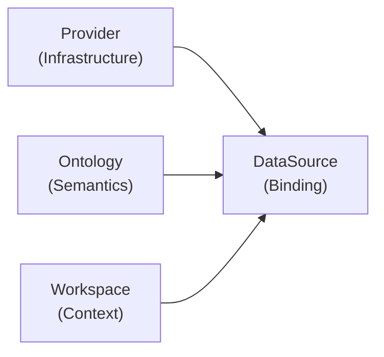
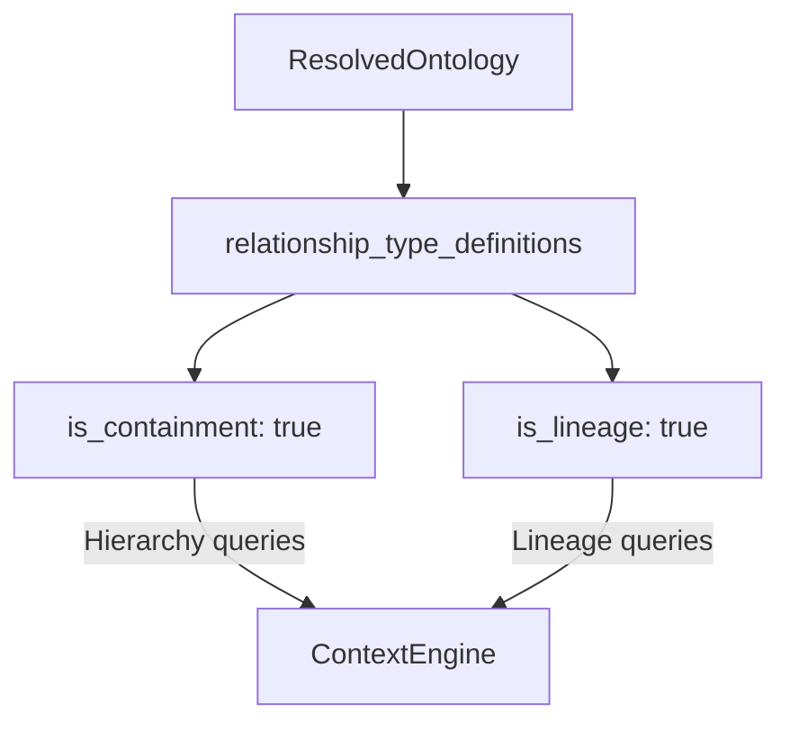
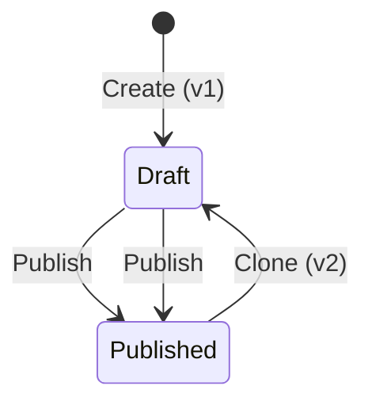
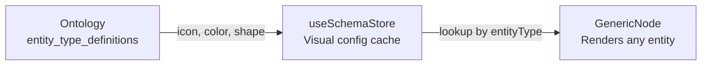
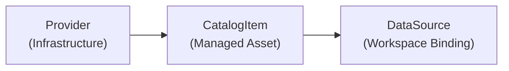
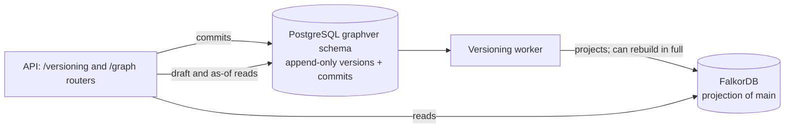

# Architectural Decision Records (ADRs)

*For architects, tech leads and engineers about to change how the system is built.*

This page records why {brand} is shaped the way it is: for each decision, the problem it answered, what was chosen, and what it costs. Read it before you change one of these choices, so you know what you are trading away.

**How to read an ADR:** each record states the **Context** (the problem), the **Decision**, the **Reasoning**, the **Trade-offs** (`+` benefit / `-` cost), and any **Alternatives considered**. Jump to the [Decision Summary](#decision-summary) table for the full index at a glance.

> **Note:** ADRs are historical records, not living docs. A **Superseded** ADR (e.g. [ADR-002](#adr-002-dual-fastapi-services)) is kept for context even though its decision was later reversed — always check the **Status** line before treating an ADR as current. Where the code has moved on from a record without a new ADR, the Status line says what changed and when the record was corrected.

ADR-023 to ADR-026 were written after the fact, on 2026-10-10, for decisions the code shows were made but never recorded. Each is dated from the earliest evidence in the repository.

---

## ADR-001: Three-Entity Model (Provider + Ontology + Workspace)

**Status:** Accepted
**Date:** 2025 Q4
**Context:** The original system used a single "connection" concept that coupled infrastructure (host/port), semantics (schema), and operational context (team/project) together. This made it impossible to reuse a single database connection across teams or version semantic schemas independently.

**Decision:** Split into three orthogonal entities:

```mermaid
graph LR
    Provider["Provider<br/>(Infrastructure)"]
    Ontology["Ontology<br/>(Semantics)"]
    Workspace["Workspace<br/>(Context)"]
    DS["DataSource<br/>(Binding)"]

    Provider --> DS
    Ontology --> DS
    Workspace --> DS

```

| Entity | Responsibility | Reuse Pattern |
|--------|---------------|---------------|
| Provider | Connection params, credentials, host/port | One FalkorDB cluster serves N workspaces |
| Ontology | Entity types, relationship types, hierarchy, visual config | One ontology version assigned to M data sources |
| Workspace | Team/project operational context | Contains N data sources, each binding Provider + Ontology |
| DataSource | The binding within a workspace | Unique per (workspace, provider, graph_name) |

**Reasoning:**
- Providers are infrastructure-level: same cluster can host many graphs
- Ontologies are semantic: teams may share the same schema or customize independently
- Workspaces are organizational: different teams get isolated views
- Separation enables independent versioning, permissioning, and lifecycle management

**Trade-offs:**
- (+) Flexible multi-tenancy
- (+) Independent ontology versioning without affecting infrastructure
- (+) Provider reuse without credential duplication
- (-) More tables and relationships to manage
- (-) Migration complexity from legacy connection model
- (-) Steeper learning curve for new developers

**Alternatives considered:**
- Single "connection" entity (original approach) -- too coupled, couldn't version schemas
- Two-entity model (Provider + Workspace) -- semantics still coupled to workspace

---

## ADR-002: Dual FastAPI Services

**Status:** Superseded by [ADR-018](#adr-018-retire-the-graph-service) (2026-07) — the standalone `graph-service` was retired and pre-registration connectivity testing now runs in-process in the Visualization Service (`POST /api/v1/admin/providers/test-connection`). Retained here for historical context.
**Date:** 2025 Q4
**Context:** Users need to test database connectivity before registering a provider. This testing should not require database access or authentication.

**Decision:** Run two independent FastAPI services:

| Service | Port | Stateful | DB Access | Auth |
|---------|------|----------|-----------|------|
| Visualization Service | 8000 | Yes | Yes (management DB) | JWT required |
| Graph Service | 8001 | No | No | None |

**Reasoning:**
- Graph Service is stateless: accepts credentials in request body, tests connectivity, returns result
- No management DB dependency means it can be scaled independently
- Pre-registration UX: users test connection before committing to provider creation
- Separation of concerns: discovery vs. operation

**Trade-offs:**
- (+) Graph Service can scale independently without DB bottleneck
- (+) Clean pre-registration UX flow
- (-) Developers must run two services locally
- (-) Shared provider instantiation code duplicated across services
- (-) Additional operational complexity (two Docker containers, two health checks)

**Alternatives considered:**
- Single service with unauthenticated endpoint -- mixes auth concerns
- WebSocket-based testing -- unnecessary complexity for simple ping tests

---

## ADR-003: Ontology-Driven Edge Classification

**Status:** Accepted
**Date:** 2025 Q4
**Context:** Early versions hardcoded edge type classification (e.g., `CONTAINS` = containment, `TRANSFORMS` = lineage). This broke when connecting to external systems with different naming conventions.

**Decision:** Edge classification comes entirely from the resolved ontology, not hardcoded values.

```mermaid
graph TB
    Ontology["ResolvedOntology"]
    RDef["relationship_type_definitions"]
    IsC["is_containment: true"]
    IsL["is_lineage: true"]
    CE["ContextEngine"]

    Ontology --> RDef
    RDef --> IsC
    RDef --> IsL
    IsC -->|"Hierarchy queries"| CE
    IsL -->|"Lineage queries"| CE

```

**Reasoning:**
- External systems (DataHub, Neo4j) use different edge type names
- Ontology source mappings translate external types to {brand} types
- Classification is per-ontology, not global -- different workspaces can classify edges differently
- Granularity aggregation uses hierarchy levels from ontology, not hardcoded entity types

**Trade-offs:**
- (+) Works with any graph backend without code changes
- (+) Users can customize classification per workspace
- (-) More complex resolution logic (three-layer merge)
- (-) Harder to reason about without ontology context

---

## ADR-004: Immutable Published Ontologies

**Status:** Accepted
**Date:** 2025 Q4
**Context:** Users accidentally modified ontology definitions that were in use by active workspaces, causing rendering breaks and data inconsistencies.

**Decision:** Published ontologies are **immutable**. Updates require cloning to a new draft version.

```mermaid
stateDiagram-v2
    [*] --> Draft: Create (v1)
    Draft --> Published: Publish
    Published --> Draft: Clone (v2)
    Draft --> Published: Publish
```

**Reasoning:**
- Prevents accidental breaking changes to active workspaces
- Enables rollback by re-assigning a previous version
- Impact analysis compares draft to published before allowing publish
- Evolution policy (`reject`, `deprecate`, `migrate`) gates breaking changes

**Trade-offs:**
- (+) Safe schema evolution
- (+) Audit trail of ontology changes
- (+) Rollback capability
- (-) Version proliferation over time (need cleanup tooling)
- (-) Users must explicitly clone/publish, more steps than direct edit

---

## ADR-005: ProviderRegistry Singleton with Lazy Initialization

**Status:** Accepted — implemented today by `ProviderManager` (`backend/app/providers/manager.py`, singleton `provider_manager`); `ProviderRegistry` (`backend/app/registry/provider_registry.py`) remains only as a deprecated alias. The cache is still per process and keyed by `(provider_id, graph_name)`; it is now bounded (`PROVIDER_CACHE_MAX`, default 256, and an idle reaper, `PROVIDER_CACHE_IDLE_TTL_SECS`, default 900), and a provider edit is broadcast over Redis (channel `provider.control`) so other processes drop their copies. Record updated 2026-10-10.
**Date:** 2025 Q4
**Context:** Graph database connections are expensive to establish (connection pools, TLS handshakes). Creating a new connection per request is unacceptable.

**Decision:** Module-level singleton `ProviderRegistry` with lazy initialization and async-safe caching keyed by `(provider_id, graph_name)`.

**Reasoning:**
- Lazy init: providers are only connected when first requested
- Cache key is (provider_id, graph_name) -- same provider with different graphs gets different instances
- Per-key async locks prevent thundering herd on first access
- Eviction API for config changes: `evict_provider()`, `evict_workspace()`, `evict_all()`

**Trade-offs:**
- (+) Connection reuse across requests
- (+) Prevents redundant connection establishment
- (-) Each Uvicorn worker gets its own cache (no cross-process sharing)
- (-) Stale cache if provider config changes in another worker
- (-) Memory leak potential if providers fail and aren't cleaned up

**Future consideration:** Redis-backed shared cache for multi-worker deployments.

---

## ADR-006: SQLite for Development, PostgreSQL for Production

**Status:** Superseded by [ADR-025](#adr-025-postgresql-only-management-database-schema-owned-by-an-upgrade-job) — the SQLite branch was removed. The management database is PostgreSQL in every environment, and a non-`postgresql+asyncpg://` URL is rejected at startup (`backend/app/db/engine.py`). Retained here for historical context.
**Date:** 2025 Q4
**Context:** Need zero-setup development experience while maintaining production-grade database support.

**Decision:** SQLAlchemy 2.0 async ORM supports both backends via `MANAGEMENT_DB_URL` env var. SQLite is the default (falls back to file-based `nexus_core.db`).

**Reasoning:**
- SQLite: zero setup, file-based, ideal for laptop development
- PostgreSQL: concurrent writes, scalable, production-ready
- Single ORM abstraction means code works identically on both
- JSON columns stored as TEXT for SQLite compatibility

**Trade-offs:**
- (+) Frictionless development setup
- (+) Same ORM code for both backends
- (-) SQLite limitations: no concurrent writers, no connection pooling, no replication
- (-) JSON stored as TEXT (no native JSONB queries in SQLite)
- (-) Must test on both backends to ensure compatibility

**Risk:** SQLite in production would cause data corruption under load. Mitigated by requiring `MANAGEMENT_DB_URL` in production environments.

---

## ADR-007: Zustand over Redux for Frontend State

**Status:** Accepted
**Date:** 2025 Q3
**Context:** Redux was considered but deemed too verbose for the application's state management needs.

**Decision:** Use Zustand with localStorage persistence middleware.

**Reasoning:**
- Simpler API: no action types, reducers, or middleware configuration
- Built-in `persist` middleware for localStorage sync
- `partialize` controls exactly what gets persisted
- Selector hooks for granular re-render optimization
- Smaller bundle size

**Trade-offs:**
- (+) Less boilerplate, faster development
- (+) Easy persistence configuration
- (-) Smaller community and middleware ecosystem
- (-) No built-in devtools (though zustand devtools middleware exists)
- (-) Cross-store coordination requires manual wiring

---

## ADR-008: Fernet for Credential Encryption

**Status:** Accepted
**Date:** 2025 Q4
**Context:** Provider credentials (database passwords, API tokens) must be encrypted at rest in the management database.

**Decision:** Use Fernet symmetric encryption from Python's `cryptography` library. Key provided via `CREDENTIAL_ENCRYPTION_KEY` env var.

**Reasoning:**
- Fernet provides authenticated encryption (AES-128-CBC + HMAC)
- Single key management (symmetric)
- Encrypted blob is a URL-safe base64 string, easy to store in TEXT columns
- Decryption is only performed in ProviderRegistry when instantiating a provider

**Trade-offs:**
- (+) Simple key management (one env var)
- (+) Authenticated encryption prevents tampering
- (+) Compatible with any storage backend
- (-) Key rotation requires re-encrypting all stored credentials
- (-) Falls back to plaintext if key not set (development convenience, production risk)

---

## ADR-009: Schema-Driven Frontend Rendering

**Status:** Accepted
**Date:** 2025 Q4
**Context:** The original frontend had separate React components for each entity type (DatasetNode, ColumnNode, etc.), creating tight coupling between frontend and backend schema.

**Decision:** Single `GenericNode` component renders all entity types. Visual properties come from ontology definitions via `useSchemaStore`.

```mermaid
graph LR
    Ontology["Ontology<br/>entity_type_definitions"]
    Schema["useSchemaStore<br/>Visual config cache"]
    Node["GenericNode<br/>Renders any entity"]

    Ontology -->|"icon, color, shape"| Schema
    Schema -->|"lookup by entityType"| Node

```

**Reasoning:**
- Adding new entity types requires only ontology configuration, no frontend code
- Consistent rendering behavior across all entity types
- Frontend stays decoupled from backend schema evolution

**Trade-offs:**
- (+) Zero frontend code changes for new entity types
- (+) Ontology controls visual presentation
- (-) Less fine-grained customization per entity type
- (-) More complex rendering logic in single component

---

## ADR-010: ELK Layout in Web Worker

**Status:** Superseded in code — record corrected 2026-10-10. Layout does not run in a Web Worker. `useElkLayout` (`frontend/src/hooks/useElkLayout.ts`) runs the bundled ELK build (`elkjs/lib/elk.bundled.js`) on the main thread, because ELK's worker build needs a module format Vite's ESM bundling does not load. The call is asynchronous (Promise-based) and debounced, but it shares the UI thread; `elk-layout.worker.ts` does not exist. When the worker was dropped is not recorded. The rest of this record describes the original intent.
**Date:** 2025 Q4
**Context:** Graph layout computation (ELK algorithm) blocks the UI thread for 100-500ms on large graphs, causing visible jank.

**Decision:** Run ELK layout in a dedicated Web Worker (`elk-layout.worker.ts`).

**Reasoning:**
- Layout computation is CPU-intensive and deterministic
- Web Worker runs on a separate thread, keeping UI responsive
- Signature-based skip: if node/edge IDs haven't changed, skip re-layout
- Viewport stabilization anchors to focus node during expansion

**Trade-offs:**
- (+) Zero UI jank during layout
- (+) Can handle larger graphs without freezing
- (-) Worker setup complexity and message serialization overhead
- (-) Harder to debug (no direct DOM access, separate console)
- (-) Asynchronous layout means brief moment where nodes are unpositioned

---

## ADR-011: Workspace-Scoped API Paths

**Status:** Accepted
**Date:** 2026 Q1
**Context:** The original API used query parameters for context: `?connectionId=`. This was error-prone and didn't enforce workspace isolation.

**Decision:** Graph API routes include workspace ID in the path: `/api/v1/{ws_id}/graph/...`

**Reasoning:**
- Path-based routing enforces workspace context at the URL level
- Easier to implement per-workspace access control
- RESTful resource hierarchy: workspace > graph > operation
- Legacy `?connectionId=` still supported for backward compatibility

**Trade-offs:**
- (+) Clear resource hierarchy
- (+) Easy to add middleware-level workspace authorization
- (+) Self-documenting URLs
- (-) Dual code path during migration from legacy query-param style
- (-) Longer URLs

---

## ADR-012: Transactional Outbox for User Events

**Status:** Accepted
**Date:** 2026 Q1
**Context:** User creation and approval events need to be reliably communicated to other parts of the system (notifications, audit). Direct service-to-service calls within a transaction are fragile.

**Decision:** Use the Transactional Outbox pattern. Events are written to `outbox_events` table in the same transaction as the user mutation.

**Reasoning:**
- Atomic: event is guaranteed to be written if user is created
- Decoupled: consumers read events asynchronously
- Idempotent: event ID serves as deduplication key
- Future-proof: when User Service is extracted, outbox publishes to message bus

**Trade-offs:**
- (+) Guaranteed event delivery (same-transaction write)
- (+) Clean domain boundary
- (+) Idempotent consumption
- (-) Additional table and processing logic
- (-) Events are eventually consistent (not real-time)
- (-) Must handle duplicate delivery (at-least-once semantics)

---

## ADR-013: CatalogItem Abstraction Layer

**Status:** Accepted
**Date:** 2026 Q1
**Context:** WorkspaceDataSource directly referenced providers, making it hard to manage physical assets as governed data products. There was no permission control at the asset level -- any workspace could bind to any provider graph if it knew the graph name.

**Decision:** Introduce a `CatalogItem` entity between Provider and DataSource. CatalogItems abstract physical provider graphs into managed products with `(provider_id, source_identifier)` uniqueness.

```mermaid
graph LR
    Provider["Provider<br/>(Infrastructure)"]
    Catalog["CatalogItem<br/>(Managed Asset)"]
    DS["DataSource<br/>(Workspace Binding)"]

    Provider --> Catalog
    Catalog --> DS

```

| Field | Purpose |
|-------|---------|
| `source_identifier` | Physical graph name on the provider |
| `permitted_workspaces` | JSON list of workspace IDs; `["*"]` = all |
| `status` | `active` / `archived` / `deprecated` lifecycle |

**Reasoning:**
- Physical assets need governance boundaries independent of workspace bindings
- Permission control (`permitted_workspaces`) gates which workspaces can consume an asset
- Impact analysis before deletion: cascading deletes on `provider_id` FK propagate cleanly
- Unique constraint on `(provider_id, source_identifier)` prevents duplicate registrations

**Trade-offs:**
- (+) Permission-controlled asset access at the catalog level
- (+) Impact analysis before deletion (which workspaces are affected?)
- (+) Clean governance boundaries between infrastructure and consumption
- (-) Additional entity and joins in queries
- (-) Migration complexity for existing data sources without catalog items
- (-) `catalog_item_id` on DataSource is nullable during transition period

**Alternatives considered:**
- Adding permission fields directly to WorkspaceDataSource -- doesn't solve the shared-asset problem
- Provider-level permissions only -- too coarse, can't control per-graph access

---

## ADR-014: Asset Onboarding Wizard

**Status:** Accepted — the wizard has since gained a **Schema Review** step, so it now runs Workspace → Aggregation → Semantic Layer → Schema Review → Review (`frontend/src/components/admin/AssetOnboardingWizard/AssetOnboardingWizard.tsx`). Record updated 2026-10-10.
**Date:** 2026 Q1
**Context:** Setting up providers, catalog items, workspaces, data sources, and ontologies required navigating multiple admin screens with no guidance on correct ordering. New admins frequently misconfigured data sources or skipped ontology assignment entirely.

**Decision:** 4-step guided wizard triggered after catalog item registration:

| Step | Name | Purpose |
|------|------|---------|
| 1 | Workspace Allocation | Assign each catalog item to a workspace (existing or new) |
| 2 | Aggregation Strategy | Choose projection mode (`in_source` or `dedicated`) |
| 3 | Semantic Layer | Select or auto-suggest ontology per data source |
| 4 | Review & Confirm | Summary of all bindings before committing |

**Reasoning:**
- Mirrors the existing `ViewWizard` architecture: centralized `formData`, `canProceed` via `useMemo`, spring animations, `AnimatePresence` step transitions, `previousSteps` stack
- Reduces time-to-first-value by guiding admins through the correct ordering
- Each step validates before allowing progression (e.g., workspace must be selected before aggregation)
- Ontology auto-suggestion via coverage stats reduces guesswork

**Trade-offs:**
- (+) Reduces time-to-first-value for new admins
- (+) Enforces correct setup ordering
- (+) Consistent UX pattern with existing ViewWizard
- (-) Power users may find the wizard slower than direct admin panel configuration
- (-) Additional frontend component complexity (4 step sub-components)
- (-) Wizard state management adds to bundle size

**Alternatives considered:**
- Documentation-only approach -- doesn't prevent misconfiguration
- Single-page form -- too overwhelming with all options visible simultaneously

---

## ADR-015: Projection Modes (in_source vs dedicated)

**Status:** Accepted
**Date:** 2026 Q1
**Context:** Aggregated lineage edges (`AGGREGATED` type) materialized in the source graph polluted the original data, making it difficult to distinguish provider data from computed artifacts.

**Decision:** Two projection modes on WorkspaceDataSource:

| Mode | Behavior | Use Case |
|------|----------|----------|
| `in_source` | Aggregated edges written to source graph (default) | Simple setups, single-consumer graphs |
| `dedicated` | Separate projection graph per data source | Multi-consumer graphs, source data integrity required |

**Reasoning:**
- `in_source` is simpler and sufficient for most single-workspace-per-graph setups
- `dedicated` mode stores the projection graph name in `dedicated_graph_name` column
- Mode is set per-data-source, allowing mixed strategies within a workspace
- `None` (null) inherits from provider-level default, avoiding repetitive configuration

**Trade-offs:**
- (+) Preserves source data integrity when needed
- (+) Per-data-source granularity allows mixed strategies
- (+) Default `in_source` keeps simple cases simple
- (-) `dedicated` mode requires additional graph management and storage
- (-) Two code paths for edge materialization
- (-) Cleanup of dedicated graphs on data source deletion

**Alternatives considered:**
- Global projection mode per workspace -- too coarse when workspace has mixed needs
- Always-separate projection -- unnecessary overhead for simple setups

---

## ADR-016: Ontology Audit Trail

**Status:** Accepted
**Date:** 2026 Q1
**Context:** No visibility into who changed ontology definitions, when, or why. Debugging ontology-related issues required git blame on the management DB or manual inspection of backup snapshots.

**Decision:** Immutable `ontology_audit_log` table recording all lifecycle events with actor, version, summary, and JSON changes diff.

| Column | Purpose |
|--------|---------|
| `action` | One of: `created`, `updated`, `published`, `deleted`, `restored`, `cloned` |
| `actor` | User who performed the action |
| `version` | Ontology version at time of action |
| `summary` | Human-readable description |
| `changes` | JSON diff of added/removed types and changed fields |

**Reasoning:**
- Immutable rows (insert-only) ensure audit integrity
- `schema_id` groups events across ontology versions for cross-version queries
- `CheckConstraint` on `action` enforces valid event types at the database level
- Composite index on `(actor, action, created_at)` supports compliance queries
- Separate indexes on `ontology_id` and `schema_id` for fast per-ontology and per-schema lookups

**Trade-offs:**
- (+) Full audit trail for compliance and debugging
- (+) Immutable rows prevent tampering
- (+) Rich indexing for fast queries
- (-) Storage grows with every ontology edit (no retention policy yet)
- (-) JSON `changes` column stored as TEXT (no native JSONB queries in SQLite)
- (-) No automated alerting on audit events (future enhancement)

**Alternatives considered:**
- Application-level logging only -- not queryable, no structured diff
- Database triggers -- less portable across SQLite/PostgreSQL

---

## ADR-017: Aggregation state-sync via a control-plane consumer group

**Status:** Accepted
**Date:** 2026-07
**Context:** Aggregation status events (`job.completed`, `purge.completed`, `state.updated`, …) are mirrored into `public.workspace_data_sources.aggregation_status` so the viz-service's own endpoints (workspace detail, onboarding wizard) have fresh data. This ran as a **Redis Pub/Sub** listener started **inside every viz-service (web) replica**. Pub/Sub fans every message out to every subscriber, so N web replicas each received every event and independently ran the same `UPDATE workspace_data_sources` + cache invalidation — N redundant writes per event and row-lock contention that grows with replica count. It also violated the stateless-web-tier mandate (a background loop in the request process).

**Decision:** Move the sync to a **Redis Stream** (`aggregation.events.stream`) consumed by a single **consumer group** (`viz-state-sync`) hosted in the **aggregation control plane**, not the web tier and not the (busy) worker.

**Reasoning:**
- A stream + consumer group delivers each event to **exactly one** consumer across the fleet, regardless of replica count — the N-redundant-writes problem disappears structurally.
- Handlers are idempotent (`UPDATE … status='ready'`, cache `DEL`) so at-least-once delivery with `XAUTOCLAIM` PEL crash-recovery is safe.
- The consumer lives in the control plane because it is lightweight I/O (a small `UPDATE` + cache `DEL` per event) and the control plane already owns aggregation state — co-locating it there adds **no new deployable or failure domain**. A dedicated "event-relay" process was considered and rejected as over-decomposition for a featherweight, backstopped projection.
- The web tier's listener code is **removed** (not merely gated) so it cannot re-host the loop by config accident. Safe because whenever the listener ran (`REDIS_URL` set), execution was always on the worker fleet — no topology runs jobs in-process *and* has a bus.

**Trade-offs:**
- (+) Exactly-once projection at any replica count; web tier truly stateless.
- (+) Streams survive a down consumer (redelivered on restart) — Pub/Sub silently dropped events a down subscriber missed.
- (-) `workspace_data_sources.aggregation_status` is a denormalized **hint**; a rare cross-consumer reorder can leave it briefly stale. Mitigated: the authoritative source is the control-plane readiness endpoint, which self-corrects on the next read.

**Alternatives considered:**
- Keep Pub/Sub but de-dup with a lock — still every-replica delivery + a new lock; no gain.
- Host the consumer in the aggregation-worker — rejected: heavy MERGE jobs there could starve the projection.
- Dedicated event-relay deployment — rejected as over-decoupling (a new pod + failure domain for a trivial workload).

---

## ADR-018: Retire the graph-service

**Status:** Accepted
**Date:** 2026-07
**Context:** `graph-service` (`:8001`) was a standalone process whose only job was provider connectivity/probe testing. It was built and deployed but **never invoked** — the onboarding wizard calls viz-service's own `/admin/providers/test-connection`, which is already bulkheaded.

**Decision:** Delete the `graph-service` HTTP layer (`backend/graph/main.py`, `api/`, `Dockerfile.graph`) and every deployment reference (compose, nginx, vite proxy, k8s base + overlays + NetworkPolicies). **Keep** `backend/graph/adapters/` — the live Neo4j/DataHub/Spanner provider adapters viz-service imports. Also delete the dead `backend/stats_service/` skeleton (superseded by `backend/insights_service/`).

**Reasoning:** A separate always-on service to move a bounded, low-volume, already-bulkheaded async probe off the web tier was not worth the operational surface + network hop. Bulkheads (provider preflight, circuit breakers, the dedicated probe DB pool) already deliver the resilience it would have provided.

**Trade-offs:**
- (+) One fewer deployable, image, and failure domain to operate.
- (+) Removes a confusing "deployed but dead" service from the estate.
- (-) If per-connection SSRF hardening is ever needed, a probe gateway would have to be reintroduced (bulkheads, not a gateway, are the current answer).

---

## ADR-019: Internal service auth on the aggregation control plane

**Status:** Accepted — amended since: with `ENV` set to `prod` or `production`, the control plane refuses to start without `AGGREGATION_INTERNAL_TOKEN` (`assert_auth_mode_allowed` in `backend/app/services/aggregation/internal_auth.py`); in other environments the token stays opt-in and its absence is logged at startup. Record updated 2026-10-10.
**Date:** 2026-07
**Context:** The control plane (`:8091`) exposes job trigger/cancel/**delete**/**purge**/settings with **no authentication** — the viz-service is the authenticated edge; the control plane is internal. Anything that could reach `:8091` (a compromised pod, a NetworkPolicy misconfig, lateral movement) could drive a destructive, multi-tenant API. NetworkPolicies help, but on GKE Standard they are **opt-in** (Dataplane V2 / Calico) and a common misconfiguration.

**Decision:** Add a shared-secret bearer token (`AGGREGATION_INTERNAL_TOKEN`) enforced by a global FastAPI dependency on every route except `/health` + docs; the three internal callers (viz-service proxy, insights post-purge trigger, system-status probe) attach it. **Opt-in by design:** when the token is unset the dependency is a complete no-op and clients send no header, so a stack with no token configured keeps working (loud startup warning). Compose defaults it empty; k8s supplies it via `app-secrets` with `optional: true` so a missing key never blocks startup.

**Reasoning:** Defense-in-depth *behind* NetworkPolicies, portable across clusters regardless of CNI enforcement, at near-zero cost (no new process). Enterprise security reviews expect service-to-service auth for a destructive API — "internal-only" is not an accepted compensating control.

**Also decided (descoped):** WS2.3 originally planned to split the control plane's scheduler/reconciler/recovery/state-sync loops into a **separate process**. Investigation showed all four are clean async I/O (bounded cadence, per-item timeouts, advisory-lock / consumer-group HA) with no CPU-bound section, so co-hosting is correct and a separate process would be over-decoupling. **Not done, deliberately.**

**Trade-offs:**
- (+) Destructive control surface is authenticated, not just network-segmented.
- (+) Zero-friction dev (unset = disabled); enforced in prod by config.
- (-) A shared secret to manage/rotate; a token mismatch is a new (visible, fast) failure mode.

---

## ADR-020: Dedicated Redis decoupled from FalkorDB by construction

**Status:** Accepted — amended by [ADR-022](#adr-022-central-role-keyed-redis-config-cachestreams-independent): a deployed role must resolve the `STREAMS` endpoint at startup, but the `CACHE` role may now be configured per provider, so the startup check (`_assert_redis_roles_configured` in `backend/app/providers/manager.py`) resolves and logs it rather than requiring it. With no cache configured anywhere, the cache is off; it is still never placed on FalkorDB. Record updated 2026-10-10.
**Date:** 2026-07
**Context:** FalkorDB is a Redis-module process. The provider's ancestor/URN/stats **cache** could be built **on the FalkorDB instance itself**: `build_cache_client`, when no dedicated `CACHE_REDIS_URL` was set, mirrored the FalkorDB topology onto the graph nodes. That coupling meant a FalkorDB outage would also wipe the cache, and cache traffic would contend with graph queries on FalkorDB's single-threaded process.

**Decision:** FalkorDB hosts **only** the graph (`GRAPH.QUERY` + dedicated-mode `{graph}_proj` graphs). All operational Redis (streams, pub/sub, locks, rate-limit, revocation, caches) lives on the **dedicated Redis**. `build_cache_client` now returns `None` (cache **disabled**, best-effort) without a dedicated endpoint — it **never** co-locates on FalkorDB. Deployed roles (`web`/`worker`/`controlplane`) **fail fast at startup** if `CACHE_REDIS_URL` is unset (enforced by per-role `resolve_redis_config` validation at startup — see ADR-022); dev degrades gracefully.

**Reasoning:** Decoupling must be a code guarantee, not a convention that depends on remembering an env var. FalkorDB Cluster/Sentinel support is unaffected — only the *cache* client changed; the graph connection path (`build_graph_client` + the standalone/sentinel/cluster factory) is untouched.

**Trade-offs:**
- (+) A FalkorDB restart/OOM can never touch the operational Redis layer; the cache even survives to serve last-known-good.
- (+) Structural guarantee + startup tripwire (no silent cache-off in prod).
- (-) Deployed roles now *require* `CACHE_REDIS_URL` (already set across compose + k8s).

See [DATA_ARCHITECTURE.md → Redis Topology & Decoupling](DATA_ARCHITECTURE.md#redis-topology--decoupling) for the full use-case map and the "when to split the cache Redis" runbook.

---

## ADR-021: Build the FalkorDB client ourselves (never `FalkorDB.__init__`)

**Status:** Accepted
**Date:** 2026-07
**Context:** Proving Redis Cluster compatibility end-to-end surfaced two defects, both caused by letting the `falkordb` library construct our client from a `ConnectionPool`.

1. **A blocking connect — in every mode, including standalone (production's default).** `FalkorDB.__init__` sniffs the topology with `falkordb.asyncio.cluster.Is_Cluster()`, which opens a **synchronous** redis client and issues `INFO`. That is blocking socket I/O executed **on the event loop**. Against a hung/blackholed node it froze the whole process for **26s** (measured), and `asyncio.wait_for` could not interrupt it — a blocked loop never fires its own timer — so it defeated every timeout guard in `_run_guarded`. This is a **third, independent mechanism** behind "one unreachable provider freezes the app", alongside the in-process-projector event-loop wedge and DB-session-pool starvation.
2. **Cluster silently ran on library defaults.** In cluster mode the pool was handed to `Cluster_Conn`, which rebuilds a `RedisCluster` forwarding only host/port/auth/retry — **dropping** `socket_timeout` and `socket_connect_timeout` (→ redis-py's 5s), `max_connections` (→ **100 per node**, 10× our cap, per shard), `health_check_interval` (→ **0**: the idle-socket check OFF, the exact stale-socket-after-failover trap the sentinel branch documents) and `ssl` (→ **False**, so a TLS pool silently became a **plaintext** data plane). It also popped host/port off our pool destructively, leaving it pointing at `localhost:6379`.

**Decision:** We already know the topology from `cfg.mode`, so the library's sniff is both dangerous and pointless. `build_graph_client` / `build_node_client` construct the async client **explicitly** per mode (`Redis` / Sentinel master / `RedisCluster` with our full pool kwargs + TLS) and bind the FalkorDB facade to it via `falkordb_over()` — the `FalkorDB` class's entire state is three attributes (`connection`, `flushdb`, `execute_command`); everything else derives from `connection`.

**Reasoning:** The topology is operator config, not something to discover at runtime over a socket. Owning construction makes every topology honour the *same* connection tuning, and removes an entire class of coupling to library internals (the `Cluster_Conn` destructive-pop workarounds are gone).

**Trade-offs:**
- (+) Connect no longer blocks the event loop: 26,044ms stall → **6–10ms**. An unreachable node now surfaces at the bounded async ping.
- (+) Cluster honours our timeouts, pool cap, health check and TLS.
- (+) Retires two workarounds (`falkordb_client_preserving_pool`; "username/password must always be present", which violated the learned-no-auth credential-stripping invariant).
- (+) Teardown now closes the client, not just the pinned pool — cluster's per-node pools previously leaked.
- (−) We depend on `FalkorDB`'s three-attribute shape. A regression test constructs a tripwire `FalkorDB` that raises if `__init__` is ever called from the connect path, so a library change or a reintroduced call fails loudly.

**Verified live** on a 3-master FalkorDB cluster and a Sentinel quorum — see [FALKORDB_DEPLOYMENT.md → Topology support matrix](FALKORDB_DEPLOYMENT.md#topology-support-matrix-verified-live).

---

## ADR-022: Central role-keyed Redis config (cache/streams independent)

**Status:** Accepted
**Date:** 2026-07
**Context:** Non-graph Redis (the coordination bus, the provider cache, token revocation, the health probes) was constructed at **12 separate call sites**, and only **two** of them went through a shared builder. `REDIS_PASSWORD` / `REDIS_TLS_*` were honoured by the job bus but silently **ignored** by token revocation, the health probes, and the provider cache — each built a raw, unauthenticated client of its own. Turning on AUTH authenticated the bus while **breaking auth on every request** the moment revocation or the cache tried to connect.

**Decision:** One resolver + one factory — `resolve_redis_config` / `build_redis_client` in `backend/common/adapters/redis_endpoint.py`. Every non-graph Redis client is built there, with no other construction path. Two **independent** roles, `STREAMS` (the coordination bus) and `CACHE`, each get their own host, ACL/requirepass credential, and TLS/mTLS PKI — **no cross-role inheritance, and nothing inherited from FalkorDB** (ADR-020 remains in force: FalkorDB hosts only the graph).

Config surface per role `R ∈ {STREAMS, CACHE}`:
- `REDIS_{R}_HOST/_PORT/_DB/_USERNAME/_PASSWORD/_PASSWORD_FILE`
- `REDIS_{R}_TLS_ENABLED/_TLS_CA_CERTS/_TLS_CERTFILE/_TLS_KEYFILE/_TLS_CERT_REQS/_TLS_CHECK_HOSTNAME`
- `REDIS_{R}_SENTINEL_MASTER/_NODES/_USERNAME/_PASSWORD/_PASSWORD_FILE/_AUTH_ENABLED`
- `REDIS_{R}_MAX_CONNECTIONS/_SOCKET_TIMEOUT/_SOCKET_CONNECT_TIMEOUT/_HEALTH_CHECK_INTERVAL`

Secrets resolve from `*_PASSWORD` (env / `secretKeyRef`) or `*_PASSWORD_FILE` (a mounted file, which wins when both are set, and is rotatable without a redeploy; a missing or empty file is a hard startup error). A password is never logged, never returned by an API, and never embedded in a URL.

Legacy back-compat is **role-scoped, not global**: `REDIS_URL` (+ `REDIS_USERNAME`/`_PASSWORD`/`_TLS_*`) maps to `STREAMS` only; `CACHE_REDIS_URL` maps to `CACHE` only; role-prefixed vars win when both are set. Dev/staging stay zero-config on the legacy vars.

**Cluster is rejected for both `STREAMS` and `CACHE`** (`RedisConfigurationError` at startup) for three concrete reasons: `graph_cache` does cross-slot `SCAN` + variadic `DEL`; the job broker pipelines `XADD` to two un-tagged (cross-slot) keys; and both roles use a non-zero DB index, while Cluster only ever supports DB 0. Redis **Cluster remains fully supported for FalkorDB** — a separate role, untouched by this ADR (see ADR-020, ADR-021).

**Per-provider dedicated cache:** a provider's `extra_config.cacheConnection` (non-secret: mode/host/port/db/tls) plus encrypted `credentials` (`cache_username`/`cache_password`/`cache_sentinel_*`) define a whole-endpoint `CACHE` override that **never inherits** the global cache's password or CA. Leaving "dedicated cache" unchecked in the provider wizard means the provider uses the **global** `REDIS_CACHE_*` role.

**Three security fixes landed alongside the resolver:**
1. Sentinel credentials moved out of the plaintext `extra_config` column into the Fernet-encrypted blob.
2. `redact_extra_config` masks secrets (recursive, case-insensitive, including URL userinfo) on every Provider/DataSource API response.
3. A `credentials` update now **merges** into the existing blob (it previously replaced it wholesale, silently wiping untouched secrets); an explicit `credentialsClear` opts into deletion.

Admin visibility: `GET /admin/redis/config` (resolved config + per-field provenance, never a password), `POST /admin/redis/{role}/test`, and the **Admin › System › Redis** page.

**Reasoning:** The root cause was structural, not a missing feature — a shared builder already existed but wasn't mandatory, so a 13th call site could bypass it without anything failing loudly. Making the factory the *only* construction path removes that failure mode entirely. Independent roles with independent credentials and PKI (no inheritance, not even from FalkorDB) means a leaked or rotated cache credential can never authenticate against the bus and vice versa — the exact "AUTH applied to one thing, not another" shape of bug that motivated this ADR.

**Trade-offs:**
- (+) A single code path honours `REDIS_PASSWORD`/`REDIS_TLS_*` everywhere; the "AUTH breaks half the app" class of bug is now structurally impossible.
- (+) Per-role rotation: a leaked cache password can be rotated without touching the bus, and `*_PASSWORD_FILE` allows rotation without a redeploy.
- (+) Cluster's three concrete blockers are enforced at startup, not discovered in production under cross-slot traffic.
- (-) Two roles to provision, monitor, and rotate instead of one; a deployment that genuinely wants a single instance still configures two role-prefixed var sets pointing at it (this is exactly what dev/staging do — see [DATA_ARCHITECTURE.md → Redis Topology & Decoupling](DATA_ARCHITECTURE.md#redis-topology--decoupling)).
- (-) The per-provider `cacheConnection` override still shallow-merges onto the provider's top-level `extra_config` (`_merge_extra_config`); secret/cluster smuggling is blocked by validation on both sides, but the override *precedence* itself remains a known limitation.

**Verified live** on the standalone/Sentinel × auth-on/off × streams/cache/dedicated-cache matrix, and on a two-instance auth+TLS harness where streams and cache have different passwords and different CAs (`deploy/topologies/docker-compose.redis-split-auth-tls.yml`).

---

## ADR-023: PostgreSQL as the version store, FalkorDB as a rebuildable read cache

**Status:** Accepted
**Date:** 2026-06 (the `graphver` schema migration, `20260601_1200_graphver_schema`, is dated 2026-06-01; version control shipped in release 0.2.0 on 2026-07-19). Recorded 2026-10-10.
**Context:** Graph version control — drafts, review and merge, publish, revert ("Undo this change") and restore ("Restore to this point") — needs transactional writes, an append-only history and point-in-time reads. Graph databases are excellent at traversal but weaker at exactly those guarantees. At the same time, the canvas, trace and aggregation paths already read FalkorDB and had to stay fast.

**Decision:** Split truth from the read model.

```mermaid
flowchart LR
    API["API: /versioning and /graph routers"]
    PG[("PostgreSQL graphver schema<br/>append-only versions + commits")]
    VW["Versioning worker"]
    FDB[("FalkorDB<br/>projection of main")]

    API -->|"commits"| PG
    PG --> VW
    VW -->|"projects; can rebuild in full"| FDB
    API -->|"reads"| FDB
    API -->|"draft and as-of reads"| PG
```

- PostgreSQL holds the truth: the `graphver` schema keeps an append-only log of per-entity versions and commits, with a small mutable head pointer (`entity_heads`).
- FalkorDB holds a projection of the published `main` branch. The versioning worker (`python -m backend.app.services.versioning`) builds it and can drop and rebuild it in full from PostgreSQL.
- A draft is `main` plus a sparse delta, composed from PostgreSQL; publishing squashes it into one commit on `main`.
- The browser never touches the store. Every read and write goes through the API's `/{ws_id}/versioning` and `/{ws_id}/graph` routers (draft editing adds `?branchId=`).
- `GRAPHVER_DB_URL` can put the store on its own PostgreSQL; unset, it shares `MANAGEMENT_DB_URL`.

**Reasoning:**
- Correctness and durability live in an append-only relational log; the graph database is a fast, disposable read model.
- Append-only versions give full history and audit for free, and make point-in-time reconstruction a range scan.
- Composing a draft as `main` plus a delta reuses `main`'s caches and rollups and costs `O(delta)`.

**Trade-offs:**
- (+) The read cache can be lost or corrupted and rebuilt from PostgreSQL.
- (+) History, audit and restore come from the data model, not from extra machinery.
- (-) Two stores to keep consistent. The projection trails a commit briefly; reads are routed per request to the freshest correct source (a PostgreSQL composition while the projection catches up).
- (-) The version tables grow with every commit; retention is on the roadmap.
- (-) The projection targets FalkorDB; version control beyond FalkorDB is on the roadmap ([Versioning: Scale, Limits & Roadmap](/docs/versioning-scale-and-roadmap)).

**Alternatives considered** (for drafts):
- Materialising a FalkorDB graph per draft — rejected: it duplicates `main` per draft and cannot reuse its rollups.
- Recomputing rollups per read — rejected: the cost lands on every request.

Full design: [Versioning: Overview & Architecture](/docs/versioning-overview).

---

## ADR-024: Cookie sessions with CSRF double-submit, not bearer tokens

**Status:** Accepted
**Date:** 2026 Q2 — in place by June 2026 (the exact switch date is not recorded); hardened in July 2026 by a refresh-rotation grace window (migration dated 2026-07-28) and allow-by-record refresh tokens (migration dated 2026-07-30). Recorded 2026-10-10.
**Context:** The single-page app used to keep its JWT, and an "is signed in" flag, in `localStorage`. A token in web storage can be read by any script that runs on the page, and a client-side flag cannot be trusted to guard a route. The app also had to support single sign-on, where the identity provider hands the session back through a browser redirect.

**Decision:** The session lives in cookies, and no token is ever exposed to JavaScript.

| Cookie | Holds | Readable by scripts |
|---|---|---|
| `nx_access` | the access JWT | No (`HttpOnly`) |
| `nx_refresh` | the refresh JWT, sent only to `/api/v1/auth/refresh` | No (`HttpOnly`) |
| `nx_csrf` | the CSRF token | Yes, so the app can echo it |
| `nx_access_exp` | when `nx_access` expires | Yes, so the app can renew before expiry |

- Cookies are `Secure` and `SameSite=Lax` by default; with `AUTH_ENVIRONMENT_ID` set, every cookie name carries that suffix so two deployments in one browser cannot overwrite each other.
- Every state-changing request (`POST`, `PUT`, `PATCH`, `DELETE`) must send the `nx_csrf` value in an `X-CSRF-Token` header (double-submit). The token is bound by HMAC to the session id, and the request's `Origin` (or `Referer`) must be the app's own origin or a configured CORS origin.
- The access token carries the user and global permission claims; per-workspace grants are kept server-side in the session store, keyed by the session id.
- Refresh tokens rotate on use and are refused unless an active `refresh_tokens` row allows them; presenting a consumed one revokes its whole family, except within a short grace window (`REFRESH_ROTATION_GRACE_SECONDS`, default 30) that absorbs two tabs refreshing at once.
- The app asks the server who is signed in (`GET /api/v1/auth/me`) instead of trusting stored state, and its shared request wrapper (`frontend/src/services/fetchWithTimeout.ts`) sends credentials, adds the CSRF header and renews the session.

**Reasoning:**
- `HttpOnly` keeps tokens out of reach of page scripts; the server is the only authority on whether a session is valid.
- Cookies make cross-site request forgery possible, so the double-submit token, its binding to the session, and the origin check close that door for writes.
- A short-lived access token plus server-side revocation, idle and absolute session ceilings keep a stolen or demoted session's window small.

**Trade-offs:**
- (+) Tokens never sit in web storage; sign-out and revocation are enforced by the server.
- (+) SSO hand-offs set the same cookies as a password sign-in.
- (-) Every write must carry the CSRF header — scripts and integrations included.
- (-) Non-browser clients must keep a cookie jar; there are no API tokens or service accounts yet.
- (-) Two deployments open in one browser need different `AUTH_ENVIRONMENT_ID` values.

**Alternatives considered:**
- A bearer token in `localStorage` — the previous design; readable by any script on the page.
- A bearer token in `sessionStorage` — proposed in the sign-up service plan; tab-scoped, but still readable by scripts.

Details: [Multi-Environment Sessions](/docs/multi-environment-sessions), [SSO](/docs/sso) and the [Security Overview](/docs/security-overview).

---

## ADR-025: PostgreSQL-only management database, schema owned by an upgrade job

**Status:** Accepted — supersedes [ADR-006](#adr-006-sqlite-for-development-postgresql-for-production).
**Date:** 2026 Q2–Q3, in steps: the Alembic baseline (`0001_baseline`) is dated 2026-04-16; until at least June 2026 the API applied migrations as it booted; the `synodic-upgrade` job owned them by the end of July 2026. Recorded 2026-10-10.
**Context:** Two database dialects (SQLite for laptops, PostgreSQL for production) meant every query and migration had to work on both, which taxed the concurrency work, the schema namespaces and migration discipline. Applying migrations from the API's own startup also tied every schema change to the web tier's boot.

**Decision:**
- PostgreSQL 16+ through asyncpg in every environment. A `MANAGEMENT_DB_URL` that does not start with `postgresql+asyncpg://` is rejected at startup.
- Alembic revisions in `backend/alembic/versions/` are the schema's source of truth. Only the `synodic-upgrade` job applies them (`python -m backend.scripts.upgrade upgrade`, image `backend/Dockerfile.upgrade`), under a PostgreSQL advisory lock. On an empty database it builds the schema at head from `0001_baseline`, seeds the RBAC reference rows and stamps head, instead of replaying every revision.
- The API never migrates. Its startup (`init_db()` in `backend/app/db/engine.py`) checks that `alembic_version` matches every head: with no schema it starts in degraded mode, and a mismatch is logged loudly and reported by `/health/ready`.
- Docker Compose runs `upgrade` as a one-shot service that every backend service waits for; the Helm chart runs it as a pre-install/pre-upgrade hook, and each backend pod waits for it in a `wait-for-schema` init container (`upgrade check --wait`).

**Reasoning:** One dialect removes the cost of keeping two in step and lets the schema use what PostgreSQL offers — JSONB, partial unique indexes and partitioned tables, which the versioning store and the property side index rely on. One owner of schema changes, under one lock, means a migration runs once, before any backend process starts, and a failure fails a job rather than the API.

**Trade-offs:**
- (+) One database to test, tune and back up.
- (+) Schema changes are explicit, ordered and run once.
- (-) A laptop needs PostgreSQL; `./dev.sh infra` starts it in Docker.
- (-) Every deploy path must run the job, with the release's own image, before the new backend starts — see [Migrations](/docs/migrations).
- (-) The aggregation control plane and worker still run an idempotent `create_all(checkfirst=True)` for their own `aggregation` tables at boot, as a safety net for start-order races (`backend/app/services/aggregation/db_init.py`).

**Alternatives considered:**
- Keeping SQLite for development ([ADR-006](#adr-006-sqlite-for-development-postgresql-for-production)).
- Running migrations from the API's startup — the earlier behaviour.
- Running them from the aggregation control plane — an earlier plan (`migration_runner.py`, since removed) that the upgrade job replaced.

---

## ADR-026: Property storage in a PostgreSQL side index

**Status:** Accepted, partly built. Phase 1 slice A — the `propidx` schema (Alembic `20260916_1000_property_index`) and its client `PostgresPropertyIndex` (`backend/app/providers/property_index.py`) — has shipped, but nothing on a request path uses it yet. Phase 1 slices B and C are paused until the property-name counts on other sources show they are needed. Until then a native property budget (`FALKORDB_NATIVE_PROPERTY_BUDGET`, default 50,000) and a reservation of the platform's own property names keep a graph off FalkorDB's ceiling. Recorded 2026-10-10.
**Date:** 2026-09-14
**Context:** FalkorDB numbers every distinct property name in a graph with a 16-bit id and never frees one: a graph holds at most 65,534 names. The writers stored every key of a node's property bag as a native attribute, so a source whose records carry tens of thousands of distinct keys can fill the table. After that the graph refuses every new name — no rollup writes, no new indexes — and only recreating the graph frees ids.

**Decision (design "E+"):** keep a constant set of attribute names in the graph and move the long tail to PostgreSQL.
- The graph keeps topology and a fixed set of names: the platform's reserved keys, the source's identity and name properties, rollup metadata and the edge fields.
- Each node's complete user property bag goes to PostgreSQL (`propidx.node_props`, one LIST partition per physical graph, with an expression GIN index over a case-folded copy), and unchanged to `n.propertiesRaw` as the copy the Properties panel shows.
- Predicates, sort, distinct values and key discovery on any key are answered in PostgreSQL and enter FalkorDB as per-label URN index seeks.
- Writes go to PostgreSQL first and the graph second.

**Reasoning:** Of four designs weighed at 1M nodes × 200 properties × 100k distinct keys, the side index removes the ceiling (about 25 attribute names regardless of the data), keeps every capability, lets a graph already at the ceiling get search back with zero graph writes, and costs the least FalkorDB memory.

**Trade-offs:**
- (+) No cap, budget or declaration decides which keys are stored or searchable.
- (+) A graph at the ceiling can be migrated in place.
- (-) PostgreSQL becomes a hard dependency for predicates on undeclared keys and for every write under the new layout.
- (-) A long-tail predicate enters the graph as an anchor set or a post-filter, not as one query plan.
- (-) Two copies of the bag (three for versioned sources), with a write-ordering contract and a drift sweep to maintain.

**Alternatives considered:** declared fields plus a flat key/value array in the graph; an entity-attribute-value tier in the graph; one map-typed property (not buildable — FalkorDB cannot store maps).

Full design record: [Property storage](/docs/property-storage).

---

## Decision Summary

| # | Decision | Status | Risk Level |
|---|----------|--------|------------|
| 001 | Three-entity model (evolved to four with CatalogItem — see ADR-013) | Accepted | Low |
| 002 | Dual FastAPI services | Superseded (ADR-018) | — |
| 003 | Ontology-driven edge classification | Accepted | Low |
| 004 | Immutable published ontologies | Accepted | Low |
| 005 | ProviderRegistry singleton (now `ProviderManager`) | Accepted | Medium (scaling) |
| 006 | SQLite dev / PostgreSQL prod | Superseded (ADR-025) | — |
| 007 | Zustand over Redux | Accepted | Low |
| 008 | Fernet credential encryption | Accepted | Medium (key mgmt) |
| 009 | Schema-driven frontend rendering | Accepted | Low |
| 010 | ELK layout in Web Worker | Superseded in code (layout runs on the main thread) | — |
| 011 | Workspace-scoped API paths | Accepted | Low |
| 012 | Transactional outbox | Accepted | Low |
| 013 | CatalogItem abstraction layer | Accepted | Medium (migration) |
| 014 | Asset onboarding wizard | Accepted | Low |
| 015 | Projection modes (in_source/dedicated) | Accepted | Medium (complexity) |
| 016 | Ontology audit trail | Accepted | Low |
| 017 | State-sync via control-plane consumer group (off the web tier) | Accepted | Low |
| 018 | Retire the dead graph-service | Accepted | Low |
| 019 | Control-plane internal auth (loop-split descoped) | Accepted (amended: required in production) | Low |
| 020 | Dedicated Redis decoupled from FalkorDB by construction | Accepted (amended by ADR-022) | Low |
| 021 | Build the FalkorDB client ourselves (never `FalkorDB.__init__`) | Accepted | Low |
| 022 | Central role-keyed Redis config (cache/streams independent) | Accepted | Low |
| 023 | PostgreSQL version store, FalkorDB rebuildable read cache | Accepted | Medium (two stores) |
| 024 | Cookie sessions with CSRF double-submit | Accepted | Low |
| 025 | PostgreSQL-only management DB, schema owned by an upgrade job | Accepted | Low |
| 026 | Property storage in a PostgreSQL side index | Accepted, partly built (slice A only) | Medium (not wired in) |

---

## See also

- [Architecture](/docs/architecture) — where these decisions show up in the running system
- [Data Architecture](/docs/data-architecture) — the stores, schemas and Redis roles behind ADR-017 to ADR-022 and ADR-025
- [Versioning: Overview & Architecture](/docs/versioning-overview) — the full design behind ADR-023
- [Security Overview](/docs/security-overview) — the controls ADR-024 is part of
- [Property storage](/docs/property-storage) — the design record behind ADR-026
- [Migrations](/docs/migrations) — how the upgrade job in ADR-025 builds and changes the schema
- [Services Overview](/docs/services-overview) — the process roles referenced by ADR-017 and ADR-019
