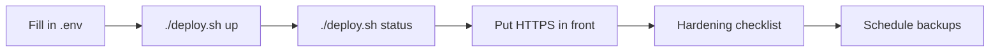

# Self-Host Deployment

*For platform operators.*

Install {brand} on one VM or bare-metal server with Docker Compose, reach it over HTTPS,
harden it for production and back it up. Everything runs in containers, so the host needs
Docker but no Python or Node. Running Kubernetes instead? Take the
[Kubernetes path](/docs/kubernetes).

## Your path

1. **Install** — with Docker Compose on a VM (this page), or on a cluster with
   [Kubernetes](/docs/kubernetes). The table below helps you choose.
2. **Harden** — work through the [Production hardening checklist](#production-hardening-checklist)
   before real users sign in.
3. **Configure** — look up any setting and its default in the
   [Configuration reference](/docs/configuration).
4. **Watch** — wire up health checks, metrics and alerts with [Observability](/docs/observability).
5. **Operate** — keep [Runbooks](/docs/runbooks) at hand for backups, upgrades, password resets
   and recovery.

| If you want … | Choose … | Because … |
|---|---|---|
| One VM or server and the fewest moving parts | **Docker Compose** (this page) | One script starts everything; backups are archives of three Docker volumes |
| A cluster with autoscaling, managed Postgres and Redis, or several environments | **[Kubernetes](/docs/kubernetes)** | Kustomize overlays per environment or a Helm chart; managed data services |



## Prerequisites

- A Linux VM or server with Docker Engine and the Docker Compose v2 plugin —
  `docker compose version` must work, because `deploy.sh` calls `docker compose`.
- `git` (to clone, and for `./deploy.sh update`) and `curl` (used by `./deploy.sh status`).
- Memory for the stores. The graph store is capped at `FALKORDB_MAXMEMORY` (default `14gb`)
  and Redis at `REDIS_MAXMEMORY` (default `2gb`); size the host for those ceilings plus the
  application containers, or lower them in `.env`. The sizing rule is in
  [FalkorDB Deployment](/docs/falkordb-deployment#sizing-the-ceilings-share-one-budget).
- A DNS name and a TLS certificate for the address people will use. Sign-in from other
  machines needs HTTPS — see [Reach it over HTTPS](#reach-it-over-https).
- Outbound network access on the first run, to pull base images and packages.

## Install with Docker Compose

1. Clone the repository and change into it. Every command on this page runs from this
   directory.

   ```bash
   git clone <repo-url> <repo-dir>
   cd <repo-dir>
   ```

2. Create your settings file from the production template.

   ```bash
   cp .env.prod.example .env
   ```

3. Open `.env` and replace the three `REPLACE_ME` values. `./deploy.sh` refuses to start
   while any of them remains.
   - `POSTGRES_PASSWORD` — a long random string, for example `openssl rand -hex 24`.
   - `JWT_SECRET_KEY` — `openssl rand -hex 48`. It signs every session; startup refuses a
     value shorter than 32 characters or one published in this repository.
   - `ADMIN_PASSWORD` — a long, unique password for the first administrator.

4. In the same file, set `ADMIN_EMAIL` to the address you'll sign in with, and set
   `CREDENTIAL_ENCRYPTION_KEY` now, before anyone registers a provider:

   ```bash
   openssl rand -base64 32 | tr '+/' '-_'
   ```

5. Start the stack.

   ```bash
   ./deploy.sh up
   ```

   The first run builds the images. The one-shot `upgrade` service then creates or migrates
   the database schema, and every backend service waits for it to finish. The script waits
   up to two minutes for the containers to report healthy — printing
   **All services healthy.** when they do — and then lists the local addresses.

   > **If you see** `Secrets still unset in .env (value REPLACE_ME)`: one of the values from
   > step 3 is still a placeholder. Edit `.env` and run `./deploy.sh up` again.

6. Check every service.

   ```bash
   ./deploy.sh status
   ```

   The container list is followed by the health probes:

   ```text
   viz-service: healthy
   controlplane: healthy
   graph-service: unreachable
   frontend: healthy
   ```

   `graph-service: unreachable` is expected — that probe is left over from a retired
   service.

7. Sign in. On the server itself, or through an SSH tunnel from your machine, open
   `http://localhost:3080` and sign in with `ADMIN_EMAIL` and `ADMIN_PASSWORD`.

   ```bash
   ssh -L 3080:127.0.0.1:3080 <user>@<vm-host>
   ```

   > **If sign-in returns you to the sign-in page:** you're on plain HTTP at an address other
   > than `localhost`. Session cookies are marked `Secure`, and browsers silently drop them
   > there. Use the tunnel, or finish [Reach it over HTTPS](#reach-it-over-https).

> **Tip:** to try {brandShort} with demo data first, run
> `docker compose --profile seed up seed`. It loads two demo scenarios (finance and
> e-commerce) into the graph store and skips if the graph already has data. Then follow
> [Admin Setup](/guide/admin-setup) to connect it.

## What the host publishes

Only the web port listens on every network interface. Everything else is bound to
`127.0.0.1` by default.

| Port | Service | Bound to | Change with |
|---|---|---|---|
| 3080 | Web app — the UI, plus the `/api` proxy to the backend | every interface | `FRONTEND_PORT` |
| 8000 | API (`viz-service`) | `127.0.0.1` | `VIZ_BIND`, `VIZ_PORT` |
| 8091 | Aggregation control plane | `127.0.0.1` | `CONTROLPLANE_BIND`, `CONTROLPLANE_PORT` |
| 5432 | PostgreSQL | `127.0.0.1` | `POSTGRES_BIND`, `POSTGRES_PORT` |
| 6380 | Redis | `127.0.0.1` | `REDIS_BIND`, `REDIS_PORT` |
| 6379 | FalkorDB (graph store) | `127.0.0.1` | `FALKORDB_BIND`, `FALKORDB_PORT` |
| 3000 | FalkorDB browser | `127.0.0.1` | `FALKORDB_BIND`, `FALKORDB_UI_PORT` |

The loopback binding is what keeps the stores and the internal APIs off the network. Change
a `*_BIND` value only when something off the host genuinely needs that port, and put your
own network controls in front of it first. To open the FalkorDB browser, tunnel to it:
`ssh -L 3000:127.0.0.1:3000 <user>@<vm-host>`, then open `http://localhost:3000`.

## Reach it over HTTPS

Put a TLS-terminating reverse proxy — Caddy, nginx, Traefik or a cloud load balancer — in
front of port 3080.

1. Point a DNS name at the server, for example `lineage.example.com`.
2. Forward the proxy to `http://127.0.0.1:3080` and have it send `X-Forwarded-Proto: https`.
   The web container passes that header to the API, which then treats the request as
   secure and sends HSTS. Allow request bodies up to 100 MB (the web container's own limit,
   for imports) and a read timeout of at least 180 seconds, so the app's own timeout
   messages reach users instead of the proxy's — up to an hour if people export whole data
   sources, which stream for as long as that. With Caddy, which obtains the certificate and
   sets the forwarded headers itself, this is enough:

   ```text
   lineage.example.com {
       reverse_proxy 127.0.0.1:3080
   }
   ```

3. Close port 3080 to everything except the proxy. Docker publishes ports through its own
   firewall rules, which host firewalls such as `ufw` don't filter — use your cloud
   provider's firewall or security group.
4. In `.env`, set `CORS_ALLOWED_ORIGINS=https://lineage.example.com` and the `ALLOWED_HOSTS`
   item from the checklist below, then run `./deploy.sh up` to apply them.

**Verify:**

```bash
curl -sI https://lineage.example.com/ | grep -i strict-transport-security
curl -s https://lineage.example.com/api/v1/auth/diagnostics
```

The first prints `strict-transport-security: max-age=31536000; includeSubDomains`. In the
second, `requestIsSecure` is `true` and `secureCookieWouldBeDropped` is `false`.

## Production hardening checklist

Work through this list before real users sign in. Each item says what it protects and how
to check that it took. The [Configuration reference](/docs/configuration) has every setting,
and the [Security overview](/docs/security-overview) explains how the controls fit together.
On Kubernetes the same settings apply — [Turn on the production settings](/docs/kubernetes#turn-on-the-production-settings)
shows where each one goes.

> **Before you start — how a setting reaches a container in Compose.** `docker-compose.yml`
> gives each container only the variables listed under that service's `environment:`.
> A line in `.env` alone does nothing for any other variable. Several settings below are not
> in the shipped file, so add these lines to the existing `environment:` blocks, keep the
> values themselves in `.env`, and run `./deploy.sh up` to recreate the containers.
> `./deploy.sh` always runs `docker compose -f docker-compose.yml`, so a
> `docker-compose.override.yml` is not read — edit `docker-compose.yml` itself.

```yaml
services:
  aggregation-controlplane:
    environment:
      ENV: ${ENV:-dev}
      METRICS_ENABLED: ${METRICS_ENABLED:-false}
      METRICS_TOKEN: ${METRICS_TOKEN:-}
  viz-service:
    environment:
      ENV: ${ENV:-dev}
      ALLOWED_HOSTS: ${ALLOWED_HOSTS:-}
      AUTH_ENVIRONMENT_ID: ${AUTH_ENVIRONMENT_ID:-}
      API_DOCS_ENABLED: ${API_DOCS_ENABLED:-}
      METRICS_ENABLED: ${METRICS_ENABLED:-false}
      METRICS_TOKEN: ${METRICS_TOKEN:-}
  aggregation-worker:
    environment:
      CREDENTIAL_ENCRYPTION_KEY: ${CREDENTIAL_ENCRYPTION_KEY:-}
      METRICS_ENABLED: ${METRICS_ENABLED:-false}
      METRICS_TOKEN: ${METRICS_TOKEN:-}
  versioning-worker:
    environment:
      CREDENTIAL_ENCRYPTION_KEY: ${CREDENTIAL_ENCRYPTION_KEY:-}
```

The two workers need `CREDENTIAL_ENCRYPTION_KEY` to read the stored credentials of a
provider that has a password; the Kubernetes manifests already give it to them.

- [ ] **Set `ENV=production`.** *Protects:* turns warnings into refusals — a production
  process won't start, or won't take the unsafe action, in the situations listed under
  [What ENV=production switches on](#what-envproduction-switches-on). None of the shipped
  configurations set it, so you must. *Set:* `ENV=production` in `.env`, plus the `ENV`
  lines above. *Verify:* `docker compose exec viz-service printenv ENV` prints `production`.
- [ ] **Set `AGGREGATION_INTERNAL_TOKEN`.** *Protects:* the aggregation control plane's API —
  job trigger, cancel, delete, purge and settings — which then demands this token from every
  caller. With `ENV=production` the control plane refuses to start without it. *Set:*
  `openssl rand -hex 32` into `AGGREGATION_INTERNAL_TOKEN` in `.env`; Compose already passes
  it to the control plane, `viz-service` and `stats-service`. *Verify:*
  `docker compose logs aggregation-controlplane | grep "internal auth"` shows
  `Control Plane internal auth ENABLED`.
- [ ] **Keep the API explorer off (`API_DOCS_ENABLED`).** *Protects:* the full list of
  routes and request schemas that the interactive explorer and `/openapi.json` publish. With
  `ENV=production` they're off; set `API_DOCS_ENABLED=true` only if you put them behind your
  own access control. *Verify:*
  `curl -s -o /dev/null -w '%{http_code}\n' https://<your-host>/openapi.json` prints `404`.
- [ ] **Turn metrics on only with a token (`METRICS_ENABLED`, `METRICS_TOKEN`).**
  *Protects:* the internal state a scrape reveals — graph-store node addresses, hold counts,
  load. Off by default; switched on without a token it still answers `404`. *Set:* both, on
  every process you scrape — see [Observability](/docs/observability#turn-on-metrics).
  *Verify:* `curl -s -o /dev/null -w '%{http_code}\n' https://<your-host>/api/v1/metrics`
  prints `401` (or `404` while metrics are off); with
  `-H "Authorization: Bearer <token>"` the body includes `metrics_process_up{role="web"} 1`.
- [ ] **Set `ALLOWED_HOSTS` to your public host names.** *Protects:* a request that claims a
  `Host` this deployment doesn't answer to is refused with `400` before the SAML and
  cross-site checks that rely on that header see it. Comma-separated; ports are ignored and
  the health endpoints are exempt. If you still sign in through an SSH tunnel, add
  `localhost`. *Verify:* `curl -s -H 'Host: wrong.example' http://127.0.0.1:8000/api/v1/auth/me`
  returns `{"detail":"Host header not recognised for this deployment."}`.
- [ ] **Keep `JWT_EXPIRY_MINUTES` within `MAX_ACCESS_TTL_MINUTES`.** *Protects:* how quickly
  a revoked or demoted session stops working. Permissions travel in the access token, so a
  role change, suspension or forced sign-out reaches a live session only at its next
  renewal. The ceiling is 15 minutes unless you raise `MAX_ACCESS_TTL_MINUTES` on purpose;
  with `ENV=production` a longer lifetime refuses to start. Compose and `.env.prod.example`
  ship 15. *Verify:* `docker compose logs viz-service | grep "Session config"` shows
  `access_ttl=900s` or less.
- [ ] **Set `CREDENTIAL_ENCRYPTION_KEY` before anyone registers a provider.** *Protects:*
  provider and single sign-on credentials stored in Postgres, which are encrypted with this
  key; with `ENV=production` saving them unencrypted is refused. Keep the key with your
  secrets backup: if it changes or is lost, stored credentials can't be read and have to be
  entered again. *Verify:*
  `docker compose exec viz-service sh -c 'test -n "$CREDENTIAL_ENCRYPTION_KEY" && echo set'`
  prints `set`.
- [ ] **Give the first administrator a strong, unique `ADMIN_PASSWORD`.** *Protects:* the
  deployment's break-glass account — it keeps password sign-in when single sign-on is
  enforced, and forced sign-out sweeps skip it. The value is read only while no user exists,
  so changing it in `.env` later does nothing: change the password on **Account settings**
  (`/me/account`), or follow [Reset an administrator's password](/docs/runbooks#reset-an-administrators-password).
  *Verify:* the first sign-in doesn't ask you to change the password — it does when the
  value is one of the example passwords published in this repository.
- [ ] **Set `AUTH_ENVIRONMENT_ID` if people open more than one environment in the same
  browser.** *Protects:* sessions of two deployments that would otherwise share cookie names
  and sign each other out. Use 1–32 characters of `a-z`, `0-9`, `_` and `-`, starting with a
  letter or digit, unique and stable per environment — changing it signs that environment's
  users out once. *Verify:* `curl -s https://<your-host>/api/v1/auth/diagnostics` shows your
  value as `environmentId`. More in
  [Running several environments side by side](/docs/multi-environment-sessions).
- [ ] **Narrow `CORS_ALLOWED_ORIGINS` to your own origin.** *Protects:* which other web
  origins may call the API from a browser with the user's cookies; the cross-site request
  check trusts the same list. The app's own host is always allowed, so most deployments need
  only their public origin — `.env.prod.example` ships `http://localhost:3080`. *Verify:*
  `curl -s -D - -o /dev/null -H 'Origin: https://elsewhere.example' https://<your-host>/api/v1/health | grep -i access-control-allow-origin`
  prints nothing; with your own origin it prints `access-control-allow-origin: https://<your-host>`.
- [ ] **Terminate TLS in front of the web port.** *Protects:* passwords, session cookies and
  data in transit — and sign-in from other machines only works over HTTPS anyway. See
  [Reach it over HTTPS](#reach-it-over-https). *Verify:*
  `curl -sI https://<your-host>/ | grep -i strict-transport-security` prints
  `max-age=31536000; includeSubDomains`.
- [ ] **Keep the internal ports on `127.0.0.1`.** *Protects:* Postgres, Redis, the graph
  store and its browser, the API and the control plane stay off the network. *Verify:*
  `docker compose ps` shows `127.0.0.1:` in front of every published port except 3080.
- [ ] **Back up on a schedule, and keep `.env` with the backups.** *Protects:* recovery —
  `.env` holds the database password and the credential encryption key the backups need.
  See [Back up and restore](#back-up-and-restore). *Verify:* restore one backup on a spare
  host.

### What ENV=production switches on

`ENV` accepts `production` or `prod`, in any case. Anywhere else the same checks only log a
warning, or don't run at all.

| Situation | With `ENV=production` |
|---|---|
| Access-token lifetime (`JWT_EXPIRY_MINUTES`) above `MAX_ACCESS_TTL_MINUTES` | `viz-service` refuses to start |
| Absolute session ceiling (`SESSION_ABSOLUTE_MAX_HOURS`) longer than the refresh-token lifetime | `viz-service` refuses to start |
| Either permission-enforcement switch (`RBAC_ENFORCE_VIEWS`, `RBAC_ENFORCE_WORKSPACES`) turned off | `viz-service` refuses to start |
| The development sign-in (`AUTH_CUSTOM_PROVIDER_ENABLED=true`) | refuses to start |
| `AGGREGATION_INTERNAL_TOKEN` unset | the control plane refuses to start |
| Saving provider or single sign-on credentials without `CREDENTIAL_ENCRYPTION_KEY` | the save is refused |
| The session-revocation store (Redis) can't be set up at startup | no in-process stand-in: privileged requests answer `503` and `/health/ready` reports not ready |
| SAML, **Enterprise gateway** connections that deliver the assertion in the browser, and signed **Corporate portal** connections, without the shared replay store | those connections are refused |
| Outbound single sign-on calls over plain `http://` | refused |
| Interactive API explorer and `/openapi.json` | off unless `API_DOCS_ENABLED=true` |
| A `.env` or `.env.dev` file in the working directory | no longer read automatically |

Where in the code: `backend/app/main.py` (`_is_production`, `_DOCS_ENABLED`),
`backend/app/auth/dependencies.py` (`assert_rbac_enforcement_intact`),
`backend/auth_service/core/config.py`, `backend/app/services/aggregation/internal_auth.py`
(`assert_auth_mode_allowed`), `backend/app/db/repositories/connection_repo.py`
(`require_encryption_or_plaintext_ok`), `backend/app/services/revocation_service.py`,
`backend/auth_service/providers/outbound.py` (`assert_fetchable`).

## Back up and restore

A backup is one archive per named volume: Postgres (users, views, settings and version
history), FalkorDB (the graphs) and Redis (job queues and caches).

### Back up

1. Stop the stack, so the archives are consistent — the script copies volume files, and a
   running database can change mid-copy.

   ```bash
   ./deploy.sh down
   ```

2. Take the backup. The name is optional and defaults to `manual`.

   ```bash
   ./deploy.sh backup pre-upgrade
   ```

   It writes a timestamped directory under `backups/` in your checkout:

   ```text
   backups/20261010-031500-pre-upgrade/
   ├── synodic_falkordb_data.tgz
   ├── synodic_postgres_data.tgz
   └── synodic_redis_data.tgz
   ```

3. Start the stack again: `./deploy.sh up`.
4. Copy the directory off the server, and keep a copy of `.env` somewhere safe and separate:

   ```bash
   rsync -av backups/20261010-031500-pre-upgrade/ <user>@<backup-host>:<backup-path>/
   ```

To back up nightly, add a cron entry that stops, backs up and restarts during a quiet hour.
Use the absolute path of your checkout; the `;` restarts the stack even if the backup fails.

```text
# /etc/cron.d/nightly-backup
15 3 * * * root cd <absolute-repo-dir> && ./deploy.sh down && ./deploy.sh backup nightly; ./deploy.sh up
```

### Restore

> **Warning:** a restore stops the stack and overwrites the Postgres, FalkorDB and Redis
> volumes. There is no undo — back up the current state first if you might need it.

1. Check out the release the backup was taken with, or a newer one. A database stamped by a
   newer release than the code fails the schema step.
2. Run the restore and type `yes` when asked.

   ```bash
   ./deploy.sh restore backups/20261010-031500-pre-upgrade
   ```

   It stops the stack, recreates each volume from its archive (warning about and skipping any
   archive that's missing), then starts the stack the same way `./deploy.sh up` does.
3. Verify with `./deploy.sh status`, then sign in and open a few views.

## Upgrade to a new release

1. Stop the stack and take a backup, as in [Back up](#back-up).
2. Pull, rebuild and restart in one step:

   ```bash
   ./deploy.sh update
   ```

   It runs `git pull --ff-only`, rebuilds every image — the schema-upgrade image included —
   and starts the stack. The `upgrade` service brings the schema to the new release before
   any backend service starts.

   > **If it stops with** `git pull failed`: your checkout has local changes, usually the
   > `environment:` lines from the hardening checklist. Run
   > `git stash && git pull --ff-only && git stash pop`, check that your lines are still in
   > `docker-compose.yml`, then `./deploy.sh up --build`.

3. Verify the schema step and the services:

   ```bash
   docker compose ps -a upgrade
   docker compose logs upgrade | tail -n 3
   ./deploy.sh status
   ```

   `upgrade` shows `Exited (0)` and its log ends with a line containing `Upgrade complete`.

If the schema step fails, the backend services don't start and Compose reports that `upgrade`
didn't complete successfully. Read `docker compose logs upgrade`, then
[Migrations](/docs/migrations) for `repair` and `verify-schema`. To go back, check out the
previous release and restore the backup from step 1.

Some releases ship an upgrade note with steps of their own — for example
[Upgrading for graph availability (2026-09-10)](/docs/upgrade-2026-09-10).

## After a host reboot

Every long-running service has `restart: unless-stopped`, so Docker starts them again once
the daemon is up — if your distribution doesn't start Docker at boot, run
`sudo systemctl enable --now docker`. Data survives in the named volumes.

The start order in `docker-compose.yml` applies to `./deploy.sh up`, not to containers the
daemon restarts, so the services retry their connections while the others come up; the API
waits up to a minute for Postgres. If Postgres took longer, the API starts in a degraded mode
and doesn't redo its startup work when the database comes back. Check it once the host is up:

```bash
curl -s http://127.0.0.1:8000/health/ready
```

`"status":"ready"` means the API is fully up. If it says `not_ready` while `docker compose ps`
shows Postgres healthy, run `./deploy.sh restart` and check again.

## Reset all data

> **Warning:** this permanently deletes the Postgres, FalkorDB and Redis volumes — every
> graph, view, version and user. There is no undo; take a backup first if you might want
> anything back.

```bash
./deploy.sh down
docker compose -f docker-compose.yml down -v
```

Then `./deploy.sh up` starts again from an empty state.

## Corporate TLS trust for SSO

Enterprise sign-in endpoints — a corporate gateway, an internal identity provider, a private
photo host — usually present certificates signed by the company's own certificate authority.
By default outbound single sign-on calls trust the public trust store only, so each of those
calls fails with *certificate verify failed* and a rehearsal of the connection reports
`tls_verify_failed`.

Point `SSO_OUTBOUND_TLS_CA_CERTS` at a PEM bundle holding your corporate CA chain. Every
outbound single sign-on call — gateway calls, OIDC discovery, token and key endpoints, SAML
metadata imports, avatar fetches — verifies against it from the next request; a bundle
mounted after startup starts working on its own.

**Docker Compose** — add the variable and a read-only mount to `viz-service` in
`docker-compose.yml`:

```yaml
services:
  viz-service:
    environment:
      SSO_OUTBOUND_TLS_CA_CERTS: /etc/ssl/corp/ca-bundle.pem
    volumes:
      - ./secrets/corp-ca.pem:/etc/ssl/corp/ca-bundle.pem:ro
```

**Kubernetes** — ship the bundle as a Secret and mount it into `viz-service`:

```bash
kubectl create secret generic corp-ca --from-file=ca-bundle.pem=corp-ca.pem
```

```yaml
env:
  - name: SSO_OUTBOUND_TLS_CA_CERTS
    value: /etc/ssl/corp/ca-bundle.pem
volumeMounts:
  - name: corp-ca
    mountPath: /etc/ssl/corp
    readOnly: true
volumes:
  - name: corp-ca
    secret:
      secretName: corp-ca
```

**Verify:** rehearse the enterprise connection from **Administration → SSO**; the gateway
and avatar lines stop reporting a trust failure. A path that can't be loaded is logged at
`ERROR`, naming the variable and the path, and calls fall back to the public trust store —
never to "no verification".

With `ENV=production`, plain `http://` to these endpoints is refused, so the CA bundle is
the supported way to reach internal HTTPS endpoints. The per-connection
**Skip TLS verification for this connection** setting is the last resort: it accepts any
certificate on that one connection and costs it its verified rating.

## Subcommand reference

| Command | What it does |
|---|---|
| `./deploy.sh up` | Preflight (refuses while `.env` is missing or holds `REPLACE_ME`), then `docker compose up -d`; waits up to two minutes for health and prints the local addresses |
| `./deploy.sh up --build` | The same, rebuilding the images first |
| `./deploy.sh down` | Stops and removes the containers; the volumes stay |
| `./deploy.sh restart` | `docker compose restart` — restarts containers in place; it doesn't apply `.env` or `docker-compose.yml` changes (use `up` for those) |
| `./deploy.sh status` | Container list plus health probes |
| `./deploy.sh logs [service]` | Follows the logs — the last 100 lines of every service, or one service's whole log |
| `./deploy.sh doctor` | Preflight checks, container status, and whether the Postgres role and database exist; changes nothing |
| `./deploy.sh update` | `git pull --ff-only`, rebuild every image, `docker compose up -d` |
| `./deploy.sh backup [name]` | Archives the three volumes into `backups/<timestamp>-<name>/` (name defaults to `manual`) |
| `./deploy.sh restore <dir>` | Asks for `yes`, stops the stack, recreates the volumes from `<dir>`, starts the stack |

## Troubleshooting

| Symptom | Cause | Fix |
|---|---|---|
| `.env not found.` | No settings file yet | `cp .env.prod.example .env` and fill it in |
| `Secrets still unset in .env (value REPLACE_ME)` | A placeholder is left | Replace the values listed, run `./deploy.sh up` |
| `POSTGRES_PASSWORD must be set in .env` (or the same for `POSTGRES_USER`, `POSTGRES_DB`, `JWT_SECRET_KEY`, `ADMIN_PASSWORD`) | The variable is empty | Set it in `.env` |
| `viz-service` keeps restarting; its log says `JWT_SECRET_KEY is too weak` or names a placeholder | The signing key is short or a published example | `openssl rand -hex 48`, then `./deploy.sh up` |
| `viz-service` keeps restarting; its log says `JWT_EXPIRY_MINUTES=… exceeds the 15-minute ceiling` | `ENV=production` with a long access-token lifetime | Lower `JWT_EXPIRY_MINUTES` to 15 or less |
| The control plane keeps restarting; its log says `Control Plane internal auth is DISABLED` | `ENV=production` without `AGGREGATION_INTERNAL_TOKEN` | Set the token in `.env`, `./deploy.sh up` |
| `service "upgrade" didn't complete successfully` | The schema step failed | `docker compose logs upgrade`, then [Migrations](/docs/migrations) |
| Sign-in succeeds but returns you to the sign-in page | Plain HTTP at an address other than `localhost`: the `Secure` session cookies are dropped | Use HTTPS or an SSH tunnel; `/api/v1/auth/diagnostics` shows `secureCookieWouldBeDropped` |
| `Host header not recognised for this deployment.` | The host name isn't in `ALLOWED_HOSTS` | Add it (and `localhost` if you tunnel) |
| `/docs` or `/openapi.json` answers `404` | `ENV=production` turns the API explorer off | Expected; set `API_DOCS_ENABLED=true` only behind your own access control |
| `FATAL: role "<POSTGRES_USER>" does not exist`, or `password authentication failed` | The Postgres volume was created with other credentials | Put the original values back in `.env`, or [reset all data](#reset-all-data) (destroys it) |
| `./deploy.sh status` shows `graph-service: unreachable` | A probe for a retired service | Nothing to fix |
| Containers restart in a loop | A setting the service refuses | `./deploy.sh logs <service>` and `./deploy.sh doctor` |

The logs almost always name the problem: `./deploy.sh logs <service>`.

## Uninstall

```bash
./deploy.sh down
docker compose -f docker-compose.yml down -v --rmi all
cd .. && rm -rf <repo-dir>
```

The second command deletes the volumes and the images; the last removes the checkout.

## Where to next

- [Kubernetes](/docs/kubernetes) — when you outgrow one server or want managed Postgres and Redis.
- [Observability](/docs/observability) — to wire health checks, metrics and alerts into your monitoring.
- [Runbooks](/docs/runbooks) — when you need to restore, upgrade, reset a password or recover the graph store.
- [Concurrency and Timeout Tuning](/docs/concurrency-tuning) — when users report slow or timed-out graphs.
