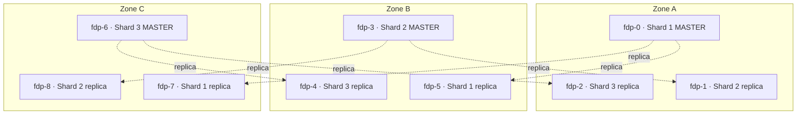

# Enterprise FalkorDB Architecture & Disaster Recovery Specification

> **At a glance.** The reference architecture and operations spec for {brand}'s FalkorDB
> graph read layer on GKE — for SREs and infra engineers deploying and running it. Covers
> the multi-zonal Redis Cluster topology, auto-healing and failover, the memory / AOF /
> engine-upgrade rules that keep an instance alive, cross-region DR, and the
> topology-aware application client. FalkorDB is a **disposable projection** of Cloud SQL:
> any graph rebuilds from the system of record, which is what makes an aggressive,
> evictable posture safe.

**Document Version:** 1.0
**Target Environment:** Google Kubernetes Engine (GKE)
**Workload:** Multi-Tenant Enterprise Graph Service (Heavy Reads, Spiky Writes)

**Related:** [FalkorDB DR Runbook](/docs/falkordb-dr) (backup/restore procedures) ·
[Self-Host Deployment](/docs/deployment) (single-host Compose path).

---

## 1. Executive Summary

This document outlines the architecture for a highly resilient, multi-tenant FalkorDB deployment on GKE. To accommodate hundreds of distinct tenant graphs with strict high-availability requirements (cost-agnostic), we utilize **Redis Cluster Mode** (no Sentinels) configured with a **9-Pod Bulletproof Zonal Topology**.

This architecture guarantees that even in the event of a complete GCP Availability Zone failure, every graph shard maintains at least one active Master and one active Replica, preventing read-workload cascading failures.

---

## 2. Infrastructure Specification

| Component | Specification | Description |
| :--- | :--- | :--- |
| **Cloud Provider** | GCP (e.g., `us-central1`) | Multi-zonal region required (Zones A, B, C). |
| **Compute Nodes** | `n4-standard-16` | 16 vCPUs, 128GB RAM for high concurrency and memory buffering. |
| **Orchestration** | GKE + Kubernetes Operator | FalkorDB Operator or KubeBlocks for StatefulSet management. |
| **Storage** | Premium SSD Persistent Volumes | Critical for low-latency AOF (Append-Only File) background disk I/O. |

---

## 3. Pod Topology & Distribution (The 9-Pod Rule)

The cluster is divided into 3 Shards. Each Shard owns a subset of the 16,384 hash slots.
To achieve multi-zonal resilience, each Shard is configured with **1 Master** and **2 Replicas**. 

Kubernetes `topologySpreadConstraints` and strict `podAntiAffinity` are used to distribute these 9 pods perfectly across the 3 GCP zones.

### Logical/Physical Layout Map

| GCP Zone | Host Node (Example) | Pod ID | Cluster Role | Shard Assignment |
| :--- | :--- | :--- | :--- | :--- |
| **Zone A** | `gke-node-a-1` | `fdp-0` | **Master** | Shard 1 |
| **Zone A** | `gke-node-a-1` | `fdp-1` | Replica | Shard 2 (Replica B) |
| **Zone A** | `gke-node-a-1` | `fdp-2` | Replica | Shard 3 (Replica C) |
| **Zone B** | `gke-node-b-1` | `fdp-3` | **Master** | Shard 2 |
| **Zone B** | `gke-node-b-1` | `fdp-4` | Replica | Shard 3 (Replica B) |
| **Zone B** | `gke-node-b-1` | `fdp-5` | Replica | Shard 1 (Replica B) |
| **Zone C** | `gke-node-c-1` | `fdp-6` | **Master** | Shard 3 |
| **Zone C** | `gke-node-c-1` | `fdp-7` | Replica | Shard 1 (Replica C) |
| **Zone C** | `gke-node-c-1` | `fdp-8` | Replica | Shard 2 (Replica C) |

The invariant this layout guarantees: **every shard keeps a master and at least one
replica in the surviving zones through any single-zone loss** — no shard ever falls back
to master-only reads.



---

## 4. Routing & Data Distribution

Because this is a multi-tenant environment, entire tenant graphs are distributed across the cluster.

1. **Deterministic Placement:** An application creates a graph (e.g., `tenant_A_data`).
2. **Client Routing:** The cluster-aware application client hashes the graph name to a specific hash slot (e.g., falling in Shard 2).
3. **Zero-Hop Writes:** The client routes write commands directly to the Master of Shard 2 (Zone B).
4. **Read Scaling:** Analytical read queries (`GRAPH.RO_QUERY`) are automatically load-balanced by the client to the Replicas in Zone A and Zone C.

---

## 5. Auto-Healing & Recovery Scenarios

### 5.1 Single Node Hardware Failure (e.g., Zone B Node Crashes)

**Impact:** Loss of `fdp-3` (Master, Shard 2), `fdp-4` (Replica), and `fdp-5` (Replica).

1. **Quorum:** 6 pods remain. The remaining Masters retain quorum.
2. **Detection:** Gossip protocol marks `fdp-3` as dead.
3. **Failover:** Shard 2's remaining replicas (`fdp-1` in Zone A, `fdp-8` in Zone C) hold an election. The cluster promotes `fdp-8` to Master.
4. **Traffic Update:** Clients attempting to hit `fdp-3` receive a `MOVED` redirect and update their routing tables to hit `fdp-8`.
5. **Restoration:** GKE automatically reschedules missing pods to a healthy node in Zone B, reattaches PVs, and instances perform a differential sync.

*No data loss. What the application sees is a HOLD, not a transparent
switch:* the cluster does not begin an election until `cluster-node-timeout`
(15s) has passed, so for those seconds the shard's keys have no master. Reads
fail fast with a 3-second retry hint and the canvas keeps serving its last
answer behind a "Reconnecting to the graph store" line; a running rebuild
waits for the node and resumes from its checkpoint. The circuit breaker is
NOT allowed to open for this — a failover is a pause, and treating it as an
outage is what used to answer every user with "Circuit open" for 30s at a
time, long after the promotion had finished.

### 5.2 Full Zonal Outage (e.g., Zone C Datacenter Drops)

**Impact:** Loss of `fdp-6` (Master, Shard 3), `fdp-7` (Replica), and `fdp-8` (Replica).

1. **Quorum:** Zones A and B survive. Masters 1 and 2 retain quorum. 
2. **Detection & Failover:** Shard 3's Master is dead. Its surviving replicas are in Zone A and Zone B. One is promoted to Master.
3. **Cluster State:** After failover, **every single Shard (1, 2, and 3) still has exactly 1 Master and 1 Replica active in the surviving zones.**
4. **Read Preservation:** Because replicas still exist for every shard, read-only queries keep being spread across them and do not all fall back onto the Masters. (Read-only Cypher is offered to a replica that is in step with its master, within a lag threshold, and never inside the window after this process's own write to that graph — see `AGGREGATION_PIPELINE.md`. A provider can be pinned to master-only reads.)

*Downtime: < 1 second for Shard 3 writes. Slight read latency increase as capacity drops from 6 replicas to 3 across the cluster.*

---

## 5aa. Replication Under Heavy Writes (read this before a large rebuild)

This is the mechanism behind the worst failure this deployment has had: a
rebuild of a densely connected graph taking a whole shard down.

**FalkorDB replicates a write query by RE-RUNNING it.** Below
`EFFECTS_THRESHOLD` (µs per modification, default **300**), the master ships
the Cypher itself and every replica executes the whole query again. A rollup
apply batch is hundreds of cheap MERGEs, so it is always under the threshold
and always replicated this way. Two properties make that dangerous:

- a replicated command runs on the replica's **main thread**, not a worker;
- it runs **without a timeout** — the server-side `TIMEOUT` is deliberately
  not applied to replicated commands.

So a replica re-running a batch over a dense graph answers no `PING`, no
cluster-bus gossip and no reads for as long as the batch takes. With a 3s
probe timeout and 3 failures, ~30 seconds of that is enough for the kubelet
to restart it, the cluster to mark it FAIL, and the run to die on a refused
connection to its shard.

**Set `EFFECTS_THRESHOLD 0`** (in `FALKORDB_ARGS`, and on every node —
masters decide how they replicate, and a promoted replica must already carry
it). At `0`, every effects-capable write replicates as a compact change log
the replica applies directly, which is orders of magnitude cheaper than
re-running the query. Admin → Graph store flags any master that has replicas
and a threshold above 0, and can set it at runtime.

Three settings back that up:

| Setting | Shipped | Why |
| --- | --- | --- |
| `--repl-backlog-size 1gb` | was 256mb | The window a disconnected replica can catch up through without a full resync. A rebuild fills 256 MB in seconds. |
| `--client-output-buffer-limit replica 2gb 1gb 300` | was the 256 MB default | When a replica's output buffer overflows, the master **drops it** and it comes back with a full resync — a fork and a whole-dataset transfer, under the same write load that caused it. |
| `--repl-timeout 300` | was 60 | A full resync of a large shard takes longer than a minute; timing it out mid-transfer starts it over. |
| `--cluster-node-timeout 15000` | was 5000 | How long a node may be silent before the cluster calls it failed and elects a replacement. A node busy applying replication is silent for seconds at a time, and a 5s window turned that into an election — a promotion no one needed, and a slot map churn every client had to follow. The cost of 15s is that a genuinely dead master is replaced three times slower; the application covers that window (reads fail fast with a retry hint and keep serving cached data, a rebuild waits and resumes), so the trade is worth it. |

And the liveness probe gets room to be slow: `timeoutSeconds: 10`,
`failureThreshold: 6`. A busy main thread is not a dead process, and the
readiness probe (strict, 3s) already takes a busy node out of rotation.

Finally, the application does not rely on any of this alone: a rebuild asks
the master how many replicas have acknowledged its writes (`WAIT`) and holds
when they fall behind, so it can never write faster than its replicas absorb.
See `AGGREGATION_PIPELINE.md`.

---

## 5a. Memory Sizing Rule (read this before raising maxmemory)

> **Warning:** Setting `maxmemory` **above** the host/VM capacity converts graceful
> `OOM command not allowed` write errors into host-level OOM **kills** of the whole
> instance — each restart then pays a multi-minute AOF replay. `maxmemory` is a ceiling,
> not a reservation. Grow the host first, then `maxmemory`.

`maxmemory` must fit INSIDE the machine that runs the container, with
headroom — it is a Redis-level ceiling, not a reservation, and setting
it above the host/VM capacity converts graceful `OOM command not
allowed` write errors into host-level OOM kills of the whole instance
(observed live 2026-07-11: `maxmemory 12gb` on a 12GB Docker Desktop VM
shared with 8 other containers — the instance died repeatedly under
load and each restart paid a multi-minute AOF replay, presenting as
"the stack blew up and is not recovering for hours").

> **There is ONE sizing rule, and it is the formula in
> [*Sizing: the ceilings share ONE budget*](#sizing-the-ceilings-share-one-budget)
> below.** `maxmemory` is only one of its terms; query memory and the
> replication buffers are charged inside the same container limit. Do not size
> on a flat share of the machine — that is how a pairing that looks
> conservative (62% of the node) ends up needing 119% of the container.

The rest of this section is the reasoning behind the first term, and the
recovery cost that belongs in the same decision:

- the dataset should sit around **60% of `maxmemory`** in steady state —
  BGSAVE/BGREWRITEAOF fork copy-on-write spikes usage well above the resident
  dataset while writes are in flight, which is where the formula's `1.25 ×`
  comes from;
- if the dataset legitimately needs more, grow the CONTAINER first (on a
  laptop: Docker Desktop → Settings → Resources → Memory), re-run the formula,
  then raise `maxmemory`;
- lowering `maxmemory` on a LIVE instance below its current usage denies every
  write immediately under `noeviction`. Check what each node holds first —
  Admin → Graph store shows used and `maxmemory` per node.

Recovery time is part of sizing: an AOF *incremental* replays
command-by-command (minutes per GB) while the *base* RDB bulk-loads
fast — keep the incremental small (see the auto-rewrite thresholds in
the compose files) or restarts of a large instance take tens of
minutes, during which liveness MUST NOT kill the process (see below).

## 5b. Local Durability: AOF Is Mandatory

> **Important:** Snapshot-only persistence is **not** sufficient — a restart reloads the
> last RDB and silently drops every write since it. Every shipped topology must run with
> AOF on (`--appendonly yes --appendfsync everysec --aof-load-truncated yes`), which
> bounds the loss window to ~1 second and tolerates a torn AOF tail after a crash.

Every shipped topology (compose files, k8s manifests) runs FalkorDB with
`--appendonly yes --appendfsync everysec --aof-load-truncated yes`.

Snapshot-only persistence is NOT sufficient: a restart reloads the last
RDB and silently drops every write since it. Observed live (2026-07-11):
a stack restart minutes after a graph import resurrected the graph with
its containment edges but WITHOUT its lineage edges (the RDB save fired
mid-import), after which every aggregation run correctly produced zero
cells — presenting as "aggregation is broken" when the data layer had
lost the input. AOF `everysec` bounds the loss window to ~1 second;
`aof-load-truncated` tolerates a torn AOF tail after a crash instead of
refusing to start. Keep RDB snapshots enabled alongside AOF — they
remain the fast-restart and DR-export mechanism.

## 5c. Engine Version Upgrades: Reload From RDB, Not AOF

> **Caution:** Never carry an AOF incremental across an engine-version bump. Replaying an
> incremental written by the previous engine can SIGSEGV *during the startup AOF load* —
> and with `restart: unless-stopped` that becomes a permanent crash loop that the
> healthcheck may still report as "(healthy)". Migrate persistence through the **RDB
> base** (portable across versions) using the procedure below.

**The AOF *incremental* is NOT portable across FalkorDB engine versions; the
RDB *base* is.** FalkorDB persists graph mutations to the AOF incremental as a
binary `GRAPH.EFFECT` opcode stream that is specific to the engine build. After
bumping the `falkordb/falkordb:vX` image tag, replaying an incremental written
by the PREVIOUS engine can NULL-deref (`AttributeSet_Update` → SIGSEGV) *during
the startup AOF load*, before the server accepts a single query. With
`restart: unless-stopped` this becomes a permanent crash loop, and because the
healthcheck treats the `-LOADING` reply as healthy, `docker ps` can even show
"(healthy)" while it loops. `--aof-load-truncated` does NOT help — it only
forgives a torn tail, not a well-formed-but-incompatible effect. (Observed live
2026-07-12 upgrading v4.16.0 → v4.18.11.)

The RDB base decodes cleanly across versions, so migrate persistence through
RDB whenever the engine tag changes on a topology that persists a volume:

1. **Before** bumping the image tag, on the OLD running engine, compact and
   confirm the write is durable:
   ```
   redis-cli BGREWRITEAOF
   redis-cli INFO persistence | grep aof_last_bgrewrite_status   # want :ok
   ```
2. Boot the NEW image once with **AOF off** so it loads the portable RDB
   (the AOF base RDB, or a standalone `dump.rdb`), then re-enable AOF to mint a
   fresh, engine-native AOF (empty incremental + a base written by the new
   engine):
   ```
   # temporary container / args: drop `--appendonly yes`, add `--appendonly no`
   redis-cli CONFIG SET appendonly yes
   redis-cli INFO persistence | grep -E 'aof_enabled|aof_rewrite_in_progress|aof_last_bgrewrite_status'
   # wait for aof_enabled:1, aof_rewrite_in_progress:0, aof_last_bgrewrite_status:ok, then clean-stop
   ```
   > Gotcha: with `--appendonly yes` and NO `appendonlydir` present, Redis starts
   > **EMPTY** — it does not fall back to `dump.rdb`. Load the RDB with
   > `--appendonly no`, or keep a valid base RDB + a base-only manifest.
3. Validate the RDB before trusting it: `redis-check-rdb <file>` (envelope/CRC
   pre-filter; the definitive check is a boot that loads the graph module).

In **dev**, the `scripts/falkordb-dev-entrypoint.sh` guard performs this
recovery automatically: it detects a startup crash loop and quarantines the
incompatible incremental (moving it to `appendonlydir.poison-*`, never deleting)
so the next boot loads clean from the base RDB. In **prod**, this is a manual
runbook by design — quarantining data should be a human decision made against a
known-good backup, and a crash loop should surface as CrashLoopBackOff and page
an operator, not silently discard writes.

## 6. Disaster Recovery (Cross-Region)

In the event of a total GCP Region loss (e.g., `us-central1` goes completely offline), standard HA mechanisms fail. The following DR strategy must be implemented proactively:

1. **Automated Snapshots:** Configure FalkorDB to generate RDB snapshots every 4-6 hours.
2. **Multi-Region Bucket:** Export snapshots automatically to a GCP Cloud Storage Bucket configured with **Multi-Region Replication** (e.g., replicating to `europe-west1`).
3. **Cold Standby / Active-Passive:** Maintain a scaled-down GKE cluster in the secondary region. 
4. **Recovery Protocol:** In a disaster, scale up the secondary GKE cluster, deploy the FalkorDB operator, and initialize the cluster using the latest RDB file from the replicated storage bucket.
5. **DNS Cutover:** Update Multi-Cluster Ingress (MCI) or global load balancer to route application traffic to the secondary region.

---

## 7. Application Client Configuration

The application's FalkorDB provider is topology-aware and selects how to
connect from configuration — **standalone**, **Sentinel**, or **Cluster**.
Because a single FalkorDB graph key lives entirely on one node, Cluster
mode does not split a single graph; it routes the client to the node that
**owns** the graph key (§4) and provides HA + spreads *different* graphs
across shards.

### Topology support matrix (verified live)

Every service — viz-service, **aggregation-worker**, **versioning projection
worker**, insights, control plane — reaches FalkorDB through the *same*
topology-aware factory (`build_graph_client` / the graph-client cache), so
none of them carries topology logic of its own. Verified against a live
3-master cluster (v4.18.11) and a live Sentinel quorum (1 master + 1 replica +
3 sentinels, quorum 2):

| Operation | Standalone | Cluster | Sentinel |
|---|---|---|---|
| Connect + `ensure_indices` / `ensure_projections` | ✅ | ✅ | ✅ |
| `GRAPH.QUERY` write / `GRAPH.RO_QUERY` read | ✅ | ✅ (routed to the owning shard) | ✅ |
| Dedicated `{graph}_proj` (aggregation projection) | ✅ | ✅ (own client; may land on a *different* shard) | ✅ |
| **Aggregation worker** `materialize_aggregated_edges_batch` | ✅ | ✅ | ✅ |
| **Versioning projection** factory MERGE + read-back | ✅ | ✅ | ✅ |
| `get_schema_stats` (insights / health) | ✅ | ✅ | ✅ |
| `GRAPH.LIST` (keyless) | ✅ | ✅ **union over all primaries** — a single node sees only its own shard | ✅ |
| `drop_graph` / eviction / orphan purge (`GRAPH.DELETE`) | ✅ | ✅ (verified on all 3 shards) | ✅ |
| Hard master crash → promotion | n/a | n/a | ✅ **writes self-heal, no data loss** |

**Cross-slot hazards: none.** An exhaustive audit of every command we issue on
the graph connection found **zero** pipelines, `MULTI`/`EXEC`, Lua/`EVAL`,
multi-key commands, `GRAPH.COPY`, `GRAPH.BULK` or graph renames. Every graph
command is either keyed to a single graph (so it routes by slot) or a keyless
admin command that fans out explicitly. `_bulk_write_batch` is a
LOADING-aware retry wrapper around ordinary single-key `GRAPH.QUERY`, not a
bulk loader.

**Sentinel failover behaviour (measured).** With writes in flight, `SHUTDOWN
NOSAVE` on the master produced: `ConnectionError` → reconnect+retry 1/3, then
`TimeoutError` retries 2/3 and 3/3, worst single write **6.2s** (inside its 15s
budget) — and **zero errors escaped to the caller**. Sentinel promoted the
replica, the client followed it, and pre-failover data survived replication.
The redis-py Sentinel pool re-runs `discover_master` on every reconnect, so a
promoted replica is picked up without rebuilding the client.

**Ops scripts are NOT topology-aware — by design.** The seed / import /
maintenance scripts speak plain standalone Redis. Against a Cluster they would
reach only one node's slots, and against Sentinel they can land on a demoted
replica — so a wipe or `GRAPH.DELETE` would half-apply and a reindex would
silently skip shards. They all call `assert_standalone_env()` and **refuse to
run** outside standalone. Drive the change through the application (which is
topology-aware) or point them at a standalone instance.

### 7.1 Where config lives

Two layers, most-specific wins:

1. **Per-provider** — the provider record's
   `extra_config.falkordbConnection` (preferred when different providers
   use different topologies; flows through the existing provider API and
   into `FalkorDBProvider(connection_config=...)`):

   ```jsonc
   "falkordbConnection": {
     "mode": "standalone | sentinel | cluster",
     "sentinel": { "masterName": "mymaster", "nodes": [["s1", 26379], ["s2", 26379]] },
     "cluster":  { "startupNodes": [["n1", 6379], ["n2", 6379], ["n3", 6379]] }
   }
   ```

2. **Process-wide env fallback** (when the JSON is absent):
   `FALKORDB_MODE`, `FALKORDB_SENTINEL_MASTER`, `FALKORDB_SENTINEL_NODES`,
   `FALKORDB_CLUSTER_NODES` (the `*_NODES` vars accept `host:port,host:port`).

Default/absent mode = `standalone` — identical to the legacy single-host
path, so existing deployments are unaffected.

### 7.2 Behavior per mode

| Mode | Graph client | Failover |
|------|--------------|----------|
| standalone | direct pool to `FALKORDB_HOST:PORT` | breaker + worker resume |
| sentinel | rides the Sentinel master pool (auto-reresolves the promoted master) | transparent |
| cluster | routes to the node owning the graph key; on `MOVED`/connection drop the client is rebuilt against the new owner and the op retried once | transparent (`_run_guarded`) |

A *sustained* routing/connection failure trips the per-provider circuit
breaker (cluster/sentinel error classes are recognized); a single
transient `MOVED` is retried below the breaker and never surfaces.

### 7.3 Cache Redis in Cluster mode

The provider's ancestor/idempotency cache is a **separate role**
(`RedisRole.CACHE`, configured via `REDIS_CACHE_*` / legacy
`CACHE_REDIS_URL` — see
[DATA_ARCHITECTURE.md → Redis Topology & Decoupling](DATA_ARCHITECTURE.md#redis-topology--decoupling)
and [ADR-022](DECISIONS.md#adr-022-central-role-keyed-redis-config-cachestreams-independent)),
with its own host, auth, and TLS/mTLS PKI, completely independent of the
FalkorDB graph connection described above (§7.1–7.2). It uses cross-slot SCAN
and multi-key pipelines, which a single Cluster node cannot serve, so **Redis
Cluster is unsupported for the cache role** — `resolve_redis_config` rejects
it (`RedisConfigurationError`) for the same reasons Cluster is rejected for
the coordination bus: cross-slot `SCAN`/`DEL`, the bus's cross-slot `XADD`
pipelining, and a non-zero DB index (Cluster only supports DB 0). Point
`REDIS_CACHE_*` at a standalone or Sentinel dedicated Redis instead; without a
configured cache the provider runs cache-disabled (correct, slower) and logs
a loud warning. Note that the legacy URL forms (`REDIS_URL` /
`CACHE_REDIS_URL`) can only express a **standalone** endpoint — a URL
pointing at a Sentinel daemon is dialed directly as if it were the data
node; Sentinel topologies must use the structured vars
(`*_MODE=sentinel` + `*_SENTINEL_MASTER`/`*_SENTINEL_NODES`).
**Redis Cluster remains fully supported for FalkorDB itself**
— this restriction applies only to the cache role. In `dedicated` projection
mode on a FalkorDB cluster, `{graph}_proj` may live on a different shard than
`{graph}` and is routed through its own owning-node client automatically.

### 7.4 Aggregation at scale

The single resumable EXTRACT → COMPUTE → RECONCILE → APPLY pipeline is
always on (the legacy bulk/streaming strategies and their
`AGGREGATION_*_REBUILD_ENABLED` flags were removed; rollback is a version
rollback). Sizing, tuning knobs and provider-protection parameters live in
`docs/AGGREGATION_PIPELINE.md`.

---

## Sizing & protection parameters

How the deployed `FALKORDB_ARGS` values are derived:

- **`THREAD_COUNT`** = ceil(pod CPU limit). **`OMP_THREAD_COUNT` = 1** — per-query
  OpenMP fan-out must not exceed the CPU limit; left unbounded, OMP sizes itself to
  the *node's* cores, and on a big node that causes CFS throttling and CPU spikes.
- **`TIMEOUT_MAX`** must be set for FalkorDB to honor per-query timeouts on WRITE
  queries (`TIMEOUT_DEFAULT` alone only covers reads). Client-side query budgets
  must stay below `TIMEOUT_MAX` or the server rejects the timeout — the error is
  "The query TIMEOUT parameter value cannot exceed the TIMEOUT_MAX configuration
  parameter" and the query never runs. The backend clamps every per-query timeout
  it sends to **`FALKORDB_SERVER_TIMEOUT_MAX_MS`** (default 180000), so this env
  var MUST be kept equal to the deployed `TIMEOUT_MAX`. It is wired in
  docker-compose (all FalkorDB-consuming services), the k8s `common-config`
  ConfigMap (base 180000; production-cluster overlay overrides to 120000 to match
  its shard args), and the Helm chart (`config.falkordb.serverTimeoutMaxMs`). See
  `docs/TOP_LEVEL_NODES_PERFORMANCE.md` for the incident this alignment fixes.
- **`MAX_QUEUED_QUERIES`** bounds queue depth so stampedes fail fast with an error
  instead of building a doomed backlog behind a slow query.
- **`QUERY_MEM_CAPACITY`** kills runaway queries at the configured byte ceiling
  before the kernel OOM-kills the whole pod. Overridable without restating the
  whole args string: `FALKORDB_QUERY_MEM_CAPACITY` in compose and in the k8s
  base StatefulSet (expanded into `FALKORDB_ARGS` via `$(VAR)`).
- **`maxmemory` / `maxmemory-policy noeviction`** (via `REDIS_ARGS`, not
  `FALKORDB_ARGS`): the INSTANCE-level ceiling. `QUERY_MEM_CAPACITY` bounds one
  query; only `maxmemory` bounds the dataset itself, and without it graph growth
  eventually OOM-kills the pod. `noeviction` makes writes fail loudly at the
  ceiling (FalkorDB data must never be silently evicted). Size it with the
  formula below — **not** at a flat 75% of the pod limit, which double-books
  the same headroom that query memory needs.

### Sizing: the ceilings share ONE budget

`maxmemory`, `QUERY_MEM_CAPACITY` and the replication buffers are not
independent. Query memory is charged **per concurrent query, on top of the
dataset**, and replication buffers are charged on top of both — all inside
the same container limit:

```
container_limit  >=  1.25 x maxmemory                      # dataset + fragmentation + AOF-rewrite COW
                  +  concurrent x 1.3 x QUERY_MEM_CAPACITY # in-flight queries
                  +  repl-backlog-size                     # allocated once replication is in use
                  +  replicas x replica-output-buffer-hard # worst case before a replica is dropped
                  +  256Mi                                 # server overhead (1Gi for instances >= 32Gi)
```

- **`concurrent`** is at most `THREAD_COUNT` (FalkorDB's parallel execution
  width). In practice 2 is the realistic planning figure: the app sheds above
  `PROVIDER_MAX_CONCURRENCY` and `AGGREGATION_EXTRACT_CONCURRENCY` defaults to 1.
  Plan for `THREAD_COUNT` if you run interactive traffic against a
  materializing instance.
- **The 1.3** is the reply buffer. FalkorDB materializes a query's ENTIRE result
  set inside the tracked per-query budget (it does not stream), then serializes
  the same rows into the client reply buffer — which is Redis-core memory and
  is **not** counted against `QUERY_MEM_CAPACITY`. Peak RSS per query therefore
  exceeds the ceiling you configured.
- **The replication terms are what a MASTER with replicas costs.** The backlog
  (`repl-backlog-size`) is allocated and stays; an output buffer is per replica
  and grows only when that replica falls behind — but it may reach its **hard**
  limit before the master drops the replica, and that is the case you must have
  room for. Budgeting the soft limit instead inverts the protection: the point
  of the buffer limit is to lose a replica rather than the master, and a
  container that OOM-kills first loses the master anyway.
  On a **replica** pod the buffers cost nothing until it is promoted, but plan
  the same figure — every pod runs the same manifest, and a promoted replica
  becomes a master with buffers under the same limit. Replicas also serve
  read-only queries (see `AGGREGATION_PIPELINE.md`), so their query-memory term
  is real, not spare.
- **A shard with no replicas drops both replication terms.** Single-node and
  dev deployments size on the first three lines only.

**Worked example 1 — the k8s base / Helm defaults** (single node, no replicas):
`1.25 x 6gb + 2 x 1.3 x 512Mi + 256Mi ~= 9.1Gi`, which is why `limits.memory`
is **10Gi**. The previous 8Gi booked the entire non-`maxmemory` remainder for
fragmentation and left nothing for query memory at all.

**Worked example 2 — the production cluster overlay** (3 shards x 1 master +
2 replicas, `n4-highmem-8`, `limits.memory` **56Gi**, `THREAD_COUNT 6`):

| Term | Figure | GiB |
| :--- | :--- | ---: |
| Dataset | `1.25 x 32gb` | 40.0 |
| Query memory | `6 x 1.3 x 1gb` | 7.8 |
| Replication backlog | `repl-backlog-size 1gb` | 1.0 |
| Replica buffers | `2 replicas x 2gb hard` | 4.0 |
| Server overhead | instance >= 32Gi | 1.0 |
| **Needed** | | **53.8** |
| **Limit** | | **56.0** |

Two pairings that do NOT fit, and why they are worth knowing:

- `maxmemory 40gb` with `QUERY_MEM_CAPACITY 2gb` — the shipped values before
  this was checked — needs **66.6 GiB** against a 56 GiB limit even ignoring
  replication. A shard under load could be OOM-killed by the kubelet while
  every figure inside Redis looked healthy.
- `maxmemory 32gb` with `QUERY_MEM_CAPACITY 1.5gb` needs 52.7 GiB by the first
  three lines and **57.7 GiB** once the replication buffers are counted. It is
  the near miss this table exists to catch: raising replication buffers is a
  memory decision, not just a durability one.

> **The in-app guard does not know your replication.** *Adjust limits* on
> Admin → Graph store refuses a `QUERY_MEM_CAPACITY` raise the container cannot
> back, but it computes **dataset + query memory + overhead** only — it cannot
> read the container limit, and the reading it works from carries no replica
> count. On a master with replicas, subtract the two replication terms from the
> container figure you type in, or size with the table above.

**Raising `QUERY_MEM_CAPACITY` alone converts a caught query error into an
OOM-killed pod.** Raise the container limit with it, and prefer lowering
`maxmemory` only on a fresh instance — on a live one, a ceiling below current
usage denies every write under `noeviction`.

> **It is rarely the right first lever.** A "Query's mem consumption exceeded
> capacity" failure means one query asked for too many rows, not that the
> instance is short of memory. The aggregation pipeline reacts by reading
> serially, switching the RECONCILE scan (its widest projection: 11 columns
> including `aggKey` and the `sourceEdgeTypes` array) to a keys-only two-pass
> strategy, and halving its scan range down to one row
> (`AGGREGATION_SCAN_SHRINK_FLOOR`, default 1), so a job absorbs this on its
> own and reports what it adapted to in `run_stats.adapted`. When it fails
> terminally, a SINGLE ROW of one projection is larger than the ceiling — the
> message names it — and raising the ceiling, with the container limit, is
> then the only lever. The ceiling is read into `run_stats.query_mem_capacity`
> and shown on the capacity card as *per-query limit*.
>
> **Both `QUERY_MEM_CAPACITY` and `TIMEOUT_MAX` can be changed at runtime**
> from **Infrastructure → Memory headroom → Adjust graph store limits**
> (system administrators). The dialog applies the formula above before it sets
> anything — enter the container limit, or set
> `FALKORDB_CONTAINER_MEMORY_BYTES` to prefill it — sets the value with
> `GRAPH.CONFIG SET`, reads it back, and hands over the `FALKORDB_ARGS`
> fragment that makes it permanent: a runtime change lasts until the server
> restarts. The application clamps its per-query timeouts to the `TIMEOUT_MAX`
> it reads from each node; `FALKORDB_SERVER_TIMEOUT_MAX_MS` is only the
> fallback until a node has been read, so keep it equal to the launch value.

### The rebuild reads `maxmemory` before it writes

`maxmemory` is not only the ceiling writes fail at — it is what the
aggregation write budget plans against. Before storing rollups, a rebuild
reads `INFO memory` on the one shard that owns the graph (a graph key never
spans shards) and proceeds only while the NEW `:AGGREGATED` edges fit under
`AGGREGATION_SHARD_RESERVE_PCT` (20%) of `maxmemory`, at a bytes-per-edge
figure it calibrates from its own runs; otherwise it refuses before writing,
naming the shard, the bytes needed, what was free and the shortfall. So:

- **Set `maxmemory` on every instance you want measured.** Without it (the
  `deploy/topologies/docker-compose.falkordb-*.yml` files do not pass it) the
  budget cannot read headroom and falls back to the static edge cap
  `AGGREGATION_MAX_MATERIALIZED_EDGES`, and the refusal says so.
- **Adding memory to a shard is enough.** Raise `maxmemory` (live, via
  `CONFIG SET`, sized per the formula above) and the next rebuild sees it —
  no application setting has to move. Lower the reserve, or clear an explicit
  `maxMaterializedEdges` ceiling in Defaults, only if a refusal says one of
  them governed.
- **The reserve is the headroom that stays yours.** It is what keeps a large
  rebuild from taking the room live queries and the other graphs on that
  shard need — under `noeviction` a full shard fails every graph's writes.

Sizing, the tuning knobs and the exact rule live in
`docs/AGGREGATION_PIPELINE.md` (§ Semantics, "The budget is MEASURED from the shard that owns the graph", and § Tuning).