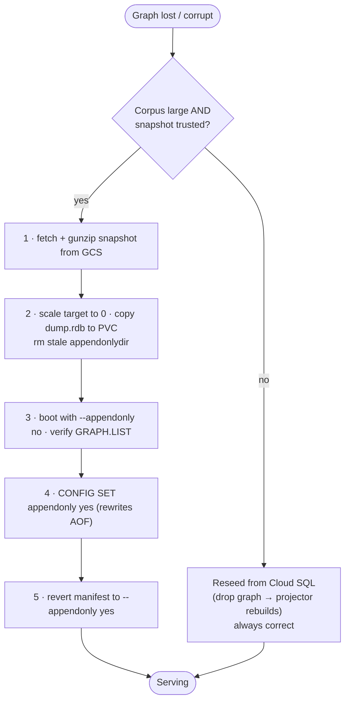

# FalkorDB DR Runbook

> **At a glance.** The on-call procedure for backing up and recovering the FalkorDB graph
> layer — verifying the backup CronJob, restoring an RDB snapshot (single-instance and
> cluster), reseeding from Cloud SQL, and surviving region loss. Read the invariant below
> first; it changes what "recovery" even means here.

Companion to [INFRASTRUCTURE_LAUNCH_SCALE.md](./INFRASTRUCTURE_LAUNCH_SCALE.md) §8 and the
architecture spec in [FalkorDB Deployment](/docs/falkordb-deployment). The backup mechanism
itself is `deploy/k8s/overlays/production/resources/falkordb-dr-backup.yaml`.

## The invariant (read this before restoring anything)

> **Important:** **DR never treats FalkorDB as data.** Every graph is a projection that
> rebuilds from Cloud SQL. If a snapshot and Cloud SQL disagree, **Cloud SQL wins and the
> graph is reseeded.** RDB snapshots exist only to *shorten* a rebuild (RTO) — the
> effective RPO is Cloud SQL's, not the snapshot's. If you are ever unsure a snapshot is
> consistent, **don't restore it — reseed.** Restoring is an optimization, never a
> correctness step.

## What the CronJob does

- Every 6h, one pod per backup target (Indexed Job).
- `redis-cli --rdb` issues a SYNC: the server forks and streams a consistent RDB over
  the wire (same fork cost as `BGSAVE`; no PVC access needed — the RWO volume is
  attached to the FalkorDB pod and can't be mounted elsewhere).
- The stream is gzipped inline, so only the compressed image is staged
  (~3× smaller; measured 2.6 GB → 864 MB on a real graph corpus).
- Uploaded to `gs://$FALKORDB_BACKUP_BUCKET/falkordb/YYYY/MM/DD/<host>-<ts>.rdb.gz`.
- **Cluster:** each pod snapshots its shard's **replica**, not the master — forking a
  40 GB master under live load costs copy-on-write memory exactly when it can least
  afford it. If a replica is down, that shard's run **fails and alerts** rather than
  silently forking the master.

Retention is a **GCS lifecycle rule** (e.g. delete objects > 30 days), not script-side
pruning — it cannot silently break.

## Verify backups are actually happening

```bash
kubectl -n synodic get cronjob falkordb-dr-backup
kubectl -n synodic get jobs -l app.kubernetes.io/name=falkordb-dr-backup
kubectl -n synodic logs job/<job-name> -c snapshot     # snapshot size
kubectl -n synodic logs job/<job-name> -c upload       # gs:// destination listing
gcloud storage ls -l "gs://$FALKORDB_BACKUP_BUCKET/falkordb/$(date -u +%Y/%m/%d)/"
```

A run that produced an empty snapshot fails the Job on purpose (a truncated RDB that
uploads successfully is worse than a missing one).

## Restore

> Restore only shortens a rebuild. The safe default is **reseed from Cloud SQL**.
> Restore when the corpus is large enough that a full reseed's RTO is unacceptable.



FalkorDB loads `dump.rdb` at boot **only when AOF is off** — with `appendonly yes` it
loads the AOF and ignores the RDB entirely. So a restore is: place the RDB, boot once
with AOF disabled, then turn AOF back on (which rewrites the AOF from the loaded
dataset).

### 1. Fetch and decompress the snapshot

```bash
gcloud storage cp "gs://$FALKORDB_BACKUP_BUCKET/falkordb/2026/07/12/<host>-<ts>.rdb.gz" .
gunzip <host>-<ts>.rdb.gz
```

### 2. Scale the target down and place the file on its PVC

```bash
# Single instance:            kubectl -n synodic scale statefulset falkordb --replicas=0
# Cluster (one shard at a time): kubectl -n synodic scale statefulset falkordb-shard-1 --replicas=0
```

The PVC can't be mounted while the pod runs, so copy the file in with a throwaway pod
that mounts the same claim:

```bash
kubectl -n synodic run rdb-restore --rm -it --restart=Never \
  --image=busybox:1.36 \
  --overrides='{"spec":{"containers":[{"name":"rdb-restore","image":"busybox:1.36",
    "command":["sh"],"stdin":true,"tty":true,
    "volumeMounts":[{"name":"d","mountPath":"/data"}]}],
    "volumes":[{"name":"d","persistentVolumeClaim":{"claimName":"falkordb-data-falkordb-0"}}]}}'
# in another shell:
kubectl -n synodic cp <host>-<ts>.rdb rdb-restore:/data/dump.rdb
```

Also remove the stale AOF so it cannot win over the RDB:

```bash
# inside the restore pod
rm -rf /data/appendonlydir
```

### 3. Boot once with AOF off, then re-enable

Temporarily set `--appendonly no` in the StatefulSet's `REDIS_ARGS`, scale to 1, and
confirm the dataset loaded:

```bash
kubectl -n synodic exec falkordb-0 -- redis-cli GRAPH.LIST | head
kubectl -n synodic exec falkordb-0 -- redis-cli INFO keyspace
```

Then re-enable AOF **without a restart** (this rewrites the AOF from the loaded data):

```bash
kubectl -n synodic exec falkordb-0 -- redis-cli CONFIG SET appendonly yes
kubectl -n synodic exec falkordb-0 -- redis-cli INFO persistence | grep aof_rewrite_in_progress
```

Finally revert the manifest change (`--appendonly yes`) so the next reschedule is
correct. **Do not skip this** — a pod that reschedules with `appendonly yes` and no
`appendonlydir` boots **empty** (see `FALKORDB_DEPLOYMENT.md` §5c).

### 4. Cluster-specific

- Restore **one shard at a time**; the other two keep serving (`cluster-require-full-coverage no`).
- Restore into the shard that owns those slots — a graph key lives entirely on one
  shard, and slot ownership is `keyslot(graph_name)`. Restoring a shard's RDB onto the
  wrong shard yields keys nobody routes to.
- After the master is back, let the replica resync from it (it will, automatically);
  do not restore the replica separately.

### 5. Reseed instead (the default path)

If the snapshot is old, suspect, or the corpus is small enough: drop the graph and let
the projector rebuild it from Cloud SQL. This is always correct by the invariant above.

## Region loss

Snapshots are in a **multi-region** bucket, so they survive a regional outage. Recovery
is: promote the Cloud SQL cross-region replica, stand up the cluster in the secondary
region, then either restore the RDBs (fast path) or reseed the hot graphs directly.
[FalkorDB Deployment §6](/docs/falkordb-deployment) covers the cold-standby manifests.
