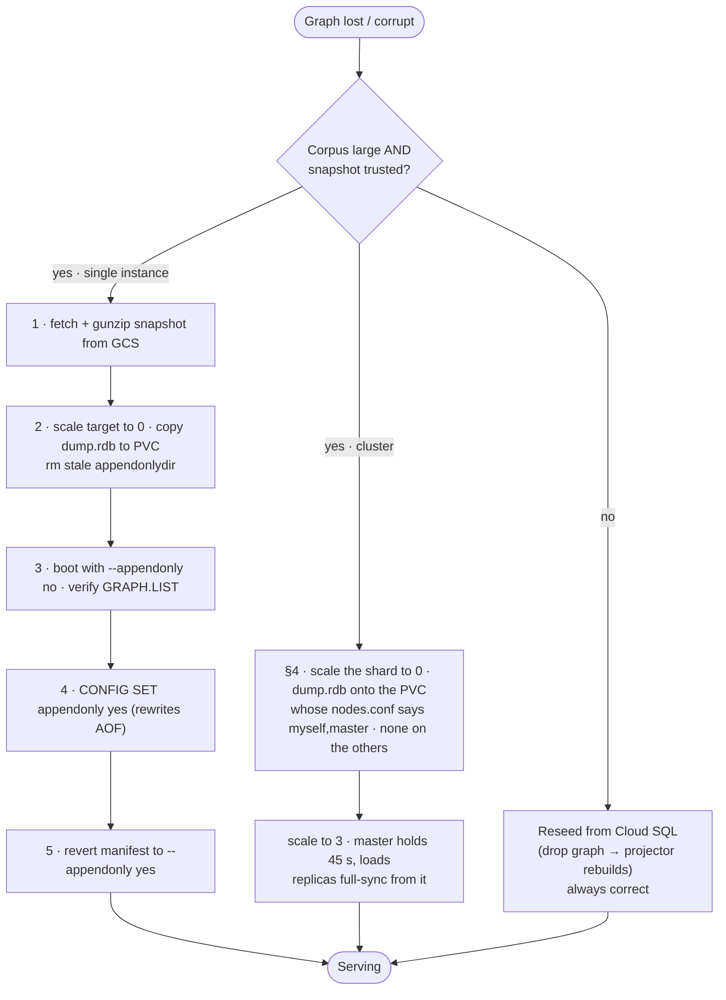

# FalkorDB DR Runbook

> **At a glance.** The on-call procedure for backing up and recovering the FalkorDB graph
> layer — verifying the backup CronJob, restoring an RDB snapshot (single-instance and
> cluster), reseeding from Cloud SQL, and surviving region loss. Read the invariant below
> first; it changes what "recovery" even means here.

Companion to [INFRASTRUCTURE_LAUNCH_SCALE.md](./INFRASTRUCTURE_LAUNCH_SCALE.md) §8 and the
architecture spec in [FalkorDB Deployment](/docs/falkordb-deployment). The backup mechanism
itself is `deploy/k8s/overlays/production/resources/falkordb-dr-backup.yaml`.

## The invariant (read this before restoring anything)

> **Important:** **DR never treats FalkorDB as data.** Every graph is a projection that
> rebuilds from Cloud SQL. If a snapshot and Cloud SQL disagree, **Cloud SQL wins and the
> graph is reseeded.** RDB snapshots exist only to *shorten* a rebuild (RTO) — the
> effective RPO is Cloud SQL's, not the snapshot's. If you are ever unsure a snapshot is
> consistent, **don't restore it — reseed.** Restoring is an optimization, never a
> correctness step.

## What the CronJob does

- Every 6h, one pod per backup target (Indexed Job).
- `redis-cli --rdb` issues a SYNC: the server forks and streams a consistent RDB over
  the wire (same fork cost as `BGSAVE`; no PVC access needed — the RWO volume is
  attached to the FalkorDB pod and can't be mounted elsewhere).
- The stream is gzipped inline, so only the compressed image is staged
  (~3× smaller; measured 2.6 GB → 864 MB on a real graph corpus).
- Uploaded to `gs://$FALKORDB_BACKUP_BUCKET/falkordb/YYYY/MM/DD/<host>-<ts>.rdb.gz`.
  On the cluster, `<host>` is whichever pod of the shard served the snapshot: `-0`, `-1`
  or `-2`. The pod name still identifies the shard.
- **Cluster:** each pod snapshots one of its shard's **replicas**, never the master.
  Forking a loaded master under live traffic costs copy-on-write memory exactly when it
  can least afford it.
  - Each shard's target is a candidate list, `falkordb-shard-N-1|-0|-2`: the no-read
    standbys first, the read replica last, because it may be frozen behind a long read.
  - The script reads each candidate's live `INFO` and SYNCs the first one that is a
    replica (`FALKORDB_BACKUP_REPLICA_ONLY=1`), has its link up, is not loading and is
    not already forking.
  - It logs why it skipped each of the others.
  - The role is read, never inferred from the ordinal: after a failover, any ordinal can
    be the master.
  - If **no** replica of the shard is eligible, that shard's run **fails and alerts**,
    listing every reason, rather than forking the master.

Retention is a **GCS lifecycle rule** (e.g. delete objects > 30 days), not script-side
pruning — it cannot silently break.

## Verify backups are actually happening

```bash
kubectl -n synodic get cronjob falkordb-dr-backup
kubectl -n synodic get jobs -l app.kubernetes.io/name=falkordb-dr-backup
kubectl -n synodic logs job/<job-name> -c snapshot     # snapshot size
kubectl -n synodic logs job/<job-name> -c upload       # gs:// destination listing
gcloud storage ls -l "gs://$FALKORDB_BACKUP_BUCKET/falkordb/$(date -u +%Y/%m/%d)/"
```

A run whose stream fails part-way fails the Job on purpose: a truncated RDB that uploads
successfully is worse than a missing one. The guard is `set -o pipefail` on the
`redis-cli --rdb | gzip` pipe. The size check beside it cannot catch this alone,
because an empty gzip is 20 bytes.

## Restore

> Restore only shortens a rebuild. The safe default is **reseed from Cloud SQL**.
> Restore when the corpus is large enough that a full reseed's RTO is unacceptable.

The two topologies persist differently, so they restore differently:

| | Single instance (`overlays/production`, base StatefulSet) | Cluster (`overlays/production-cluster`) |
|---|---|---|
| Persistence | AOF (`--appendonly yes`) | RDB only (`--appendonly no`, `--shutdown-on-sigterm save`) |
| PVC | `falkordb-data-falkordb-0` | `falkordb-data-falkordb-shard-N-M` (shard N, ordinal M; 9 claims) |
| Redis data directory | **not** the PVC — the image default `/var/lib/falkordb/data` on the container layer (known gap) | `/data`, the PVC (`FALKORDB_DATA_PATH=/data`) |
| Procedure | Steps 1–3 below | [§4 Cluster](#4-cluster) |


```mermaid
flowchart TD
    START(["Graph lost / corrupt"]) --> Q{"Corpus large AND<br/>snapshot trusted?"}
    Q -->|"no"| RESEED["Reseed from Cloud SQL<br/>(drop graph → projector rebuilds)<br/>always correct"]
    Q -->|"yes · single instance"| F1["1 · fetch + gunzip snapshot from GCS"]
    F1 --> F2["2 · scale target to 0 · copy dump.rdb to PVC<br/>rm stale appendonlydir"]
    F2 --> F3["3 · boot with --appendonly no · verify GRAPH.LIST"]
    F3 --> F4["4 · CONFIG SET appendonly yes (rewrites AOF)"]
    F4 --> F5["5 · revert manifest to --appendonly yes"]
    F5 --> DONE(["Serving"])
    Q -->|"yes · cluster"| C1["§4 · scale the shard to 0 · dump.rdb onto the PVC<br/>whose nodes.conf says myself,master · none on the others"]
    C1 --> C2["scale to 3 · master holds 45 s, loads<br/>replicas full-sync from it"]
    C2 --> DONE
    RESEED --> DONE
```

**Single instance.** FalkorDB loads `dump.rdb` at boot **only when AOF is off**. With
`appendonly yes` it loads the AOF and ignores the RDB entirely. So a single-instance
restore is:

1. Place the RDB.
2. Boot once with AOF disabled.
3. Turn AOF back on, which rewrites the AOF from the loaded dataset.

> **Warning (single-instance known gap).** The steps below put `dump.rdb` on the PVC at
> `/data`. On the shipped base StatefulSet, Redis does not read from there.
>
> * **Why.** The image's `run.sh` passes `--dir "$FALKORDB_DATA_PATH"`, and that defaults to
>   `/var/lib/falkordb/data` on the container layer. So `CONFIG GET dir` does not return
>   `/data`, and a file placed on the PVC is never loaded.
> * **What it costs today.** The AOF lives on the container layer too, so a pod restart
>   already comes back empty.
> * **Check first.** Run `kubectl -n synodic exec falkordb-0 -- redis-cli CONFIG GET dir`.
>   * If it returns `/data`, continue with step 1.
>   * If it does not, add `FALKORDB_DATA_PATH=/data` to the StatefulSet's env in step 3
>     (keep it afterwards; it is the permanent fix, and the production-cluster overlay
>     ships it), or reseed instead.

### 1. Fetch and decompress the snapshot

```bash
gcloud storage cp "gs://$FALKORDB_BACKUP_BUCKET/falkordb/2026/07/12/<host>-<ts>.rdb.gz" .
gunzip <host>-<ts>.rdb.gz
```

### 2. Single instance: scale down and place the file on its PVC

```bash
kubectl -n synodic scale statefulset falkordb --replicas=0
```

The PVC can't be mounted while the pod runs, so copy the file in with a throwaway pod
that mounts the same claim:

```bash
kubectl -n synodic run rdb-restore --rm -it --restart=Never \
  --image=busybox:1.36 \
  --overrides='{"spec":{"containers":[{"name":"rdb-restore","image":"busybox:1.36",
    "command":["sh"],"stdin":true,"tty":true,
    "volumeMounts":[{"name":"d","mountPath":"/data"}]}],
    "volumes":[{"name":"d","persistentVolumeClaim":{"claimName":"falkordb-data-falkordb-0"}}]}}'
# in another shell:
kubectl -n synodic cp <host>-<ts>.rdb rdb-restore:/data/dump.rdb
```

Also remove the stale AOF so it cannot win over the RDB:

```bash
# inside the restore pod
rm -rf /data/appendonlydir
```

### 3. Single instance: boot once with AOF off, then re-enable

Temporarily set `--appendonly no` in the StatefulSet's `REDIS_ARGS`, scale to 1, and
confirm the dataset loaded:

```bash
kubectl -n synodic exec falkordb-0 -- redis-cli GRAPH.LIST | head
kubectl -n synodic exec falkordb-0 -- redis-cli INFO keyspace
```

Then re-enable AOF **without a restart** (this rewrites the AOF from the loaded data):

```bash
kubectl -n synodic exec falkordb-0 -- redis-cli CONFIG SET appendonly yes
kubectl -n synodic exec falkordb-0 -- redis-cli INFO persistence | grep aof_rewrite_in_progress
```

Finally revert the manifest change (`--appendonly yes`) so the next reschedule is
correct. **Do not skip this** — a pod that reschedules with `appendonly yes` and no
`appendonlydir` boots **empty** (see `FALKORDB_DEPLOYMENT.md` §5c).

### 4. Cluster

The cluster runs **without AOF**. Each shard pod's data directory is `/data` on its own
PVC, and a node loads `/data/dump.rdb` at boot. So there is no AOF to remove and no
manifest to change. The restore is: put the snapshot on the PVC of the node that will
come back as master, and remove the RDB from the other two.

- Restore **one shard at a time**; the other two keep serving (`cluster-require-full-coverage no`).
- Restore into the shard that owns those slots — a graph key lives entirely on one
  shard, and slot ownership is `keyslot(graph_name)`. Restoring a shard's RDB onto the
  wrong shard yields keys nobody routes to. Find the shard with
  `redis-cli -h falkordb-shard-0-0.falkordb-cluster.synodic.svc.cluster.local cluster keyslot <graph>`
  and `cluster nodes`.

1. **Scale the shard down,** and wait until all three pods are gone:

   ```bash
   kubectl -n synodic scale statefulset falkordb-shard-1 --replicas=0
   kubectl -n synodic get pods -l app.kubernetes.io/name=falkordb-shard-1 -w
   ```

   Each pod saves its RDB on the way out, and its master runs the `preStop` hand-over, so
   roles may shuffle as the pods stop. That is why the next step reads them from disk. The
   grace period is 300 s.

2. **Find the master on disk.** Mount each claim in turn with the throwaway pod from step 2,
   changing only `claimName` to `falkordb-data-falkordb-shard-1-0`, `-1`, `-2`. In each one,
   run:

   ```bash
   grep myself /data/nodes.conf      # field 3: flags; field 7: config epoch; fields 9+: slots
   ```

   The node to restore onto is the one whose line says `myself,master` **with slot ranges**.
   If two say master, the higher config epoch (field 7) is the real one; treat the other as a
   replica.

3. **Place the files.**
   - On the master's claim:
     `kubectl -n synodic cp <host>-<ts>.rdb rdb-restore:/data/dump.rdb`, then
     `rm -f /data/temp-*.rdb`.
   - On the other two claims: `rm -f /data/dump.rdb /data/temp-*.rdb`.
   - Leave every `nodes.conf` alone. It is the node's cluster identity and slot ownership.

4. **Scale back up:**

   ```bash
   kubectl -n synodic scale statefulset falkordb-shard-1 --replicas=3
   ```

   - The master's `nodes.conf` says `myself,master` with slots, so it **holds 45 s** before
     starting (`holding 45s` in its log). That is the startup hold that protects a crashed
     master. It then loads the restored `dump.rdb`, logging `DB loaded from disk`, and takes
     its slots back.
   - The two replicas start empty and **full-sync from it**.
   - A replica that has not yet connected to its master since it started cannot win an
     automatic failover. Its data age fails Redis's `cluster-replica-validity-factor` check.
     So neither replica can take the slots while the master holds. This is from the Redis
     8.6.3 source, and was not drilled.

5. **Verify:**

   ```bash
   kubectl -n synodic exec <master pod> -- redis-cli GRAPH.LIST | head
   kubectl -n synodic exec <master pod> -- redis-cli INFO keyspace
   kubectl -n synodic exec <each replica> -- redis-cli INFO replication | grep master_link_status   # up
   kubectl -n synodic exec <master pod> -- redis-cli cluster info | grep cluster_state           # ok
   ```

   Then check that `falkordb-shard-1-2` is a replica (`redis-cli role`). It is the app's read
   replica. If it came back as master, run `redis-cli cluster failover` on the shard's other
   replica.

- Do not restore a replica separately; replicas always full-sync from the restored master.
- **Do not use `DUMP`/`RESTORE` (or `MIGRATE … REPLACE`) to copy a graph into an instance
  that already holds a graph of that name.** On FalkorDB 4.20.6 the decoder resolves the
  graph by the name inside the payload. It decoded into the live graph, doubling it, and the
  next write deadlocked the server. Reproduced twice. `RESTORE` into an instance with no graph
  of that name worked.

### 5. Reseed instead (the default path)

If the snapshot is old, suspect, or the corpus is small enough: drop the graph and let
the projector rebuild it from Cloud SQL. This is always correct by the invariant above.

## Region loss

Snapshots are in a **multi-region** bucket, so they survive a regional outage. Recovery
is: promote the Cloud SQL cross-region replica, stand up the cluster in the secondary
region, then either restore the RDBs (fast path) or reseed the hot graphs directly.
[FalkorDB Deployment §6](/docs/falkordb-deployment) covers the cold-standby manifests.
