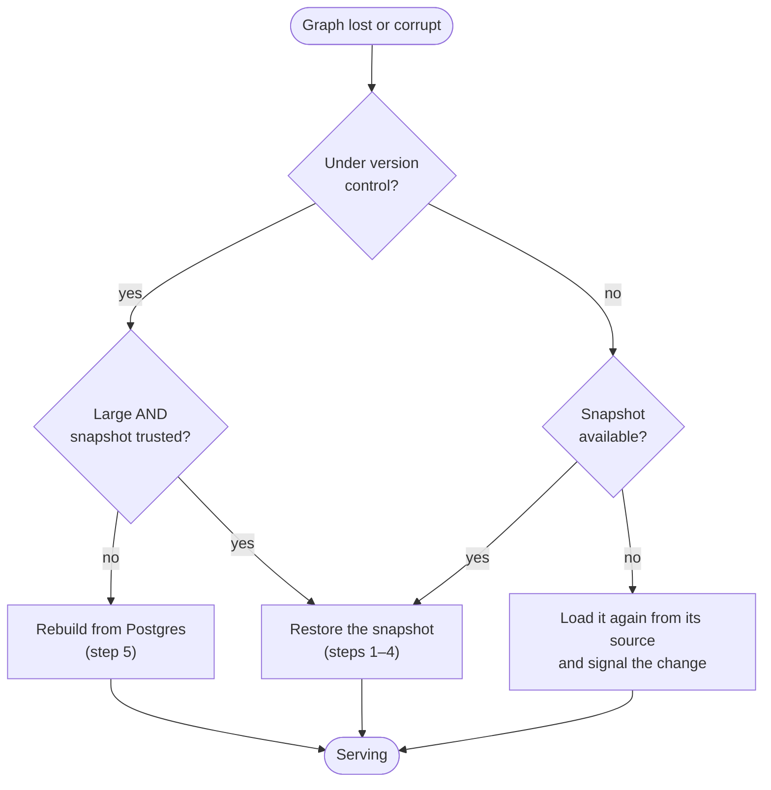

# FalkorDB DR Runbook

*For platform operators.*

Back up and recover the FalkorDB graph store on Kubernetes: check that the backup CronJob is
working, restore a snapshot (single instance or cluster), rebuild from Postgres, and survive
the loss of a region. Read [what can be rebuilt](#the-invariant-read-this-before-restoring-anything)
first — it decides which recovery applies to each graph.

Companion to [Infrastructure: Launch Scale §8](/docs/infra-launch-scale#8-disaster-recovery)
and the architecture in [FalkorDB Deployment](/docs/falkordb-deployment). The backup mechanism
itself is `deploy/k8s/overlays/production/resources/falkordb-dr-backup.yaml`. On Docker
Compose, the graph store is one of the volumes `./deploy.sh backup` archives — see
[Recover the graph store](/docs/runbooks#recover-the-graph-store).

## The invariant (read this before restoring anything)

> **Important:** Postgres is the source of truth only for **sources under version control**.
> Enabling version control copies a source's graph into the versioned store in Postgres; from
> then on FalkorDB holds a projection of it that can be dropped and rebuilt from Postgres at any
> time. Every other source — loaded by a connector, an import or an ETL job — exists **only**
> in FalkorDB and in the system it was loaded from.

| Source | Lives in | Recover it by |
|---|---|---|
| Under version control | Postgres (the versioned store); FalkorDB holds a rebuildable projection | Rebuilding from Postgres. If a snapshot and Postgres disagree, **Postgres wins** and the graph is rebuilt |
| Loaded directly | FalkorDB, and the upstream system it came from | Restoring a snapshot, or loading it again from the upstream system and signalling the change |

What that means for recovery:

- For a **version-controlled** source, a snapshot only *shortens* the rebuild (RTO); the
  effective RPO is Postgres's. If you're unsure a snapshot is consistent, don't restore it —
  rebuild. Restoring is an optimisation, never a correctness step.
- For a **directly loaded** source, the snapshot is the only copy short of the upstream
  system, so its RPO is the snapshot interval (six hours) unless that system can deliver the
  data again. A suspect snapshot can still beat nothing: restore it, then reload what the
  upstream system can re-deliver.

## What the CronJob does

- Every 6h, one pod per backup target (Indexed Job).
- `redis-cli --rdb` issues a SYNC: the server forks and streams a consistent RDB over the wire
  (same fork cost as `BGSAVE`; no volume access needed — the volume is attached to the
  FalkorDB pod and can't be mounted elsewhere).
- The stream is gzipped inline, so only the compressed image is staged (about 3× smaller;
  measured 2.6 GB → 864 MB on a real graph corpus).
- Uploaded to `gs://$FALKORDB_BACKUP_BUCKET/falkordb/YYYY/MM/DD/<host>-<ts>.rdb.gz`.
- **Cluster:** each pod snapshots its shard's **replica**, not the master — forking a busy
  master under live load costs copy-on-write memory exactly when it can least afford it. If a
  replica is down, that shard's run **fails and alerts** rather than silently forking the
  master.

Retention is a **GCS lifecycle rule** (for example, delete objects older than 30 days), not
script-side pruning — it can't silently break.

## Verify backups are actually happening

```bash
kubectl -n synodic get cronjob falkordb-dr-backup
kubectl -n synodic get jobs -l app.kubernetes.io/name=falkordb-dr-backup
kubectl -n synodic logs job/<job-name> -c snapshot     # snapshot size
kubectl -n synodic logs job/<job-name> -c upload       # gs:// destination listing
gcloud storage ls -l "gs://$FALKORDB_BACKUP_BUCKET/falkordb/$(date -u +%Y/%m/%d)/"
```

A run that produced an empty snapshot fails the Job on purpose (a truncated RDB that uploads
successfully is worse than a missing one).

## Restore

> **Before you start:** these steps put the snapshot on the FalkorDB volume, so the volume has
> to be mounted at the image's data directory, `/var/lib/falkordb/data`. The kustomize
> manifests mount it at `/data` — apply
> [Keep FalkorDB's data on its volume](/docs/kubernetes#keep-falkordbs-data-on-its-volume)
> first, or the restored file is never read.

Choose per source, by the table above. For a version-controlled source, rebuilding from
Postgres is the safe default; restore when the graph is large enough that a rebuild takes too
long. For a directly loaded source, a snapshot — or loading it again — is the only way back.


```mermaid
flowchart TB
    START(["Graph lost or corrupt"]) --> V{"Under version<br/>control?"}
    V -->|"yes"| Q{"Large AND<br/>snapshot trusted?"}
    Q -->|"no"| REBUILD["Rebuild from Postgres<br/>(step 5)"]
    Q -->|"yes"| RESTORE["Restore the snapshot<br/>(steps 1–4)"]
    V -->|"no"| S{"Snapshot<br/>available?"}
    S -->|"yes"| RESTORE
    S -->|"no"| RELOAD["Load it again from its source<br/>and signal the change"]
    RESTORE --> DONE(["Serving"])
    REBUILD --> DONE
    RELOAD --> DONE
```

FalkorDB loads `dump.rdb` at boot **only when AOF is off** — with `appendonly yes` it loads the
AOF and ignores the RDB entirely. So a restore is: place the RDB, boot once with AOF disabled,
then turn AOF back on (which rewrites the AOF from the loaded dataset).

### 1. Fetch and decompress the snapshot

```bash
gcloud storage cp "gs://$FALKORDB_BACKUP_BUCKET/falkordb/2026/07/12/<host>-<ts>.rdb.gz" .
gunzip <host>-<ts>.rdb.gz
```

### 2. Scale the target down and place the file on its PVC

```bash
# Single instance:            kubectl -n synodic scale statefulset falkordb --replicas=0
# Cluster (one shard at a time): kubectl -n synodic scale statefulset falkordb-shard-1 --replicas=0
```

The PVC can't be mounted while the pod runs, so copy the file in with a throwaway pod that
mounts the same claim:

```bash
kubectl -n synodic run rdb-restore --rm -it --restart=Never \
  --image=busybox:1.36 \
  --overrides='{"spec":{"containers":[{"name":"rdb-restore","image":"busybox:1.36",
    "command":["sh"],"stdin":true,"tty":true,
    "volumeMounts":[{"name":"d","mountPath":"/data"}]}],
    "volumes":[{"name":"d","persistentVolumeClaim":{"claimName":"falkordb-data-falkordb-0"}}]}}'
# in another shell:
kubectl -n synodic cp <host>-<ts>.rdb rdb-restore:/data/dump.rdb
```

Also remove the stale AOF so it can't win over the RDB:

```bash
# inside the restore pod
rm -rf /data/appendonlydir
```

### 3. Boot once with AOF off, then re-enable

Temporarily set `--appendonly no` in the StatefulSet's `REDIS_ARGS`, scale to 1, and confirm
the dataset loaded:

```bash
kubectl -n synodic exec falkordb-0 -- redis-cli GRAPH.LIST | head
kubectl -n synodic exec falkordb-0 -- redis-cli INFO keyspace
```

Then re-enable AOF **without a restart** (this rewrites the AOF from the loaded data):

```bash
kubectl -n synodic exec falkordb-0 -- redis-cli CONFIG SET appendonly yes
kubectl -n synodic exec falkordb-0 -- redis-cli INFO persistence | grep aof_rewrite_in_progress
```

Finally revert the manifest change (`--appendonly yes`) so the next reschedule is correct.
**Don't skip this** — a pod that reschedules with `appendonly yes` and no `appendonlydir` boots
**empty** (see
[FalkorDB Deployment §5c](/docs/falkordb-deployment#5c-engine-version-upgrades-reload-from-rdb-not-aof)).

Then bring each restored graph up to date:

- **Version-controlled sources** — open a view of the source and run **Check sync** on the
  **Data health** tab of its versioning panel. If it finds differences, Postgres wins: use
  **Rebuild fast read layer**.
- **Directly loaded sources** — load again whatever changed after the snapshot was taken,
  then signal the change
  ([Tell the platform a source changed](/docs/runbooks#tell-the-platform-a-source-changed)).

### 4. Cluster-specific

- Restore **one shard at a time**; the other two keep serving (`cluster-require-full-coverage no`).
- Restore into the shard that owns those slots — a graph key lives entirely on one shard, and
  slot ownership is `keyslot(graph_name)`. Restoring a shard's RDB onto the wrong shard yields
  keys nobody routes to.
- After the master is back, let the replica resync from it (it will, automatically); don't
  restore the replica separately.

### 5. Rebuild instead of restoring

- **Version-controlled source** — if the snapshot is old or suspect, or the graph is small
  enough: open a view of the source and use **Rebuild fast read layer** on the **Data health**
  tab of its versioning panel (shown to people who manage the source). It drops the graph,
  seeds it again from Postgres and queues its rollups. This is always correct, by the
  invariant above.
- **Directly loaded source** — there's nothing in Postgres to rebuild from. Run the loader or
  import again, then signal the change so caches and rollups catch up
  ([Tell the platform a source changed](/docs/runbooks#tell-the-platform-a-source-changed)).

## Region loss

Snapshots are in a **multi-region** bucket, so they survive a regional outage. Recovery is:
promote the Cloud SQL cross-region replica, stand up the cluster in the secondary region, then
restore the snapshots (the fast path) or rebuild the version-controlled sources from the
promoted database. Directly loaded sources come back only from the snapshots or by loading
them again. [FalkorDB Deployment §6](/docs/falkordb-deployment#6-disaster-recovery-cross-region)
covers the cold-standby manifests.

## Where to next

- [Runbooks](/docs/runbooks) — the other recovery and maintenance procedures.
- [Deploying on Kubernetes](/docs/kubernetes#run-falkordb-on-kubernetes) — where the graph store runs and how it's configured.
- [FalkorDB Deployment](/docs/falkordb-deployment) — sizing, durability and engine upgrades.
