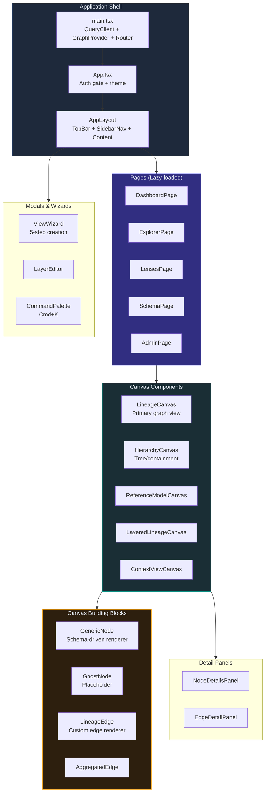
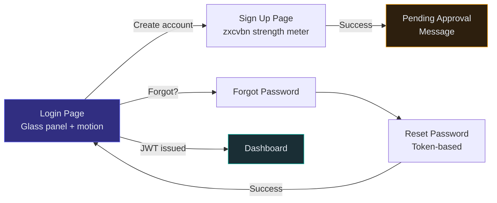
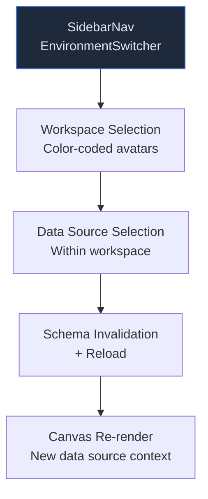
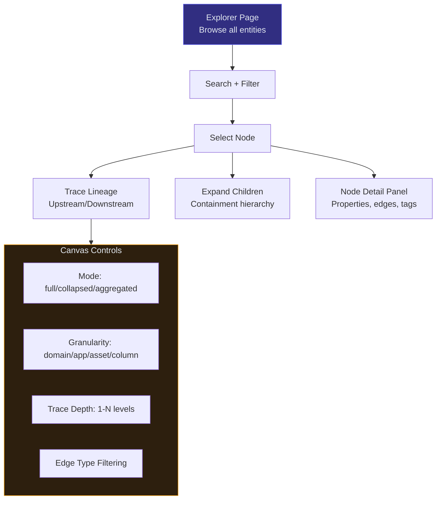
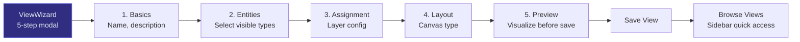
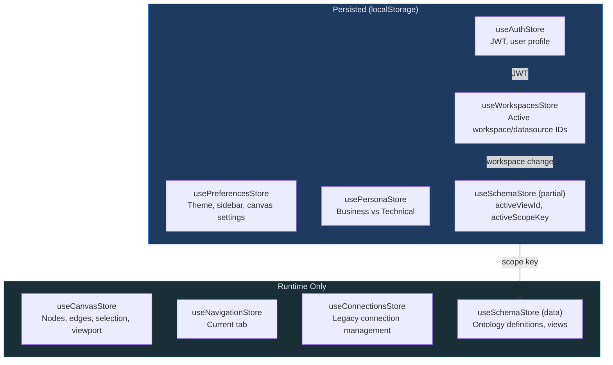
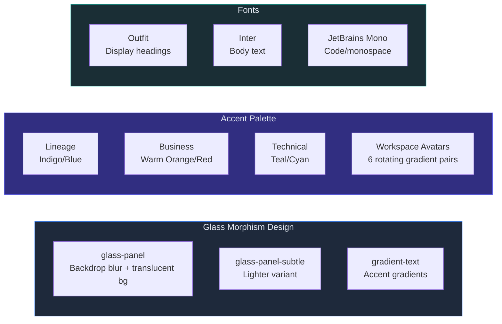
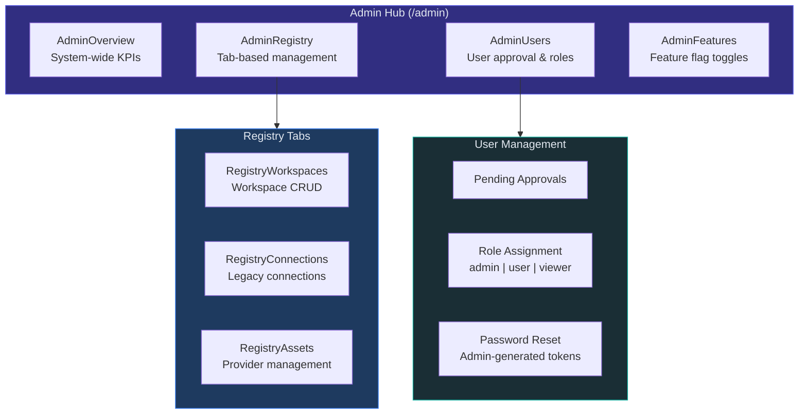
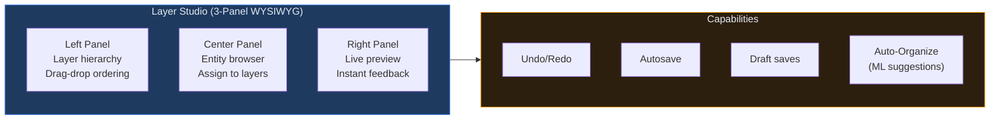

# Frontend & UX Documentation

## Overview

The Synodic frontend is a **React 19** single-page application built with **Vite**, **TypeScript**, **Tailwind CSS**, and **Zustand** for state management. It provides a rich graph visualization experience powered by **@xyflow/react** with layout computation offloaded to **Web Workers** (ELK.js).

---

## 1. Technology Stack

| Technology | Version | Purpose |
|-----------|---------|---------|
| React | 19.0.0 | UI framework (Suspense, concurrent features) |
| Vite | 6.0.5 | Bundler with HMR |
| TypeScript | 5.7.2 | Type safety |
| Tailwind CSS | 3.4.17 | Utility-first styling with dark mode |
| Zustand | - | Lightweight state management |
| @xyflow/react | 12.10.0 | Graph visualization canvas |
| ELK.js | 0.11.0 | Hierarchical graph layout (Web Worker) |
| Dagre | 0.8.5 | DAG layout |
| Radix UI | - | Accessible component primitives |
| Framer Motion | 11.15.0 | Animations and transitions |
| Lucide React | 0.468.0 | SVG icon library |
| TanStack React Query | v5 | Server state management |
| React Router DOM | 7.13.1 | Client-side routing |

---

## 2. Component Architecture



### Key Design Patterns

1. **Schema-Driven Rendering:** `GenericNode` handles all entity types dynamically -- visual properties (color, icon, shape) come from ontology definitions via `useSchemaStore`, not hardcoded per type.

2. **Provider Pattern:** `GraphProviderContext` wraps the entire app, providing workspace-aware graph data access through `RemoteGraphProvider`.

3. **Lazy Loading:** All route-level pages use React's `lazy()` + `Suspense` for code splitting. Heavy dependencies (MockProvider ~113kB, zxcvbn) are loaded on demand.

4. **Web Worker Layout:** ELK layout computation runs in `elk-layout.worker.ts` to keep the UI thread responsive for large graphs.

---

## 3. User Flows

### Authentication Flow



### Workspace & Data Source Navigation



**Workspace scoping:** Navigation is workspace-aware. Changing workspaces or data sources triggers:
1. `useWorkspacesStore` updates active IDs
2. `useSchemaStore.setActiveScopeKey()` invalidates ontology cache
3. `GraphProvider` creates new `RemoteGraphProvider({ workspaceId })`
4. Canvas re-renders with new graph data

### Graph Exploration Flow



**Canvas interactions:**
- **Right-click:** Context menu for node/edge actions
- **Double-click node label:** Inline editing
- **Double-click canvas / Cmd+N:** Quick create
- **Cmd+K:** Command palette
- **Minimap, grid, snap-to-grid:** Toggle via toolbar

### View Management Flow



**View scoping:** Views are scoped to `{workspaceId}/{dataSourceId}`. Bookmarks and recent views provide cross-workspace access.

---

## 4. State Management

### Zustand Store Architecture



| Store | Key State | Persistence | Update Pattern |
|-------|-----------|-------------|----------------|
| `useAuthStore` | JWT token, user object, login/logout | localStorage | Login/logout actions |
| `useWorkspacesStore` | Workspace list, active workspace/datasource IDs | Active IDs only | Workspace switch |
| `useSchemaStore` | Ontology definitions, entity/relationship types, views | UI state only | Scope key change |
| `useCanvasStore` | Graph nodes, edges, selection, viewport, trace state | Viewport + activeLensId | Graph operations |
| `usePreferencesStore` | Theme (light/dark/system), sidebar, grid, minimap | All preferences | User toggles |
| `usePersonaStore` | Business vs Technical mode | User preference | Persona toggle |
| `useNavigationStore` | Current tab (dashboard/explore/lenses/schema) | None | Route sync |
| `useConnectionsStore` | Legacy connection management | Active ID only | Legacy flow |

**Cross-store coordination:**
- `useWorkspacesStore` calls `useSchemaStore.setActiveScopeKey()` on workspace change
- `GraphProvider` loads workspaces & connections on mount via both stores
- `AppLayout` syncs React Router location with `useRouteSync()` hook

**Performance techniques:**
- `partialize` middleware controls what gets persisted
- Selector hooks for granular subscriptions (`useNodes()`, `useSelectedNodes()`)
- No-op writes: stores compare state before updating to prevent unnecessary renders
- Atomic batch updates: `setGraph(nodes, edges)` prevents flash-of-no-edges
- `_nodeIndex` / `_edgeIndex` Sets for O(1) deduplication

---

## 5. Data Fetching

### API Client

**File:** `frontend/src/services/apiClient.ts`

`authFetch()` wraps native `fetch()` with:
- Automatic JWT Bearer token injection from `useAuthStore`
- 401 handling: auto-logout on token expiry
- JSON error parsing with fallback to status text

### Service Modules

| Service | File | API Base |
|---------|------|----------|
| `authService` | `services/authService.ts` | `/api/v1/auth/*` |
| `workspaceService` | `services/workspaceService.ts` | `/api/v1/admin/workspaces` |
| `connectionService` | `services/connectionService.ts` | `/api/v1/connections` (legacy) |
| `viewApiService` | `services/viewApiService.ts` | `/api/v1/views` |
| `contextModelService` | `services/contextModelService.ts` | `/api/v1/{ws_id}/context-models` |
| `ontologyDefinitionService` | `services/ontologyDefinitionService.ts` | `/api/v1/admin/ontologies` |
| `catalogService` | `services/catalogService.ts` | `/api/v1/admin/catalog` |
| `providerService` | `services/providerService.ts` | `/api/v1/admin/providers` |
| `adminUserService` | `services/adminUserService.ts` | `/api/v1/admin/users` |
| `featuresService` | `services/featuresService.ts` | `/api/v1/admin/features` |

### Graph Provider

**File:** `frontend/src/providers/RemoteGraphProvider.tsx`

`RemoteGraphProvider({ workspaceId? })` abstracts backend graph API:
- Path-based workspace routing: `/v1/{wsId}/graph/...`
- Fallback to legacy `?connectionId=` params
- Methods: `getStats()`, `getNode(urn)`, `getChildren(urn)`, `getFullLineage(urn, depth)`, `searchNodes(query)`
- Falls back to MockProvider if backend unreachable

### React Query Configuration

```typescript
const queryClient = new QueryClient({
  defaultOptions: {
    queries: {
      staleTime: 5 * 60 * 1000,  // 5 minutes
      retry: 1,
      refetchOnWindowFocus: false,
    },
  },
});
```

---

## 6. Custom Hooks

The frontend has 40+ custom hooks. Key ones:

| Hook | Purpose |
|------|---------|
| `useLineageExploration` | Manages granularity, focus, upstream/downstream filtering |
| `useUnifiedTrace` | Trace logic: direction, depth control, statistics |
| `useElkLayout` | Async ELK layout computation via Web Worker |
| `useCanvasInteractions` | Centralized interaction state (context menu, inline edit, quick create) |
| `useCanvasKeyboard` | Global keyboard shortcuts |
| `useLevelOfDetail` | Automatic zoom-to-granularity mapping |
| `useBookmarkedViews` | Local bookmark history tracking |
| `useRecentViews` | Recent views history with timestamps |
| `useRouteSync` | React Router location sync with Zustand |
| `useViewEditorModal` | View editor open/close with isolated state |
| `useEntityLoader` | Entity loading with synthetic containment edges |

---

## 7. Design System

### Visual Language



### Styling Approach

- **Utility-first:** Tailwind CSS classes for all styling
- **`cn()` helper:** `clsx` + `tailwind-merge` for conditional class composition
- **Dark mode:** `dark:` prefix utilities, system preference detection with manual override
- **CSS variables:** Adaptive color system in `tailwind.config.js` (`canvas`, `glass`, `accent`, `ink`)
- **Radix UI:** Accessible primitives for dialogs, dropdowns, popovers, tabs, tooltips, switches
- **Lucide icons:** Dynamic icon lookup by name from ontology definitions
- **Framer Motion:** Stagger effects, fade-in/slide-up transitions, smooth loading states

### Responsive Design

- Sidebar collapses to 16px width on small screens
- Mobile-friendly modals and forms
- Touch-safe button sizes (min 44px)
- Viewport-aware canvas rendering

---

## 8. Performance Optimizations

### Bundle

- Vite manual chunks for vendor libraries (react, UI, state management)
- Route-level lazy loading with `React.lazy()` + `Suspense`
- Tree-shaking via Tailwind CSS purge
- Dynamic imports for heavy dependencies (MockProvider, zxcvbn)

### Canvas Rendering

- **ELK layout in Web Worker:** Keeps UI thread free during layout computation
- **Signature-based layout skip:** If node/edge IDs unchanged, skip re-layout
- **Viewport stabilization:** Anchors to focus node during expansion
- **Deduplication:** Canvas store uses `_nodeIndex`/`_edgeIndex` Sets for O(1) lookups
- **Atomic updates:** `setGraph(nodes, edges)` prevents render flashing
- **Cancellation tokens:** `cancelled` flag in `useEffect` prevents stale updates

### State

- Granular selector hooks prevent unnecessary re-renders
- `useMemo` for expensive entity type map computations
- No-op store updates (compare before set)
- `partialize` controls localStorage persistence scope

---

## 9. Admin System

The admin system provides platform governance through dedicated panels under `/admin/*`:



### Admin Routes

| Route | Component | Purpose |
|-------|-----------|---------|
| `/admin` | AdminPage | Admin hub with navigation |
| `/admin/overview` | AdminOverview | System KPIs dashboard |
| `/admin/registry` | AdminRegistry | Workspace, connection, asset management |
| `/admin/registry/workspaces/:wsId` | AdminWorkspaceDetail | Detailed workspace configuration |
| `/admin/users` | AdminUsers | User approval, roles, password resets |
| `/admin/features` | AdminFeatures | Feature flag toggles with boolean/multi-select configs |

### Admin Components

| Component | Location | Purpose |
|-----------|----------|---------|
| `AdminFeatures/` | `components/admin/AdminFeatures/` | 6 files for feature toggle management |
| `AdminRegistry` | `components/admin/AdminRegistry.tsx` | Tab-based registry UI |
| `RegistryWorkspaces` | `components/admin/RegistryWorkspaces.tsx` | Workspace CRUD operations |
| `RegistryConnections` | `components/admin/RegistryConnections.tsx` | Legacy connection management |
| `RegistryAssets` | `components/admin/RegistryAssets.tsx` | Provider asset management |

---

## 10. Layer System & View Customization

The Layer System is one of the most sophisticated frontend features, providing a WYSIWYG editor for organizing complex graphs into meaningful layers.

### Layer Studio



### Key Components

| Component | File | Purpose |
|-----------|------|---------|
| `LayerStudio` | `components/views/LayerStudio.tsx` | 3-panel WYSIWYG layer editor |
| `LayerHierarchyPanel` | `components/views/LayerHierarchyPanel.tsx` | Left panel: layer ordering |
| `EnhancedLayerCard` | `components/views/EnhancedLayerCard.tsx` | Enhanced layer editing card |
| `SmartAssignmentPanel` | `components/views/SmartAssignmentPanel.tsx` | AI-powered entity assignment |
| `SmartRuleBuilder` | `components/views/SmartRuleBuilder.tsx` | Rule-based entity assignment |
| `AssignmentConflictDialog` | `components/views/AssignmentConflictDialog.tsx` | Handles overlapping rule conflicts |
| `ReferenceModelBuilder` | `components/views/ReferenceModelBuilder.tsx` | Reference model creation |

### Smart Features

- **Auto-Organize** (`useAutoOrganize` hook): ML-powered suggestions for layer organization with confidence scoring
- **Smart Rule Builder**: Define rules for automatic entity-to-layer assignment based on type, tags, or properties
- **Conflict Resolution**: When multiple rules assign the same entity to different layers, a dialog helps resolve conflicts

### Context Lenses (Preview)

The Context View system provides hierarchical, layered visualization of graph data:

| Component | File | Purpose |
|-----------|------|---------|
| `ContextViewCanvas` | `components/canvas/context-view/ContextViewCanvas.tsx` | Main context view renderer |
| `LayerColumn` | `components/canvas/context-view/LayerColumn.tsx` | Layer-based column layout |
| `LineageFlowOverlay` | `components/canvas/context-view/LineageFlowOverlay.tsx` | Flow visualization overlay |

---

## 11. Additional Custom Hooks

Beyond the key hooks listed in Section 6, the codebase includes:

| Hook | Purpose |
|------|---------|
| `useWorkspaces` | Load & manage workspace list with auto-selection |
| `useDataSourceSchema` | Load ontology for active data source |
| `useGraphSchema` | Low-level graph API schema introspection |
| `useGraphHydration` | Populate canvas from API responses |
| `useLogicalNodes` | Manage layer-to-node mappings (CRUD) |
| `useLayerAssignment` | Handle entity-to-layer assignment logic |
| `useHighlightState` | Track highlighted/traced/dimmed nodes |
| `useEdgeProjection` | Project edges for aggregated views |
| `useEntityVisual` | Get visual config for entity types from ontology |
| `useProjectedGraph` | Graph with persona-based filtering |
| `useAutoOrganize` | AI suggestions for layer organization |
| `useSpatialLoading` | Track regional loading states for large graphs |
| `useKeyboardShortcuts` | Custom shortcuts registration |
| `useAdminFeatures` | Admin feature flag management |
| `useConnections` | Legacy connection management (deprecated) |

### Workspace Scoping Detail

Views and schema are scoped by a composite key: `${workspaceId}/${dataSourceId}`. This scope key:
- Determines which views are visible (views with matching `scopeKey` or no scope key for legacy views)
- Keys the ontology cache in `useSchemaStore`
- Triggers schema reload when workspace or data source changes
- Is set via `useSchemaStore.setActiveScopeKey()` when workspace selection changes

---

## 12. Inline Canvas Interactions

| Component | Trigger | Purpose |
|-----------|---------|---------|
| `InlineNodeEditor` | Double-click node label | Rename nodes directly on canvas |
| `QuickCreateNode` | Double-click canvas or Cmd+N | Create new entities inline |
| `CanvasContextMenu` | Right-click node/edge | Actions menu (trace, pin, edit, delete) |
| `CommandPalette` | Cmd+K | Power-user command discovery |
| `NodeToolbar` | Select node | Quick actions (trace, expand, pin) |
| `EntityCreationPanel` | Admin/create action | Full entity creation form |

---

## 13. Key UX Decisions

| Decision | Rationale | Trade-off |
|----------|-----------|-----------|
| Schema-driven `GenericNode` | Single component for all entity types; easier maintenance | Less per-type customization |
| Workspace-scoped views | Data isolation per team/project | Cross-workspace views need bookmarking |
| Zustand over Redux | Lighter API, less boilerplate | Smaller middleware ecosystem |
| No pre-built UI library | Full design control, no theme limitations | Higher maintenance burden |
| ELK layout in Web Worker | Responsive UI for large graphs | More complex debugging |
| Client-side filtering | Instant feedback, no latency | Doesn't scale to 100k+ nodes |
| Glass morphism design | Modern, distinctive aesthetic | Requires careful contrast management |
| Persona toggle (business/technical) | Different users see relevant views | Two rendering paths to maintain |
| Framer Motion animations | Production-quality transitions | ~11kB gzipped overhead |
| Lazy route loading | Smaller initial bundle | Navigation spinners |

---

## 10. Directory Structure

```
frontend/src/
├── main.tsx                    # App root: QueryClient, GraphProvider, Router
├── App.tsx                     # Auth gate, theme application, schema loading
├── routes.tsx                  # React Router config, lazy loading, Suspense
├── components/
│   ├── admin/                  # Admin panel, workspace management
│   ├── auth/                   # LoginPage, SignUpPage, ResetPasswordPage
│   ├── canvas/                 # Graph visualization
│   │   ├── LineageCanvas.tsx   # Main lineage view (~950 lines)
│   │   ├── HierarchyCanvas.tsx # Tree/containment view
│   │   ├── ReferenceModelCanvas.tsx
│   │   ├── LayeredLineageCanvas.tsx
│   │   ├── context-view/       # Hierarchical context components
│   │   ├── edges/              # LineageEdge, AggregatedEdge
│   │   └── nodes/              # GenericNode, GhostNode
│   ├── dashboard/              # Dashboard landing
│   ├── layout/                 # AppLayout, AppShell, TopBar, SidebarNav
│   ├── panels/                 # NodeDetailsPanel, EdgeDetailPanel
│   ├── persona/                # Business/Technical toggle
│   ├── schema/                 # Schema editor
│   ├── ui/                     # Reusable components
│   ├── views/                  # ViewWizard, LayerEditor
│   └── workspaces/             # Workspace management
├── hooks/                      # 40+ custom hooks
├── pages/                      # Route page components
├── providers/                  # GraphProviderContext
├── services/                   # API client modules
├── store/                      # Zustand stores
│   ├── auth.ts
│   ├── workspaces.ts
│   ├── connections.ts
│   ├── schema.ts               # ~650 lines
│   ├── canvas.ts               # ~300 lines
│   ├── preferences.ts
│   ├── navigation.ts
│   └── persona.ts
├── styles/                     # globals.css, Tailwind utilities
├── types/                      # TypeScript type definitions
├── utils/                      # Utility functions
├── lib/                        # Shared library code
└── workers/                    # elk-layout.worker.ts
```
