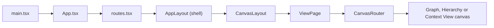

# Frontend Reference

*For frontend engineers.*

Use this page to find your way around the single-page app in `frontend/`: how it is organised, how it talks to the backend, the handful of stores and hooks everything else builds on, and where each major surface lives. Exact behaviour is in the code; this page tells you which file to open.

## Technology stack

From `frontend/package.json` (ranges, as declared):

| Technology | Version | Used for |
|---|---|---|
| React | ^19.3.0 | UI |
| TypeScript | ~5.7.2 | Types |
| Vite | ^8.3.3 | Dev server and build |
| Zustand | ^5.0.15 | Client state |
| TanStack React Query | ^5.104.1 | Server state and caching |
| React Router | ^7.18.4 (`react-router-dom`) | Routing |
| @xyflow/react | ^12.12.0 | The graph canvases |
| elkjs | ^0.12.0 | Graph-canvas layout |
| Tailwind CSS | ^3.4.17 | Styling |
| Radix UI | per-component packages | Dialogs, menus, popovers, tabs, tooltips, switches |
| Framer Motion | ^11.15.0 | Transitions |
| Lucide React | ^1.52.0 | Icons |
| react-markdown, mermaid | ^10.1.0, ^11.16.1 | The documentation and guide readers |
| Vitest | ^4.1.11 | Tests |

Node.js 24 is pinned in `frontend/.nvmrc`, and the production image builds on `node:24-alpine` and serves from `nginx:1.31-alpine`.

## How the frontend is organised

| Folder (`frontend/src/`) | What lives there | Start with |
|---|---|---|
| `main.tsx`, `App.tsx` | Boot: branding and feature-switch values are fetched, then the app tree mounts — query client, session bootstrap, graph provider, router | `App.tsx` (`App`, `AuthBootstrap`) |
| `routes.tsx` | Every route. Pages are lazy-loaded with a retrying import, each behind its own error boundary | `router` |
| `pages/` | Route-level pages: Explorer, the view page, Ingestion, Workspaces, the semantic-layer page, Administration, Analytics, your account, the docs and guide shells | `ViewPage.tsx`, `ExplorerPage.tsx` |
| `components/` | UI by area: `canvas/` (the canvases, trace dock, Context View and Lineage Lens), `views/` (the Create View wizard and layer editing), `admin/`, `ingestion/`, `workspaces/`, `schema/`, `panels/` (detail panels), `layout/` (app shell, sidebar, top bar, command palette), `auth/` (sign-in pages and route guards), `docs/` and `guide/` (the readers), `ui/` (shared primitives) | `components/canvas/CanvasRouter.tsx` |
| `features/` | Self-contained features: `versioning`, `reviews`, `import-export`, `view-transfer`, `view-versions`, `canvas-drafts`, `ontology`, `sync-status`, `tour` | `features/versioning/` |
| `store/` | Most of the app's Zustand stores (about 40 in all; a few live beside the feature that owns them) | See [The central stores](#the-central-stores) |
| `hooks/` | About 110 hooks: data loading, tracing, layout, interactions | See [The central hooks](#the-central-hooks) |
| `services/` | API clients, one module per backend area, and the shared request wrapper | `fetchWithTimeout.ts`, `apiClient.ts` |
| `providers/` | The graph data client and its React context | `RemoteGraphProvider.ts`, `GraphProviderContext.tsx` |
| `lib/` | Pure helpers: the query client, display labels, permission and navigation rules, formatting | `queryClient.ts`, `domainLabels.ts`, `navPermissions.ts` |
| `config/` | Timeouts, polling intervals and page sizes | `timeouts.ts` |
| `types/`, `generated/` | Shared types; generated files such as the feature registry snapshot the admin Features page falls back to | `generated/featuresFallback.json` |
| `styles/` | Global CSS and the shared component classes | `globals.css` |
| `test/`, `harness/` | Test helpers and the visual harness pages | `test/lensView.ts` |

## From URL to screen

```mermaid
flowchart LR
    M["main.tsx"] --> A["App.tsx"]
    A --> R["routes.tsx"]
    R --> L["AppLayout (shell)"]
    L --> CL["CanvasLayout"]
    CL --> VP["ViewPage"]
    VP --> CR["CanvasRouter"]
    CR --> G["Graph, Hierarchy or Context View canvas"]
```

1. `main.tsx` starts the branding and feature-switch fetches, then mounts `App`.
2. `App` wraps everything in the React Query client, `AuthBootstrap` (which resolves the session), and `GraphProvider` (which owns the graph data client for the active workspace), then renders the router.
3. Signed-in routes render inside `AppLayout` — the top bar, the sidebar and the page. The Explorer and view routes also sit inside `CanvasLayout`, which loads the semantic layer first.
4. `ViewPage` opens a view, and `CanvasRouter` picks the canvas from its layout type:

| Layout type | Canvas | Label on screen |
|---|---|---|
| `graph` (and the legacy `layered-lineage`) | `GraphCanvas` | **Graph** |
| `hierarchy`, `tree` | `HierarchyCanvas` | **Hierarchy** |
| `reference` | `ContextViewCanvas` (exported as `ReferenceModelCanvas`) | **Context View** |

Every entity type renders through one schema-driven node component, `components/canvas/nodes/GenericNode.tsx`, styled from the semantic layer — see [ADR-009](/docs/decisions#adr-009-schema-driven-frontend-rendering).

On the Graph canvas, layout runs with ELK.js in `hooks/useElkLayout.ts`. It runs on the browser's main thread — asynchronously and debounced, but not in a Web Worker — because ELK's worker build does not load under Vite's ESM bundling. The Context View lays out its own layer columns.

## Talking to the backend

Every request goes through one wrapper, `services/fetchWithTimeout.ts`:

- **Cookies, not tokens.** It always sends `credentials: 'include'`, so the `HttpOnly` session cookies ride along. The app never sees or stores a token.
- **CSRF.** On every `POST`, `PUT`, `PATCH` and `DELETE` it copies the `nx_csrf` cookie into an `X-CSRF-Token` header.
- **Session renewal.** `store/sessionKeepalive.ts` renews the session ahead of expiry, using the expiry the server publishes in `nx_access_exp`. As a fallback, a `401` triggers one silent `POST /api/v1/auth/refresh` and a retry. Concurrent refreshes share one request, and tabs share a Web Lock, so they never race. If the refresh fails, the wrapper signals that the session is lost and the auth store marks you signed out.
- **Back-pressure.** On a `429` or `503` to a `GET`, `HEAD` or `OPTIONS` request it waits for `Retry-After` (up to 5 seconds) and tries once more.
- **Timeouts.** 45 seconds by default (`TIMEOUTS.DEFAULT_MS` in `config/timeouts.ts`, overridable with `VITE_TIMEOUT_DEFAULT_MS`); slow reads pass their own, such as 150 seconds for traces (`TIMEOUTS.TRACE_MS`), so the server's truncated answer arrives before the client gives up.

On top of it:

- `services/apiClient.ts` (`authFetch`) parses JSON and turns error bodies into readable messages; the service modules in `services/` use it.
- `providers/RemoteGraphProvider.ts` is the graph data client. It builds workspace-scoped URLs — `/api/v1/{workspaceId}/graph/...` plus `dataSourceId`, `branchId` inside a draft, and `viewId` for access through a view — keeps a short-lived cache of `GET` responses, guards each kind of call with a client-side circuit breaker, and retries idempotent graph reads, honouring `Retry-After`.
- React Query (`lib/queryClient.ts`) defaults to a 5-minute stale time, one retry, and no refetch on window focus.

The server side of all this: [Backend Reference](/docs/backend#authentication) and [Architecture](/docs/architecture#request-lifecycle).

## Signed-in state, permissions and feature switches

- **The session.** `store/auth.ts` (`useAuthStore`) is derived from the server and never persisted. On boot it calls `GET /api/v1/auth/me`; whether you are signed in is a projection of that answer. A copy of the user record in `sessionStorage` (`store/userCache.ts`) only speeds up the first paint after a reload — it never holds a token or permissions.
- **Permissions.** The store holds the permission claims for the session. They are advisory: they hide controls and routes, while the server enforces every request. Route guards live in `components/auth/` (`RequireNav`, `RequirePermission`, `RequireAnalytics`) and `components/RequireFeature.tsx`.
- **Feature switches.** `store/features.ts` (`useFeaturesStore`, `useFeature`) loads the switch values at boot from `GET /api/v1/features/values`, and refreshes them when the tab becomes visible or focused, and every 60 seconds while it is visible. Until the first answer — or if it fails — each switch reads its seed default, which mirrors `backend/app/config/features_seed.py`. Guided tours ship off (`toursEnabled: false`).

## The central stores

About 40 Zustand stores exist; these are the ones most code depends on:

| Store | File | Holds | Persisted |
|---|---|---|---|
| `useAuthStore` | `store/auth.ts` | The signed-in user, session status, permission claims | Never |
| `useWorkspacesStore` | `store/workspaces.ts` | Workspaces and the active workspace and data source | The active ids, in `localStorage` |
| `useSchemaStore` | `store/schema.ts` | The resolved semantic layer and the views for the active scope | The active view id |
| `useCanvasStore` | `store/canvas.ts` | Canvas nodes, edges, selection and viewport | The viewport and the active lens |
| `usePreferencesStore` | `store/preferences.ts` | Theme and per-user display preferences | Yes |
| `useFeaturesStore` | `store/features.ts` | Feature switch values | No — fetched and refreshed |
| `useBranchStore` | `store/branchStore.ts` | The draft (branch) the canvas is working in, and whether the diff overlay is on | No — resolved again each session |
| `useStagedChangesStore` | `store/stagedChangesStore.ts` | Edits staged in a draft, scoped by workspace, data source and branch | Restored after a reload by `features/canvas-drafts/` |
| `useTraceStore` | `hooks/useUnifiedTrace.ts` | The trace on the Graph and Hierarchy canvases | No |

**Workspace scoping.** Views and the semantic layer are keyed by a scope key, `${workspaceId}/${dataSourceId}` (or `${workspaceId}/default`). Switching workspace or data source calls `useSchemaStore.setActiveScopeKey()`, which reloads the semantic layer, so one scope's ontology never leaks into another. `hooks/useWorkspaceContext.ts` composes the two stores for components that need both.

## The central hooks

| Hook | File | What it does |
|---|---|---|
| `useGraphHydration` | `hooks/useGraphHydration.ts` | Loads a canvas's data: the first page of top-level entities (one `canvas/bootstrap` request unless `VITE_CANVAS_BOOTSTRAP=0`), children as containers open, and their edges |
| `useCanvasTrace`, `useUnifiedTrace` | `hooks/useCanvasTrace.ts`, `hooks/useUnifiedTrace.ts` | The Graph and Hierarchy canvases' trace: `trace/v2`, then `trace/expand` and `trace/expand-batch` as traced containers open |
| `useLensWalk` | `hooks/useLensWalk.ts` | Walks lineage around a focus through `trace/closure` pages, for the Lineage Lens, the Context View's trace and the node panel's lineage neighbours |
| `useCanvasTraceWalk`, `useTraceOverlay` | `hooks/useCanvasTraceWalk.ts`, `hooks/useTraceOverlay.ts` | Draws a trace over the Context View without writing to the canvas store |
| `useExternalDegrees` | `hooks/useExternalDegrees.ts` | Total lineage degree per entity (`POST /{ws_id}/graph/nodes/degree`, 400 per request after an 800 ms settle), which drives the Context View's lineage ports |
| `useElkLayout` | `hooks/useElkLayout.ts` | Graph-canvas layout with ELK.js, on the main thread |
| `useWorkspaceContext` | `hooks/useWorkspaceContext.ts` | The active workspace, data source and their views, with switch actions |
| `useDataSourceSchema` | `hooks/useDataSourceSchema.ts` | Loads the semantic layer for the active data source |

## Tracing in the app

- **What users see.** The trace dock (`components/canvas/trace/`) shows **Upstream depth** and **Downstream depth** sliders. How fine the picture is follows which containers are open — lineage between closed containers is rolled up — and, in the Lineage Lens, its **Density** control. `TraceDockControls.tsx` can also render a level select and an edge-type filter, but only outside native mode, and the dock's one host (`ContextViewCanvas.tsx`, through `TraceBottomDock`) passes `nativeMode={traceActive}`, so users never see them.
- **Graph and Hierarchy canvases** trace through `useCanvasTrace`: `trace/v2` for the first picture, then `trace/expand` and `trace/expand-batch` as traced containers open.
- **Context View.** A trace walks the whole flow through `trace/closure` (`useCanvasTraceWalk`) and draws it over the columns as an overlay (`useTraceOverlay`), without changing the canvas store, so leaving the trace restores the canvas. The Lineage Lens is the separate, interactive investigation of one entity, on the same endpoint. The canvas's aggregation level is picked automatically: the coarsest level present.

Endpoint details: [Backend Reference](/docs/backend#the-trace-endpoints).

## Context View and Lineage Lens

The Context View is a layer-organised canvas: entities sit in columns by layer, page in as you scroll, and the Lineage Lens opens on any of them.

| Component | File | Purpose |
|---|---|---|
| `ContextViewCanvas` | `components/canvas/context-view/ContextViewCanvas.tsx` | The Context View: layer columns, overlays, the trace and Lens entry points, and lineage ports |
| `LineageLens` | `components/canvas/context-view/LineageLens.tsx` | The focus room: a node's lineage laid out sources → focus → consumers, fetched from `trace/closure` and walked hands-free. The header has a segmented **Direction** control and **Density**, **Wires**, **Walk**, **Steps** and **Next** chips |
| `useLensWalk` | `hooks/useLensWalk.ts` | The walk driver: a per-focus phase machine (`loading`, `seeding`, `walking`, then `done`, `checkpoint` or `error`); a coarse first paint beside the first fine page; drains seed cursors and cut frontiers in batches (one hop) or to the end (full flow); a one-time memory checkpoint at 20,000 nodes (`TRACE_CHECKPOINT_NODES`); aborts on close |
| `lens/closure-adapter.ts` | `components/canvas/context-view/lens/` | Turns `trace/closure` pages into one walk model and merges later pages into it |
| `lens/focus-layout.ts` | `components/canvas/context-view/lens/` | The board: the spine, fan-in bundles, partner grain and wire bundles (thresholds in `lens/focus-cards.ts`) |
| `lens/FocusGraphView.tsx` | `components/canvas/context-view/lens/` | React Flow rendering of the board (`onlyRenderVisibleElements`), its controls and exports |
| `lens/useFrameCamera.ts` | `components/canvas/context-view/lens/` | Focus-first camera: fits a board that is readable at `FOCUS_MIN_ZOOM` (0.75), otherwise centres on the focus |
| `TraceWalkIndicator.tsx` | `components/canvas/context-view/` | The walk's progress capsule on both boards |
| `LayerColumn` | `components/canvas/context-view/LayerColumn.tsx` | One layer: virtualised, paged rows, and a resize handle. In a draft a new width saves into the view; otherwise it is kept per viewer in `localStorage` (`nx-layer-widths`) |
| `LayerStrip` | `components/canvas/context-view/LayerStrip.tsx` | A docked navigator at the bottom of the canvas: a chip per layer, lit while on screen, a position rail, and an add-layer chip in edit mode |
| `AddLayerColumn` | `components/canvas/context-view/AddLayerColumn.tsx` | The "Add layer" tile after the last column, in a draft |
| `anchorRail` | `components/canvas/context-view/anchorRail.ts`, `store/anchorRail.ts` | Stand-in chips docked in a column for a focused entity's partners that are scrolled out of sight; on screen they sit under **Off-screen above** or **Off-screen below** |
| `LineageFlowOverlay` | `components/canvas/context-view/LineageFlowOverlay.tsx` | The lineage lines drawn across the layer columns |

Tests drive the Lens's controls through `src/test/lensView.ts` (`chooseView`, `viewValue`).

## The Create View wizard

`components/views/ViewWizard/ViewWizard.tsx` is the wizard behind the **New View** button; its dialog is titled **Create New View** and finishes with **Create View**. The steps, in order:

1. **Scope** — the workspace and data source (in create mode).
2. **Basics** — name and description.
3. **Layout** — the canvas type.
4. **Assignments** — which entities go in which layer; Context View only.
5. **Entities** — which entity types the view shows.
6. **Preview**.

A view built from a blank model skips **Assignments** and **Entities**. Importing a view file runs its own journey: **File**, then **Target** and **Data** where they apply, **Match**, and the design steps from **Basics** to **Preview**. The **Assignments** step's three-panel editor is `components/views/LayerStudio.tsx`.

## Administration and ingestion

Administration lives under `/admin`, rendered by `pages/AdminPage.tsx`; each sub-route has its own guard in `routes.tsx`:

| Route | Component | Label |
|---|---|---|
| `/admin/overview` | `components/admin/AdminOverview.tsx` | **Global Overview** |
| `/admin/infrastructure` | `components/admin/AdminInfrastructure/` | **Infrastructure** |
| `/admin/redis` | `components/admin/AdminRedis/` | **Redis & Graph Store** |
| `/admin/graph-store` | `components/admin/AdminGraphStore/` | **Graph store** |
| `/admin/branding` | `components/admin/AdminBranding/` | **Branding** |
| `/admin/features` | `components/admin/AdminFeatures/` | **Features** |
| `/admin/telemetry` | `components/admin/AdminTelemetry/` | **Telemetry** |
| `/admin/announcements` | `components/admin/AdminAnnouncements/` | **Announcements** |
| `/admin/users` | `components/admin/AdminUsers.tsx` | **User Management** |
| `/admin/groups` | `components/admin/AdminGroups.tsx` | **Groups** |
| `/admin/permissions` | `components/admin/AdminPermissions.tsx` | **Permissions** |
| `/admin/sso` | `components/admin/AdminSso.tsx` | **SSO** |
| `/admin/audit` | `components/admin/AdminAudit.tsx` | **Audit Log** |

Registering sources happens on the Ingestion page (`/ingestion`, `pages/IngestionPage.tsx`), whose tabs are **Providers**, **Data Sources**, **Job History**, **Freshness** and **Profiling**:

- **Providers** (`components/admin/RegistryConnections.tsx`) — the **Register Provider** button opens `ProviderOnboardingWizard`.
- **Data Sources** (`components/admin/RegistryAssets.tsx`) — registering a provider's graphs, then binding them into workspaces with `AssetOnboardingWizard`, whose steps are **Workspace**, **Aggregation**, **Semantic Layer**, **Schema Review** and **Review**.
- With no providers registered, both tabs show `FirstRunHero`; for platform administrators, `OnboardingProgress` tracks setup across the page.

The admin user's view of these pages: [Admin Setup](/guide/admin-setup) and [The Admin Console](/guide/governance-ops).

## Design system

- **Utility-first styling** with Tailwind CSS; `cn()` in `lib/utils.ts` combines `clsx` and `tailwind-merge` for conditional classes.
- **Colour tokens** — `canvas`, `glass`, `accent` and `ink` families in `tailwind.config.js`, with dark mode through `dark:` utilities.
- **Shared component classes** such as `glass-panel` and `glass-panel-subtle` in `styles/globals.css`.
- **Fonts** — Outfit for display, Inter for text, JetBrains Mono for code (`tailwind.config.js`).
- **Primitives** — Radix UI for accessible dialogs, menus and popovers; Lucide icons, looked up by name where the semantic layer names them; Framer Motion for transitions, respecting reduced-motion preferences.
- **Keyboard** — ⌘K / Ctrl-K opens the command palette (`components/layout/CommandPalette.tsx`).

## Performance techniques

- **Route-level code splitting.** Every page is lazy-loaded (`lib/lazyWithRetry.ts`), and Vite's `manualChunks` in `vite.config.ts` splits vendor code.
- **One request where there were three.** A canvas's first page comes from `canvas/bootstrap`; opening a traced container with many rolled-up edges sends one `trace/expand-batch`.
- **Cheap canvas updates.** `useCanvasStore` keeps `_nodeIndex` and `_edgeIndex` sets for constant-time de-duplication, and `setGraph(nodes, edges)` replaces both in one update.
- **Virtualisation.** Layer columns and long lists render only what is on screen (`@tanstack/react-virtual`), and the Lens renders only visible elements.
- **Server-aware retries.** Reads back off on `Retry-After`, so a shed request becomes a short pause instead of an error.

## Where in the code

| Concern | Where |
|---|---|
| Boot and app tree | `frontend/src/main.tsx`, `frontend/src/App.tsx` |
| Routes and guards | `frontend/src/routes.tsx`, `frontend/src/components/auth/` |
| Request wrapper | `frontend/src/services/fetchWithTimeout.ts` |
| Graph data client | `frontend/src/providers/RemoteGraphProvider.ts` |
| Session state | `frontend/src/store/auth.ts`, `frontend/src/store/sessionKeepalive.ts` |
| Feature switches | `frontend/src/store/features.ts` |
| Canvas selection | `frontend/src/components/canvas/CanvasRouter.tsx` |
| Graph-canvas layout | `frontend/src/hooks/useElkLayout.ts` |
| Trace | `frontend/src/hooks/useUnifiedTrace.ts`, `frontend/src/hooks/useLensWalk.ts`, `frontend/src/components/canvas/trace/` |
| Context View | `frontend/src/components/canvas/context-view/` |
| Create View wizard | `frontend/src/components/views/ViewWizard/` |
| Build config | `frontend/vite.config.ts`, `frontend/tailwind.config.js`, `frontend/package.json` |

## See also

- [Backend Reference](/docs/backend) — the API this app calls
- [Architecture](/docs/architecture) — how a request flows from the browser to the stores
- [Features API](/docs/api-features) — the feature switches that gate parts of the app
- [Versioning: Frontend Integration](/docs/versioning-frontend-integration) — drafts, review and publish in the app
- [Developer Setup](/docs/setup) — running the dev server
