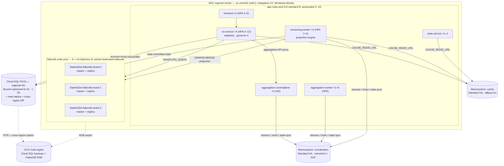

# Infrastructure Specification — Launch Scale (1,000+ users · 100s of graphs · 1,000s of versioned views)

**Document Version:** 1.0
**Target Environment:** GCP — Cloud SQL for PostgreSQL 16 (regional HA) · Memorystore for Redis (cache + coordination) · GKE regional (FalkorDB in **Redis Cluster mode**, self-managed)
**Workload:** Interactive, read-dominant graph exploration for 1,000+ users, over ~300 physical graphs and ~3,000 versioned views whose **version history lives in Cloud SQL**.

> **At a glance.** The production sizing spec for {brand} at *launch scale* — for the
> engineers and SREs provisioning it. Derives, from four stated planning assumptions
> (§1.2), the capacity model, GKE layout, Cloud SQL tuning for the append-only versioned
> store, the connection-budget arithmetic that horizontal scaling makes fragile, the
> cache/coordination Redis split, the FalkorDB cluster, DR, and a phased rollout. Numbers
> here are for this scale only — do not mix them with the 250M companion.

This spec is a ground-up re-derivation for the *operating* scale, not the theoretical maximum. Its larger-corpus companion is [INFRASTRUCTURE_SCALING_250M.md](./INFRASTRUCTURE_SCALING_250M.md); the two share topology and tuning philosophy but nothing else — do not mix their numbers. It also composes with:

- [architecture-when-scaling.md](./architecture-when-scaling.md) — the stateless-web / worker / control-plane role split and the cache-vs-coordination Redis rules.
- [DATA_ARCHITECTURE.md](./DATA_ARCHITECTURE.md#redis-topology--decoupling) — Redis topology, the FalkorDB↔dedicated-Redis decoupling, and the cache-split runbook.
- [DECISIONS.md](./DECISIONS.md) — ADR-017…020 (state-sync consumer group, control-plane auth, Redis/FalkorDB decoupling) that this topology assumes are in place.

---

## 1. Executive Summary

| Layer | What we run | Why this shape |
| :--- | :--- | :--- |
| **Edge / web** | `frontend` (nginx+SPA) + `viz-service` (gunicorn, **stateless**), HPA'd | 1,000+ users → concurrency, not data size, is the constraint. The web tier holds no background loops, so it scales purely on request CPU. |
| **Control plane** | `aggregation-controlplane` ×**2** (HA) | Owns scheduler + reconciler + state-sync consumer group + crash-recovery. 2 replicas removes the GKE-rebalancing SPOF (all four loops are HA-safe). |
| **Domain workers** | `aggregation-worker` (HPA), `versioning-worker` (the projection engine), `stats-service` (insights/purge) | Heavy/background work isolated off the web tier. The **versioning-worker is the load-bearing service at this scale** — it projects committed Cloud SQL state into FalkorDB. |
| **System of record** | **Cloud SQL PG16, regional HA** — one instance for launch, `graphver`-split-ready | The versioned node/edge/commit store is the authoritative data. Everything else is rebuildable from it. HA + correct append-only vacuum tuning is the single most important thing in this document. |
| **Graph read layer** | **FalkorDB in Redis Cluster mode** — 3 shards on a dedicated, tainted GKE node pool | A *disposable projection* of Cloud SQL. Any graph can be dropped and rebuilt, which is what makes an aggressive, evictable memory posture safe. |
| **Supporting Redis** | **Memorystore** ×2: cache + coordination, **never combined** | Cache (`allkeys-lru`, loss-tolerant) and coordination (streams/locks, `noeviction`+AOF) have incompatible eviction policies. Both are decoupled from FalkorDB by construction (ADR-020). |

### 1.1 Design targets

| Dimension | Target |
| :--- | :--- |
| Registered users | 1,500 (≈ 300 concurrent-active at peak) |
| Peak request rate | ~400 req/s sustained, ~800 req/s burst |
| Physical graphs | ~300 (largest single graph ≤ ~8M elements — a graph cannot span shards) |
| Versioned views | ~3,000 (~500 actively-edited draft branches) |
| Versioned rows in Cloud SQL | ~135M node/edge version rows + ~45M heads + ~150K commits (3× history amplification) |
| Interactive read P99 | canvas bootstrap / neighbors < 400 ms; trace depth ≤ 5 < 1 s |
| View freshness (projection lag) | projected `commit_seq` within `GRAPHVER_READ_MAX_LAG` of committed — the user-facing SLO |
| Availability | Zone loss: no read outage; Cloud SQL regional sync-HA; control plane + workers ≥ 2 across zones |
| Utilization ceiling | ≤ 65% of provisioned CPU/RAM/connections at target — headroom is part of the spec |

### 1.2 Planning assumptions (state and revisit — all downstream numbers derive from these)

> **A1 — concurrency.** 1,500 users, ~20% concurrent-active (300), each generating bursty interaction (~0.3–1 req/s while active) → **~400 req/s sustained, ~800 burst**. Request mix: **65% light** (lists, `/me`, permissions, metadata), **25% medium** (canvas bootstrap, neighbors, view reads), **10% heavy** (trace ≤ depth 5, versioned diff, import, large-read). Only the medium/heavy tail sizes CPU and connections.
>
> **A2 — graph corpus.** ~300 physical graphs, element distribution p50 ~80K / p90 ~500K / p99 ~3M / max ~8M → **~45M live elements total**, hot working set (actively viewed) **~25–40M**. FalkorDB is evictable, so resident memory tracks the working set, not the corpus.
>
> **A3 — versioning is the Cloud SQL driver.** ~3,000 views (branches), ~500 actively edited. ~150K commits, and with 3× version-history amplification on 45M live elements → **~135M `node_versions` + `edge_versions` rows** and ~45M `entity_heads`. This is the append-only workload that dictates Cloud SQL sizing, vacuum tuning, and IOPS headroom.
>
> **A4 — one Cloud SQL instance for launch.** Management + versioned (`graphver`) data share **one HA instance** initially (`GRAPHVER_DB_URL == MANAGEMENT_DB_URL`). The code is already decoupled (`versioning/config.py:graphver_db_url()`, no cross-schema FKs), so splitting `graphver` onto its own instance later is **config-only**. §5.6 gives the split trigger.

### 1.3 Topology



---

## 2. Capacity Model

Re-run this arithmetic whenever A1–A4 change. Everything else is derived.

### 2.1 Request throughput → web tier

| Class | Share of 400 req/s | Cost profile | Sizing driver |
| :--- | :--- | :--- | :--- |
| Light | 260 req/s | ~2–10 ms, async I/O | negligible CPU |
| Medium | 100 req/s | 30–150 ms, some serialization/gzip | CPU + `GRAPH_READ`/`READONLY` pool |
| Heavy | 40 req/s | 0.3–30 s, provider I/O bound (awaited) | connection *hold time*, not CPU |

A stateless async worker sustains ~50–120 medium-req/s before CPU (Pydantic serialize + gzip) saturates. Budgeting **4 `viz-service` pods × 4 gunicorn workers = 16 worker processes** at baseline gives ~8–10 medium-req/s/worker headroom at 400 req/s; HPA to 12 pods absorbs the 800 burst and heavy-tail concurrency. Heavy requests don't pin CPU (their time is awaited provider I/O), but they **hold a `GRAPH_READ` connection for their duration** — that is what §5.4 must budget.

### 2.2 Graph corpus → FalkorDB resident memory

| Component | Estimate |
| :--- | :--- |
| Live elements ~45M; hot working set ~40M (labels, urn, properties, GraphBLAS matrices) | ~40–45 GB |
| Overhead ×1.5 (matrix slack, query memory, replication buffers, fork COW) | → **~65 GB cluster-wide** |
| Per shard (÷3, keyslot placement) | **~22 GB** |
| Largest single graph (~8M elements, must fit one shard) | ~8 GB ✓ |

With per-shard `maxmemory 40 GB` on 64 GB nodes, a shard runs ~55% full at target — headroom for skew, the largest single graph, and growth. Cold graphs are evicted (`GRAPHVER_FALKOR_BUDGETS`) and rebuilt from Cloud SQL on demand.

### 2.3 Versioning → Cloud SQL (the dominant store)

| Table | Rows @ target | Heap | Index | Subtotal |
| :--- | :--- | :--- | :--- | :--- |
| `node_versions` (~1.1 KB/row: JSONB payload, blake2b hashes, urn) | ~90M | ~100 GB | ~60 GB | ~160 GB |
| `edge_versions` (~0.6 KB/row) | ~45M | ~27 GB | ~25 GB | ~52 GB |
| `entity_heads` (~250 B/row, mutable) | ~45M | ~11 GB | ~9 GB | ~20 GB |
| `commits`, `merkle_nodes`, `working_changes`, `import_rows`, management schema | — | — | — | ~40 GB |
| **Total data + indexes** | | | | **~270 GB** |

Provision **1 TB SSD** (≈27% utilized). The headroom is deliberate: Cloud SQL IOPS scale with provisioned size, and the two IOPS-heavy events at this scale — **projection reseeds** (a graph rebuild scans its committed history) and **autovacuum on append-only partitions** — must never contend into a checkpoint storm.

---

## 3. GKE Cluster

| Item | Spec |
| :--- | :--- |
| Cluster | **Regional**, `us-central1` (a/b/c), **GKE Standard**, **Dataplane V2** (NetworkPolicy enforcement — required for the `NetworkPolicy` objects in `deploy/k8s/base/networking/` to actually apply), **Workload Identity** enabled |
| App node pool | `app-pool`: **n4-standard-8** (8 vCPU / 32 GB), cluster-autoscaled **4–12** nodes, 3-zone balanced |
| FalkorDB node pool | `falkordb-pool`: **6 × n4-highmem-8** (8 vCPU / 64 GB), 2 per zone, taint `dedicated=falkordb:NoSchedule`, one FalkorDB pod per node (hostname anti-affinity) |
| Ingress | GKE ingress (managed cert) → `frontend`; **HTTP/2 at the edge** so ~6-conn/host limits don't turn a few slow requests into an app-wide stall |
| Deploy | `deploy/k8s/overlays/production` (kustomize) via `deploy.sh deploy production` — single reconciled manifest system |

---

## 4. Application Tier

Role split per [architecture-when-scaling.md](./architecture-when-scaling.md). All backend pods set the correct `SYNODIC_ROLE` (the WS2.1 guard is now per-role `resolve_redis_config` validation, requiring a resolved `CACHE` endpoint — `REDIS_CACHE_*` / legacy `CACHE_REDIS_URL` — in every deployed role; managed cache satisfies it).

| Service | Replicas (HPA) | Requests | Limits | Notes |
| :--- | :--- | :--- | :--- | :--- |
| `frontend` | 3 (3–6, on RPS) | 100m / 128Mi | 500m / 256Mi | nginx + SPA; preStop drain 5 s |
| `viz-service` | **4 (4–12, on CPU 65%)** | 1 vCPU / 1Gi | 2 vCPU / 2Gi | **stateless**; `GUNICORN_WORKERS=4`; `AGGREGATION_PROXY_ENABLED=true`; pool overrides §5.4; preStop drain |
| `aggregation-controlplane` | **2 (fixed, HA)** | 500m / 512Mi | 1 vCPU / 1Gi | owns scheduler + reconciler + **state-sync consumer group** + recovery; internal-auth token set (ADR-019) |
| `aggregation-worker` | 2 (2–8, on stream lag) | 1 vCPU / 1Gi | 2 vCPU / 4Gi | heavy MERGE; `WORKER_CONCURRENCY=4`; SIGTERM drain ≤ 60 s |
| **`versioning-worker`** | **2 (2–4, on projection lag)** | **1 vCPU / 2Gi** | **2 vCPU / 4Gi** | **projection engine — the critical service here.** Consumes the projection stream, per-graph advisory lock, reads Cloud SQL committed state, `UNWIND MERGE` into FalkorDB. `GRAPHVER_PROJECTION_CONCURRENCY=8` |
| `stats-service` | 1 (1–2) | 100m / 256Mi | 500m / 512Mi | insights polling + purge worker + post-purge re-aggregation trigger |

**Autoscaling & availability.** Every multi-replica service gets a `PodDisruptionBudget` (`maxUnavailable: 1`) and `topologySpreadConstraints` across zones. HPA targets 65% CPU (web) / stream-lag (workers) so there is always headroom for a burst *and* a zone loss simultaneously. `versioning-worker` scales on **projection watermark lag** (projected vs committed `commit_seq`) — the freshness SLO is its scaling signal, not CPU.

**Why the versioning-worker matters most at this scale.** 3,000 views with ~500 actively edited means a steady stream of commits, each of which must be projected into FalkorDB before the view reads fresh. Under-provisioning it doesn't fail requests — it silently grows projection lag, and users see stale graphs. Two replicas share the consumer group (exactly-once per event); the per-graph advisory lock means two workers never project the same graph concurrently, so scaling is safe up to the number of distinct actively-projecting graphs.

---

## 5. Cloud SQL for PostgreSQL 16 (regional HA) — the versioned store

This is the authoritative system of record and the single most important thing to size and tune correctly, because **the versioned graphs live here** and the append-only version tables are the fastest-growing, most vacuum-sensitive data in the platform.

### 5.1 Instance

| Attribute | Value |
| :--- | :--- |
| Edition / tier | **Enterprise Plus**, `db-perf-optimized-N-16` (**16 vCPU / 128 GB**) + data cache |
| Storage | **1 TB SSD** (≈27% used at target; IOPS scale with size) |
| HA | **Regional** (synchronous standby in a second zone — automatic failover) |
| Replicas | **1 in-region read replica** (wired to the app `READONLY` pool — offloads heavy versioned diffs, exports, audits) + **1 cross-region replica** (DR) |
| Connectivity | Private IP / PSC only, TLS required; app connects via the Cloud SQL connector or private DNS |
| Backups | Automated daily + **PITR (7-day WAL)**; cross-region replica doubles as DR |

One HA instance carries both schemas for launch (A4). The `graphver` split (§5.6) is a config change when the versioned store outgrows shared tuning.

### 5.2 Database flags — tuned for the append-only versioned workload

| Flag | Value | Rationale |
| :--- | :--- | :--- |
| `max_connections` | `800` | Reconciled against §5.4. Never raise this to "fix" pool exhaustion — fix the pooler/pool sizes first. |
| `shared_buffers` | `32 GB` (25%) | Enterprise Plus data cache serves the long tail beyond it |
| `effective_cache_size` | `96 GB` (75%) | Favors index scans on the hot `entity_hist` / urn / `commit_seq` indexes |
| `work_mem` | `48 MB` | Per sort/hash; bounded because worst-case concurrency is capped by pools (§5.4) |
| `maintenance_work_mem` | `2 GB` | Index builds + vacuum on partitioned version tables |
| `max_wal_size` | `16 GB` | Absorbs `IMPORT_COMMIT_WINDOW` bulk-commit bursts without checkpoint storms |
| `checkpoint_completion_target` | `0.9` | Spread checkpoint I/O |
| `wal_compression` | `lz4` | Version rows are JSONB-heavy and compress well |
| `default_toast_compression` | `lz4` | Cheaper de/compress on payload JSONB |
| `random_page_cost` | `1.1` | SSD |
| `effective_io_concurrency` | `200` | SSD readahead for partition/projection scans |
| `max_parallel_workers` / `_per_gather` | `16` / `4` | Parallel partition scans for reseeds, diffs, exports |
| `autovacuum_max_workers` | `6` | Partitioned version tables need vacuum concurrency |
| **`autovacuum_vacuum_insert_scale_factor`** | **`0.02`** | **The most important flag here.** Append-only tables get few UPDATEs/DELETEs, so the default vacuum never fires — visibility maps go stale and index-only scans silently stop being index-only. This forces insert-triggered vacuum so the hot read paths stay fast as history grows. |
| `autovacuum_vacuum_cost_limit` | `3000` | Vacuum must outrun ingest |
| `track_io_timing`, `pg_stat_statements`, `auto_explain` | on | Observability (§9) |

### 5.3 HA failover behavior the app already tolerates

- `DB_POOL_PRE_PING=true` (default) — a Cloud SQL failover surfaces as a **~5 s blip** (stale connections detected and replaced), not stuck sockets.
- Regional HA is **synchronous** → **zero RPO** on zonal failover; the standby promotes automatically, the private IP is unchanged, so no app repoint.
- The read replica is **asynchronous** — the `READONLY` pool tolerates seconds of lag (it serves diffs/exports/audits, never authoritative reads).

### 5.4 Connection management under horizontal scale (the section that must always balance)

> **Warning:** This is the trap horizontal scaling springs. Pools are **per-process**, so
> the connection count grows with replica count: at HPA max (12 web pods × 4 workers ×
> ~85 conns) that's **4,080 direct connections** — more than any single instance allows.
> Scale connections by **adding pods behind a transaction-mode pooler**, never by growing
> pools, and never by raising `max_connections` to paper over exhaustion.

Connections are the resource most likely to break when you autoscale, because the pools are **per-process** and the multiplier is **pods × `GUNICORN_WORKERS` × Σ(role pool_size)**. HPA moves the first term, so the connection count grows with replica count even though each pool looks small: at 12 web pods × 4 workers × the default ~85 conns/process = **4,080 direct connections** — over any instance on its own.

**Principle: scale connections by adding pods, never by growing pools.** The per-role pools (`WEB`, `GRAPH_READ`, `READONLY`, `JOBS`, `PROVIDER_PROBE`, `ADMIN`, `GRAPHVER` — `backend/app/db/engine.py`) are **per-process fairness bulkheads** (a saturated `GRAPH_READ` can't starve `WEB`); the **pooler is the aggregate server-side cap**. Keep the pools *small* and let the pooler absorb the pod count.

**Per-role env overrides (set on `viz-service`) — these do NOT change with HPA:**

```
DB_POOL_SIZE=8              DB_POOL_MAX_OVERFLOW=4       # WEB (legacy knob still honoured)
DB_GRAPH_READ_POOL_SIZE=6  DB_GRAPH_READ_POOL_MAX_OVERFLOW=4
DB_READONLY_POOL_SIZE=4    DB_READONLY_POOL_MAX_OVERFLOW=2
DB_JOBS_POOL_SIZE=2        DB_JOBS_POOL_MAX_OVERFLOW=1
DB_PROVIDER_PROBE_POOL_SIZE=2
GRAPHVER_POOL_SIZE=6       GRAPHVER_POOL_MAX_OVERFLOW=3
```

#### Pooler mode — and a required application setting

**Session-mode pooling does NOT solve the multiplication.** SQLAlchemy holds `pool_size` connections open (idle between requests); a *session*-mode pooler pins a server backend for each held connection's lifetime, so server connections ≈ the ~2,400 held client connections. No reduction — you'd still exhaust `max_connections`.

**Only transaction-mode pooling multiplexes**, because it returns the backend to the pool *after each transaction*. The ~2,400 client connections are idle ~99% of the time and collapse onto a small server pool sized by *concurrent-in-transaction* count. (Safe here: the web tier's transactions are ms-scale; the long-hold exception — `GRAPH_READ` across a 30 s trace — holds an *app-side* connection during awaited provider I/O, which is not an open DB transaction.)

> **Required app setting.** Transaction/statement-mode pooling with asyncpg needs server-side prepared statements disabled, or they collide across multiplexed backends (`prepared statement "__asyncpg_stmt_N__" already exists`). Set **`DB_POOLER_MODE=transaction`** on every backend tier; `db/engine.py` then passes `statement_cache_size=0` to asyncpg. This is verified correct for SQLAlchemy 2.0 (whose asyncpg dialect routes prepared-statement caching *through* asyncpg's `statement_cache_size` — there is no separate dialect knob) and is exactly what GCP documents for asyncpg behind Cloud SQL Managed Connection Pooling. Leave it **unset** for dev / direct connections so prepared statements (the query-plan-cache win) stay on.

#### The math — client scales with pods, server is bounded by load

Compute the client side at **HPA _max_**, not baseline — that is the number the pooler's `max_client_conn` must cover.

| Tier | Pods × procs @ HPA max | Client conns (steady pools) | Server-side via **transaction** pooler |
| :--- | :--- | :--- | :--- |
| viz web — mgmt pools (~24/proc) | 12 × 4 = 48 | ~1,152 | **~150** (ms-scale txns) |
| viz web — `GRAPHVER` (~6/proc) | 48 | ~288 | ~40 |
| aggregation-worker | 8 × 1 | ~120 | ~80 (longer txns) |
| versioning-worker | 4 × 1 | ~80 | ~60 (projection scans) |
| controlplane + stats | 4 procs | ~74 | ~50 |
| **Total** | | **client ~1,700 steady / ~2,400 peak** | **server ≈ 380 / 800 (48%)** ✓ |

The takeaway: **horizontal scaling multiplies the CLIENT side** (cheap — the pooler holds idle client connections almost for free) **but not the SERVER side** (bounded by concurrent queries, a few hundred). That is precisely why a transaction-mode pooler makes autoscale safe. **Alert on server-side utilization, never client pool counts.**

#### Pooler configuration (two pools, so a slow worker can't starve the web tier)

| Pool | `pool_mode` | `default_pool_size` | Serves |
| :--- | :--- | :--- | :--- |
| web | transaction | ~150 | short, high-multiplex web transactions |
| workers | transaction | ~100 | longer projection / aggregation scans (they hold a backend longer) |
| _global_ | — | `max_client_conn=5000`, `min_pool_size=20`, `reserve_pool_size=25`, `reserve_pool_timeout=3` | |

Instance `max_connections=800` = 150 + 100 server pools + ~50 system/replication/admin reserve + headroom for a failover (the promoted standby needs its share). At ~380 in use that is < 50% — deliberate headroom.

#### Autoscale-storm safety

- **`HPA maxReplicas` is a connection-safety knob.** Set it deliberately (viz 12, aggregation-worker 8) and confirm the client-side total *at maxReplicas* fits `max_client_conn`. A runaway HPA is a connection storm.
- **Lazy pools work in your favour** — SQLAlchemy opens connections on demand, so a freshly-scaled pod ramps connections *as traffic arrives*, not an instant `pool_size` burst; the connection ramp tracks the traffic ramp.
- **Rate-limit scale-up** — HPA `behavior.scaleUp` ~+50%/60 s with a stabilization window, so you never add 6 pods in one tick.
- Keep `DB_POOL_PRE_PING=true` + `DB_POOL_RECYCLE_SECS=1800` so failovers and scale-downs don't leave half-open backends behind the pooler.

### 5.5 Ingest & maintenance

- Batch knobs at this scale: `GRAPHVER_INGEST_BATCH_SIZE=5000`, `GRAPHVER_PROJECTION_BATCH_SIZE=5000` (defaults are fine; raise only if p99 lock time stays low), `IMPORT_COMMIT_WINDOW=50000`.
- Partition pruning by `graph_id` + BRIN on `commit_seq` is the read path — verify plans keep pruning after PG major upgrades (`EXPLAIN` in a CI smoke test).
- Schedule bulk reseeds / large imports **off-peak** — a full reseed of a multi-million-element graph is a minutes-long, IOPS-heavy scan; the 1 TB IOPS headroom (§2.3) exists for exactly this.

### 5.6 When to split off `graphver` (the growth trigger)

Split the versioned store onto its own HA instance (set `GRAPHVER_DB_URL` to a new DSN — no code change, no cross-schema FKs) when **any** of:
- versioned tables > ~1.5 TB or > ~400M rows, **or**
- version-store vacuum/WAL I/O is measurably contending with interactive management queries (rising p99 on light requests during reseeds), **or**
- you want to size/tune/fail-over the two workloads independently.

At that point: `synodic-graphver` → `db-perf-optimized-N-32` + 4 TB; `synodic-mgmt` → `db-perf-optimized-N-8`. See INFRASTRUCTURE_SCALING_250M §3.

---

## 6. Memorystore for Redis — cache + coordination (never combined)

Two managed instances. They must not share, because their eviction policies are **incompatible** (a cache flood under `allkeys-lru` would evict a coordination lock; `noeviction` would make the cache OOM on writes). Both are decoupled from FalkorDB by construction (ADR-020 — the provider cache never lands on the graph instance).

| Instance | Serves (`env`) | Size / Tier | Policy |
| :--- | :--- | :--- | :--- |
| `synodic-redis-cache` | `CACHE_REDIS_URL` — provider ancestor/URN/stats cache, aggregated-read cache | **Memorystore 10 GB, Standard (HA)** | `allkeys-lru`, persistence **off** (recomputable) |
| `synodic-redis-coord` | `REDIS_URL` — aggregation job stream, `aggregation.events.stream` (state-sync), cancel Pub/Sub, exec/advisory locks, rate-limit, revocation | **Memorystore 5 GB, Standard (HA)** | `noeviction`, **AOF on** |

Notes:
- **Bounded timeouts** on every client are already in the code (bus 5/10 s, cache 2 s, revocation 2 s) — a slow Memorystore fails fast, it doesn't hang the web tier.
- **Standard (HA)**, not Basic — a Memorystore failover must not drop the job stream or the state-sync consumer group.
- Cluster-mode Memorystore is **not** needed at 10 GB; revisit only if the cache working set crosses ~50 GB (then follow the split runbook in [DATA_ARCHITECTURE.md](./DATA_ARCHITECTURE.md#redis-topology--decoupling) — and note that a *cluster-mode* cache supports DB 0 only, so `CACHE_REDIS_URL=.../1` would need to become `.../0`).

---

## 7. FalkorDB in Redis Cluster mode (self-managed on GKE)

FalkorDB is a Redis **module** — Memorystore cannot run it, so it lives on the dedicated GKE node pool. It is a **disposable projection**: every graph rebuilds from Cloud SQL, which is what makes cluster mode + eviction safe.

### 7.1 Shard topology

**3 shards × (1 master + 1 replica) = 6 pods**, one StatefulSet per shard (`falkordb-shard-0/1/2`), zone-spread, one pod per node. Redis Cluster splits the 16,384 slots three ways; a graph key lives **entirely on one shard** (`keyslot(graph_name)` — the client discovers topology and follows `MOVED`). This is the minimum HA cluster: 3 masters (cluster requirement) each with a replica for < 1 s failover.

> For stricter zone-loss posture (a shard keeps a spare replica through a full zone outage), go **3 × 3 = 9 pods**. At this corpus (~45M live) 3×2 is the right cost/HA balance; the graphs are rebuildable, so a brief single-replica window after a zone loss is acceptable.

### 7.2 Per-pod resources & Redis config (ConfigMap)

Node `n4-highmem-8` (8 vCPU / 64 GB), requests ≈ limits (the pod owns the node):

```conf
cluster-enabled yes
cluster-node-timeout 5000
cluster-require-full-coverage no      # a dead shard must not take down reads on the other two
cluster-migration-barrier 1
maxmemory 40gb                        # ~62% of the 64 GB node; the rest covers fork COW, replica buffers, query memory
maxmemory-policy noeviction           # Redis must never silently evict a graph key; eviction is the app's job (budgets below)
appendonly yes
appendfsync everysec
save 3600 1                           # hourly RDB floor; the DR CronJob triggers explicit BGSAVE
repl-backlog-size 256mb
repl-diskless-sync yes
```

FalkorDB module args (env `FALKORDB_ARGS`): `THREAD_COUNT 6  CACHE_SIZE 40  QUERY_MEM_CAPACITY 2147483648  TIMEOUT_MAX 120000  MAX_QUEUED_QUERIES 150` — `THREAD_COUNT 6` (of 8) reserves cores for Redis I/O + AOF rewrite + replication; `QUERY_MEM_CAPACITY` 2 GiB bounds a runaway Cypher query. PVC **250 Gi** per pod (`hyperdisk-balanced`) ≈ 6× `maxmemory` for AOF/RDB growth between rewrites. `terminationGracePeriodSeconds: 120` for final AOF fsync + failover handoff. Liveness `initialDelaySeconds: 60` (RDB load of a full shard is minutes).

### 7.3 Mandatory application settings in cluster mode

| Setting | Value | Why |
| :--- | :--- | :--- |
| `FALKORDB_MODE` | `cluster` | Enables cluster client + `MOVED` following |
| `FALKORDB_CLUSTER_NODES` | 3 shard-0 pod DNS names | Any three seeds; the client discovers the rest |
| `REDIS_CACHE_*` (legacy `CACHE_REDIS_URL`) | `synodic-redis-cache` (§6) | **Required** — the provider's ancestor/idempotency cache needs cross-slot SCAN/pipelines a cluster can't serve; without it the provider runs cache-disabled and (per ADR-020/ADR-022) refuses to co-locate on FalkorDB |
| `GRAPHVER_FALKOR_BUDGETS` / `GRAPHVER_FALKOR_MAX_RESIDENT` | ≈ shard `maxmemory` × 0.8 per provider | Turns on cold-graph eviction so residency tracks the ~40M working set, not the full 45M+growth corpus |
| `AGGREGATION_STREAMING_REBUILD_ENABLED` | `true` (default) | Constant-memory, crash-resumable aggregation instead of full-graph in-memory accumulation |
| `GRAPHVER_READ_MAX_LAG` | `0` (strict) — small `>0` acceptable during bulk imports | Governs FalkorDB-vs-Cloud-SQL read-freshness fallback |

### 7.4 Placement & rebuild

Graph → shard is `keyslot(graph_name)` (deterministic, not load-aware). Monitor per-shard `used_memory`; on skew, **move graphs** (drop + rebuild-from-Cloud-SQL onto the target shard), never live-reshard hot slots. The registry + rebuild-from-Postgres makes moves cheap. Full-cluster data loss is **acceptable by design** — every graph reseeds from Cloud SQL; RDB snapshots only shorten the rebuild.

---

## 8. Disaster Recovery

| Layer | Mechanism | RPO | RTO |
| :--- | :--- | :--- | :--- |
| Cloud SQL | Regional sync-HA (zonal), PITR + cross-region replica (regional) | zonal: **0**; regional: seconds | zonal: automatic; regional: minutes (promote + repoint DSN) |
| FalkorDB | CronJob `BGSAVE` → RDB to multi-region GCS every 4–6 h; cold-standby manifests in secondary region | 4–6 h *for the cache* — **effective RPO = Cloud SQL RPO** since graphs rebuild from the promoted DB | ≈ 30–60 min (restore RDBs, or reseed hot graphs directly) |
| Memorystore | cache: none needed (recomputable); coord: AOF + HA | coord: seconds | automatic |

> **Invariant.** DR never treats FalkorDB or the cache as data. If a snapshot and Cloud SQL disagree, **Cloud SQL wins** and the graph is reseeded.

---

## 9. Observability & Alerting

| Layer | Metric | Alert |
| :--- | :--- | :--- |
| Cloud SQL | server-side connections vs `max_connections` (via pooler) | > 70% |
| | replication lag (HA standby / read replica) | > 30 s |
| | oldest un-vacuumed partition age; dead+insert tuples | insert-vacuum not keeping up |
| | p99 query latency, `pg_stat_statements` top-N | SLO regression |
| App | per-role pool saturation & wait time (`db_metrics.py`) | waiters > 0 sustained |
| | **event-loop lag** (the WS1.4 wedge watchdog) | any CRITICAL sample |
| **Projection** | watermark lag (projected vs committed `commit_seq`) | > `GRAPHVER_READ_MAX_LAG` + margin — **the user-facing freshness SLO** |
| Aggregation | `aggregation.jobs` / `aggregation.events.stream` lag (`XLEN` vs consumer last-id) | growing > 10 min |
| FalkorDB | `used_memory`/`maxmemory` per shard | > 70% (page + rebalance) |
| | `cluster_state`, per-shard master count, replica offset lag | ≠ ok / ≠ 1 / lag > 60 s |
| Memorystore | memory, evictions (cache) / rejected-writes (coord) | coord evictions **any**; cache OOM |
| GKE | pod restarts (falkordb pool), PDB violations, HPA at ceiling | any / sustained-at-max |

> **Partly closed** (see [TECHNICAL_DEBT §6.2](./TECHNICAL_DEBT.md)). `GET /internal/metrics` now serves Prometheus exposition format, gated behind `INTERNAL_METRICS_ENABLED` and aggregated across gunicorn workers when `PROMETHEUS_MULTIPROC_DIR` is set. It covers request rate by route template, DB statements by pool role, pool utilisation, and held change-feed connections — enough to measure the read-path and polling work, not yet the stream lag, outbox backlog, or event-loop lag rows above. Point Managed Prometheus at it and restrict `/internal/` at the ingress; the remaining rows still need wiring before this topology goes live, because resilience you can't observe fails silently.

---

## 10. Rollout & Validation

Phased; each gate verifiable before the next.

1. **Cluster + managed data** → GKE regional (Dataplane V2, Workload Identity), Cloud SQL HA instance + pooler + read replica, both Memorystore instances. *Gate: `deploy.sh deploy production` renders and applies; all pods healthy; per-role `resolve_redis_config` validation (WS2.1) passes for both `STREAMS` and `CACHE` in every deployed role.*
2. **FalkorDB cluster** → tainted node pool, 3 StatefulSets, bootstrap Job, DR CronJob. *Gate: kill a pod and a zone's pods in staging — failover < 1 s, no read errors, `cluster_state: ok`.*
3. **Connection-budget validation** → load the per-role pool overrides + pooler. *Gate: at 800 req/s synthetic, server-side connections ≤ 70%, zero pool-wait timeouts.*
4. **Projection under load** → seed the ~300-graph / ~3,000-view corpus; drive concurrent edits + imports. *Gate: projection watermark lag stays within SLO while a bulk import runs; §1.1 read latencies hold at ≤ 65% shard memory.*
5. **DR drill** → promote the cross-region Cloud SQL replica, reseed hot FalkorDB graphs from it. *Gate: measured RTO within §8.*
6. **Chaos** → `docker stop` an entire shard and a Memorystore failover in staging; confirm the app degrades gracefully (fast-fail "provider unavailable, retrying", auth/nav unaffected) rather than hanging.

---

## 11. Deploying against managed GCP data (production overlay)

`deploy.sh deploy production` renders `overlays/production`, which is wired to use **managed Cloud SQL + Memorystore out of the box** — the operator supplies a handful of private endpoints and nothing else changes.

**What the production overlay does** (`patches/managed-data-tier.yaml`):
- Points `MANAGEMENT_DB_URL` at Cloud SQL (`@${DB_HOST}`), and the role-prefixed `REDIS_STREAMS_*`/`REDIS_CACHE_*` ConfigMap vars at the two Memorystore instances (`REDIS_URL`/`CACHE_REDIS_URL` are neutralised to empty in this overlay — see `managed-data-tier.yaml`).
- Sets `DB_POOLER_MODE=transaction` (activates the asyncpg `statement_cache_size=0` path for Cloud SQL Managed Connection Pooling — §5.4).
- **Deletes the in-cluster `postgres` + `redis` StatefulSets/Services** (replaced by managed). FalkorDB stays self-managed on GKE.
- `GRAPHVER_DB_URL` is left unset → the app falls back to `MANAGEMENT_DB_URL` (single-instance launch; §5.6).

**Operator inputs** (`.env.deploy`; `deploy.sh setup` scaffolds them and auto-generates the secrets):

| Var | Value |
| :--- | :--- |
| `DB_HOST` | Cloud SQL **private IP** (or `127.0.0.1` if you add the Auth Proxy sidecar) |
| `REDIS_COORD_HOST` | Memorystore **coordination** private IP (`noeviction`+AOF) |
| `REDIS_CACHE_HOST` | Memorystore **cache** private IP (`allkeys-lru`) |
| `POSTGRES_PASSWORD`, `AGGREGATION_INTERNAL_TOKEN`, … | auto-generated by `setup` |

**Network prerequisite:** the GKE cluster must be **VPC-native with private connectivity to the services VPC** — which you need for Memorystore regardless (it is private-IP-only). Given that, Cloud SQL private IP and the Memorystore IPs are reachable **directly, no sidecar**. Egress works out of the box: the base NetworkPolicies are Ingress-only (no default-deny-egress).

**Before this is truly production-ready, close these (they are outside the overlay):**
1. **Enable Managed Connection Pooling on the Cloud SQL instance** (transaction mode) — the app-side `DB_POOLER_MODE=transaction` is necessary but not sufficient; the pooler itself is instance config (§5.4).
2. **FalkorDB is the single base StatefulSet, not the 3-shard Redis Cluster** of §7 — stand that up on the tainted node pool for real read-layer HA/throughput.
3. **Egress hardening (SSRF):** add a `default-deny-egress` NetworkPolicy + explicit allows to the Cloud SQL / Memorystore / FalkorDB CIDRs and the connection-tester allowlist (see [TECHNICAL_DEBT §6.2](./TECHNICAL_DEBT.md)). Left open here so first deploy connects; tighten once endpoints are known.
4. **TLS in transit (Cloud SQL):** enable SSL on the Cloud SQL instance, then switch the DSN to enforce it (asyncpg `ssl`). *(Redis TLS is no longer open — per-role `REDIS_{STREAMS,CACHE}_TLS_*` + cert-Secret mounts on `/certs/streams`/`/certs/cache` already ship in the base manifests (ADR-022); flip `REDIS_STREAMS_TLS_ENABLED`/`REDIS_CACHE_TLS_ENABLED=true` and mount the CA to enable it.)*

---

## Appendix A — Environment variable summary (verified against the codebase)

| Var | Where | Value at launch scale |
| :--- | :--- | :--- |
| `MANAGEMENT_DB_URL` / `GRAPHVER_DB_URL` | all backend tiers | pooled DSN → the one HA instance (equal until the §5.6 split) |
| `DB_<ROLE>_POOL_SIZE` / `_MAX_OVERFLOW` | `viz-service` | §5.4 code block |
| `GRAPHVER_POOL_SIZE` / `_MAX_OVERFLOW` | web + projection | 6 / 3 |
| **`DB_POOLER_MODE`** | **all backend tiers** | **`transaction`** (behind Cloud SQL MCP / PgBouncer txn mode → disables asyncpg prepared statements; §5.4). Unset for dev/direct. |
| `DB_POOL_PRE_PING` | all | `true` (keep — makes failover a ~5 s blip) |
| `GUNICORN_WORKERS` | `viz-service` | `4` |
| `SYNODIC_ROLE` | per service | `web` / `controlplane` / `worker` |
| `AGGREGATION_PROXY_ENABLED` | `viz-service` | `true` (stateless web → control plane) |
| `AGGREGATION_INTERNAL_TOKEN` | controlplane + clients | set (ADR-019) via `app-secrets` |
| `REDIS_STREAMS_HOST`/`_PORT`/`_DB`/`_PASSWORD`/`_TLS_*` | all backend tiers | `synodic-redis-coord` (managed); legacy `REDIS_URL` still works, role-scoped to `STREAMS` |
| `REDIS_CACHE_HOST`/`_PORT`/`_DB`/`_PASSWORD`/`_TLS_*` | all graph-touching tiers | `synodic-redis-cache` (managed); legacy `CACHE_REDIS_URL` still works, role-scoped to `CACHE` |
| `FALKORDB_MODE` / `FALKORDB_CLUSTER_NODES` | web + projection | `cluster` / 3 shard-0 DNS names |
| `GRAPHVER_FALKOR_BUDGETS` / `_MAX_RESIDENT` | projection worker | ≈ shard `maxmemory` × 0.8 per provider |
| `GRAPHVER_PROJECTION_CONCURRENCY` | projection worker | `8` |
| `GRAPHVER_READ_MAX_LAG` | web tiers | `0` (strict) |
| `AGGREGATION_STREAMING_REBUILD_ENABLED` | workers | `true` |
| `IMPORT_COMMIT_WINDOW` | import worker | `50000` |
