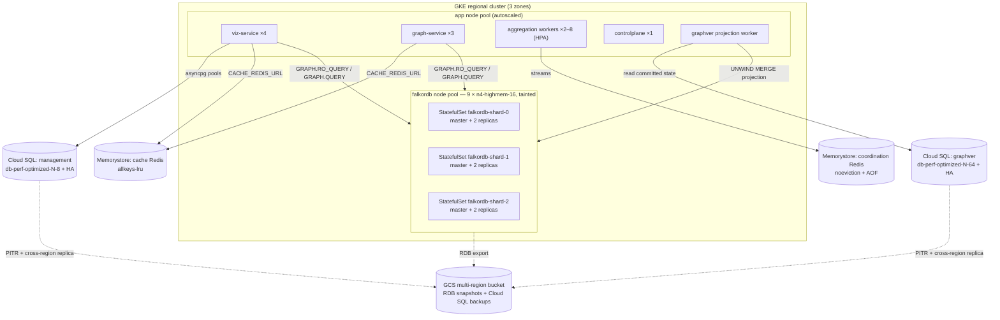

# Infrastructure Scaling Architecture — 250M Nodes & Edges

**Document Version:** 1.0
**Target Environment:** GCP — Cloud SQL for PostgreSQL 16 + GKE (FalkorDB Redis Cluster, 3 StatefulSets)
**Workload:** Read-dominant interactive graph traversal; Postgres-authoritative append-only writes with asynchronous projection

Companion documents — this specification composes with, and does not replace:

- [FALKORDB_DEPLOYMENT.md](./FALKORDB_DEPLOYMENT.md) — cluster routing semantics, client configuration (§7), DR protocol
- [architecture-when-scaling.md](./architecture-when-scaling.md) — application-tier role split (web / worker / controlplane), cache-vs-coordination Redis rules
- [versioning/09-scale-limits-and-roadmap.md](./versioning/09-scale-limits-and-roadmap.md) — measured complexity envelope and known hotspots of the versioned store

---

## 1. Executive Summary

This document specifies the infrastructure required to operate {brand} at **250 million graph elements** (nodes + edges combined, across all workspace graphs):

- **System of record:** Cloud SQL for PostgreSQL 16 (Enterprise Plus), split into a **management instance** and a dedicated **graphver instance** (the versioned node/edge store — the split needs no code change; it is the `GRAPHVER_DB_URL` decoupling designed into `backend/app/services/versioning/config.py`).
- **Graph read layer:** FalkorDB in **Redis Cluster mode**, deployed as **3 StatefulSets (one per shard), 3 pods each** — 9 pods spread across 3 GCP zones. FalkorDB remains a *disposable projection*: any graph can be dropped and rebuilt from Postgres, which is what makes an aggressive-but-recoverable memory posture safe.
- **Supporting Redis:** separate cache and coordination instances per the rules in [architecture-when-scaling.md](./architecture-when-scaling.md).

### 1.1 Design targets

| Dimension | Target |
| :--- | :--- |
| Total graph elements | 250M (planning mix: ~100M nodes, ~150M edges) |
| Largest single graph | ≤ 50M elements (see §1.2 — a graph cannot span shards) |
| Version-history amplification | 3× average versions per live entity (~750M version rows) |
| Interactive trace/neighbors P99 | < 500 ms at depth ≤ 5, viewport-scoped |
| Write path | `O(ops)` interactive edits, `O(changed)` publish — per versioning docs |
| Availability | Zone loss: no read outage, < 1 s write failover per FalkorDB shard; Cloud SQL regional HA |
| RPO / RTO (region loss) | Postgres: RPO ≈ seconds (cross-region replica); FalkorDB: rebuildable, RPO 4–6 h snapshot / RTO ≈ 1 h |
| Utilization ceiling at 250M | ≤ 60–70% of provisioned RAM/storage — headroom is part of the spec, not slack |

### 1.2 Assumptions

> **Assumption 1 — scale shape.** 250M elements are spread across many workspace graphs. Because a FalkorDB graph key lives **entirely on one shard** (Redis Cluster routes the key; it does not split it — `falkordb_connection.py`, FALKORDB_DEPLOYMENT §4/§7), the *largest single graph* drives per-shard RAM, not the total. This plan sizes shards so any graph up to ~50M elements fits with headroom. §4.7 covers the degenerate case of one 250M-element graph.
>
> **Assumption 2 — Postgres flavor.** Cloud SQL for PostgreSQL 16, **Enterprise Plus** edition (data cache, 99.99% SLA, near-zero-downtime maintenance). AlloyDB is a valid substitute with better read scaling at higher cost; self-managed CloudNativePG on GKE trades managed HA/backups for control. Neither changes the application contract (`postgresql+asyncpg://`).
>
> **Assumption 3 — "3 StatefulSets".** One StatefulSet **per Redis Cluster shard** (`falkordb-shard-0/1/2`), each `replicas: 3` (1 master + 2 replicas). This is the same 9-pod / 3-zone topology as FALKORDB_DEPLOYMENT §3, restructured into per-shard StatefulSets for independent failure domains and independent rolling updates.

### 1.3 Topology



---

## 2. Capacity Model

All downstream specs derive from this model. Re-run the arithmetic when the mix changes.

### 2.1 PostgreSQL (graphver instance)

Per-row planning estimates for the hash-partitioned append-only tables (`node_versions`, `edge_versions` — 64 partitions each, `GRAPHVER_PARTITIONS`, **immutable after data**):

| Table | Rows @ 250M live, 3× history | Heap est. | Index est. (ULID PK, `ix_*_entity_hist`, urn, source/target, BRIN) | Subtotal |
| :--- | :--- | :--- | :--- | :--- |
| `node_versions` (~1.1 KB/row: JSONB payload, 64-char blake2b hashes, urn) | ~300M | ~330 GB | ~200 GB | ~530 GB |
| `edge_versions` (~0.6 KB/row) | ~450M | ~270 GB | ~250 GB | ~520 GB |
| `entity_heads` (~250 B/row, mutable) | 250M | ~62 GB | ~50 GB | ~112 GB |
| `commits`, `merkle_nodes`, `working_changes`, `import_rows` | — | — | — | ~100 GB |
| **Total data + indexes** | | | | **~1.3 TB** |

Provision **4 TB SSD** (≈33% utilized at target; Cloud SQL storage autogrows but IOPS scale with provisioned size — 4 TB keeps read IOPS headroom for projection reseeds and vacuum).

### 2.2 FalkorDB resident memory

| Component | Estimate |
| :--- | :--- |
| Nodes: 100M × ~1 KB (labels, urn, properties, label indexes) | ~100 GB |
| Edges: 150M × ~250 B (GraphBLAS matrices + relationship properties) | ~38 GB |
| Overhead ×1.5 (matrix slack, query memory, replication buffers, fragmentation) | → **~210 GB total** |
| Per shard (÷3, balanced placement) | **~70 GB** |
| Largest single graph (50M elements, must fit one shard) | ~45 GB ✓ |

Per-pod `maxmemory 90gb` on 128 GB machines gives ~28% headroom per shard. Not every graph must be resident — FalkorDB is an evictable cache with per-provider RAM budgets (`GRAPHVER_FALKOR_MAX_RESIDENT` / `GRAPHVER_FALKOR_BUDGETS`, dormant by default); enable it at this scale (§4.5) so cold graphs are dropped and rebuilt on demand instead of forcing full residency.

---

## 3. PostgreSQL on GCP (Cloud SQL Enterprise Plus)

### 3.1 Instance topology

| Instance | Tier | Storage | HA | Replicas |
| :--- | :--- | :--- | :--- | :--- |
| `synodic-graphver` | `db-perf-optimized-N-64` (64 vCPU / 512 GB) + data cache | 4 TB SSD | Regional (sync standby) | 1 in-region read replica (wired to the app `READONLY` pool), 1 cross-region DR replica |
| `synodic-mgmt` | `db-perf-optimized-N-8` (8 vCPU / 64 GB) | 256 GB SSD | Regional | 1 cross-region DR replica |

> **Decision.** Split `graphver` onto its own instance from day one at this scale. The store was designed decoupled — set `GRAPHVER_DB_URL` and everything else follows (`versioning/config.py:graphver_db_url()`; no cross-schema FKs exist). This isolates the 750M-row append-only workload (vacuum, WAL volume, reseed scans) from interactive management queries, and lets the two instances be sized, tuned, and failed over independently.

Connectivity: private IP (PSC) only; app connects via the Cloud SQL connector or private DNS. TLS required.

### 3.2 Database flags — `synodic-graphver`

| Flag | Value | Rationale |
| :--- | :--- | :--- |
| `max_connections` | `1000` | Reconciled against the pool budget in §3.3 — never tune pools by raising this first |
| `shared_buffers` | ~`128 GB` (25%) | Enterprise Plus data cache serves the long tail beyond it |
| `effective_cache_size` | `384 GB` | 75% of RAM — favors index scans on the hot `entity_hist`/urn indexes |
| `work_mem` | `64 MB` | Per-sort/hash; bounded because worst-case concurrency is capped by pools |
| `maintenance_work_mem` | `2 GB` | Index builds and vacuum on 64-way partitioned tables |
| `max_wal_size` | `32 GB` | Bulk ingest windows (`IMPORT_COMMIT_WINDOW=50000`) without checkpoint storms |
| `checkpoint_completion_target` | `0.9` | Spread checkpoint I/O |
| `wal_compression` | `lz4` | Version rows are JSONB-heavy and compress well |
| `default_toast_compression` | `lz4` | Cheaper de/compression on payload JSONB |
| `random_page_cost` | `1.1` | SSD |
| `effective_io_concurrency` | `200` | SSD readahead for partition scans |
| `max_parallel_workers` / `..._per_gather` | `32` / `8` | Parallel partition scans for reseeds, merges, exports |
| `autovacuum_max_workers` | `8` | 64 partitions × 2 hot tables need vacuum concurrency |
| `autovacuum_vacuum_insert_scale_factor` | `0.01` | **Critical for append-only tables**: keeps visibility maps fresh so index-only scans stay index-only; default insert thresholds would leave partitions unvacuumed for hundreds of millions of rows |
| `autovacuum_vacuum_cost_limit` | `4000` | Vacuum must outrun ingest |
| `track_io_timing`, `pg_stat_statements` | on | Observability (§8) |

`synodic-mgmt` uses defaults scaled to its size; the only flag worth pinning is `max_connections=500`.

### 3.3 Connection budget (the arithmetic that must always balance)

The app opens **per-role pools** per process (`backend/app/db/engine.py`): WEB 20+10, JOBS 8+4, READONLY 10+5, PROVIDER_PROBE 4+2, ADMIN 2+0 → **65 peak per process**, and viz runs `GUNICORN_WORKERS` processes per pod. Untuned, 4 web pods × 4 workers × 65 = 1,040 connections — over budget on its own.

> **Decision.** At this scale, front both instances with **Cloud SQL Managed Connection Pooling** (or PgBouncer in transaction mode), *and* right-size the per-role pools by tier with the `DB_<ROLE>_POOL_SIZE` / `DB_<ROLE>_POOL_MAX_OVERFLOW` env vars. Pools are per-process bulkheads for fairness; the pooler is the aggregate cap.

Worked example against `synodic-mgmt` (`max_connections=500`):

| Tier | Pods × procs | Per-role env overrides | Peak/process | Tier total |
| :--- | :--- | :--- | :--- | :--- |
| viz web | 4 × 4 | `DB_POOL_SIZE=10`, `DB_POOL_MAX_OVERFLOW=5`, `DB_READONLY_POOL_SIZE=5`, `DB_JOBS_POOL_SIZE=2`, `DB_PROVIDER_PROBE_POOL_SIZE=2` | ~30 | 480 → **~180 via pooler** |
| aggregation workers | 4 × 1 | `DB_JOBS_POOL_SIZE=12`, others minimal | ~20 | 80 |
| controlplane | 1 × 1 | defaults | 65 | 65 |
| stats service | 1 × 1 | `DB_READONLY_POOL_SIZE=5` | ~10 | 10 |
| **Total server-side (pooled)** | | | | **≈ 335 / 500** ✓ |

The graphver instance budget is separate and small: each process opens one graphver pool (`GRAPHVER_POOL_SIZE=10` + `GRAPHVER_POOL_MAX_OVERFLOW=5`); the projection worker plus web/import paths total well under 200 of its 1000. Keep `DB_POOL_PRE_PING=true` (default) so Cloud SQL failovers surface as a ~5 s blip, not stuck connections.

### 3.4 Ingest and maintenance tuning

- Batch knobs at 250M: `GRAPHVER_INGEST_BATCH_SIZE=10000`, `GRAPHVER_PROJECTION_BATCH_SIZE=10000` (from 5000 — larger UNWIND/COPY chunks amortize round trips; watch p99 lock times before going higher), `IMPORT_COMMIT_WINDOW=50000` (default is already sized for bulk).
- BRIN on `commit_seq` plus partition pruning by `graph_id` is the read path — verify plans keep pruning after major version upgrades (`EXPLAIN` in CI smoke).
- Backups: automated daily + PITR (7-day WAL window). Cross-region replica doubles as DR and as a long-scan offload target (exports, audits).

---

## 4. FalkorDB Redis Cluster on GKE — 3 StatefulSets

### 4.1 Node pool

| Item | Spec |
| :--- | :--- |
| GKE cluster | Regional, 3 zones (`us-central1-a/b/c`), Dataplane V2 |
| Pool | `falkordb-pool`: 9 × **`n4-highmem-16`** (16 vCPU / 128 GB), 3 per zone |
| Isolation | Taint `dedicated=falkordb:NoSchedule`; matching toleration on the pods; exactly one FalkorDB pod per node (hostname anti-affinity) |
| Upgrades | Surge upgrades with `maxUnavailable=1`, respecting the per-shard PDBs below |

### 4.2 The three StatefulSets

`falkordb-shard-0`, `falkordb-shard-1`, `falkordb-shard-2` — identical manifests modulo name. Each: `replicas: 3`, its own headless Service, its own PDB (`maxUnavailable: 1`). Zone spread + one-pod-per-node:

```yaml
apiVersion: apps/v1
kind: StatefulSet
metadata:
  name: falkordb-shard-0
  namespace: synodic
spec:
  serviceName: falkordb-shard-0
  replicas: 3
  podManagementPolicy: Parallel
  selector:
    matchLabels: { app.kubernetes.io/name: falkordb, shard: "0" }
  template:
    metadata:
      labels: { app.kubernetes.io/name: falkordb, shard: "0" }
    spec:
      terminationGracePeriodSeconds: 120        # allow final AOF fsync + failover handoff
      tolerations:
        - { key: dedicated, value: falkordb, effect: NoSchedule }
      topologySpreadConstraints:
        - maxSkew: 1
          topologyKey: topology.kubernetes.io/zone
          whenUnsatisfiable: DoNotSchedule
          labelSelector:
            matchLabels: { app.kubernetes.io/name: falkordb, shard: "0" }
      affinity:
        podAntiAffinity:
          requiredDuringSchedulingIgnoredDuringExecution:
            - topologyKey: kubernetes.io/hostname
              labelSelector:
                matchLabels: { app.kubernetes.io/name: falkordb }
      containers:
        - name: falkordb
          image: REGISTRY/synodic-falkordb:v4.16.0     # pinned, never :latest
          ports: [{ containerPort: 6379, name: falkordb }]
          env:
            - name: FALKORDB_ARGS
              value: >-
                THREAD_COUNT 12
                OMP_THREAD_COUNT 4
                CACHE_SIZE 50
                QUERY_MEM_CAPACITY 4294967296
                TIMEOUT_DEFAULT 30000
                TIMEOUT_MAX 120000
                RESULTSET_SIZE 100000
                MAX_QUEUED_QUERIES 200
                VKEY_MAX_ENTITY_COUNT 1000000
          resources:
            requests: { cpu: "14", memory: 118Gi }
            limits:   { cpu: "16", memory: 120Gi }     # requests≈limits: this node is the pod's
          readinessProbe:
            exec: { command: ["redis-cli", "ping"] }
            periodSeconds: 5
          livenessProbe:
            exec: { command: ["redis-cli", "ping"] }
            initialDelaySeconds: 60          # RDB load of a 90 GB keyspace is minutes, not seconds
            periodSeconds: 10
            failureThreshold: 6
          volumeMounts:
            - { name: data, mountPath: /data }
            - { name: conf, mountPath: /etc/redis }
  volumeClaimTemplates:
    - metadata: { name: data }
      spec:
        accessModes: ["ReadWriteOnce"]
        storageClassName: hyperdisk-balanced        # or premium-rwo (pd-ssd)
        resources: { requests: { storage: 500Gi } }
```

### 4.3 Redis configuration (per pod, via ConfigMap)

```conf
cluster-enabled yes
cluster-node-timeout 5000
cluster-require-full-coverage no      # a dead shard must not take down reads on the other two
cluster-migration-barrier 1
maxmemory 90gb
maxmemory-policy noeviction           # graph keys must never be silently evicted by Redis;
                                      # eviction is the application's job (§4.5)
appendonly yes
appendfsync everysec
save 3600 1                           # hourly RDB floor; DR export job triggers explicit BGSAVE
repl-backlog-size 512mb               # survive transient replica disconnects without full resync
repl-diskless-sync yes
client-output-buffer-limit replica 4gb 2gb 60
```

Sizing rationale: `maxmemory 90gb` ≈ 70% of the 128 GB node — the remainder covers AOF/RDB fork copy-on-write, replica output buffers, and query execution memory. PVC 500 Gi ≈ 2.5× `maxmemory` + AOF growth between rewrites. `THREAD_COUNT 12` (not 16) reserves cores for Redis I/O, AOF rewrite, and replication; `QUERY_MEM_CAPACITY` 4 GiB bounds any single runaway Cypher query; `TIMEOUT_MAX` caps operator-supplied timeouts.

### 4.4 Cluster bootstrap and graph placement

- **Bootstrap** (one-time Job): `redis-cli --cluster create` over the three shard-`0` pods' stable DNS names (`falkordb-shard-{0,1,2}-0.falkordb-shard-{0,1,2}.synodic.svc`) splitting the 16,384 slots three ways; then `CLUSTER MEET` + `CLUSTER REPLICATE` for ordinals 1–2 of each StatefulSet against their shard master. A FalkorDB operator/KubeBlocks may own this instead; the invariant to preserve is *shard N's members are exactly StatefulSet N's pods*.
- **Placement:** a graph's shard = `keyslot(graph_name)` — deterministic, not load-aware. Monitor per-shard `used_memory`; when skewed, rebalance by *moving graphs* (dump/rebuild from Postgres onto a renamed key or after slot migration), not by resharding hot slots live. The registry (`falkor_graph_registry.py`) plus rebuild-from-Postgres makes moves cheap and safe.
- **Application wiring** (per FALKORDB_DEPLOYMENT §7): `FALKORDB_MODE=cluster`, `FALKORDB_CLUSTER_NODES=falkordb-shard-0-0...:6379,falkordb-shard-1-0...:6379,falkordb-shard-2-0...:6379` (any three; the client discovers topology and follows `MOVED`). Reads use `GRAPH.RO_QUERY` and load-balance to the shard's replicas; sustained routing failures trip the per-provider circuit breaker.

### 4.5 Mandatory application settings in cluster mode at 250M

| Setting | Value | Why |
| :--- | :--- | :--- |
| `CACHE_REDIS_URL` | dedicated cache Redis (§5) | The provider's ancestor/idempotency cache needs cross-slot SCAN/pipelines a cluster can't serve; without it the provider runs cache-disabled and logs loudly |
| `AGGREGATION_STREAMING_REBUILD_ENABLED` | `true` (default — do not disable) | Constant-memory, crash-resumable aggregation instead of full-graph in-memory pair accumulation |
| `AGGREGATION_MAX_PAIRS_PER_PAGE` | `200000` (default) | Bounds high-fan-in hub pages |
| `GRAPHVER_FALKOR_MAX_RESIDENT` / `GRAPHVER_FALKOR_BUDGETS` | set per provider ≈ shard `maxmemory` × 0.8 | Turns on cold-graph eviction so residency tracks the working set, not the full 250M corpus |
| `GRAPHVER_PROJECTION_CONCURRENCY` | `8` (default; raise with worker CPU) | Keeps hundreds of graphs' projections caught up |
| `GRAPHVER_READ_MAX_LAG` | `0` (strict) — consider small >0 during bulk imports | Governs FalkorDB-vs-Postgres read freshness fallback |

### 4.6 Failure behavior (delta vs FALKORDB_DEPLOYMENT §5)

The recovery scenarios in FALKORDB_DEPLOYMENT §5 apply unchanged — the 3-StatefulSet layout improves on them operationally:

| Event | Behavior |
| :--- | :--- |
| Pod/node loss | Shard's surviving replica promoted (< 1 s writes); GKE reschedules onto the tainted pool, PV reattaches, differential sync |
| Zone loss | Every shard retains ≥ 1 master + 1 replica in surviving zones (the zonal spread guarantees it); reads never fall back onto masters |
| Rolling update | Per-StatefulSet, replicas-first, PDB `maxUnavailable: 1`; shards update independently — a stuck rollout on shard 1 cannot block shards 0/2 |
| Full-cluster data loss | **Acceptable by design**: every graph rebuilds from Postgres (`O(N·E)` seed or streaming projection); DR snapshots (§7) only shorten the rebuild, they are not the source of truth |

### 4.7 Sensitivity: one 250M-element graph

If a single graph must hold ~250M elements (~210 GB resident), it cannot be spread — one shard must hold it. The vertical path: move `falkordb-pool` to `n4-highmem-32` (256 GB) or `-48`, `maxmemory` ≈ 180 GB+, same 3-StatefulSet topology. Beyond that, the horizontal options are application-level: split the graph (per-domain subgraphs traversed via the `AGGREGATED` rollup layer) or lean on `GRAPHVER_READ_MAX_LAG` + Postgres-compose reads for the cold portion. Flag this early — it is a data-model conversation, not an infrastructure knob.

---

## 5. Supporting Redis (cache + coordination)

Per [architecture-when-scaling.md](./architecture-when-scaling.md) these are **never combined**, and never colocated with FalkorDB:

| Instance | Serves | Spec | Policy |
| :--- | :--- | :--- | :--- |
| `synodic-redis-cache` | `CACHE_REDIS_URL`, `REDIS_CACHE_URL` | Memorystore 10 GB, Standard (HA) | `allkeys-lru`, persistence off |
| `synodic-redis-coord` | `REDIS_COORDINATION_URL` (aggregation streams, locks, rate limits) | Memorystore 5 GB, Standard (HA) | `noeviction`, AOF/persistence on |

---

## 6. Application Tier at 250M

Tier shape per [architecture-when-scaling.md](./architecture-when-scaling.md); sizing that matters at this scale:

| Tier | Replicas | Notes |
| :--- | :--- | :--- |
| viz web | 4 (HPA to 8 on CPU/RPS) | `GUNICORN_WORKERS=4`; pool overrides per §3.3 |
| graph-service | 3 | Read-heavy; scales with trace QPS |
| aggregation workers | 2–8 (HPA on stream lag) | `JOBS` pool sized up; graceful SIGTERM drain ≤ 60 s |
| graphver projection worker | 1 (Recreate) | `GRAPHVER_PROJECTION_CONCURRENCY=8`, health on `GRAPHVER_WORKER_HEALTH_PORT` |
| controlplane | 1 (Recreate) | Scheduler, outbox relay, Alembic gate |

App node pool: `n4-standard-8`, autoscaled 6–16 nodes across 3 zones.

---

## 7. Disaster Recovery

| Layer | Mechanism | RPO | RTO |
| :--- | :--- | :--- | :--- |
| Cloud SQL (both) | PITR + cross-region replica; promote on region loss | seconds | minutes (promote + repoint `*_DB_URL`) |
| FalkorDB | CronJob: `BGSAVE` → copy RDBs to multi-region GCS every 4–6 h (FALKORDB_DEPLOYMENT §6); cold-standby GKE in secondary region | 4–6 h *for the cache*; **effective RPO = Postgres RPO** since graphs rebuild from the promoted graphver instance | ≈ 1 h (restore RDBs, or reseed hot graphs directly) |
| Cutover | Multi-Cluster Ingress / global LB repoint | — | minutes |

> **Invariant.** DR never treats FalkorDB as data. If snapshots and Postgres disagree, Postgres wins and the graph is reseeded.

---

## 8. Observability & Alerting

| Layer | Metric | Alert at |
| :--- | :--- | :--- |
| Cloud SQL | connections vs `max_connections` | > 80% |
| | replication lag (HA standby / read replica) | > 30 s |
| | oldest un-vacuumed partition age / dead+insert tuples | insert-vacuum not keeping up |
| | p99 query latency, `pg_stat_statements` top-N | SLO regression |
| App pools | per-role pool saturation & wait time (`db_metrics.py` middleware) | waiters > 0 sustained |
| FalkorDB | `used_memory` / `maxmemory` per shard | > 80% (page), > 70% (ticket + rebalance) |
| | `cluster_state`, per-shard master count | anything ≠ ok / ≠ 1 |
| | replication offset lag per replica | > 60 s |
| | slowlog / query timeouts, `MAX_QUEUED_QUERIES` rejections | sustained |
| Projection | `projection_state` watermark lag (projected vs committed `commit_seq`) | > `GRAPHVER_READ_MAX_LAG` + margin — this is the user-facing freshness SLO |
| Aggregation | `aggregation.jobs` stream lag (`XLEN` vs consumer last-id) | growing for > 10 min |
| GKE | pod restarts in falkordb pool, PDB violations, PV utilization | any |

---

## 9. Known Scaling Risks at 250M (and their mitigations)

From [versioning/09-scale-limits-and-roadmap.md](./versioning/09-scale-limits-and-roadmap.md) — these are properties of the software, restated here because the infrastructure must absorb them:

1. **Full FalkorDB seed is `O(N·E)` and composes live state in memory.** Mitigation: streaming rebuild stays enabled (§4.5); a 50M-element reseed is a *minutes-long, IOPS-heavy* event on the graphver instance — the 4 TB/IOPS headroom in §2.1 exists for this. Schedule bulk reseeds off-peak.
2. **Draft-checkpoint Merkle rebuild is `O(graph)` at the top levels.** Watch checkpoint latency on graphs > 10M elements; the roadmap item (incremental Merkle) becomes funded work when p99 checkpoint > seconds.
3. **Hot single partition / hot shard.** HASH(`graph_id`) means one huge graph concentrates load on 1 of 64 Postgres partitions *and* 1 of 3 FalkorDB shards. Mitigations: §4.7 vertical path, graph-splitting conversation, and per-shard memory alerts firing well before saturation.
4. **Retention/GC gap.** 3× version amplification is the *planning* number; without retention, history grows unbounded. Track `node_versions`/`edge_versions` row counts monthly against §2.1; fund the GC roadmap item before 2× the estimate.

---

## 10. Rollout & Validation

Phased, each gate verifiable before the next:

1. **Split graphver** → provision `synodic-graphver`, replicate schema (Alembic `graphver` migrations), backfill, set `GRAPHVER_DB_URL`, verify with dual-read counts → cut over. *Gate: zero drift between instances for 24 h.*
2. **Stand up the FalkorDB cluster** → node pool, 3 StatefulSets, bootstrap Job, DR snapshot CronJob. *Gate: kill a pod and a zone's pods in staging; failover < 1 s, no read errors.*
3. **Repoint providers** → `FALKORDB_MODE=cluster` + `CACHE_REDIS_URL` on one canary provider via `extra_config.falkordbConnection`, then fleet-wide env. *Gate: `MOVED` handling and RO-query replica reads observed in metrics.*
4. **Load validation** → seed a synthetic 50M-element graph (`backend/scripts/seed_falkordb.py`) + representative multi-graph corpus; run `loadtest/` trace/neighbors mixes. *Acceptance: §1.1 latency targets at ≤ 70% shard memory, connection budget ≤ 80%, projection watermark lag within SLO during a concurrent bulk import.*
5. **DR drill** → restore RDBs + promote cross-region replica in the standby region; measure RTO against §7.

---

## Appendix A — Environment variable summary (all verified against the codebase)

| Var | Where set | Value at 250M |
| :--- | :--- | :--- |
| `MANAGEMENT_DB_URL` | all backend tiers | pooled DSN → `synodic-mgmt` |
| `GRAPHVER_DB_URL` | all backend tiers | pooled DSN → `synodic-graphver` |
| `DB_<ROLE>_POOL_SIZE` / `DB_<ROLE>_POOL_MAX_OVERFLOW` | per tier | §3.3 table |
| `DB_POOL_PRE_PING` | default `true` | keep |
| `GRAPHVER_POOL_SIZE` / `GRAPHVER_POOL_MAX_OVERFLOW` | per tier | 10 / 5 (defaults) |
| `GRAPHVER_INGEST_BATCH_SIZE` / `GRAPHVER_PROJECTION_BATCH_SIZE` | ingest/projection tiers | 10000 |
| `GRAPHVER_PROJECTION_CONCURRENCY` | projection worker | 8 |
| `GRAPHVER_READ_MAX_LAG` | web tiers | 0 (strict) |
| `GRAPHVER_FALKOR_MAX_RESIDENT` / `GRAPHVER_FALKOR_BUDGETS` | projection worker | ≈ shard `maxmemory` × 0.8 per provider |
| `FALKORDB_MODE` | web/graph/projection tiers | `cluster` |
| `FALKORDB_CLUSTER_NODES` | same | three shard-0 pod DNS names |
| `FALKORDB_TLS_*` | same | per security posture |
| `CACHE_REDIS_URL` | same | `synodic-redis-cache` |
| `REDIS_CACHE_URL` / `REDIS_COORDINATION_URL` | per architecture-when-scaling.md | cache / coord instances |
| `AGGREGATION_STREAMING_REBUILD_ENABLED` | workers | `true` (default) |
| `AGGREGATION_MAX_PAIRS_PER_PAGE` | workers | 200000 (default) |
| `IMPORT_COMMIT_WINDOW` | import worker | 50000 (default) |
