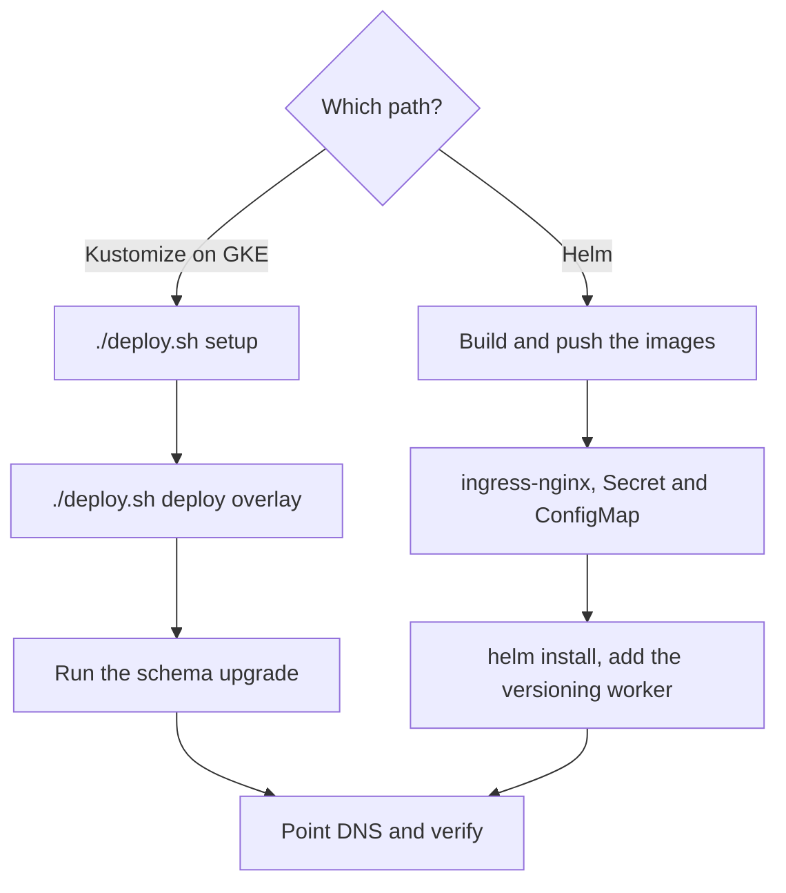

# Deploying on Kubernetes

*For platform operators.*

Run {brand} on a Kubernetes cluster — with the kustomize manifests built for GKE, or with the
Helm chart — then verify it, harden it and keep it upgraded. Prefer a single server? Use
[Self-Host Deployment](/docs/deployment) instead.

> **Before you start:** you need `kubectl` access to the cluster, Docker to build the images,
> and a container registry the cluster can pull from. The
> [Production hardening checklist](/docs/deployment#production-hardening-checklist) applies
> here too; [Turn on the production settings](#turn-on-the-production-settings) shows where
> each setting goes on Kubernetes.



## Choose a path

| If you want … | Choose … | Because … |
|---|---|---|
| GKE, an overlay per environment, Google-managed TLS, and Cloud SQL plus Memorystore in production | **Kustomize** (`deploy/k8s`) | `deploy.sh` builds, pushes, creates the secrets and applies an overlay in one command |
| Any cluster behind ingress-nginx, configured with Helm values | **Helm** (`deploy/helm/dataviz`) | The chart runs the schema migration for you and holds every backend pod until it's done |

The two are not equivalent. What each one actually deploys:

| | Kustomize (`deploy/k8s`) | Helm (`deploy/helm/dataviz`) |
|---|---|---|
| Driven by | `deploy/k8s/deploy.sh` and its `Makefile`; settings in `deploy/k8s/.env.deploy` | `helm install` / `helm upgrade` with values |
| Edge | GKE Ingress, Google-managed certificate, reserved static IP, HTTP→HTTPS redirect | ingress-nginx `Ingress`, plain HTTP — you add TLS |
| Postgres and Redis | In the cluster for dev and staging; Cloud SQL and Memorystore for production | External by default; in-cluster Redis and FalkorDB are opt-in |
| FalkorDB | In-cluster StatefulSet; a 3-shard cluster overlay | External by default; in-cluster opt-in (`stores.falkordb.enabled`) |
| Schema migrations | **Not run** — you run them ([known gap](#known-gaps-and-their-workarounds)) | A pre-install / pre-upgrade Job (a first install needs one manual step — [known gap](#known-gaps-and-their-workarounds)); a `wait-for-schema` init container on every backend pod |
| Versioning worker | Yes | **Not deployed** ([known gap](#known-gaps-and-their-workarounds)) |
| NetworkPolicies | Shipped (deny all ingress, then allow-list) | Opt-in (`networkPolicy.enabled`) |
| Graph-store backups | A CronJob in the production overlay | None |

## Known gaps and their workarounds

- **The kustomize manifests run no schema migration.** On a fresh install, and before you roll
  out any release that changes the schema, run the schema upgrade yourself:
  [Run the schema upgrade](#run-the-schema-upgrade). Until it has run, `viz-service` reports
  not ready.
- **The Helm chart's schema Job can't start on a first install by itself.** It runs before the
  chart creates anything, yet reads the chart's `dataviz-config` ConfigMap and its Secret. Create
  both first: [Prepare the database, Secret and ConfigMap](#prepare-the-database-secret-and-configmap).
- **The Helm chart deploys no versioning worker,** and the API pods don't run its loop
  either. Without it, nothing runs **Enable version control**, finishes the graph-store
  projections the API hands off, or runs purges — and on a first install the version
  store's tables don't exist at all, because the schema Job builds a new database without
  them and the worker creates them when it first starts. Add one:
  [Add the versioning worker](#add-the-versioning-worker).
- **The kustomize FalkorDB StatefulSets mount their data volume at the wrong path,** so the
  graph store's writes don't reach the volume. Fix it before you load data:
  [Keep FalkorDB's data on its volume](#keep-falkordbs-data-on-its-volume).

## Prerequisites

- A Kubernetes cluster, and `kubectl` pointed at it.
- Docker, logged in to a registry the cluster can pull from.
- **Kustomize path:** a GCP project, `gcloud` (authenticated), `make` and `envsubst` (from
  gettext). `deploy.sh` checks for `gcloud`, `kubectl` and `docker`; the `Makefile` needs the
  other two.
- **Helm path:** Helm 3, a Postgres that already exists and is reachable from the cluster
  (the schema Job runs before the chart creates anything, so the chart's own
  `stores.postgres` can't serve a first install), and a source for the ingress-nginx chart.
- A DNS name you can point at the cluster's entry point.

## Build and push the images

**Kustomize** — `./deploy.sh deploy` builds and pushes for you, tagging the images with the
current commit (`git rev-parse --short HEAD`) and pushing to `REGISTRY` from `.env.deploy`.
To do it on its own:

```bash
make -C deploy/k8s build push TAG=<tag>
```

It builds `viz-service`, `aggregation-controlplane`, `aggregation-worker`, `stats-service`,
`frontend`, `seed` and a `falkordb` image from `data/quickstart/Dockerfile.falkordb`, which
has demo data built in.

**Helm** — the chart pulls `<registry>/<org>/<name>:<tag>` and needs six images, including
the schema-upgrade image `synodic-upgrade`. Build them from the repository root:

```bash
REGISTRY=<registry> ORG=<org> TAG=<tag>
for image in \
  viz-service:backend/Dockerfile.viz \
  aggregation-controlplane:backend/Dockerfile.controlplane \
  aggregation-worker:backend/Dockerfile.aggregation \
  stats-service:backend/Dockerfile.insights \
  frontend:frontend/Dockerfile \
  synodic-upgrade:backend/Dockerfile.upgrade
do
  name=${image%%:*}; dockerfile=${image#*:}
  docker build -f "$dockerfile" -t "$REGISTRY/$ORG/$name:$TAG" . &&
    docker push "$REGISTRY/$ORG/$name:$TAG" || break
done
```

Add `seed:backend/Dockerfile.seed` to the list if you set `seed.enabled=true`.

> **Note:** `deploy/build-images.sh` is out of date — it stops at an image for a retired
> service and doesn't build `synodic-upgrade`. Use the loop above.

## Deploy with kustomize (GKE)

### Set up once

1. From `deploy/k8s`, run the setup wizard:

   ```bash
   cd deploy/k8s
   ./deploy.sh setup
   ```

   It asks for the GCP project, region, domain, cluster name and admin email; enables the
   APIs; creates the `synodic` Artifact Registry; creates an Autopilot or Standard cluster
   (or skips, for an existing one); reserves the global static IP `synodic-ip`; generates the
   secrets; and writes everything to `.env.deploy`, readable only by you.
2. Point your domain's A record at the static IP it prints.

> **Warning:** run `setup` once per environment. Running it again generates new secrets and
> overwrites `.env.deploy`: a new `JWT_SECRET_KEY` signs everyone out, a new
> `CREDENTIAL_ENCRYPTION_KEY` makes stored credentials unreadable, and a new
> `POSTGRES_PASSWORD` no longer matches the database. Keep `.env.deploy` in your secrets store.

### Deploy an overlay

1. Put your host name in the overlay: edit both the `Ingress` rule and the
   `ManagedCertificate` domain in `deploy/k8s/overlays/<overlay>/patches/ingress-patch.yaml`
   (they ship with example names).
2. Set your public origin for the API — see
   [Turn on the production settings](#turn-on-the-production-settings); the base
   `viz-service` Deployment ships an example value.
3. For the `production` overlay, fill in its managed data tier first:
   [Use managed Postgres and Redis](#use-managed-postgres-and-redis).
4. Deploy. The overlay is `dev`, `staging` or `production`:

   ```bash
   ./deploy.sh deploy <overlay>
   ```

   It builds and pushes the images, creates the `synodic` namespace and the `db-credentials`
   and `app-secrets` Secrets from `.env.deploy`, and applies the overlay. It ends with
   **Deployment Complete!** and a reminder that the Ingress and certificate can take
   10–15 minutes.
5. Run the schema upgrade — next section.

Every overlay deploys into the `synodic` namespace, so run one environment per cluster.
`./deploy.sh deploy` accepts `dev`, `staging` and `production`; for other overlays use
`make -C deploy/k8s apply OVERLAY=<overlay> TAG=<tag>`, which also renders both Secrets
from `.env.deploy`.

### Run the schema upgrade

Nothing in the kustomize manifests migrates the database, so run the schema upgrade as a
one-off Job — after the first deploy, and before applying any release that changes the
schema. It uses the `viz-service` image, which contains the upgrade command.

1. Save this as `schema-upgrade.yaml`, with the image your release uses. On the first
   install that's the image already running —
   `kubectl -n synodic get deployment viz-service -o jsonpath='{.spec.template.spec.containers[0].image}'`.

   ```yaml
   apiVersion: batch/v1
   kind: Job
   metadata:
     name: schema-upgrade
     namespace: synodic
   spec:
     backoffLimit: 3
     template:
       metadata:
         labels:
           app.kubernetes.io/name: schema-upgrade
           # lets the base NetworkPolicy admit it to the in-cluster Postgres
           app.kubernetes.io/component: worker
       spec:
         restartPolicy: Never
         serviceAccountName: synodic-backend
         containers:
           - name: upgrade
             image: <registry>/viz-service:<tag>
             command: ["python", "-m", "backend.scripts.upgrade", "upgrade"]
             env:
               - name: MANAGEMENT_DB_URL
                 valueFrom:
                   secretKeyRef:
                     name: db-credentials
                     key: MANAGEMENT_DB_URL
   ```

2. On `dev` and `staging`, wait for the in-cluster Postgres first:
   `kubectl -n synodic rollout status statefulset/postgres`.
3. Run it and wait for it to finish:

   ```bash
   kubectl -n synodic delete job schema-upgrade --ignore-not-found
   kubectl apply -f schema-upgrade.yaml
   kubectl -n synodic wait --for=condition=complete job/schema-upgrade --timeout=15m
   kubectl -n synodic logs job/schema-upgrade | tail -n 3
   ```

   `wait` prints `job.batch/schema-upgrade condition met`, and the log ends with a line
   containing `Upgrade complete`. If it doesn't finish, the log says why.
4. On a first install, restart the API so it re-runs its startup checks and creates the first
   administrator:

   ```bash
   kubectl -n synodic rollout restart deployment/viz-service
   kubectl -n synodic rollout status deployment/viz-service
   ```

Sign in with `ADMIN_EMAIL` and `ADMIN_PASSWORD` from `.env.deploy`.

### NetworkPolicies on clusters that enforce them

The base ships NetworkPolicies: deny all ingress, then allow the web tier to the API, the API
to the control plane, the app's own pods to Postgres, Redis and FalkorDB, and anything to the
web tier on port 80. They only take effect on clusters that enforce NetworkPolicy — GKE
Autopilot does. There, anything else that connects needs an allow rule of yours:

- `aggregation-worker` and `stats-service` wait for the control plane on port 8091 in their
  init container, and only `viz-service` is admitted to it. Add this policy to your overlay's
  `resources:`:

  ```yaml
  apiVersion: networking.k8s.io/v1
  kind: NetworkPolicy
  metadata:
    name: allow-workers-to-controlplane
    namespace: synodic
  spec:
    podSelector:
      matchLabels:
        app.kubernetes.io/name: aggregation-controlplane
    policyTypes:
      - Ingress
    ingress:
      - from:
          - podSelector:
              matchLabels:
                app.kubernetes.io/name: aggregation-worker
          - podSelector:
              matchLabels:
                app.kubernetes.io/name: stats-service
        ports:
          - protocol: TCP
            port: 8091
  ```

- Your Prometheus, to the scrape ports — see [Observability](/docs/observability#turn-on-metrics).
- The production overlay's graph-store backup CronJob, to `falkordb` on port 6379.
- In the [production cluster overlay](/docs/kubernetes-cluster-overlay), clients and the
  shards themselves, to the shard pods on 6379 and 16379.

## Deploy with Helm

### Install the ingress controller

Set `INGRESS_NGINX_CHART_REPO` to an ingress-nginx chart repository your cluster can reach —
the project's own, or your organisation's mirror of it — then:

```bash
helm upgrade --install ingress-nginx ingress-nginx \
  --repo "$INGRESS_NGINX_CHART_REPO" \
  --namespace ingress-nginx --create-namespace
```

**Verify:** `kubectl -n ingress-nginx get svc ingress-nginx-controller` shows an
`EXTERNAL-IP`. Point your DNS name at it.

### Prepare the database, Secret and ConfigMap

The schema Job runs as a pre-install hook — before the chart creates any of its own
resources — and reads its settings from the Secret and from the chart's `dataviz-config`
ConfigMap, so both have to exist first. Create the Secret yourself and give the chart its
name; create an empty ConfigMap that the chart takes over.

1. Prepare Postgres: a `synodic` database owned by a `synodic` role with a strong password.
   The SQL in `deploy/postgres-init/` is the reference; use your own password. The schema Job
   creates everything inside the database.
2. Create the namespace and the Secret:

   ```bash
   kubectl create namespace <namespace>
   kubectl -n <namespace> create secret generic <secret-name> \
     --from-literal=MANAGEMENT_DB_URL='postgresql+asyncpg://synodic:<db-password>@<pg-host>:5432/synodic' \
     --from-literal=REDIS_URL='redis://<redis-host>:6379/0' \
     --from-literal=JWT_SECRET_KEY="$(openssl rand -hex 48)" \
     --from-literal=ADMIN_PASSWORD='<admin-password>' \
     --from-literal=CREDENTIAL_ENCRYPTION_KEY="$(openssl rand -base64 32 | tr '+/' '-_')" \
     --from-literal=AGGREGATION_INTERNAL_TOKEN="$(openssl rand -hex 32)"
   ```

   Every backend pod reads every key of this Secret, which is also how the production settings
   reach them.
3. Create the empty ConfigMap, labelled so that Helm adopts it into the release and fills it
   in. The release name and namespace must match the ones you install with:

   ```bash
   kubectl -n <namespace> create configmap dataviz-config
   kubectl -n <namespace> label configmap dataviz-config app.kubernetes.io/managed-by=Helm
   kubectl -n <namespace> annotate configmap dataviz-config \
     meta.helm.sh/release-name=dataviz meta.helm.sh/release-namespace=<namespace>
   ```

   The schema Job needs only `MANAGEMENT_DB_URL` from the Secret, so an empty ConfigMap is
   enough for it to start.

### Install the chart

```bash
helm install dataviz deploy/helm/dataviz -n <namespace> \
  --set image.registry=<registry> --set image.org=<org> --set image.tag=<tag> \
  --set ingress.host=<host> \
  --set config.corsAllowedOrigins=https://<host> \
  --set config.falkordb.host=<falkordb-host> \
  --set config.jwt.expiryMinutes=15 \
  --set secrets.create=false --set secrets.existingSecret=<secret-name> \
  --set dbInit.enabled=false
```

- `config.jwt.expiryMinutes=15` matters: the chart defaults to 60, above the 15-minute ceiling
  that `ENV=production` enforces.
- `dbInit.enabled=false` skips the chart's database-bootstrap Job, because you prepared the
  database yourself.
- To run Redis and FalkorDB in the cluster instead, add `--set stores.redis.enabled=true
  --set stores.falkordb.enabled=true`, set `config.falkordb.host=falkordb`, and use
  `redis://redis:6379/0` as `REDIS_URL`.

The pre-install hook runs the schema Job (`dataviz-upgrade`); every backend pod then waits in
its `wait-for-schema` init container until the schema matches its image.

### Add the versioning worker

The chart has no Deployment for it. Mirror the aggregation worker, with the versioning command.
Save as `versioning-worker.yaml`:

```yaml
apiVersion: apps/v1
kind: Deployment
metadata:
  name: versioning-worker
  labels:
    app.kubernetes.io/name: versioning-worker
spec:
  replicas: 1
  selector:
    matchLabels:
      app.kubernetes.io/name: versioning-worker
  template:
    metadata:
      labels:
        app.kubernetes.io/name: versioning-worker
        app.kubernetes.io/part-of: dataviz
    spec:
      terminationGracePeriodSeconds: 60
      containers:
        - name: versioning-worker
          image: <registry>/<org>/aggregation-worker:<tag>
          command: ["python", "-m", "backend.app.services.versioning"]
          envFrom:
            - configMapRef:
                name: dataviz-config
            - secretRef:
                name: <secret-name>
          env:
            - name: SYNODIC_ROLE
              value: "worker"
            - name: FALKORDB_SOCKET_TIMEOUT
              value: "60"
```

```bash
kubectl -n <namespace> apply -f versioning-worker.yaml
kubectl -n <namespace> logs deploy/versioning-worker | grep "projection worker starting"
```

The log shows `versioning projection worker starting`. It has no health endpoint, so it has
no probes. Update its image tag whenever you upgrade the chart. If you turned on the chart's
`networkPolicy.enabled` with in-cluster stores, those policies admit only the pods they name;
extend them for this one.

### Put TLS in front

The chart's `Ingress` has no TLS section, and session cookies are `Secure` by default, so
browsers won't keep a session over plain HTTP. Terminate TLS in front of it — give the
ingress-nginx controller a default certificate (its `--default-ssl-certificate` flag), or
put a TLS load balancer in front of the controller — and keep `config.corsAllowedOrigins`
on `https://`.

## Verify the deployment

1. Every pod is `Running` and `Ready`:
   `kubectl -n <namespace> get pods` (the kustomize namespace is `synodic`).
2. The web tier answers: `curl -s https://<host>/health` returns
   `{"status":"healthy","service":"frontend"}`.
3. The API answers through it: `curl -s https://<host>/api/v1/health` returns
   `{"status":"live","version":"0.2.0"}`.
4. The API is ready — database reachable, schema current:

   ```bash
   kubectl -n <namespace> exec deploy/viz-service -- curl -s localhost:8000/api/v1/health/ready
   ```

   The JSON says `"status":"ready"` and `"schema_at_head":true`.
5. Kustomize only: `kubectl -n synodic get managedcertificate` shows `Active` once DNS
   resolves to the static IP.

No DNS yet? `kubectl -n <namespace> port-forward svc/frontend 8080:80`, then open
`http://localhost:8080`.

## Environment overlays and AUTH_ENVIRONMENT_ID

| Overlay | `AUTH_ENVIRONMENT_ID` | Postgres and Redis | Log level | Also |
|---|---|---|---|---|
| `dev` | `dev` | In the cluster | `DEBUG` | Smallest resource requests |
| `staging` | `staging` | In the cluster | `INFO` | Base sizing |
| `production` | `production` | Cloud SQL and Memorystore | `WARNING` | 3 replicas, autoscaling from 3, anti-affinity, graph-store backup CronJob |
| `production-cluster` | `production` (inherited) | As production | `WARNING` | FalkorDB as a 3-shard cluster — see [the cluster overlay](/docs/kubernetes-cluster-overlay) |

Each overlay sets its own `AUTH_ENVIRONMENT_ID` in `patches/auth-environment.yaml`. It scopes
the session cookie names and the token issuer, so environments open in the same browser don't
sign each other out. To add an environment, copy an overlay, give it a new, unique id there,
and set its host names. Changing an id later signs that environment's users out once. With
Helm, set `config.jwt.environmentId`. Background:
[Running several environments side by side](/docs/multi-environment-sessions).

## Turn on the production settings

These are the [hardening checklist](/docs/deployment#production-hardening-checklist) settings,
placed for Kubernetes.

**Kustomize.** `.env.deploy` already carries a generated `AGGREGATION_INTERNAL_TOKEN`,
`CREDENTIAL_ENCRYPTION_KEY` and `ADMIN_PASSWORD`, the base sets `JWT_EXPIRY_MINUTES` to 15,
and the GKE Ingress terminates TLS. Add the rest as a patch in your overlay:

1. Create `deploy/k8s/overlays/<overlay>/patches/production-settings.yaml`:

   ```yaml
   apiVersion: v1
   kind: ConfigMap
   metadata:
     name: common-config
     namespace: synodic
   data:
     ENV: "production"
     ALLOWED_HOSTS: "<host>"
   ---
   apiVersion: apps/v1
   kind: Deployment
   metadata:
     name: viz-service
     namespace: synodic
   spec:
     template:
       spec:
         containers:
           - name: viz-service
             env:
               - name: CORS_ALLOWED_ORIGINS
                 value: "https://<host>"
   ```

2. List it under `patches:` in the overlay's `kustomization.yaml`:
   `- path: patches/production-settings.yaml`.
3. Deploy the overlay, then restart the pods so they read the new ConfigMap values:
   `kubectl -n synodic rollout restart deployment`.

**Helm.** Add the settings to your Secret — every backend pod reads all of its keys — and
restart:

```bash
kubectl -n <namespace> patch secret <secret-name> --type merge \
  -p '{"stringData":{"ENV":"production","ALLOWED_HOSTS":"<host>"}}'
kubectl -n <namespace> rollout restart deployment
```

Keep `config.jwt.expiryMinutes=15` and an `https://` `config.corsAllowedOrigins`, as in
[Install the chart](#install-the-chart).

**Verify:** `kubectl -n <namespace> exec deploy/viz-service -- printenv ENV` prints
`production`, and the control plane's log has `Control Plane internal auth ENABLED`. Metrics:
[Observability](/docs/observability#turn-on-metrics).

## Manage secrets

**Kustomize.** `make apply` renders `app-secrets` and `db-credentials` from the templates in
`deploy/k8s/base/secrets/` on every apply, filling them in from `.env.deploy`;
`./deploy.sh deploy` creates them from the same file first.

| Secret | Values it takes from `.env.deploy` |
|---|---|
| `db-credentials` | `POSTGRES_PASSWORD`, which also goes into `MANAGEMENT_DB_URL` (with `DB_HOST` on `production`) |
| `app-secrets` | `JWT_SECRET_KEY`, `JWT_SECRET_KEY_PREVIOUS`, `CREDENTIAL_ENCRYPTION_KEY`, `ADMIN_EMAIL`, `ADMIN_PASSWORD`, `AGGREGATION_INTERNAL_TOKEN`, `REDIS_STREAMS_PASSWORD`, `REDIS_CACHE_PASSWORD` |

**Rotate a secret:**

1. Change it in `.env.deploy` (kustomize) or in your Secret (Helm).
2. Apply it: `./deploy.sh deploy <overlay>` or `make -C deploy/k8s apply OVERLAY=<overlay> TAG=<tag>`.
3. Restart the pods — updating a Secret doesn't restart them:
   `kubectl -n <namespace> rollout restart deployment`.

Three secrets need more care:

- `JWT_SECRET_KEY` — stage the old value in `JWT_SECRET_KEY_PREVIOUS` first, or everyone is
  signed out; the procedure is in
  [Running several environments side by side](/docs/multi-environment-sessions).
- `CREDENTIAL_ENCRYPTION_KEY` — there is one key and no re-encryption; after a change,
  stored provider and single sign-on credentials have to be entered again.
- `POSTGRES_PASSWORD` — the database keeps its old password; change the `synodic` role's
  password in Postgres at the same time.

**External secrets.** To keep values out of files — External Secrets Operator, Sealed
Secrets, or your cloud's secret manager — produce Secrets with the same names and keys.
With Helm, point `secrets.existingSecret` at it. With kustomize, stop the manifests
overwriting them: remove the two entries under `# Secrets` in
`deploy/k8s/base/kustomization.yaml` (and, on `production`, the `db-credentials` document in
`patches/managed-data-tier.yaml`), and deploy with `make -C deploy/k8s build push apply`
rather than `./deploy.sh deploy`, which creates them from `.env.deploy`.

## Use managed Postgres and Redis

**Kustomize** — the `production` overlay replaces the in-cluster Postgres and Redis with
Cloud SQL and Memorystore.

1. Create a Cloud SQL for PostgreSQL instance with a private IP, a `synodic` database and a
   `synodic` user that owns it, whose password is `POSTGRES_PASSWORD` from `.env.deploy`.
2. Create two Memorystore for Redis instances: one for coordination (job streams, locks,
   session revocation — no eviction, persistence on) and one for the cache (LRU eviction).
3. Make sure the cluster is VPC-native with private access to both.
4. Add their addresses to `.env.deploy` — `deploy.sh setup` writes the first three as
   `CHANGE_ME` placeholders, and `.env.deploy.example` describes the rest:
   - `DB_HOST`, `REDIS_COORD_HOST`, `REDIS_CACHE_HOST` — private IPs.
   - `REDIS_STREAMS_PASSWORD`, `REDIS_CACHE_PASSWORD` — if the instances require AUTH.
   - `REDIS_STREAMS_TLS_ENABLED=true`, `REDIS_CACHE_TLS_ENABLED=true` — for TLS, with the CA
     in the `redis-streams-certs` and `redis-cache-certs` Secrets:
     `kubectl -n synodic create secret generic redis-streams-certs --from-file=ca.crt=<streams-ca.crt>`
     (and the same for the cache).
   - `FALKORDB_BACKUP_BUCKET` — the bucket for graph-store snapshots; the CronJob's service
     account needs Workload Identity, as described in
     `deploy/k8s/overlays/production/resources/falkordb-dr-backup.yaml`.
5. Deploy: `./deploy.sh deploy production`, then [run the schema upgrade](#run-the-schema-upgrade).

The overlay also sets `DB_POOLER_MODE=transaction`, which turns off prepared-statement
caching so the app works behind a transaction-mode pooler — Cloud SQL Managed Connection
Pooling or PgBouncer. Front Postgres with one before you scale out:
[Scaling for Concurrent Users](/docs/scaling-concurrent-users).

**Helm** — managed services are the default: `MANAGEMENT_DB_URL` and `REDIS_URL` in your
Secret, and `config.falkordb.host` for the graph store.

## Run FalkorDB on Kubernetes

- **Kustomize** runs one FalkorDB StatefulSet (`falkordb`) with a 20 Gi volume, 8 query
  threads, `maxmemory 6gb`, AOF every second plus an RDB snapshot every six hours, and limits
  of 8 CPUs and 14 Gi. `production` keeps it and adds the backup CronJob;
  [the cluster overlay](/docs/kubernetes-cluster-overlay) replaces it with three shards.
- **Helm** expects an external FalkorDB (`config.falkordb.host`), or runs one with
  `stores.falkordb.enabled=true`.

Sizing, durability and the client settings are in [FalkorDB Deployment](/docs/falkordb-deployment);
backups and recovery in the [FalkorDB DR runbook](/docs/falkordb-dr).

### Keep FalkorDB's data on its volume

The FalkorDB image keeps its data — the AOF and the RDB — in `/var/lib/falkordb/data`. The
kustomize StatefulSets mount their volume at `/data`, so those files live in the container's
own filesystem and are lost whenever the pod is recreated. Docker Compose and the Helm chart
already mount the volume at `/var/lib/falkordb/data`. Fix it in your overlay:

1. Create `deploy/k8s/overlays/<overlay>/patches/falkordb-data-path.yaml`:

   ```yaml
   apiVersion: apps/v1
   kind: StatefulSet
   metadata:
     name: falkordb
     namespace: synodic
   spec:
     template:
       spec:
         containers:
           - name: falkordb
             volumeMounts:
               - name: falkordb-data
                 mountPath: /var/lib/falkordb/data
   ```

   This adds a second mount of the same volume, so anything already under `/data` stays put.
   In the production-cluster overlay, which deletes the `falkordb` StatefulSet, write the same
   document once for each of `falkordb-shard-0`, `falkordb-shard-1` and `falkordb-shard-2`
   instead — their cluster configuration file stays under `/data`.
2. List it under `patches:` in the overlay's `kustomization.yaml`:
   `- path: patches/falkordb-data-path.yaml`.
3. Deploy the overlay. FalkorDB restarts with an empty data directory the first time — the
   image's built-in demo data is no longer visible.
4. Rebuild what it held: version-controlled sources rebuild from Postgres, and everything
   else is loaded again from its source — the [FalkorDB DR runbook](/docs/falkordb-dr) has
   both procedures.

**Verify:** `kubectl -n synodic exec falkordb-0 -- redis-cli CONFIG GET dir` prints the
directory FalkorDB writes to, and
`kubectl -n synodic get pod falkordb-0 -o jsonpath='{.spec.containers[0].volumeMounts}'`
shows the volume mounted there.

## Upgrade and roll back

Take a database backup before every upgrade — Cloud SQL backups for managed Postgres; see
[Runbooks](/docs/runbooks#back-up-and-restore).

**Kustomize:**

1. Build and push the new release: `make -C deploy/k8s build push TAG=<new-tag>`.
2. [Run the schema upgrade](#run-the-schema-upgrade) with `<registry>/viz-service:<new-tag>`.
   Do this before step 3: the API reads the schema's state when it starts, so a pod that
   started before the migration stays not ready until it's restarted.
3. Roll out: `make -C deploy/k8s apply OVERLAY=<overlay> TAG=<new-tag>`.
4. Watch it: `make -C deploy/k8s rollout-viz-service`, then
   [verify](#verify-the-deployment).

To roll back, apply the previous tag the same way:
`make -C deploy/k8s apply OVERLAY=<overlay> TAG=<previous-tag>`.

**Helm:**

1. Build and push the new images (including `synodic-upgrade`) with `<new-tag>`.
2. Upgrade:

   ```bash
   helm upgrade dataviz deploy/helm/dataviz -n <namespace> --reuse-values --set image.tag=<new-tag>
   ```

   The schema Job runs first, as a pre-upgrade hook; the new pods start once it has finished.
3. Update the versioning worker's image to `<new-tag>`, then
   [verify](#verify-the-deployment).

To roll back: `helm rollback dataviz <revision> -n <namespace>`.

> **Rolling back code doesn't roll back the schema.** If the release you're leaving changed
> the schema, the previous release's pods won't become ready against it (kustomize: the API's
> readiness check; Helm: `wait-for-schema`). Restore the backup you took before upgrading —
> [Migrations](/docs/migrations) explains the schema tooling.

## Troubleshooting

| Symptom | Cause | Fix |
|---|---|---|
| Kustomize: `viz-service` never becomes Ready; `/api/v1/health/ready` reports `schema_mismatch` or `"schema_at_head":false` | The schema upgrade hasn't run, or ran after the pod started | [Run the schema upgrade](#run-the-schema-upgrade), then `kubectl -n synodic rollout restart deployment/viz-service` |
| Kustomize: `aggregation-worker` or `stats-service` stays in `Init:0/1` | The cluster enforces NetworkPolicy and the base admits only `viz-service` to the control plane | Add the [allow rule](#networkpolicies-on-clusters-that-enforce-them) |
| Kustomize: graphs come back empty after the FalkorDB pod restarts | The data volume is mounted at the wrong path | [Keep FalkorDB's data on its volume](#keep-falkordbs-data-on-its-volume) |
| Kustomize: the Ingress shows no address | The Google load balancer is still being created, or the static IP `synodic-ip` is missing | Wait; `kubectl -n synodic describe ingress synodic-ingress`; `gcloud compute addresses list --global` |
| Kustomize: the certificate stays `Provisioning` | DNS doesn't resolve to the static IP yet | Fix the A record; `kubectl -n synodic get managedcertificate` |
| Helm: `helm install` fails or times out on the `dataviz-upgrade` hook; its pod shows `CreateContainerConfigError` | The Secret or the `dataviz-config` ConfigMap doesn't exist yet | [Prepare the database, Secret and ConfigMap](#prepare-the-database-secret-and-configmap), then install again |
| Helm: the `dataviz-upgrade` Job fails | The database it points at isn't reachable, or doesn't exist yet | `kubectl -n <namespace> logs job/dataviz-upgrade` — a failed Job is kept for 10 minutes |
| Helm: pods wait in `Init` on `wait-for-schema` | The schema Job hasn't completed | Read the Job's log as above |
| `viz-service` restarts; its log says `JWT_EXPIRY_MINUTES=60 exceeds the 15-minute ceiling` | `ENV=production` with the chart's default access-token lifetime | `--set config.jwt.expiryMinutes=15` |
| The control plane restarts; its log says `Control Plane internal auth is DISABLED` | `ENV=production` without `AGGREGATION_INTERNAL_TOKEN` | Add the token to the Secret |
| Sign-in succeeds but returns you to the sign-in page | Plain HTTP: the `Secure` session cookies are dropped | [Put TLS in front](#put-tls-in-front) |
| Pods stay `Pending` | Not enough capacity, or a volume can't bind (the kustomize stores use the `standard-rwo` storage class) | `kubectl -n <namespace> describe pod <pod>` |
| Jobs don't run | Worker or control plane trouble | `make -C deploy/k8s logs-aggregation-worker` and `make -C deploy/k8s logs-aggregation-controlplane` |

## Where to next

- [Production cluster overlay](/docs/kubernetes-cluster-overlay) — when one FalkorDB pod is no longer enough.
- [Observability](/docs/observability) — to scrape metrics and alert on the right signals.
- [Runbooks](/docs/runbooks) — for backups, password resets and recovery.
- [FalkorDB Deployment](/docs/falkordb-deployment) — before you raise graph-store memory or threads.
