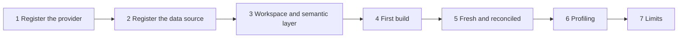

# Onboarding a Data Source

*For data engineers — anyone who connects a graph store to {brand} and keeps its lineage current.*

Follow this page once, top to bottom, and you will have connected a graph store, registered one of
its graphs as a data source, given it a workspace and a semantic layer, built its rolled-up lineage,
and set it up to stay fresh. Each part ends with a checkpoint, so you know it worked before you go
on. The path follows FalkorDB, the one provider every step here supports.

> **Before you start:** registering a provider needs the **Super admin** role (`system:admin`).
> Onboarding a source needs `workspace:catalog:manage` and `workspace:datasource:manage` — the
> **Data engineer** role in a workspace carries both. Creating a new workspace on the way needs
> `system:workspaces:create` (**Org admin** or **Super admin**). The roles are explained in
> [RBAC](/docs/rbac).

## Your path

1. **Onboarding a Data Source** — this page: one source, end to end.
2. [Aggregation Pipeline](/docs/aggregation-pipeline) — how the rolled-up lineage is built, resumed
   and protected on a large graph.
3. [Automatic Aggregation Reconciliation](/docs/feature-aggregation-reconciliation) — how {brand}
   notices that a source changed and repairs its rollups by itself.
4. [External Change Notification](/docs/feature-external-change-notification) — how your loader can
   say "I just finished" so the rebuild starts at once.
5. [API Guide](/docs/api-guide) — when you want to script any of this.

## The path at a glance



Parts 2 to 4 happen in one wizard, **Onboard Sources**; parts 1 and 2 live on the **Ingestion** page
(its title is **Data Ingestion**). While a platform's setup is incomplete, Super admins see a
**Setup Progress** bar there with the same stages: **Provider**, **Assets**, **Workspace**,
**Semantics**.


## Check the prerequisites

You need:

- **A graph store {brand} can reach.** The API service and the aggregation workers connect to it
  directly, so its host and port must be open from where they run — not just from your laptop.
- **Its credentials**, if it has any: a username and password, and whether it uses TLS.
- **A provider type.** Choose by where your lineage lives today:

| If your lineage lives in | Choose | What to know |
|---|---|---|
| FalkorDB | **FalkorDB** | Everything on this page works: rollups, reconciliation, version control, building from scratch |
| Neo4j | **Neo4j** | Map your property names to {brand}'s in the wizard's **Schema Mapping** step. Edges can be created but not updated or deleted, and version control can't be turned on |
| Google Spanner Graph | **Google Spanner Graph** | Addressed by project, instance and database instead of host and port, with a service account. Version control can't be turned on |
| DataHub | **DataHub** | A read-only, external catalog. In this release the connection can be registered and tested, but it lists no graphs to onboard |

**Checkpoint:** you have the host, port and credentials. You don't need to test reachability by
hand: the wizard's **Test connection**, in part 1, probes the store from the API service itself.

## 1. Register the provider

A **provider** is one graph-store server or cluster. Register it once; every graph on it can then
become a data source.

1. In the sidebar, click **Ingestion**, then the **Providers** tab. The list of providers opens.
2. Click **Register Provider** (on an empty list, **Start provider onboarding**). The wizard opens on
   **Provider Type**.
3. Choose **FalkorDB** and click **Next**. The **Connection** step opens.
4. Fill in **Provider name**, **Host** and **Port**. Turn off **Requires authentication** for a
   store with no password; otherwise enter the **Username** and **Password**. Turn on **Use TLS** if
   the store requires it, and choose its **Mode** — **Standalone (single host)**, **Redis Sentinel
   (HA)** or **Redis Cluster**.
5. Click **Next** to reach **Review** (a Neo4j or Spanner provider passes through **Schema Mapping**
   first, where **Auto-discover mapping** proposes the mapping).
6. Click **Test connection**. The **Connectivity** panel shows **Connected successfully** and the
   round-trip time.
7. Click **Create provider**. The wizard says **Provider connected** and "*name* is ready".
8. Click **Continue to data sources**. The **Data Sources** tab opens with your provider selected.

> **If you don't see Register Provider:** only Super admins can register, edit or delete providers.
> Others see the providers their workspaces use, read-only, with a note to ask a platform
> administrator.

From a script, signed in as a Super admin with the API Guide's helper
([Sign in from a script](/docs/api-guide#sign-in-from-a-script)), test the settings without saving
them, then save:

```bash
P='{"name": "Lineage store", "providerType": "falkordb", "host": "<host>", "port": 6379,
    "tlsEnabled": false, "credentials": {"password": "<password>"}}'
api POST /api/v1/admin/providers/test-connection -d "$P"   # nothing is saved
api POST /api/v1/admin/providers -d "$P" | jq -c '{id, name, providerType, isActive}'
```

```text
{"success":true,"latencyMs":0.7,"error":null,"providerVersion":null}
{"id":"prov_…","name":"Lineage store","providerType":"falkordb","isActive":true}
```

**Checkpoint:** the provider's card on the **Providers** tab shows its green status dot, and the
summary above the cards counts it as **Connected**. **Test** on the card probes it again.

## 2. Register the data source

A **data source** is one graph on a provider, attached to a workspace. The **Data Sources** tab lists
the graphs it finds on the selected provider as **assets**.

1. On the **Data Sources** tab, check that your provider is selected on the left. The panel header
   reads "*n* physical assets · *m* registered". Use **Search assets by name...** to find yours.
2. Select the graph you want. Its row changes from **Available** to **Queued**.
3. Click **Onboard Sources (1)**. The onboarding wizard opens on its first step, **Workspace**; its
   steps are **Workspace**, **Aggregation**, **Semantic Layer**, **Schema Review** and **Review**.

> **If the list is empty:** a provider is scanned in the background. "Discovering data sources…"
> means the scan is running; "Discovery failed on the last attempt" is not proof the provider is
> empty — it retries on the next background sweep. Check that the graph exists on the store.


## 3. Give it a workspace and a semantic layer

A **workspace** is the isolated home for the source, its views and its permissions. A **semantic
layer** (an ontology) says which of the graph's types are containers and which relationships are
lineage — the rollups can't be built without one.

1. On **Workspace** ("Choose a Home for Your Data"), choose **Use Existing** and pick a workspace, or
   **Create New Domain** and type a **Workspace Name**. Click **Next**.
2. On **Aggregation**, leave **In-Source** selected for now ([part 4](#4-run-the-first-build)
   explains the choice). Click **Next**.
3. On **Semantic Layer** ("Configure Semantic Layer"), click **Analyze All Sources**. Each source is
   matched against the existing semantic layers and the best fit is proposed; you can pick another,
   or start a new draft from the graph's own schema. Click **Next**.
4. On **Schema Review**, read the coverage. Gaps are advisory: types the semantic layer doesn't cover
   are ignored by the rollups and drawn with default styling. The one thing that blocks is a
   semantic layer with **no lineage relationship at all** — classify at least one relationship as
   **Lineage**, then click **Next**.
5. On **Review**, check the summary and click **Complete Setup**. The wizard shows **Setup
   Complete**.

> **Note:** leaving a source without a semantic layer is allowed, but then it gets no rollups —
> aggregation needs one. You can assign one later: open the workspace, select the data source, open
> **Data source actions** → **Edit details**, and choose a **Semantic layer (ontology)**.

Prefer to work from the workspace? **Workspaces** → **Create Workspace** (steps **Basics**, **Data**,
**Review**) creates a workspace and can attach a source; inside a workspace, **Data Sources** → **Add
Source** opens **Add Data Source** (steps **Source**, **Semantics**, **Review**). Neither wizard
starts a build itself: reconciliation gives a never-built source that has a semantic layer its first
build on its own ([part 5](#5-keep-it-fresh-and-reconciled)), or you start it from the data source's
**Aggregation** tab ([part 4](#4-run-the-first-build)). Workspaces and semantic layers are explained
for administrators in [Workspace Admin](/guide/workspace-admin) and
[The Semantic Layer](/guide/semantic-layer).

**Checkpoint:** the **Setup Complete** screen offers **Go to Explorer**, **Examine Schema**,
**Aggregation Progress** and **Configure More Sources**; if you choose nothing, it opens the Explorer
after 15 seconds.

## 4. Run the first build

The **build** (aggregation) rolls fine-grained lineage up the containment hierarchy into
`:AGGREGATED` edges, so a lineage trace at the table or domain level reads a few rollups instead of
walking millions of column edges. Onboarding starts it for you when the source has a semantic layer
and you didn't choose **Skip for Now**.

Choose where the rollups are written:

| If you want | Choose | Because |
|---|---|---|
| The simplest setup and the fastest reads | **In-Source** (recommended) | Rollups are written into the source graph itself; queries read one graph |
| The source graph never written to | **Dedicated Graph** | Rollups go to a separate projection graph (the wizard proposes `<source>_aggregated` as its name); it lags the source a little |
| To onboard now and build later | **Skip for Now** | No rollups yet — traces across levels are slow on a large graph until you build |

1. On **Setup Complete**, click **Aggregation Progress**. **Ingestion** → **Job History** opens.
2. Wait for the source's aggregation status to move from **Pending** to **Running** to **Ready**. On
   a large graph this takes a while; it runs in the background and resumes if it is interrupted.
3. To build again later — or for the first time, after **Add Data Source** or **Skip for Now** — open
   the workspace, select the data source, open its **Aggregation** tab, and click **Re-Trigger
   Aggregation**. The same tab's **Projection Mode** switches between **Inherit from Provider**,
   **In Source** and **Dedicated Graph**; switching after a build leaves the old rollups where they
   were, so click **Save Changes**, then **Purge Aggregated Edges**, then **Re-Trigger Aggregation**.

From a script (`workspace:datasource:manage`):

```bash
api POST "/api/v1/admin/data-sources/$DS/aggregation-jobs" -d '{"projectionMode": "in_source"}'
api GET "/api/v1/admin/data-sources/$DS/readiness" | jq '{aggregationStatus, isReady}'
```

The trigger answers **202** with the job. A source with no semantic layer is refused with **422**
("Aggregation requires an assigned ontology").

**Checkpoint:** the readiness answer reads `{"aggregationStatus": "ready", "isReady": true}`, and in
the **Create View** wizard the source carries the **Ready** pill. You can build a view before that,
but its lineage may be incomplete until the build finishes. How the build works, and its tuning, is in
[Aggregation Pipeline](/docs/aggregation-pipeline).

## 5. Keep it fresh and reconciled

You don't have to schedule rebuilds. A drift probe reads every source's counts about once a minute
(`AGGREGATION_PROBE_INTERVAL_SECS`, 60 s by default). When a source's data changed outside {brand},
its rollups went missing — a reload that wiped them, say — or it has never been built,
reconciliation queues a rebuild by itself. Automatic rebuilds of one source are spaced at least
15 minutes apart by default, and an administrator can pause them. The **Freshness** tab on the
**Ingestion** page shows where every source stands:

| State | Means |
|---|---|
| **In sync** | The rollups match the data last counted |
| **Drifting** | The counts changed outside the app, so the rollups are behind; reconciliation queues a rebuild |
| **Rollups missing** | The source has data but no rollups — most likely wiped by a reload |
| **Never built** | No build has run yet; the row offers **Build lineage** |
| **Blocked** | Reconciliation can't run: the source has no semantic layer |
| **Not observable** | Rollups go to a dedicated graph, which the counts don't read; drift in the raw data is still caught |
| **Version controlled** | The source is under version control, which keeps its rollups current on every publish |
| **Connections not up to date** | A version-controlled source whose rollups are not being kept current — check its version control, not a rebuild |
| **Reconcile suspended** | Rebuilds didn't clear the problem, so reconciliation stopped and waits for a person |

If your own pipeline loads the graph and the next minute matters, tell {brand} the moment the load
finishes — the API Guide recipe is
[Tell the platform a data source changed](/docs/api-guide#tell-the-platform-a-data-source-changed),
and the full contract is in [External Change Notification](/docs/feature-external-change-notification).
How reconciliation decides is in
[Automatic Aggregation Reconciliation](/docs/feature-aggregation-reconciliation); the
administrator's view is [Data Freshness & Ingestion](/guide/data-freshness).

**Optional: put the source under version control.** On a FalkorDB source, the data source's
**Versioning** tab shows "Version control is off" and an **Enable version control** button (you need
`workspace:datasource:manage`; the tab exists while the **Version control** feature switch is on).
Edits then go through drafts, reviews and a full history — see
[Versioning & Change Control](/guide/versioning-change-control).

**Checkpoint:** your source reads **In sync** (or **Version controlled**) on the **Freshness** tab.

## 6. Watch it with profiling

**Profiling** shows what is in a source and whether that is changing: counts over time, and the
moments they jumped.

- **Ingestion** → **Profiling** covers every source you can see; a workspace has its own
  **Profiling** section, and each data source a **Profiling** tab.
- The board's measures are **Entities**, **Relationships** and **Total**. A single source's chart
  offers **Everything**, **Entities**, **Relationships**, **Aggregated** (the rollups, drawn apart
  from your own relationships) and **Property names**.
- Windows are **24 hours**, **7 days** (the default), **30 days** and **90 days**.

The Ingestion page's **Profiling** tab, and a workspace's **Profiling** section, appear for Super
admins, Org admins, and anyone with `workspace:provider:read` or `workspace:datasource:manage`.

**Checkpoint:** your source's **Entities** and **Relationships** lines are flat or growing the way
you expect, and, for an **In-Source** build, **Aggregated** is above zero after the first build.

## 7. Know the limits

| Limit | What it means for you | Where to read more |
|---|---|---|
| **Property names: 65,534 per graph** | FalkorDB gives every distinct property name an id, and ids are never freed — deleting the data doesn't give them back. A graph at the ceiling refuses every new name, so its rollups can no longer be written; it can only be recreated. {brand}'s writers keep each graph to 50,000 native property names by default (`FALKORDB_NATIVE_PROPERTY_BUDGET`); any further keys are kept as values on the node, where the properties panel still shows them but search, sorting and display rules can't reach them | [Aggregation Pipeline](/docs/aggregation-pipeline), [Property storage](/docs/property-storage) |
| **Query memory and time** | The store bounds every single query. A rebuild that meets the bound slows down and narrows its scans instead of failing | [Rollup Capacity & Large Graphs](/guide/rollup-capacity) |
| **Re-sync of a version-controlled source** | Refused above 250,000 entities (`GRAPHVER_RESYNC_MAX_ENTITIES`) | [Versioning: Re-sync at Any Scale](/docs/versioning-resync-at-any-scale) |
| **Bulk files** | 100 MB in one request; up to 10 GiB as NDJSON, CSV or TSV in parts | [API Guide](/docs/api-guide#bulk-import-and-export-graph-data) |

Watch the property-name budget on the **Data Sources** tab: each graph's row shows how many property
names it has registered, with a coloured dot, and expanding the row shows the **Property names**
meter — **Healthy** below 70% of the ceiling, **Filling up** from 70%, **Near the limit** from 90%.
**Profiling**'s **Property names** line shows its trend. If it climbs with every
load, your source is minting new property names — per-row keys, timestamps in key names — and the fix
belongs in the loader.

## If it goes wrong

| Symptom | Cause | Fix |
|---|---|---|
| **Unable to connect** on **Test connection** | Wrong host, port, TLS setting or credentials, or the store isn't reachable from the API service's network | Check each from the API service's host; **Retry connection test** after each change |
| **Provider created with warnings** | You created the provider although the connection test failed | Fix the settings with **Edit** on its card, then **Test** |
| **Schema Review** won't let you continue | The semantic layer has no relationship classified as lineage | Classify at least one relationship as **Lineage** in the step |
| Build refused with "Aggregation requires an assigned ontology", or **Blocked** on **Freshness** | No semantic layer assigned | **Data source actions** → **Edit details** → **Semantic layer (ontology)**, then **Re-Trigger Aggregation** |
| Aggregation status **Failed** | The build stopped; the job says why | Read the job on **Job History**, fix the cause, and **Re-Trigger Aggregation** |
| **Rollups missing** after your own reload | The reload wiped the rollups | Usually nothing: reconciliation notices within about a minute and queues a rebuild. To be sure it starts at once, signal the change from your loader |
| **Reconcile suspended** | Repeated rebuilds didn't clear the problem | Open the source on **Freshness**, read why, fix the cause, then click **Resume automation** in its drawer |
| **Property names** at **Near the limit** | The source keeps adding new property names | Stop the loader from minting keys; a graph at the ceiling must be recreated |
| "Enable version control" isn't offered | The **Versioning** tab is hidden while the **Version control** switch is off, and the button needs `workspace:datasource:manage` | Ask an administrator — [Feature Switches](/guide/feature-switches) |

## Where in the code

| Concern | File | Symbol |
|---|---|---|
| The Ingestion page and its tabs | `frontend/src/pages/IngestionPage.tsx` | `ALL_TABS`, `IngestionPage` |
| Setup Progress | `frontend/src/components/admin/OnboardingProgress.tsx` | `stages` |
| Providers list and Register Provider | `frontend/src/components/admin/RegistryConnections.tsx` | `RegistryConnections` |
| Provider wizard | `frontend/src/components/admin/ProviderOnboardingWizard.tsx` | `PROVIDER_TYPES`, `handleTestConnection`, `handleSubmit` |
| Provider routes | `backend/app/api/v1/endpoints/providers.py` | `test_unsaved_provider_connection`, `create_provider`, `test_provider` |
| What each provider type supports | `backend/common/interfaces/provider.py` | `PROVIDER_CAPABILITIES` |
| Data Sources tab and Onboard Sources | `frontend/src/components/admin/RegistryAssets.tsx` | `handleRegister` |
| The onboarding wizard | `frontend/src/components/admin/AssetOnboardingWizard/AssetOnboardingWizard.tsx` | `STEPS`, `canProceed`, `handleSubmit` |
| Build strategies | `frontend/src/components/admin/AssetOnboardingWizard/steps/AggregationStep.tsx` | `OPTIONS` |
| Workspace and data-source routes | `backend/app/api/v1/endpoints/catalog.py`, `backend/app/api/v1/endpoints/workspaces.py` | `create_catalog_item`; `create_workspace`, `add_data_source`, `set_projection_mode` |
| Build, readiness and skip | `backend/app/api/v1/endpoints/aggregation.py` | `trigger_aggregation`, `get_readiness`, `skip_aggregation` |
| Data source tabs and Re-Trigger Aggregation | `frontend/src/components/admin/workspace/DataSourceDetailPanel.tsx` | `DATA_SOURCE_TABS` |
| Freshness states | `frontend/src/components/admin/Freshness/DriftStateBadge.tsx` | the state table |
| Drift probe interval | `backend/app/services/aggregation/service.py` | `AGGREGATION_PROBE_INTERVAL_SECS` |
| Change signal | `backend/app/api/v1/endpoints/freshness.py` | `refresh_data_source` |
| Property-name meter | `frontend/src/components/admin/PropertyNameBudget.tsx` | `PROPERTY_NAME_CEILING`, `propertyNameBand` |
| Native property budget | `backend/app/providers/falkordb_provider.py` | `_NATIVE_PROPERTY_BUDGET_DEFAULT`, `_native_property_budget` |

## Where to next

- [Aggregation Pipeline](/docs/aggregation-pipeline) — when you want to know what a build does and
  how to tune it on a large graph.
- [Automatic Aggregation Reconciliation](/docs/feature-aggregation-reconciliation) — when a source's
  freshness state surprises you.
- [API Guide](/docs/api-guide) — when you want to automate onboarding, change signals or bulk loads.
- [Creating Views](/guide/creating-views) — when the source is **Ready** and you want to see its
  lineage.
