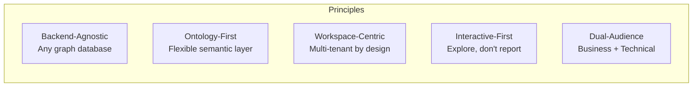
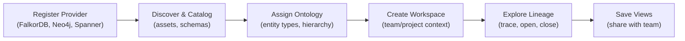
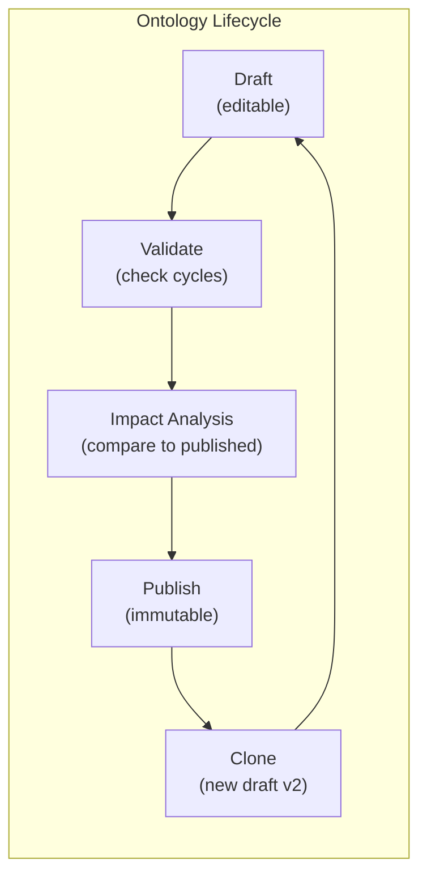
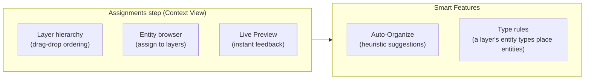
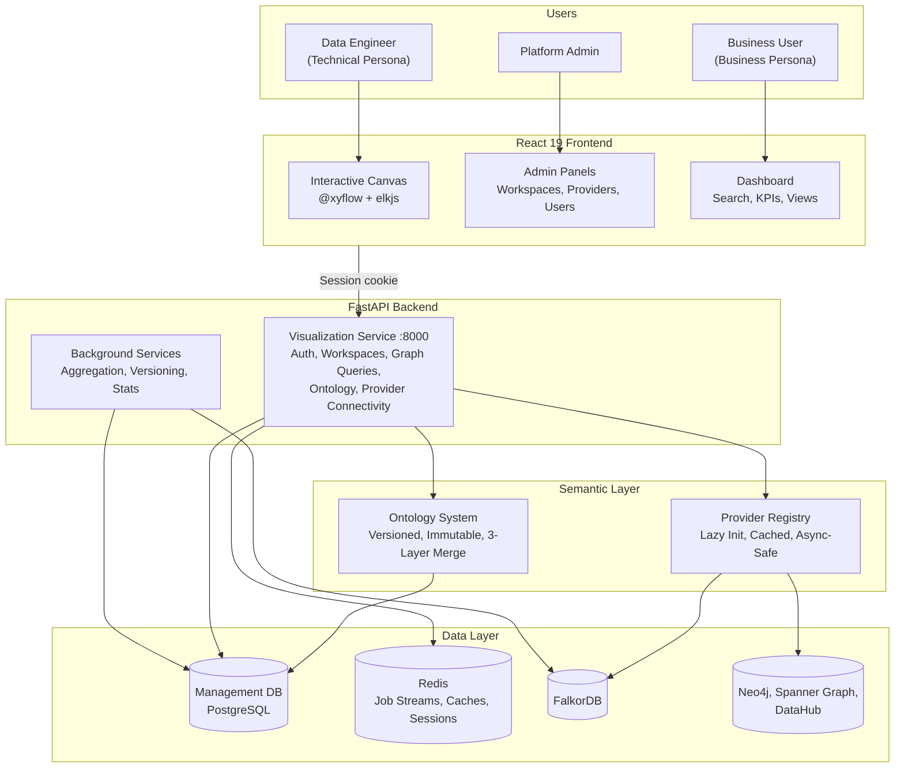
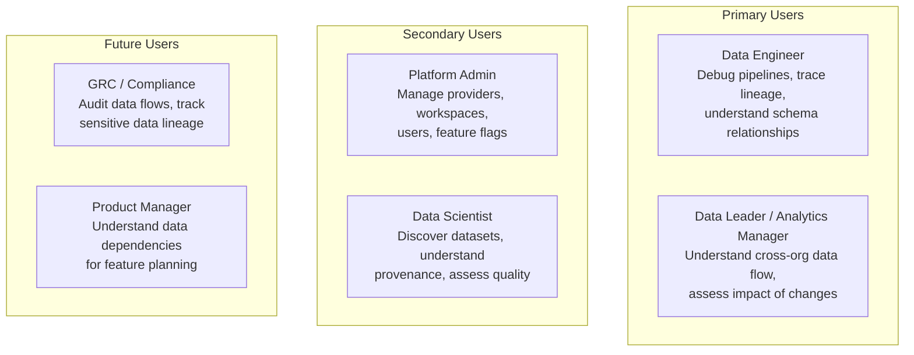

# {brand}: Project Overview, Vision & Roadmap

*For anyone new to {brand} — engineers, architects, operators, integrators, security reviewers and data engineers.*

Read this page to learn what {brand} is, the problem it solves, what has shipped and where it is headed — and to find the pages to read next for your role.

**What you'll find here:**
- Key terms and a reading path for each role
- The problem, the vision, and core design principles
- Shipped capabilities and an honest maturity assessment
- Competitive positioning and the forward-looking roadmap

> **Tip:** Skim the [Key Terms](#key-terms) table first — the four-entity vocabulary (Provider, CatalogItem, Ontology, Workspace) recurs across every other doc.

> **Note:** Here to use {brand} rather than build or run it? Start with the [User Guide](/guide/welcome).

---

## What is {brand}?

{brand} is a **workspace-centric data lineage and governance platform** that transforms how organizations explore, understand, and govern their data relationships. It provides an interactive graph visualization experience over heterogeneous data backends, unified by a flexible semantic layer (ontology system).

---

## Key Terms

| Term | Definition |
|------|-----------|
| **Provider** | Infrastructure connection to a graph database (FalkorDB, Neo4j or Google Spanner Graph) or to DataHub. Stores host, port, credentials, TLS settings. |
| **Ontology** | Versioned semantic schema defining entity types (e.g., Dataset, SchemaField) and relationship types (e.g., CONTAINS, TRANSFORMS). Formerly called "Blueprint". |
| **Workspace** | Operational context for a team or project. Contains data sources, views, and context models. Provides isolation between teams. |
| **CatalogItem** | Governed data product abstraction. Represents a discovered or registered graph/schema from a Provider, with permission control. Bridges Providers and DataSources. |
| **DataSource** | Binding of a Provider + CatalogItem + Ontology within a Workspace. The unit of data access. |
| **View** | Saved graph exploration with layout, filters, and a visibility: **Private**, **Workspace** or **Enterprise**. |
| **Context Model** | Layer configuration for organizing complex graphs. Defines how entities are grouped and displayed. |
| **Projection Mode** | How aggregated lineage edges are stored. `in_source` writes them in the original graph; `dedicated` creates a separate projection graph to preserve source data integrity. |
| **Granularity** | Level of detail in lineage visualization. Can be aggregated (domain → table) or fine-grained (column-level). You change it by opening and closing containers: lineage between closed containers is shown rolled up. |
| **Containment Hierarchy** | Parent-child relationships between entities (e.g., Domain contains Dataset contains SchemaField). |
| **Three-Layer Ontology Resolution** | How ontologies are assembled: system defaults + workspace-assigned definitions + provider-introspected types. Cached, and invalidated on every pod whenever an ontology or its assignment changes (5-minute backstop). |

---

## Reading Guide

Find the row that matches your role. Read its first page, then the others in the order listed.

| You are | Start with | Then read |
|---|---|---|
| A new engineer | [Setup Guide](/docs/setup) — get the stack running on your machine | [Contributing](/docs/contributing), [Testing & CI](/docs/testing-and-ci), [Architecture](/docs/architecture), [Backend Reference](/docs/backend), [Frontend Reference](/docs/frontend) |
| An architect or tech lead | [Architecture](/docs/architecture) — every process and store, and how a request flows | [Data Architecture](/docs/data-architecture), [Design Decisions](/docs/decisions), [Scaling Architecture](/docs/scaling-architecture) |
| A platform operator | [Self-Host Deployment](/docs/deployment) — run it with Docker Compose | [Kubernetes](/docs/kubernetes), [Configuration Reference](/docs/configuration) |
| An integrator | [API Guide](/docs/api-guide) — call the API from your own code | [Backend Reference](/docs/backend), [Feature Flags API](/docs/api-features) |
| A security reviewer | [Security Overview](/docs/security-overview) — the controls and how to configure them | [RBAC](/docs/rbac), [SSO (Operator Guide)](/docs/sso) |
| A data engineer | [Onboarding a Source](/docs/onboarding-a-source) — bring a graph in, end to end | [Platform Services Overview](/docs/services-overview), [Aggregation Pipeline](/docs/aggregation-pipeline) |
| A product administrator | [Admin Setup](/guide/admin-setup) in the User Guide — your first hour as an administrator | [Users & Access](/guide/users-access), [Feature Switches](/guide/feature-switches) |

---

```mermaid
mindmap
  root(({brand}))
    Interactive Lineage
      Trace upstream/downstream
      Open and close containers
      Semantic zoom
      Aggregated edge rollups
    Semantic Governance
      Versioned ontologies
      Breaking-change protection
      Impact analysis
      Schema drift detection
      Audit Trail (OntologyAuditLog)
      Source Mappings
      Drift Detection
    Graph Change Control
      Drafts + review & merge (PR-style)
      Publish, revert, restore
      Version-control master switch
      Resumable enable-VC bootstrap job
    Lineage Lens / Context View
      External-degree signal
      Curated-view chip
      Layer Strip
      Off-screen partner trays + one-page-ahead pagination
    Data Catalog
      CatalogItems
      Workspace Bindings
      Impact Analysis
    Guided Onboarding
      First-run card
      Setup Wizard
      Progress Tracker
      Asset Onboarding
    Multi-Backend
      FalkorDB (primary)
      Neo4j (enterprise)
      Google Spanner Graph
      DataHub (connectivity)
      Extensible provider ABC
    Workspace Isolation
      Multi-tenant by design
      Team/project contexts
      Role-based access
      Scoped views & lenses
    Visual Experience
      Glass morphism design
      Business and Technical names
      Three-panel layer editor
      ELK auto-layout
```

---

## The Problem

Modern data ecosystems are complex. Organizations face:

1. **Lineage opacity** -- Data flows through dozens of systems (warehouses, lakes, pipelines, BI tools) without a unified view of how datasets relate
2. **Schema fragmentation** -- Different teams use different metadata schemas, making cross-team data discovery impossible
3. **Governance gaps** -- No way to assess the blast radius of schema changes, deprecations, or pipeline failures
4. **Tool lock-in** -- Existing lineage tools (Atlas, DataHub, Marquez) are tightly coupled to specific backends, making migration painful
5. **Two-audience problem** -- Data engineers need column-level technical detail; business stakeholders need domain-level overviews. No tool serves both well

---

## The Vision

> **Make data lineage as intuitive as navigating a design tool** -- an interactive, persona-aware, layer-organized canvas for collaborative data exploration and governance.

### Core Design Principles


```mermaid
graph LR
    subgraph Principles
        P1["Backend-Agnostic<br/>Any graph database"]
        P2["Ontology-First<br/>Flexible semantic layer"]
        P3["Workspace-Centric<br/>Multi-tenant by design"]
        P4["Interactive-First<br/>Explore, don't report"]
        P5["Dual-Audience<br/>Business + Technical"]
    end

```

| Principle | What It Means | Why It Matters |
|-----------|---------------|----------------|
| **Backend-Agnostic** | Pluggable `GraphDataProvider` interface supports FalkorDB, Neo4j, DataHub, and custom backends | No vendor lock-in; works with existing infrastructure |
| **Ontology-First** | Entity types, relationships, visual styling, and hierarchy defined in versioned, immutable ontologies | Schema governance without code changes; teams customize independently |
| **Workspace-Centric** | Provider (infrastructure) + Ontology (semantics) + Workspace (context) as independent entities | Multi-tenancy, team isolation, and infrastructure reuse built in from day one |
| **Interactive-First** | Canvas-based exploration with trace, expand, filter, and zoom -- not static reports | Users discover relationships through interaction, not pre-built dashboards |
| **Dual-Audience** | The top bar's **Business** / **Technical** toggle shows the names people use, or adds each entity's qualified name (or URN) under its name, on the canvas and in the entity drawer | One source of truth, two experiences; bridges the gap between data teams and stakeholders |

---

## How It Works

### For Data Engineers


```mermaid
flowchart LR
    A["Register Provider<br/>(FalkorDB, Neo4j, Spanner)"] --> B["Discover & Catalog<br/>(assets, schemas)"]
    B --> C["Assign Ontology<br/>(entity types, hierarchy)"]
    C --> D["Create Workspace<br/>(team/project context)"]
    D --> E["Explore Lineage<br/>(trace, open, close)"]
    E --> F["Save Views<br/>(share with team)"]

```

1. **Register** a graph database — FalkorDB, Neo4j or Google Spanner Graph — or DataHub, with **Register Provider** on **Ingestion → Providers**. Only platform administrators can register a provider.
2. **Discover & catalog** available graphs and schemas from the connected provider (**Ingestion → Data Sources**)
3. **Define or assign** an ontology that describes the entity types and relationships in the graph (**Semantic Layers**)
4. **Create a workspace** that binds the provider, catalog items, and ontology into an operational context (**Workspaces**)
5. **Explore** the graph interactively: trace lineage with the trace dock's **Upstream depth** and **Downstream depth** sliders, and open or close containers to change the level of detail — lineage between closed containers is shown rolled up
6. **Save and share** views with your team, with **Private**, **Workspace** or **Enterprise** visibility

### For Business Stakeholders

1. **Switch to business names** — choose **Business** in the top bar's **Business** / **Technical** toggle, so every entity shows the name people use
2. **Search** the **Dashboard** for a view, workspace or data source, or press ⌘K / Ctrl-K anywhere to search pages, views, workspaces and docs
3. **Open a view** to see the high-level flow — with containers closed, the lineage between domains and applications is shown rolled up
4. **Drill down** by opening containers; switch to **Technical** to see each entity's qualified name (or URN) under its name
5. **Favorite** the views you return to in the **Explorer**; they appear under **Favorites** in the top bar

### For Platform Admins

1. **Register Provider** — on **Ingestion → Providers**, connect your graph database (FalkorDB, Neo4j or Google Spanner Graph) or DataHub
2. **Discover Schema** — introspect the provider to discover the graphs and schemas it holds
3. **Register Catalog Items** — promote discovered assets into governed data products (**Ingestion → Data Sources**)
4. **Onboard Assets** — the five-step **Asset Onboarding** wizard: **Workspace**, **Aggregation**, **Semantic Layer**, **Schema Review**, **Review**
5. **Configure Ontology** — define or customize entity and relationship types (**Semantic Layers**)
6. **Create Workspace** — bind providers, catalog items, and ontologies into team contexts (**Workspaces**)
7. **Manage users** — accounts and sign-up approvals live in **Administration → User Management**. The built-in roles are **Super admin**, **Org admin** and **Org auditor** across the platform, and **Workspace admin**, **Data engineer**, **Workspace member** and **Workspace viewer** within a workspace; see [RBAC](/docs/rbac) for what each carries
8. **Manage feature switches** — turn features on or off in **Administration → Features** (see [Feature Switches](/guide/feature-switches))

> **Note:** On a platform with no providers yet, **Ingestion → Providers** opens on a **Set Up Your Data Intelligence Platform** card that lays out this flow: **Register Provider**, **Register Data Sources**, **Create Workspace**, **Configure Semantics**.

---

## Key Capabilities

### 1. Multi-Granularity Lineage


```mermaid
graph TB
    subgraph Column["Column Level"]
        C1["orders.customer_id"] -->|TRANSFORMS| C2["analytics.customer_key"]
        C3["orders.total"] -->|TRANSFORMS| C4["analytics.revenue"]
    end

    subgraph Table["Table Level (Aggregated)"]
        T1["orders"] -->|"AGGREGATED (2)"| T2["analytics"]
    end

    subgraph Domain["Domain Level"]
        D1["Sales"] -->|"flows to"| D2["Analytics"]
    end

    Column -.->|"Close containers"| Table
    Table -.->|"Close containers"| Domain

```

Trace lineage at any level of the ontology hierarchy. The aggregation pipeline rolls fine-grained lineage (column to column) up the containment hierarchy into `AGGREGATED` edges (table to table, domain to domain), and re-runs when those edges fall out of step with the graph. You choose the level of detail by opening and closing containers — lineage between closed containers is shown rolled up — and on the Graph canvas, zooming in and out opens and closes them for you.

### 2. Ontology-Driven Schema Governance


```mermaid
graph LR
    subgraph Lifecycle["Ontology Lifecycle"]
        Draft["Draft<br/>(editable)"] --> Validate["Validate<br/>(check cycles)"]
        Validate --> Impact["Impact Analysis<br/>(compare to published)"]
        Impact --> Publish["Publish<br/>(immutable)"]
        Publish --> Clone["Clone<br/>(new draft v2)"]
        Clone --> Draft
    end

```

- **Three-layer resolution:** System defaults + workspace-assigned ontology + introspected gap-fill
- **Breaking-change protection:** Publishing a version that removes entity or relationship types the previous published version had is blocked; an administrator can force-publish to override
- **Impact analysis:** Before publishing, see which workspaces and data sources are affected
- **Schema drift detection:** Automatic flagging when graph data contains types not in the ontology

### 3. Interactive Canvas Experience

- **Canvas-first:** Pan, zoom, trace, expand -- not a static chart
- **Schema-driven rendering:** `GenericNode` renders any entity type from ontology visual config
- **ELK auto-layout:** The Graph canvas lays itself out with elkjs, in the browser
- **Context menus, inline editing, command palette (⌘K / Ctrl-K):** Power-user interactions
- **Semantic zoom:** On the Graph canvas, zooming in opens containers and zooming out closes them, following each entity type's hierarchy level in the ontology

### 4. Layers & Smart Assignment


```mermaid
flowchart LR
    subgraph Editor["Assignments step (Context View)"]
        Left["Layer hierarchy<br/>(drag-drop ordering)"]
        Center["Entity browser<br/>(assign to layers)"]
        Right["Live Preview<br/>(instant feedback)"]
    end

    subgraph Smart["Smart Features"]
        Auto["Auto-Organize<br/>(heuristic suggestions)"]
        Rules["Type rules<br/>(a layer's entity types place entities)"]
    end

    Editor --> Smart

```

Organize complex graphs into meaningful layers. When you build a Context View, the **Assignments** step of the **Create View** wizard is a three-panel editor — the layer hierarchy, an entity browser and a **Live Preview** — with drag-and-drop and undo/redo. **Auto-Organize** suggests placements from heuristics, and nothing changes until you accept them. A layer's entity types act as its placement rule: entities of those types land in that layer, and the entities they contain follow.

### 5. Workspace Isolation & Multi-Tenancy

- **Workspace = team/project context:** Each workspace binds providers, ontologies, and graph names
- **Data source scoping:** Views are scoped to `{workspaceId}/{dataSourceId}` -- no cross-tenant data leaks
- **Role-based access:** Eight built-in roles plus custom roles, bound to users or groups per workspace, with per-view sharing (see [RBAC.md](RBAC.md))
- **Provider sharing:** One infrastructure provider serves multiple workspaces without credential duplication

### 6. Enterprise Data Catalog

- **CatalogItem abstraction** between Provider and DataSource -- governed data product layer
- **Permission-controlled asset access** -- admins register and approve catalog items before workspace binding
- **Impact analysis before deletion** -- understand downstream effects before removing catalog items
- **Workspace binding management** -- track which workspaces consume which catalog items

### 7. Guided Onboarding

- **First-run card** for empty platforms — with no providers registered, **Ingestion → Providers** opens on **Set Up Your Data Intelligence Platform**, which lays out the four stages (`FirstRunHero`)
- **Onboarding progress tracker** — platform administrators see the stages **Provider**, **Assets**, **Workspace** and **Semantics** at the top of **Ingestion**, each a click away (`OnboardingProgress`)
- **Asset Onboarding wizard** for streamlined setup — five guided steps: **Workspace**, **Aggregation**, **Semantic Layer**, **Schema Review**, **Review** (`AssetOnboardingWizard`)
- **Reduces time-to-first-value** for new admins -- from manual multi-step configuration to guided flow

### 8. Graph Versioning & Change Control (Shipped)

- **Drafts + review & merge:** Edit on a draft branch (`?branchId=`), then review and merge PR-style before it hits `main`
- **Publish, revert, restore:** Publish a draft, **revert** a change ("Undo this change"), or **restore** the graph to a historical commit ("Restore to this point", with a diff preview)
- **Version-control master switch:** The **Version control** switch on **Administration → Features** (`versioningEnabled`) gates every `/graph` write
- **Resumable enable-VC bootstrap:** Turning on version control for a data source runs an async, resumable job that copies the whole source graph into the versioned store as an integrity-checked `import` commit — verified on a 7.7M-entity graph

### 9. Lineage Lens / Context View (Shipped)

- **Context View:** Layer-organized, curated exploration with the **Layer Strip** (the navigator docked at the bottom of the canvas, one chip per layer), **resizable layer columns**, and one-page-ahead pagination
- **Lineage Lens:** Click an entity to see its lineage at any canvas scale — the entity centred, its sources on the left and its consumers on the right — and walk from neighbour to neighbour, with a **Density** control for how much detail the board shows
- **External-degree signal:** Total lineage degree per node (`POST /{ws_id}/graph/nodes/degree`) drives each card's lineage ports; curated views also count the partners that sit outside the view
- **Off-screen partner trays:** When the selected or hovered entity's partners are scrolled out of sight, each column docks them as chips under **Off-screen above** or **Off-screen below**, so every line still has an end; past five chips in a column, a chip such as **12 more in the lens** opens the rest in the Lineage Lens

---

## Competitive Positioning

```mermaid
quadrantChart
    title Lineage Platform Landscape
    x-axis Static Visualization --> Interactive Exploration
    y-axis Single Backend --> Multi-Backend
    quadrant-1 {brand} Target
    quadrant-2 Emerging
    quadrant-3 Traditional
    quadrant-4 Specialized
    Apache Atlas: [0.2, 0.2]
    DataHub: [0.5, 0.3]
    Amundsen: [0.3, 0.2]
    Marquez: [0.25, 0.35]
    OpenLineage: [0.15, 0.7]
    {brand}: [0.8, 0.8]
```

| Aspect | {brand} | DataHub | Atlas | Marquez |
|--------|---------|---------|-------|---------|
| **Graph Backend** | Pluggable (FalkorDB, Neo4j, Google Spanner Graph, DataHub) | Elasticsearch or Neo4j | JanusGraph | PostgreSQL |
| **Schema Model** | Versioned ontologies with breaking-change protection | Fixed schema | Fixed schema | OpenLineage spec |
| **Multi-Tenancy** | Workspace-centric, built-in | UI-scoped | Not supported | Not supported |
| **Visualization** | Interactive canvas (Figma-like) | Static DAG | Static | Static |
| **Dual Audience** | Business + Technical persona toggle | Technical focus | Technical focus | Technical focus |
| **Governance** | Impact analysis, drift detection, breaking-change protection | Basic | Basic | None |
| **Deployment** | Docker/K8s, self-hosted or SaaS-ready | Docker/K8s | Docker | Docker |

### {brand}'s Differentiators

1. **Interactive exploration** over static reports -- trace, zoom, filter in real-time
2. **Backend-agnostic** -- works with your existing graph infrastructure, no migration required
3. **Ontology flexibility** -- define your own entity types, relationships, and visual styling
4. **Persona-aware** -- same platform, two audiences (business + technical)
5. **Workspace isolation** -- multi-tenant from day one, not bolted on

---

## Architecture at a Glance


```mermaid
graph TB
    subgraph Users["Users"]
        BU["Business User<br/>(Business Persona)"]
        DE["Data Engineer<br/>(Technical Persona)"]
        PA["Platform Admin"]
    end

    subgraph Frontend["React 19 Frontend"]
        Canvas["Interactive Canvas<br/>@xyflow + elkjs"]
        Admin["Admin Panels<br/>Workspaces, Providers, Users"]
        Dashboard["Dashboard<br/>Search, KPIs, Views"]
    end

    subgraph Backend["FastAPI Backend"]
        VizSvc["Visualization Service :8000<br/>Auth, Workspaces, Graph Queries,<br/>Ontology, Provider Connectivity"]
        Workers["Background Services<br/>Aggregation, Versioning, Stats"]
    end

    subgraph Semantic["Semantic Layer"]
        Ontology["Ontology System<br/>Versioned, Immutable, 3-Layer Merge"]
        Registry["Provider Registry<br/>Lazy Init, Cached, Async-Safe"]
    end

    subgraph Data["Data Layer"]
        MgmtDB[(Management DB<br/>PostgreSQL)]
        Redis[("Redis<br/>Job Streams, Caches, Sessions")]
        FDB[(FalkorDB)]
        Others[("Neo4j, Spanner Graph,<br/>DataHub")]
    end

    BU --> Dashboard
    DE --> Canvas
    PA --> Admin

    Frontend -->|Session cookie| VizSvc

    VizSvc --> Ontology
    VizSvc --> Registry

    Registry --> FDB
    Registry --> Others
    Ontology --> MgmtDB
    VizSvc --> MgmtDB
    VizSvc --> Redis
    Workers --> MgmtDB
    Workers --> FDB

```

For detailed architecture documentation, see:
- [Architecture](ARCHITECTURE.md) — every process and store, the request lifecycle, deployment
- [Backend Reference](BACKEND.md) — the router map, authentication, middleware, startup, providers
- [Frontend Reference](FRONTEND.md) — how the app is organised, state, the canvases
- [Data Architecture](DATA_ARCHITECTURE.md) — data models, entity relationships, caching
- [Design Decisions](DECISIONS.md) — the Architectural Decision Records (ADRs)

---

## Current State & Roadmap

*As of 2026-10-09. `PLAN.md` at the repository root is the one-page version; the technical-debt register in the repository lists what is wrong today.*

### Current State: Shipped Platform

The platform is past MVP. The four-entity core, the ontology system, the interactive canvas, graph versioning with full change control, single sign-on, and analytics are all shipped and in use.


```mermaid
timeline
    title {brand} Delivered Capabilities
    section Core (Shipped)
        Architecture      : Four-entity model (Provider + CatalogItem + Ontology + Workspace)
                          : Pluggable providers (FalkorDB default, Neo4j, Spanner Graph, DataHub connectivity)
                          : Workspace-centric API
        Lineage Engine    : Multi-directional trace (upstream/downstream/both)
                          : Granularity aggregation (column → table → domain)
                          : Containment hierarchy traversal
                          : Aggregated edge materialization with automatic reconciliation
        Ontology System   : Versioned definitions with publish/clone lifecycle
                          : Three-layer resolution (system + assigned + introspected)
                          : Impact analysis and coverage checking
        Auth & Users      : Argon2id passwords and HttpOnly cookie sessions with CSRF protection
                          : Eight built-in roles, custom roles, group bindings
                          : Signup with admin approval (default OFF) and invite links
        Data Catalog      : CatalogItem abstraction (Provider → CatalogItem → DataSource)
                          : Permission-controlled asset registration
                          : Impact analysis before deletion
    section Exploration (Shipped)
        Canvas            : Interactive canvas with ELK auto-layout
                          : Schema-driven GenericNode rendering
                          : Persona toggle (business/technical)
        Lineage Lens      : Lineage Lens / Context View
                          : External-degree signal (POST /nodes/degree)
                          : Layer Strip + resizable layer columns
                          : Off-screen partner trays + root pagination past 200 per layer
        Trace & Search    : Trace up to 25 entities as one picture
                          : Advanced Search and Display Rules with view libraries
    section Change Control (Shipped)
        Versioning        : Drafts, review & merge (PR-style), publish
                          : Revert ("Undo this change") + restore ("Restore to this point")
                          : Version-control admin master switch
                          : Resumable async enable-VC bootstrap job with integrity report
                          : Verified on a 7.7M-entity graph
        Import & Export   : Imports up to 10 GB and exports up to 50 GB, off the web servers
                          : Views that move between environments with their history
    section Enterprise (Shipped)
        Identity          : SSO via OIDC, SAML 2.0, portal and gateway handoffs
                          : JIT provisioning and IdP-group role mapping
        Insight           : Analytics (growth, engagement, content, health)
                          : White-label branding
        Operations        : Web, worker and control-plane tiers on Kubernetes with autoscaling
                          : Sharded FalkorDB cluster option
    section Forward-Looking
        Hardening         : Production hardening of the shipped configs
                          : Metrics scraped and alerted on
        Views             : Server-side membership for the placement contract
        Integrations      : Additional provider adapters (Apache Atlas, dbt, Airflow)
                          : Event-streaming lineage ingestion
        Collaboration     : Comments and annotations
```

### Forward-Looking Work

| Area | Item | Status |
|------|------|--------|
| Hardening | Production hardening of the shipped deployment configs, FalkorDB persistence on Kubernetes, metrics scraped and alerted on, and complete Kubernetes deploy paths | Next — the technical-debt register in the repository sets the order |
| Views | Server-side membership, so `placementContractEnabled` can default on | Next — the placement contract ships as a preview behind that flag |
| Versioning | Re-sync above 250,000 entities, version control beyond FalkorDB, retention and incremental Merkle for drafts | Planned — [Versioning: Scale, Limits & Roadmap](versioning/09-scale-limits-and-roadmap.md) |
| Integrations | Additional provider adapters (Apache Atlas, dbt, Airflow) | Not started |
| Integrations | DataHub beyond connectivity | Not started — the adapter answers ping, stats and basic lineage only |
| Integrations | Event-streaming lineage ingestion | Partly covered — a drift probe notices an external load within about a minute, and a refresh endpoint takes push notice ([External Change Notification](features/external-change-notification.md)) |
| Enterprise | API tokens and service accounts for automation | Not started — scripts sign in with a password |
| Enterprise | GraphQL API layer | Not started — `backend/app/graphql/types.py` is an unused sketch |
| Enterprise | A general access-policy engine | Not started — workspace-scoped roles, group bindings, custom roles and per-view grants cover most needs today |
| Collaboration | Comments and annotations | Not started — change proposals ship as versioning pull requests with reviewers |

> **Note:** Every shipped deployment runs the process split: web, worker and control-plane processes (`SYNODIC_ROLE`), plus the versioning worker and the stats service, as separate services in Compose and on Kubernetes, where they autoscale. The single-process `dev` role is only the fallback when `SYNODIC_ROLE` is unset — for example, uvicorn run on the host. The end-state items still open are in [Scaling Architecture](architecture-when-scaling.md).

---

## Project Maturity Assessment

### Strengths

- **Architecture is right:** The four-entity model (Provider + CatalogItem + Ontology + Workspace), provider abstraction, and ontology system are well-designed for the target use cases
- **Ontology system is powerful:** Versioning, impact analysis, and three-layer resolution provide genuine schema governance
- **Change control is shipped:** Graph versioning (drafts, review & merge, publish, revert, restore) plus the version-control master switch, a resumable enable-VC bootstrap job verified on a 7.7M-entity graph, and imports and exports at tens of gigabytes
- **Exploration is differentiated:** Canvas-first exploration with the Business / Technical toggle, Lineage Lens / Context View, multi-entity trace, external-degree signals, the Layer Strip, and the off-screen partner trays put this ahead of static lineage tools
- **Identity is enterprise-ready:** SSO over OIDC and SAML 2.0, HttpOnly cookie sessions with CSRF protection, and RBAC with custom roles and group bindings
- **Multi-tenant from day one:** Workspace isolation is architectural, not bolted on

### Areas for Improvement

- **Production hardening:** The safeguards exist and are tested; hardening the shipped deployment configs is next on the roadmap
- **Observability:** Metrics are exported but off by default, and nothing scrapes or alerts on them
- **Unproven at scale:** No load or chaos run has been recorded, and two FalkorDB manifest defects on Kubernetes have not been checked
- **Deployment parity:** The Helm chart lacks the versioning worker and other pieces the Kubernetes manifests have, and the zero-config quickstart does not boot
- **Legacy code:** The pre-workspace connection path is unreachable dead code still waiting to be deleted

Each of these is an entry, with evidence, in the technical-debt register in the repository.

### Honest State

| Dimension | Rating | Notes |
|-----------|--------|-------|
| Architecture | Strong | Four-entity model, provider abstraction, workspace isolation, catalog governance |
| Ontology System | Strong | Versioning, impact analysis, drift detection |
| Change Control | Strong | Graph versioning shipped (drafts, merge, publish, revert, restore); enable-VC bootstrap verified at 7.7M entities; re-sync guarded above 250,000 entities |
| Frontend UX | Strong | Canvas, Business / Technical names, Lineage Lens, multi-entity trace, Layer Strip, off-screen partner trays, guided onboarding |
| Backend API | Solid | About 500 endpoints, clear REST patterns |
| Identity | Strong | SSO, cookie sessions with CSRF protection, RBAC with custom roles and group bindings |
| Security posture | Needs Work | Strong controls; open hardening items are tracked in the repository |
| Operability | Needs Work | Metrics off by default and unalerted; Helm chart behind the Kubernetes manifests |
| Scale-out | Deployed, unmeasured | Three tiers on Kubernetes with autoscaling; no recorded load test |

---

## Target Users


```mermaid
graph TB
    subgraph Primary["Primary Users"]
        DE["Data Engineer<br/>Debug pipelines, trace lineage,<br/>understand schema relationships"]
        DL["Data Leader / Analytics Manager<br/>Understand cross-org data flow,<br/>assess impact of changes"]
    end

    subgraph Secondary["Secondary Users"]
        PA["Platform Admin<br/>Manage providers, workspaces,<br/>users, feature flags"]
        DS["Data Scientist<br/>Discover datasets, understand<br/>provenance, assess quality"]
    end

    subgraph Future["Future Users"]
        GRC["GRC / Compliance<br/>Audit data flows, track<br/>sensitive data lineage"]
        PM["Product Manager<br/>Understand data dependencies<br/>for feature planning"]
    end

```

---

## Getting Started

### Prerequisites

- Docker Engine or Docker Desktop with the Compose v2 plugin — every service runs in a container
- Only to run the apps on your machine: Python 3.14 (what the backend images use) and Node.js 24 (`frontend/.nvmrc`)

### Quick Start

1. Clone the repository and change into it:

   ```bash
   git clone <repository-url>
   cd <repository-directory>
   ```

2. Start the whole stack:

   ```bash
   ./dev.sh
   ```

   On the first run it creates `.env.dev` from `.env.example`, builds the images, applies the database migrations and starts every service. When it returns, it prints:

   ```
     Frontend     http://localhost:5173
     Backend API  http://localhost:8000/docs
     Logs:        ./dev.sh logs [service]
     Status:      ./dev.sh ps
   ```

3. Open http://localhost:5173 and sign in with `ADMIN_EMAIL` / `ADMIN_PASSWORD` from `.env.dev`. A password published in this repository, like the example file's, has to be changed at first sign-in.

To run the API and the frontend on your machine instead, with only PostgreSQL, Redis and FalkorDB in Docker, follow the [Setup Guide](/docs/setup): that path needs one extra step, applying the migrations yourself, because the API never migrates the database on its own.

### Environment Variables

Every variable the backend reads is in the [Configuration Reference](/docs/configuration). Before a production deployment, work through its [Must set in production](/docs/configuration#must-set-in-production) list.

> **Warning:** The production safeguards — among them the 15-minute access-token cap, shared replay caches, credential encryption, the control-plane token and readiness on shared revocation — apply only when `ENV=production` is set. Without it they only log a warning, so set it in every production deployment.

---

## Where to next

- [Architecture](/docs/architecture) — when you want every process and store, and how a request reaches the data
- [Setup Guide](/docs/setup) — when you want the stack running on your machine
- [Design Decisions](/docs/decisions) — when you want to know why the platform is built this way
- [Scaling Architecture](/docs/scaling-architecture) — when you want the deployed three-tier split and the end-state items still open
