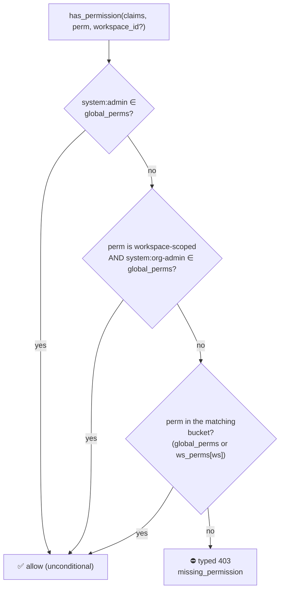

# RBAC

> **At a glance.** The authorization reference for {brand} — for operators granting
> access and engineers writing permission checks. It covers the **eight built-in roles**,
> the namespaced **permission catalogue**, the central **resolver** that folds role
> bindings into per-request claims, the typed **403 contract**, and the surrounding
> machinery: custom roles, invites, time-bound bindings, session revocation, and the
> audit log.

The authorization model: eight built-in roles, a namespaced permission
catalogue, and a central resolver that folds a user's role bindings into
per-request permission claims. A failed check returns a typed 403 body.
Custom roles extend the built-in set within the same rules.

> **Caution:** `super_admin` carries `system:admin`, which short-circuits **every**
> permission check platform-wide. Bind it sparingly (platform owner / SRE break-glass)
> and prefer `org_admin` for cross-workspace operators who shouldn't own users or SSO.

## TL;DR

* Eight built-in roles. Four global-tier (including the default `user`
  tier for anyone without an explicit global role), four
  workspace-scoped.
* Permissions are namespaced by category — `system:*` or `workspace:*`.
  The resolver only emits perms whose category matches the binding's
  scope; cross-category leaves are silently dropped.
* `workspace:admin` auto-implies every other `workspace:*` permission
  in the same workspace. Operators don't enumerate.
* `system:org-admin` is a global shortcut for any workspace-scoped
  check — the `org_admin` tier acts in every workspace without
  per-workspace bindings.

## The eight roles

| Role               | Scope     | Carries (after resolve)                                  | When to bind                                                    |
|--------------------|-----------|----------------------------------------------------------|-----------------------------------------------------------------|
| `super_admin`      | global    | `system:admin` (implies everything)                      | Platform owner / SRE break-glass. Bind sparingly.               |
| `org_admin`        | global    | `system:org-admin`, `system:workspaces:create`, `system:groups:manage`, `workspace:*` (via shortcut) | Org-wide operator who curates workspaces but doesn't own users / SSO. |
| `org_auditor`      | global    | `system:org-viewer`, `system:audit:read`, `system:bindings:read` (read-only cross-workspace via the org-viewer shortcut) | Compliance / audit reviewer — sees every workspace, all bindings, and the audit log; mutates nothing. |
| `user`             | global    | *(nothing — the implicit default tier; no bindings, no workspace access)* | Not bound directly. The default tier for any account without an explicit global role. |
| `workspace_admin`  | workspace | `workspace:admin` (auto-implies all `workspace:*`)       | Workspace owner who manages members + settings.                 |
| `workspace_data_engineer` | workspace | `workspace:datasource:*`, `workspace:view:*`, `workspace:ontology:*`, `workspace:catalog:*`, `workspace:provider:read` | Owns data products in a workspace (sources, views, ontology, catalog) without managing members or settings. |
| `workspace_member` | workspace | `workspace:view:*`, `workspace:datasource:*`             | Standard contributor — edit views + manage data sources.         |
| `workspace_viewer` | workspace | `workspace:view:read`, `workspace:datasource:read`       | Read-only auditor / executive who shouldn't be able to edit.    |

The **global** roles `super_admin`, `org_admin`, and `org_auditor`
live at `scope_type='global'`, `scope_id=NULL`; `user` is the implicit
default tier for any account without a global binding (nothing is
stored for it). The four **workspace** roles are stored at global
scope too (they're templates that bind to any workspace), but binding
them only emits workspace-category perms thanks to the resolver's
filter.

## Permission catalogue

| ID                              | Category  | Carried by (built-in roles)        |
|---------------------------------|-----------|------------------------------------|
| `system:admin`                  | system    | `super_admin`                      |
| `system:org-admin`              | system    | `super_admin`, `org_admin`         |
| `system:users:manage`           | system    | `super_admin`                      |
| `system:groups:manage`          | system    | `super_admin`, `org_admin`         |
| `system:workspaces:create`      | system    | `super_admin`, `org_admin`         |
| `system:org-viewer`             | system    | `super_admin`, `org_auditor`       |
| `system:audit:read`             | system    | `super_admin`, `org_auditor`       |
| `system:bindings:read`          | system    | `super_admin`, `org_auditor`       |
| `workspace:admin`               | workspace | `super_admin`, `org_admin`, `workspace_admin` |
| `workspace:datasource:manage`   | workspace | `super_admin`, `org_admin`, `workspace_admin`*, `workspace_member` |
| `workspace:datasource:read`     | workspace | + `workspace_viewer`               |
| `workspace:view:create`         | workspace | `super_admin`, `org_admin`, `workspace_admin`*, `workspace_member` |
| `workspace:view:edit`           | workspace | (same)                             |
| `workspace:view:delete`         | workspace | (same)                             |
| `workspace:view:publish`        | workspace | `super_admin`, `org_admin`, `workspace_admin`* |
| `workspace:view:read`           | workspace | + `workspace_viewer`               |

\* `workspace_admin` only stores `workspace:admin` in
`role_permissions`. The other `workspace:*` perms come from the
resolver's auto-implication rule — see *Auto-implication* below.

### View visibility and sharing (2026-07-31 rework)

Views carry a visibility tier plus optional explicit grants
(`resource_grants`, user or group subjects, `viewer`/`editor` roles).
The evaluator (`backend/app/services/view_access.py`) gates on the tier
first — the old membership-first union made `private` behave exactly
like `workspace` for every member:

| Tier         | Who can open it (and load its data, read-only)                       |
|--------------|----------------------------------------------------------------------|
| `private`    | creator, explicit grantees, workspace admins (+ org/system admins)   |
| `workspace`  | the above + `workspace:view:read` holders in the view's workspace    |
| `enterprise` | any signed-in user on the platform                                   |

Reading a view now implies **read-only** access to its data plane: the
graph/canvas routers accept a `?viewId=` capability context
(`backend/app/api/v1/capability_gate.py`) pinned to the view's
resolved data source. Mutations always require
`workspace:datasource:manage`. Workspace-metadata surfaces (assets
rule-sets, context-model templates) use an unpinned variant of the
gate — they have no data-source dimension, so a capability holder on
ANY readable view in the workspace can read them; both routers are
GET-only or manage-gated.

`workspace:view:publish` gates every transition **to or from**
`enterprise` (including creating a view directly as enterprise) — the
base creator/ws-admin rule still gates `private ↔ workspace`. The
permission is deliberately delegable: grant it to a trusted non-admin
role to let curators publish.

**Nobody is ever stuck.** A member who owns a view's sharing settings
but lacks the permission can *request* publication (`POST
/views/{id}/publish-request`); the pending request lives on the view
and is the admin queue. A publish-permission holder approves (which
performs the transition, logged as `visibility_changed`) or declines
with a reason that lands on the view's timeline. Workspaces that don't
want the ceremony set `workspaces.publish_policy = 'open'`, where
anyone who may change a view's visibility may publish it directly —
the policy widens who satisfies the permission, never who may touch a
view's visibility.

**Admin reads of private views are recorded.** `system:admin` reach
over a private view someone else created writes an `admin_viewed`
entry to that view's activity log (deduped hourly per admin). The
reach is unchanged; it is simply no longer invisible to the owner.

Caveat for rollouts: sessions minted before this permission shipped may
still carry a collapsed `workspace:view:*` wildcard in their cached
claims and would pass a publish check until the session refreshes
(bounded by the access-token TTL). Force re-login via the revocation
service if that window matters.

## Resolver behaviour

A permission check resolves through a fixed short-circuit ladder — the two global
shortcuts win before any per-workspace bucket is consulted:



The buckets themselves are built by the resolver from a user's bindings, applying the
category × scope filter and `workspace:admin` auto-implication described below.

### 1. Category × scope filter

Every binding's permissions are filtered against the binding's scope:

* `binding.scope_type='global'` → only `category='system'` perms land
  in `global_perms`.
* `binding.scope_type='workspace'` → only `category='workspace'` perms
  land in `ws_perms[scope_id]`.

So binding `super_admin` at workspace scope (legal but unusual)
produces a workspace bucket with `{workspace:admin,
workspace:view:read, ...}` — but never `system:admin`. And binding
`workspace_member` at global scope produces nothing — the filter drops
the workspace:* perms because the binding is global.

### 2. `workspace:admin` auto-implication

After folding bindings, any workspace bucket containing
`workspace:admin` is unioned with the full catalogue of `workspace:*`
leaves. Operators bind `workspace_admin` once; the resolver does the
rest. Custom roles that bundle only `workspace:admin` get the same
treatment.

### 3. `system:org-admin` global shortcut

`has_permission(claims, perm, workspace_id=ws)` short-circuits to
`True` when both:

* `perm` is workspace-scoped (`workspace_id is not None`)
* `system:org-admin` ∈ `claims.global_perms`

This lets `org_admin` act in every workspace without per-workspace
bindings or large `ws_perms` claims.

### 4. `system:admin` system-wide shortcut

`has_permission` returns `True` unconditionally when `system:admin` ∈
`claims.global_perms`. The `super_admin` tier holds it.

## How claims reach a request

Resolution is unchanged by any of the below — what changed is how the result travels.

`sid` and `global_perms` ride in the access JWT. They are bounded: global permissions are a
fixed vocabulary, so the token does not grow with tenant size.

`ws_perms` is **not** bounded — it grows with every workspace a user is bound to — so it
does **not** travel in the cookie at all. `to_jwt_dict()` has no option to include it; the
invariant is enforced by the signature rather than by review.

The grants live in the session store, keyed by `sid` — the same entry already read on every
request for revocation, fetched in the same pipelined round trip, so reading them costs
nothing extra. `get_permission_claims` resolves **Redis → Postgres → "unknown"**, in that
order. It never degrades to "global perms only": that is a denial dressed as a 200, and the
whole point is to stop authorization failing silently.

**"Unknown" is not "none".** When neither source can answer, the claims come back with
`ws_available=False` rather than an empty map, and that distinction is load-bearing. An empty
map is a *claim about the user*: hand it to `requires` and it produces 403 `Missing
permission: …`, stating as fact something the server never established. So:

| State | Workspace-scoped check | Global check | `GET /me/permissions` |
|---|---|---|---|
| Grants resolved | 200 / 403 on the grants | 200 / 403 | 200 |
| User genuinely has none | 403 | 200 / 403 | 200, empty `ws` |
| Neither source could answer | **503** | 200 / 403, unaffected | **503** |

The 503 decision is made in `requires`, not in `get_permission_claims`, because only there is
it known whether the missing half was needed — a global permission is settled entirely by the
token, so a Redis outage must not touch it. `GET /me/permissions` refuses for a different
reason: the SPA store installs whatever it returns, so a 200 with an empty `ws` would
overwrite a known-good claim set and blank every workspace-gated control; an error leaves the
previous claims in place.

In practice `ws_available=False` requires Redis *and* Postgres to be unreachable at once — a
Redis outage alone is answered from Postgres (cached 30s per user, so an outage does not turn
into a permission query per request).

Stored payloads are deduplicated: `{"ws": {ws_id: index}, "psets": [[perms]]}`. Every
workspace a user holds the same role on resolves to the *same* permission set, so storing
each distinct set once and pointing at it by index is roughly a ninefold reduction — 150
workspaces used to be 150 verbatim copies of one array.

**Why it matters.** A cookie over 4096 bytes is discarded by the browser *silently*: login
answers 200, the `Set-Cookie` goes out, the next request is anonymous, and nothing is
logged. Before this, ~18 workspace bindings crossed that line, so the most heavily bound
accounts hit unexplained sign-outs that nobody else could reproduce.

An intermediate version embedded the grants while they fitted and shed them above a byte
budget. It worked, and it was still wrong: a user with 99 bindings and one with 101
exercised different authorization machinery, and the store path — the one serving the
largest tenants — was the one almost nothing routinely tested. There is now one path for
every session.

**Reading old tokens still works.** A token minted before this carries inline permission
lists and has no store entry, and the reader recognises the layout per value rather than
assuming one — so a tab open across the deploy keeps every permission it had, with no
reload. Self-draining: after one refresh TTL no such token can exist and the compatibility
branch in `_decode_ws` is removable.

## 403 body

When a check fails, the endpoint raises a structured 403:

```json
{
  "detail": {
    "error": "missing_permission",
    "permission": "workspace:datasource:read",
    "scope": {"type": "workspace", "id": "ws_finance"},
    "message": "Missing permission: workspace:datasource:read"
  }
}
```

The `message` field preserves the legacy text so existing scrapers
keep working. New consumers should read `permission` and `scope`.

The FE access-denied modal extracts the scope id to render
"Access denied in *Finance*" rather than the opaque slug.

## Operator recipes

### "I want admin in workspace X"

Bind `workspace_admin` to the user at `scope_type='workspace',
scope_id=<X>`. The user can now do every `workspace:*` action in X
and nothing in any other workspace.

### "I want X to manage every workspace but not touch users / SSO"

Bind `org_admin` at global scope. The user gets the cross-workspace
shortcut + workspace creation + group management, but not user
administration or SSO config.

### "I want X to be platform owner"

Bind `super_admin` at global scope. The user gets `system:admin`
which short-circuits every check.

### "I want a user to read everything in finance but not edit"

Bind `workspace_viewer` at `scope_type='workspace', scope_id=<finance>`.

### "I want a user to be admin in finance AND a viewer in marketing"

Two bindings:

* `workspace_admin` @ scope=`(workspace, finance)`
* `workspace_viewer` @ scope=`(workspace, marketing)`

The resolver folds them into one claim with two workspace buckets:

```json
{
  "global": [],
  "ws": {
    "finance":   ["workspace:admin", "workspace:view:*", "workspace:datasource:*"],
    "marketing": ["workspace:view:read", "workspace:datasource:read"]
  }
}
```

The TopBar role badge flips between "Workspace Admin" and "Viewer" as
the user navigates between `/workspaces/finance` and
`/workspaces/marketing`.

## Custom roles

`role_repo.create_role` accepts any name not in the built-in set, any
permission set from the catalogue, and a scope (`global` or
`workspace`). Tied-scope roles (`scope_type='workspace',
scope_id=<X>`) are only bindable in workspace X — the canonical
example is an "Alpha auditor" who can only be a viewer in workspace
Alpha.

The resolver applies the same category × scope filter to custom
roles; bundling `system:users:manage` into a workspace-scoped custom
role will silently emit nothing when bound at workspace scope. Bundle
permissions whose category matches the role's scope.

The create-role permission picker filters by the role's selected
scope: workspace roles see `workspace:*` + `resource:*` only, global
roles see `system:*` + `resource:*` only. Switching scope mid-edit
clears any now-invalid selections, so an operator can't accidentally
bundle a cross-category permission the resolver would drop.

## Assigning and revoking access

### Global role assignment writes both stores

`user_repo.set_global_role(session, user_id, role_name)` writes
`user_roles` and `role_bindings` in one transaction, so a promoted
user's display role and resolved claims always agree. `PUT
/admin/users/{user_id}/role` and the bootstrap admin path in
`main.py` both go through it.

`ChangeRoleRequest` restricts `role` to the **globally assignable**
set — `super_admin` and `org_admin`. Workspace-tier roles
(`workspace_admin` / `workspace_member` / `workspace_viewer`) are
bound via the workspace-members endpoint, which supplies the
workspace context they need; binding them globally would be dropped
by the resolver's category filter anyway. The AdminUsers UI dropdown
enforces the same restriction and hides `super_admin` when the caller
lacks `system:admin`.

### View-grants gating

`/views/{view_id}/grants` is gated by the router-level FastAPI
dependency `can_manage_view_grants`, which:

1. Loads the view (404 on miss).
2. Allows the creator.
3. Allows a workspace admin of the view's workspace.
4. Allows `system:admin`.
5. Otherwise 403s with the structured body above.

The dependency returns the loaded view so handlers don't re-query; the
pure helper `_ensure_can_manage_grants` keeps the rule in one place.

### Session revocation on access narrowing

Every mutation that narrows access wires
`revocation_service.revoke_all_user_sessions` so a stale JWT can't
outlive the change (the JWT TTL, default 5 min, is the fallback):

* `DELETE /admin/workspaces/{ws}/members/{binding}` — a user binding
  revokes that user's sessions; a group binding revokes every group
  member's sessions.
* `PUT /admin/users/{id}/role` — revokes the target user's sessions.
* `PUT /admin/roles/{name}` — revokes every user bound to that role
  (direct + via group) and emits `rbac.role.cascade_revoked` with the
  affected user count.

Every kill is best-effort: a Redis outage logs and continues.

Revocation is consulted in `get_current_user`, so **every**
authenticated request checks the revoked-session set — not just
`requires(...)` routes. A revoked session returns 401, the frontend
silently refreshes, and the reissued JWT carries re-resolved claims;
`RequirePermission` guards and the TopBar admin cog react to the new
claims without a manual reload. This is what lets a just-promoted
admin reach the admin UI mid-session. Revocation fails open on a Redis
outage (an incident must not lock every user out); `requires(...)`
keeps a fail-closed probe for sensitive permissions like `system:admin`
/ `workspace:admin`.

> **Important:** Revocation is deliberately asymmetric under a Redis outage — it
> **fails open** for ordinary checks (a Redis incident must not lock every user out)
> but **fails closed** for the sensitive-permission probe. A revoked JWT is otherwise
> caught on the very next request because `get_current_user` consults the revoked-session
> set on **every** authenticated call, not only `requires(...)` routes.

### Time-bound bindings

`RoleBindingORM.expires_at` auto-expires a binding — contractor, temp,
or on-call access. The resolver always honours it, and the admin API
surfaces it:

* `POST /admin/workspaces/{ws}/members` accepts `expiresAt` (ISO
  timestamp) **or** `expiresIn` (`"24h"` / `"7d"` / `"2w"` —
  `h`/`d`/`w` units, capped at 365 days). Setting both is a 422.
* `PUT /admin/workspaces/{ws}/members/{binding}/expiry` — extend,
  change, or clear (empty body → permanent) the expiry in place.
* The `WorkspaceMembers` UI has an "Access duration" picker
  (Permanent / 24h / 7d / 30d / 90d) and a countdown badge on the
  member list.

Recipe: "Give a contractor 30-day access" → bind `workspace_member`
with `expiresIn: "30d"`.

### Workspace deletion cascade

Deleting a workspace cascades both the `RoleBindingORM` rows pointing
at it (`delete_scope_bindings`) and the custom `RoleORM` rows scoped
to it (`role_repo.delete_workspace_scoped_roles`), which couldn't be
bound anywhere else. A `rbac.workspace.roles_cascaded` outbox event
lists the removed bindings + roles.

## Invites

An admin can mint an invite for **any** role — global tiers, workspace
tiers, or custom roles — with the workspace bound on signup. Two link
classes, split by privilege:

* **Shareable link** (no email pin, reusable until expiry) — for
  **non-privileged** roles: `workspace_member`, `workspace_viewer`,
  custom roles with no admin/manage perm, or **no role** (a plain
  activated account).
* **Email-bound link** (token pins a target email; reusable until
  expiry but only that address can accept) — **required** for
  **privileged** roles: `super_admin`, `org_admin`, `workspace_admin`,
  and any custom role carrying `workspace:admin` or a `system:*` perm.
  A forwarded link can't escalate an unintended identity.

**Privileged** is computed from `role_permissions` (includes
`workspace:admin` or any `system:*`), so custom roles classify
automatically. The invite token (`create_invite_token`) carries
optional `workspace_id` and `email`; signup (`auth.py`) honours every
role — global tiers via `set_global_role`, everything else via a
`role_binding` at the right scope, re-validated for bindability at
signup time. Email-bound invites reject a mismatched signup email.

**Groups on invite.** An invite can attach zero or more internal
groups from the live catalogue; on signup the new user is added to each
via `group_repo.add_member`. Any invite that attaches groups is
email-bound by default (a group binding can reach across workspaces the
inviter doesn't see at mint time). Protected (IdP-managed) groups are
refused at the create step. An opt-in **shareable-group override**
(`allow_shareable_with_groups`) relaxes the email requirement for the
groups-cross-workspace rule only — it never bypasses the privileged-role
email pin or the protected-group refusal, and it is auto-revoked if a
privileged role is added or all groups are removed. Override invites
emit `user.invite_created_shareable_with_groups` (vs the standard
`user.invite_created`) with `shareable_groups_override: true` for
auditing.

The invite modal classifies roles by `isSystem` (built-in → "Standard
Roles", operator-created → "Custom Roles") and a live summary narrates
the invite in plain English as the form changes.

> **The access model invites respect.** A user has no access to any
> workspace unless explicitly granted a binding in that workspace.
> A plain invite (no role) → activated account, zero bindings, no
> workspace access. A non-privileged **global** custom role → a global
> binding whose workspace perms the resolver drops → still no workspace
> access. Only an explicit **workspace** binding grants access to that
> one workspace; only `super_admin` and `org_admin` cross workspaces,
> via the resolver short-circuits.

## Audit log

Every state-changing RBAC/auth mutation emits an outbox event; the
relay lands it in `auth_audit_log`. Operators read it through:

* `GET /api/v1/admin/audit` (gated `system:admin`) — filter by event
  type prefix (`rbac.role.*`), actor, target user / role, workspace,
  and timestamp window. Cursor pagination (50/page default, 500 max).
  Every row carries a `severity` (`info` / `warning` / `critical`) and
  a one-line human `summary` computed from the event-type catalogue;
  unknown events fall back to `info` + the raw type.
* `GET /api/v1/admin/audit/event-types` — distinct event types for the
  filter dropdown.
* `/admin/audit` — the admin page: a three-mode scope filter
  (**Security** default / **Activity** / **Everything**), time-range
  chips, a KPI strip by category, click-to-expand JSON payloads, and
  clickable actor / target / workspace links.

Every `requires()` 403 also emits a `user.access_denied` event,
sampled hourly per `(user, permission, scope)` so a hostile scan
can't drown the signal. Emission is best-effort (wrapped in
try/except) so an outbox or Redis failure never blocks the 403.

Compliance recipe: "Who promoted Alice last week?" → filter
`targetUserId=alice`, `eventType=user.role_changed`,
`fromTs=<7-days-ago>`.

## Where to look in the code

| Concern                                | File                                                          |
|----------------------------------------|---------------------------------------------------------------|
| Resolver (DB → claims)                 | `backend/app/services/permission_service.py:resolve`          |
| Claim-time checks                      | `backend/app/services/permission_service.py:has_permission`   |
| FastAPI `requires(...)` factory         | `backend/app/auth/dependencies.py`                            |
| Role bindability                       | `backend/app/db/repositories/role_repo.py`                    |
| Permission catalogue / categories      | `backend/app/db/repositories/permission_repo.py`              |
| Frontend `checkPermission`             | `frontend/src/store/auth.ts`                                  |
| Workspace-aware role badge             | `frontend/src/components/layout/TopBar.tsx`                   |
| Migration                              | `backend/alembic/versions/20260603_1100_rbac_uplift.py`       |
| Regression tests                       | `backend/tests/test_rbac_phase5.py`                           |

## Related docs

* [SSO Integration Guide](/docs/sso-integration) — IdP → role-binding
  reconciliation pulls roles from this taxonomy.
* [SSO operator reference](/docs/sso) — operator-facing SSO posture; cross-references
  the role names here.

## History

The current eight-role taxonomy was introduced by the
`20260603_1100_rbac_uplift` migration, which renamed the earlier
three-role set (`admin`/`user`/`viewer`) and added the `org_admin`
role plus the `system:org-admin` permission:

| Old              | New                                              |
|------------------|--------------------------------------------------|
| `admin` (global) | `super_admin`                                    |
| `admin` (ws)     | `workspace_admin`                                |
| `user`           | `workspace_member`                               |
| `viewer`         | `workspace_viewer`                               |
| `users:manage`   | `system:users:manage`                            |
| `groups:manage`  | `system:groups:manage`                           |
| `workspaces:create` | `system:workspaces:create`                    |

The migration is reversible; its `downgrade()` renames everything back
and drops the added permission + role. Legacy malformed
`(role='user', scope='global')` rows from an earlier backfill are
dropped on upgrade (with a per-row WARNING) and stay dropped on
downgrade — `user` is a workspace-scoped tier, so those rows were never
valid.
