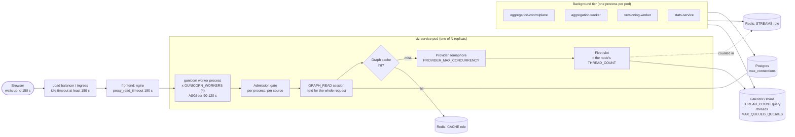

# Scaling for hundreds to thousands of concurrent users

> **At a glance.** How to size {brand} for ~100, ~500 and ~1,000+ people using it at
> the same time: which tier to scale, which knob moves it, and what every extra pod costs
> in Postgres, Redis and FalkorDB connections. It ends with three ready-to-apply profiles,
> a connection-budget worksheet, the alerts to set and the load test that proves the result.

**Who this is for:** platform engineers and SREs who run {brand} on Kubernetes (the
`deploy/k8s` overlays or the Helm chart) and need to take it from a pilot to a department
or a whole company. A single-VM compose install is covered by [DEPLOYMENT.md](DEPLOYMENT.md).

This page links to its companions rather than repeating them:

| Companion | Authoritative for |
|---|---|
| [CONCURRENCY_TUNING.md](CONCURRENCY_TUNING.md) | The nine read-path ceilings, the timeout ladder, troubleshooting by symptom |
| [FALKORDB_DEPLOYMENT.md](FALKORDB_DEPLOYMENT.md) | Graph-store topology and the memory sizing rule |
| [INFRASTRUCTURE_LAUNCH_SCALE.md](INFRASTRUCTURE_LAUNCH_SCALE.md) | A worked GCP specification (Cloud SQL, Memorystore, FalkorDB cluster) |
| [DATA_ARCHITECTURE.md](DATA_ARCHITECTURE.md) | The Redis roles and the runbook for splitting the cache off |
| [Graph store guide](/guide/graph-store-topology) | Reading **Admin → Graph store**: shards, replicas and who answers a read |

> **Note:** Every default on this page is taken from the code or a shipped manifest.
> Anything computed from those defaults is marked *derived*: it is arithmetic, not a
> measurement. Prove it with the load test in §9 before you rely on it.

---

## TL;DR: the checklist

1. **Know the binding constraint.** One data source is served by the query threads of the
   one FalkorDB shard that holds it: 6 on a production-cluster shard, 8 on a single node.
   Web replicas add queue depth, not graph capacity (§1).
2. **Measure mean Cypher time and the graph-cache hit ratio first.** Together they decide
   how many users one data source can serve; the manifests can't tell you (§2).
3. **Give viz-service one CPU per gunicorn worker.** The base, staging and Helm manifests
   run 4 workers under a 1-CPU limit; the production overlay uses 4 CPUs (§3).
4. **Do the Postgres worksheet at HPA `maxReplicas`**, not at today's replica count. Every
   pod multiplies every pool (§4).
5. **Put a transaction-mode pooler in front of Postgres beyond two web pods** and set
   `DB_POOLER_MODE=transaction`. Without one, 400 connections carry about two viz pods,
   and only with the trimmed pools of §10.1 *(derived)*. With the pools as shipped, one pod
   can open 384 (§4.4).
6. **Treat `maxReplicas` as a connection-safety limit**, not only a cost limit (§3).
7. **Keep Redis on `volatile-lru` while streams and cache share one instance**; split them
   as you grow. Redis Cluster is not supported for either role (§6).
8. **Turn metrics on** (`METRICS_ENABLED` plus `METRICS_TOKEN`) and alert on the signals
   in §8.
9. **Raise every load-balancer idle timeout above 180 s**, and the rollout grace periods if
   long reads must survive a deploy (§7.4).
10. **Load-test the target tier with the protection gate on**, change one thing, repeat (§9).

---

## 1. The mental model



A graph request passes the admission gate, takes a `GRAPH_READ` Postgres session and checks
the graph cache. Only on a miss does it take a provider slot, a fleet-wide slot and a socket
to the one FalkorDB shard that holds its data source. Everything else (sign-in, navigation,
views, lists) uses the `WEB` pool and never touches FalkorDB. Authentication runs inside
viz-service; it is not a separate deployment.

Three facts shape every decision on this page:

- **The store is the ceiling.** A data source lives on one shard, and one shard runs
  `THREAD_COUNT` queries at once: 6 per replica on the production-cluster overlay, 8 on the
  single node that the base and Helm ship. The fleet slot holds cache misses to that number
  across the whole fleet ([CONCURRENCY_TUNING.md](CONCURRENCY_TUNING.md) §1).
- **Every in-process limit is per gunicorn worker.** A viz pod runs `GUNICORN_WORKERS`
  processes (image default 4), and each has its own pools, semaphores and admission gate.
- **Every pod multiplies connections.** One viz pod as shipped can open up to 384 Postgres
  connections *(derived, §4.4)*, plus its Redis clients and FalkorDB sockets. Scaling out is
  cheap for the web tier and expensive for the data tier.

---

## 2. Capacity-planning inputs

Collect these before you pick a profile. The first four decide the answer.

| Input | Why it matters | How to measure it |
|---|---|---|
| Concurrent **active** users | Active users drive graph load; idle tabs barely do | Product analytics, or request rate divided by the per-user rate below |
| Requests per active user per second | Sizes web CPU and the `WEB` pool | Launch-scale planning assumption: about 0.3 to 1 req/s while active ([INFRASTRUCTURE_LAUNCH_SCALE.md](INFRASTRUCTURE_LAUNCH_SCALE.md) §1.2). Confirm from nginx or ingress logs. |
| Mean Cypher time, per data source | Sets graph throughput | `graph_store_command_usec_per_call{command="graph.ro_query"}`, or `INFO commandstats` on the shard |
| Graph-cache hit ratio | A hit skips the store entirely | `graph_cache_reads_total{outcome}`: hit ÷ (hit + miss) |
| Cypher per user gesture | Turns clicks into store load | A cold open of a 500-entity view costs about 9 HTTP requests and 55 Cypher queries ([CONCURRENCY_TUNING.md](CONCURRENCY_TUNING.md) §1) |
| Background load of open tabs | The floor under thousands of open tabs | Each tab polls 5 endpoints every 60 s (`frontend/src/config/polling.ts`), about 0.08 req/s per tab *(derived)* |

How many users one data source can serve:

```
users per data source ≈ (THREAD_COUNT ÷ mean Cypher time) ÷ Cypher per user per second
```

*Derived* from that formula, with one cold 55-query open per user per minute and no cache
hits. The 6-thread column is the table in [CONCURRENCY_TUNING.md](CONCURRENCY_TUNING.md) §1:

| Mean Cypher time | 6 threads (cluster shard, as shipped) | 8 threads (single node) | 12 threads (nine-pod cluster) |
|---|---|---|---|
| 20 ms | ~330 | ~435 | ~655 |
| 50 ms | ~130 | ~175 | ~260 |
| 100 ms | ~65 | ~85 | ~130 |

**Cache hits multiply it** *(derived)*. With hit ratio *h*, only (1 − *h*) of those queries
reach the store, so divide by (1 − *h*): a 50 % hit ratio doubles the number, 80 % multiplies
it by five. That is how one data source serves 1,000+ people: through a warm cache, not
more pods. Different data sources on different shards add up.

> **Tip:** Measure mean Cypher time on your own data. It is the one input nobody can
> derive from the manifests, and it moves the answer more than any setting here.

---

## 3. Tier by tier

| Service | Process model | Base | Production overlay | Scale it by | Each extra replica adds |
|---|---|---|---|---|---|
| `frontend` (nginx + SPA) | nginx; up to 32 idle upstream connections to viz per nginx worker (`keepalive 32`) | 2, HPA 2–6 (CPU 70 %) | 3, HPA 3–8 | HPA; cheap | Nothing downstream beyond pooled upstream connections |
| `viz-service` (API and in-process auth) | gunicorn + UvicornWorker × `GUNICORN_WORKERS` (4) | 2, HPA 2–8 (CPU 70 %, memory 80 %); limit 1 CPU / 1Gi | 3, HPA 3–12; request 500m / 1Gi, limit 4 CPU / 2Gi | HPA, with the CPU limit ≥ workers | 4 × every Postgres pool, Redis client and FalkorDB socket pool, and 4 more admission gates. No store capacity. |
| `aggregation-controlplane` | 1 process | 1 | 2 (for HA; every loop is HA-safe) | 2 replicas, for availability only | One process's pools; its FalkorDB pools are forced small (4) |
| `aggregation-worker` | 1 process running `WORKER_CONCURRENCY` (4) jobs | 2, HPA 2–10 (CPU 60 %); limit 2 CPU / 4Gi | 3, HPA 3–20; limit 4 CPU / 12Gi | HPA; memory-bound on full rebuilds | Pools, plus a FalkorDB pool of `WORKER_CONCURRENCY × 4 + 8` (24). Write and read slots stay per FalkorDB node. |
| `versioning-worker` | 1 process (projection, imports, exports) | 1; limit 2 CPU / 4Gi; no HPA, PDB or probes | Same | Replicas, up to the number of graphs lagging at once | `JOBS` and `GRAPHVER` pools; `GRAPHVER_TRANSFER_SLOTS` (2) jobs |
| `stats-service` (insights) | 1 process | 1; limit 500m / 512Mi | Same | Replicas (per-source Redis dedup) | 11 Postgres connections (explicit `JOBS` 4+2, `READONLY` 3+2) |
| FalkorDB | `THREAD_COUNT` query threads per node | 1 node, `THREAD_COUNT 8`; limit 8 CPU / 14Gi | Same. The production-cluster overlay: 3 shards × (1 master + 1 replica), `THREAD_COUNT 6`, 7 CPU / 56Gi | Up (threads = CPU, plus the memory rule); replicas per shard for more read threads; shards for more data sources | See §5 |
| Postgres | — | In-cluster, `max_connections=400` | Deleted: Cloud SQL behind its managed pooler (`DB_POOLER_MODE=transaction`) | A managed instance behind a transaction pooler | See §4 |
| Redis | — | In-cluster `redis:7-alpine`, 2gb, `volatile-lru` | Deleted: two Memorystore instances (streams, cache) | Split cache from streams; Sentinel for HA | See §6 |

What the table doesn't say:

- **CPU must cover the workers.** Base, staging and Helm give viz 4 workers under a 1-CPU
  limit. The production overlay's own comment explains why that fails: four single-threaded
  event loops CFS-throttle on too few cores, and a throttled loop stalls every request on it.
  Set `limits.cpu` to at least `GUNICORN_WORKERS`.
- **HPA targets are a percentage of *requests*.** Production viz requests 500m at a 70 %
  target, so it scales out at about 350m average per pod against a 4-CPU limit *(derived)*.
  That is early, which is good for latency and expensive in connections.
- **`maxReplicas` is a connection budget.** Every replica you allow must fit the
  worksheet in §4. A runaway HPA is a connection storm.
- **A PDB of `minAvailable: 1` on a one-replica Deployment blocks node drains**
  (aggregation-controlplane in the base, and the dev overlay's single replicas).
- **The production overlay spreads replicas across nodes.** Its preferred anti-affinity for
  viz-service, frontend and aggregation-worker selects on `app.kubernetes.io/name`, the
  label the pods carry.
- **The Helm chart has no HPAs, PDBs or versioning-worker.** Scale it with
  `services.<name>.replicas`; `services.viz.workers` sets `GUNICORN_WORKERS`; the control
  plane is fixed at one replica.

---

## 4. Postgres: the connection budget

### 4.1 The pools

Each backend process opens one SQLAlchemy pool per role it uses (`backend/app/db/engine.py`),
plus a separate engine for the versioned store.

| Role | Default: pool + overflow = peak | Env vars | Used by |
|---|---|---|---|
| `WEB` | 20 + 10 = 30 | `DB_WEB_POOL_SIZE`, `DB_WEB_POOL_MAX_OVERFLOW` (the legacy `DB_POOL_SIZE` and `DB_POOL_MAX_OVERFLOW` also set `WEB`, and only `WEB`) | Request handlers |
| `JOBS` | 8 + 4 = 12 | `DB_JOBS_POOL_SIZE`, `DB_JOBS_POOL_MAX_OVERFLOW` | Scheduler, workers, outbox |
| `READONLY` | 10 + 5 = 15 | `DB_READONLY_POOL_SIZE`, `DB_READONLY_POOL_MAX_OVERFLOW` | Readiness, drift checks, stats (read-only sessions) |
| `PROVIDER_PROBE` | 4 + 2 = 6 | `DB_PROVIDER_PROBE_POOL_SIZE`, `DB_PROVIDER_PROBE_POOL_MAX_OVERFLOW` | Provider test and status fan-out |
| `GRAPH_READ` | 10 + 10 = 20 (k8s `viz-config`: 8 + 8 = 16) | `DB_GRAPH_READ_POOL_SIZE`, `DB_GRAPH_READ_POOL_MAX_OVERFLOW` | Graph and canvas endpoints, **held for the whole request** |
| `ADMIN` | 2 + 0 = 2 | `DB_ADMIN_POOL_SIZE`, `DB_ADMIN_POOL_MAX_OVERFLOW` | Migrations, startup |
| **Per process** | **85** | | |
| `GRAPHVER` (separate engine) | 10 + 5 = 15 | `GRAPHVER_POOL_SIZE`, `GRAPHVER_POOL_MAX_OVERFLOW` | The versioned store: `GRAPHVER_DB_URL`, else `MANAGEMENT_DB_URL` |

Shared by every role: `DB_POOL_TIMEOUT_SECS` 10 (the checkout wait), `DB_POOL_RECYCLE_SECS`
1800, `DB_POOL_PRE_PING` true, `DB_CONNECT_TIMEOUT_SECS` 5 and `DB_COMMAND_TIMEOUT_SECS` 30
(the client-side cap on one statement).

> **Warning:** The suffix is `_POOL_MAX_OVERFLOW`, not `_MAX_OVERFLOW`. A misspelled name is
> silently ignored; `viz-config` carried one for a long time. The test
> `backend/tests/test_deploy_pool_env_names.py` now rejects unknown pool names in `deploy/`.

Two properties decide the arithmetic:

- **Pools are lazy.** A role a process never uses opens nothing. Once a pool has been used,
  SQLAlchemy keeps up to `pool_size` connections open and closes overflow connections when
  they are returned.
- **Each process logs the pools it opened.** One `Engine[<role>] pool: size=…, max_overflow=…`
  line appears per role, when that role is first used. `kubectl logs <pod> | grep 'Engine\['`
  is the authoritative list for your worksheet. The line is logged at `INFO`, and the
  production overlay runs at `WARNING`, so read it in staging or lower `LOG_LEVEL` briefly.
  The `GRAPHVER` engine logs no such line, so count it for any process that might touch the
  versioned store.

### 4.2 The formula

*Derived* from the pool sizes above:

```
ceiling per process = Σ over the roles it opens of (pool_size + max_overflow)   (+ GRAPHVER)
steady per process  = Σ over the roles it opens of  pool_size                   (+ GRAPHVER)
service total       = replicas at HPA maxReplicas × processes per pod × per-process value
                      processes per pod = GUNICORN_WORKERS for viz-service, 1 for everything else
fleet total         = Σ over services
```

- **Direct to Postgres:** the fleet **ceiling** must fit `max_connections` minus Postgres's
  `superuser_reserved_connections` (3 by default). Otherwise a burst that reaches every
  overflow at once is refused with `too many clients already`.
- **Behind a transaction pooler:** the fleet ceiling must fit the pooler's client limit
  (PgBouncer's `max_client_conn`), and the *server* side is sized by concurrency (§4.5).

### 4.3 Worksheet

Fill one row per service. Use `maxReplicas` for anything with an HPA.

| Service | Processes (replicas × per pod) | Ceiling per process | Fleet ceiling | Steady per process | Fleet steady |
|---|---|---|---|---|---|
| viz-service | ___ × `GUNICORN_WORKERS` | | | | |
| aggregation-controlplane | ___ × 1 | | | | |
| aggregation-worker | ___ × 1 | | | | |
| versioning-worker | ___ × 1 | | | | |
| stats-service | ___ × 1 | 11 as shipped | | 7 as shipped | |
| **Total** | | | **Σ** | | **Σ** |

Then compare the total ceiling with `max_connections − 3` (direct) or with the pooler's
client limit, and keep the steady total well under it.

### 4.4 Worked examples

**A. The k8s base, as shipped** *(derived)*. viz-service runs `GRAPH_READ` at 8 + 8 from
`viz-config` and every other role at its default:

```
ceiling per process = 30 + 12 + 15 + 6 + 16 + 2 = 81, + GRAPHVER 15 = 96
steady per process  = 20 +  8 + 10 + 4 +  8 + 2 = 52, + GRAPHVER 10 = 62
per pod (4 workers) = 384 ceiling, 248 steady
HPA minimum, 2 pods = 768 ceiling        HPA maximum, 8 pods = 3,072 ceiling
```

Against the in-cluster `max_connections=400`, the web tier alone is over budget at its
*minimum* replica count. It works at low load only because pools fill lazily, so the first
busy hour is when it stops working.

**B. The production overlay, pools as shipped** *(derived)*. 12 viz pods × 4 workers × 96 =
**4,608** client connections for the web tier alone. That is fine for a pooler's client side
and impossible direct. ([INFRASTRUCTURE_LAUNCH_SCALE.md](INFRASTRUCTURE_LAUNCH_SCALE.md)
§5.4 arrives at 4,080 because it counts 85 per process and leaves out `GRAPHVER`.)

**C, D and E** are the three profiles in §10, each with its own filled-in worksheet.

### 4.5 Direct connections or a transaction pooler

- **Only transaction-mode pooling multiplexes.** A session-mode pooler pins a server
  connection for every held client connection, so it saves nothing.
- **Set `DB_POOLER_MODE=transaction`** (or `statement`) on every backend tier behind such a
  pooler. The engine then passes `statement_cache_size=0` to asyncpg, because prepared
  statements can't survive multiplexing. Leave it unset for direct connections. The
  production overlay sets it (`patches/managed-data-tier.yaml`).
- **No PgBouncer manifest ships in this repository.** The production overlay assumes Cloud
  SQL Managed Connection Pooling, which you enable on the instance.
- **A graph request pins one server connection for its whole duration.** This comes from
  reading the code, so confirm it under load. `get_context_engine`
  (`backend/app/api/v1/endpoints/graph.py`) runs the data-source lookup on the `GRAPH_READ`
  session before the FalkorDB call. The session commits only when the request ends
  (`_session_scope` in `backend/app/db/engine.py`). In between it sits *idle in
  transaction*, and a transaction-mode pooler can't lend that server connection to anyone
  else. Size the pooler's web-side server pool for **concurrent graph requests plus
  concurrent short transactions**. The upper bound is viz processes × the admission gate's
  `hard` limit (§4.6) *(derived)*. Check during a load test:

  ```sql
  SELECT state, count(*) FROM pg_stat_activity GROUP BY state;
  ```

- **If you set `idle_in_transaction_session_timeout` on the server**, keep it above the graph
  tier (120 s), or it will kill graph requests that are waiting on FalkorDB. The app sets no
  server-side `statement_timeout` or idle timeout itself.

### 4.6 `GRAPH_READ` also sizes the admission gate

```
hard     = GRAPH_INFLIGHT_HARD_MAX   or max(4, GRAPH_READ pool + overflow − 4)
reserved = PROVIDER_SOURCE_RESERVED  or max(1, (GRAPH_READ pool + overflow) // 8)
```

| `GRAPH_READ` pool + overflow | `hard` (graph requests per process) | `reserved` per data source |
|---|---|---|
| 10 + 10 = 20 (code default) | 16 | 2 |
| 8 + 8 = 16 (k8s `viz-config`) | 12 | 2 |
| 6 + 4 = 10 (the profiles in §10) | 6 | 1 |

Shrinking the pool to save connections also lowers how many graph requests one worker
admits, and requests past `hard` get a 429. Across the fleet that is still far more than the
store runs at once, because the fleet slot holds cache misses to `THREAD_COUNT`. For most
deployments the trade is right, but it is a trade.

### 4.7 What exhaustion looks like

| What you see | What it means | What to do |
|---|---|---|
| 503 "Database is temporarily unavailable. Please try again." with `Management DB error: QueuePool limit of size … connection timed out` in the logs | A checkout waited `DB_POOL_TIMEOUT_SECS` (10 s): that process's pool is full | Pool too small for the load on that process, or sessions held too long (slow graph calls). Read `/internal/metrics/db`. |
| The same 503 body, with `Management DB error: … too many clients already` in the logs | Postgres refused the connection: the fleet exceeds `max_connections` | Redo the worksheet; add a pooler; lower `maxReplicas` or the pools |
| WARN `DB pool[<role>] sustained >80% utilisation for >5s` | Early warning for the first row | Raise that role's pool, or find the endpoint holding sessions |

### 4.8 Limits to plan around

- **No read replicas.** Every role, `READONLY` included, connects to `MANAGEMENT_DB_URL`. The
  only split the code supports is `GRAPHVER_DB_URL` for the versioned store, which is
  config-only ([INFRASTRUCTURE_LAUNCH_SCALE.md](INFRASTRUCTURE_LAUNCH_SCALE.md) §5.6).
- **The `GRAPHVER` engine ignores `DB_POOLER_MODE`.** It is built without `connect_args`
  (`backend/app/services/versioning/db.py`), so behind a transaction pooler its asyncpg
  prepared statements can collide (`prepared statement "__asyncpg_stmt_N__" already exists`).
  Test the versioned paths behind your pooler. If they fail, route `GRAPHVER_DB_URL` directly
  or through a session-mode pool, and count its pools against `max_connections`.

---

## 5. FalkorDB

### 5.1 As shipped

| | compose | k8s base / Helm store | production-cluster shard |
|---|---|---|---|
| `THREAD_COUNT` | 8 | 8 | 6 |
| CPU / memory limit | — | 8 / 14Gi | 7 / 56Gi |
| `maxmemory` | 14gb (`FALKORDB_MAXMEMORY`) | 6gb | 32gb |
| `QUERY_MEM_CAPACITY` | 512 MiB | 512 MiB | 1 GiB |
| `MAX_QUEUED_QUERIES` | 64 | 64 | 150 |
| `TIMEOUT_MAX` | 180000 ms | 180000 ms | 120000 ms |
| `CACHE_SIZE` | 256 | 50 | 40 |
| Topology | 1 node | 1 node | 3 shards × (1 master + 1 replica) |

- **Threads follow CPU.** Keep `THREAD_COUNT` at or below the CPU limit, with
  `OMP_THREAD_COUNT 1`.
- **Threads cost memory.** Every concurrent query can hold `QUERY_MEM_CAPACITY` (plus its
  reply buffer) inside the same container limit as `maxmemory`. Re-check
  [the sizing rule](/docs/falkordb-deployment#sizing-the-ceilings-share-one-budget) before
  raising `THREAD_COUNT`; don't re-derive it here.
- **Keep `FALKORDB_SERVER_TIMEOUT_MAX_MS` equal to the server's `TIMEOUT_MAX`** (180000 in
  the base, 120000 on the cluster overlay). Every per-query budget in §7.3 sits under it.

### 5.2 Read capacity: replicas and shards

- **One graph is one key, one hash slot and one shard.** Shards spread *data sources*
  across hardware; they never widen one source.
- **Reads go to in-sync replicas.** Raising the cluster StatefulSets from `replicas: 2` to
  `replicas: 3` doubles the read threads per source, from 6 to 12. It needs nine nodes on
  `falkordb-pool` first, and the cluster init Job must learn about the extra pods; follow
  `deploy/k8s/overlays/production-cluster/README.md`.
- **The cluster doesn't widen a single hot source.** A single node gives one source 8
  threads; a cluster shard's replica gives it 6. Move to the cluster for many sources and
  for HA. Move to nine pods to widen one hot source.

### 5.3 Client sockets and `maxclients`

*Derived* from the pool defaults:

```
sockets per FalkorDB node ≈ viz processes × active data sources on that node × FALKORDB_GRAPH_POOL_SIZE (24)
                          + every backend process × FALKORDB_POOL_SIZE (PROVIDER_MAX_CONCURRENCY × 2 + 4 = 20)
```

`maxclients` is set nowhere, so the server default of 10,000 applies. Worked example
*(derived)*: 48 viz processes (production at `maxReplicas`) × 4 sources on one shard × 24 =
4,608, plus 48 × 20 = 960, gives about 5,570 before the workers. `PROVIDER_CACHE_IDLE_TTL_SECS`
(900 s; 7200 s on workers) closes idle provider instances and their sockets. Change
`FALKORDB_GRAPH_POOL_SIZE` only together with `PROVIDER_MAX_CONCURRENCY`
([CONCURRENCY_TUNING.md](CONCURRENCY_TUNING.md) §1, row 6).

### 5.4 The shedding layers

Four layers bound the work presented to the store. All of them shed with **429 +
Retry-After** (code `PROVIDER_BUSY`), which the canvas retries in place.

| Layer | Knob and default | Scope |
|---|---|---|
| Admission gate | `GRAPH_INFLIGHT_HARD_MAX` (0 = pool − 4), `PROVIDER_SOURCE_RESERVED` (0 = pool ÷ 8) | Per process, per data source |
| Provider semaphore | `PROVIDER_MAX_CONCURRENCY` 8; waits `PROVIDER_SEMAPHORE_BUDGET_S` 2.0 s; `PROVIDER_SLOT_MAX_WAITERS` 16 | Per process, per (provider, graph) |
| Fleet slot | `PROVIDER_FLEET_MAX_CONCURRENCY`: 0 (default) sizes from the node's `THREAD_COUNT`, floor 4; a positive value fixes it; a negative value turns it off | Fleet-wide per (provider, graph), counted in Redis STREAMS. **Fails open** when Redis is unreachable. |
| FalkorDB queue | `MAX_QUEUED_QUERIES` (64 single node, 150 cluster shard) | Per node: "Max pending queries exceeded" becomes a 429 |

### 5.5 The circuit breaker

`PROVIDER_BREAKER_FAIL_MAX` 3 and `PROVIDER_BREAKER_RESET_TIMEOUT_SECS` 30. Only
connection-class failures count. A query that runs out of budget (504 `PROVIDER_TIMEOUT`), a
full queue and a failed advanced search do not, so slow queries never open the breaker for
every graph read.

---

## 6. Redis

### 6.1 Two roles

| Role | Carries | Configured by | Legacy |
|---|---|---|---|
| `STREAMS` | Job bus, locks, admission and fleet slots, token revocation, rate-limit counters, cache coordination | `REDIS_STREAMS_*` | `REDIS_URL` |
| `CACHE` | Graph-cache payloads, the provider's ancestor, URN and stats cache | `REDIS_CACHE_*` | `CACHE_REDIS_URL` |

Per role: `_MODE` (`standalone` or `sentinel`), `_HOST`, `_PORT`, `_DB`, `_USERNAME`,
`_PASSWORD` or `_PASSWORD_FILE`, `_TLS_*`, `_SENTINEL_*`, `_MAX_CONNECTIONS` (20),
`_SOCKET_TIMEOUT` (10), `_SOCKET_CONNECT_TIMEOUT` (5) and `_HEALTH_CHECK_INTERVAL` (30).
**Redis Cluster is rejected for both roles** at startup; use a single node or Sentinel. When
`CACHE` isn't configured, graph-cache payloads fall back to the `STREAMS` client, so one
instance serves both. That is the Helm chart's shape. **Admin → Redis & Graph Store** shows
where every value came from.

### 6.2 Clients per process

| Client | Role | Pool |
|---|---|---|
| Aggregation bus (also fleet slots and fair share) | `STREAMS` | 20 |
| Token revocation | `STREAMS` | 20 (the role default) |
| Versioning messaging | `STREAMS` | 10 |
| Rate-limit storage | `STREAMS` | The `limits` library's own pool |
| Graph-cache payloads | `CACHE` | 20 |
| Provider cache, **one client per provider instance** | `CACHE` | 20 each (workers `WORKER_CONCURRENCY × 3 + 8`, the control plane 4) |

`REDIS_STREAMS_MAX_CONNECTIONS` overrides the first three pools, and `REDIS_CACHE_MAX_CONNECTIONS`
the last two. The ceiling per viz process is about 50 on `STREAMS`, plus 20 + 20 × active data
sources on `CACHE` *(derived)*. At 48 viz processes and 5 active sources, that is 2,400 and
5,760 *(derived)*: under a self-managed server's default `maxclients` of 10,000 when split,
and close to it when shared. A managed Redis enforces its own per-tier client limit, so check
it. Watch `connected_clients` in `INFO clients`.

### 6.3 Memory policy

- **One instance for streams and cache: `volatile-lru`.** Streams carry no TTL and every
  cache entry does, so only cache entries are evicted. Compose, the k8s base and the Helm
  chart ship 2gb with `volatile-lru`. Never run a shared instance on `noeviction`: once it is
  full, every write fails, the job bus included.
- **Split instances:** cache on `allkeys-lru` with persistence off; streams on `noeviction`
  with AOF, both on a highly available tier
  ([INFRASTRUCTURE_LAUNCH_SCALE.md](INFRASTRUCTURE_LAUNCH_SCALE.md) §6). The production
  overlay addresses them through `REDIS_STREAMS_*` and `REDIS_CACHE_*`.
- **When and how to split:** [the runbook](/docs/data-architecture#runbook--when-to-split-the-cache-onto-a-second-redis)
  needs no code change.
- **Leave room above `maxmemory`.** The container's memory limit must exceed it; the k8s
  base requests 2Gi and limits 2560Mi for 2gb.

---

## 7. App-level controls

### 7.1 Shedding and rate limits

- **429 + Retry-After** (`PROVIDER_BUSY`): a limit in §5.4 is full. The client waits and
  retries in place.
- **503 + Retry-After** (`PROVIDER_LOADING`): the store is loading. **504 + Retry-After**
  (`PROVIDER_TIMEOUT`): the query ran out of budget, and the client retries it once.
- **Fair share is opt-in.** `FAIR_SHARE_ENABLED=true` gives every workspace its own token
  bucket in Redis `STREAMS`, so one workspace running "expand all" only slows itself. The
  buckets (rate per second / burst) are children 30/60, aggregated 5/10, canvas bootstrap
  5/10, canvas expand 10/20 and trace closure 10/20, set by
  `FAIR_SHARE_<BUCKET>_RATE` and `_BURST`. Turn it on for multi-tenant deployments from
  about 500 users.
- **Auth routes are rate-limited per client IP:** `RATELIMIT_LOGIN_PER_IP` 1000/minute,
  `RATELIMIT_SENSITIVE_PER_IP` 200/minute, `RATELIMIT_REFRESH_PER_SESSION` 30/minute and
  `RATELIMIT_LOGIN_PER_ACCOUNT` 10 per 15 minutes. The counters live on `STREAMS` (or at
  `RATELIMIT_STORAGE_URI`). `FORWARDED_ALLOW_IPS` must name your proxies, or every user
  shares the proxy's bucket; the k8s `common-config` sets the RFC 1918 ranges. When
  thousands of people sign in from behind one corporate NAT, the per-IP login limit is the
  one to check.
- **There is no global per-user API rate limit.** `DEEP_SEARCH_RATE_LIMIT_PER_MIN` is read
  but not enforced. For graph routes, the shedding in §5.4 is the protection.

### 7.2 Advanced search

`DEEP_SEARCH_CHUNK_CONCURRENCY` (2) chunks run in flight per search, each under its own
fleet slot and each for up to `DEEP_SEARCH_CHUNK_TIMEOUT_MS` (45 s). *Derived:* three
concurrent advanced searches on one data source can hold all 6 fleet slots of a cluster shard
for up to 45 s, and canvas cache misses on that source shed with 429 until they finish. If
searches crowd out canvases, set `DEEP_SEARCH_CHUNK_CONCURRENCY=1`.

### 7.3 The timeout ladder

Every outer deadline must outlast the one inside it
([the rule](/docs/concurrency-tuning#1-the-ladder-and-the-one-rule-that-governs-it)):

| Layer | Setting | Default |
|---|---|---|
| FalkorDB server | `TIMEOUT_MAX` | 180 s (base, Helm, compose); 120 s (production-cluster) |
| Provider, per query | `FALKORDB_QUERY_TIMEOUT`, `FALKORDB_CHILDREN_QUERY_TIMEOUT` | 30 s |
| | `FALKORDB_NODES_QUERY_TIMEOUT` | 45 s |
| | `FALKORDB_TOP_LEVEL_QUERY_TIMEOUT` (plus `FALKORDB_TOP_LEVEL_COUNT_TIMEOUT` 5 s) | 60 s |
| | `FALKORDB_EDGES_BETWEEN_TIMEOUT` | 80 s |
| | `FALKORDB_AGGREGATED_READ_TIMEOUT_SECS` per rung; the whole read gets 0.8 × `HTTP_TIMEOUT_AGGREGATION_SECS` | 60 s; 72 s |
| | Trace engine: `TRACE_TIMEOUT_SECS` − `TRACE_ENGINE_HEADROOM_SECS` | 120 − 20 = 100 s |
| Advanced search | `DEEP_SEARCH_CHUNK_TIMEOUT_MS`; the request cap (`_REQUEST_S` in `falkordb_search/engine.py`); `DEEP_SEARCH_SOFT_DEADLINE_MS` | 45 s; 100 s; 60 s |
| ASGI tier | `HTTP_TIMEOUT_GRAPH_SECS`, `HTTP_TIMEOUT_TRACE_SECS`, `HTTP_TIMEOUT_VERSIONING_SECS` | 120 s |
| | `HTTP_TIMEOUT_AGGREGATION_SECS` | 90 s |
| | `HTTP_TIMEOUT_DEFAULT_SECS` | 30 s |
| Browser (set at build time) | `VITE_TIMEOUT_NODES_QUERY_MS`, `_GET_CHILDREN_MS`, `_TOP_LEVEL_MS`, `_ANCESTOR_CHAINS_MS`, `_CANVAS_BOOTSTRAP_MS`, `_SEARCH_ADVANCED_MS`, `_TRACE_MS` | 150 s |
| | `VITE_TIMEOUT_AGGREGATED_EDGES_MS`, `_EDGES_BETWEEN_MS` | 105 s |
| | `VITE_TIMEOUT_DEFAULT_MS` | 45 s |
| nginx | `proxy_read_timeout` on `/api/` | 180 s |
| Edge | GKE BackendConfig `timeoutSec`; the Helm ingress `proxy-read-timeout` | 3600 s |

### 7.4 What longer budgets cost

The budgets above are about twice what they were, so that 10 to 60 s reads on very large
graphs finish instead of failing. The price:

- **Slow queries hold everything 2 to 3 times longer:** a fleet slot, a provider semaphore
  slot, a FalkorDB query thread and a `GRAPH_READ` Postgres session (behind a pooler, a
  server connection too, §4.5). *Derived:* on a 6-thread shard, six queries that run to
  their budget occupy the source's whole read capacity for 45 to 80 s, and everything else
  on that source queues or sheds. Watch `fleet_slots_shed` and `SLOWLOG`.
- **Time to error doubles.** The client retries a 504 once, so a query that always runs out
  takes two budgets to fail: about 90 s for `/nodes/query` *(derived)*.
- **`/canvas/bootstrap` can still outrun its tier.** Its worst case is 60 s top-level + 5 s
  count, then 80 s edges-between: 145 s against a 120 s tier *(derived)*. The browser then
  falls back to the per-purpose endpoints, as it always has.
- **Rolling deploys cut long requests.** viz-service stops with `GUNICORN_GRACEFUL_TIMEOUT`
  30 s (`backend/Dockerfile.viz`) inside `terminationGracePeriodSeconds` 45 s, after a 5 s
  `preStop` sleep. A request still running 30 s after its pod is told to stop is cut. To let
  the slowest graph request finish, raise both *(derived: 5 s preStop + 125 s graceful
  ≤ 135 s)*, and accept that each pod then takes up to about two minutes to drain:

  ```yaml
  # Patch for your overlay: let a 120 s graph request finish during a rollout.
  apiVersion: apps/v1
  kind: Deployment
  metadata:
    name: viz-service
    namespace: synodic
  spec:
    template:
      spec:
        terminationGracePeriodSeconds: 135
        containers:
          - name: viz-service
            env:
              - name: GUNICORN_GRACEFUL_TIMEOUT
                value: "125"
  ```

- **Upstream idle timeouts must be raised too.** Any load balancer, API gateway or
  corporate proxy between the browser and nginx must allow at least 180 s (the browser
  itself waits up to 150 s). Many default to 60 s and cut long reads with a generic 504. The
  GKE BackendConfig and the Helm ingress annotation already allow 3600 s.
- **Browser budgets are compiled in.** `VITE_*` values are read when the frontend is built,
  so changing one means rebuilding the image. `frontend/Dockerfile` forwards only
  `VITE_API_BASE_URL` as a build argument; add an `ARG` and `ENV` for any `VITE_TIMEOUT_*`
  you override.

---

## 8. Observability and alerts

### 8.1 Turn it on

| Surface | How | Scope |
|---|---|---|
| Prometheus scrape, API | `GET /api/v1/metrics` with `METRICS_ENABLED=true` and `METRICS_TOKEN` (sent as a Bearer token). Without a token it answers 404. | One gunicorn worker per scrape |
| Prometheus scrape, control plane | `:8091/metrics`, same switch | Per process |
| Prometheus scrape, aggregation worker | `:9100/metrics` (`METRICS_PORT`), same switch | Per process |
| DB pool snapshot (JSON) | `GET /internal/metrics/db` with `INTERNAL_METRICS_ENABLED=true`. The 80 % saturation WARN is evaluated when this endpoint is read, so poll it. | Per process |
| Deep health | `/health/deps`: DB ping, `resilience` counters, event-loop lag. The graph-store block needs the metrics token. | Per process |
| Admin UI | **Admin → Infrastructure** (Postgres connections against `max_connections`, Redis, services), **Admin → Graph store** | Fleet |

> **Warning:** Every counter is per process. A scrape of a viz pod reads whichever gunicorn
> worker answered, and nothing in `deploy/` ships a ServiceMonitor, scrape annotations,
> dashboards or alert rules. Scrape every pod, sum in the query, and expect some noise from
> worker-to-worker differences.

### 8.2 Signals and thresholds

| Signal | Where to read it | Alert when | Meaning |
|---|---|---|---|
| Postgres connections against `max_connections` | Admin → Infrastructure, `pg_stat_activity` | Above 70 % (server side, behind a pooler) | The worksheet no longer holds |
| Pool checkout timeouts | 503 "Database is temporarily unavailable" with `QueuePool limit … timed out` in the logs (§4.7) | Any sustained | A process's pool is too small, or sessions are held too long |
| Pool saturation | `/internal/metrics/db`; the `DB pool[<role>]` WARN | Above 80 % for over 5 s | Early warning for the row above |
| Idle-in-transaction count | `pg_stat_activity` | Near the pooler's web server pool | Graph requests are queueing at the pooler (§4.5) |
| `fleet_slots_shed`, `slots_shed_wait_timeout` | `/health/deps` → `resilience.provider_manager`; `provider_manager_events{event}` | A sustained rise over 5 min while the cache hit ratio is flat | The store's threads are the constraint ([hypertuning](/docs/concurrency-tuning#5-hypertuning-making-it-faster-in-the-order-that-works)) |
| `fleet_slots_fail_open` | Same | Any | Redis `STREAMS` unreachable; the fleet limit is off |
| `graph_shed_over_share` | Same | Sustained | One source is starving a process's gate |
| `breaker_opens` | `/health/deps` → `resilience.breaker`; `provider_breaker_events{event}` | Any | Connection-class failures to a store |
| Graph-cache hit ratio | `graph_cache_reads_total{endpoint, outcome}` | Falls toward 0 for an endpoint | See "The cache hit ratio for a source sits at 0%" in [CONCURRENCY_TUNING.md](CONCURRENCY_TUNING.md) |
| Mean Cypher time | `graph_store_command_usec_per_call{command="graph.ro_query"}`; `SLOWLOG GET 25` | Above the service time you sized for (§2) | Capacity falls in proportion |
| 429 rate with code `PROVIDER_BUSY` | Access logs | Sustained | Some limit in §5.4 is full |
| FalkorDB queue depth against `MAX_QUEUED_QUERIES` | `GRAPH.INFO` on the node; `queue_full_not_counted` in `/health/deps` → `resilience.breaker`, `provider_breaker_events{event}`; the WARN `query queue full` | Any rise in `queue_full_not_counted` | The node's queue (64, or 150 on a cluster shard) overflowed and "Max pending queries exceeded" became a 429 (§5.4). Check `fleet_slots_fail_open` and how many busy sources share the node |
| FalkorDB memory | `used_memory` ÷ `maxmemory` per node | Above 70 % | Launch-scale threshold |
| Event-loop lag | `/health/deps` `event_loop_lag_p99_ms`; CRITICAL samples (`EVENT_LOOP_CRITICAL_THRESHOLD_S`, 0.5 s) | Any CRITICAL sample | A worker is CPU-starved or blocked: check CPU against workers |
| Evictions on the `STREAMS` instance | `evicted_keys` in `INFO stats` | Any | Locks and streams are at risk: split or grow |
| HPA at `maxReplicas` | `kubectl get hpa` | Sustained | You have reached the connection budget you designed: redo §4 before raising it |
| Aggregation and projection backlog | Admin → Infrastructure: the `aggregation.jobs` stream (depth, pending, oldest pending, group lag) and the projection panel (graphs catching up, max lag); `GET /api/v1/admin/system/status` → `streams`, `projection` | Rises and doesn't drain between bursts | The workers are behind: add aggregation-worker or versioning-worker replicas (§3) |
| `aggregation_slot_fail_open_total`, `metrics_series_dropped_total` | Worker and API scrapes | Any | Write admission didn't hold, or the registry is undercounting |

---

## 9. Load-test procedure

The harness is Locust, in `loadtest/` (instructions in `loadtest/README.md`), with an
in-cluster variant in `deploy/k8s/loadtest/`.

1. **Prepare a production-shaped target.** Use representative data: the in-cluster workers
   open views of `SYNODIC_URNS_PER_WORKSPACE` (500) entities. Turn on `METRICS_ENABLED` and
   `METRICS_TOKEN` on the target.
2. **Take a baseline.** Record `/health/deps` → `resilience`, and `INFO commandstats` and
   `SLOWLOG GET 25` on each shard
   ([Step 0 of hypertuning](/docs/concurrency-tuning#5-hypertuning-making-it-faster-in-the-order-that-works)).
3. **Sweep from a workstation.** `cd loadtest && make sweep` runs the tiers `10 100 500 1000`
   (`SWEEP_TIERS`) for 60 s each and gates them on `TIER_SLOS` in `lib/slo.py`. Set
   `SYNODIC_HOST` and credentials. Set `SYNODIC_METRICS_URLS` to **every** viz pod's
   `/api/v1/metrics` **and** every aggregation worker's `:9100/metrics`, because
   `aggregation_slot_fail_open_total` is emitted only by workers. Set `SYNODIC_METRICS_TOKEN`
   too.
4. **Or run it in the cluster.** `kubectl apply -k deploy/k8s/loadtest` starts a master
   (`LOCUST_USERS` 300, `LOCUST_SPAWN_RATE` 20, `LOCUST_RUN_TIME` 10m) and 3 workers.
   `LOCUST_EXPECT_WORKERS` must equal the worker replicas. It targets `viz-service:8000`
   directly, so nginx isn't measured.
5. **Read three things:** the SLO gate (for example `Aggregated` p95 under 500 ms and under
   0.1 % failures at the 10-user tier), the protection gate (`python -m lib.protection
   --before` and `--check`), and the §8 signals, especially `pg_stat_activity` by state.
6. **Change one ceiling at a time** and run it again
   ([CONCURRENCY_TUNING.md](CONCURRENCY_TUNING.md) §4).

> **Caution:** The base NetworkPolicy denies all ingress by default, and only frontend may
> reach `viz-service:8000`. Under an enforcing dataplane (GKE Dataplane V2), the in-cluster
> generator can't reach the API, and its workers can't reach the master. Apply this first,
> and delete it with the load test:
>
> ```yaml
> apiVersion: networking.k8s.io/v1
> kind: NetworkPolicy
> metadata:
>   name: allow-loadtest-to-viz
>   namespace: synodic
> spec:
>   podSelector:
>     matchLabels:
>       app.kubernetes.io/name: viz-service
>   policyTypes: [Ingress]
>   ingress:
>     - from:
>         - podSelector:
>             matchLabels:
>               app.kubernetes.io/part-of: loadtest
>       ports:
>         - protocol: TCP
>           port: 8000
> ---
> apiVersion: networking.k8s.io/v1
> kind: NetworkPolicy
> metadata:
>   name: allow-loadtest-workers-to-master
>   namespace: synodic
> spec:
>   podSelector:
>     matchLabels:
>       app.kubernetes.io/name: loadtest-master
>   policyTypes: [Ingress]
>   ingress:
>     - from:
>         - podSelector:
>             matchLabels:
>               app.kubernetes.io/name: loadtest-worker
>       ports:
>         - protocol: TCP
>           port: 5557
> ```

**How Locust users map to people** *(derived)*: a Locust user thinks for 0.5 to 2.5 s
between tasks (`SYNODIC_THINK_MIN` and `SYNODIC_THINK_MAX`), about one request every 1.5 s.
That is a busy person, so the sweep's 100, 500 and 1,000 tiers line up with the profiles
below on the demanding side.

---

## 10. Profiles

Each profile is a **starting point derived from the arithmetic above**. The load test
decides. Choose by concurrent active users *and* by how many data sources are hot.

| | ~100 concurrent | ~500 concurrent | ~1,000+ concurrent |
|---|---|---|---|
| Start from | Your overlay on `deploy/k8s/base` | `deploy/k8s/overlays/production` | `deploy/k8s/overlays/production-cluster` |
| viz-service | 2 pods (fixed), 4 workers, 4 CPU | HPA 3–8, 4 workers, 4 CPU | HPA 3–12 (as shipped), 4 workers, 4 CPU |
| frontend | HPA 2–6 (as shipped) | HPA 3–8 (as shipped) | HPA 3–8 (as shipped) |
| aggregation-worker | 2 (fixed) | HPA 3–10 | HPA 3–20 (as shipped) |
| controlplane / versioning / stats | 1 / 1 / 1 | 2 / 2 / 1 | 2 / 2 / 1 |
| FalkorDB | Single node, `THREAD_COUNT 8` | Single node, or the cluster for many sources | Cluster; nine pods for one hot source |
| Postgres | Direct, `max_connections` 400, trimmed pools | Managed + transaction pooler | Managed + transaction pooler |
| Redis | One instance, 2gb, `volatile-lru` | Split streams and cache | Split, highly available |
| Also | — | `FAIR_SHARE_ENABLED=true`, metrics on | Same, plus the rollout grace patch (§7.4) |

### 10.1 ~100 concurrent users: one graph node, direct Postgres

**The graph store** *(derived from §2)*: a single node's 8 threads serve about 175 cold users
per source at 50 ms mean Cypher time, and about 435 at 20 ms. At 100 ms you need a cache hit
ratio of at least 13 % for 100 users.

**Web and workers**, as a patch on the base:

```yaml
apiVersion: apps/v1
kind: Deployment
metadata:
  name: viz-service
  namespace: synodic
spec:
  template:
    spec:
      containers:
        - name: viz-service
          resources:
            requests: { cpu: 500m, memory: 1Gi }
            limits: { cpu: "4", memory: 2Gi }   # one core per gunicorn worker
---
apiVersion: autoscaling/v2
kind: HorizontalPodAutoscaler
metadata:
  name: viz-service
  namespace: synodic
spec:
  minReplicas: 2
  maxReplicas: 2   # the Postgres budget, not CPU, caps this profile
---
apiVersion: autoscaling/v2
kind: HorizontalPodAutoscaler
metadata:
  name: aggregation-worker
  namespace: synodic
spec:
  minReplicas: 2
  maxReplicas: 2
```

**Pools.** Add to `viz-config`:

```yaml
  DB_POOL_SIZE: "6"                        # WEB 6 + 4
  DB_POOL_MAX_OVERFLOW: "4"
  DB_GRAPH_READ_POOL_SIZE: "6"             # GRAPH_READ 6 + 4: admission hard 6, reserved 1
  DB_GRAPH_READ_POOL_MAX_OVERFLOW: "4"
  DB_READONLY_POOL_SIZE: "2"
  DB_READONLY_POOL_MAX_OVERFLOW: "1"
  DB_PROVIDER_PROBE_POOL_SIZE: "1"
  DB_PROVIDER_PROBE_POOL_MAX_OVERFLOW: "1"
  DB_JOBS_POOL_SIZE: "1"
  DB_JOBS_POOL_MAX_OVERFLOW: "1"
  GRAPHVER_POOL_SIZE: "2"
  GRAPHVER_POOL_MAX_OVERFLOW: "1"
```

Add to `worker-config` (read by the aggregation and versioning workers). `JOBS` stays at
its default of 8 + 4:

```yaml
  DB_POOL_SIZE: "4"
  DB_POOL_MAX_OVERFLOW: "2"
  DB_READONLY_POOL_SIZE: "1"
  DB_READONLY_POOL_MAX_OVERFLOW: "1"
  DB_PROVIDER_PROBE_POOL_SIZE: "1"
  DB_PROVIDER_PROBE_POOL_MAX_OVERFLOW: "1"
  GRAPHVER_POOL_SIZE: "4"                  # projection runs up to 8 graphs at once
  GRAPHVER_POOL_MAX_OVERFLOW: "4"
```

Add the same keys to `controlplane-config`, but with `GRAPHVER_POOL_SIZE: "2"` and
`GRAPHVER_POOL_MAX_OVERFLOW: "1"`.

**Worksheet C** *(derived)*. Workers are counted with `WEB`, `READONLY`, `PROVIDER_PROBE`,
`JOBS`, `ADMIN` and `GRAPHVER`; confirm against your own `Engine[` log lines.

| Service | Processes | Ceiling per process | Fleet ceiling | Steady per process | Fleet steady |
|---|---|---|---|---|---|
| viz-service | 2 × 4 = 8 | 10+10+3+2+2+2 + 3 = 32 | 256 | 6+6+2+1+1+2 + 2 = 20 | 160 |
| aggregation-controlplane | 1 | 6+2+2+12+2 + 3 = 27 | 27 | 4+1+1+8+2 + 2 = 18 | 18 |
| aggregation-worker | 2 | 6+2+2+12+2 + 8 = 32 | 64 | 4+1+1+8+2 + 4 = 20 | 40 |
| versioning-worker | 1 | 32 | 32 | 20 | 20 |
| stats-service | 1 | 11 | 11 | 7 | 7 |
| **Total** | | | **390** | | **245** |

Against `max_connections` 400 − 3 reserved = 397, the ceiling fits (98 %) and the steady
count sits at 62 %. **This is the most a 400-connection Postgres carries without a pooler.**
A third viz pod, or any service at a larger size, needs the pooler in §10.2.

**Redis:** the base instance as shipped (2gb, `volatile-lru`, 2Gi/2560Mi). **Helm:** set
`stores.postgres.maxConnections` (400) and `stores.redis.maxmemory` / `maxmemoryPolicy`
(2gb / `volatile-lru`, the defaults); the chart has no values for the pool sizes (see §11).

### 10.2 ~500 concurrent users: managed Postgres behind a pooler

**The graph store** *(derived)*: 500 users on one source need a cache hit ratio of at least
13 % on a single node at 20 ms, or 65 % at 50 ms. On a 6-thread cluster shard they need
35 % at 20 ms. Choose the cluster when you have many busy sources or need HA.

**Web, workers and features**, as a patch on the production overlay (which already sets
`DB_POOLER_MODE=transaction` and role-keyed Redis):

```yaml
apiVersion: autoscaling/v2
kind: HorizontalPodAutoscaler
metadata:
  name: viz-service
  namespace: synodic
spec:
  minReplicas: 3
  maxReplicas: 8
---
apiVersion: autoscaling/v2
kind: HorizontalPodAutoscaler
metadata:
  name: aggregation-worker
  namespace: synodic
spec:
  minReplicas: 3
  maxReplicas: 10
---
apiVersion: apps/v1
kind: Deployment
metadata:
  name: versioning-worker
  namespace: synodic
spec:
  replicas: 2   # projection is serialized per graph, so replicas share the lagging graphs
```

Add to `viz-config` (the launch-scale set from
[INFRASTRUCTURE_LAUNCH_SCALE.md](INFRASTRUCTURE_LAUNCH_SCALE.md) §5.4):

```yaml
  DB_POOL_SIZE: "8"
  DB_POOL_MAX_OVERFLOW: "4"
  DB_GRAPH_READ_POOL_SIZE: "6"             # admission hard 6, reserved 1
  DB_GRAPH_READ_POOL_MAX_OVERFLOW: "4"
  DB_READONLY_POOL_SIZE: "4"
  DB_READONLY_POOL_MAX_OVERFLOW: "2"
  DB_JOBS_POOL_SIZE: "2"
  DB_JOBS_POOL_MAX_OVERFLOW: "1"
  DB_PROVIDER_PROBE_POOL_SIZE: "2"
  GRAPHVER_POOL_SIZE: "6"
  GRAPHVER_POOL_MAX_OVERFLOW: "3"
```

Add to `common-config`, and put `METRICS_TOKEN` in `app-secrets`:

```yaml
  FAIR_SHARE_ENABLED: "true"
  METRICS_ENABLED: "true"
```

**Worksheet D** *(derived)*. viz uses the set above. The other services stay at their
defaults, counted as every role except `GRAPH_READ` (65), plus `GRAPHVER` (15).

| Service | Processes at `maxReplicas` | Ceiling per process | Fleet ceiling | Steady per process | Fleet steady |
|---|---|---|---|---|---|
| viz-service | 8 × 4 = 32 | 12+10+6+3+4+2 + 9 = 46 | 1,472 | 8+6+4+2+2+2 + 6 = 30 | 960 |
| aggregation-controlplane | 2 | 65 + 15 = 80 | 160 | 44 + 10 = 54 | 108 |
| aggregation-worker | 10 | 80 | 800 | 54 | 540 |
| versioning-worker | 2 | 80 | 160 | 54 | 108 |
| stats-service | 1 | 11 | 11 | 7 | 7 |
| **Total (client side)** | | | **2,603** | | **1,723** |

- **Pooler client limit:** at least 2,603. The launch-scale `max_client_conn` of 5,000
  covers it.
- **Server side:** up to 32 × 6 = 192 concurrent graph requests, each pinning a server
  connection (§4.5), plus short transactions. Start the web server pool near that bound, at
  about 200, and the workers' at about 100 as launch-scale §5.4 does. Then confirm the
  idle-in-transaction peak in the load test.
- **`max_connections`:** at least 200 + 100 + about 50 reserved = 350 *(derived)*. The
  launch-scale 800 adds failover headroom.

**Redis:** split `STREAMS` from `CACHE` (the production overlay's shape). Per-process client
ceilings are in §6.2.

### 10.3 ~1,000+ concurrent users: FalkorDB cluster, everything split

**The graph store** *(derived)*: 1,000 users on one source need a cache hit ratio of at least
67 % on a 6-thread shard at 20 ms. At nine pods (12 threads) that drops to 35 %, or 74 % at
50 ms. For one very hot source, the nine-pod shape is the lever
(`deploy/k8s/overlays/production-cluster/README.md`: nine nodes first, then `replicas: 3`,
then the init Job).

**Start from** `overlays/production-cluster`. Its HPAs as shipped (viz 3–12,
aggregation-worker 3–20, frontend 3–8) are the ceilings worksheet E uses; raise them only
after redoing it. Apply the §10.2 `viz-config`,
`common-config` and secret changes, and the rollout grace patch in §7.4. If advanced searches
crowd out canvases on a hot source, add `DEEP_SEARCH_CHUNK_CONCURRENCY: "1"`.

**Worksheet E** *(derived)*, with the same per-process values as worksheet D:

| Service | Processes at `maxReplicas` | Ceiling per process | Fleet ceiling | Steady per process | Fleet steady |
|---|---|---|---|---|---|
| viz-service | 12 × 4 = 48 | 46 | 2,208 | 30 | 1,440 |
| aggregation-controlplane | 2 | 80 | 160 | 54 | 108 |
| aggregation-worker | 20 | 80 | 1,600 | 54 | 1,080 |
| versioning-worker | 2 | 80 | 160 | 54 | 108 |
| stats-service | 1 | 11 | 11 | 7 | 7 |
| **Total (client side)** | | | **4,139** | | **2,743** |

- **Pooler client limit:** 5,000 covers it, with 17 % to spare. The aggregation-worker HPA
  accounts for 39 % of the total; trim the workers' `WEB` and `READONLY` pools, or lower
  that `maxReplicas`, if you need room.
- **Server side:** up to 48 × 6 = 288 concurrent graph requests plus short transactions on
  the web side, about 100 for the workers and about 50 reserved: `max_connections` of at
  least about 440 *(derived)*. The launch-scale 800 leaves room for failover.
- **The versioned store:** if the `GRAPHVER` engine fails behind the pooler (§4.8) and you
  route it directly, its pools add up to 48 × 9 + 24 × 15 = 792 direct connections at these
  sizes *(derived)*. Trim `GRAPHVER_POOL_*` on the workers before you do that.

**Redis:** split, highly available, and check `connected_clients` against your tier's limit
(§6.2). **FalkorDB sockets:** see §5.3.

---

## 11. Known gaps

| Gap | Impact | What to do |
|---|---|---|
| **No Postgres read replicas.** Every role, `READONLY` included, uses `MANAGEMENT_DB_URL`. | A replica you provision serves nothing from the app. | Scale the primary and pool; split `GRAPHVER_DB_URL` if the versioned store is the load. |
| **The `GRAPHVER` engine ignores `DB_POOLER_MODE`.** | Possible prepared-statement errors on versioned paths behind a transaction pooler. | Test it; route `GRAPHVER_DB_URL` directly or through a session pool if needed (§4.8). |
| **Graph requests hold an open transaction across the FalkorDB call.** | A transaction pooler can't multiplex those connections. | Size the web server pool for concurrent graph requests (§4.5). |
| **Metrics are per process, off by default, and nothing ships a scrape config.** The worker's `9100` isn't a declared `containerPort`. | A pod scrape reads one gunicorn worker; there are no dashboards or alert rules. | Scrape every pod, sum in queries, build the alerts in §8. |
| **NetworkPolicy is default-deny for ingress.** No rule admits the load generator or a Prometheus scraper. The cluster shards carry `app.kubernetes.io/name: falkordb-shard-N`, which the FalkorDB allow rule (`falkordb`) doesn't match. | Under an enforcing dataplane, backends may not reach the shards, and scrapes and load tests fail. | Verify in your cluster; add allow rules (§9 has the load-test pair). |
| **The FalkorDB PVC is mounted at `/data` in the k8s base and cluster.** Compose and Helm mount `/var/lib/falkordb/data`, the image's data directory. | Graphs may not survive a pod restart. | Restart one pod and verify persistence before relying on it. |
| **The Helm chart has no HPAs, PDBs, versioning-worker, pool-size values or `FORWARDED_ALLOW_IPS`.** The control plane is fixed at one replica. | Imports and exports run in API pods (`GRAPHVER_TRANSFER_INPROCESS` defaults on), and every user behind one nginx pod shares a rate-limit bucket. | Use the kustomize overlays at scale, or post-render the chart. |
| **Autoscaling uses CPU only** (plus memory for viz). The aggregation worker is bound by memory and queue depth, and the versioning worker has no HPA, PDB or probes. | Scale-out lags real demand on the workers. | Scale workers by hand from queue and projection lag (§8.2). |
| **nginx keeps 32 pooled upstream connections per worker.** | A newly scaled viz pod receives traffic only as pooled connections recycle (unverified). | After a scale-up, check that requests spread across the new pods. |
