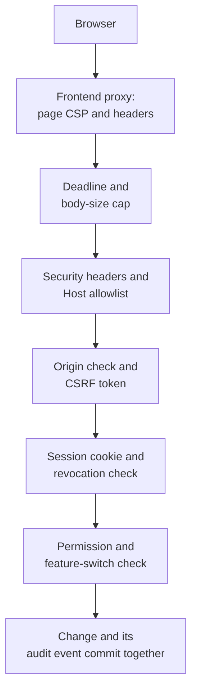

# Security Overview

*For security reviewers, and the operators who answer their questions.*

This page explains what protects a {brand} deployment and which of those protections you
configure. Each control is described the same way: how it works, how to configure it, and
where it lives in the code, so you can check any claim here against the source.

> **Before you start:** Names in `code` such as `JWT_SECRET_KEY` are backend environment
> variables unless the text says otherwise. Every one is listed with its default in the
> [Configuration reference](/docs/configuration). Screens named here are under
> **Administration**, which needs the permissions described in
> [Who can do what](#who-can-do-what).

> **If a setting seems to have no effect:** In Docker Compose, the backend sees a variable only
> if `docker-compose.yml` lists it under that service's `environment:`. Several settings on
> this page — `ENV`, `ALLOWED_HOSTS` and `AUTH_ENVIRONMENT_ID` among them — aren't listed
> there as shipped, so putting them in `.env` alone does nothing. The
> [Production hardening checklist](/docs/deployment#production-hardening-checklist) shows how
> to add them.

## Your path

1. **Security Overview** (this page) — the controls, their defaults, and where each one lives.
2. [RBAC](/docs/rbac) — every role and permission, and how a permission check is decided.
3. [SSO (Operator Guide)](/docs/sso) — identity providers, account linking and the sign-in
   switches.
4. [Multi-Environment Sessions](/docs/multi-environment-sessions) — keeping environments'
   sessions apart, and rotating the signing key without signing anyone out.
5. [Production hardening checklist](/docs/deployment#production-hardening-checklist) — what
   to change before a deployment faces real users.
6. [Configuration reference](/docs/configuration) — every setting this page names, with its
   default.

## How a request passes the controls

Every API request passes the backend's checks in this order — in the bundled deployments,
after the frontend proxy. A request refused at any step never reaches the code behind it.



1. The frontend proxy serves the app with its own Content-Security-Policy and forwards API
   calls to the backend.
2. The backend gives the request a deadline and refuses an oversized body before anything
   reads it.
3. Security headers are added to every response. If you set `ALLOWED_HOSTS`, a request
   naming any other host is refused.
4. A write must come from an allowed origin and carry a CSRF token bound to the session.
5. The session cookie's signature, issuer and expiry are verified, and the session is checked
   against the revocation list.
6. The route's permission is checked against the caller's roles, and a switched-off feature
   is refused.
7. A security-relevant change writes its audit event in the same database transaction as the
   change itself.

## Identity and sign-in

### Password sign-in

**How it works.** Passwords are hashed with Argon2id. Checking a password takes the same time
whether the email exists, has no password, or the password is wrong, and every refusal gives
the same answer — "Invalid email or password". Only `active` accounts can sign in: a
`pending` or `suspended` account gets that same answer.

The server refuses weak passwords — anything the zxcvbn estimator scores below 3 on its 0 to
4 scale — at sign-up, password reset, a self-service change, and when an administrator sets
one. The forms show a matching strength meter as you type.

A new installation creates one administrator from `ADMIN_EMAIL` and `ADMIN_PASSWORD`. If that
password is one of the defaults shipped with the repository, the account must choose a new
one before it can work: the app takes it to **Choose a new password**, and the server — not
just the page — enforces the change, refusing with the error `password_change_required`.

**How to configure it.**

- Set `ADMIN_EMAIL` and a strong `ADMIN_PASSWORD` before the first start. They're used only
  while the database has no users.
- Self-registration is off by default. Turn it on with **Administration → Features →
  Self-registration**. Accounts created that way wait for approval in **Administration →
  User Management**. Invitations work either way, unless you also turn off **Invite links**.
- To make single sign-on the only way in, turn off **Passwords** in **Administration → SSO →
  Settings**. The switch refuses to turn off while an active Super Admin has no SSO identity
  and isn't marked as a system (break-glass) account. System accounts keep password sign-in,
  so an identity-provider outage can't lock everyone out.

**Where in the code.** `backend/auth_service/core/password.py` (`hash_password`,
`verify_password`), `backend/auth_service/providers/local.py` (`LocalIdentityProvider`),
`backend/app/api/v1/endpoints/auth.py` (`_check_password_strength`, `signup`),
`backend/app/auth/dependencies.py` (`get_current_user`, which enforces the forced password
change).

### Single sign-on

**How it works.** Each identity provider is a connection stored in the database, with its
secrets encrypted (see [Stored credentials](#stored-credentials)). There are four kinds:

| Kind | How it signs people in | What proves who they are |
|---|---|---|
| OIDC (for example **Microsoft Entra ID**, **Okta**, **Other OIDC provider**) | Authorization Code flow with PKCE (S256) | An ID token verified against the provider's published keys, with `iss`, `aud`, `exp` and `nonce` checked |
| SAML 2.0 (**AD FS**, **Other SAML 2.0 provider**) | SAML in strict mode | Signed assertions are required, `InResponseTo` is checked, and each assertion is accepted only once |
| **Corporate portal** | A profile handed over in a cookie, browser storage or a proxy header | A signed JWT with a required `exp`, by default. Unsigned payloads and proxy headers need an explicit opt-in, and every sign-in through them is audited |
| **Enterprise gateway** | A back channel to your sign-in gateway | The app asks your gateway who the user is instead of reading the handle, and asks again at every session renewal (in the browser-side variant, the gateway's signed token bounds the session instead) |

Each connection has an **assurance** level — `verified`, `asserted` or `unverified` —
derived from its kind and settings. A directory-group mapping can grant `org_admin` only from
a `verified` connection, and no mapping can grant `super_admin`. A new SSO identity is linked
to an existing account only as the connection's linking policy allows. The default, `strict`,
requires a verified email address. SSO sessions must sign in at the identity provider again
every 24 hours (`SSO_SESSION_MAX_AGE_HOURS`).

**How to configure it.** In **Administration → SSO** (needs `system:admin`): connect
providers on **Providers**, map directory groups to roles on **Access mapping**, and set the
sign-in switches on **Settings** — **Single sign-on**, **Passwords**, **Create accounts
automatically** and **Ask for an email first**. Step by step: [Single Sign-On](/guide/sso-setup).
In depth: [SSO (Operator Guide)](/docs/sso).

**Where in the code.** `backend/auth_service/providers/` (`oidc.py`, `saml2.py`,
`custom_profile.py`, `backchannel.py`, `assurance.py`), `backend/auth_service/service.py`
(`complete_sso_login`), `backend/app/db/repositories/idp_group_mapping_repo.py`.

### Brute-force and abuse limits

**How it works.** Two kinds of limit do two different jobs. Per-account limits are the
brute-force control: they count against the account under attack, so they hold however many
addresses the attempts come from. Per-address limits are only a flood guard, sized so a large
office signing in at once never reaches them.

| Setting | Default | What it limits |
|---|---|---|
| `RATELIMIT_LOGIN_PER_ACCOUNT` | `10 per 15 minutes` | Failed password sign-ins per account. Only failures count, and a successful sign-in clears them. Past the limit the answer is HTTP 429 with `Retry-After`. |
| `RATELIMIT_PASSWORD_RESET_PER_ACCOUNT` | `3/hour` | Password-reset requests per account. The answer is the same whether or not the account exists, and whether or not it's throttled. |
| `RATELIMIT_LOGIN_PER_IP` | `1000/minute` | Password sign-in, the email-first lookup and SSO sign-ins, per client address. |
| `RATELIMIT_SENSITIVE_PER_IP` | `200/minute` | Sign-up, invite redemption and password reset, per client address. |
| `RATELIMIT_REFRESH_PER_SESSION` | `30/minute` | Session renewals per browser session. |

Changing your own password is limited too — 5 attempts a minute per client address — because
it checks the current password. The limiter identifies an account by a hash of its email, so
its store never holds a list of addresses. Every refused password sign-in is recorded in the
audit trail as `user.login_failed`, with the reason.

**How to configure it.**

- Give the limiter a shared store so every replica counts together. By default it uses the
  Redis endpoint your deployment already configures; `RATELIMIT_STORAGE_URI` overrides it.
  Without a shared store each worker counts on its own, and the startup log says so.
- Behind a proxy, set `FORWARDED_ALLOW_IPS` to the proxy's addresses so the per-address limits
  and the audit trail see the real client address.
- Change any limit with the settings in the table, written like the defaults
  (`10 per 15 minutes`, `3/hour`).

**Where in the code.** `backend/auth_service/ratelimit.py` (`AccountRateLimiter`),
`backend/auth_service/api/router.py` (`limiter`, `login`), `backend/auth_service/core/config.py`
(the `RATELIMIT_*` defaults).

## Sessions

### Session cookies

**How it works.** A signed-in browser holds four cookies. The two that carry signed tokens are
`HttpOnly`, so page scripts can't read them. The other two are readable on purpose, because
the page needs them.

| Cookie | Holds | Readable by the page | Path | Lifetime |
|---|---|---|---|---|
| `nx_access` | The access token | No | `/` | The access-token lifetime |
| `nx_refresh` | The refresh token | No | `/api/v1/auth/` | `JWT_REFRESH_EXPIRY_DAYS` (default 7 days) |
| `nx_csrf` | The CSRF token the page copies into a header | Yes | `/` | Same as `nx_refresh` |
| `nx_access_exp` | When the access token expires, so the page can renew early | Yes | `/` | Same as `nx_refresh` |

All four take their `Secure`, `SameSite` and `Domain` attributes from configuration. During
an SSO sign-in, short-lived handshake cookies (10 minutes, path `/api/v1/auth/`) carry the
signed state of the flow. The ones that must survive a cross-site POST back from the identity
provider are always `SameSite=None; Secure`.

**How to configure it.**

- `AUTH_COOKIE_SECURE` — default `true`. Browsers silently drop `Secure` cookies over plain
  HTTP, so set it to `false` only for an HTTP-only local environment.
- `AUTH_COOKIE_SAMESITE` — default `lax`.
- `AUTH_COOKIE_DOMAIN` — unset by default, which makes the cookies host-only. Set it only when
  the app and the API are on different subdomains.
- `AUTH_ENVIRONMENT_ID` — set it whenever two environments can be open in the same browser.
  It adds a suffix to every session cookie name (`nx_access_uat`) and binds the environment
  into the token issuer, so one environment never reads another's session. Use 1–32
  characters from `a`–`z`, `0`–`9`, `_` and `-`, starting with a letter or digit. See
  [Multi-Environment Sessions](/docs/multi-environment-sessions).

**Where in the code.** `backend/auth_service/cookies.py` (`set_session_cookies`,
`clear_session_cookies`), `backend/auth_service/core/config.py` (`COOKIE_SECURE`,
`COOKIE_SAMESITE`, `COOKIE_DOMAIN`, `AUTH_ENVIRONMENT_ID`).

### Token lifetimes and renewal

**How it works.** The access token is a JWT signed with `JWT_SECRET_KEY` (HS256 by default).
It names the user, carries a random session id (`sid`) and the user's platform-wide
permissions, and its header carries a key id (`kid`) so verification picks the right key.
Workspace permissions aren't in the token: they're held on the server against the session id,
so the cookie stays the same size however many workspaces someone belongs to.

The page renews the access token about a minute before it expires, and every renewal rotates
the refresh token:

- A refresh token is accepted only while the server holds an active record of it.
- A refresh token presented again after it was used ends the whole sign-in it belongs to.
  The exception is a short grace window (`REFRESH_ROTATION_GRACE_SECONDS`, default 30), in
  which two tabs renewing at once get the same new token instead of being signed out.
- Ceilings end a session whatever the renewals: idle longer than `SESSION_IDLE_MAX_HOURS`
  (default 12), signed in longer than `SESSION_ABSOLUTE_MAX_HOURS` (default 168, which is
  7 days), and for SSO sessions, no fresh identity-provider sign-in within
  `SSO_SESSION_MAX_AGE_HOURS` (default 24).

**How to configure it.**

- `JWT_EXPIRY_MINUTES` — the access-token lifetime. It's 5 minutes when unset; the shipped
  Compose file and `.env.example` set 15. Platform-wide permissions travel in the token, so
  keep it short.
- `MAX_ACCESS_TTL_MINUTES` — the ceiling for that lifetime, default 15. With
  `ENV=production` the backend refuses to start when `JWT_EXPIRY_MINUTES` is higher;
  elsewhere it logs a warning. Raise the ceiling only as a deliberate decision. The Helm
  chart sets the lifetime from `config.jwt.expiryMinutes`, whose default (60) is above the
  ceiling, so lower it before you set `ENV=production`.
- `JWT_REFRESH_EXPIRY_DAYS`, `SESSION_IDLE_MAX_HOURS` and `SESSION_ABSOLUTE_MAX_HOURS` (`0`
  turns either ceiling off), `REFRESH_ROTATION_GRACE_SECONDS` (`0` makes rotation strict) and
  `SSO_SESSION_MAX_AGE_HOURS`.
- The backend refuses to start on combinations that can't work — for example an idle ceiling
  shorter than one access-token lifetime, or an SSO ceiling no longer than one.

**Where in the code.** `backend/auth_service/core/tokens.py` (`create_access_token`,
`create_refresh_token`), `backend/auth_service/refresh.py` (`check_and_record_rotation`),
`backend/app/main.py` (`_assert_session_config_coherent`).

### Ending sessions on the server

**How it works.** A session can be ended on the server, not only by deleting the browser's
cookies:

- **Sign Out** (in the top-bar menu) ends that browser's session. Its refresh tokens are
  revoked, and its session id is recorded as revoked in Redis, which every authenticated
  request checks.
- Suspending a user, changing or resetting a password, **Sign out everywhere** (**Account
  settings → Signed-in devices**) and **End sessions** (**Administration → User Management**)
  end every session the person holds. They also stamp a cutoff, so no older refresh token can
  start a new session.
- Changing someone's role, workspace membership or group membership, or editing a role's
  permissions, revokes the current tokens of their open sessions. Their next request renews
  the session, which picks up the new permissions.
- A revocation record is kept for as long as the token it revokes could still be accepted:
  the access-token lifetime, plus the clock-skew allowance, plus 60 seconds.
- If the revocation store can't be reached, requests that need a sensitive permission —
  platform, user, group and workspace administration, creating workspaces, and editing the
  SSO host allowlist — are refused with HTTP 503 rather than trusted.

**How to configure it.** Point the backend at Redis so every replica sees the same revocation
records (the Redis settings are in the [Configuration reference](/docs/configuration)). Leave
`RBAC_REVOCATION_TTL_SECONDS` unset: it's derived from the access-token lifetime, and the
backend refuses to start if it's set shorter than the time a token is still accepted.

**Where in the code.** `backend/app/services/revocation_service.py`
(`revoke_every_session_for_user`, `revoke_subject_sessions`), `backend/app/auth/dependencies.py`
(`get_current_user`, `assert_session_alive_or_503`, `_FAIL_CLOSED_PERMISSIONS`),
`backend/auth_service/service.py` (`logout`).

## CSRF protection

**How it works.** Two independent checks guard every state-changing request (`POST`, `PUT`,
`PATCH` and `DELETE`):

- **Origin check.** The request's `Origin` header — or, without one, its `Referer` — must be
  the app's own host or an entry in `CORS_ALLOWED_ORIGINS`. This also covers sign-in, sign-out
  and session renewal, which run before there's a CSRF cookie to compare.
- **Session-bound double-submit token.** The page copies the `nx_csrf` cookie into an
  `X-CSRF-Token` header, and the two must match. The token is an HMAC of a random value and
  the session id under the signing key, so a cookie planted from a sibling subdomain doesn't
  pass.

The only writes exempt from both are identity-provider callbacks, which arrive cross-site by
design and are authenticated by what they carry instead: a signed assertion or envelope, or a
handle redeemed with your gateway. A refusal is HTTP 403 with `"error": "csrf_failed"`, and
the app repairs a missing CSRF cookie by renewing the session.

**How to configure it.** Nothing, for the usual deployment where the app and the API share an
origin behind the bundled proxy. If a page on another origin must call the API, add its exact
origin, scheme included, to `CORS_ALLOWED_ORIGINS`. The origin check trusts the same list as
CORS.

**Where in the code.** `backend/auth_service/csrf.py` (`CSRFMiddleware`, `mint_csrf_token`,
`verify_csrf_token`), registered in `backend/app/main.py`.

## Who can do what

### Roles and permissions

**How it works.** The backend checks the caller's permissions on every request — through the
permission a route declares, or through an object-level rule such as who may open a view.
Permissions come in two kinds: `system:*` permissions apply across the platform, and
`workspace:*` permissions apply inside one workspace. Seven roles are built in:

| Role (on screen) | Internal name | Applies to | In short |
|---|---|---|---|
| Super Admin | `super_admin` | Platform | Everything. Carries `system:admin`, which passes every check |
| Org Admin | `org_admin` | Platform | Every workspace, creating workspaces, and groups — not user accounts or SSO |
| Org Auditor | `org_auditor` | Platform | Read-only across every workspace, plus the audit log and role bindings |
| Workspace Admin | `workspace_admin` | One workspace | Everything in the workspace, including its members |
| Data Engineer | `workspace_data_engineer` | One workspace | Data sources, views, semantic layers and catalog — not members or publishing |
| Member | `workspace_member` | One workspace | Views and data sources |
| Viewer | `workspace_viewer` | One workspace | Read-only |

Everyone else has the default `user` tier: no platform permissions, and access only to the
workspaces they're explicitly added to, plus any view published to everyone. A refused check
is HTTP 403 with
`"error": "missing_permission"`, naming the permission and the scope.

Entering **Administration** needs `system:admin` or `system:groups:manage`. Inside it, each
page checks its own permission: **Audit Log** and **Telemetry** need `system:audit:read`,
**Groups** needs `system:groups:manage`, and every other page needs `system:admin`.

**How to configure it.** Assign platform roles in **Administration → User Management**. Add
people to a workspace, optionally with an expiry, on that workspace's **Members** tab. Build
custom roles in **Administration → Permissions**. For administrators: [Users & Access](/guide/users-access).
The full catalogue and the rules that decide a check: [RBAC](/docs/rbac).

**Where in the code.** `backend/app/config/rbac_seed.py` (`PERMISSIONS`, `SYSTEM_ROLES`,
`ROLE_GRANTS`), `backend/app/services/permission_service.py` (`resolve`, `has_permission`),
`backend/app/auth/dependencies.py` (`requires`), `backend/app/services/nav_catalogue.py`
(which permission opens which screen).

### Who can see a view

**How it works.** A view's visibility — **Private**, **Workspace** or **Enterprise** — is
checked first, and explicit shares add named people or groups. Being able to open a view gives
read-only access to that view's own data source, never write access. Publishing a view to everyone
(**Enterprise**) is governed by `workspace:view:publish`, the workspace's publishing policy,
an optional restriction on the data source, and the platform-wide **Publishing views to
everyone** switch. When a platform administrator opens someone else's private view, the
view's activity log records it.

**How to configure it.** For people sharing views: [Who can see a View](/guide/managing-views#who-can-see-a-view).
For the exact rules: [RBAC](/docs/rbac#view-visibility-and-sharing).

**Where in the code.** `backend/app/services/view_access.py` (`can_read_view`,
`resolve_publish_gate`), `backend/app/api/v1/capability_gate.py`.

### Feature switches

**How it works.** Turning a feature off in **Administration → Features** does more than hide a
button: the server refuses the feature with HTTP 403 `feature_disabled`. Most switches keep
their feature on if their value can't be read, so a database hiccup doesn't black out part of
the product. Security switches such as **Self-registration** do the opposite and stay off.

**How to configure it.** [Feature Switches](/guide/feature-switches).

**Where in the code.** `backend/app/api/v1/feature_gate.py` (`require_feature`,
`feature_disabled`), `backend/app/config/features_seed.py`.

## Secrets

### The token-signing key

**How it works.** `JWT_SECRET_KEY` signs every token the backend issues. There's no default
and no fallback: the backend refuses to start if the key is missing, shorter than 32
characters, or one of the placeholder values published in the repository. `JWT_ALGORITHM`
accepts only `HS256`, `HS384` or `HS512`. The startup log identifies keys by a short
fingerprint (the `kid`), never by the key itself.

**How to configure it.**

1. Generate a key for each environment:

   ```bash
   python -c 'import secrets; print(secrets.token_urlsafe(48))'
   ```

2. To rotate it without signing anyone out, move the current key into
   `JWT_SECRET_KEY_PREVIOUS`, set the new key as `JWT_SECRET_KEY`, and deploy.
   `JWT_SECRET_KEY_PREVIOUS` takes a comma-separated list, most recent first, and its keys
   are used only to verify, never to sign.
3. Once `JWT_REFRESH_EXPIRY_DAYS` have passed, remove the old key from
   `JWT_SECRET_KEY_PREVIOUS`.

Retired keys must meet the same rules as the active one, because they're still trusted to
verify. The full procedure is in [Multi-Environment Sessions](/docs/multi-environment-sessions).

**Where in the code.** `backend/auth_service/core/config.py` (`_resolve_secret`,
`_resolve_retired_secrets`, `assert_signing_secret`).

### Stored credentials

**How it works.** Credentials the app stores — data-source connection secrets, and
identity-provider settings such as client secrets and SAML private keys — are encrypted with
Fernet using `CREDENTIAL_ENCRYPTION_KEY`. With `ENV=production`, the backend refuses to store
a credential when that key is missing or unusable, rather than write it in plain text. Stored
secrets aren't returned by the API: connection responses carry no credentials, and an identity
provider's secret settings come back masked as `********`.

**How to configure it.**

1. Generate a key once:

   ```bash
   python -c 'from cryptography.fernet import Fernet; print(Fernet.generate_key().decode())'
   ```

2. Set it as `CREDENTIAL_ENCRYPTION_KEY` before the first credential is stored.
3. Keep it with your backups: anything encrypted with one key can't be read with another.

**Where in the code.** `backend/app/db/repositories/connection_repo.py` (`_encrypt`,
`require_encryption_or_plaintext_ok`), `backend/app/db/repositories/idp_provider_repo.py`
(`encrypt_settings`, `redact_settings`).

### Secrets from files

**How it works.** Some passwords can be read from a mounted file instead of an environment
variable: set the `_FILE` variant to the file's path. For the Redis and graph-store passwords
the file takes precedence over the plain variable, and a missing or empty file is an error
rather than a silent fall-back to no password.

**How to configure it.** Use the `_FILE` variants where they exist:

- Redis: `REDIS_STREAMS_PASSWORD_FILE`, `REDIS_CACHE_PASSWORD_FILE`, and their
  `_SENTINEL_PASSWORD_FILE` counterparts.
- The graph store: `FALKORDB_PASSWORD_FILE` and `FALKORDB_SENTINEL_PASSWORD_FILE`.
- SAML key material seeded from the older `SAML_*` variables, for example
  `SAML_SP_PRIVATE_KEY_FILE`.

Other secrets, including `JWT_SECRET_KEY` and `CREDENTIAL_ENCRYPTION_KEY`, are read from the
environment. In Kubernetes, inject them from a Secret.

**Where in the code.** `backend/common/adapters/redis_endpoint.py` (`_resolve_password`),
`backend/app/providers/falkordb_connection.py` (`_env_secret`),
`backend/auth_service/providers/saml2.py` (`_env_or_file`).

## Network posture

### What's reachable from outside

**How it works.** In the Compose deployment, only the frontend container's port
(`FRONTEND_PORT`, default 3080) is published on every network interface. PostgreSQL, Redis,
the graph store and its browser UI, the API container and the aggregation control plane are
published on `127.0.0.1` only, so they can be reached from the host but not from the network.
The frontend's proxy forwards API calls to the backend inside the Compose network.

Calls from the backend to the aggregation control plane carry a shared bearer token,
`AGGREGATION_INTERNAL_TOKEN`. With `ENV=production` the control plane refuses to start without
one.

**How to configure it.**

- Each of those bindings has a `_BIND` variable: `POSTGRES_BIND`, `REDIS_BIND`,
  `FALKORDB_BIND`, `VIZ_BIND` and `CONTROLPLANE_BIND`. Change one only when something off the
  host genuinely needs that port, and put it behind your own network controls first.
- Set `AGGREGATION_INTERNAL_TOKEN` to a random value, for example the output of
  `openssl rand -hex 32`.

**Where in the code.** `docker-compose.yml` (the `ports` entry of each service),
`backend/app/services/aggregation/internal_auth.py` (`assert_auth_mode_allowed`).

### Host allowlist, CORS and security headers

**How it works.**

- **Host allowlist.** When `ALLOWED_HOSTS` is set, a request whose `Host` header names any
  other host is refused with HTTP 400. Among other things, this stops a replayed SAML
  assertion being validated against a forged host. Health checks are exempt so orchestrator
  probes keep working. With `ALLOWED_HOSTS` unset there's no host check.
- **CORS.** A browser may call the API from another origin only if that origin is in
  `CORS_ALLOWED_ORIGINS` (comma-separated, with credentials allowed). When the variable is
  unset or empty, the backend allows the local development origins `http://localhost:3000`
  and `http://localhost:5173`.
- **API responses** carry `X-Content-Type-Options: nosniff`, `X-Frame-Options: DENY`,
  `Referrer-Policy: strict-origin-when-cross-origin`, a `Permissions-Policy` that turns off
  camera, microphone and geolocation, a `Content-Security-Policy` built on `default-src 'self'`
  and `frame-ancestors 'none'`, and `Cross-Origin-Opener-Policy` and
  `Cross-Origin-Resource-Policy` of `same-origin`. Responses to signed-in requests get
  `Cache-Control: no-store`. `Strict-Transport-Security` is added when the request arrived over
  HTTPS, directly or per `X-Forwarded-Proto`.
- **The app page** gets the same protections from the frontend proxy, with a
  Content-Security-Policy whose `script-src` and `connect-src` are `'self'` only. `CSP_CONNECT_SRC`
  (on the frontend container) adds origins to `connect-src`; you need it only for an
  **Enterprise gateway** whose sign-in calls run in the browser. The container refuses to start
  if `CSP_CONNECT_SRC` holds anything but bare `https://` or `wss://` origins.

**How to configure it.**

- Set `ALLOWED_HOSTS` to the hostnames people use to reach the app.
- Set `CORS_ALLOWED_ORIGINS` to the exact origins that need to call the API from elsewhere —
  for example your app's own `https://` origin. The shipped Compose file and `.env.example`
  list local development origins, so replace them in production.
- Serve the app over HTTPS and keep `AUTH_COOKIE_SECURE=true`.

**Where in the code.** `backend/app/main.py` (`_TrustedHostMiddleware` and the
`CORSMiddleware` registration), `backend/app/middleware/security_headers.py`
(`SecurityHeadersMiddleware`), `frontend/nginx.conf`, `frontend/nginx/40-csp-connect-src.sh`.

### Request size and time limits

**How it works.** A request that declares a body larger than its limit is refused with HTTP
413 before the body is read: 8 MiB for most routes, and 100 MiB for bulk import, versioning
and view-transfer routes. Every request also runs against a deadline — 30 seconds by default,
with longer tiers for graph, trace, aggregation, versioning and view-transfer routes — and
gets HTTP 504 with `Retry-After` when it runs out. Until the backend has finished starting,
requests other than liveness probes get HTTP 503 with `Retry-After`.

**How to configure it.** `MAX_REQUEST_BODY_BYTES`, `MAX_IMPORT_BODY_BYTES` and the
`HTTP_TIMEOUT_*` settings. How to raise the timeouts safely: [Concurrency and Timeout
Tuning](/docs/concurrency-tuning).

**Where in the code.** `backend/app/main.py` (`_BodySizeLimitMiddleware`, `_TimeoutMiddleware`).

### Outbound connections from SSO

**How it works.** Addresses an administrator types into an SSO connection — OIDC discovery
and its signing keys, SAML metadata, back-channel gateway endpoints, and profile-picture hosts
— are fetched through one guard, which:

- accepts `http` and `https` only, and `https` only when `ENV=production`;
- doesn't follow redirects (profile pictures may follow up to three, each one checked again);
- caps the size of the response and the time allowed;
- always refuses loopback and link-local addresses, which include the cloud metadata service;
- refuses other private-network addresses, except for gateway calls and profile pictures to a
  `host:port` you've allowlisted.

**How to configure it.** In **Administration → SSO → Settings**:

- **Internal gateways SSO may call** lists the `host:port` entries an **Enterprise gateway**
  may reach inside your network. Editing it needs `system:sso:hosts:manage`, which only
  `super_admin` holds by default.
- **Avatar image hosts** lists the hosts profile pictures may be fetched from.

If your identity provider's certificates come from a corporate CA, point
`SSO_OUTBOUND_TLS_CA_CERTS` at a PEM bundle of that CA.

**Where in the code.** `backend/auth_service/providers/outbound.py` (`assert_fetchable`,
`fetch_metadata`, `request_json`, `fetch_image`), `backend/app/api/v1/endpoints/admin_idp_providers.py`
(the host allowlist routes).

## Exposure you control

These surfaces are off by default in production. Turn one on only when you need it.

| Surface | Default | To turn it on | Keep in mind |
|---|---|---|---|
| Interactive API explorer and OpenAPI schema | Off when `ENV=production`, on otherwise | `API_DOCS_ENABLED=true` | It lists every route and schema. In production, put it behind your own ingress authentication. |
| Prometheus metrics | Off | `METRICS_ENABLED=true` and a `METRICS_TOKEN` | Scrapers must send `Authorization: Bearer` followed by the token. Enabled without a token, it answers as if it doesn't exist. |
| Connection-pool snapshot | Off | `INTERNAL_METRICS_ENABLED=true` | It has no token of its own: if you turn it on, allow it only from your monitoring network. |
| Development sign-in (a mock identity provider) | Off | `AUTH_CUSTOM_PROVIDER_ENABLED=true` | The backend refuses to start with it on when `ENV` is `production` or `prod`. |

**Where in the code.** `backend/app/main.py` (`_DOCS_ENABLED`),
`backend/app/api/v1/endpoints/metrics.py` (`metrics_authorized`),
`backend/app/middleware/db_metrics.py`, `backend/auth_service/core/config.py`
(`AUTH_CUSTOM_PROVIDER_ENABLED`).

## Audit trail

**How it works.** A security-relevant change writes an event in the same database transaction
as the change, so the change can't be saved without its record. A background relay copies each
event into an audit table (`auth_audit_log`) that the app only ever adds to, skipping any event
it has already copied. Recorded events include:

- sign-ins and sign-outs, and failed sign-ins with the reason, client address and user agent;
- sessions refused or revoked, and why;
- sign-ups, approvals and rejections, role changes, suspensions, and password changes and
  resets;
- every change to roles, permissions, groups, workspace membership and view sharing;
- SSO connections created, changed or deleted, group mappings, changes to the sign-in
  switches, identity links, and every failed SSO sign-in, keyed by the reference the user was
  shown;
- refused permission checks (`user.access_denied`), sampled to one per person, permission and
  scope per hour.

**How to read it.** Open **Administration → Identity & Access → Audit Log**. The page needs
`system:audit:read`, which `super_admin` and `org_auditor` hold, on top of a permission that
opens Administration (see [Roles and permissions](#roles-and-permissions)). Choose a **Range**
(**Last 24h**, **Last 7d**, **Last 30d** or **All time**) and a **Scope**:

| Scope | Shows |
|---|---|
| **Security** (default) | Sign-ins, sign-outs, failed sign-ins, session revocations and every access-control change |
| **Activity** | Everything in **Security**, plus sign-ups, password resets and access requests |
| **Everything** | All events, including the hourly access-denied samples |

Filter by who did something or who it affected — a name, email or user id — and open any row
for its full detail. The same events are available to scripts from
`GET /api/v1/admin/audit`, with the same permission and cursor pagination.

**Where in the code.** `backend/app/db/repositories/user_repo.py` (`create_outbox_event`),
`backend/app/services/outbox_relay.py` (`drain_once`), `backend/app/api/v1/endpoints/audit.py`
(`list_audit_events`), `frontend/src/components/admin/AdminAudit.tsx`.

## Privacy

**How it works.** Analytics shows people's activity only as far as you allow. These switches
are in **Administration → Features**, under **Analytics**:

| Switch | Default | What it decides |
|---|---|---|
| **What everyone can see** | **Show colleagues** | How much people who aren't administrators or auditors see: **Aggregate only** (counts and trends; nobody is named), **Show colleagues** (adds leaderboards and who built what), or **Show colleagues and operations** (adds access-request backlogs, invite acceptance and refresh failures) |
| **Let people contact each other from Analytics** | Off | Shows a colleague's email address beside their name, only where they're attached to something the reader can already open, and never on the platform-wide activity ranking |
| **Analytics for everyone** | Off | Opens a redacted Analytics section to every signed-in person, with no individual's activity shown |
| **Show every workspace in Analytics** | Off | Shows every workspace's name and figures to everyone in Analytics; it grants no access to the workspaces themselves |

The full Analytics section is for holders of `system:analytics:read` (`super_admin`,
`org_admin` and `org_auditor`), which is kept separate from the audit-log permission.

Elsewhere:

- The request log records method, path, status and duration — never request or response
  bodies.
- The sign-in limiter keys on a hash of the email address, not the address.
- The last assertion an identity provider sent, kept to help build claim mappings, has
  credential-like values masked before it's stored, and is encrypted like the connection's
  other settings.

**How to configure it.** [Analytics](/guide/analytics) and [Feature Switches](/guide/feature-switches).

**Where in the code.** `backend/app/config/features_seed.py` (the `analytics*` switches),
`backend/app/services/analytics_scope.py`, `backend/app/middleware/logging.py`
(`StructuredLoggingMiddleware`), `backend/auth_service/ratelimit.py` (`_bucket_key`).

## Production hardening

Before a deployment faces real users, work through the
[Production hardening checklist](/docs/deployment#production-hardening-checklist). From this
page, the settings that matter most are below — and in Docker Compose, check that each one
actually reaches the backend container (see the note at the top of this page).

- `ENV=production` (or `prod`) — several protections above apply only then.
- A generated `JWT_SECRET_KEY` and `CREDENTIAL_ENCRYPTION_KEY`.
- HTTPS end to end, with `AUTH_COOKIE_SECURE=true`.
- `ALLOWED_HOSTS` and an explicit `CORS_ALLOWED_ORIGINS`.
- Redis for revocation and rate limits, and `FORWARDED_ALLOW_IPS` naming your proxy.
- `AGGREGATION_INTERNAL_TOKEN` for the aggregation control plane.
- The API explorer left off, and metrics behind `METRICS_TOKEN`.

### Checks that stop an unsafe configuration

Rather than run with one of these mistakes, the backend refuses to start, refuses the unsafe
action, or takes itself out of service:

| Mistake | What happens | When |
|---|---|---|
| `JWT_SECRET_KEY` missing, under 32 characters, or a published placeholder (in it or in `JWT_SECRET_KEY_PREVIOUS`) | Refuses to start | Always |
| `JWT_ALGORITHM` other than `HS256`, `HS384` or `HS512` | Refuses to start | Always |
| `AUTH_ENVIRONMENT_ID` with characters a cookie name can't hold | Refuses to start | Always |
| Revocation records set to expire before the tokens they revoke, or session ceilings that end every session at its first renewal | Refuses to start | Always |
| `JWT_EXPIRY_MINUTES` above `MAX_ACCESS_TTL_MINUTES` | Refuses to start (warns elsewhere) | `ENV=production` |
| An absolute session ceiling longer than the refresh-token lifetime | Refuses to start (warns elsewhere) | `ENV=production` |
| `RBAC_ENFORCE_VIEWS` or `RBAC_ENFORCE_WORKSPACES` turned off (emergency switches that remove those permission checks) | Refuses to start (warns elsewhere) | `ENV=production` |
| The development sign-in turned on | Refuses to start | `ENV=production` |
| A credential stored with no usable `CREDENTIAL_ENCRYPTION_KEY` | Refuses the write | `ENV=production` |
| A SAML connection, a signed **Corporate portal** connection, or a browser-side **Enterprise gateway** connection with no shared replay store (Redis) | Refuses to serve that connection | `ENV=production` |
| No shared revocation store (Redis) | The readiness check fails, so an orchestrator keeps the replica out of service | `ENV=production` |
| `AGGREGATION_INTERNAL_TOKEN` unset | The aggregation control plane refuses to start | `ENV=production` |

## Reporting a vulnerability

Report a suspected vulnerability privately — not in a public issue or discussion. Use the
repository's private vulnerability reporting: open its **Security** tab and choose **Report a
vulnerability**. Only the maintainers can see the report.

Include:

- what the vulnerability is and its impact;
- the steps to reproduce it, with a proof of concept if you have one;
- the affected component, and the version or commit.

The maintainers aim to acknowledge a report within a few business days, keep you informed
while they investigate and fix it, and credit you in the advisory unless you'd rather they
didn't. The policy itself is `.github/SECURITY.md` in the repository.

## Where in the code

| Control | Start here |
|---|---|
| Password hashing and verification | `backend/auth_service/core/password.py` |
| Sign-in, sign-out and renewal routes | `backend/auth_service/api/router.py` |
| Sign-up, password reset and invitations | `backend/app/api/v1/endpoints/auth.py` |
| Session cookies | `backend/auth_service/cookies.py` |
| Tokens and the signing-key ring | `backend/auth_service/core/tokens.py`, `backend/auth_service/core/config.py` |
| Refresh-token rotation | `backend/auth_service/refresh.py` |
| Rate limits | `backend/auth_service/ratelimit.py` |
| CSRF | `backend/auth_service/csrf.py` |
| Session check, permission checks and revocation | `backend/app/auth/dependencies.py`, `backend/app/services/revocation_service.py` |
| Roles and permissions | `backend/app/config/rbac_seed.py`, `backend/app/services/permission_service.py` |
| Middleware order, Host allowlist, body and time limits, startup checks | `backend/app/main.py` |
| Security headers | `backend/app/middleware/security_headers.py`, `frontend/nginx.conf` |
| Outbound SSO requests | `backend/auth_service/providers/outbound.py` |
| Stored-credential encryption | `backend/app/db/repositories/connection_repo.py`, `backend/app/db/repositories/idp_provider_repo.py` |
| Audit trail | `backend/app/services/outbox_relay.py`, `backend/app/api/v1/endpoints/audit.py` |

## See also

- [SSO Integration (Developer Guide)](/docs/sso-integration) — when you want the sign-in
  surface's trust boundaries and threat model in more depth.
- [User & Sign-up Service](/docs/signup-service) — when you want to know how accounts are
  created, approved and reset.
- [Back-channel SSO contract](/docs/sso-backchannel-contract) — when your organisation's
  sign-in gateway team needs to know what an **Enterprise gateway** requires of them.
- [Users & Access](/guide/users-access) — when you want the administrator's view of roles,
  invitations and access.
