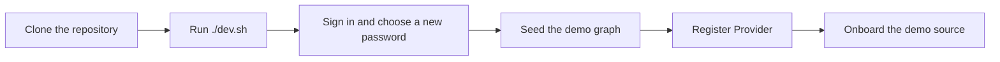

# Developer Setup

*For New Engineers.*

Get {brand} running on your machine with live reload, sign in as the administrator, and load a demo lineage graph to work against. One command starts everything; the rest of the page covers the variations and what to do when something doesn't start.

> **Before you start:** you need Docker with the Compose v2 plugin (`docker compose`), Git, and `python3` on your `PATH`. The full list is under [Prerequisites](#prerequisites).

## Your path

1. **Developer Setup** — this page: run the stack, sign in, load demo data.
2. [Testing & CI](/docs/testing-and-ci) — what runs on every pull request, and how to run the same checks before you push.
3. [Contributing](/docs/contributing) — where the code lives, the conventions, and recipes for the changes people make most.
4. [Architecture](/docs/architecture) — how the services fit together, and why.
5. [Backend](/docs/backend) or [Frontend](/docs/frontend) — the half of the code you'll work in.



## Prerequisites

| You need | Version | Why |
|---|---|---|
| Docker Engine or Docker Desktop with the Compose v2 plugin | `docker compose version` answers | Every service runs in a container |
| Git | any recent | To clone the repository |
| `python3` | any | `./dev.sh` uses it once, to generate your signing key |
| Python | 3.14 | Only to run the backend or the backend tests on your machine. The backend images use 3.14. |
| Node.js | 24 (`frontend/.nvmrc`) | Only to run the frontend or its tests on your machine |

Give Docker plenty of disk. Before `up`, `infra` and `rebuild`, if Docker's disk is 80% full or more, `./dev.sh` deletes dangling images and the build cache. It never deletes data volumes.

## Start the stack

1. Clone the repository and change into it:

   ```bash
   git clone <repository-url>
   cd <repository-directory>
   ```

2. Start everything:

   ```bash
   ./dev.sh
   ```

   `./dev.sh` with no argument is `./dev.sh up`. On the first run it creates your settings file from `.env.example` and generates a signing key in it:

   ```
   [dev] creating .env.dev from .env.example
   [dev] generating JWT_SECRET_KEY in .env.dev
   ```

   Then it builds the images (the slow part, and only the first time), applies the database migrations and starts every service. When it returns, it prints:

   ```
     Frontend     http://localhost:5173
     Backend API  http://localhost:8000/docs
     Logs:        ./dev.sh logs [service]
     Status:      ./dev.sh ps
   ```

3. Check the services:

   ```bash
   ./dev.sh ps
   ```

   `viz-service` (the API), `frontend`, `aggregation-controlplane`, `aggregation-worker`, `versioning-worker`, `stats-service`, `postgres`, `redis` and `falkordb` are `Up`, and the ones with a health check say `(healthy)`. The one-shot `upgrade` service has already applied the migrations and exited, so it isn't listed; `./dev.sh logs upgrade` shows what it did.

> **If a service isn't healthy:** `./dev.sh logs <service>` shows why. [If it goes wrong](#if-it-goes-wrong) covers the common causes.

The app containers run your working copy: `backend/` and `frontend/` are mounted into them, so the API and the frontend reload when you save a file. [Which changes reload by themselves](#which-changes-reload-by-themselves) lists the exceptions.

## Sign in for the first time

The API creates one administrator the first time it starts against an empty database, from `ADMIN_EMAIL` and `ADMIN_PASSWORD` in `.env.dev`.

1. Open `http://localhost:5173`. The sign-in page opens.
2. Enter the **Email** and **Password** from `.env.dev` (`admin@nexuslineage.local` and `admin123` unless you changed them), then select **Enter Workspace**.
3. The **Choose a new password** page opens. `admin123` is published in this repository, so the account can't do anything else until it has a password of its own.
4. Fill in **Current password**, **New password** and **Confirm new password**, then select **Set new password**. The new password needs at least 8 characters and a strength rating of **Strong** or better.
5. You're signed out. Sign in again with the new password. The dashboard opens.


> **Note:** The administrator is created only while the database has no users, and only the published defaults force a new password. If you put your own `ADMIN_PASSWORD` in `.env.dev` before the first start, you skip steps 3 to 5. Editing either value afterwards changes nothing; to recover a forgotten password, see [If it goes wrong](#if-it-goes-wrong).

## Load demo data

A fresh stack has no data, and nothing is created from environment variables: you register the graph store yourself, the same way an administrator does in production.

1. Write the demo graph into FalkorDB:

   ```bash
   ./dev.sh exec viz-service python backend/scripts/seed_falkordb.py --graph nexus_lineage
   ```

   The script builds an enterprise lineage graph (source systems through staging, silver, gold and reporting tables to dashboards, with column-level lineage) and writes it to the FalkorDB graph `nexus_lineage`. Its log includes:

   ```
   Build complete: 586 nodes, 919 edges (CONTAINS: 578, TRANSFORMS: 341)
   Pushing 586 nodes to graph 'nexus_lineage'...
   Push complete!
   ```

   The first time, it ends with a warning: **freshness signal failed for nexus_lineage**. That's expected: the graph isn't registered as a data source yet, so there is nothing to refresh.

2. In the app, select **Ingestion** in the sidebar. The **Providers** tab opens.
3. Select **Register Provider**. The wizard opens on **Choose your provider type**.
4. Choose **FalkorDB**, then select **Next**. The **Connection** step opens with **Port** already set to `6379`.
5. Enter a **Provider name** (for example `Local FalkorDB`) and **Host** `localhost`, then select **Next**. The **Review** step opens.
6. Select **Test connection**. **Connected successfully** appears, and the button changes to **Create provider**.
7. Select **Create provider**. The wizard shows **Provider connected**.
8. Select **Continue to data sources**. The **Data Sources** tab opens and discovers the graphs on the provider; `nexus_lineage` appears as **Available**.
9. Select `nexus_lineage`, then **Onboard Sources (1)**. The onboarding wizard opens.
10. Work through its steps — **Workspace**, **Aggregation**, **Semantic Layer**, **Schema Review** and **Review**. [Onboarding a source](/docs/onboarding-a-source) explains each one.

When the wizard finishes, the `nexus_lineage` row shows **Active**. Build your first view with the [Quick Start](/guide/quick-start); [Admin Setup](/guide/admin-setup) covers the rest of an administrator's first hour.

> **Why `localhost` works:** inside the Docker stack, the backend rewrites a FalkorDB provider host of `localhost` to the `falkordb` service (`FALKORDB_DOCKER_LOCALHOST_REWRITE`). When you run the API on your machine instead, `.env.dev` points every FalkorDB provider at `localhost:6379` (`LOCAL_DEV_FALKORDB_OVERRIDE`).

The seeder takes `--scale N` (pads the graph with archive tables up to about N × 1,000 nodes), `--breadth N` (replicates the source systems), `--depth N` (adds intermediate tiers between silver and gold) and `--dry-run` (builds without writing). `backend/scripts/` holds the other generators, including `seed_large_lineage.py` for graphs of 100,000 nodes and more.

## Check that it works

- `./dev.sh ps` shows every service `Up`, with `(healthy)` where there is a health check.
- `./dev.sh logs viz-service` includes `Schema verified at Alembic head` and, on the very first start, `System admin created: admin@nexuslineage.local (default password — a change is required at first sign-in)`. Press Ctrl-C to stop following the log.
- After the demo-data steps, **Ingestion → Data Sources** shows `nexus_lineage` as **Active**.

## Work on the code

### Which changes reload by themselves

| You changed | What happens | What to run |
|---|---|---|
| Frontend code under `frontend/src` | Vite reloads the page | Nothing |
| Backend code used by the API | `viz-service` restarts its workers (it polls for file changes) | Nothing |
| Backend code used by the headless services | They don't watch files | `./dev.sh restart <service>` for `aggregation-controlplane`, `aggregation-worker`, `versioning-worker` or `stats-service` |
| `backend/requirements.txt` or a `backend/Dockerfile.*` | Dependencies live in the images | `./dev.sh rebuild` |
| A migration under `backend/alembic/versions/` | The `upgrade` service runs the migrations baked into its image | `./dev.sh rebuild` |
| `frontend/package.json` | `node_modules` lives in a volume inside the container | `./dev.sh rebuild -V frontend` |

After a `git pull`, run the matching command whenever the changes touch one of the last three rows. Without it, the old image keeps running and nothing warns you.

### dev.sh commands

| Command | What it does |
|---|---|
| `./dev.sh` or `./dev.sh up [service…]` | Starts the full stack, or the named services, in the background and prints the URLs |
| `./dev.sh infra` | Starts only Postgres, Redis and FalkorDB, and prints the commands for [running the apps on your machine](#run-the-apps-on-your-machine-instead) |
| `./dev.sh down` | Stops and removes the containers. Your data volumes stay. |
| `./dev.sh restart <service…>` | Restarts services |
| `./dev.sh build [service…]` | Builds images without starting anything |
| `./dev.sh rebuild [service…]` | Rebuilds images and recreates the containers that changed |
| `./dev.sh logs [service…]` | Follows the logs, starting from the last 100 lines |
| `./dev.sh ps` or `./dev.sh status` | Shows container status |
| `./dev.sh shell <service> [command…]` or `./dev.sh exec …` | Opens a shell in a running service, or runs one command there |
| `./dev.sh reset` | Deletes every container and data volume after you type `yes` |
| `./dev.sh doctor` | Checks ports, the backing services, `.env.dev`, a local Postgres and leftover containers. Changes nothing. |
| `./dev.sh help` | Prints the usage text |

`up`, `down`, `build`, `rebuild`, `logs` and `restart` pass any extra arguments to `docker compose`, so `./dev.sh up --remove-orphans` and `./dev.sh rebuild -V frontend` work. Your data lives in the volumes `synodic-postgres-dev-data`, `synodic-redis-dev-data` and `synodic-falkordb-dev-data`; they survive `down`, restarts and reboots, and only `reset` (or `down -v`) deletes them. `./dev.sh` is for working on the code; for a server install, see [Deployment](/docs/deployment).

### Ports

| Port | Service | Notes |
|---|---|---|
| 5173 | Frontend (Vite dev server) | Open this one in your browser |
| 8000 | API (`viz-service`) | Interactive API docs at `/docs`, served everywhere except production |
| 8091 | Aggregation control plane | |
| 5432 | PostgreSQL | User, password and database are all `synodic` |
| 6380 | Redis (job streams and cache) | The container's 6379, published as 6380 |
| 6379 | FalkorDB (graph store) | |
| 3000 | FalkorDB browser | |
| 3080 | Unused in development | The frontend container still publishes it, so it must be free |

Everything except the frontend listens on `127.0.0.1` only. To move a backing service, set `POSTGRES_PORT`, `REDIS_PORT`, `FALKORDB_PORT` or `FALKORDB_UI_PORT` in `.env.dev`; if you also run the apps on your machine, change the matching URL in `.env.dev` (`MANAGEMENT_DB_URL`, `REDIS_URL`) to the same port. Don't set `FRONTEND_PORT` there: the development stack publishes it twice and then can't start.

## Run the apps on your machine instead

Run the API and the frontend outside Docker when you want a debugger, a profiler, or faster restarts. Postgres, Redis and FalkorDB stay in Docker.

1. If the full stack is running, stop it so ports 8000 and 5173 are free:

   ```bash
   ./dev.sh down
   ```

2. Start the backing services:

   ```bash
   ./dev.sh infra
   ```

   It prints where they listen and the commands to run next:

   ```
     Postgres   localhost:5432  (synodic/synodic)
     Redis      localhost:6380
     FalkorDB   localhost:6379  (browser http://localhost:3000)
   ```

3. The first time, create a virtual environment and install the dependencies:

   ```bash
   python3 -m venv .venv
   .venv/bin/pip install -r backend/requirements.txt -r backend/requirements-test.txt
   (cd frontend && npm ci)
   ```

4. Load `.env.dev` into your shell and apply the migrations:

   ```bash
   source .venv/bin/activate && set -a && source .env.dev && set +a
   python -m backend.scripts.upgrade upgrade
   ```

   It finishes without an error. On an empty database the last line reads `Running stamp_revision 0001_baseline -> <latest-revision>`; on an existing one you see a `Running upgrade …` line for each new migration, or nothing more if there were none. `./dev.sh infra` doesn't print this step, and the API never migrates by itself.

5. In the same shell, start the API:

   ```bash
   python -m uvicorn backend.app.main:app --reload --host 0.0.0.0 --port 8000
   ```

   The log shows `Schema verified at Alembic head` and then `Application startup complete.`

6. In a second terminal, start the frontend:

   ```bash
   cd frontend && npm run dev
   ```

   Vite serves `http://localhost:5173` and forwards `/api` to `http://127.0.0.1:8000`.

7. Start the background workers you need, each in its own terminal with `.env.dev` loaded as in step 4:

   | For | Run |
   |---|---|
   | Aggregation jobs | `python -m backend.app.services.aggregation` |
   | Versioned graphs projected into FalkorDB | `python -m backend.app.services.versioning` |
   | Data-source statistics, discovery and purges | `python -m backend.insights_service` |

   On your machine the API runs in the all-in-one `dev` role, so it runs the scheduler itself. Because `.env.dev` sets `REDIS_URL`, aggregation jobs still go to the Redis stream and wait there for a worker.

## If it goes wrong

| What you see | Why | What to do |
|---|---|---|
| `./dev.sh up` fails with **port is already allocated** or **address already in use** | Another process holds one of the [ports](#ports) — often a local Postgres or Redis, or a server install started with `./deploy.sh` | `./dev.sh doctor` names the process on 8000, 5173 and 8091 and checks for a local Postgres. Stop the other process (`./deploy.sh down` for a server install), or move a backing service's port as described under [Ports](#ports). |
| `POSTGRES_USER must be set in .env` (or the same for `JWT_SECRET_KEY` or `ADMIN_PASSWORD`) | You ran `docker compose` directly, without the development settings | Use `./dev.sh`, or pass the same files it does: `docker compose --env-file .env.dev -f docker-compose.yml -f docker-compose.dev.yml …` |
| `FATAL: role "synodic" does not exist` or `password authentication failed` | The Postgres volume was created with other credentials than the ones in `.env.dev` | Put the original `POSTGRES_USER`, `POSTGRES_PASSWORD` and `POSTGRES_DB` back in `.env.dev`, or run `./dev.sh reset` to start over (it deletes all data) |
| `./dev.sh up` stops because the `upgrade` service didn't complete successfully | A migration failed, so nothing that needs the database starts | `./dev.sh logs upgrade` shows the failing revision. [Database Migrations](/docs/migrations) explains the usual causes. |
| The API log says **Schema verification failed** or **ALEMBIC HEAD MISMATCH** | The migrations haven't run, or they predate your code | In Docker: `./dev.sh rebuild`. On your machine: `python -m backend.scripts.upgrade upgrade`. |
| Every page sends you to **Choose a new password** | The account still has the published default password | Expected at the first sign-in; see [Sign in for the first time](#sign-in-for-the-first-time) |
| You forgot the administrator's new password | The start-up bootstrap only creates an account when there are no users | `./dev.sh exec viz-service python -m backend.scripts.reset_admin_password --email admin@nexuslineage.local` prompts for a new one and signs every session out |
| **Test connection** shows **Unable to connect** for host `localhost` | FalkorDB isn't up yet, or is still loading its data | `./dev.sh ps` should show `falkordb` as `(healthy)`; `./dev.sh logs falkordb` shows progress |
| Compose warns **Found orphan containers** | A service was removed or renamed since you last started the stack | `./dev.sh up --remove-orphans` |
| `./dev.sh doctor` suggests `./dev.sh repair` or `./dev.sh clean-orphans` | Those commands no longer exist | For credential problems use the row above about `role "synodic"`; remove leftover containers it lists with `docker rm -f <container-name>` |
| A package you just installed isn't found in the frontend | The container still has the old `node_modules` volume | `./dev.sh rebuild -V frontend` |

`./dev.sh doctor` is most useful before you start the apps: it reports 8000, 5173 and 8091 as **occupied** while your own stack is running, and the backing services as **unreachable** while they are stopped.

## Local defaults stay local

`.env.dev` is built for a laptop. Don't copy these values to a shared or production environment:

| Setting | In `.env.dev` | In a shared or production environment |
|---|---|---|
| `ADMIN_PASSWORD` | `admin123`, published in this repository, so it must be changed at the first sign-in | Set your own before the first start |
| `JWT_SECRET_KEY` | Generated for your machine by `./dev.sh` | Generate one per environment and keep it stable. The API refuses to start without one, with one shorter than 32 characters, or with a value published in this repository. |
| `CREDENTIAL_ENCRYPTION_KEY` | Unset, so stored provider credentials aren't encrypted | Required. With `ENV=production`, the API refuses to store credentials without it. |
| `CORS_ALLOWED_ORIGINS` | `http://localhost:3080,http://localhost:5173,http://localhost:3000` | Your real frontend origins. When it's unset, the API allows only `http://localhost:3000` and `http://localhost:5173`. |

Every setting, with its default, is in the [Configuration reference](/docs/configuration). [Deployment](/docs/deployment) walks through a real install, and the [Security overview](/docs/security-overview) explains the controls these settings feed.

## Where to next

- [Testing & CI](/docs/testing-and-ci) — when you want to run the checks your pull request will face.
- [Contributing](/docs/contributing) — before your first change: the repository map, the conventions and step-by-step recipes.
- [Architecture](/docs/architecture) — when you want to know which service owns what.
- [Local Integration Testing](/docs/integration-testing) — when you need the versioned-graph draft journey against real Postgres.
