# Sign-up and User Service — Implementation Plan (Revised)

**Design principles (holistic).** This plan treats the feature as one system: **auditability and safe evolution** (database), **clarity and trust** (UI/UX), **predictable behavior and operability** (engineering), **growth without rewrites** (scalability), and **defense in depth** (security). The revised version enforces a **logical split** so the User Service can be cut and pasted into its own repository and database without breaking the main application.

---

## Implementation Status (2026 Q1)

| Component | Status | Notes |
|-----------|--------|-------|
| **Database schema** (users, user_roles, user_approvals, outbox_events) | **Done** | All tables implemented in `backend/app/db/models.py`. Uses prefixed hex UUIDs (`usr_*`) rather than UUID v7. |
| **Auth endpoints** (signup, login, forgot/reset password) | **Done** | Registered under `/api/v1/auth/*` |
| **User management endpoints** (GET /users/me, admin CRUD) | **Done** | Registered under `/api/v1/users/*` and `/api/v1/admin/users/*` |
| **Argon2id password hashing** | **Done** | OWASP-recommended hashing with constant-time comparison |
| **JWT issuance & verification** | **Done** | HS256, configurable expiry, role claims in payload |
| **Admin approval flow** | **Done** | Pending → Approve/Reject with audit trail in `user_approvals` |
| **Frontend auth pages** (Login, SignUp, Reset) | **Done** | Glass-panel design, zxcvbn strength meter |
| **Transactional outbox** (write side) | **Done** | Events written in same transaction as user operations |
| **Outbox consumer** (read/publish side) | **Pending** | Events accumulate with `processed = false`. No consumer process implemented yet. See [TECHNICAL_DEBT.md](TECHNICAL_DEBT.md). |
| **SSO (SAML2/OIDC)** | **Pending** | `auth_provider` field exists in schema but SSO login flow not implemented |
| **Force password change on first login** | **Pending** | `must_change_password` flag not implemented |
| **Rate limiting** | **Partial** | Feature flag rate limits exist; per-IP signup/login limits not yet at API gateway level |

---

## 1. Current State (as of plan creation)

- **Auth:** Client-only in `frontend/src/store/auth.ts` — env-based username/password hash (SHA-256), no backend auth API.
- **Backend:** FastAPI at `/api/v1`, async SQLAlchemy in `backend/app/db/models.py`, repos + Pydantic in `backend/common/models/management.py`. `ViewFavouriteORM` has `user_id` (Text) with no FK; views endpoints use `_PLACEHOLDER_USER`.
- **Login UI:** `frontend/src/components/auth/LoginPage.tsx` — glass panel, motion, shared CSS (`input`, `glass-panel`, `gradient-text` in `frontend/src/styles/globals.css`).

---

## 2. Architectural Strategy: "The Logical Split"

**Goal:** Ensure the User Service can be cut and pasted into its own repository/database without breaking the main application.

- **Domain isolation:** All user-related logic lives in `backend/app/users/`. No user tables or user business logic in the rest of the app.
- **Zero physical FKs:** Cross-domain tables (e.g. `view_favourites`) store `user_id` as a **logical reference** (UUID v7) only. There is **no database-level foreign key** from `view_favourites.user_id` to `users.id`. This allows the `users` schema to live in a separate database when the User Service is extracted.
- **Event-driven hooks:** The system uses a **Transactional Outbox** pattern. When a user is created or approved, a row is written to `outbox_events` in the same transaction. A processor (same process or separate worker) reads unprocessed events and publishes to a message bus (or in-memory in v1). Other parts of the system react to `user.created` and `user.approved` via events, not by querying the user DB. **Outbox consumer:** In the monolith, a background task reads `outbox_events` where `processed = false`, publishes to the chosen destination (NATS / RabbitMQ / or in-memory for v1), then sets `processed = true`. When the User Service is split, this processor runs inside the User Service and publishes to the shared message bus.

---

## 3. Database Schema: High-Performance & Sortable

**Principle:** Use **UUID v7** for primary keys. Time-ordered IDs reduce index fragmentation and allow efficient sorting by creation time.

**Database choice:**  
- **Option A (same DB):** User tables live in the existing management DB (SQLite in dev). Use TEXT for UUIDs, TEXT for timestamps (ISO UTC), and a TEXT column storing JSON for `metadata` (SQLite has no native `jsonb`). Indexes and partial indexes still apply where the engine supports them.  
- **Option B (separate DB from day one):** User domain uses its own database (e.g. PostgreSQL). Use native `uuid` (or uuid_v7), `timestamptz`, and `jsonb`; GIN index on `metadata`, partial index on `users(id) WHERE status = 'pending'`.  
State the chosen option in implementation; the schema below is described in a DB-agnostic way with type hints.

### 3.1 Entity relationship (domain-isolated)

```mermaid
erDiagram
    users {
        uuid_v7 id PK
        text email UK "Indexed (lower-case)"
        text password_hash "Argon2id"
        text first_name
        text last_name
        text status "pending | active | suspended"
        text auth_provider "local | saml2 | oidc"
        text external_id "SSO subject"
        text metadata "JSON: SSO claims, preferences"
        text reset_token_hash "Hash of one-time reset token"
        timestamp_tz reset_token_expires_at
        timestamp_tz created_at
        timestamp_tz updated_at
        timestamp_tz deleted_at "Soft delete, Right to be Forgotten"
    }

    user_roles {
        uuid_v7 id PK
        uuid_v7 user_id "Logical reference, no FK"
        text role_name "admin | user | viewer"
        timestamp_tz created_at
    }

    user_approvals {
        uuid_v7 id PK
        uuid_v7 user_id "Logical reference"
        uuid_v7 approved_by "Logical reference"
        text status "pending | approved | rejected"
        text rejection_reason "Optional string shown to user"
        timestamp_tz created_at
        timestamp_tz resolved_at
    }

    outbox_events {
        uuid_v7 id PK "Event id / idempotency key"
        text event_type "user.created | user.approved"
        text payload "JSON"
        timestamp_tz created_at
        boolean processed "default false"
    }

    users ||--o{ user_roles : has
    users ||--o{ user_approvals : "approval record"
```



- **users:** Core profile. `status`: `pending` (awaiting approval), `active`, `suspended`. `auth_provider` + `external_id` for SSO; local signup uses `local`. `metadata`: JSON for SSO claims and preferences (no schema churn for new attributes). `reset_token_hash` + `reset_token_expires_at` store a hashed one-time password reset token and expiry so that a DB leak does not expose active reset links. `deleted_at`: set for "Right to be Forgotten"; exclude from default queries, keep for audit.
- **user_roles:** One row per (user, role). `role_name` is `admin` | `editor` | `user` (no separate `roles` table in v1; add a `roles` table later if many roles or permission inheritance is needed). `user_id` is a logical reference only (no FK to `users` if user table moves to another DB—within the same DB, FK is optional for integrity; `user_roles` moves with the user domain when extracted).
- **user_approvals:** Audit trail; `user_id` and `approved_by` are logical references. `rejection_reason` holds the admin-provided explanation (e.g. "Company email required") that can be surfaced to the user when they check status. Single source of truth for "who approved/rejected when and why."
- **outbox_events:** Event type, JSON payload, `processed` flag. Same transaction as user create/approve; processor publishes and marks processed. Downstream consumers must treat the event id (primary key) as an idempotency key and de-duplicate on it because the outbox worker may publish an event more than once (e.g. crash after publish but before `processed` is set).

**Cross-domain (e.g. view_favourites):** `user_id` remains a UUID v7 value (same type as `users.id`). **No foreign key** from `view_favourites.user_id` to `users.id`. Application logic resolves "current user" from JWT and passes `user_id`; no referential integrity across domains.

### 3.2 Database best practices (applied)

- **Indexes:** Unique on `users.email` (store and index lower-cased, or use collation where supported). For soft deletes, prefer a uniqueness guarantee such as `UNIQUE(email, deleted_at)` or a partial index `UNIQUE(email) WHERE deleted_at IS NULL` so users can later sign up again with the same email after deletion. Non-unique on `users(status, created_at)` for admin lists. **Partial index:** `users(id) WHERE status = 'pending'` (or equivalent) so the Admin "pending signups" list is fast even with millions of users. Indexes on `user_roles(user_id)`, `user_roles(role_name)`; on `user_approvals(user_id, status)` and `status`; on `outbox_events(processed, created_at)` for the processor.
- **GIN index:** On `users.metadata` where the engine supports it (e.g. PostgreSQL jsonb) for querying custom attributes.
- **Soft deletes:** `users.deleted_at`; default queries filter `WHERE deleted_at IS NULL`; supports "Right to be Forgotten" without destroying audit history.
- **Timestamps:** Store in UTC (`timestamptz` or ISO string in TEXT); app converts for display.

> **Note on UUIDs and SQLite:** SQLite has no native UUID type and stores them as TEXT or BLOB. For higher write volumes, consider a custom SQLAlchemy `TypeDecorator` that stores UUIDs as 16-byte BLOBs while exposing them as UUID/str in Python. For now, this plan keeps TEXT ids for simplicity and compatibility across SQLite and PostgreSQL.

### 3.3 User status semantics (Activated / Disabled)

- **Internal values:** `status` is one of `pending`, `active`, `suspended`.
- **UI labels:** These map to **Pending approval** (`pending`), **Activated** (`active`), and **Disabled** (`suspended`) in the admin and user-facing UIs.
- **Login enforcement:** Only `active` users (with `deleted_at IS NULL`) may obtain JWTs. `pending` users receive a clear message ("Your account is pending administrator approval."); `suspended` users receive a clear message ("Your account has been disabled. Contact an administrator."). This guarantees that until an Admin activates the account, the user cannot log in.

---

## 4. Backend: Engineering & Security Excellence

**Principles:** API-first contract, validation at the boundary, no secrets in logs, idempotent signup, stateless auth.

### 4.1 Module layout (microservice-ready)

```
backend/app/users/
├── api/             # FastAPI routers (the contract)
├── core/             # Hashing (Argon2id), JWT logic, password policy
├── models/           # SQLAlchemy ORM (domain-specific tables only)
├── repositories/     # Pure DB operations (atomic, no business logic)
├── services/         # Business logic, outbox event writing
└── schemas/          # Pydantic DTOs (request/response, the interface)
```

Routers in `api/` depend on `services/` and `schemas/`; services use `repositories/` and `core/` (hashing, JWT). When the User Service is extracted, this tree moves as-is (or to a new repo).

### 4.2 Advanced auth contract

- **Hashing:** Argon2id (OWASP-recommended). Server-side only; frontend sends password over HTTPS.
- **Stateless JWTs:** Tokens include `user_id`, `email`, and `roles`. Other services can verify the JWT signature locally without calling the User Service. Short-lived access token; define expiry; optional refresh with rotation later.
- **Idempotency:** `POST /api/v1/auth/signup` supports an **`X-Idempotency-Key`** header. Same key within a time window returns the same response (e.g. 201 with same user or 409 if already exists); prevents duplicate accounts on double-click or retries.
- **Constant-time verification:** Password comparison must be constant-time to prevent timing attacks (use the library’s secure compare).

### 4.3 API endpoints

- **Public:** `POST /api/v1/auth/signup` (SignUpRequest → SignUpResponse; "pending approval"; idempotency key); `POST /api/v1/auth/login` (LoginRequest → LoginResponse with user profile + JWT).
- **Authenticated:** `GET /api/v1/users/me`, optional `PATCH /api/v1/users/me`. All require `Authorization: Bearer <token>`.
- **Admin (users):** `GET /api/v1/admin/users` (filter by status, **paginated**—see Scalability); `POST /api/v1/admin/users/{user_id}/approve`, optional reject. Gated by "admin" role in JWT and enforced in backend dependency.
- **Admin (password reset):** `POST /api/v1/admin/users/{user_id}/reset-password` — generates a one-time reset token and expiry for the user and returns the token so the admin can hand it to the user out of band (until email is available).
- **Public (password reset):** `POST /api/v1/auth/reset-password` — accepts `{ resetToken, newPassword }`, validates the token (exists, not expired, user not deleted), sets a new Argon2id password, and clears the reset token and expiry.

### 4.4 Security and operability

- **Credential masking:** Middleware strips `password` and `password_hash` from all JSON request/response logs. Never log secrets.
- **Logging:** Log only safe identifiers (user id, masked email) and event type (signup, login success/failure, approval).
- **Validation:** Pydantic for all inputs (email format, password policy, name length); 422 with clear messages.
- **Error contract:** Consistent JSON (`detail`, optional `code` e.g. `DUPLICATE_EMAIL`) for client handling.
- **Login enumeration:** Single generic message ("Invalid email or password") and similar response time on the login endpoint. For the public, internet-facing sign-up flow, avoid exposing whether an email is already registered in the response body; instead always return a generic success ("If this email is eligible, an administrator will review the request.") and, once email delivery is available, use the outbox/email path to notify existing users. In the current, internal-only environment, a 409 with a clear message is acceptable but should be reconsidered before exposing self-signup publicly.
- **Admin:** Approve/reject only if JWT contains admin role; enforce in dependency.

---

## 5. Frontend: Resilient & Transparent UX

**Principles:** Match LoginPage aesthetic (glass, motion, typography); accessible, clear feedback, secure storage.

### 5.1 Sign-up page

- **Component:** `frontend/src/components/auth/SignUpPage.tsx`.
- **Visual:** Same as LoginPage: glass panel, motion, shared `input`/labels. Fields: First Name, Last Name, Email, Password, optional Confirm Password.
- **Password strength:** Use **zxcvbn** (or equivalent) for real-time "time to crack" / strength meter instead of only "min 8 chars." Always provide a **"Show password"** toggle to reduce confirm-password mismatches and help users avoid typos.
- **Submit:** `POST /api/v1/auth/signup` with optional `X-Idempotency-Key` (e.g. from a generated client key). Success: “If this email is eligible, an administrator will review the request.” For internal deployments where user enumeration is not a concern, a 409 with a clear "Email already registered" message is acceptable; for public-facing deployments, prefer the generic success response and a future email-based notification to tell existing users they already have an account.
- **Focus management:** After successful signup, move keyboard focus to the success message (e.g. "Check your email" / "Pending approval") for screen-reader users.
- **SSO:** Disabled button with "Coming Soon" and subtle warning styling; same on LoginPage.

### 5.2 Login page

- **Flow:** "Create account" link to SignUp; same SSO "Coming Soon" button. Login calls `POST /api/v1/auth/login`; store JWT and user in auth store.
- **Auth store:** Signup action; login calls backend; store **JWT in sessionStorage** (not localStorage) to mitigate XSS exposure (sessionStorage is tab-scoped and not persisted across tabs). Store `user.id` for view_favourites and future RBAC.
- **Accessibility:** Labels, focus ring, errors linked via `aria-describedby`; loading state and disabled submit during request.

### 5.3 Password reset UX

- **Admin flow:** In the user management view, admins can trigger "Generate password reset token" which calls `POST /api/v1/admin/users/{userId}/reset-password` and shows the generated token so it can be handed to the user via a secure out-of-band channel (until email is implemented).
- **User flow:** A simple `ResetPasswordPage` accepts a reset token (pasted by the user) and a new password (with confirm and zxcvbn strength meter), calls `POST /api/v1/auth/reset-password`, and routes to login on success.

### 5.4 General UX

- **Validation:** Inline email format, password strength (zxcvbn), confirm password match; disable submit while loading.
- **Responsive:** Single column, touch-friendly; consistent with LoginPage.

---

## 6. Admin Approval Flow

- **On signup:** Create user with `status = 'pending'`; insert into `user_approvals` with status `pending`; write `user.created` to `outbox_events`. Do not assign `user` role yet.
- **Admin:** User with role `admin` sees "Pending signups." List via `GET /api/v1/admin/users?status=pending` (paginated). Approve → `POST .../approve`: set user `status = 'active'`, add `user_roles` row with `role_name = 'user'`, update `user_approvals` (resolved_at, approved_by), write `user.approved` to `outbox_events`. Reject → `POST .../reject` (or equivalent): set `status = 'rejected'`, populate `rejection_reason` (e.g. "Company email required"), and emit a `user.rejected` outbox event for future notification systems.
- **Login:** Backend allows login only when `status = 'active'` and `deleted_at IS NULL`; otherwise 403 with "Your account is pending approval" or "Account deactivated."

### 6.1 Password reset flow (no email yet)

- **Admin-initiated reset:** Admins can initiate a password reset for a user via `POST /api/v1/admin/users/{userId}/reset-password`. The backend generates a strong, random `reset_token` and `reset_token_expires_at` on the user record and returns the token. Admins share this token with the user out of band (until email delivery is introduced).
- **User completes reset:** Users visit the reset page with the token, choose a new password, and call `POST /api/v1/auth/reset-password`. The backend verifies the token (exists, not expired, user not deleted) by hashing the provided token and comparing it to `reset_token_hash`, sets the new Argon2id hash, and clears the reset token hash and expiry. Existing JWTs can be invalidated in a later phase via a `token_version` field.

---

## 7. Scalability & Operational Readiness

| Concern | Monolith (current) | Microservice (future) |
|--------|---------------------|------------------------|
| **Communication** | Direct function calls within app | Message bus (e.g. RabbitMQ / NATS) for user.created / user.approved |
| **Data integrity** | DB transactions (user + outbox in one tx) | Saga pattern (distributed transactions) if needed |
| **Pagination** | `OFFSET` / `LIMIT` for admin user list | Prefer **keyset (cursor-based)** pagination for large datasets |
| **Auth** | Shared middleware; JWT verified in app | Sidecar auth (e.g. Envoy / Istio) or API gateway validates JWT |

- **Stateless auth:** JWT in header; no server-side session store; horizontal scaling and future gateway/User Service.
- **Rate limiting:** Implement **Leaky Bucket** (or equivalent) at API gateway level—e.g. **5 signups per IP per hour**, and limits on login attempts. Protects signup and login from abuse.
- **Feature flag for self-signup:** Control whether `/auth/signup` is available using the existing feature flag system (e.g. `auth.selfSignupEnabled`). When disabled, the endpoint returns 403 and the frontend hides or disables the \"Create account\" entry point, showing a clear message instead.

---

## 8. Security Summary (Defense in Depth)

- **Credentials:** Passwords only in request body over HTTPS; never in URL, query, or logs. Server hashes (Argon2id) and compares with constant-time verification.
- **Credential masking:** Middleware strips `password` and `password_hash` from all JSON logs.
- **Rate limiting:** Leaky bucket at gateway (e.g. 5 signups per IP per hour).
- **Constant-time comparison:** Used for password verification to prevent timing attacks.
- **Admin:** Approve/reject gated by backend role check (JWT).
- **Tokens:** Short-lived JWT; stored in sessionStorage on client; no sensitive data in payload beyond what’s needed (user_id, email, roles).
- **Headers:** `Authorization: Bearer <token>`; keep `X-Request-ID` for tracing.

---

## 9. Implementation Order

1. **Backend — DB and domain**
   - Add ORM models: `users` (UUID v7 id, email, password_hash, first_name, last_name, status, auth_provider, external_id, metadata, created_at, updated_at, deleted_at), `user_roles`, `user_approvals`, `outbox_events`. Use logical references only; no FK from other domains to `users`.
   - Migrations: create tables; indexes (unique email, status+created_at, partial index WHERE status = 'pending'); GIN on metadata if supported.
   - Choose DB: same DB (SQLite-friendly types) or separate DB (PostgreSQL with timestamptz/jsonb).

2. **Backend — users module**
   - Create `backend/app/users/` with `api/`, `core/`, `models/`, `repositories/`, `services/`, `schemas/`.
   - Implement Argon2id hashing and JWT (issue and verify) in `core/`; password policy in Pydantic/schemas.
   - Repositories: atomic CRUD for users, user_roles, user_approvals, outbox_events.
   - Services: signup (create user + approval + outbox row), login (verify password, require active, issue JWT), approve (update user, add role, approval record, outbox row). Outbox processor: background task that reads unprocessed `outbox_events`, publishes, marks processed.
   - API: signup (with X-Idempotency-Key), login, GET/PATCH /users/me, GET /admin/users (paginated), POST /admin/users/{id}/approve (and optional reject). Middleware: strip password/password_hash from logs; constant-time password compare in login.

3. **Backend — wiring**
   - Register routers under `/api/v1/auth` and `/api/v1/users`, `/api/v1/admin/users`. Add JWT dependency for protected routes and admin-only dependency for approval endpoints. Start outbox processor (same process or worker).

4. **Frontend — sign-up, login, and reset**
   - SignUp page: form (first name, last name, email, password, confirm); zxcvbn strength meter; submit with optional idempotency key; on duplicate email, show message + "Forgot password?"; on success, focus success message; SSO "Coming Soon" disabled button.
   - Login page: "Create account" link; SSO "Coming Soon"; call backend login; store JWT in sessionStorage and user in auth store.
   - Auth store: signup action, login calling backend, store user.id and token; use token in API requests (Authorization header).

5. **Admin**
   - "Pending signups" (or "User management") in existing Admin area: list from GET /admin/users?status=pending (paginated); Approve/Reject buttons calling new admin endpoints.

6. **Optional follow-ups**
   - Rate limiting at gateway (leaky bucket, 5 signups per IP per hour).
   - Keyset pagination for GET /admin/users when dataset is large.
   - Replace admin-distributed reset tokens with email-based password reset using the same token fields once an email service is available.

---

## 10. Best Practices — Cross-Cutting Summary

| Area | Principle | Applied in this plan |
|------|-----------|----------------------|
| **Architecture** | Logical split, no cross-domain FKs | Domain isolation in `users/`; `user_id` as UUID only in view_favourites; outbox for events. |
| **DB** | Auditability, performance, soft delete | UUID v7; partial index for pending; GIN on metadata; deleted_at; outbox_events. |
| **UI/UX** | Clarity, trust, accessibility | zxcvbn; duplicate email → Forgot password; sessionStorage; focus management; labels, focus, errors. |
| **Engineering** | Predictable, operable | Idempotency key; Pydantic validation; consistent error contract; credential masking in logs. |
| **Scalability** | Stateless, paginated, rate-limited | JWT; pagination (cursor later); rate limit at gateway; outbox for async decoupling. |
| **Security** | Defense in depth | Argon2id; constant-time compare; credential stripping; leaky bucket; server-side admin check. |

This document is the single source of truth for sign-up and User Service: schema, APIs, UX, and practices are aligned for production and for cutting the User Service into its own repository and database when needed.
