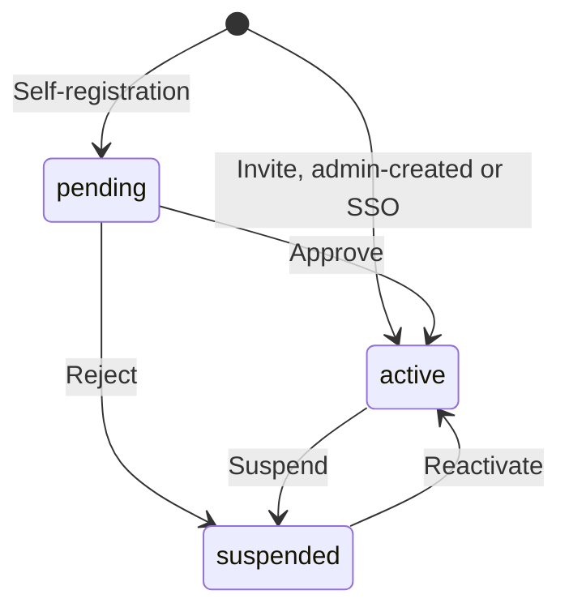

# User & Sign-up Service

*For engineers working on accounts and sign-in, and the security reviewers who check them.*

This page explains how an account comes to exist in {brand}, how it's approved, how its
password is set and reset, and where that code lives. It began as a design plan, so it also
records which parts of the plan shipped and which didn't.

> **Note:** **Status.** The service shipped: self-registration with administrator approval,
> invitations, administrator-created accounts, Argon2id password hashing with a server-side
> strength check, a forced change of the seeded administrator's default password
> (`must_change_password`), administrator-assisted password reset, per-account rate limits,
> and an audit trail built on a transactional outbox. Some of the original plan did not
> ship: moving the user domain into its own repository and database, publishing events to a
> message bus, sending email, idempotency keys on sign-up, and UUID v7 identifiers. The
> table below has the detail. For the authorization model see [RBAC](/docs/rbac); for the
> single sign-on built on top, [SSO](/docs/sso) and the
> [SSO Integration Guide](/docs/sso-integration).

## What shipped and what stayed a plan

| Area | Status | How it works today |
|---|---|---|
| Account tables (`users`, `user_roles`, `user_approvals`, `outbox_events`) | Shipped | Defined in `backend/app/db/models.py`. Identifiers are prefixed hex strings (`usr_` followed by 12 hex characters), not UUID v7. |
| Self-registration with approval | Shipped | Off by default (the **Self-registration** feature switch). A self-registered account is `pending` until an administrator approves it. |
| Invitations | Shipped | Invite links activate the account at sign-up and can grant a role. The **Invite links** switch is on by default. |
| Administrator-created accounts | Shipped | **Add people** in **Administration → User Management**, with a setup link, a password the administrator sets, or single sign-on only. |
| Password hashing | Shipped | Argon2id. Checking a password costs the same whether or not the account exists. |
| Password strength | Shipped | The server refuses a password that zxcvbn scores below 3 on its 0 to 4 scale; the forms show a matching meter. |
| Forced password change | Shipped | When the seeded administrator's password is a shipped default, the account must choose a new one at first sign-in (`must_change_password`). |
| Password reset | Shipped, without email | An administrator generates a one-time reset token (valid for 1 hour) or sets a password directly; the user redeems the token on the password-reset page. |
| Sessions | Shipped, differently from the plan | `HttpOnly` cookies carrying a short-lived access token, with rotating refresh tokens and server-side revocation — not a bearer token kept in `sessionStorage`. |
| Rate limiting | Shipped | In the application: per-account limits on failed sign-ins and on reset requests, plus per-address flood guards. |
| Transactional outbox and relay | Shipped | Events commit in the same transaction as the change; a relay copies them into the audit table `auth_audit_log`. |
| Single sign-on (OIDC, SAML 2.0, corporate portal, enterprise gateway) | Shipped | See [SSO](/docs/sso). |
| User domain in its own repository and database | Plan | The identity package is isolated (see [Where the code lives](#where-the-code-lives)), but the user tables and endpoints live in the main application and its PostgreSQL database. |
| Publishing events to a message bus | Plan | The relay's only consumer is the audit table. |
| Email (reset links, notifications) | Plan | The application sends no email. |
| `X-Idempotency-Key` on sign-up | Plan | Not implemented. |
| UUID v7 keys; re-using an email after deletion | Plan | Prefixed hex identifiers. `users.email` is unique across every row, soft-deleted ones included. |
| Keyset pagination for the administrator's user list | Plan | The list uses offset pagination. |

## How an account comes to exist

```mermaid
stateDiagram-v2
    [*] --> pending: Self-registration
    [*] --> active: Invite, admin-created or SSO
    pending --> active: Approve
    pending --> suspended: Reject
    active --> suspended: Suspend
    suspended --> active: Reactivate
```

An account's `status` is one of `pending`, `active` or `suspended`, shown in **Administration →
User Management** as **Pending**, **Active** and **Suspended**. Only an `active` account can
sign in; a `pending` or `suspended` one gets the same "Invalid email or password" answer as a
wrong password. `users.signup_source` records how the account began:

| How | Who starts it | Starts as | `signup_source` |
|---|---|---|---|
| **Sign up** on the sign-in page (shown only while **Self-registration** is on) | The person | `pending` | `local_signup` |
| An invite link | An administrator invites; the person signs up | `active` | `invite` |
| **Add people** in **User Management** | An administrator | `active` | `admin_created` |
| A first single sign-on with **Create accounts automatically** on | The person, through their identity provider | `active` | `sso_jit` |

**Approving a sign-up.** Self-registered accounts wait under **Pending** in **Administration →
User Management**. **Approve** makes the account active. It grants no workspace access: that
comes from a workspace binding, added separately. **Reject** takes an optional reason, sets
the account to `suspended`, and records the reason on the approval record in
`user_approvals`. Both write an outbox event (`user.approved`, `user.rejected`).

**Invitations.** An invite link can grant a role and attach groups; an invite for a
privileged role is bound to one email address. Who may invite whom, and the two kinds of
link, are covered in [RBAC](/docs/rbac#invites).

**Accounts an administrator creates.** **Add people** asks how the person will sign in:
**Send them a setup link** (the account has no password until they choose one), **Set a
password yourself**, or **Single sign-on only** (no password at all).

## Passwords

**Hashing and checking.** Passwords are hashed with Argon2id. Checking one takes the same
time whether the email exists, the account has no password (single sign-on only), or the
password is wrong, and every refusal returns the same message.

**Strength.** The server refuses any password that zxcvbn scores below 3 on its 0 to 4 scale — at
sign-up, password reset, a self-service change, and when an administrator sets one. The sign-up,
reset and account pages load the same estimator in the browser and show a strength meter, so
a weak password is caught before it's submitted.

**The seeded administrator.** On first start with an empty database, the backend creates one
administrator from `ADMIN_EMAIL` and `ADMIN_PASSWORD` and marks it as a break-glass system
account. If the password is one of the defaults shipped in the repository, the account is
flagged `must_change_password`: at sign-in the app takes it to **Choose a new password**, and
the server — not just the page — enforces the change, refusing with
`password_change_required` until there's a new password. Setting any new password clears
the flag.

**Changing your own password.** On **Account settings**, the **Password** card asks for the
current password. A successful change signs the account out of every device, including the
current one.

## Resetting a password

The application sends no email, so a reset always goes through an administrator.

1. On the sign-in page, the person chooses **Forgot your password?** and enters their email.
   The page answers the same way whether or not the account exists, and the request flags
   the account (only if it's `active` or `pending`) as **Password reset requested** in
   **User Management**.
2. In **Administration → User Management**, an administrator opens **Reset password** on that
   person and chooses **Generate Token** or **Set Password**.
3. With **Generate Token**, the administrator passes the one-time token on through a channel
   they trust. It's valid for 1 hour, and only its SHA-256 hash is stored.
4. The person enters the token and a new password on the reset page. Their password is
   replaced and every session they had is ended.

An account that signs in only through single sign-on has no password. Giving it one is a
deliberate administrator decision — the person redeems a token an administrator generated,
or an administrator uses the user-management API's explicit `allowSsoOnlyOverride` — because
it lets the person sign in around the identity provider. Either way it's recorded in the
audit trail as `user.local_login_enabled`.

## Sessions and limits

A successful sign-in sets `HttpOnly` session cookies: a short-lived access token renewed by a
rotating refresh token, with server-side revocation behind both. Sign-in failures and reset
requests are rate-limited per account as well as per client address. Both are described in
full in the [Security Overview](/docs/security-overview#sessions).

## Events and the audit trail

Every account change writes a row to `outbox_events` in the same transaction as the change
itself — `user.created`, `user.approved`, `user.rejected`, `user.password_reset_requested`,
`user.password_reset_completed` and so on — so a change can't commit without its event. The
outbox relay (`backend/app/services/outbox_relay.py`) copies each event into `auth_audit_log`
and marks it processed in one transaction. `auth_audit_log.source_event_id` is unique, so an
event the relay has already copied is skipped rather than recorded twice. Administrators read
the trail in **Administration → Identity & Access → Audit Log**; see the
[Security Overview](/docs/security-overview#audit-trail).

## Where the code lives

The plan put every piece of the user domain in one `users/` package. What exists instead is
an isolated identity package plus user-management code in the main application.

| Concern | Where |
|---|---|
| Sign-in, sign-out, session renewal, tokens, cookies, CSRF, rate limits, identity providers | `backend/auth_service/` |
| Sign-up, reset requests and redemption, invite verification and redemption | `backend/app/api/v1/endpoints/auth.py` |
| The signed-in user's own account, and administrators' user management | `backend/app/api/v1/endpoints/users.py` |
| Persistence | `backend/app/db/repositories/user_repo.py`, `backend/app/db/repositories/invite_repo.py` |
| Tables | `backend/app/db/models.py` (`UserORM`, `UserRoleORM`, `UserApprovalORM`, `InviteORM`, `RefreshTokenORM`, `OutboxEventORM`, `AuthAuditLogORM`) |
| Request and response models | `backend/common/models/auth.py` |
| Outbox relay | `backend/app/services/outbox_relay.py` |
| Sign-in, sign-up, forgot- and reset-password pages | `frontend/src/components/auth/` |
| Forced password change page | `frontend/src/pages/PasswordChangeRequired.tsx` |
| User Management | `frontend/src/components/admin/AdminUsers.tsx` |
| Client-side strength meter | `frontend/src/lib/passwordStrength.ts` |

**The isolation that exists.** Nothing under `backend/auth_service/` may import from
`backend.app`; `backend/tests/test_auth_service_isolation.py` enforces it. Anything the
identity service needs from the application — the database session, repositories, the
outbox — is handed to it when it's constructed in `backend/app/main.py`. That is the part of
the "logical split" that shipped: the identity service could move into its own process
without changing its callers.

**Cross-domain references.** Some tables store a user id without a database-level foreign
key — `view_favourites.user_id`, for example — so the user tables could live elsewhere later.
Inside the user domain, `user_roles` and `user_approvals` do reference `users.id`, with
`ON DELETE CASCADE`.

**Storage.** Everything lives in the management database, which must be PostgreSQL
(`MANAGEMENT_DB_URL` has to be a `postgresql+asyncpg://` URL). Identifiers and timestamps are
stored as text (ISO-8601 timestamps in UTC), and `users.metadata` is a JSON text column.
`users.deleted_at` marks a soft-deleted account, and queries exclude those rows by default.

## Design principles that still hold

| Area | Principle | How it's applied |
|---|---|---|
| Security | Don't reveal whether an account exists | Sign-in failures, sign-up and reset requests answer the same way for an unknown email |
| Security | Constant-time password checks | Argon2id verification, including against a stand-in hash when there's no real one |
| Security | Secrets stay out of logs | The request log records method, path, status and duration — never request bodies |
| Security | The server enforces, the page explains | Strength, self-registration, forced password change and approval are all checked server-side |
| Engineering | Validation at the boundary | Pydantic models in `backend/common/models/auth.py`; invalid input is a 422 |
| Engineering | Every change is auditable | The transactional outbox and the relay into `auth_audit_log` |
| Scalability | One session path for every tenant size | Workspace permissions stay on the server rather than in the cookie — see [RBAC](/docs/rbac#how-claims-reach-a-request) |

## See also

- [Security Overview](/docs/security-overview) — when you want every sign-in and session
  control in one place.
- [RBAC](/docs/rbac) — when you need the roles an approved or invited account can be given.
- [Users & Access](/guide/users-access) — when you're the administrator approving, inviting
  and resetting.
