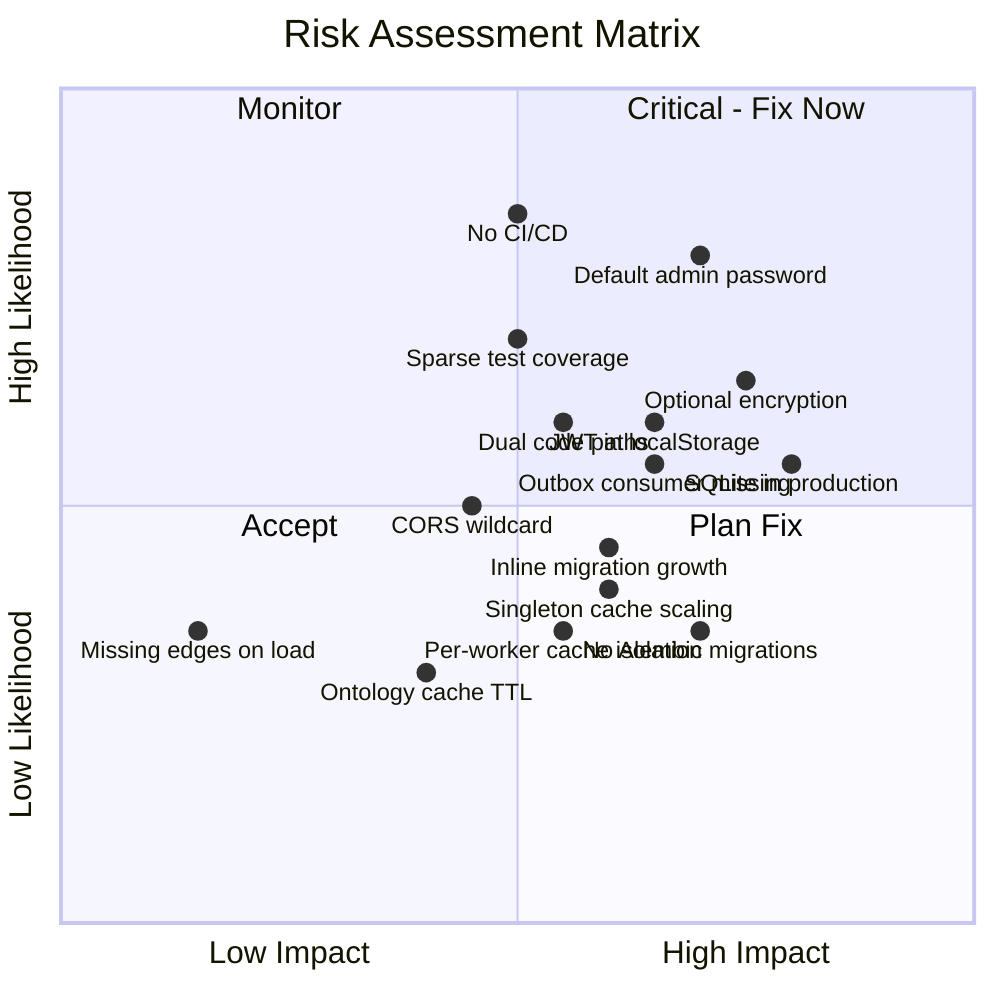
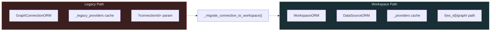
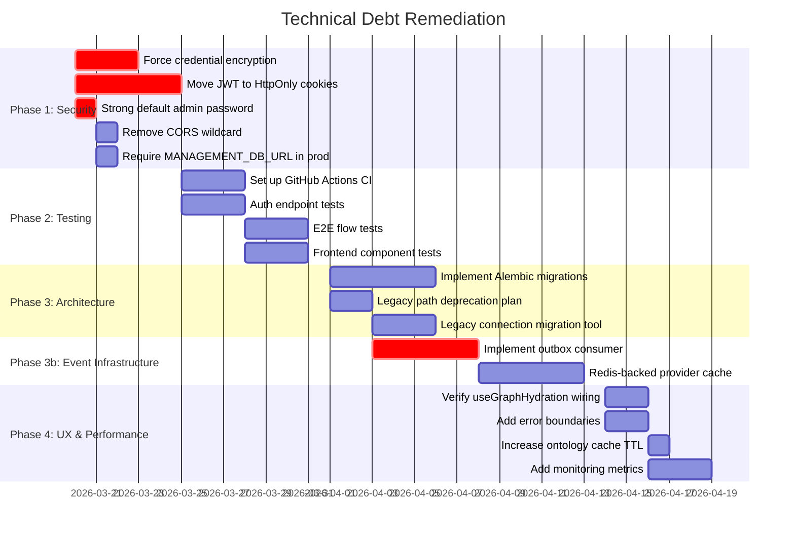

# Technical Debt & Risk Assessment

> **Audience:** Developers and architects assessing risk. New users should start with [OVERVIEW.md](OVERVIEW.md) and [SETUP.md](SETUP.md).

This document provides a critical analysis of the Synodic platform, identifying technical debt, security concerns, scalability issues, and prioritized recommendations.

---

## Risk Matrix



---

## 1. Security Concerns

### 1.1 JWT Stored in localStorage (CRITICAL)

**Files:** `frontend/src/store/auth.ts`

The codebase itself acknowledges this risk:
```
// SECURITY NOTE: The JWT is stored in localStorage via Zustand persist.
// localStorage is accessible to any JS running on the page, making it
// vulnerable to XSS. ... Tracked for v2.
```

**Risk:** A single malicious npm dependency or CDN compromise can steal JWTs from `localStorage`, enabling full account impersonation for the token's lifetime (60 minutes).

**Recommendation:**
1. Move to HttpOnly cookies set by backend (`POST /auth/set-cookie`)
2. Add CSRF protection (`X-CSRF-Token` header)
3. Frontend: use `credentials: 'include'` on API calls
4. Remove JWT from localStorage entirely

### 1.2 Credential Encryption is Optional (HIGH)

**Files:** `backend/app/db/repositories/connection_repo.py`

Credentials fall back to **plaintext** if `CREDENTIAL_ENCRYPTION_KEY` is not set:
```python
def _encrypt(data: dict) -> str:
    fernet = _get_fernet()
    raw = json.dumps(data)
    if fernet:
        return fernet.encrypt(raw.encode()).decode()
    return raw  # plaintext fallback
```

**Risk:** Database backups contain plaintext Neo4j passwords and API tokens.

**Recommendation:**
- Fail startup if key not set outside explicit dev mode
- Add audit script to detect plaintext credentials in existing DB
- Log warning on startup if encryption is disabled

### 1.3 Weak Default Admin Password (HIGH)

**Files:** `backend/app/main.py`

```python
admin_password = os.getenv("ADMIN_PASSWORD", "changeme")
```

A log message ("change password after first login!") is the only control.

**Recommendation:**
- Generate random 32-character password on first run
- Print to stdout only (not logged)
- Force password change on first login (`must_change_password` flag)

### 1.4 CORS Wildcard on Graph Service (MEDIUM)

**Files:** `backend/graph/main.py`

```python
allow_origins=["http://localhost:3000", "http://localhost:5173", "*"]
```

The `"*"` allows any origin to call the Graph Service. Combined with `allow_credentials=True`, this enables cross-origin attacks.

**Recommendation:**
- Remove `"*"` from CORS origins
- Add rate limiting to Graph Service endpoints
- Log failed connection tests (scanning detection)

---

## 2. Database & Data Integrity

### 2.1 SQLite as Default Database (CRITICAL)

**Files:** `backend/app/db/engine.py`

SQLite is the default if `MANAGEMENT_DB_URL` is not set. SQLite cannot handle:
- Concurrent write transactions (locks entire DB)
- Multi-process deployments (each worker = separate connection)
- Connection pooling or replication

**Risk:** Data corruption or application hangs under concurrent load.

**Recommendation:**
- Require `MANAGEMENT_DB_URL` in production
- Fail loudly if SQLite detected outside dev/test
- Document "SQLite is dev-only" prominently

### 2.2 No Schema Versioning (Alembic) (HIGH)

**Files:** `backend/app/db/engine.py` (inline ALTER TABLE migrations)

15+ migrations run as raw SQL in `init_db()` with exceptions silently caught:
```python
for stmt in migrations:
    try:
        await conn.execute(sqlalchemy.text(stmt))
    except Exception:
        pass  # Column already exists
```

**Risks:**
- No ordering, dependency management, or version tracking
- Silent failures if migration partially applies
- No rollback capability
- Race conditions in multi-worker deployments

**Recommendation:**
- Implement Alembic for schema versioning
- Separate table creation from migration
- Add migration lock for concurrent deployments

---

## 3. Architecture Issues

### 3.1 Dual Code Paths (Legacy + Workspace) (HIGH)

**Files:** `backend/app/registry/provider_registry.py`, `backend/app/db/models.py`

Two competing architectures run simultaneously:



**Risks:**
- Stale data between paths
- Duplicated business logic
- 60+ line migration function that's difficult to test

**Recommendation:**
1. Declare hard cutoff date for legacy removal
2. Add deprecation warnings in logs when legacy path is used
3. Create migration script to convert all legacy connections
4. Delete `GraphConnectionORM` and legacy cache after migration

### 3.2 Singleton ProviderRegistry Scaling (MEDIUM)

**Files:** `backend/app/registry/provider_registry.py`

Each Uvicorn worker gets its own `ProviderRegistry` instance. With 4 workers:
- 4 separate connection pools to FalkorDB
- Config changes in one worker not visible to others
- No cache coordination

**Recommendation:**
- Document single-worker limitation
- Plan Redis-backed shared cache for distributed deployments
- Add cache hit/miss metrics

### 3.3 Ontology Cache TTL Too Aggressive (MEDIUM)

**Files:** `backend/app/services/context_engine.py`

5-minute TTL on resolved ontology. Ontologies rarely change but are fetched frequently.

**Recommendation:**
- Increase TTL to 1 hour or event-based invalidation
- Move to process-level shared cache
- Pre-warm cache on startup

---

## 4. Testing & CI/CD

### 4.1 Sparse Test Coverage (HIGH)

**Files:** `backend/tests/` (only 6 test files)

Missing tests for:
- Authentication endpoints (signup, login, password reset)
- Provider registry cache behavior
- Database migrations
- Credential encryption/decryption
- CORS and security headers
- API contract validation

**No frontend tests found.**

**Recommendation:**
- Target 70% backend coverage before v1.0
- Add auth flow integration tests
- Add frontend component tests (Vitest + Testing Library)

### 4.2 No CI/CD Pipeline (HIGH)

No `.github/workflows/` directory exists.

**Recommendation:** Create GitHub Actions workflow:
```yaml
# ci.yml
- pytest backend/tests/ (fail if coverage < 70%)
- mypy backend/app/ (type checking)
- ruff (linting)
- npm run lint (frontend)
- Docker build (syntax validation)
```

### 4.3 No Integration Tests (MEDIUM)

No end-to-end tests verify critical flows:
- Signup -> Approve -> Login -> Access protected endpoint
- Create workspace -> Add data source -> Query graph

**Recommendation:** Add `test_e2e_auth_flow.py` and `test_e2e_graph_flow.py`.

---

## 5. Frontend Issues

### 5.1 Missing Edges on Initial Load — RESOLVED

**Status:** ~~HIGH~~ → **Resolved** (2026 Q1)

**Files:** `frontend/src/hooks/useGraphHydration.ts` (28KB)

The `useGraphHydration` hook has been implemented and provides:
- `toCanvasNode()` / `toCanvasEdge()` — backend-to-canvas type conversion
- `computeViewScopedRoots()` — root entity type calculation
- Hydration phase tracking: `idle → roots → edges → children → complete`
- Automatic loading of roots + edges on mount/view change

**Remaining edge cases:** Verify the hook is fully wired into all canvas entry points (CanvasRouter, view wizard transitions). Deep-link hydration should be tested end-to-end.

### 5.2 No Error Boundaries (MEDIUM)

No React error boundaries at route or component level. A single component crash takes down the entire application.

**Recommendation:** Add error boundaries at route level for graceful degradation.

### 5.3 No Optimistic Updates (LOW)

Trace operations wait for backend response before updating UI. Perceived latency could be improved.

---

## 6. Missing Infrastructure

| Gap | Severity | Recommendation |
|-----|----------|----------------|
| No monitoring/alerting | Medium | Prometheus metrics + structured logging |
| No API documentation (beyond auto-generated) | Low | Add docstrings + examples to endpoints |
| No rate limiting on graph queries | Medium | Apply slowapi limits (100 req/min/user) |
| No pagination max limit | Low | Cap at 500-1000, fail if response > 10MB |
| Error handling swallows startup failures | Medium | Re-raise critical seed failures |
| ~~No structured logging~~ | ~~Medium~~ | **Resolved:** `StructuredLoggingMiddleware` now provides JSON access logs + `X-Process-Time` header |
| ~~No health check endpoints~~ | ~~Medium~~ | **Resolved:** `/health` endpoint exists on both Viz Service and Graph Service |
| Stats poller has no graceful shutdown | Low | Add signal handlers for SIGTERM/SIGINT |
| **Outbox events consumer not implemented** | **HIGH** | Events written but never consumed — dead letter risk. **Blocks microservice extraction** (see ADR-012). `outbox_events` accumulate with `processed = false` indefinitely. Write-side works; consumer process needed. |

### 6.1 Cross-Service Concerns (Phase 2 Findings)

| Gap | Severity | Detail |
|-----|----------|--------|
| **Stats Poller isolation** | Medium | Runs as standalone process sharing `backend.app` imports. No container/service boundary enforced -- crash affects no other service but silent failure means stale stats indefinitely. |
| **Outbox consumer missing** | Medium | `outbox_events` table accepts writes (e.g., `user.created`) but no consumer process exists. Events accumulate with `processed = false` forever. |
| **Provider location split** | Low | FalkorDB and Mock providers live in `backend/app/providers/`, while Neo4j and DataHub live in `backend/graph/adapters/`. This split is functional but undocumented and may confuse contributors. |
| **Feature flag hot-reload** | Low | Feature flags are fetched from DB per request. No caching or change-notification mechanism -- acceptable at current scale but will need attention with increased traffic. |
| **Growing inline migrations** | Medium | 15+ `ALTER TABLE` statements in `init_db()` with exceptions silently caught. No ordering, no version tracking, no rollback. Each new schema change adds another raw SQL statement. Risk of partial application and silent failures increases linearly. |
| **Per-worker ProviderRegistry cache isolation** | Medium | Each Uvicorn worker has its own `ProviderRegistry` singleton. With N workers = N separate connection pools. Config changes (eviction, provider updates) in one worker are invisible to others. Silent coherence issue at scale; fine for single-worker dev. Future: Redis-backed shared cache. |

---

## 7. Prioritized Remediation Plan



### Phase 1: Security & Stability (Week 1-2)

| Priority | Item | Effort | Impact |
|----------|------|--------|--------|
| **P0** | Force credential encryption | Low | Prevents plaintext credential leaks |
| **P0** | Move JWT to HttpOnly cookies | Medium | Eliminates XSS token theft |
| **P0** | Strong default admin password | Low | Prevents trivial admin compromise |
| **P1** | Remove CORS wildcard from Graph Service | Low | Reduces attack surface |
| **P1** | Require MANAGEMENT_DB_URL in production | Low | Prevents SQLite corruption |
| **P1** | Add rate limiting to graph query endpoints | Low | Prevents DoS |

### Phase 2: Testing & CI/CD (Week 3-4)

| Priority | Item | Effort | Impact |
|----------|------|--------|--------|
| **P1** | GitHub Actions CI pipeline | Medium | Automated quality gates |
| **P1** | Auth endpoint test coverage | Medium | Validates critical security paths |
| **P1** | E2E flow integration tests | Medium | Catches cross-component regressions |
| **P2** | Frontend component tests | Medium | Prevents UI regressions |

### Phase 3: Architecture Cleanup (Week 5-6)

| Priority | Item | Effort | Impact |
|----------|------|--------|--------|
| **P2** | Implement Alembic migrations | Medium | Reliable schema evolution |
| **P2** | Legacy path deprecation plan | Low | Clarifies migration timeline |
| **P2** | Legacy connection migration tool | Medium | Unblocks legacy removal |

### Phase 3b: Event Infrastructure (Week 5-6, parallel)

| Priority | Item | Effort | Impact |
|----------|------|--------|--------|
| **P1** | Implement outbox consumer | Medium | Unblocks microservice extraction; prevents dead-letter accumulation |
| **P2** | Redis-backed ProviderRegistry cache | Medium | Solves per-worker cache isolation for multi-worker deployments |

### Phase 4: UX & Performance (Week 7-8)

| Priority | Item | Effort | Impact |
|----------|------|--------|--------|
| **P2** | ~~useGraphHydration~~ Verify hook wiring in all canvas entry points | Low | Confirm fix for deep-link hydration |
| **P2** | Error boundaries | Low | Graceful error recovery |
| **P3** | Increase ontology cache TTL | Low | Reduces DB queries |
| **P3** | Add monitoring (Prometheus) | Medium | Production observability |

---

## 8. Summary

| Category | Critical | High | Medium | Low |
|----------|----------|------|--------|-----|
| **Security** | 2 (JWT, SQLite) | 2 (encryption, admin pwd) | 2 (CORS, CSP) | - |
| **Architecture** | - | 2 (dual paths, no migrations) | 4 (singleton cache, ontology TTL, provider split, inline migration growth) | - |
| **Testing** | - | 2 (sparse coverage, no CI) | 1 (no integration tests) | - |
| **Frontend** | - | ~~1 (missing edges)~~ resolved | 1 (no error boundaries) | 1 (no optimistic updates) |
| **Infrastructure** | - | 1 (outbox consumer) | 3 (no monitoring, no rate limits, per-worker cache isolation) | 3 (no API docs, no pagination cap, poller shutdown) |
| **Resolved** | - | - | - | ~~health checks~~, ~~structured logging~~, ~~missing edges~~ |

**Highest priority blockers for production deployment:**
1. Force credential encryption (prevent plaintext leaks)
2. Move JWT to HttpOnly cookies (prevent XSS token theft)
3. Require PostgreSQL in production (prevent SQLite corruption)
4. Strong default admin password (prevent trivial compromise)
5. CI/CD pipeline (prevent unvalidated deployments)
