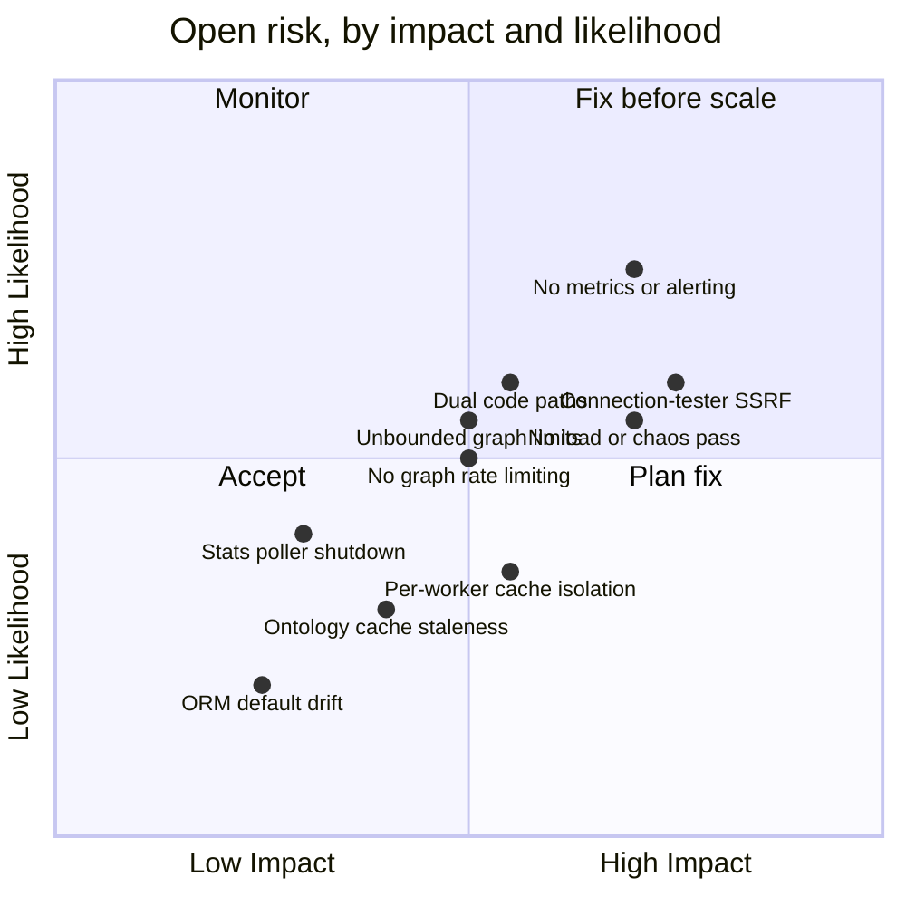

# Technical Debt & Risk Assessment

> **Audience:** Developers and architects assessing risk. New users should start with [OVERVIEW.md](OVERVIEW.md) and [SETUP.md](SETUP.md).

A live register of what is actually wrong with the {brand} platform today.

**Verified against `6f90a63` on 2026-08-25.** Every open item below carries a
file and line you can re-check in under a minute. That is the point: the
previous revision of this document had drifted far enough to assert that the
repository had no CI pipeline and six test files, while CI was gating every
merge and the suites held nearly nine thousand tests. A register that is wrong
is worse than no register, because it moves effort to the wrong place and it
lends stale claims the authority of a document.

**How to read it**

- §1–§3 are the open risks, ordered by what to do about them rather than by
  subsystem. Each carries **evidence** — the file and line that makes the claim
  checkable — and a **recommendation** that says what to do first, not
  everything that could be done.
- §4 is the failure mode this codebase has demonstrably had, which is not on
  any list of missing things.
- §5 is the sequence.
- **Appendix A** is what has been resolved, kept short and with evidence. It is
  history, not work.

**How to keep it true.** Every open item's evidence line is a claim about the
tree. When you close one, delete it — git holds the history, and a resolved
entry left in place is how the previous revision came to contradict its own
summary. Re-verify the whole register at each release cut; §6 describes a check
that can do most of it mechanically.

---

## Risk matrix

Open items only. Anything resolved has left this chart.

```mermaid
quadrantChart
    title Open risk, by impact and likelihood
    x-axis Low Impact --> High Impact
    y-axis Low Likelihood --> High Likelihood
    quadrant-1 Fix before scale
    quadrant-2 Monitor
    quadrant-3 Accept
    quadrant-4 Plan fix
    Connection-tester SSRF: [0.75, 0.6]
    No metrics or alerting: [0.7, 0.75]
    No load or chaos pass: [0.7, 0.55]
    Dual code paths: [0.55, 0.6]
    Unbounded graph limits: [0.5, 0.55]
    No graph rate limiting: [0.5, 0.5]
    Per-worker cache isolation: [0.55, 0.35]
    Ontology cache staleness: [0.4, 0.3]
    Stats poller shutdown: [0.3, 0.4]
    ORM default drift: [0.25, 0.2]
```

---

## 1. High — fix before the next scale step

### 1.1 SSRF via provider connection-testing

**Evidence:** `backend/app/api/v1/endpoints/providers.py:325`
(`POST /test-connection`). No address check exists on this path;
`assert_fetchable` lives in `backend/auth_service/providers/outbound.py:71`
and has exactly one caller, inside that same module.

The onboarding wizard tests an arbitrary `host:port` from inside the cluster.
A tenant can use it to probe internal services or the cloud metadata endpoint
(`169.254.169.254`), which is the address that turns request-forgery into
instance-credential theft. It is admin-gated, so this is not an unauthenticated
hole — but the whole value of this service's network position is that it reaches
things the caller's browser cannot, and "an admin would not" is not an access
control.

**Recommendation — reuse the classifier, do not write a second one.**
`outbound.py` already classifies addresses by *property* rather than by CIDR
list (loopback, link-local, multicast, reserved, unspecified) and unwraps
IPv4-mapped IPv6, so `::ffff:169.254.169.254` cannot slip past. What it does not
do is serve a non-HTTP caller: the connection tester takes a `host:port` for a
graph driver, not a URL.

1. Extract the address classification into a shared module (e.g.
   `backend/common/netguard.py`) that depends on nothing in `auth_service`.
2. Keep `assert_fetchable(url)` as the URL-shaped wrapper.
3. Add `assert_connectable(host, port)` for the driver-shaped callers and call
   it from `/test-connection` before any socket is opened.

Writing a second, independent allowlist is how the two drift, and this codebase
has been bitten by exactly that shape before — see §4.

### 1.2 No metrics export or alerting

**Evidence:** no `/metrics` route in `backend/app/main.py` or
`backend/app/api/v1/api.py`; counters are collected in `jobs/metrics.py` and
`middleware/db_metrics.py` and go nowhere.

Resilience you cannot observe fails silently. Every control below this line in
the document degrades quietly rather than loudly.

**Recommendation — one alert before any dashboard.** The instinct is to
enumerate everything worth graphing; the value is the first alert that fires
before a user notices. Two, in order:

1. **Event-loop lag on the `web` role.** The wedge watchdog is log-only today,
   which means the failure it detects is invisible unless somebody is reading
   logs at the time.
2. **Redis reachability.** This one has become more load-bearing than the
   previous revision of this document reflects: revocation, rate-limit
   counters, and the SAML replay cache all resolve through it, and readiness
   now depends on a *shared* store rather than a per-worker fallback.

Then the exporter and the rest: per-provider reachability, consumer-group lag,
DB pool saturation, Redis memory and eviction, worker fleet size.

### 1.3 No system-level load or chaos pass

**Evidence:** absence — `backend/tests/integration/` holds 90 files, all
component-level.

Every decoupling change has been verified individually. The whole topology at
target scale has not: a cold start against the 7.7M-entity
`perf-load-test-layered-lineage` graph, concurrent load on a single tenant's
FalkorDB, and a request storm that must 429-shed rather than OOM.

**Recommendation.** One soak pass, with the pass/fail criteria written *before*
it runs. An unbounded "see what happens" run produces a story; a run with a
stated threshold produces a decision. Note this is blocked in practice by §1.2 —
without metrics the soak tells you it survived, not where it bent.

### 1.4 Dual code paths (legacy connections + workspaces)

**Evidence:** `backend/app/registry/provider_registry.py:53` (`_legacy_providers`),
`:141`, `:191`; `_migrate_connection_to_workspace`; 8 endpoint references to
`connectionId`.

Two architectures run at once: `GraphConnectionORM` with a legacy provider cache
and a `?connectionId=` parameter, alongside `WorkspaceORM`/`DataSourceORM` with
its own cache and path-scoped routing. The risks are stale data between paths,
duplicated business logic, and a migration bridge that is hard to test.

**Recommendation — measure before you plan.** The obvious plan (announce a
cutoff date, add deprecation warnings, write a migration tool, delete)
front-loads the political step and back-loads the informational one, and it
assumes a migration tool is needed before anyone has established there is
anything to migrate.

1. Emit a **counter** — not a log line — on every legacy-path hit, tagged by
   route and tenant. (Needs §1.2.)
2. Run it for two weeks.
3. Let the number choose: zero means delete with no tool at all; one tenant
   means migrate that tenant by hand; many means the tool is justified and you
   now know which routes it must cover.

---

## 2. Medium — plan these

### 2.1 Eight graph endpoints take an unbounded `limit`

**Evidence:** `backend/app/api/v1/endpoints/graph.py` lines 1321, 1346, 1632,
1702, 1723, 1735, 1747, 1759 — each `limit: int = Query(100, ge=1)` with no
`le=`. Line 1156 is the one that is capped (`le=1000`).

A caller can ask for an arbitrary row count against FalkorDB.

**Status:** a fix is in flight in PR #433, which adds upper bounds to all eight.
Close this entry when that merges; do not fix it twice.

### 2.2 No rate limiting on graph query endpoints

**Evidence:** `limiter.limit` appears only in
`backend/app/api/v1/endpoints/users.py`, `.../auth.py`, and
`backend/auth_service/api/router.py`. Nothing in `graph.py`.

The expensive endpoints are the unthrottled ones. Pairs with §2.1: a bounded
page size without a request rate still permits the same total load, just in more
requests.

**Recommendation.** Apply `slowapi` limits keyed on the **account**, not the
address. Address keying is near-useless behind a corporate NAT or an ingress —
every user shares one address, so a cap tight enough to stop an attacker stops
an office instead. The auth surface already learned this; see
`SSO_INTEGRATION.md §10.2`, which documents the per-address / per-account split
and why `/refresh` keys on the rotation family.

### 2.3 Per-worker `ProviderRegistry` cache isolation

**Evidence:** `backend/app/registry/provider_registry.py:53` — the cache is
instance state on a per-process singleton.

With N workers there are N connection pools and N copies of provider config. A
config change in one worker is invisible to the others until its TTL rolls.

**Recommendation — invalidate, do not share.** The standing suggestion is a
Redis-backed shared cache. That is the expensive answer to a cheaper problem:
the defect is *staleness after a write*, not cache misses, and a shared cache
also surrenders the per-worker latency win.

Publish a `provider.changed` message on the Redis instance already running for
revocation, and have each worker drop its own entry. Roughly thirty lines
against a rewrite. Move to a shared cache only if cold-start cost is later
*measured* to matter — which again needs §1.2.

### 2.4 Ontology cache staleness

**Evidence:** `backend/app/services/context_engine.py:69` —
`_ONTOLOGY_CACHE_TTL = 300`.

Ontologies change rarely and are read constantly, so a five-minute TTL is mostly
wasted invalidation. But note the standing recommendation contains a
contradiction worth not repeating: "raise the TTL to an hour **or** move to
event-based invalidation" are opposite trades. Raising the TTL makes staleness
worse, and staleness is the complaint in §2.3 one entry above.

**Recommendation.** Event-based invalidation, using the same mechanism as §2.3 —
they are the same problem twice. TTL then becomes a backstop and can safely go
to a day. Do **not** pre-warm on startup: a startup dependency bought for a
five-minute cache is a bad trade, and it makes boot fail for a reason unrelated
to boot.

### 2.5 Stats poller has no service boundary and no graceful shutdown

**Evidence:** no `SIGTERM`/`SIGINT` handling in `backend/app/jobs/`; the poller
runs as a standalone process sharing `backend.app` imports.

A crash affects nothing else, which is the good news; a silent failure means
stale stats indefinitely, which is the bad news, and nothing surfaces it.

**Recommendation.** Signal handlers first (small), then a freshness assertion on
the stats it produces — a poller that dies loudly is better than one that dies
quietly, and a consumer that notices stale data is better than both.

---

## 3. Low — track, or deliberately accept

### 3.1 ORM and migrations disagree on column defaults (enumerated, gated)

`0001_baseline` is `Base.metadata.create_all()` against the **live** ORM, so a
database has always had two possible origins — `create_all` on a fresh install,
the migration chain everywhere else — with nothing comparing the results. They
had drifted.

The structural half of that drift is fixed and gated: `synodic-upgrade
verify-schema` runs in CI against all three install routes
(`.github/workflows/schema.yml`) and fails if the ORM declares a table or column
the database lacks. It found one — `context_models.visibility`, declared in the
ORM, added by no migration, therefore present only on databases created after it
entered the ORM — fixed by `20260731_1200_ctxmodel_vis`.

What remains is **column defaults**, in 44 places. Migrations write
`server_default=`; the ORM declares only a Python-side `default=`. So a migrated
database has a real `DEFAULT` and a fresh one does not, for the same column.

This is deliberately **not** failing CI. Every write through SQLAlchemy supplies
the value from the Python-side default, so the application behaves identically
either way; the difference is visible only to raw SQL that omits the column, and
to `alembic revision --autogenerate`, which will keep proposing these until they
are reconciled. `verify-schema` reports them as warnings and `--strict-defaults`
turns them into failures for anyone working through the list.

Fixing one means adding `server_default=` to the ORM column with the value the
migration used — mechanical, but each literal has to be checked against the
migration that set it, because a wrong one silently changes what a fresh install
writes.

Two further columns exist on migrated databases and in no ORM model at all —
`resource_grants.expires_at` and `views.display_rules` — leftovers from
migrations whose ORM counterpart was later removed. They are absent on fresh
installs, harmless on old ones, and dropping them is a deliberate act rather
than a CI job's decision. `verify-schema` lists them and does not fail.

All 44 default differences

| Column | Default on migrated databases | Direction |
|---|---|---|
| `aggregation.aggregation_jobs.last_sequence` | `0` | migration set one, ORM does not |
| `aggregation.job_event_log.id` | `—` | ORM declares one, database has none |
| `public.access_requests.status` | `'pending'::text` | migration set one, ORM does not |
| `public.app_auth_config.allow_jit_provisioning` | `true` | migration set one, ORM does not |
| `public.app_auth_config.allow_local_login` | `true` | migration set one, ORM does not |
| `public.app_auth_config.email_first_login` | `false` | migration set one, ORM does not |
| `public.app_auth_config.id` | `'singleton'::text` | migration set one, ORM does not |
| `public.app_auth_config.sso_enabled` | `true` | migration set one, ORM does not |
| `public.app_auth_config.version` | `1` | migration set one, ORM does not |
| `public.application_branding.id` | `'singleton'::text` | migration set one, ORM does not |
| `public.application_branding.version` | `1` | migration set one, ORM does not |
| `public.asset_discovery_cache.asset_name` | `''::text` | migration set one, ORM does not |
| `public.asset_discovery_cache.payload` | `'{}'::text` | migration set one, ORM does not |
| `public.asset_discovery_cache.status` | `'fresh'::text` | migration set one, ORM does not |
| `public.auth_audit_log.payload` | `'{}'::text` | migration set one, ORM does not |
| `public.group_members.source` | `'local'::text` | migration set one, ORM does not |
| `public.groups.is_protected` | `false` | migration set one, ORM does not |
| `public.groups.source` | `'local'::text` | migration set one, ORM does not |
| `public.idp_group_role_mappings.target_type` | `'role_binding'::text` | migration set one, ORM does not |
| `public.idp_providers.claim_mapping` | `'{}'::text` | migration set one, ORM does not |
| `public.idp_providers.enabled` | `true` | migration set one, ORM does not |
| `public.idp_providers.linking_policy` | `'strict'::text` | migration set one, ORM does not |
| `public.idp_providers.priority` | `100` | migration set one, ORM does not |
| `public.idp_providers.settings` | `'{}'::text` | migration set one, ORM does not |
| `public.invites.group_ids` | `'[]'::text` | migration set one, ORM does not |
| `public.invites.shareable_groups_override` | `false` | migration set one, ORM does not |
| `public.invites.token_version` | `1` | migration set one, ORM does not |
| `public.invites.use_count` | `0` | migration set one, ORM does not |
| `public.provider_admission_config.bucket_capacity` | `8` | migration set one, ORM does not |
| `public.provider_admission_config.circuit_fail_max` | `5` | migration set one, ORM does not |
| `public.provider_admission_config.circuit_window_secs` | `30` | migration set one, ORM does not |
| `public.provider_admission_config.half_open_after_secs` | `60` | migration set one, ORM does not |
| `public.provider_admission_config.refill_per_sec` | `2` | migration set one, ORM does not |
| `public.provider_health_window.consecutive_failures` | `0` | migration set one, ORM does not |
| `public.provider_health_window.failure_count` | `0` | migration set one, ORM does not |
| `public.provider_health_window.success_count` | `0` | migration set one, ORM does not |
| `public.role_bindings.source` | `'local'::text` | migration set one, ORM does not |
| `public.roles.is_system` | `false` | migration set one, ORM does not |
| `public.roles.scope_type` | `'global'::text` | migration set one, ORM does not |
| `public.user_identities.metadata` | `'{}'::text` | migration set one, ORM does not |
| `public.users.signup_source` | `'local_signup'::text` | migration set one, ORM does not |
| `public.view_layout_overlays.fork_base_layout` | `'{}'::text` | migration set one, ORM does not |
| `public.view_layout_overlays.reference_layout` | `'{}'::text` | migration set one, ORM does not |
| `public.workspace_data_sources.write_back_enabled` | `false` | migration set one, ORM does not |

### 3.2 `stats` is not a real `SynodicRole`

**Evidence:** `backend/app/runtime/role.py:21` — the enum holds `WEB`, `WORKER`,
`CONTROLPLANE`, `DEV`. The insights/stats service sets `SYNODIC_ROLE=stats`,
which falls through to `dev`, so the dedicated-cache guard is skipped for it.
The structural `build_cache_client` fix still prevents FalkorDB co-location, so
this is a missing assertion rather than a live misconfiguration.

**Recommendation.** Add a `STATS` member, or set the service to `worker`. The
second is one line and loses nothing today.

### 3.3 Provider implementations live in two trees

**Evidence:** `backend/app/providers/` holds FalkorDB and the mock;
`backend/graph/adapters/` holds Neo4j, DataHub and Spanner.

Functional, undocumented, and confusing to a newcomer looking for "where do
providers live".

**Recommendation.** A paragraph in `ARCHITECTURE.md` costs minutes; moving the
files costs a merge conflict with everything in flight. Document it, and move
them only when a change is already touching both trees.

### 3.4 Feature flags are read from the database per request

**Evidence:** `backend/app/services/feature_flags.py` — no cache, no
change-notification.

Acceptable at current scale. It becomes the same problem as §2.3 and §2.4 at
higher traffic, and it should be solved the same way rather than separately.

### 3.5 Control-plane scheduler is not single-flight under HA

The control plane runs 2 replicas, which removed a single point of failure. The
scheduler is detect-and-log and idempotent, so 2 replicas are safe, but it
performs 2× the drift-check reads against FalkorDB every 60s.

**Recommendation.** If that read load ever shows up, gate `_tick` behind a
Postgres advisory lock exactly as the reconciler already does. Not before.

### 3.6 No optimistic updates in the trace UI

Trace operations wait for the backend before updating. This is perceived
latency, not correctness. Listed so it is not rediscovered as a bug.

### 3.7 Image registry ambiguity — needs an operator answer, not code

CI (`build-images.yml`) pushes to **Docker Hub**; the Makefile deploy path
pushes to **GCP Artifact Registry**. Same image names, different registries. The
naming drift itself is fixed; what remains is confirming which registry
production actually pulls from. Nobody can close this from the repository alone.

---

## 4. The failure mode this codebase actually has

Every item above is about something **absent** — no metrics, no rate limit, no
soak test, no shared invalidation. Absent things are easy to see, which is why
they end up on lists like this one.

The dangerous class is different: **a control that is present, documented, and
inert.** The security review that produced PR #433 found seven of them. Among
them: a replay cache that was constructed and then never consulted; a lifecycle
filter applied to the public provider catalog but not to the authentication path
it was protecting; a revocation probe written inline in one guard and therefore
missing from the sibling guard covering the most privileged routes; and a
stand-in backend that answered "not revoked" rather than refusing when it could
not know.

None of these would appear on an inventory of missing features. Each one read as
implemented — the class existed, the config existed, the documentation described
the behaviour — and each did nothing. A reader of `SSO_INTEGRATION.md` would
have concluded SAML replay was defended. It was not.

**Recommendation — a recurring "assert the assertion" pass.** Once a release,
take five controls the documentation claims and prove each one by breaking it:
remove the control, watch a test fail, restore it. A control with no test that
fails when it is removed is indistinguishable from a control that is not there.
This is worth more than any single entry in §1–§3, because it is the only
practice on this page that finds the defects nobody is looking for.

It is also cheap. The seven above were each found by running the code rather
than reading it, and each took minutes once the question was asked.

---

## 5. Sequence

Not a Gantt chart. The previous revision carried one with fixed 2026-03 dates
that expired without anyone noticing, which is its own small lesson about
plans that encode calendar time rather than order.

| Order | Item | Why here |
|---|---|---|
| 1 | §1.1 connection-tester SSRF | Live security exposure, small fix, mechanism already written |
| 2 | §1.2 one alert, then the exporter | Unblocks §1.3, §1.4 and §2.3 — several items below cannot be *decided* without it |
| 3 | §2.2 graph rate limits | Small, and pairs with the §2.1 caps already in flight |
| 4 | §1.4 legacy-path counter | Two weeks of data before any migration decision |
| 5 | §1.3 soak and chaos pass | Needs 2 to be worth running |
| 6 | §2.3 + §2.4 + §3.4 invalidation | One mechanism, three symptoms — do them together or not at all |
| 7 | §1.4 legacy removal | Whatever the counter says |
| 8 | §3.x | Individually cheap, none urgent |

Running alongside, not in the queue: §4. It is a habit rather than a task.

---

## 6. Keeping this document honest

Most of the staleness that made the previous revision misleading was in claims a
script could have checked: "no `.github/workflows/` directory exists", "only 6
test files", "no frontend tests found", "SQLite is the default", "no error
boundaries". Each was false, and each stayed in the document through several
revisions because keeping a register current is a discipline and disciplines
lapse.

**Recommendation.** Add a test that asserts each open item's premise still holds
and fails when one no longer does — a `test_technical_debt_register.py` that,
for example, asserts `graph.py` still has un-`le`-bounded `limit` parameters and
fails the day someone fixes them without updating this file. A failing test that
says "§2.1 is fixed, delete it" is the cheapest possible maintenance.

This is the same trick `backend/tests/test_sso_kind_matrix.py` plays on the SSO
provider registry, and it is why a provider kind cannot be half-registered
there.

---

## Appendix A — Resolved

History, not work. Kept short and with evidence so a claim here can be checked
as easily as one above, and so nothing in this list has to be re-litigated from
memory. Delete an entry when it stops being interesting.

| Was | Now | Evidence |
|---|---|---|
| **JWT in `localStorage` (CRITICAL)** | Sessions ride HttpOnly cookies (`nx_access` / `nx_refresh`); no token is in web storage. Every remaining `localStorage`/`sessionStorage` call site holds UI state — layout widths, dismissals, wizard drafts, recent searches, the feature-flag cache, and a sessionStorage-only user DTO cache wiped on logout. The full recommendation shipped: HttpOnly cookies, `X-CSRF-Token` double-submit, and `credentials: 'include'` on every call. | `backend/auth_service/cookies.py:6`; `frontend/src/services/fetchWithTimeout.ts` |
| **Credential encryption optional (HIGH)** | `require_encryption_or_plaintext_ok()` raises on the write path when `CREDENTIAL_ENCRYPTION_KEY` is unset and `ENV` is `prod`/`production`, for both `graph_connections` and `idp_providers`. Dev and test behaviour unchanged, with a warning logged. **Still outstanding:** an audit script to find plaintext credentials in a database predating the guard. | `backend/app/db/repositories/connection_repo.py:46` |
| **Weak default admin password (HIGH)** | The bootstrap still accepts a default, but the account cannot use it: a password published in this repo (`changeme`, `admin123`, `REPLACE_ME`) creates the user with `must_change_password=True`, enforced on every route outside the change-password paths. Admin → Users badges any account still in that state; `backend/scripts/reset_admin_password.py` recovers a locked-out sole admin. **Still outstanding (low):** generate a random password on first run and print it to stdout only, so a published string never lands in a `password_hash` column at all. | `backend/app/main.py:385` |
| **CORS wildcard on Graph Service (HIGH)** | The standalone `graph-service` no longer exists ([ADR-018](DECISIONS.md#adr-018-retire-the-graph-service)). Connectivity testing runs in-process under `CORS_ALLOWED_ORIGINS`, with no wildcard default. | `backend/app/main.py:2034` |
| **SQLite as default database (CRITICAL)** | There is no SQLite branch. Anything that is not an asyncpg Postgres URL is rejected at import time. | `backend/app/db/engine.py:130` |
| **No schema versioning (CRITICAL)** | Alembic is the source of schema truth, applied by a dedicated `synodic-upgrade` service under a `pg_advisory_lock`. The API process only verifies `alembic_version` is at head; it never mutates schema. | `backend/alembic/versions/`; [DATA_ARCHITECTURE.md §8](DATA_ARCHITECTURE.md) |
| **No CI/CD pipeline (HIGH)** | Nine workflows gate merges: `backend-tests`, `frontend-tests`, `codeql`, `security-scan`, `alembic-guards`, `schema`, `build-images`, `dependency-review`, `dependabot-auto-merge`. | `.github/workflows/` |
| **Sparse test coverage / no frontend tests (HIGH)** | 362 backend test files and 360 frontend ones. | `backend/tests/`, `frontend/src/**/*.test.*` |
| **No integration tests (MEDIUM)** | 90 files. | `backend/tests/integration/` |
| **No React error boundaries (MEDIUM)** | Route-level and panel-level boundaries, wired into the router, the app shell and the canvas. | `frontend/src/components/RouteErrorBoundary.tsx`, `.../PanelErrorBoundary.tsx`, `.../ErrorBoundary.tsx` |
| **Outbox consumer missing (HIGH)** | The relay drains `outbox_events` into `auth_audit_log` on the CONTROLPLANE/DEV process, flipping `processed` in the same transaction. Idempotent via a UNIQUE `source_event_id`, so a crash mid-write cannot double-record. | `backend/app/services/outbox_relay.py` |
| **In-cluster single-replica data tier (CRITICAL)** | The production overlay replaces the in-cluster Postgres and Redis StatefulSets with Cloud SQL and Memorystore, with streams and cache as separate instances. FalkorDB stays self-managed by design. | `deploy/k8s/overlays/production/patches/managed-data-tier.yaml` |
| **FalkorDB durability and recovery (HIGH)** | Backup CronJob plus a written restore procedure covering snapshot restore, reseed from Cloud SQL, and region loss. *Rehearsing* it is still an operational exercise, not a documentation gap. | [FALKORDB_DR_RUNBOOK.md](FALKORDB_DR_RUNBOOK.md); `deploy/k8s/overlays/production/resources/falkordb-dr-backup.yaml` |
| **Container image-naming drift (CRITICAL)** | Every image reference aligned across base, overlays and the Makefile; the production `newTag` fixed. The registry question that remains is §3.7. | commits `d8fa3953`, `1ef7bc9c` |
| **Missing edges on initial load (HIGH)** | `useGraphHydration` implements the phase-tracked load (`idle → roots → edges → children → complete`) and is wired into the canvas entry points. | `frontend/src/hooks/useGraphHydration.ts` |
| **Versioning merge field-loss (HIGH)** | `update` is a field-level patch rather than a wholesale replace, so a partial edit no longer truncates the entity at publish. Draft lineage renders through a sparse read-overlay. Change control shipped: in-app revert and restore, the version-control master switch, and a resumable enable-VC bootstrap verified on a 7.7M-entity graph. **Residual (low):** an unreproduced `properties` leak on some nodes that may predate the corrupting commit — reproduce before fixing. | commits `4dd7df4`, `84a467f`; [VERSIONING_DRAFTS_LINEAGE_AND_MERGE.md](https://github.com/rkrumins/dataviz/blob/main/docs/VERSIONING_DRAFTS_LINEAGE_AND_MERGE.md) |
| **No structured logging / no health checks (MEDIUM)** | `StructuredLoggingMiddleware` emits JSON access logs with `X-Process-Time`; `/health` and `/health/ready` exist. | `backend/app/main.py` |
| **Growing inline migrations (MEDIUM)** | Superseded by Alembic; `init_db()` no longer carries raw SQL. | see above |
| **Pagination has no maximum (LOW)** | Capped where it was found — `audit.py` at 500, `freshness.py` at 200 and 2000. The eight graph endpoints are the remainder and are tracked as §2.1. | `backend/app/api/v1/endpoints/audit.py:372` |
| **`DATA_ARCHITECTURE.md` §6 stale reference (LOW)** | Corrected to `backend/insights_service/`. | — |

---

## Related

- [Architecture](/docs/architecture) — the security controls and deployment model these risks apply to
- [Data Architecture](/docs/data-architecture) — credential encryption, migrations, and outbox details
- [Decisions](/docs/decisions) — ADRs that resolved several items here (Alembic, Redis roles, graph-service retirement)
- [Architecture When Scaling](/docs/scaling-architecture) — the deferred multi-tier design behind the cache-isolation and scaling gaps
- [SSO Integration](/docs/sso-integration) §10 — the auth surface's own threat model and its stated residuals
- [Overview](/docs/overview) — platform vision, maturity assessment, and roadmap
