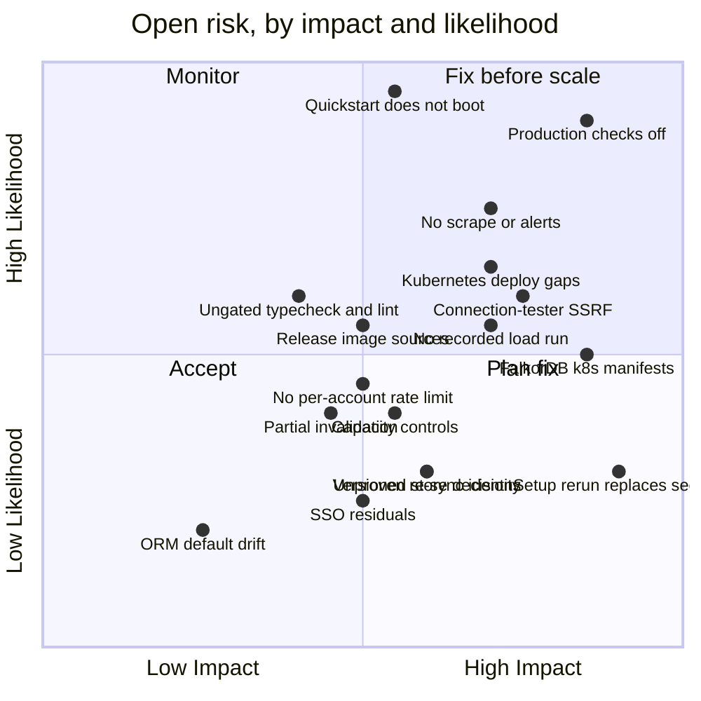

# Technical Debt & Risk Assessment

> **Audience:** Developers and architects assessing risk. New users should start with [OVERVIEW.md](OVERVIEW.md) and [SETUP.md](SETUP.md).

A live register of what is actually wrong with the {brand} platform today.

**Verified against `42cae50` on 2026-10-09.** Every open item below carries a
file and line you can re-check in under a minute. That is the point, and it is
how this revision caught the last one out. Verified on 2026-08-25, by October it
was recommending event-based ontology invalidation that the code already does,
calling feature flags uncached when they carry a 30-second cache, and telling
operators that a Redis outage fails readiness when the probe only catches a
misconfigured boot. The revision before that asserted the repository had no CI
pipeline and six test files. A register that is wrong is worse than no register,
because it moves effort to the wrong place and it lends stale claims the
authority of a document.

**How to read it**

- §1–§3 are the open risks, ordered by what to do about them rather than by
  subsystem. Each carries **evidence** — the file and line that makes the claim
  checkable — and a **recommendation** that says what to do first, not
  everything that could be done.
- §4 is the failure mode this codebase has demonstrably had, which is not on
  any list of missing things, and the instances of it this pass found.
- §5 is the sequence.
- **Appendix A** is what has been resolved, kept short and with evidence. It is
  history, not work.

Limits that are documented where they live are not repeated here unless they put
the platform as a whole at risk: the versioned store's edges are in
[Versioning: Scale, Limits & Roadmap](versioning/09-scale-limits-and-roadmap.md),
the gaps behind a large deployment in
[Scaling for Concurrent Users](SCALING_CONCURRENT_USERS.md) §11, and each
feature's own limitations in the [Changelog](../CHANGELOG.md).

**How to keep it true.** Every open item's evidence line is a claim about the
tree. When you close one, delete it — git holds the history, and a resolved
entry left in place is how the previous revision came to contradict its own
summary. Re-verify the whole register at each release cut; §6 describes a check
that can do most of it mechanically.

---

## Risk matrix

Open items only. Anything resolved has left this chart.

```mermaid
quadrantChart
    title Open risk, by impact and likelihood
    x-axis Low Impact --> High Impact
    y-axis Low Likelihood --> High Likelihood
    quadrant-1 Fix before scale
    quadrant-2 Monitor
    quadrant-3 Accept
    quadrant-4 Plan fix
    Production checks off: [0.85, 0.9]
    Connection-tester SSRF: [0.75, 0.6]
    FalkorDB k8s manifests: [0.85, 0.5]
    No scrape or alerts: [0.7, 0.75]
    Kubernetes deploy gaps: [0.7, 0.65]
    Setup rerun replaces secrets: [0.9, 0.3]
    No recorded load run: [0.7, 0.55]
    Quickstart does not boot: [0.55, 0.95]
    No per-account rate limit: [0.5, 0.45]
    Partial invalidation: [0.45, 0.4]
    Release image sources: [0.5, 0.55]
    Ungated typecheck and lint: [0.4, 0.6]
    Capacity controls: [0.55, 0.4]
    Versioned store decisions: [0.6, 0.3]
    Unproven re-sync identity: [0.6, 0.3]
    SSO residuals: [0.5, 0.25]
    ORM default drift: [0.25, 0.2]
```

---

## 1. High — fix before the next scale step

### 1.1 Production safeguards are off unless an operator sets `ENV` by hand

**Evidence:** `_is_production()` reads `ENV`, defaulting to `dev`
(`backend/app/main.py:175`). Nothing this repository ships sets it — no
Kubernetes base or overlay, no Helm value, no compose file, no Dockerfile, not
`.env.prod.example`. Every check behind it therefore runs in its development
mode, which is a log warning:

- refusing an access-token lifetime above 15 minutes (`backend/app/main.py:293`)
  — and the Helm chart ships 60 (`deploy/helm/dataviz/values.yaml:46`);
- requiring shared replay caches for back-channel, SAML and profile assertions
  (`backend/app/main.py:792`, `:813`, `:835`);
- turning off `/docs`, `/redoc` and `/openapi.json` (`backend/app/main.py:1926`);
- failing readiness when session revocation is process-local
  (`backend/app/main.py:3216`);
- refusing to store a credential in plaintext when `CREDENTIAL_ENCRYPTION_KEY`
  is unset (`backend/app/db/repositories/connection_repo.py:35`);
- refusing to start the control plane without `AGGREGATION_INTERNAL_TOKEN`,
  without which every `:8091` route — trigger, cancel, delete, purge, settings —
  is open to anything that can reach the port
  (`backend/app/services/aggregation/internal_auth.py:78`). The Kubernetes path
  mints that token (`deploy/k8s/deploy.sh:220`); compose, Helm and
  `.env.prod.example` do not set it.

This is §4's failure mode at platform scale. The checks exist; seven test files
set `ENV=production` to prove them (`backend/tests/test_startup_security_guards.py`
and `test_controlplane_internal_auth.py` among them); `DEPLOYMENT.md`,
`BACKEND.md` and the pentest scope all describe what happens "in production".
The test suite turns production mode on. No deployment built from this
repository does. `BACKEND.md` says every shipped config sets a 15-minute token;
the Helm chart sets 60, and nothing refuses it.

**Recommendation — make production the mode you cannot forget.** Set
`ENV: production` in the production overlays and in the Helm chart, and log the
mode at startup where the first page of logs shows it. Then consider inverting
the default in the deployable images, so that relaxing the checks is the
deliberate act rather than enabling them. Expect the first boot with it set to
fail — Helm's 60-minute token will — and treat that as the check working.

### 1.2 SSRF via provider connection-testing

**Evidence:** `backend/app/api/v1/endpoints/providers.py:325`
(`POST /test-connection`) builds a provider from the submitted host and port
(`:141`) and probes it (`:353`) with no address check in between. The sockets
open in `backend/common/interfaces/preflight.py` — `:76` for Neo4j and Spanner,
`:232` (AUTH and PING) for FalkorDB, and an HTTP `HEAD` at `:350` for DataHub.
The saved-provider paths share the same unchecked factory: `/{id}/test`
(`providers.py:480`), schema discovery (`:625`), warm-up
(`backend/app/providers/warmup.py:729`) and insights discovery
(`backend/insights_service/discovery.py:83`). A failed probe returns the raw
error text to the caller (`providers.py:195`). `assert_fetchable`
(`backend/auth_service/providers/outbound.py:248`) still serves only the SSO,
IdP and avatar fetches; its address classifier is private to that module.

The onboarding wizard tests an arbitrary `host:port` from inside the cluster.
A tenant can use it to probe internal services or the cloud metadata endpoint
(`169.254.169.254`), which is the address that turns request-forgery into
instance-credential theft — and returning the raw error makes the probe a port
scanner with a readable answer. It is admin-gated (`providers.py:328`), so this
is not an unauthenticated hole — but the whole value of this service's network
position is that it reaches things the caller's browser cannot, and "an admin
would not" is not an access control.
[ADR-018](DECISIONS.md#adr-018-retire-the-graph-service) records the gap as a
trade-off of retiring the graph service; this register still counts it as a
risk.

**Recommendation — reuse the classifier, do not write a second one.**
`outbound.py` already classifies addresses by *property* rather than by CIDR
list (loopback, link-local, multicast, reserved, unspecified) and unwraps
IPv4-mapped IPv6, so `::ffff:169.254.169.254` cannot slip past. What it does not
do is serve a non-HTTP caller: the connection tester takes a `host:port` for a
graph driver, not a URL.

1. Extract the address classification into a shared module (e.g.
   `backend/common/netguard.py`) that depends on nothing in `auth_service`.
2. Keep `assert_fetchable(url)` as the URL-shaped wrapper; the DataHub probe
   takes a URL and can call it directly.
3. Add `assert_connectable(host, port)` for the driver-shaped callers and call
   it in the provider factory, so all five paths above are covered by one call
   site, before any socket is opened.

Writing a second, independent allowlist is how the two drift, and this codebase
has been bitten by exactly that shape before — see §4.

### 1.3 FalkorDB on Kubernetes: two manifest defects nobody has checked

**Evidence — persistence:** the Kubernetes StatefulSet mounts the data volume at
`/data` (`deploy/k8s/base/infrastructure/falkordb/statefulset.yaml:118`) and its
`REDIS_ARGS` (`:64`) do not move the data directory there; the production-cluster
shards do the same (`deploy/k8s/overlays/production-cluster/resources/falkordb-cluster-statefulsets.yaml:209`).
Compose mounts `/var/lib/falkordb/data` and says why: that is where the image
keeps its data, and "mounting the volume at /data would capture nothing"
(`docker-compose.yml:98`). The Helm chart agrees with compose
(`deploy/helm/dataviz/templates/stores-falkordb.yaml:78`).

**Evidence — reachability:** ingress is default-deny for every pod
(`deploy/k8s/base/networking/network-policies.yaml:7`), and the rule that lets
the backends reach FalkorDB selects `app.kubernetes.io/name: falkordb` (`:125`).
The cluster shards are labelled `falkordb-shard-0` and so on
(`falkordb-cluster-statefulsets.yaml:25`), so nothing admits the backends — or
the shards' own cluster bus — to them.

If compose is right about the image, a FalkorDB pod restart on Kubernetes comes
back empty. For a versioned graph that is a full re-projection from Postgres,
hours at the 7.7M-entity scale; for a graph that is not under version control,
FalkorDB holds the only copy. If the dataplane enforces NetworkPolicy, the
production-cluster overlay cannot serve a single graph. Either way the backup in
Appendix A copies whatever the volume holds.
[Scaling for Concurrent Users](SCALING_CONCURRENT_USERS.md) §11 lists both with
"verify in your cluster"; nobody has recorded doing it.

**Recommendation — ten minutes on a cluster before anything else.** Write a key,
delete the pod, read the key; and from a backend pod, ping a shard. If either
fails, mount the volume where compose and Helm do (or pass `--dir /data`), add
the shard labels and the bus port to the allow rules, and re-check the backup
job against the corrected path.

### 1.4 Metrics are exported, but nothing scrapes them and nothing alerts

**Evidence:** `GET /api/v1/metrics` exists
(`backend/app/api/v1/endpoints/metrics.py:112`), behind `METRICS_ENABLED` and a
token, and is off by default. Nothing in `deploy/` sets `METRICS_ENABLED`, and
nothing ships a ServiceMonitor, scrape annotations, dashboards or alert rules —
[Scaling for Concurrent Users](SCALING_CONCURRENT_USERS.md) §8 says so in its
own warning. The series that should page first are not exported at all:
event-loop lag is JSON on `/health/deps` (`backend/app/main.py:3079`), pool
saturation is JSON at `/internal/metrics/db`
(`backend/app/middleware/db_metrics.py:109`), and Redis reachability is neither.
The wedge watchdog still only logs
(`backend/app/observability/event_loop_monitor.py:96`).

Resilience you cannot observe fails silently. Every control in this document
degrades quietly rather than loudly.

The previous revision said a Redis outage now fails readiness. It does not:
`/health/ready` returns 503 in production when the revocation backend *built at
boot* is process-local (`backend/app/main.py:3216`), which catches a
misconfiguration, not a live outage (`:3205`). A Redis that dies after boot is
visible only on `/health/deps`. Keeping a Redis round trip off the probe is the
right call — and it is exactly why this needs an alert. (And with `ENV` unset,
§1.1, readiness does not check even that much.)

**Recommendation — one alert before any dashboard.** The value is the first
alert that fires before a user notices. Two, in order:

1. **Event-loop lag on the `web` role.** Export it first: the gauge the
   monitor's own docstring names is not emitted (§4).
2. **Redis reachability.** Revocation, rate-limit counters and the SAML replay
   cache all resolve through it.

Then turn the exporter on in the overlays, ship the scrape config, and add the
rest: per-provider reachability, consumer-group lag, DB pool saturation, Redis
memory and eviction, worker fleet size.

### 1.5 Neither Kubernetes deploy path is complete

**Evidence — the kustomize manifests apply no migrations.** Schema changes
belong to the `synodic-upgrade` job: the API only verifies the schema is at head
(`backend/app/db/engine.py:631`) and the control plane only creates its own
`aggregation` schema (`backend/app/services/aggregation/db_init.py:40`). Compose
runs that job as a one-shot and the Helm chart as a pre-upgrade hook with a
`wait-for-schema` init container (`deploy/helm/dataviz/templates/_helpers.tpl:33`);
`deploy/k8s/` has neither. A release that carries a migration therefore leaves
every new API pod failing readiness with `schema_mismatch`
(`backend/app/main.py:3176`) until someone runs the upgrade by hand, and a fresh
install comes up degraded.

**Evidence — the Helm chart is behind the manifests.** It has no versioning
worker and sets no `GRAPHVER_*`. With `GRAPHVER_PROJECTION_INPROCESS` unset
(`backend/app/services/versioning/config.py:157`), the web process starts none
of the loops that worker hosts and logs that it has handed them off
(`backend/app/main.py:1583`), so on a Helm install the reconciling projection
loop, "Enable version control" jobs, the data-source purge and reaper, and
FalkorDB eviction never run: an enable request queues a job nothing picks up, and
a projection that falls behind never catches up. Its upgrade hook, and the
`wait-for-schema` init container every backend pod starts behind, run an image
nothing builds (§2.4). Beyond that, the chart ships a 60-minute token and no
control-plane token (§1.1), no autoscalers or disruption budgets, a control plane
fixed at one replica with `Recreate`
(`deploy/helm/dataviz/templates/aggregation-controlplane.yaml:10`, which ignores
`values.yaml:299`), and imports and exports running inside the API pods
(`GRAPHVER_TRANSFER_INPROCESS` defaults on, `config.py:288`).

**Recommendation.** Give the kustomize base the same upgrade Job and
`wait-for-schema` init container the chart has; until then, apply migrations by
hand with the new release's image (`python -m backend.scripts.upgrade upgrade`)
before rolling it out. Add the versioning worker to the chart — same image and
command as the Kubernetes base. Then decide what the chart is for: if it is the
evaluation path, say so in `NOTES.txt` and point production at the kustomize
overlays, as the scaling guide already does; if it is a production path, it
needs the parity list above.

### 1.6 Re-running `deploy.sh setup` replaces live secrets

**Evidence:** `cmd_setup` (`deploy/k8s/deploy.sh:97`) generates every secret
fresh (`:214`–`:220`) and writes `.env.deploy` (`:226`) without checking for an
existing one; `deploy` then applies the values over the live Secrets (`:318`).
Nothing in `deploy/` restarts pods on a Secret change — there is no checksum
annotation — so the damage lands at the next restart, not at deploy time.

A new `CREDENTIAL_ENCRYPTION_KEY` makes every stored provider and IdP credential
undecryptable; a new `POSTGRES_PASSWORD` no longer matches the database the
connection string points at; a new `JWT_SECRET_KEY` signs everyone out.
[Multi-Environment Sessions](MULTI_ENVIRONMENT_SESSIONS.md) §8 warns about the
last one only.

**Recommendation.** Refuse when `.env.deploy` exists unless forced, and when
forced, keep the existing values of every key that encrypts or authenticates
stored data. Regenerating the encryption key or the database password is never
what someone re-running setup wants.

### 1.7 No recorded system-level load or chaos pass

**Evidence:** the tooling now exists — a Locust harness with pass/fail criteria
written in code (`loadtest/lib/slo.py:57`), a protection gate, and an in-cluster
runner (`deploy/k8s/loadtest/`). What does not exist is a result:
`loadtest/.gitignore` excludes `results/`, no workflow runs the harness, and
[Concurrency and Timeout Tuning](CONCURRENCY_TUNING.md) still says none of its
numbers "has been measured against a real cluster under real load". There is no
chaos tooling at all.

Every decoupling change has been verified individually. The whole topology at
target scale has not: a cold start against the 7.7M-entity
`perf-load-test-layered-lineage` graph, concurrent load on a single tenant's
FalkorDB, and a request storm that must 429-shed rather than OOM.

**Recommendation.** Run it once and record the result where the next reader will
find it. The criteria are already written, which was the hard part — an
unbounded "see what happens" run produces a story, a run against a stated
threshold produces a decision, and a run kept only in an ignored directory
produces neither. With §1.4 done, the run also says where it bent, not just
whether it survived.

---

## 2. Medium — plan these

### 2.1 The zero-config quickstart does not boot

**Evidence:** `docker-compose.quickstart.yml:56` points the API at SQLite, which
`backend/app/db/engine.py:130` refuses at import — there is no SQLite branch
(Appendix A) — and the image would lack the driver anyway: `aiosqlite` is in
`backend/requirements-test.txt` only. Behind that,
`docker-compose.quickstart.yml:80` sets a published signing key that the
placeholder denylist refuses
(`backend/auth_service/core/config.py:81`); the compose file says so in its own
comment.

The README offers this path as the quick look and QUICKSTART.md calls it the
recommended one; both now carry a warning that it does not boot. It is the first
thing a newcomer runs.

**Recommendation.** Decide whether the path should exist. If it should: an
entrypoint that mints an ephemeral signing key at container start (the fix the
compose comment already names) and a small Postgres seeded from a dump in place
of the baked SQLite file. If it should not, delete it and the two sections that
recommend it — a broken front door is worse than none.

### 2.2 No per-account rate limit on graph endpoints

**Evidence:** `limiter.limit` appears only on the user and auth routes
(`backend/app/api/v1/endpoints/users.py:380`, `.../auth.py:426`,
`backend/auth_service/api/router.py`). Graph reads have two other controls,
neither of which is this one:

- a per-**workspace** token bucket (`_enforce_fair_share`,
  `backend/app/api/v1/endpoints/graph.py:961`), off by default
  (`backend/app/services/fair_share.py:111`) and open when Redis errors
  (`:214`);
- concurrency admission per data source and a fleet-wide slot per graph
  (`backend/app/providers/manager.py:1127`, `:1243`), which protect the provider
  and shed with `429 ProviderBusy` whoever is asking.

So one account can still take a workspace's whole share of a FalkorDB, and the
scaling guide says plainly there is no per-user API rate limit.

**Recommendation.** Apply `slowapi` limits keyed on the **account**, not the
address. Address keying is near-useless behind a corporate NAT or an ingress —
every user shares one address, so a cap tight enough to stop an attacker stops
an office instead. The auth surface already learned this; see
`SSO_INTEGRATION.md §10.2`, which documents the per-address / per-account split
and why `/refresh` keys on the rotation family. And either turn the workspace
bucket on in the production overlays or delete it: a control that is off
everywhere is §4's shape.

### 2.3 Cross-process invalidation reaches three processes out of five

**Evidence:** a provider edit is broadcast on Redis
(`backend/app/providers/invalidation_bus.py:31`,
`backend/app/providers/manager.py:1594`), and the web process, the aggregation
worker and the versioning worker drop their copies (`backend/app/main.py:1451`,
`backend/app/services/aggregation/__main__.py:838`,
`backend/app/services/versioning/__main__.py:122`). Two processes do not listen.
The stats service still reads through the deprecated `ProviderRegistry`
(`backend/insights_service/collector.py:84`,
`backend/insights_service/cache_warmer.py:44`), whose cache has no TTL at all
(`backend/app/registry/provider_registry.py:53`), and the control plane builds
its own `ProviderManager` with no listener
(`backend/app/services/aggregation/controlplane.py:104`). One API route reads the
legacy registry too (`backend/app/api/v1/endpoints/ontologies.py:1379`).

After a provider edit — a rotated password, a moved host — those keep the old
config until they restart. Feature flags are a smaller case of the same thing:
a 30-second per-process cache (`backend/app/services/feature_flags.py:25`)
whose `invalidate()` is local, so other pods see a change within 30 seconds.
That is acceptable, and is listed so nobody "fixes" it with a longer TTL.

**Recommendation.** Subscribe the stats service and the control plane to the
channel that already exists — three call sites, not a design. Then move the
stats service onto `ProviderManager`, which is the last thing keeping the legacy
registry alive (§3.3).

### 2.4 Release images have no single source

**Evidence:** CI pushes to Docker Hub (`.github/workflows/build-images.yml:3`),
but only from one long-lived branch, `v*` tags, or by hand (`:6`) — never from
`main`. The deploy targets disagree about where images live: the Kubernetes
Makefile builds for Artifact Registry (`deploy/k8s/Makefile:12`), the dev and
staging overlays pull from `gcr.io`, production from `us-docker.pkg.dev`, and
the Helm chart from `docker.io/synodic` (`deploy/helm/dataviz/values.yaml:4`),
under a comment saying no CI exists. `deploy/build-images.sh:25` still builds a
`graph-service` image from a Dockerfile that was deleted with that service, and
the Helm upgrade job — and the `wait-for-schema` init container on every backend
pod — runs a `synodic-upgrade` image
(`deploy/helm/dataviz/templates/upgrade-job.yaml:42`) that nothing builds.

**Recommendation.** One build that runs on `main` and pushes one set of names to
one registry, which every target then reads. It needs the operator answer the
previous revision asked for — which registry production pulls from — and then it
is a day of edits.

### 2.5 The frontend's typecheck and lint are not CI gates

**Evidence:** the frontend workflow gates on Vitest alone and says why
(`.github/workflows/frontend-tests.yml:16`): `tsc` and `npm run lint` both fail
on `main`. At `42cae50`, `tsc -b` reports 55 errors in 28 files (the workflow
comment says 79 in 32) and ESLint 714 errors and 303 warnings across 320 files,
mostly `no-explicit-any`, `react-hooks/set-state-in-effect` and
`react-refresh/only-export-components`.

**Recommendation.** Take `tsc` to zero first and gate it the day it gets there —
the count is already falling. Lint is the larger job, and the workflow comment is
right that its main rule cannot be satisfied without changing render behaviour,
so it needs its own change and its own review. Gate nothing with
`continue-on-error`: that is a comment with extra steps.

### 2.6 Capacity controls do not measure the real limit

**Evidence:** the ceiling is FalkorDB query threads on the shard that holds a
data source ([Scaling for Concurrent Users](SCALING_CONCURRENT_USERS.md) §1), and
nothing that scales or admits work measures it. Autoscaling is CPU and memory
(`deploy/k8s/base/services/viz-service/hpa.yaml:16`); per-source reserves are
per process (`backend/app/providers/manager.py:245`); a graph request holds its
Postgres session across the whole FalkorDB call (`graph.py:150`), now 45–80 s at
the per-query budgets the 2026-09-30 release raised; the versioned store's
engine ignores `DB_POOLER_MODE` (`backend/app/db/engine.py:226` reads it,
`backend/app/services/versioning/db.py` does not) while the production overlay
runs a transaction pooler; and there are no read replicas.

**Recommendation.** None of these is wrong on its own; together they mean the
platform scales the tier that is not the bottleneck. Settle it with the run in
§1.7, then decide which of them to change — the scaling guide's §11 has the
workaround for each in the meantime.

### 2.7 Versioned store: decisions that get harder with every row

Detailed in [Versioning: Scale, Limits & Roadmap](versioning/09-scale-limits-and-roadmap.md).
The three that are platform risks:

- **The partition key is immutable after data.** Every row of one graph hashes
  to the same one of 64 partitions on `graph_id`
  (`backend/app/services/versioning/models.py:43`), so the busiest graph gets no
  pruning. Deciding whether a composite key is needed gets more expensive with
  every row loaded.
- **No retention inside a live graph.** Superseded versions, committed working
  changes and Merkle buckets are kept forever. (A deleted data source is now
  purged after a 30-day undo window.)
- **FalkorDB caches are unbounded by default.** The eviction loop runs, but a
  budget of 0 skips (`backend/app/services/versioning/worker.py:145`), and no
  manifest, overlay, chart or compose file sets one.

**Recommendation.** Decide the partition key before the first large production
tenant — it is the only one of the three with a deadline.

### 2.8 Re-sync runs a bounded merge nobody has proven on a bootstrapped graph

**Evidence:** `sync_ingest` is the bounded merge
(`backend/app/services/versioning/service.py:5024`): it hash-discards unchanged
external rows, resolves identity per batch from the stored heads (`:5224`), and
streams deletions against the set of external ids. Its first version passed
every characterisation test and then deleted and re-created a whole
478,430-entity graph, because real graphs are written by the bootstrap worker,
which derives entity ids differently from the test fixtures
([Re-sync at Any Scale](versioning/11-resync-at-any-scale.md)).
`backend/tests/integration/test_resync_identity_invariant.py` was written to
catch that failure and says itself that it does not: the test that runs the real
bootstrap worker and re-syncs an unchanged source does not exist. So the path
every re-sync takes today is, by its own test file's standard, unverified — and
when identity is wrong the failure is mass deletion. Above
`GRAPHVER_RESYNC_MAX_ENTITIES` (250,000, `backend/app/services/versioning/config.py:353`)
a re-sync is refused with `422 graph_too_large_to_sync` (`service.py:4919`); the
guard limits the blast, not the risk. The method's own docstring still describes
the old whole-graph behaviour (`service.py:4996`).

**Recommendation.** Write the test the file describes — push a small graph,
bootstrap it with the real worker, re-sync the unchanged source, assert almost
nothing changes — before the next re-sync of a bootstrapped graph, not just
before anyone raises the guard. History is append-only, so restore-to-commit
would undo a bad re-sync; nobody should learn that in production.

### 2.9 SSO residuals, accepted but not closed

**Evidence:** an IdP's `email_domains` route people to it but are not checked
when it signs them in (`backend/app/db/repositories/idp_provider_repo.py:462`),
so a contractor IdP can assert a staff-domain address. Disabling or deleting an
IdP ends no sessions — that is the separate *End sessions* action
(`backend/app/api/v1/endpoints/admin_idp_providers.py:688`) — and there is no
receiver for OIDC back-channel logout. Revocation outside the fail-closed
permission set fails open while Redis is down, for up to one token lifetime
(`backend/app/auth/dependencies.py:60`): 15 minutes on most targets, 60 on
Helm (§1.1).

Each is documented as a known issue in the pentest scope
(`docs/security/PENTEST_SCOPE.md` §7) or in
[SSO Integration](SSO_INTEGRATION.md) §10. They are listed here because a known
issue with no owner is a decision nobody made.

**Recommendation.** Enforce `email_domains` at sign-in first — it is the one
that lets an outside party claim an inside identity. The rest are product
decisions; make them explicitly.

### 2.10 No API tokens or service accounts

**Evidence:** scripts sign in with a password and carry the session cookie and
CSRF header (`backend/scripts/publish_view_library.py:9`); there is no token
type for automation.

Every integration therefore holds a person's password, and revoking the
integration means changing that person's credentials.

**Recommendation.** Scoped, revocable tokens bound to a service account, checked
by the same permission resolver as a session. Not urgent until the first
customer automates against the API; then it is.

---

## 3. Low — track, or deliberately accept

### 3.1 ORM and migrations disagree on column defaults (enumerated, gated)

`0001_baseline` is `Base.metadata.create_all()` against the **live** ORM, so a
database has always had two possible origins — `create_all` on a fresh install,
the migration chain everywhere else — with nothing comparing the results. They
had drifted.

The structural half of that drift is fixed and gated: `synodic-upgrade
verify-schema` (`backend/scripts/upgrade.py:262`) runs in CI against all three
install routes (`.github/workflows/schema.yml`) and fails if the ORM declares a
table or column the database lacks. It found one — `context_models.visibility`,
declared in the ORM, added by no migration, therefore present only on databases
created after it entered the ORM — fixed by `20260731_1200_ctxmodel_vis`.

What remains is **column defaults**. Migrations write `server_default=`; the ORM
declares only a Python-side `default=`. So a migrated database has a real
`DEFAULT` and a fresh one does not, for the same column. The table below lists
44, from the last run against a migrated database; the `verify-schema` help text
says 41 (`backend/scripts/upgrade.py:276`). The next person to run it with
`--strict-defaults` should settle the number and the list together. One more is
likely: `aggregation.data_source_state.reconcile_converging_clears` gets a
`server_default` from `20260914_1000_converging_clears` and only a Python
default in the ORM (`backend/app/services/aggregation/models.py:372`), and it
shows only on databases migrated through that revision — none of CI's routes.

This is deliberately **not** failing CI. Every write through SQLAlchemy supplies
the value from the Python-side default, so the application behaves identically
either way; the difference is visible only to raw SQL that omits the column, and
to `alembic revision --autogenerate`, which will keep proposing these until they
are reconciled. `verify-schema` reports them as warnings and `--strict-defaults`
turns them into failures for anyone working through the list.

Fixing one means adding `server_default=` to the ORM column with the value the
migration used — mechanical, but each literal has to be checked against the
migration that set it, because a wrong one silently changes what a fresh install
writes.

Two further columns exist on migrated databases and in no ORM model at all —
`resource_grants.expires_at` and `views.display_rules` — leftovers from
migrations whose ORM counterpart was later removed. They are absent on fresh
installs, harmless on old ones, and dropping them is a deliberate act rather
than a CI job's decision. `verify-schema` lists them and does not fail.

The 44 default differences from the last run

| Column | Default on migrated databases | Direction |
|---|---|---|
| `aggregation.aggregation_jobs.last_sequence` | `0` | migration set one, ORM does not |
| `aggregation.job_event_log.id` | `—` | ORM declares one, database has none |
| `public.access_requests.status` | `'pending'::text` | migration set one, ORM does not |
| `public.app_auth_config.allow_jit_provisioning` | `true` | migration set one, ORM does not |
| `public.app_auth_config.allow_local_login` | `true` | migration set one, ORM does not |
| `public.app_auth_config.email_first_login` | `false` | migration set one, ORM does not |
| `public.app_auth_config.id` | `'singleton'::text` | migration set one, ORM does not |
| `public.app_auth_config.sso_enabled` | `true` | migration set one, ORM does not |
| `public.app_auth_config.version` | `1` | migration set one, ORM does not |
| `public.application_branding.id` | `'singleton'::text` | migration set one, ORM does not |
| `public.application_branding.version` | `1` | migration set one, ORM does not |
| `public.asset_discovery_cache.asset_name` | `''::text` | migration set one, ORM does not |
| `public.asset_discovery_cache.payload` | `'{}'::text` | migration set one, ORM does not |
| `public.asset_discovery_cache.status` | `'fresh'::text` | migration set one, ORM does not |
| `public.auth_audit_log.payload` | `'{}'::text` | migration set one, ORM does not |
| `public.group_members.source` | `'local'::text` | migration set one, ORM does not |
| `public.groups.is_protected` | `false` | migration set one, ORM does not |
| `public.groups.source` | `'local'::text` | migration set one, ORM does not |
| `public.idp_group_role_mappings.target_type` | `'role_binding'::text` | migration set one, ORM does not |
| `public.idp_providers.claim_mapping` | `'{}'::text` | migration set one, ORM does not |
| `public.idp_providers.enabled` | `true` | migration set one, ORM does not |
| `public.idp_providers.linking_policy` | `'strict'::text` | migration set one, ORM does not |
| `public.idp_providers.priority` | `100` | migration set one, ORM does not |
| `public.idp_providers.settings` | `'{}'::text` | migration set one, ORM does not |
| `public.invites.group_ids` | `'[]'::text` | migration set one, ORM does not |
| `public.invites.shareable_groups_override` | `false` | migration set one, ORM does not |
| `public.invites.token_version` | `1` | migration set one, ORM does not |
| `public.invites.use_count` | `0` | migration set one, ORM does not |
| `public.provider_admission_config.bucket_capacity` | `8` | migration set one, ORM does not |
| `public.provider_admission_config.circuit_fail_max` | `5` | migration set one, ORM does not |
| `public.provider_admission_config.circuit_window_secs` | `30` | migration set one, ORM does not |
| `public.provider_admission_config.half_open_after_secs` | `60` | migration set one, ORM does not |
| `public.provider_admission_config.refill_per_sec` | `2` | migration set one, ORM does not |
| `public.provider_health_window.consecutive_failures` | `0` | migration set one, ORM does not |
| `public.provider_health_window.failure_count` | `0` | migration set one, ORM does not |
| `public.provider_health_window.success_count` | `0` | migration set one, ORM does not |
| `public.role_bindings.source` | `'local'::text` | migration set one, ORM does not |
| `public.roles.is_system` | `false` | migration set one, ORM does not |
| `public.roles.scope_type` | `'global'::text` | migration set one, ORM does not |
| `public.user_identities.metadata` | `'{}'::text` | migration set one, ORM does not |
| `public.users.signup_source` | `'local_signup'::text` | migration set one, ORM does not |
| `public.view_layout_overlays.fork_base_layout` | `'{}'::text` | migration set one, ORM does not |
| `public.view_layout_overlays.reference_layout` | `'{}'::text` | migration set one, ORM does not |
| `public.workspace_data_sources.write_back_enabled` | `false` | migration set one, ORM does not |

### 3.2 `stats` is not a real `SynodicRole`

**Evidence:** `backend/app/runtime/role.py:21` — the enum holds `WEB`, `WORKER`,
`CONTROLPLANE`, `DEV`. Compose and Helm set `SYNODIC_ROLE=stats`
(`docker-compose.yml:646`), which falls through to `dev`; the Kubernetes base
sets nothing for the stats service, which lands in the same place. The Redis
role guard returns early for `dev` (`backend/app/providers/manager.py:320`), so
it is skipped for the stats service on every target. The structural
`build_cache_client` fix still prevents FalkorDB co-location, so this is a
missing assertion rather than a live misconfiguration.

**Recommendation.** Add a `STATS` member so the guard covers it, and set the role
in the Kubernetes base, which today sets none.

### 3.3 The legacy connection path is dead code

**Evidence:** graph routes are mounted only under `/{ws_id}/graph`
(`backend/app/api/v1/api.py:391`), so the `connectionId` branch in
`backend/app/api/v1/endpoints/graph.py:178` cannot run — and if it did, it would
hand a connection ID to code that expects a workspace ID (`:179`). Six routes
still declare `connectionId` (`graph.py:120`, `:146`, `:2595`, `:3071`, `:3104`,
`:3186`), four of them without using it. `GraphConnectionORM`
(`backend/app/db/models.py:38`) and two foreign keys to it remain;
`_migrate_connection_to_workspace` is gone. What still runs is the second
registry: `ProviderRegistry`, deprecated at
`backend/app/registry/provider_registry.py:431`, serves the stats service and
one ontology route (§2.3).

The previous revision's plan — count legacy hits for two weeks, then decide —
is moot. Nothing can reach the path to be counted.

**Recommendation.** Delete the branch, the `connectionId` parameters and the
frontend fallback (`frontend/src/providers/RemoteGraphProvider.ts:277`). Retire
the table with a migration once nothing reads it. Move the stats service to
`ProviderManager` (§2.3) and the registry goes with it.

### 3.4 Provider implementations live in two trees, and DataHub is a stub

**Evidence:** `backend/app/providers/` holds FalkorDB with the manager and the
versioned and draft-overlay wrappers; `backend/graph/adapters/` holds Neo4j,
DataHub and Spanner. `ARCHITECTURE.md` documents the split. Dispatch knows
`falkordb`, `neo4j`, `datahub` and `spanner`
(`backend/app/providers/manager.py:1722`); the capability registry also lists a
`mock` type that nothing can instantiate
(`backend/common/interfaces/provider.py:75`). DataHub is a connectivity adapter:
20 of its methods raise `NotImplementedError`
(`backend/graph/adapters/datahub_provider.py:4`), while the in-app FAQ presents
it as a supported graph provider.

**Recommendation.** Say what DataHub is wherever it is offered — the provider
picker and the FAQ — or finish its reads. Move the files only when a change is
already touching both trees.

### 3.5 No optimistic updates in the trace UI

Trace operations wait for the backend before updating
(`frontend/src/hooks/useUnifiedTrace.ts:338`–`:399`). This is perceived latency,
not correctness. Listed so it is not rediscovered as a bug.

---

## 4. The failure mode this codebase actually has

Most items in §2 and §3 are about something **absent** — no rate limit, no
retention, no shared invalidation. Absent things are easy to see, which is why
they end up on lists like this one.

The dangerous class is different: **a control that is present, documented, and
inert.** The security review merged as `dd17354` found seven of them. Among
them: a replay cache that was constructed and then never consulted; a lifecycle
filter applied to the public provider catalog but not to the authentication path
it was protecting; a revocation probe written inline in one guard and therefore
missing from the sibling guard covering the most privileged routes; and a
stand-in backend that answered "not revoked" rather than refusing when it could
not know.

None of these would appear on an inventory of missing features. Each one read as
implemented — the class existed, the config existed, the documentation described
the behaviour — and each did nothing. A reader of `SSO_INTEGRATION.md` would
have concluded SAML replay was defended. It was not.

All seven are fixed, each with a test that fails when the control is removed
(`backend/tests/test_saml_replay_cache_wired.py` and
`test_draft_provider_not_live.py` are the two easiest to read). That is the
shape to copy: the fix is not the deliverable, the failing test is.

**This pass found the same shape again.** §1.1 is the largest instance yet: six
production safeguards, proven by tests and described in the docs, none of them
running in any shipped deployment. The smaller ones:

- `DEEP_SEARCH_RATE_LIMIT_PER_MIN` is read
  (`backend/app/services/deep_search/settings.py:134`) and enforced nowhere;
  `DEEP_SEARCH_SOFT_DEADLINE_MS` (`:103`) likewise.
- The event-loop monitor's docstring names an `event_loop_lag_seconds` gauge
  (`backend/app/observability/event_loop_monitor.py:20`), and a comment says lag
  is "exposed via metrics" (`backend/app/main.py:1499`). Neither is true (§1.4).
- The per-workspace fair-share limiter is wired into five routes and turned on
  nowhere (§2.2).
- The provider capability flags `writable`, `is_external` and `full_crud`
  (`backend/common/interfaces/provider.py:51`) and a data source's
  `write_back_enabled` (`backend/app/db/models.py:711`) are read by nothing; only
  `supports_copy` decides anything.
- `falkor_eviction_configured()` has no callers, and the ephemeral time-travel
  pool's settings have no call sites
  ([Versioning: Scale, Limits & Roadmap](versioning/09-scale-limits-and-roadmap.md) §5).
- The Postgres property index ships a migration and a model, and nothing at
  runtime imports `backend/app/providers/property_index.py`.
- `backend/app/graphql/types.py` defines a GraphQL schema that nothing imports
  or mounts, for a library that is not installed.
- And this register: its previous revision said a Redis outage fails readiness.

**Recommendation — a recurring "assert the assertion" pass.** Once a release,
take five controls the documentation claims and prove each one by breaking it:
remove the control, watch a test fail, restore it. A control with no test that
fails when it is removed is indistinguishable from a control that is not there.
This is worth more than any single entry in §1–§3, because it is the only
practice on this page that finds the defects nobody is looking for. Add one
question to it now: *does this control run in the deployment we ship?* §1.1
would have failed it.

It is also cheap. The seven were each found by running the code rather than
reading it, and each took minutes once the question was asked. For the list
above, the fix is a decision per item — wire it or delete it — before anyone
relies on it.

---

## 5. Sequence

Not a Gantt chart. The revision before last carried one with fixed 2026-03 dates
that expired without anyone noticing, which is its own small lesson about plans
that encode calendar time rather than order.

| Order | Item | Why here |
|---|---|---|
| 1 | §1.3 FalkorDB restart and reachability check | Ten minutes; if it fails, every Kubernetes deployment loses its graph store on restart |
| 2 | §1.1 set `ENV` in the shipped configs | A line per target, and six safeguards start working |
| 3 | §1.6 make `setup` refuse to overwrite | Small, and the failure it prevents is unrecoverable without a backup |
| 4 | §1.2 connection-tester SSRF | Live security exposure, small fix, mechanism already written |
| 5 | §2.8 the bootstrapped-graph re-sync test | Before the next re-sync of a bootstrapped graph: the failure it rules out is mass deletion |
| 6 | §1.4 export the two alert series, then scrape and alert | Makes §1.7 say where it bent, not only whether |
| 7 | §1.5 a migration step for kustomize, the versioning worker for Helm | Small; until then every migration is a manual step on one path and versioning half-works on the other |
| 8 | §2.1 quickstart: fix or delete | Small; it is the front door |
| 9 | §1.7 load and chaos run, recorded | Needs 6 to be worth reading; settles §2.6 |
| 10 | §2.3 invalidation listeners, then §3.3 | Three call sites; then the legacy registry can go |
| 11 | §2.4 one image build on `main` | Needs the operator's registry answer first |
| 12 | §2.7 partition-key decision | The one item with a deadline: the first large tenant |
| 13 | §2.2, §2.5, §2.6, §2.9, §2.10, §3.x | Individually cheap or not yet urgent |

Running alongside, not in the queue: §4. It is a habit rather than a task.

---

## 6. Keeping this document honest

Most of the staleness that made earlier revisions misleading was in claims a
script could have checked: "no `.github/workflows/` directory exists", "only 6
test files", "no frontend tests found", "SQLite is the default", "no error
boundaries" — and, this time, "`_ONTOLOGY_CACHE_TTL = 300`" offered as the whole
story when a generation counter had been added beside it. Each stayed in the
document because keeping a register current is a discipline and disciplines
lapse. Of the fifteen items the previous revision carried, four had closed,
four had changed shape, and seven still stood as written; eleven of the
seventeen items now in §1 and §2 were not on it at all.

**Recommendation.** Add a test that asserts each open item's premise still holds
and fails when one no longer does — a `test_technical_debt_register.py` that,
for example, asserts `graph.py` still has no account-keyed limiter and fails the
day someone adds one without updating this file. A failing test that says "§2.2
is fixed, delete it" is the cheapest possible maintenance. It has not been
written yet; this revision is the argument for it.

This is the same trick `backend/tests/test_sso_kind_matrix.py` plays on the SSO
provider registry, and it is why a provider kind cannot be half-registered
there.

---

## Appendix A — Resolved

History, not work. Kept short and with evidence so a claim here can be checked
as easily as one above, and so nothing in this list has to be re-litigated from
memory. Delete an entry when it stops being interesting.

| Was | Now | Evidence |
|---|---|---|
| **JWT in `localStorage` (CRITICAL)** | Sessions ride HttpOnly cookies (`nx_access` / `nx_refresh`); no token is in web storage. Every remaining `localStorage`/`sessionStorage` call site holds UI state — layout widths, dismissals, wizard drafts, recent searches, the feature-flag cache, and a sessionStorage-only user DTO cache wiped on logout. The full recommendation shipped: HttpOnly cookies, `X-CSRF-Token` double-submit, and `credentials: 'include'` on every call. | `backend/auth_service/cookies.py:6`; `frontend/src/services/fetchWithTimeout.ts` |
| **Credential encryption optional (HIGH)** | `require_encryption_or_plaintext_ok()` raises on the write path when `CREDENTIAL_ENCRYPTION_KEY` is unset and `ENV` is `prod`/`production`, for both `graph_connections` and `idp_providers`. Dev and test behaviour unchanged, with a warning logged. **But** no shipped config sets `ENV` (§1.1), so the guard is dormant until one does. **Still outstanding:** an audit script to find plaintext credentials in a database predating the guard. | `backend/app/db/repositories/connection_repo.py:35` |
| **Weak default admin password (HIGH)** | The bootstrap still accepts a default, but the account cannot use it: a password published in this repo (`changeme`, `admin123`, `REPLACE_ME`) creates the user with `must_change_password=True`, enforced on every route outside the change-password paths, and the seeded admin is marked a system (break-glass) account. Admin → Users badges any account still in that state; `backend/scripts/reset_admin_password.py` recovers a locked-out sole admin. **Still outstanding (low):** generate a random password on first run and print it to stdout only, so a published string never lands in a `password_hash` column at all. | `backend/app/main.py:604`, `:610` |
| **CORS wildcard on Graph Service (HIGH)** | The standalone `graph-service` no longer exists ([ADR-018](DECISIONS.md#adr-018-retire-the-graph-service)). Connectivity testing runs in-process under `CORS_ALLOWED_ORIGINS`, whose default is localhost only. | `backend/app/main.py:2820` |
| **SQLite as default database (CRITICAL)** | There is no SQLite branch. Anything that is not an asyncpg Postgres URL is rejected at import time — which is also why the quickstart no longer boots (§2.1). | `backend/app/db/engine.py:130` |
| **No schema versioning (CRITICAL)** | Alembic is the source of schema truth, applied by a dedicated `synodic-upgrade` service under a `pg_advisory_lock`. The API process only verifies `alembic_version` is at head; it never mutates schema. | `backend/alembic/versions/`; [DATA_ARCHITECTURE.md §8](DATA_ARCHITECTURE.md) |
| **No CI/CD pipeline (HIGH)** | Nine workflows. Seven check every pull request: `backend-tests`, `frontend-tests` (Vitest only, §2.5), `codeql`, `security-scan`, `alembic-guards`, `schema`, `dependency-review`. `build-images` publishes (§2.4) and `dependabot-auto-merge` automates. | `.github/workflows/` |
| **Sparse test coverage / no frontend tests (HIGH)** | 641 backend test files and 699 frontend ones. | `backend/tests/`, `frontend/src/**/*.test.*` |
| **No integration tests (MEDIUM)** | 118 files. | `backend/tests/integration/` |
| **No React error boundaries (MEDIUM)** | Route-level and panel-level boundaries, wired into the router, the app shell and the canvas. | `frontend/src/components/RouteErrorBoundary.tsx`, `.../PanelErrorBoundary.tsx`, `.../ErrorBoundary.tsx` |
| **Outbox consumer missing (HIGH)** | The relay drains `outbox_events` into `auth_audit_log` on the CONTROLPLANE/DEV process, flipping `processed` in the same transaction. Idempotent via a UNIQUE `source_event_id`, so a crash mid-write cannot double-record. | `backend/app/services/outbox_relay.py` |
| **In-cluster single-replica data tier (CRITICAL)** | The production overlay replaces the in-cluster Postgres and Redis StatefulSets with Cloud SQL and Memorystore, with streams and cache as separate instances. FalkorDB stays self-managed by design. | `deploy/k8s/overlays/production/patches/managed-data-tier.yaml` |
| **FalkorDB durability and recovery (HIGH)** | Backup CronJob plus a written restore procedure covering snapshot restore, reseed from Cloud SQL, and region loss. *Rehearsing* it is still an operational exercise, not a documentation gap — and §1.3 asks whether the Kubernetes volume it backs up holds the data at all. | [FALKORDB_DR_RUNBOOK.md](FALKORDB_DR_RUNBOOK.md); `deploy/k8s/overlays/production/resources/falkordb-dr-backup.yaml` |
| **Container image-naming drift (CRITICAL)** | Every image reference aligned across base, overlays and the Makefile; the production `newTag` fixed. Where the images are built and pulled from is still open: §2.4. | commits `d8fa3953`, `1ef7bc9c` |
| **Missing edges on initial load (HIGH)** | `useGraphHydration` implements the phase-tracked load (`idle → roots → edges → children → complete`) and is wired into the canvas entry points. | `frontend/src/hooks/useGraphHydration.ts` |
| **Versioning merge field-loss (HIGH)** | `update` is a field-level patch rather than a wholesale replace, so a partial edit no longer truncates the entity at publish. Draft lineage renders through a sparse read-overlay. Change control shipped: in-app revert and restore, the version-control master switch, and a resumable enable-VC bootstrap verified on a 7.7M-entity graph. **Residual (low):** an unreproduced `properties` leak on some nodes that may predate the corrupting commit — reproduce before fixing. | commits `4dd7df4`, `84a467f`; [VERSIONING_DRAFTS_LINEAGE_AND_MERGE.md](VERSIONING_DRAFTS_LINEAGE_AND_MERGE.md) |
| **No structured logging / no health checks (MEDIUM)** | `StructuredLoggingMiddleware` emits JSON access logs with `X-Process-Time`; `/health` and `/health/ready` exist. | `backend/app/main.py` |
| **Growing inline migrations (MEDIUM)** | Superseded by Alembic; `init_db()` no longer carries raw SQL. | see above |
| **Pagination has no maximum (LOW)** | Capped everywhere. `audit.py` at 500, `freshness.py` at 200 and 2000, and all nine graph endpoints carry an `le=` bound — the last eight closed by `dd17354`. | `backend/app/api/v1/endpoints/audit.py:444`; `.../graph.py` |
| **`DATA_ARCHITECTURE.md` §6 stale reference (LOW)** | Corrected to `backend/insights_service/`. | — |
| **Ontology cache staleness (MEDIUM)** | A Redis generation counter, `ontgen:{ws}:{ds}`, is bumped by every mutation that can change resolution and invalidates every pod on its next lookup; the 300 s TTL is now a backstop. | `backend/app/services/resolved_ontology_cache.py:15` |
| **Stats poller: no service boundary, no graceful shutdown (MEDIUM)** | Its own service on every target, with SIGTERM/SIGINT handlers and a 60 s drain; stale stats surface as `lagging` or `unreachable` on `/health`. **Residual:** the compose service sets no `stop_grace_period`, so Docker kills it at 10 s, before the drain can finish. | `backend/insights_service/__main__.py:263`; `backend/app/services/stats_cache.py:133` |
| **Feature flags read from the database per request (LOW)** | A 30 s per-process cache. Cross-process notice is part of §2.3. | `backend/app/services/feature_flags.py:25` |
| **Control-plane scheduler doubles graph reads under HA (LOW)** | The scheduler no longer reads graphs; drift probes and the reconcile sweep moved to single-flight owners (a Redis claim and a Postgres advisory lock). **Residual:** with two replicas, a retry may be counted twice. | `backend/app/services/aggregation/scheduler.py:4`; `.../reconcile_sweeper.py:906` |

---

## Related

- [Architecture](/docs/architecture) — the security controls and deployment model these risks apply to
- [Data Architecture](/docs/data-architecture) — credential encryption, migrations, and outbox details
- [Decisions](/docs/decisions) — ADRs that resolved several items here (Alembic, Redis roles, graph-service retirement)
- [Scaling for Concurrent Users](/docs/scaling-concurrent-users) — §11 lists the operational gaps behind §1.3, §1.5 and §2.6
- [Versioning: Scale, Limits & Roadmap](/docs/versioning-scale-and-roadmap) — the versioned store's own limits, behind §2.7 and §2.8
- [SSO Integration](/docs/sso-integration) §10 — the auth surface's own threat model and its stated residuals
- [Overview](/docs/overview) — platform vision, maturity assessment, and roadmap
