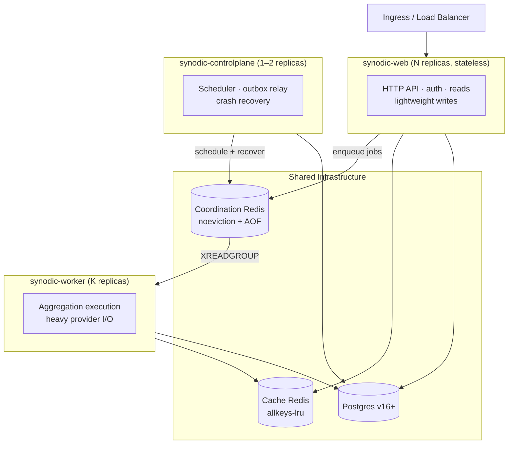

# Architecture when scaling — the three-tier split, and what is still open

> **Status (2026-10-09): the three-tier split is deployed.** Every shipped
> deployment runs web, worker and control-plane processes as separate
> services, plus a versioning worker and a stats service: Compose, the
> Kubernetes manifests (with autoscaling, and a two-replica control plane in
> the production overlay), and the Helm chart, which lags the manifests
> ([TECHNICAL_DEBT.md](TECHNICAL_DEBT.md) §1.5). This document began as the
> deferred plan for that split — "Phase 6" of the schema-optimization plan —
> and is now its design record plus the end-state items that have not
> happened. [Scaling for Concurrent Users](SCALING_CONCURRENT_USERS.md) is the
> operating guide for what runs today.

**Who it's for:** platform engineers changing the deployment topology. Read
[What is deployed](#what-is-deployed) and [What is still open](#what-is-still-open)
first; the sections after them are the original design, corrected where the
build went another way.

**What you'll find here:** the deployed tiers, the open end-state items, the
three-tier design, the Redis split, the stateless-web mandate, connection and
migration handling, operator-visible changes, and a verification checklist.

## What is deployed

| Kubernetes deployment | `SYNODIC_ROLE` | Base | Production overlay |
|---|---|---|---|
| `viz-service` | `web` | 2 replicas; HPA 2–8 on CPU and memory | 3 replicas; HPA 3–12 |
| `aggregation-worker` | `worker` | 2 replicas; HPA 2–10 on CPU | 3 replicas; HPA 3–20 |
| `aggregation-controlplane` | `controlplane` | 1 replica | 2 replicas |
| `versioning-worker` | `worker` | 1 replica | 1 replica |
| `stats-service` | none set | 1 replica | 1 replica |
| `frontend` | — | 2 replicas; HPA 2–6 on CPU | 3 replicas; HPA 3–8 |

Compose runs the same services, one replica each. The `production-cluster`
overlay adds a sharded FalkorDB cluster. The single-process `dev` role is the
fallback when `SYNODIC_ROLE` is unset — uvicorn run on the host, for example —
not a deployment shape.

## What is still open

- **Autoscaling on the real limit.** The worker scales on CPU, not on stream
  lag, and nothing scales on FalkorDB query threads, which is the actual
  ceiling ([TECHNICAL_DEBT.md](TECHNICAL_DEBT.md) §2.6).
- **Metrics nobody scrapes.** The exporter exists as `GET /api/v1/metrics`, off
  by default; no deployment turns it on or ships scrape config and alerts
  (§1.4 of the register).
- **Migrations on the kustomize path.** Compose and Helm run the
  `synodic-upgrade` job; the kustomize manifests do not (§1.5).
- **The shared-state modules.** `SharedCache`, `DistributedLock` and the Redis
  client-usage lint below were never written; see
  [Code the design called for](#code-the-design-called-for).
- **Read replicas.** Every role still uses `MANAGEMENT_DB_URL`.
- **Per-tenant rate limiting.** A per-workspace token bucket exists and is off
  by default; there is no per-account limit (§2.2).

## The three tiers

Three deployment tiers, all from the same image, gated by env var. As designed:

| Tier | Replicas | Workers per replica | Roles |
|---|---|---|---|
| `synodic-web` | N (autoscale on CPU/RPS) | M (`UVICORN_WORKERS`, default 4) | HTTP API, auth, reads, lightweight writes |
| `synodic-worker` | K (designed to autoscale on Redis stream lag; deployed on CPU) | 1 process, `WORKER_CONCURRENCY` async tasks | Aggregation execution, heavy provider I/O |
| `synodic-controlplane` | 1 as designed; production runs 2 | 1 | Scheduler, outbox relay, crash recovery (Alembic moved to the `synodic-upgrade` job) |

Same code, different `SYNODIC_ROLE ∈ {web, worker, controlplane}` env var
gates which subsystems start in `lifespan()`.

> **Note:** This is the shape that runs today, with two differences: the worker autoscales on CPU rather than stream lag, and the production control plane runs two replicas whose loops are each single-flight, rather than one replica under `Recreate`. Schema migrations run in the separate `synodic-upgrade` job.

## Infrastructure

- **Postgres v16+** — already enforced today.
- **Cache Redis (`REDIS_CACHE_*`, legacy `CACHE_REDIS_URL`)** — vanilla Redis with
  `maxmemory-policy=allkeys-lru`, persistence optional. Backs the
  shared cache abstraction that replaces the in-memory `_test_cache`,
  `_test_inflight`, and provider-registry caches.
- **Coordination Redis (`REDIS_STREAMS_*`, legacy `REDIS_URL`)** — vanilla Redis
  with `maxmemory-policy=noeviction` and AOF. Backs distributed locks,
  the aggregation Streams broker, rate-limit counters, and replica
  health gossip.

### Cache vs coordination — never combined

| Concern | Cache Redis | Coordination Redis |
|---|---|---|
| Eviction | `allkeys-lru` (TTL-aware) | `noeviction` (lock loss = correctness violation) |
| Persistence | None / RDB-only | AOF |
| Failure blast radius | Cache miss → cold reads from Postgres | Some 503s + per-process correctness fallback |
| Memory profile | Small | Small unless backlog grows |
| Latency target | <1ms | <2ms |

The eviction policies are *incompatible* — one Redis can't satisfy both
roles. A single instance with `allkeys-lru` could evict an aggregation
job's lock under cache pressure (correctness violation). With
`noeviction` the cache fills and starts returning OOM errors.

Graph providers (FalkorDB, Neo4j, DataHub) are external services
registered via the `providers` table — **never** part of platform
infrastructure. The platform makes no assumptions about which graph
backend operators run.

**Current state (2026-10).** The production overlay points the two roles at
separate Memorystore instances (`REDIS_STREAMS_HOST` and `REDIS_CACHE_HOST` in
`deploy/k8s/overlays/production/patches/managed-data-tier.yaml`). Elsewhere
Streams + Pub/Sub + Cache may share **one** instance with `maxmemory-policy
volatile-lru`, and that is correct: Streams carry no TTL so they are never
evicted, `MAXLEN` bounds them, and the high-volume cache (all TTL'd) is evicted
first — a cache flood cannot evict coordination data. The `allkeys-lru` vs
`noeviction` split above is the *end-state* for high scale, reached **deploy-only**
by pointing `CACHE_REDIS_URL` at a second instance. Triggers and steps:
[Redis Topology & Decoupling runbook](DATA_ARCHITECTURE.md#redis-topology--decoupling).

**Landed since this plan was written:** the three-tier deployment itself, the standalone worker tier (WS1.1), the
control-plane **state-sync consumer group** (ADR-017, replacing the per-replica
Pub/Sub listener), **control-plane internal auth** (ADR-019), and
**dedicated-Redis ↔ FalkorDB decoupling** (ADR-020) are implemented. The
`graph-service` was retired (ADR-018). The sections below describe the
remaining/steady-state design.

## Web tier — stateless mandate

Every module-level mutable state moves to Redis or is eliminated:

- `_test_cache`, `_test_inflight` in `backend/app/api/v1/endpoints/providers.py` → Redis-backed `SharedCache`.
- `_providers: dict` and negative cache in `backend/app/registry/provider_registry.py` → Redis-backed signal store; per-process driver pooling stays. (As built, the live path is `ProviderManager`, which keeps a per-process cache and drops entries on a Redis invalidation broadcast; the legacy registry survives for the stats service — [TECHNICAL_DEBT.md](TECHNICAL_DEBT.md) §2.3.)
- `InProcessDispatcher._active_tasks` → web tier always uses an outbox-based dispatcher; the actual aggregation runs in the worker tier.
- `AggregationScheduler` does NOT start in the web tier — control-plane only.
- `recover_interrupted_jobs()` runs in the control-plane only, batched ≤10 dispatches/sec to avoid flood-on-restart.
- `slowapi` rate limit storage moves to Redis (`limits.storage.RedisStorage`) — the in-memory backend silently *bypasses* rate limiting once you have N>1 replicas.

## Worker tier

- New deployment built from `backend/app/services/aggregation/__main__.py`.
- Reads jobs from the `aggregation.jobs` Redis Stream via `XREADGROUP` with consumer group `synodic-workers`. Acks (`XACK`) only after durable status update in Postgres.
- Per-DS lock (`lock:agg:ds:{ds_id}`) acquired before `worker.run()`, released in `finally`. TTL renewal background task on a 30s TTL with 5s renew cadence.
- Concurrency: `WORKER_CONCURRENCY` env (default 4) async tasks per worker. `K replicas × WORKER_CONCURRENCY` = total parallel aggregation throughput.
- Graceful shutdown: SIGTERM → stop pulling new jobs → wait up to 60s for in-flight to checkpoint → exit. K8s preStop hook + `terminationGracePeriodSeconds: 90`.

## Control-plane tier

- As designed, a single replica under `Recreate`. As built, the base and staging run one replica and production runs two, with no leader election: each loop is single-flight on its own — drift probes by a Redis claim, the reconcile sweep by a Postgres advisory lock — and the scheduler no longer touches a graph, so a second replica can at worst count a retry twice. The Helm chart pins one replica with `Recreate`.
- Roles enabled by `SYNODIC_ROLE=controlplane`:
  - `OutboxRelay` lifespan task — drains `outbox_events` → Redis Streams.
  - `AggregationScheduler` — the stale-marker reconciler (and, without a job-bus Redis, the stale-job watchdog). It makes no provider call: drift detection is the probe scheduler + reconcile sweeper.
  - `recover_interrupted_jobs()` — runs once at startup (rate-limited).
  - `provider_registry.start_polling()` — periodic provider health write-back.
- Reads/writes Postgres + Redis, and serves the internal `:8091` API that viz-service proxies aggregation calls to — job trigger, cancel, purge, settings — authenticated by `AGGREGATION_INTERNAL_TOKEN` (ADR-019).

## Code the design called for

- `backend/common/adapters/redis_endpoint.py` (shipped) — sole owner of Redis client construction, one resolver per role: CACHE (`REDIS_CACHE_*`) and STREAMS (`REDIS_STREAMS_*`).
- `backend/app/cache/shared.py` (not written) — `SharedCache` interface (`RedisSharedCache` for prod, `InProcessSharedCache` for `SYNODIC_ROLE=dev`).
- `backend/app/locks/distributed.py` (not written) — `DistributedLock` async context manager. `SET NX EX` + TTL renewal in a background task; releases via Lua script for atomic check-and-del. Falls back to `asyncio.Lock` in dev.
- `backend/app/runtime/role.py` (shipped) — `SynodicRole` enum + `current_role()` + `validate_redis_topology()`. `lifespan()` consults at every gate point.
- `backend/scripts/migration_runner.py` (superseded) — the `synodic-upgrade` service (`backend/scripts/upgrade.py`) took this role, as a Compose one-shot or a Helm hook Job.
- Static guarantee (not written): `scripts/check_redis_client_usage.py` CI lint. Walks the codebase, fails if any module imports `aioredis`/`redis` outside `runtime/redis_clients.py`. Makes accidental cross-wiring impossible to ship.

## Connection management

- Postgres pool (Phase 2.5 already shipped) — tier-specific defaults at deployment time:
  - Web: `DB_POOL_SIZE=20` per process, M=4 workers → 80 conn/replica.
  - Worker: `DB_POOL_SIZE=10`.
  - Control-plane: `DB_POOL_SIZE=5`.
- Postgres budget: deployment doc reconciles `(N×80 + K×10 + 5)` against `max_connections`. Pgbouncer in front for any N>3.
- Redis: several clients per process, pooled per role — `REDIS_CACHE_MAX_CONNECTIONS` / `REDIS_STREAMS_MAX_CONNECTIONS` (default 20 each).

## Migrations and startup

- Alembic `upgrade head` runs **only in the control-plane** lifespan, OR as a k8s `Job` ahead of the rollout. Web and worker tiers wait on a "schema ready" Redis key set by control-plane after migration completes; if not present after 60s, fail the readiness probe.

## Frontend / API contract

- Frontend already uses a single base URL (load balancer / ingress). No fetch logic changes needed.
- **Sticky sessions forbidden.** Any feature that assumes per-user in-memory state breaks. (None today, verified.)
- Long-lived connections (SSE for job progress, if added) must use Redis pub/sub on the backend so any web replica can fan events out from any worker.
- New `X-Synodic-Replica-Id` response header (uuid per process) — debugging aid surfaced in DevTools.

## Observability

- New `/internal/metrics` endpoint (Prometheus exposition format, admin-auth gated). Shipped instead as `GET /api/v1/metrics`, behind `METRICS_ENABLED` and a token and off by default; nothing scrapes it yet ([TECHNICAL_DEBT.md](TECHNICAL_DEBT.md) §1.4). Designed to expose:
  - DB pool stats per tier (today: JSON at `/internal/metrics/db`, from `backend/app/middleware/db_metrics.py`).
  - Redis stream lag (`XLEN` vs. consumer-group last-id) on `aggregation.jobs`.
  - Outbox backlog size.
  - Active aggregation jobs by status.
  - Per-tier role identifier for routing dashboards.
- K8s probes: `/health/live` (process responsive), `/health/ready` (DB + Redis reachable, Alembic head matches schema-ready key).

## Breaking changes (operator-visible)

Designed before the split shipped, and kept as the record of intent. Item 5 did not happen as written: the legacy registry still runs beside `ProviderManager` ([TECHNICAL_DEBT.md](TECHNICAL_DEBT.md) §3.3).

1. `MANAGEMENT_DB_URL` already enforced as `postgresql+asyncpg://` — no change.
2. The CACHE and STREAMS roles (`REDIS_CACHE_*`, `REDIS_STREAMS_*`) are configured independently; as shipped they may share one instance on `volatile-lru`, and splitting them is config-only.
3. `SYNODIC_ROLE` env var must be set on every deployment.
4. The aggregation in-process dispatcher is removed from the web image's runtime path. Calling `POST /aggregate/trigger` without a worker tier deployed yields 503 with a clear error.
5. Provider registry's in-process credential cache is replaced — direct callers of `provider_registry._providers[...]` would break (none expected outside the registry module).
6. `slowapi` rate limits previously per-process become global; high-traffic endpoints may need their per-second numbers bumped.

## Verification checklist

None of these has been run as a recorded test yet ([TECHNICAL_DEBT.md](TECHNICAL_DEBT.md) §1.7).

- `SYNODIC_ROLE=web` + 3 replicas behind nginx → POST `/aggregate/trigger` 100× concurrent: exactly 1 × 2xx, 99 × 409.
- Kill 1 of 3 web replicas mid-request → load balancer routes; no requests dropped.
- Run 2 worker replicas → 50 jobs queued in stream; both consume from `synodic-workers` group; no double-processing.
- Kill worker mid-aggregation → `XPENDING` shows unacked entry; restart picks it up via `XCLAIM`.
- Stop control-plane replica → scheduler stops, outbox stops draining; restart → resumes; web/worker tiers keep serving / consuming throughout.
- `redis-cli FLUSHALL` mid-load → web tier degrades gracefully (cache misses, dedup falls back to per-process); control-plane logs degraded; outbox backlog grows but no data loss in Postgres.
- Postgres failover → web tier sees ~5s of 5xx then recovers (`pool_pre_ping` catches dead conns); workers re-establish; outbox replays unprocessed events.
- `helm upgrade` of web tier → zero dropped requests; control-plane untouched; workers untouched.

## Open design questions (resolve when starting)

- **Broker swap path.** Phase 4's outbox dispatcher Protocol stays useful — RedisStreamHandler is the obvious first implementation, RabbitMQ/Kafka are mechanical swaps. Picking the broker is a deployment-team decision, not a platform-architecture one.
- **Per-tenant rate limiting.** The `slowapi` Redis backend gives global limits. Per-tenant limits require a different key derivation. Defer until it's a real ask.
- **Read replicas.** SQLAlchemy's `bind` mechanism supports per-table or per-query routing to a read replica. Useful when control-plane reporting queries start contending with web-tier writes. Not needed at first.

---

## Related

- [Architecture](/docs/architecture) — the system design these tiers run
- [Data Architecture](/docs/data-architecture) — the Redis Topology & Decoupling runbook for the deploy-only cache split
- [Decisions](/docs/decisions) — ADR-017/019/020, the decoupling work already landed toward this design
- [Services Overview](/docs/services-overview) — the `SYNODIC_ROLE` topology (WEB, WORKER, CONTROLPLANE, DEV)
- [Technical Debt](/docs/technical-debt) — the open deployment, observability and capacity items behind this page
