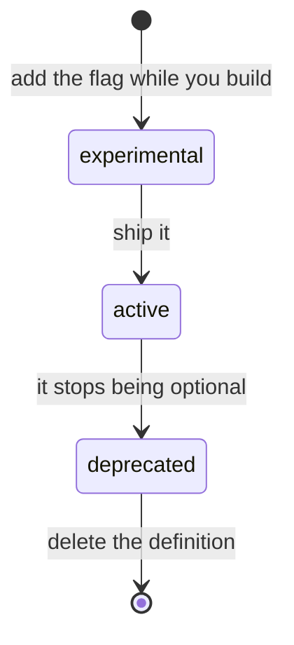

# Feature flags: adding one, and ending one

*For engineers adding, shipping or retiring a feature switch.*

After this page you can add a switch for a feature you are still building, ship it, and later remove it, without the build failing on you and without leaving a switch that lies to an administrator.

> **Before you start:** you need the repository and a Python environment with `pytest` ([Developer Setup](/docs/setup)). Administrators see the result on **Administration → Features**; [Feature Switches](/guide/feature-switches) is their side of this page.

Every switch on **Administration → Features** decides what every user of the deployment can and cannot do. That makes each one a permanent obligation: somebody has to understand it, it has to keep being true, and one day somebody has to be brave enough to delete it. This page is the contract for all three.

The rules below are not advice. **They are enforced by `backend/tests/test_feature_wiring.py`, which runs on every pull request to `main`** (the **Every feature flag is really wired** job in the Guards workflow, `.github/workflows/alembic-guards.yml`). If you break one, the build fails and tells you which. That is deliberate: the previous version of this page relied on people remembering, and eight of its twelve switches ended up doing nothing at all.

Run the guard yourself before you push. It parses files and needs nothing but `pytest`:

```bash
python -m pytest backend/tests/test_feature_wiring.py -q --noconftest
```

---

## The one idea

> **Code owns the facts and the words. The admin owns the value.**

| | Lives in | Editable at runtime? |
|---|---|---|
| Where it's enforced, what it hides, whether it's wired, its stage and posture | `backend/app/config/feature_wiring.py` | **No.** Editing it would not change what the server does. |
| Name, description, admin hint, impact copy, category, type, options, sort order | `backend/app/config/features_seed.py`, served from `feature_definitions` | **No.** It ships with the code, and every start-up reconciles the database to it. (`PATCH /api/v1/admin/features/definitions/{key}` exists, but nothing in the product calls it, and the next start-up would overwrite the change.) |
| The admin's chosen value | `feature_flags.config` | **Yes.** It's their setting; a redeploy never resets it. |

`implemented` used to be a column an admin could tick — a claim about the source tree, owned by people who cannot change the source tree. It was wrong about four flags on the day it was written. It is now **derived** from the wiring. There is no way to state it, so there is no way to state it wrongly.

---

## The lifecycle



| Stage | Default | What the guard demands | On Administration → Features |
|---|---|---|---|
| `experimental` (being built) | **OFF** | The halves are optional: a gate with no UI, or neither, is allowed mid-build | Badged **Preview — still being built** |
| `active` (shipped) | **ON**, unless it is a `security` flag | A server gate; the UI surfaces it declares; the default above | No stage badge |
| `deprecated` (being removed) | — | The key appears **nowhere** in `backend/app` or `frontend/src` | Badged **Being removed** |
| gone | — | The definition is deleted, and the stored value cleaned up | Not listed |

`stage` lives on the wiring entry. It exists because a flag used to have only two states — it existed, or it didn't — and everything that matters happens in between.

Whatever the stage, every definition must state `key`, `name`, `description`, `category_id`, `type`, `default_value` and `sort_order`, and must carry `impact_when_off`. One definition missing a required column doesn't fail alone: start-up rolls the whole seed back, and every flag added after it silently stays off the page.

---

## Adding a flag for a feature you are still BUILDING

Use `stage="experimental"`.

```python
# backend/app/config/feature_wiring.py
"myNewThing": FeatureWiring(
    key="myNewThing",
    posture="capability",
    stage="experimental",          # the halves don't exist yet, and that's allowed
    server_gates=(),               # fill these in as you build
    ui_surfaces=(),
),
```

```python
# backend/app/config/features_seed.py — in SEED_DEFINITIONS
{
    "key": "myNewThing",
    "name": "My new thing",
    "description": "...",
    "impact_when_off": "...",      # what a user LOSES. Required for every flag — see below.
    "category_id": "...",          # one of SEED_CATEGORIES
    "type": "boolean",
    "default_value": json.dumps(False),   # experimental flags MUST ship OFF
    "sort_order": ...,
    ...
}
```

**Why OFF?** Switching an unfinished feature on for every user is not a preview, it's an incident. Nobody asked to be a tester. The guard enforces this (`test_an_EXPERIMENTAL_flag_must_default_OFF`), and the page badges the switch **Preview — still being built** so an admin knows what they are turning on.

While the flag is experimental the both-halves rule is relaxed — you are allowed to have a gate with no UI, or neither, because you are mid-build.

---

## Promoting it to `active` (i.e. shipping it)

Change `stage` to `"active"` and flip `default_value` to `True`. The guard now demands, and will fail the build without:

1. **A server gate.** Declare it in `server_gates`, and read the key somewhere in `backend/app`.
   Usually `dependencies=[Depends(require_feature("myNewThing"))]` on the route
   (`backend/app/api/v1/feature_gate.py`).
   *A flag that only hides a button is a lie: the endpoint is still there, and anyone who knows the
   URL still has the feature.*

2. **The UI surfaces it declares.** Every entry in `ui_surfaces` needs the key read somewhere in
   `frontend/src` — `useFeature('myNewThing')` (`frontend/src/store/features.ts`).
   *A server-only gate is honest but hostile: the UI keeps offering the feature and the user finds
   out it's off by being refused.* A flag may declare no UI surface only when there is nothing to
   offer — `announcementsEnabled` makes the server return an empty list, so there is no button to
   hide — and its wiring entry says so in a comment.

   Also seed the key in `DEFAULT_FEATURES` in the same file, with the backend's default. A key
   missing there reads as **off** whenever the browser can't fetch the values, so the feature
   vanishes during a network blip. (`security` flags seed the narrow value instead.)

3. **It must default ON.** Users cannot ask for a capability they have never seen. A capability flag
   that ships OFF is a feature nobody discovers and nobody requests — it just quietly isn't part of
   the product. Defaulting ON is the difference between *"an admin may restrict this"* and *"an admin
   must go and find this"*. (`test_an_ACTIVE_capability_flag_must_default_ON`)

   **The exemption:** `posture="security"`, for a switch whose ON widens who can get in or what they
   can see. `signupEnabled` is why it exists: ON does not mean "users can see a feature" — it means
   any stranger who reaches the login page can create an account. A blanket default-ON rule would
   have opened the door on every fresh deployment in the name of discoverability. Four security
   flags ship OFF today: `signupEnabled`, `analyticsPublicEnabled`, `analyticsShowEmailAddresses`
   and `analyticsWorkspaceVisibility`. If you add a fifth, the guard makes you come and say so out
   loud: `test_a_SECURITY_flag_that_ships_off_is_a_deliberate_exception` lists them by name, with
   the reason for each.

4. **`impact_when_off`** — on every flag, from the day you add it. The one question that decides
   whether an admin flips a switch affecting everybody is *"what breaks if I turn this off?"*. If you
   cannot answer it in a sentence, you do not understand your own flag yet.

Also add, if they apply:

- `still_allowed` — what KEEPS working. Not decoration: an admin who doesn't know a switch is
  non-destructive will avoid one they should feel free to use.
- `depends_on` — a flag that needs another to be on. The page lists the dependent under
  **On, but having no effect:** while the other is off, and the turn-off dialog names it under
  **This also stops**.
- A probe in `backend/app/services/feature_impact.py`, if there is a **cheap, honest count** of what
  turning it off would touch ("38 views already use this layout"). **A probe may not guess.** If
  there is no truthful number, add nothing — the dialog then says **We can't measure this one.**,
  which is the correct answer and is very different from an empty space.

No migration is needed. Definitions are code-owned, and start-up adds new ones and reconciles the
rest. A flag added after a database was first seeded has no stored value, so every read falls back
to its default until an admin saves the page.

---

## Ending one

A flag that outlives the question it was asked to answer is debt. Two things end a flag: the feature
is being **removed**, or the feature has stopped being **optional**. The procedure is the same, and
**the order is not optional.**

1. **Mark it `stage="deprecated"`.** It stays on the page, badged **Being removed**, still honoured, so
   nobody is surprised.
2. **Remove the gates** — the `require_feature(...)` from the server, the `useFeature(...)` from the
   client. The guard now enforces the OPPOSITE of the usual rule: the key must appear **nowhere** in
   either tree (`test_a_DEPRECATED_flag_has_had_its_gates_REMOVED`).
3. **Delete the definition** from `features_seed.py` and `feature_wiring.py`, and its seed from
   `DEFAULT_FEATURES`. Deleting code does not touch a database that already holds the definition:
   start-up only adds and reconciles the definitions that are still in the code. On each such
   deployment, retire the row with `POST /api/v1/admin/features/definitions/<key>/deprecate` (needs
   `system:admin`). It hides the switch from the page and removes its stored value
   (`feature_flags_repo.remove_keys_from_config`).

**Why that order?** The dangerous half-step is deleting the definition while the gates are still in
the code. That leaves an unlisted switch quietly refusing things, with nothing on any page that can
turn it back on. The guard makes that sequence impossible.

---

## Things that are true and worth knowing

**The guard reads the Python AST, not the text.** An early version passed a flag on the strength of
a mention in a *docstring* — the guard being satisfied by a comment *about* the thing instead of the
thing. Prose cannot satisfy it. TypeScript gets the same treatment: comments are stripped before the
search.

**Fail-open vs fail-closed is a real decision.** `posture="capability"` fails **open**: if the flag
cannot be read (database hiccup), users keep their product. `posture="security"` fails **closed**: if
we cannot tell whether the admin left the door open, we assume they wanted it shut. The cost of
guessing wrong is unbounded in one direction and merely annoying in the other. Gates don't choose for
themselves: `require_feature(key)` takes its fallback from the flag's posture, so two gates on one
flag cannot disagree. The page marks these switches **Security setting**.

**A `string[]` flag governs only the options it enumerates.** `allowedViewModes` is an allow-list
over the layouts it names, not a universal whitelist over every string the API accepts — otherwise
the next person to add a layout would find it 403ing until they remembered to update the registry, a
trap that fires far from its cause.

**Changes are attributed.** Every flip records who did it, and the value before and after
(`feature_flag_changes`). The page shows it against the switch ("Turned off by …"). Nothing you need
to do — it's automatic — but it means "who turned this off?" is answerable, which it wasn't.

---

## Where to next

- [Contributing](/docs/contributing#add-a-feature-switch) — the short recipe, alongside the other common changes.
- [Testing & CI](/docs/testing-and-ci#guards) — the other guards that run next to this one.
- [Feature Switches](/guide/feature-switches) — what administrators see and decide on the page.
