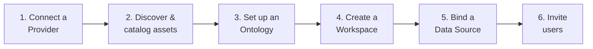

# Admin Setup

*For Administrators.* This is the end-to-end path from a fresh platform to a
workspace your team can actually explore. Do these steps in order — each one
unlocks the next.

> 💡 **The goal:** get from "nothing connected" to "a user can open a View and
> trace lineage." That requires a **Provider**, a **Catalog Item**, a
> **Workspace**, a **Data Source**, and an **Ontology**. This page connects all
> five.

Everything below lives under **Administration** in the sidebar (visible to users
with the `system:admin` permission). On a brand-new platform, a **first-run
wizard** appears automatically to walk you through the early steps.

---

## Step 1 — Connect a Provider

A **Provider** is a connection to a graph database where lineage data lives
(FalkorDB, Neo4j, or DataHub).

1. Go to **Admin → Overview** (or **Ingestion**) and click **Add Provider**.
2. Choose the **provider type** and enter connection details (host, port,
   credentials).
3. **Test connectivity** — Synodic verifies it can reach the database.
4. Save. Credentials are stored encrypted.

> 💡 On first boot, the platform may **bootstrap a default Provider** from
> environment variables, so you might already have one to work with.

---

## Step 2 — Discover and catalog assets

With a Provider connected, let Synodic find the graphs inside it:

1. From the Provider, run **discovery** — Synodic introspects the available
   graphs and schemas.
2. Register the ones you want as **Catalog Items** — named, governed datasets
   that can be shared into workspaces.
3. Set **permissions** on each catalog item to control who can use it.

The catalog is your **curated shelf of datasets**. Before deleting a catalog
item, Synodic shows an **impact analysis** of what depends on it — always check
this first.

---

## Step 3 — Set up an Ontology

The **ontology** (semantic layer) defines what your data *means* and how it
*looks*. You can:

- **Import or start from a template**, then refine, or
- **Build one** from scratch.

Define your entity types, relationships, hierarchy, and visuals, then
**validate** and **publish**. Full detail for this step lives in
[The Semantic Layer](/guide/semantic-layer) — it's worth reading before you
publish, because published versions are immutable by design.

> 💡 You can assign the same ontology across multiple workspaces to give your
> whole organisation one consistent visual language.

---

## Step 4 — Create a Workspace

A **Workspace** is an isolated team or project context.

1. Go to **Admin → Overview** (or **Workspaces**) and **create a workspace**.
2. Give it a clear name and description.
3. Optionally set it as the **default** workspace for new users.

Members, data sources, and Views all live *inside* the workspace, keeping teams
cleanly separated.

---

## Step 5 — Bind a Data Source

This is the step that makes a workspace *usable*. A **Data Source** binds a
Catalog Item (the graph) to an Ontology (the meaning) inside the workspace.

1. In the workspace, **add a data source**.
2. Select the **provider + graph** (catalog item).
3. Assign the **ontology**.
4. Configure options such as **projection mode** and **aggregation** as needed.

Once a data source exists, users in that workspace can open the Explorer and
Views against real data.

> ⚠️ **"No data source for workspace"** is the classic symptom of skipping this
> step. If users report it, finish the binding here. See
> [Troubleshooting](/guide/troubleshooting).

---

## Step 6 — Invite users

Finally, let people in. New users **sign up** and wait for approval; you approve
them and assign roles. The full identity and access workflow — approvals, roles,
groups, and grants — is covered in [Users & Access](/guide/users-access).

---

## Setup checklist

- [ ] Provider connected and connectivity **tested**.
- [ ] Graphs **discovered** and registered as catalog items.
- [ ] Ontology defined, validated, and **published**.
- [ ] Workspace created (default set if appropriate).
- [ ] **Data source bound** (catalog item + ontology) in the workspace.
- [ ] First users **approved** with sensible roles.
- [ ] You opened the Explorer yourself and traced something — it works.

---

## Where to next

Once you're past first-time setup, ongoing workspace operations — managing data
sources, moving them between workspaces, governing your Views collection, and
checking ontology health — are covered in
[Workspace Admin](/guide/workspace-admin).

- Run day-2 workspace operations → [Workspace Admin](/guide/workspace-admin)
- Manage people and permissions → [Users & Access](/guide/users-access)
- Keep the platform healthy → [Governance & Operations](/guide/governance-ops)
- Understand the ontology deeply → [The Semantic Layer](/guide/semantic-layer)
