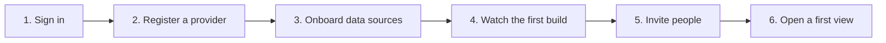

# Admin Setup

```tour-admin-setup
```

*For Administrators.* This page takes a brand-new deployment to the moment your
team opens a view and traces lineage. Work through the six steps in order. Each
one ends with what you should see, so you know it worked before you move on.

> **Before you start:** You need the administrator account your deployment
> created when it first started. It holds the **Super Admin** role, which every
> step below needs. If you didn't deploy {brand} yourself, ask whoever did for
> its email address and password.


```mermaid
flowchart LR
  A["1. Sign in"] --> B["2. Register a provider"]
  B --> C["3. Onboard data sources"]
  C --> D["4. Watch the first build"]
  D --> E["5. Invite people"]
  E --> F["6. Open a first view"]
```

> **Tip:** Two progress trackers follow this path for you. **Getting started**,
> at the foot of the sidebar, counts your progress and opens a checklist that
> ticks off *Connect a provider*, *Discover assets*, *Create a workspace* and
> *Assign an ontology* as you finish them. **Ingestion** shows a **Setup
> Progress** bar (**Provider → Assets → Workspace → Semantics**) until all four
> are done.

If guided tours are switched on (**Administration → Features → Guided product
tours**, off by default), you can replay this setup tour from **Help**.

---

## Step 1: Sign in as the administrator

A new deployment creates one administrator the first time it starts, using the
email address and password in its `ADMIN_EMAIL` and `ADMIN_PASSWORD` settings.
This account is also your break-glass account: it keeps password sign-in even
if you later make single sign-on compulsory.

1. Open {brand}. On the sign-in page, enter the **Email** and **Password**, then
   select **Enter Workspace**.
2. If the deployment still uses a default password from the setup
   documentation, the **Choose a new password** page opens instead of the app.
   Enter the **Current password**, a **New password** (at least 8 characters,
   rated **Strong** or better) and **Confirm new password**, then select **Set
   new password**.
3. You are signed out. Sign in again with your new password.

**You should now see** the **Dashboard**, with **Ingestion**, **Workspaces**,
**Semantic Layers** and **Administration** in the sidebar.

> **If every page sends you back to "Choose a new password":** that's expected.
> Nothing else works until the default password is replaced.

---

## Step 2: Register and test a provider

A **provider** is the connection to the graph database that holds your lineage:
FalkorDB, Neo4j, DataHub or Google Spanner Graph. (Terms are explained in the
[Glossary](/guide/glossary).) A new deployment has none.

1. In the sidebar, select **Ingestion**, then the **Providers** tab.
   (**Administration → Global Overview → Register Connection** brings you to the
   same place.)
2. Select **Register Provider** — on an empty deployment, **Start provider
   onboarding** does the same. The **Provider Onboarding** wizard opens at
   **Provider Type**.
3. Choose your database and select **Next**.
4. On **Connection**, enter a **Provider name** (it must be unique), then the
   connection details. For most databases that is the **Host** and **Port** —
   the port starts at that database's usual default — plus a **Username** and
   **Password** if it needs them, and **Use TLS** if it expects encrypted
   connections. For Google Spanner Graph, enter the **GCP Project ID**,
   **Instance ID**, **Database ID**, **Property graph name** and **Service
   account JSON** instead. Select **Next**.
5. Neo4j and Google Spanner Graph only: on **Schema Mapping**, optionally map
   custom property names, then select **Next**.
6. On **Review**, select **Test connection**. {brand} runs a live probe against
   the database.
7. When the result reads **Connected successfully**, select **Create
   provider**.

**You should now see** **Provider connected** and "*your provider* is ready".
Select **Continue to data sources** to go straight to step 3.

> **If the test says "Unable to connect":** the message names the problem.
> Select **Back**, correct the host, port, credentials or TLS setting, then
> return to **Review** and select **Test connection** again. You *can* create a
> provider that failed its test, but it is saved with a warning, and you can't
> continue to data sources until it connects.


---

## Step 3: Onboard data sources into a workspace

A provider can hold many graphs. Onboarding registers the ones you want as
**data sources** and, in the same wizard, decides three things for each one:
which **workspace** it lives in, how it is **aggregated** (pre-computed so deep
lineage queries stay fast), and which **semantic layer** gives its entity and
relationship types their meaning. A workspace is created here too, if you don't
have one yet.

1. Open **Ingestion → Data Sources** and select your provider in the
   **Providers** list on the left. (If you came from step 2, it is already
   selected.) {brand} scans it and lists every graph it found, each marked
   **Available**.
2. Tick the graphs you want — or **Select All**. Each one you pick is marked
   **Queued**.
3. Select **Onboard Sources (N)**. The **Asset Onboarding** wizard opens at
   **Workspace**.
4. **Workspace:** for each source, choose **Create New Domain** and type a
   **Workspace Name** to create a workspace, or **Use Existing** to pick one you
   already have. (On a new deployment there are no workspaces yet, so choose
   **Create New Domain**.) Sources given the same new workspace name share it,
   and once you have workspaces, **Quick assign** puts every source in one with
   a click. Select **Next**.
5. **Aggregation:** keep **In-Source** (the recommended choice) unless the table
   below says otherwise. Select **Next**.
6. **Semantic Layer:** select **Analyze Graph**. {brand} reads the graph's types
   and lists **Recommended Semantic Layers** with how much of the graph each
   one covers — built-in layers first, then the rest by fit — and selects the
   top one for you. Keep it, pick another, or select **Create from Physical
   Graph** to start a new draft layer from the types it found. Select
   **Next**.
7. **Schema Review:** check how well each layer covers its graph. Gaps are
   advisory — unmapped types are ignored by aggregation and drawn with default
   styling. Only a layer with no lineage relationship at all stops you here.
   Select **Next**.
8. **Review:** check the summary and select **Complete Setup**.

**You should now see** **Setup Complete** — "Created *N* data sources across
*N* workspaces with semantic layer configured" — with an **Aggregation
Progress** panel listing a job for each source.

Choose the aggregation strategy:

| If you want… | Choose | Because |
| --- | --- | --- |
| The fastest lineage queries (most teams) | **In-Source** | Rolled-up edges are written into the source graph itself, so queries read one graph with no extra hop. |
| The source graph never to be modified | **Dedicated Graph** | Rolled-up relationships go to a separate cache graph. It lags slightly behind changes to the source. |
| To onboard now and decide later | **Skip for Now** | Fastest onboarding, but large graphs query slowly and indirect lineage isn't traced until you aggregate. |

> **If no semantic layer fits:** choose **Create from Physical Graph**, or
> **Skip — configure later**. Be aware that aggregation needs a semantic layer:
> a source without one isn't aggregated until you assign one. To do that later,
> open the workspace's **Data Sources** tab, select the source, select **Edit**,
> choose a **Semantic layer (ontology)**, select **Save changes**, then
> **Re-trigger** it on the **Aggregation** tab. [The Semantic
> Layer](/guide/semantic-layer) explains how to build and refine a layer.

> **Tip:** Prefer to create the workspace first — say, to agree its name and
> description before any data arrives? Select **Workspaces → Create
> Workspace**, work through **Basics**, **Data** (leave **Skip for now**
> selected — nothing is onboarded yet) and **Review**, then select **Create
> workspace**. Back in this step, choose **Use Existing**. [Workspace
> Admin](/guide/workspace-admin) covers the Create Workspace wizard in full.

> **If people later report "No data source for workspace":** usually that
> workspace has no data source yet — onboard one into it with this step. See
> [Troubleshooting](/guide/troubleshooting#users-report-no-data-source-for-workspace).

---

## Step 4: Watch the first build and check freshness

Aggregation runs in the background as soon as onboarding finishes. How long it
takes depends on the size of the graph.

1. On **Setup Complete**, watch **Aggregation Progress**. Each job shows
   **Pending**, then a progress bar while it runs, then **Completed**, and the
   panel shows **All complete** when every source is done. You can close the
   wizard at any time — the jobs keep running.
2. To check later, open **Workspaces**, select your workspace and open its
   **Aggregation** tab. Each source shows a status: **Ready**, **Running**,
   **Pending**, **Failed**, **Skipped** or **Not Started**.
3. For every job across the platform, open **Ingestion → Job History**.
4. Open **Ingestion → Freshness** to confirm each source is current — every
   source has a row with **Aggregation**, **Cache**, **Freshness** and **Last
   activity**.

**You should now see** each new source marked **Ready** on the workspace's
**Aggregation** tab.

> **If a job shows Failed:** the card shows the error. Fix the cause, then
> select **Re-trigger** on the **Aggregation** tab. [Data Freshness &
> Ingestion](/guide/data-freshness) explains failures, retries and freshness in
> depth.

You don't have to wait to build a view: the view wizard warns **Aggregation in
progress** and lets you continue, but some lineage may be missing until the
build finishes.

---

## Step 5: Invite people and give them the workspace

A new deployment is invite-only: **Self-registration** is off and **Invite
links** is on (both in **Administration → Features**). So people join through
a link you send them.

1. Open **Administration → User Management** and select **Invite by Link**. The
   **Invite by link** wizard opens at **Who it's for**.
2. Choose who the link is for. Each choice sets safe limits you can change
   later in the wizard:

   | Choose | Who can use it | Starts as |
   | --- | --- | --- |
   | **One specific person** | Only their email address | 1 person, 7 days |
   | **Several people** | A separate link per pasted address | 1 each, 7 days |
   | **Anyone at a domain** | Any address at one domain — safe to post in a team channel | Up to 25, 30 days |
   | **Anyone with the link** | Whoever ends up with the URL | Up to 5, 7 days |

   Enter the address, addresses or domain, then select **Next**.
3. On **What they get**, leave **Standard user** selected for most people.
   Optionally pick groups under **Add to groups**. Select **Next**.
4. On **Safety**, check **Link expires in** (and, for domain or open links, **How
   many people can use it**). Select **Next**.
5. On **Review**, select **Generate link**, then **Copy link**, and send it. The
   link is shown only this once.
6. When they have signed up, give them your workspace: open the workspace,
   select the **Members** tab, then **Add member**. Choose **User**, pick the
   person, choose a **Role** — for example **Workspace viewer** for read-only
   access — and select **Add to workspace**.

**You should now see** the person listed on the workspace's **Members** tab
with the role you chose.

> **Tip:** Inviting a whole team? Create a group in **Administration →
> Groups**, add the group on the workspace's **Members** tab once (**Add
> member** → **Group**), then attach the group on the invite's **What they
> get** step. Everyone who joins lands with access. A link that adds groups is
> pinned to email addresses (**One specific person** or **Several people**)
> unless you deliberately override that.

People who find a workspace they can't open can ask for access themselves —
see [Requesting Access](/guide/requesting-access). Their requests appear under
**Pending access requests** on that workspace's **Members** tab. Adding
accounts directly with **Add people**, approving self-registered accounts, and
every role are covered in [Users & Access](/guide/users-access).


---

## Step 6: Open a first view

1. Select **Explore** in the sidebar — or **Go to Explorer** on the **Setup
   Complete** screen. The **Explorer** opens.
2. Select **New View** and follow the wizard to pick your data source and how
   to draw it. [Creating Views](/guide/creating-views) walks through every
   step.
3. In your new view, select a node to explore its lineage. [Tracing Lineage on
   the Canvas](/guide/exploring-graph) shows how to follow it upstream and
   downstream.

**You should now see** your first view on the canvas, with lineage you can
trace. Your platform is set up.

---

## Check your setup

- [ ] You changed the default administrator password (if you were asked to).
- [ ] A provider shows as connected on **Ingestion → Providers**.
- [ ] Your data sources are onboarded, each with a semantic layer.
- [ ] Aggregation shows **Ready** on the workspace's **Aggregation** tab.
- [ ] At least one person has joined and is listed under **Members**.
- [ ] You opened a view yourself and traced something.

---

## Where to next

- [Workspace Admin](/guide/workspace-admin) — when you want to add more
  sources, manage members or move data between workspaces.
- [Users & Access](/guide/users-access) — when you want to choose the right
  roles, use groups, or add accounts directly.
- [Single Sign-On](/guide/sso-setup) — when people should sign in with your
  company's identity provider.
- [The Admin Console](/guide/governance-ops) — when you want to keep the
  platform healthy, branded and well communicated.
