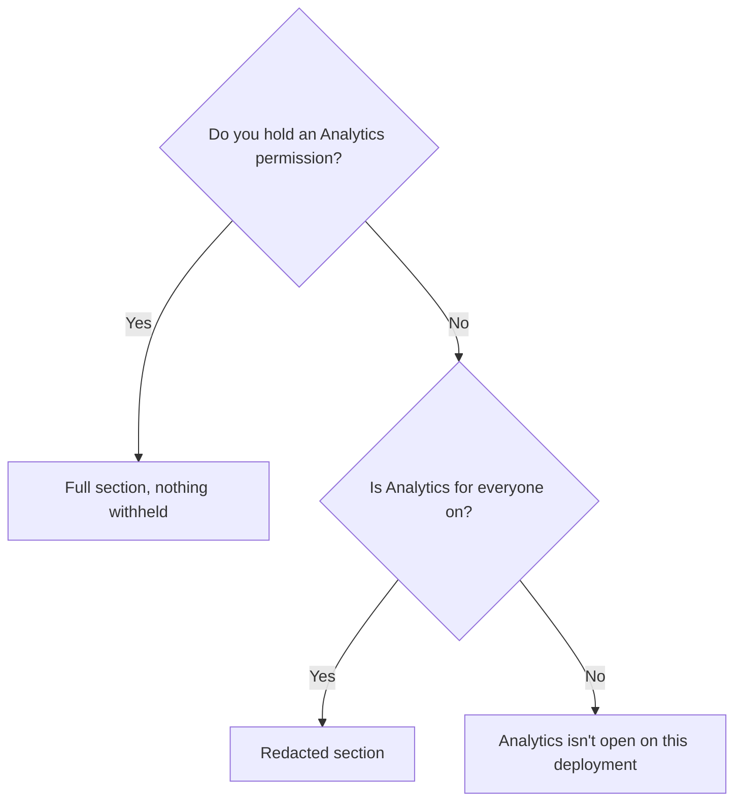

# Analytics

*For Administrators, and anyone else who can open Analytics.* Find out how the
platform is growing and being used, read each of the six tabs with
confidence, and understand what is hidden from whom — and why. The last
section is for everyone: usage figures on the views you can open.

> **Before you start:** **Analytics** is in the sidebar if you're a Super
> admin, Org admin or Org auditor (or hold the `system:analytics:read`,
> `system:audit:read`, `system:org-admin` or `system:admin` permission). If
> your administrator has turned on **Analytics for everyone**, everyone else
> sees it too, with some details withheld.

---

## Open Analytics and choose a period

1. In the sidebar, select **Analytics**. The page opens on **Overview**. The
   header reads *How the platform is growing, and who is using it · as of
   <time> ago*.
2. In the range control at the top right, pick a period: **7d**, **14d** (the
   default), **30d**, **90d**, **6m** or **1y**. Every chart, figure and table
   on the page follows it.
3. For other dates, select **Custom**. Use a shortcut — **This month**, **Last
   month**, **This quarter** or **Last quarter** — or pick a start and end date
   on the calendar, then select **Apply range**. Both dates are included, a
   range can span up to 365 days, and it's compared with the same number of
   days just before it.
4. Select a tab: **Overview**, **Growth**, **Engagement**, **Content**,
   **Health** or **Workspaces**.

The tab and the period are part of the page address, so copying the address
shares exactly what you are looking at.

> **If you don't see Analytics in the sidebar:** you don't hold an Analytics
> permission and **Analytics for everyone** is off. Opening the page's address
> shows *Analytics isn't open on this deployment* — that's a deployment
> setting, not a problem with your account.

**Reading the charts.** Hatched bars and faded lines are the previous period,
drawn beside the current one. Days are counted in UTC. The figures are worked
out in the background — every five minutes by default — which is why the
header says how old they are; hover the time for the exact moment.

---

## The six tabs

| Tab | The question it answers | What you'll find |
| --- | --- | --- |
| **Overview** | How is the platform doing overall? | **What changed**; **Daily active**, **Weekly active**, **Monthly active** and **Stickiness**; **Total users**, **Workspaces**, **Views** and **View opens**; growth and activity over time; **Most active people**, **Most popular views** and **Busiest workspaces**; **Platform scale**; **Data sources onboarded**. |
| **Growth** | Are we growing, and do people stay? | **New accounts**, **New workspaces**, **Activation rate** and **Time to first view**; **Cumulative growth, indexed**; **How people arrive**; **Account status**; **Growth accounting** (**New**, **Returning**, **Resurrected**, **Went dormant**); **Retention by signup cohort**. |
| **Engagement** | Are people actually using it? | **Active users**, **Stickiness**, **View opens**, **Actions taken**, **Traces run**, **Traces that found lineage**, **Graph searches** and **Searches that matched**; the **Activation funnel**; **What people do**; **Sign-ins**; **Most active people**. |
| **Content** | What has been built, and does anyone open it? | **Views**, **Shared openly**, **Top-10 share**, **Not opened** and **Semantic layers**; **Who can see what**; **Kinds of view**; **Top builders**; **Views created**; **Most popular views**. |
| **Health** | Can people trust the data and reach it? | Refresh outcomes (**Refresh success**, **Failed refreshes**, **Sources refreshed**, **Never refreshed**); access (**Pending requests**, **Median time to approve**, **Invite acceptance**, **Invites sent**); semantic coverage (**Sources with a semantic layer**, **Sources drifting**, **Entity types modelled**). |
| **Workspaces** | Which workspaces are thriving, quiet or empty? | **What the estate is made of** (**Workspaces**, **Yours to open**, **Gone quiet**, **No data source**, plus **How big they are** and **How many people are in them**); a table of every workspace with **Members**, **Views**, **New**, **Active**, **Opens**, **Actions**, **Nodes** and **Last active**. |

On a brand-new deployment, **Overview** says *Nothing to measure yet* and
lists the first steps you can take — **Create a workspace**, and, if your role
allows, **Connect a data source** and **Invite your team**.

### Understand a number

1. Select the **ⓘ** beside a figure. A panel explains what it counts, **How
   it's calculated** and **Why it matters** — what to do if it moves.
2. Press Esc or click elsewhere to close it.

Where a chart offers **Show data table**, select it to read the figures as a
table; **Show chart** switches back.

---

## Read "What changed"

At the top of **Overview**, **What changed** states in sentences what moved
in your period and whether it's good news. If nothing meaningful moved, it
says nothing rather than invent a finding.

- Each finding is tagged **Good news**, **Worth watching**, **Needs
  attention** or **Context**. Select a tag's count to show only those.
- **See the chart** jumps to the chart behind a finding; **Investigate** opens
  the tab it's about. Some findings also link straight to the screen where you
  can act — only if you can reach it.
- To clear a finding you've dealt with, select its **×** (*Clear this
  finding*); it stays cleared in this browser. Cleared findings are listed
  under *N cleared · show*, each with **Restore**. A cleared finding comes back
  if its figure changes.
- Collapse the strip with its header; your browser remembers that. The
  collapsed header still shows the tally and the most important finding.

---

## Look inside one workspace

1. Select the **Workspaces** tab.
2. Select a workspace's row. A panel opens with its **Views**, **View
   opens**, **Active users** and **Actions**, then **Activity over time**,
   **Views created**, **Who can see what**, **Kinds of view**, **Most opened
   here**, **Top contributors** and **Graph scale**.
3. Close the panel with its close button.

You can also jump here by selecting a workspace in another tab's leaderboard,
such as **Busiest workspaces**. A workspace's name links into the workspace
itself only if you can open it.

---

## What is hidden, and why

If you hold an Analytics permission you see everything, and a line at the top
of the page tells you what everyone *else* sees — for example *Everyone can
open Analytics: colleagues are named, and workspaces follow the usual
permissions.* — with **Change**, which opens **Administration → Features**.

Everyone else sees a note at the top saying what their figures cover — for
example *You're seeing figures for the whole platform, with full detail for
the 3 workspaces you belong to* — and what is hidden from them.

Three things are always true:

- **Totals and trends count everything**, including workspaces you aren't in.
- **Your own activity is never hidden from you.**
- **Analytics never changes access.** It can hide a name, but it never opens
  a workspace or view you couldn't open anyway.

Four switches on **Administration → Features** decide the rest (see
[Feature Switches](/guide/feature-switches#analytics)):

| Switch | Default | What people without an Analytics permission get |
| --- | --- | --- |
| **Analytics for everyone** | Off | Off: no Analytics at all. On: the redacted section described here. |
| **What everyone can see** | **Show colleagues** | **Aggregate only**: counts and trends, nobody named. **Show colleagues**: also leaderboards and names — **Most active people**, **Top builders**, and **Top contributors** in workspaces they belong to. **Show colleagues and operations**: also refresh outcomes and access requests on **Health**. |
| **Show every workspace in Analytics** | Off | Off: workspaces they aren't in appear as **Restricted workspace** rows — counted in the totals, name and figures hidden. On: every workspace is named, with its figures. It's reporting only; it grants no access. |
| **Let people contact each other from Analytics** | Off | On: an email link beside a popular view's creator (for views the reader can see) and beside contributors in workspaces they belong to — never on the platform-wide activity ranking, and only when **What everyone can see** names colleagues. |

> **Admins:** **What everyone can see** can't be changed from the Features
> page yet — see [Two settings this page can't change yet](/guide/feature-switches#two-settings-this-page-cant-change-yet).

### Locked panels

When a panel is withheld from you, it keeps its place and says why instead
of looking empty — for example **Individual activity is hidden**, **Top
builders is hidden**, **Refresh outcomes are hidden**, **Access requests are
hidden** or **Contributors are hidden**. The shape behind the message is a
placeholder; no real figures reach your browser. Views you can't open appear
in rankings as **Restricted view**.

---

## Request access to a locked workspace

Workspaces you aren't a member of are counted in the figures, and listed
anonymously so you can ask to join.

1. On **Workspaces**, below the table, select the line *N more workspaces you
   are not a member of — counted in the figures above*. The locked rows
   appear, each named **Restricted workspace** with *You are not a member*.
2. Select **Request access** on a row. The **Ask for read access** panel
   explains that you're asking to open one workspace, and that its
   administrators will see which one you mean.
3. In the note box, say why you need it — the approver can't see what you
   were looking at (up to 280 characters).
4. Select **Send request**. The row shows **Request sent** and *An
   administrator of that workspace will review it. You will see the workspace
   here once it is granted.*

The request is for read-only access (the **Workspace viewer** role); the
approver can grant more. Sending it twice doesn't create a second request.
For what happens next, see [Requesting Access](/guide/requesting-access).

---

## Usage figures on views — for everyone

You don't need Analytics to see whether a view is used.

- **On a view's page**, beside its name (on wider screens): for example
  **12 people · 340 opens · last 30 days**. Hover a figure for more, such as
  all-time opens. A small line shows opens per day; hover it for the busiest
  day.
- A view nobody opened says so: *Not opened in the last 30 days*.
- **In the Explorer**, cards and rows show the same people and opens counts,
  and you can sort by **Most opened**.

Anyone who can open a view can see its figures. They are counts and dates
only — no names — so no permission or privacy setting applies.

---

## Where to next

- [Feature Switches](/guide/feature-switches#analytics) — when you want to
  open Analytics to everyone or change what it shows.
- [Requesting Access](/guide/requesting-access) — when you've asked for a
  workspace and want to follow your request.
- [Data Freshness & Ingestion](/guide/data-freshness) — when **Health** shows
  failed refreshes or sources drifting.
- [Finding Views](/guide/browsing-views) — when you want to find the views
  people actually open.
