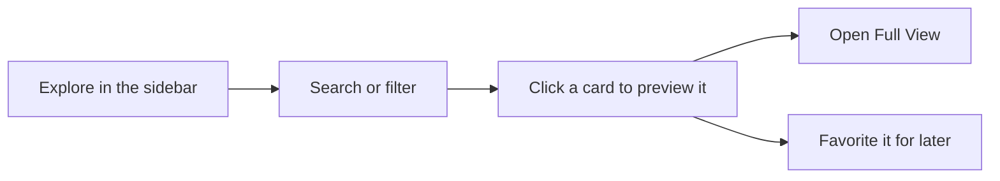

# Finding Views

*For Viewers.* A **view** is a saved, shareable picture of part of your data's
lineage: someone has already chosen what to show and how to lay it out (see the
[Glossary](/guide/glossary)). The **Explorer** lists every view you're allowed to
open, across all your workspaces. This page shows you how to find the view you
need, check it's the right one before you open it, and keep the views you use
most one click away.

## Find a view

1. In the left sidebar, click **Explore**. The **Explorer** opens, headed
   *Discover views across workspaces*.
2. Press `/` to jump to the search box, then type a word from the view's name.
   The list narrows as you type, and its heading changes to
   **Results for "…"**.
3. Click the card you want. A preview panel slides in from the right with the
   view's description, what it's built on and how much it's used.
4. Click **Open Full View**. The view opens on its canvas.

Search looks for every word you type in each view's name, description and
tags, and in the names of its workspace and data source. A view has to match
all the words. To find the views one person made, use the **Creator** filter
instead (next section). When you click into the empty search box, your
**Recent searches** in this browser appear; **Clear** empties the list.

> **If you don't see the view:** the list says **No views match your search**.
> Click **Show all views** to clear the search and filters, then try again.
> Still missing? See
> [I can't find a view someone shared](#i-cant-find-a-view-someone-shared).

## Narrow the list

The row under the search box starts with quick filters. Click one at a time:

| Click | To see |
| --- | --- |
| **All** | Every view you can open (the default) |
| **My Views** | Views you created |
| **Favorites** | Views you have favourited (see [Keep your favourites one click away](#keep-your-favourites-one-click-away)) |
| **Recent** | Views created in the last 7 days |
| **Shared** | Views someone has shared with you by name or through a group, not your own |
| **Attention** | Views that need attention: not updated for more than 90 days, or whose workspace or data source is inactive or no longer exists |
| **Deleted** | Deleted views that can still be restored (see [Bring back a deleted view](#bring-back-a-deleted-view)) |

After them come dropdowns you can combine: **Workspace**, **Source** (a data
source), **Visibility**, **Type** (the canvas type, such as Context View),
**Tag** and **Creator**. Each one you set shows as a chip under the row, such as
*Workspace: Finance*. Click a chip's **×** to remove it, or **Clear all** to
remove every dropdown filter.

- **Filter by a tag from a card.** Click any tag on a card to filter by it;
  click it again to remove it.
- **Use the summary tiles.** **Total Views** switches back to **All**, **New
  This Week** switches to **Recent**, and **Need Attention** switches to
  **Attention**. The numbers always describe the list you're looking at, so
  they change with your search and filters.
- **Bookmark a filtered list.** Your search, filters, sort and layout are kept
  in the page address, so you can bookmark the list or send the link to a
  colleague.

> **Tip:** **Shared** lists only views shared with you by name or through a
> group. Views you can open because of their **Workspace** or **Enterprise**
> visibility are under **All**.

### Change the order and the layout

- **Sort** with the menu on the right of the filter row. **Recently modified**
  is the default; you can also sort by **Recently updated data**, **Oldest
  updated data**, **Recently edited (settings)**, **Newest created**, **Oldest
  created**, **Most liked**, **Most opened**, **A → Z** and **Z → A**.
- **Grid view** shows cards. **List view** shows a table whose **Name**,
  **Type**, **Owner**, **Likes** and **Updated** headers sort when you click
  them.
- The density buttons beside them make the list **Compact**, **Comfortable**
  or **Spacious**.

## What the Explorer shows before you search

With no search or filter, the Explorer is arranged in sections:

| Section | What it holds |
| --- | --- |
| **Featured Views** | Up to three pinned views, when there are any |
| **Continue where you left off** | Views you opened recently, with when you visited. Click one to open it straight away |
| **Trending** | Up to six of the most favourited views. A view nobody has favourited never appears here |
| **All Views** | Every view you can open, with the total beside the heading. More cards load as you scroll |

As soon as you search or filter, only the results are shown.

## Read a view's card

Each card answers "is this the view I want, and does anyone use it?" before
you open anything.

| Part of the card | What it tells you |
| --- | --- |
| Canvas type and name | The kind of canvas (Graph, Hierarchy or Context View) and the view's name |
| Workspace and semantic layer | The workspace the view belongs to, and an icon for the semantic layer that describes its data. Hover either for details |
| **Private**, **Workspace** or **Enterprise** | Who can open it. Hover for a plain-language answer |
| Health badge | Shown only when something is wrong (table below) |
| Data source | The data the view is drawn from |
| **New to you** | Other people open this view, but you never have |
| Tags | Up to three, then **+N**. Click one to filter by it |
| Heart and number | How many people have favourited it |
| People and number | How many different people opened it in the last 30 days |
| Eye and number | How many times it was opened in the last 30 days |
| Initials | Who created it. Hover for their name and email |
| Time | When it last changed. Hover to see when its data and its settings last changed |

Hover the people or eye number for the detail: who has opened it (for example
*Only its author* or *Nobody yet*), *Not opened* when nobody has opened it in
30 days and, when known, how many times it has been opened in all and when it
was last opened. The heart counts favourites, not use: a view can be popular
and rarely opened, or the reverse.

| Health badge | What it means |
| --- | --- |
| **Stale** | The view hasn't been updated for more than 90 days |
| **Warning** | Its workspace or data source is inactive |
| **Source deleted** | Its workspace or data source no longer exists, so it may not load |

## Preview a view before you open it

Click anywhere on a card, or move to it with the arrow keys and press
**Enter**. The preview panel slides in from the right. From top to bottom it
shows:

- the canvas type and visibility (hover the visibility to see who can open
  it), and the view's name;
- a warning if the view is stale or its data source is missing;
- a preview of its layers (for a Context View) or its shape (for a Hierarchy);
- **Description** and **Tags**;
- **What this view is built on**: its workspace, data source, graph data
  provider and semantic layer;
- **Details**: who created it, and under **See all details** when it was
  created, last updated, and when its data last changed (**Data Updated**);
- **Usage**: how many people opened it in the last 30 days, how often, and
  whether you have.

At the bottom, **Open Full View** opens the view and **Activity** lists what has
changed on it. The other buttons (**Edit layout & scope**, **Edit details**,
**Share** and, when you may, **Delete**) are for people who manage the view; see
[Managing & Sharing Views](/guide/managing-views).

[screenshot-pending]: # "browsing-views-preview — The Explorer with one card clicked and the preview panel open on the right, showing the built-on chain, Usage and the Open Full View button"

## Open a view

Use whichever is closest:

- **Open Full View** in the preview panel.
- Hover a card and click the arrow icon (**Open view**).
- A card under **Continue where you left off**.
- The **Favorites** star in the top bar (see the next section).
- Press `⌘K` / `Ctrl-K`, type the view's name, and pick it under **Views**.

The view opens with its name, canvas type and workspace in the header. It
always opens in its own workspace, so you never need to switch workspace first.

Looking around is safe: searching, expanding and tracing inside a view don't
change the view or its data. A view's own settings are changed by the people who
manage it ([Managing & Sharing Views](/guide/managing-views)), and the data only
in a draft, through **Edit** ([Editing in a Draft](/guide/editing-in-a-draft)).

> **If you see View Cannot Load:** the page explains that the view doesn't
> exist or hasn't been shared with you. Click **Back to Explorer**, then see
> [I can't find a view someone shared](#i-cant-find-a-view-someone-shared).

> **If the canvas shows a message instead of the view:** *Preparing your graph*
> and *Taking a little longer than usual* mean it is retrying by itself. What
> each message means is in
> [Messages you may see](/guide/troubleshooting#messages-you-may-see).

## Keep your favourites one click away

1. In the Explorer, hover a card and click the heart (**Favorite**). The heart
   fills in. Click it again (**Unfavorite**) to take the view off your list.
2. Click the star in the top bar. The **Favorites** popover opens with every
   view you've favourited.
3. Click a view in the popover. It opens straight away.

- **Remove one from the popover:** hover its row and click **×** (**Remove
  from favorites**).
- **Find one in a long list:** once you have more than five favourites, a
  **Search favorites...** box appears at the top of the popover.
- **Reopen something recent:** under your favourites, **Recent** lists views
  you opened lately that aren't favourites.
- **See them all as cards:** click **Favorites** in the Explorer's filter row.
- **From the keyboard:** move to a card with the arrow keys and press `f`.

Favourites are personal: yours don't change anyone else's list. The heart
number on a card is how many people, in total, have favourited it.

[screenshot-pending]: # "browsing-views-favorites — The top-bar Favorites popover open, listing three favourite views with their workspaces and a Recent section below"

## Bring back a deleted view

A deleted view moves to **Deleted** in the Explorer, where a workspace admin can
restore it.

1. In the Explorer's filter row, click **Deleted**. Deleted views appear faded,
   with a **Deleted** badge.
2. Hover the view's card and click **Restore**.
3. A message confirms the view has been restored. It is back in the list, with
   the same visibility as before.

> **If you see "Failed to restore":** only a workspace admin of the view's
> workspace can restore it. Ask yours to restore it for you.

**Delete** on a deleted card removes the view permanently, after you type its
name to confirm. It can't be undone, and only a workspace admin can do it.

## I can't find a view someone shared

Work through these in order:

1. **Clear your search and filters.** Click **All**, or **Show all views** if
   the list is empty.
2. **Check Deleted.** If the view is there, it was deleted; see
   [Bring back a deleted view](#bring-back-a-deleted-view).
3. **Check who it's shared with.** Every view is **Private**, **Workspace** or
   **Enterprise**, and can also be shared with named people or groups; you see
   it only if one of those includes you. The rules are in
   [Who can see a View](/guide/managing-views#who-can-see-a-view).
4. **Ask for access.** Ask the view's owner to share it with you, or
   [request access](/guide/requesting-access) to its workspace.

A view that is still waiting in a draft (for example, one being imported from
another environment) isn't listed until that draft is published.

## Keyboard shortcuts in the Explorer

| Key | What it does |
| --- | --- |
| `/` | Jump to the search box |
| `?` | Show the keyboard shortcuts |
| `Esc` | Clear the search, or close an overlay |
| Arrow keys | Move between cards |
| `Enter` | Preview the card you've moved to |
| `f` | Favourite or unfavourite that card |

## Where to next

- [Reading Lineage](/guide/reading-lineage) — when a view is open and you want
  to understand what the picture shows.
- [Tracing Lineage on the Canvas](/guide/exploring-graph) — when you want to
  follow data upstream or downstream inside a view.
- [Requesting Access](/guide/requesting-access) — when a view or workspace you
  need is closed to you.
- [Creating Views](/guide/creating-views) — when no existing view answers your
  question and you want to build one with **New View**.
