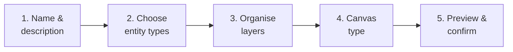

# Creating Views

*For Builders.* A **View** turns a moment of understanding into a durable, shared
asset. This page walks through the **View Wizard** end to end, plus the choices
that make a View genuinely useful to others.

> 💡 **What makes a good View?** It answers *one* question clearly. Resist the
> urge to cram everything in — a focused View that loads fast and reads cleanly
> beats a sprawling one every time.

---

## When to save a View

Save a View whenever an exploration is worth repeating or sharing:

- You've traced a lineage path others will need (e.g. "what feeds the finance
  dashboards").
- You've assembled a clean diagram for a stakeholder.
- You want a reliable starting point you can return to without re-tracing.

You can save from the **Explorer** or from any opened View you've modified.

---

## The View Wizard, step by step

Click **Save as View** to open the five-step wizard.

### Step 1 — Name and describe
- **Name**: short and specific. *"Finance → Revenue dashboard lineage"* beats
  *"My view 3."*
- **Description**: one or two sentences on what the View shows and *why* someone
  would open it. This text appears on the gallery card.

### Step 2 — Choose visible entity types
Pick which **types of node** stay in the View (e.g. include Tables and
Dashboards, hide Columns). Fewer types means a cleaner, faster picture. You're
choosing the *signal* and trimming the noise.

### Step 3 — Organise layers (Layer Studio)
Use the **Layer Studio** to group nodes into **layers** — horizontal lanes that
give the graph structure. Common layerings:

- by **pipeline stage**: source → staging → mart → dashboard
- by **ownership**: which team owns each part
- by **domain**: finance, marketing, HR

Good layering is what turns a tangle into a diagram. See
[The Semantic Layer](/guide/semantic-layer) for how types and layers relate.

### Step 4 — Choose the canvas type
Pick how the View is laid out:

| Canvas type | Best for |
| --- | --- |
| **Graph** | Free-form, force-directed exploration |
| **Hierarchy** | Tree-shaped containment (parent → child) |
| **Aggregated / Layered** | Clean flow by tier or domain |

### Step 5 — Preview and confirm
Review the result, adjust if needed, and set the **visibility** (next section).
Confirm to publish the View into the gallery.

---

## Setting visibility

Choose who can see the View. Pick the *narrowest* scope that still reaches your
audience:

| Visibility | Reaches | Use when |
| --- | --- | --- |
| **Personal** | Just you | A work-in-progress or private bookmark |
| **Team** | The workspace | The team's shared reference |
| **Enterprise** | The organisation | A canonical, broadly useful View |

You can always widen visibility later, or share explicitly with specific people —
see [Managing Views](/guide/managing-views).

---

## Tag for discovery

Add **tags** (e.g. `finance`, `daily-load`, `golden`) so your View surfaces in
filtered searches. Tags are the difference between a View people *find* and one
that's lost in the gallery. Agree on a small tag vocabulary with your team —
suggestions in [Ways of Working](/guide/ways-of-working).

---

## After you save

- Your View appears in the **gallery** and (for Team/Enterprise) becomes
  discoverable by others.
- **Favourite** it (★) to pin it to your sidebar quick-access.
- Iterate freely — open it, refine, and re-save. To hand it off or co-own it,
  see [Managing Views](/guide/managing-views).

---

## Builder's checklist

Before you call a View "done":

- [ ] Name answers *what*; description answers *why*.
- [ ] Only the entity types that matter are visible.
- [ ] Layers give the graph a readable structure.
- [ ] Visibility matches the intended audience (no wider than needed).
- [ ] Tagged with your team's agreed vocabulary.
- [ ] It loads quickly and reads clearly at a glance.

---

## Where to next

- Maintain, share, and co-own Views → [Managing Views](/guide/managing-views)
- Shape the colours, types, and meaning → [The Semantic Layer](/guide/semantic-layer)
- Team conventions for names and tags → [Ways of Working](/guide/ways-of-working)
