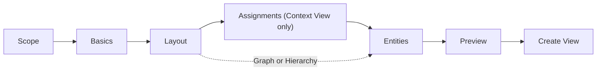

# Creating Views

*For Builders.*

A **View** is a saved, shareable way of looking at one data source: which
entities it shows, how they are laid out, and who can open it. By the end of
this page you can build one with the **New View** wizard, pick the right canvas
type for it, and decide who sees it.

> **Before you start:** You need permission to create views in the workspace —
> the **Workspace member**, **Data engineer** and **Workspace admin** roles all
> have it; **Workspace viewer** does not. The data source works best when it has
> a [semantic layer](/guide/semantic-layer) assigned: without one you can still
> build a View, but with limited entity-type filtering.

## The wizard at a glance

The wizard has up to six steps. **Assignments** appears only when you choose
the **Context View** layout.

```mermaid
flowchart LR
  A[Scope] --> B[Basics]
  B --> C[Layout]
  C --> D["Assignments (Context View only)"]
  D --> E[Entities]
  C -.->|"Graph or Hierarchy"| E
  E --> F[Preview]
  F --> G["Create View"]
```

**Back** and **Next** move between steps, and **Next** stays greyed out until
the current step is complete. You can click any step you have already finished
to return to it. **Cancel** closes the wizard.

## Open the wizard

1. In the sidebar, choose **Explore**. The **Explorer** opens.
2. Choose **New View** (top right). The **Create New View** wizard opens on the
   **Scope** step, asking *Where should this view live?*

The same wizard opens from **Build a new view** on the Dashboard, from **Create
Your First View** when the Explorer is empty, and from **New view** on a
workspace's **Views** tab.

## Step 1 — Scope: choose the data

Every View is built on exactly one data source. The step shows your workspaces
on the left and the data sources of the selected workspace as cards on the
right.

1. Choose the workspace in the left-hand list. (If you belong to only one, it
   is already selected.)
2. Choose a data source card. A check mark appears on it, and a green banner
   confirms *Semantic layer assigned* when it has one.
3. Choose **Next**. The **Basics** step opens.

Each card tells you whether the source is a good place to build:

| On the card | Means |
| --- | --- |
| **Ready** (green badge under the name) | It has a semantic layer and its lineage has been rolled up — the safest choice |
| **Ontology** / **No ontology** (bottom row) | Whether a semantic layer is assigned |
| **Ready**, **Running**, **Pending**, **Failed**, **Skipped**, **Not run** (bottom row) | The state of its lineage roll-up. You can still build while it runs, but some lineage may be missing until it finishes |
| **Fully managed** / **Federated** | Created and versioned here, or read from an external system of record |

The **Semantic layer** and **Ready** chips filter the cards, and the sort menu
(**Recommended** by default) puts the sources you can build on first.

> **If you don't see your data source:** turn on **All workspaces** to search
> every workspace you can see, or type in **Search data sources...** — a search
> that finds nothing here offers **Search all →** when there are matches
> elsewhere. Choosing a source in another workspace moves the View there.

### Other ways to start

When your deployment offers them, a switch above the picker gives you two more
starting points:

- **Start from blank** — draw lineage by hand, with no data source behind it.
  Pick a **Graph connection** and a **Published semantic layer**; on the
  **Basics** step you also choose the **Graph name** the model is stored under
  (it can't be renamed later). A blank model skips the **Assignments** and
  **Entities** steps. This option appears only when your administrator has
  turned on both **Version control** and **Build lineage from scratch**
  (Administration → Features).
- **Import a view** — bring in a View exported from another environment. See
  [Moving views between environments](/guide/import-export#moving-views-between-environments).

## Step 2 — Basics: name it and choose who can see it

1. Type a **View Name**. A name that says what the View shows (*Finance data
   lineage*) beats *My view 3*. Click into the empty field for **Suggestions**.
2. Optionally add a **Description** — what the View is for and why someone
   would open it.
3. Pick an **Icon**.
4. Choose a **Visibility**: **Private** (the default), **Workspace** or
   **Enterprise**. The panel underneath says who that is and what they will be
   able to do. The full rules are in
   [Who can see a View](/guide/managing-views#who-can-see-a-view).
5. Add **Tags** — type one and press Enter. Tags make the View easier to find
   in the Explorer.
6. Choose **Next**. The **Layout** step opens.

The line above the name shows the workspace and data source you picked;
**Change** takes you back to **Scope**.

> **If Enterprise says Needs approval:** you can still choose it. The wizard
> explains *We'll ask an admin to publish this*: when you finish, the View is
> created visible to your workspace, and a request to publish it goes to the
> people who can approve it. Add a **Note for your admin (optional)** — saying
> why usually gets a faster answer. You're notified when they answer.

## Step 3 — Layout: choose the canvas type

*Choose your layout type* offers three canvases. Pick the one that matches the
question your View answers:

| If you want to… | Choose | Because |
| --- | --- | --- |
| Read a pipeline stage by stage — sources, staging, marts, reports | **Context View** (marked **Recommended**) | Entities are sorted into columns (layers) you define, with lineage drawn between them. It is also the canvas where you [edit data in a draft](/guide/editing-in-a-draft) |
| Explore how things connect, without a fixed structure | **Graph** | Entities are positioned freely (a force-directed or DAG layout), so relationships stand out |
| Browse what contains what — domain, schema, table, column | **Hierarchy** | Entities are nested inside their parents as a tree you expand and collapse |

[screenshot-pending]: # "creating-views-layout-step — The Create New View wizard on the Layout step: the Graph, Hierarchy and Context View cards (Context View marked Recommended and selected), with Quick Start Templates underneath"

If you choose **Context View**, the step continues with its layers — the
columns of the canvas:

1. Under **Choose a starting template**, pick a **Quick Start Templates** card.
   **One layer per top-level type** (when offered) gives each top-level entity
   type its own column; **From your schema** gives one column per level of the
   semantic layer.
2. Adjust the layers under **Configure Layers**: open a layer to change its
   **Name**, **Color**, **Description** and **Entity Types**, drag the handle
   to reorder, or choose **Add Layer**. **Switch template** starts over from
   another template.
3. Choose **Next**. The **Assignments** step opens.

For **Graph** or **Hierarchy**, **Next** goes straight to **Entities**.

> **Admins:** the layouts on offer are set in **Administration → Features →
> View modes**. A layout you withdraw disappears from the wizard; Views already
> built in it keep working.

## Step 4 — Assignments: place entities in layers (Context View only)

This step decides which entities appear in which column. Your layers are on
the left, and the entities of the data source in the middle.

1. Choose the layer (or a group inside it) you want to fill.
2. Drag entities from the entity list onto it. The entities inside them follow
   them into the layer.
3. To watch the columns take shape, choose **Preview**: a **Live Preview**
   opens on the right (**Hide** closes it). Then choose **Next**.

Layers that list **Entity Types** fill themselves: every top-level entity of
those types lands in the layer without being dragged. **Auto-layer** creates a
column per top-level type or per top-level entity, **Magic Map** suggests a
layer for each top-level entity by matching names (accept them one by one or
all at once), and **Undo** (`⌘Z` / `Ctrl-Z`) and **Redo** (`⌘⇧Z` /
`Ctrl-Shift-Z`) step back through your changes.

**Unassigned only** hides everything that already has a layer, so you can see
what's left.

**Advanced: Orphans only.** An *orphan* is an entity whose type normally sits
inside another but which has no parent in the data — for example a Table with no
Schema. To list only those, open **More filters** (the **⋯** button next to
**Unassigned only**) and tick **Orphans only** under **Advanced**. The menu shows
how many the data source holds, or *many* when the server couldn't count them in
time. You place an orphan in a layer like any other entity. Untick it to see
everything again.

## Step 5 — Entities: choose what to include

*Select what to include* lists the entity types (and relationships) of the
semantic layer.

1. Tick the entity types the View should show. Fewer types give a cleaner,
   faster picture. At least one must be ticked before **Next** works.
2. Optionally choose **Data filters** to narrow further by **Name Contains**,
   **Has Tag** or **Property** (for example `status=active`).
3. Choose **Next**. The **Preview** step opens.

## Step 6 — Preview: check it and create it

*Review your view* summarises the **Layout Type**, **Layers**, **Entity Types**,
**Edge Types** and **Sharing** you chose.

1. Check the summary. To change something, click its step in the step bar.
2. Choose **Create View**. The wizard shows its progress — *Creating the view*,
   then *Applying layers and placements*.
3. When it says **Created**, the View opens by itself after five seconds.
   Choose **Open view now** to go straight there, or **Stay here** to remain
   where you are.

If a stage fails, the wizard says *Something went wrong — nothing was lost* and
offers **Retry**. A retry finishes the same View rather than creating a second
one.

> **Tip:** Closed the wizard half-way? Your work is kept in this browser. The
> next time you open the wizard on the same workspace and data source, *You have
> an unfinished view here* offers **Resume** or **Discard**.

> **Tip:** Already built the View in another environment where the same data
> source is onboarded? Choose **Import a view** on the **Scope** step, or
> **Import view** in the Explorer, and bring in the file exported there. See
> [Moving views between environments](/guide/import-export#moving-views-between-environments).

## After you create it

- **Find it again.** It appears in the **Explorer**; Workspace and Enterprise
  Views also appear for the people who can see them.
- **Keep it close.** Select the heart on its Explorer card to add it to your
  **Favorites** (the star in the top bar).
- **Change the basics.** On the View, **Details** edits the name, description,
  tags and visibility.
- **Change the layout or scope.** On the View's Explorer card, open **⋯** and
  choose **Edit layout & scope**. The wizard reopens as **Edit View**, without
  the **Scope** step; finish with **Save Changes**.

Sharing, versions and housekeeping are covered in
[Managing & Sharing Views](/guide/managing-views).

## Builder's checklist

Before you call a View done:

- [ ] Its name says *what* it shows; its description says *why*.
- [ ] Only the entity types that matter are included.
- [ ] (Context View) Its layers read left to right as a story.
- [ ] Its visibility is no wider than the audience needs.
- [ ] It carries your team's agreed tags.
- [ ] It opens quickly and reads clearly at a glance.

## Where to next

- [Managing & Sharing Views](/guide/managing-views) — when you want to share the View, change who can see it, or tidy up your collection.
- [Display Rules](/guide/display-rules) — when you want the canvas to flag PII, missing owners or certified data at a glance.
- [The Semantic Layer](/guide/semantic-layer) — when entity types, colours or the hierarchy look wrong.
- [Editing in a Draft](/guide/editing-in-a-draft) — when the View is right but the data itself needs changing.
