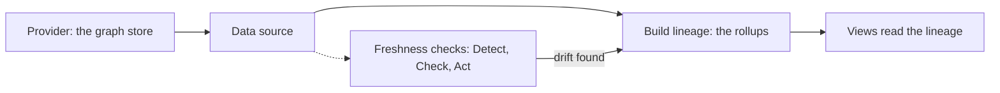

# Data Freshness & Ingestion

*For Administrators and data owners.* Check that the lineage people read is
current, refresh or rebuild a data source when it isn't, recover from a failed
rebuild, and find your way around the five tabs of **Ingestion**: **Providers**,
**Data Sources**, **Job History**, **Freshness** and **Profiling**.

> **Before you start:** **Ingestion** is in the sidebar for Super admins, Org
> admins and anyone with a workspace role. To refresh, rebuild, pause or
> reschedule a source, you must be able to manage data sources in that
> source's workspace (Workspace member, Data engineer, Workspace admin, Org
> admin or Super admin). Actions across a whole provider or the whole fleet
> are for Super admins.

A **provider** is a graph store {brand} reads. A **data source** is one graph
in it, onboarded into a workspace. **Building lineage** rolls the source's
detailed lineage up into the summaries views draw (the *rollups*). Freshness
checks keep watching the source, and rebuild it when the rollups stop
matching the data.

---

## Which tab do I need?

| Tab | Use it to… | Who sees it |
| --- | --- | --- |
| **Providers** | See the graph stores {brand} reads and their health. | Super admins, Org admins and anyone who can read providers in a workspace. Only Super admins can **Register Provider**, edit or delete — everyone else gets a read-only list. |
| **Data Sources** | Pick a provider and see each graph in it: its size, its status and its property-name budget. | The tab shows for everyone who can open Ingestion, but each provider's list of graphs loads only for Super admins; other roles see *You don't have permission to view data assets for this provider.* |
| **Job History** | Follow and control rebuild jobs across every workspace. | The tab shows for everyone who can open Ingestion, but the job list only loads for Super admins. |
| **Freshness** | See whether each source's lineage is current, and refresh, rebuild or pause it. | Everyone who can open Ingestion. |
| **Profiling** | See how a source's counts and make-up changed over time. | Everyone who can open Ingestion. |

---

## Is my data current?

1. Select **Ingestion** in the sidebar, then the **Freshness** tab. At the
   top, **Overlay integrity** shows the check schedule (*Checks every …*), when
   the last check ran and how many sources are drifting.
2. Read the tiles under it — **Total sources**, **Ready**, **Drifting**,
   **Rebuilding now**, **Needs attention**, **Not built** and **Cache
   coverage** (plus **Automation held** and **Connections not up to date**
   when they apply). Select a tile to show only those sources; select it again
   to show all.
3. Narrow the table with the filter bar — status, **Provider**, **Workspace**,
   or **Search sources…**. Sources are grouped by provider, and groups that need
   attention open first, worst source first.
4. Read the source's **Freshness** column (see the table below).
5. Select the source's name. Its drawer opens with **Lineage updated**, **Cache
   as of** and **Next rebuild**, its automation settings, and **Recent
   activity**.

| The Freshness column says | It means | Do this |
| --- | --- | --- |
| **Up to date** | Lineage is built and the last check found the rollups in sync. | Nothing. |
| **Queued** | The source changed and a rebuild is queued. | Wait, or select **Rebuild now**. |
| **Recomputing** | A rebuild is running. Super admins also see its step and percentage, and **· narrowing** when it has slowed down to fit the graph store's per-query limits. | Wait. Super admins can select **View progress**. |
| **Drifting** or **Drift detected** | Counts changed outside {brand}, so the rollups are behind. | Automation rebuilds it at its next check if it's allowed to; or rebuild by hand. |
| **Rollups missing** | The source has data but no rolled-up lineage — most likely wiped by a reload. | As for **Drifting**. |
| **Next rebuild in 12m** | A rebuild ran recently; automation waits out the cooldown. | Nothing — or rebuild by hand, which isn't held back by the cooldown. |
| **Never built** | Lineage has never been built for this source. | Select **Build lineage**. |
| **Not materialized**, **Legacy layout** or **Degraded** | The lineage is out of date and needs a rebuild. | Select **Rebuild now**. |
| A failure, such as **Would not fit** or **Rebuild failed** | The last rebuild failed. | See [A rebuild failed](#a-rebuild-failed). |
| **Reconcile suspended** | Automatic rebuilds kept failing to clear the problem, so automation stopped for this source. | See *When automation gives up* under [A rebuild failed](#a-rebuild-failed). |
| **Connections not up to date** | A version-controlled source isn't serving its rolled-up connections. A rebuild won't fix it. | Open the drawer and follow **Open version control for this source**. |

Next to each name, **Versioned** marks a graph mastered in {brand}, whose
rollups version control maintains on every publish; **External** marks one
mastered by another system, which freshness checks watch.

### Status chips on Providers and Data Sources

On **Providers**, each provider carries a chip for its connection: **Fresh**
when it answers, **Offline** when it doesn't, and **Computing…** while it's
being checked.

For Super admins, each graph on **Data Sources** — and a data source's profile
— also carries a chip for how current its *figures* (node and edge counts,
types) are. Chips show in capitals; hover one for its explanation.

| Chip | Meaning | Do this |
| --- | --- | --- |
| **Refreshed 5m ago** or **Fresh** | The figures are current. A **⚠** after it means the provider is answering but failing now and then. | Nothing. If **⚠** persists, check the provider. |
| **Stale 2d ago** | The figures haven't refreshed for over a day. | Wait for the next scheduled scan (**Auto · every 30m** by default), or refresh now. |
| **Computing…** | The first figures are being worked out, or the provider is still being checked. | Wait. |
| **Cached** | The provider is offline; you're seeing the last cached copy. It refreshes by itself when the provider is back. | Check the provider if it stays like this. |
| **Offline** | The provider is offline and nothing is cached yet. | On **Providers**, a Super admin can select **Test** to re-check the connection. For a FalkorDB store, [the Graph store page](/guide/graph-store-topology) shows every node. |
| **Paused** | Background refresh can't run because its queue can't be reached; you're seeing whatever was cached. | Tell whoever runs your deployment. |
| **Partial** | Stand-in figures, shown while a full refresh runs. | Wait. |

To refresh figures now (Super admins), open **Data Sources**, select the
provider, then select **Refresh** — or the refresh icon on one graph's row.

### From a view

On a view's page, a chip beside the data source's name says whether what the
view reads is in sync — for example **In sync · read 5m ago**, **Summaries
need attention** or **Changed since the last refresh**. Select it for when each step last ran
and what happens next. (The chip is hidden on narrow screens.)

### Messages on a view while it loads

| The view shows | It means |
| --- | --- |
| **Preparing your graph** | The graph store is loading its data after a restart, or a node holding the graph is being replaced. The view retries by itself, usually within seconds. |
| **Taking a little longer than usual** | Requests were slow, shed under load, or hit a passing gateway error. The view keeps retrying. |
| **Graph service is unavailable** | The graph store can't be reached. The view fills in once it's back. |
| *Reconnecting to the graph store — the node holding this graph is restarting.* | A line over a Context View while a node fails over. What's on screen stays. |

If these appear often, look at [the Graph store page](/guide/graph-store-topology).

---

## Refresh a data source

Choose the lightest action that does the job:

| If you want to… | Choose | Because |
| --- | --- | --- |
| Pick up new figures without rebuilding | **Refresh caches** | Re-reads cached figures and keeps any queued rebuild. |
| Unstick a source that says **Recomputing** but isn't, or reset bad cached data | **Clear cache** | Resets cached data, including a stuck "recomputing" state. No rebuild — safe to run. |
| Bring the rolled-up lineage up to date | **Rebuild lineage** | Rebuilds the source's rollups. It can take a while. |
| Do both | **Full refresh** | Refreshes caches and rebuilds the lineage. |
| Build a source for the first time | **Build lineage** | Builds its rollups for the first time. |

1. On **Freshness**, find the source.
2. In **Actions**, select the button the source's state calls for — for
   example **Rebuild now**, **Retry rebuild** or **Refresh caches**. For a
   different action, select **⋯** and choose from what it offers: **Refresh
   caches**, **Clear cache**, **Rebuild lineage** or **Full refresh**.
3. **Refresh caches** and **Clear cache** run at once. A rebuild asks you to
   confirm: select **Rebuild lineage** (or **Build lineage**, **Full refresh**)
   in the dialog.
4. A notification confirms it — for example *Lineage rebuild queued for
   <name>.* — and the Freshness column moves to **Queued**, then
   **Recomputing**. You can close the page; the rebuild runs in the
   background.

> **If you don't see Actions on a row:** you can't manage data sources in that
> source's workspace. Ask a Workspace admin of that workspace.

**Several sources at once:** tick their checkboxes. A bar appears (*3 sources
selected*) with **Refresh caches**, **Retry rebuild** (for the failed ones) and
**Rebuild lineage**. Each action covers up to 50 sources; sources already
rebuilding can't be selected.

**A whole provider** (Super admins): in the provider's group row, select
**Refresh provider…**, pick **Only changed sources**, **Refresh caches**,
**Clear cache**, **Rebuild lineage** or **Full refresh**, then **Start
refresh**. Rebuilding scopes ask once more: **Yes, rebuild this provider's
sources**.

**Everything** (Super admins): select **Refresh all sources** in **Overlay
integrity**. The default refreshes only sources that changed; **Advanced
options** offers **Clear cache** and **Full refresh**. Each source keeps
serving its current lineage while it refreshes.

To stop a running rebuild (Super admins), select **⋯** on its row, then
**Cancel job**. If automation had asked for it, it may try a few more times
before it waits for a person.

---

## A rebuild failed

1. On **Freshness**, select the **Needs attention** tile. Each failed source
   shows its cause in the Freshness column, and **N more like this** when
   other sources failed the same way.
2. Select the source's name. The drawer opens on **Lineage rebuild failed**:
   why it happened, **How to resolve**, and the buttons that help.
3. Do what **How to resolve** says, then select the highlighted button —
   **Retry rebuild**, **Resume rebuild** or **Clear cache**. Retrying asks you
   to confirm.
4. Check that the Freshness column moves to **Queued**, then **Recomputing**.

**Details** under the panel holds the exact error, for whoever runs your
deployment.

| Cause shown | What happened | What to do |
| --- | --- | --- |
| **Would not fit** | The rollups wouldn't fit in the free memory of the shard that holds the graph. Nothing was written. | See [Rollup Capacity](/guide/rollup-capacity#when-a-rebuild-says-would-not-fit). |
| **Out of memory** | The graph store ran out of memory during the rebuild. | Free or add graph-store memory, then retry. |
| **Query too large** | A single row is larger than the store's per-query memory limit. | A Super admin raises the limit — see [Rollup Capacity](/guide/rollup-capacity#adjusting-the-graph-stores-own-limits). |
| **Graph store offline** | A graph-store node stopped answering mid-rebuild. Everything written so far was kept. | Once the node is back, select **Resume rebuild** — it carries on from its checkpoint. |
| **Timed out** | The store stopped answering, or the rebuild made no progress for too long. | Check the store, then retry; see [Rollup Capacity](/guide/rollup-capacity#when-a-rebuild-says-a-query-was-too-large-or-timed-out) if it is merely slow. |
| **Worker died** | The process running the rebuild disappeared. Nothing about the source is wrong. | Select **Resume rebuild**. |
| **Never started** | No worker picked the rebuild up. | Ask whoever runs your deployment to check the rebuild workers. Retrying first only queues another. |
| **Rebuild conflict** | Another rebuild of this source was already running. | Wait for it to finish. |
| **No ontology** | The source has no semantic layer assigned. | Assign one in the source's settings, then rebuild. See [The Semantic Layer](/guide/semantic-layer). |
| **Out of property names** | The graph has used up the 65,534 property names it may hold. | See [Watch the property-name budget](#watch-the-property-name-budget). Retrying won't help. |
| **Rebuild failed** | Any other failure. | Retry; if it fails again, pass **Details** on. |

**When automation gives up.** If automatic rebuilds keep failing to clear the
same problem — three attempts in a row by default — automation stops for that
source: the row shows **Reconcile suspended** and **Needs a person**. Fix the
cause, then open the drawer and select **Resume automation** (in the **Check**
stage). A Super admin can resume every such source from **Automation** with
**Resume all**.

---

## Background refresh is paused

"Paused" means one of two things — check which.

**The Paused chip** on a graph in **Data Sources** means the queue behind
background refresh can't be reached. Figures stay at whatever was cached, and
there's nothing to change in {brand}: tell whoever runs your deployment. The
chip clears by itself once the queue is back.

**A hold on automatic rebuilds** shows on Freshness rows and in a banner at the
top of the tab. A hold only stops *automatic* rebuilds: sources are still
watched and checked, drift still shows on every row, and anyone can still
rebuild a source by hand.

| The row says | What's holding it | Release it from |
| --- | --- | --- |
| **Paused · 3h** or **Stopped** | This source's own setting. | The source's drawer, **Act** stage: **Resume now** for a pause, or turn **Rebuild this source automatically when a check finds drift** back on. |
| **Paused by provider · …** or **Stopped by provider** | Its provider (Super admins). | **Resume provider** on the provider's group row, then **Resume now**. |
| **Paused fleet-wide · …** or **Stopped fleet-wide** | Every source (Super admins). | **Resume fleet-wide** in the banner, or **Automation**. |
| **Needs a person** | Automation gave up after repeated failures. | **Resume automation** in the drawer — see [A rebuild failed](#a-rebuild-failed). |

If the banner says automatic rebuilds are stopped because **Act** or **Check**
is off in Automation, select **Open Automation** to turn it back on.

### Pause automatic rebuilds yourself

1. Open the source's drawer and go to the **Act** stage.
2. Under **Pause rebuilds for**, choose **1 hour**, **8 hours**, **24 hours** or
   **7 days**. A notification confirms, for example *Rebuilds paused for 8
   hours.*
3. To stop indefinitely instead, turn off **Rebuild this source automatically
   when a check finds drift**.

Super admins can hold a whole provider (**Pause provider…** on its group row)
or the whole fleet (**Automation** → **Act** → **Advanced** → **Pause every
rebuild for**). Both also offer **Until resumed (stop)**; stopping the whole
fleet asks you to confirm.

---

## Change how often a source is checked and rebuilt

Automation runs in three stages, and the drawer has one section for each:

| Stage | What it does | Settings in the drawer |
| --- | --- | --- |
| **Detect** | Watches the source for changes made outside {brand}. | **Watch this source for changes made outside the app**; **Look for changes every** (at least 15 seconds). |
| **Check** | Decides whether the rollups still match the data. | **Check every** (at least 1 minute). Super admins also get **Check now**. |
| **Act** | Rebuilds when they don't match. | **Rebuild this source automatically when a check finds drift**; **Minimum time between rebuilds** (0 rebuilds on every change; settable once the source has been built); **Rollup storage**; **Pause rebuilds for**. |

1. Open the source's drawer from **Freshness**.
2. In the stage you want, pick a preset or type a time (up to 24 hours).
3. Select **Save** for that setting. A notification confirms, for example
   *Check frequency updated.* The hint beside each setting says where its
   value comes from: **Custom**, **Global default** or **System default**.

For a version-controlled (**Versioned**) source, **Check** and **Act** explain
that version control rebuilds its rollups on every publish, so there's nothing
to schedule.

The fleet-wide defaults live in **Automation** (in **Overlay integrity**).
Super admins change them and select **Save**; changes take effect within a
minute. Everyone else can read them.

---

## Follow a rebuild in Job History

> **Before you start:** the job list loads only for Super admins. With any
> other role, **Job History** says *No aggregation jobs found* even when jobs
> exist — follow a source from its **Freshness** drawer instead.

1. Select **Ingestion** → **Job History**. **Aggregation Job History** shows
   **Total Jobs**, **Success Rate**, **Avg Duration** and **Failed**, then the
   jobs — **Grouped** by data source, or **Flat**.
2. Narrow with the search box, **Workspace**, **Data Source**, **Trigger**,
   **Mode** or a status.
3. Use a job's icons: **Cancel job**, **Resume from checkpoint**, **Re-trigger
   aggregation** or **Delete from history**. Resuming and re-triggering open
   the same dialog, where **Resume from cursor** carries on from the last
   checkpoint and **Re-trigger from scratch** starts over.
4. On a running job, **Adjust this run** gives it more time (**Stall window**
   **+1 h** to **+12 h**, or **Wall clock** → **Double it**) or makes it
   gentler on the graph store (**Pace ×2**, **Pace ×4**, **Serial reads**,
   **Halve scans**, **Smaller batches**). Changes reach the worker within
   about thirty seconds.
   With more than one job running, the **Flat** view also offers **Extend all
   by +3 h**.

From a Freshness row, **⋯** → **Open in Job History** jumps straight to that
source's jobs. For tuning a slow or oversized rebuild, see
[Rollup Capacity & Large Graphs](/guide/rollup-capacity).

---

## See how a source changed over time

**Profiling** answers "what moved, and by how much?"

1. Select **Ingestion** → **Profiling**. The tiles show **Sources reporting**,
   **Need a look** (sources that moved outside their normal range) and **Not
   observed** (sources with no reading in the window — counted, never shown
   as zero).
2. Pick the time window — **24 hours**, **7 days** (the default), **30 days**
   or **90 days** — and what to measure: **Entities**, **Relationships** or
   **Total**.
3. Narrow by provider or workspace, or **Search sources**. Unusual movement is
   listed first.
4. Select a source. Its profile shows **Entities**, **Relationships**,
   **Property names**, **Largest drop** and **Observations**, and how its
   entity and relationship types changed over time.

**Export** downloads the board as a CSV file. **Retention** opens the
**Profiling policy** — how long readings are kept, how often a source is
recorded and when profiling flags something. It applies to every data source,
so only Super admins can change it.

---

## Watch the property-name budget

A graph in the graph store can register at most **65,534** distinct property
names, and names are **never freed**: deleting data doesn't give them back —
only recreating the graph does. Rebuilds need a few names of their own, so a
source whose metadata keys use up the budget can't be rebuilt, and fails with
**Out of property names**.

Where to see it:

- **Freshness**: the source's drawer, under **Capacity** — *N of 65,534 the
  graph store allows a graph*.
- **Profiling**: the source's **Property names** figure.
- **Data Sources** (Super admins): select the provider. Each graph's row
  shows *N property names*. Expand the row to see the **Property names**
  meter: **Healthy** (under 70%), **Filling up** (from 70%) or **Near the
  limit** (from 90%), which adds *Names are never freed — this graph will need
  recreating to reclaim them.*

What to do:

- Watch the trend. A source that keeps adding new metadata keys will reach the
  limit; ask its owners whether those keys need to be separate properties.
- Once a graph is near or at the limit, it has to be recreated. That's a task
  for whoever runs your deployment: when a graph is recreated, at most 50,000
  of its keys become property names by default, and the rest are stored as
  values, so it doesn't fill up again. The steps are in
  [the aggregation pipeline guide](/docs/aggregation-pipeline).

---

## Where to next

- [Rollup Capacity & Large Graphs](/guide/rollup-capacity) — when a rebuild
  won't fit, runs slowly or times out.
- [The Graph Store](/guide/graph-store-topology) — when a node is down, a
  shard is full or views load slowly.
- [Automatic reconciliation](/docs/feature-aggregation-reconciliation) — when
  you want the engineering detail behind Detect, Check and Act.
- [Insights service](/docs/services-insights) — when you want to know how the
  cached figures and their chips are produced.
