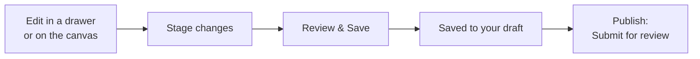

# Editing in a Draft

*For Builders — anyone who changes the data itself.*

This page takes you through changing entities and relationships safely: start
a draft, make your edits in the drawers or on the canvas, save them to your
draft, and send the draft for review. Nothing you do here reaches the version
everyone sees until it's published.

> **Before you start:**
> - Version control must be on — for the deployment and for this data source.
>   See [Is it turned on?](/guide/versioning-change-control#is-it-turned-on-two-levels)
> - The **Edit mode** switch must be on (it is by default). Without it, Views
>   are read-only for everyone.
> - You need permission to manage the workspace's data sources — the
>   **Workspace member**, **Data engineer** and **Workspace admin** roles have it.
> - Edit on a **Context View**. Its header has **Edit** and **Review & Save**;
>   the Graph and Hierarchy canvases show the same drawers read-only.

## How an edit becomes part of your draft

- **Stage changes** keeps an edit for review. It is not saved yet.
- **Review & Save** saves everything you staged to your **draft** in one go.
- Your draft is a working copy of the data source. **Published** — the version
  everyone sees — doesn't change until your draft is published, normally after
  a review in the [Review Center](/guide/review-center).

## Start editing

1. Open a Context View on the data source.
2. In the View's toolbar, choose **Edit** (*Make changes in a private draft*).
   The **Start editing** dialog opens: *Edits go to a private draft — the
   published view stays untouched.*
3. Choose where your edits go:
   - under **Continue a draft**, select an open draft on this View — yours or a
     teammate's; or
   - under **Start a new branch**, optionally type a name, then choose **Create &
     edit**.
4. You're now editing. An amber strip above the canvas shows the draft (*No
   changes yet* at first), and the toolbar shows **Undo**, **Redo**, **Review &
   Save** and **Done**.

You can also start from where you are:

- In an entity's drawer on **Published**, choose **Edit in a draft**.
- In a relationship's drawer, choose **Open a draft**.
- On the Dashboard, **Your work → Unfinished** lists Views where you have an
  unpublished draft; choose **Resume**.

> **If you don't see Edit:** the View isn't a Context View, you can't manage
> this workspace's data sources, or your administrator has turned **Version
> control** off. If **Edit** is greyed out with *Version control isn't set up for
> this data source yet*, see
> [On a data source without version control](#on-a-data-source-without-version-control).

## Change an entity

1. Click the entity on the canvas. Its drawer opens on the **View** tab.
2. Choose the **Edit** tab.
3. Change what you need: **Name**, **Business label** (the name the business
   knows it by), **Description**, **Qualified name**, **Source system**,
   **Schema properties** or **Properties**. The footer now says **Unsaved
   changes**.
4. Choose **Stage changes**, or press `⌘S` / `Ctrl-S`. The footer says *Staged
   — Review & Save to keep it*, and the entity gets a dashed halo on the canvas.

**Cancel** throws the edit away. `Esc` first leaves the field you're typing in,
then closes the drawer.

### If you leave before staging

Clicking elsewhere on the canvas, choosing another entity or closing the drawer
with an edit you haven't staged opens **Unsaved changes**:

| Choose | What happens |
| --- | --- |
| **Stage and continue** | Your edit is staged for **Review & Save**, then you move on |
| **Keep editing** | You stay where you were. `Esc` means the same |
| **Discard** | Your edit is thrown away, then you move on |

If you try to close the browser tab with an unstaged edit, the browser asks you
to confirm.

## Change a relationship

1. Click a line on the canvas. The relationship's drawer opens: what it means,
   the two entities it joins, and its properties and history.
2. Choose the **Edit** tab and change its properties.
3. Choose **Stage changes**.

To remove the relationship instead, choose **Delete** in its drawer. The
deletion is staged straight away — it happens when you save, or you can discard
it in **Review & Save**.

Only lineage relationships — the ones your graph's owners author — can be
changed. Rolled-up lines, hierarchy links and other relationship types are
read-only, and the drawer says why.

## Add and connect entities

All of these are staged too — nothing is saved until **Review & Save**.

- **Create an entity:** right-click an empty spot on the canvas and choose
  **Create Entity Here**, or choose **Add entity to** *layer* (the **+** at the
  top of a layer). The **Add entities** panel opens: pick the type, type a
  name, then choose **Add** — or **Add & nest inside** to create the next
  entity inside it. **Paste a list** adds many at once.
- **Add a child:** choose the **+** on an entity's row (**Add child entity**),
  or right-click the entity and choose **Add Child Entity**.
- **Connect two entities:** drag from an entity's connection handle to another
  entity, or right-click it and choose **Connect To…** or **Link to…**. Then
  pick the relationship type — only the types your
  [semantic layer](/guide/semantic-layer) allows are offered.
- **Copy, move or remove:** right-click an entity for **Duplicate**, **Move to
  Layer** and **Delete**; right-click a line for **Edit Edge**, **Reverse
  Direction** and **Delete Edge**.

**Undo** (`⌘Z` / `Ctrl-Z`) and **Redo** (`⌘⇧Z` / `Ctrl-Shift-Z`) step through
your staged edits.

## Review & Save

1. In the toolbar, choose **Review & Save** — it shows how many edits are
   waiting. **Review & Save Changes** opens: *Confirm N edits before they hit
   the backend.*
2. Check the list. Expand a change to see it before and after, or remove one
   you don't want with **Discard this change**.
3. Choose **Save N changes**. *Saved to draft.* confirms it, and the strip's
   counts now include them.

**Cancel** closes the list and keeps your edits staged. **Discard all** throws
every staged edit away.

> **If it says "Nothing was saved":** the whole save was refused because some
> changes need attention — for example, a relationship your semantic layer
> doesn't allow. Each problem is listed with its reason. Fix it, or choose
> **Discard this change**, then save again.

### Read the canvas while you edit

| On the canvas | Means |
| --- | --- |
| Solid ring | Saved to this draft |
| Dashed halo | Edited, but not saved yet |
| Green / orange / rose | New / edited / deleted |
| A deleted entity still in its place | A deletion saved to this draft stays visible, marked in rose, until the draft is published. Its drawer says **Deleted in this draft**, and **Restore** brings it back |

**Committed**, in the amber strip, hides or shows the rings for changes already
saved to the draft.

## When someone else changed the same thing

Two people can edit the same entity. {brand} never overwrites someone else's
work silently — it asks you.

**While saving.** If someone changed fields you also changed since you opened
them, the save is refused — *Nothing was saved — a change conflicts with edits
made since you opened it* — and **Review & Save** opens on the changes
concerned:

1. Each conflicting change says how many fields were changed by someone else,
   and shows each field's value when you opened it (*was …*).
2. For each field, choose **Yours** or **Theirs** — or use **Keep all mine** /
   **Use all theirs**.
3. Choose **Use these values**. Everything else either of you changed is kept.
4. Choose **Save N changes** again.

If the entity was deleted meanwhile, the change says so; choose **Drop this
change**.

**When Published has moved on.** If someone publishes while you work, a banner
says *Updates available — N new changes on the Published version*. **What
changed** lists them. Choose **Get latest updates** to bring them into your
draft; your own unsaved edits are kept. Where both sides changed the same
field, **Review changes from main** asks you to keep **your version** or take
the **incoming** one (**Keep all mine**, **Take all incoming**), then **Merge
with resolutions**.

## Your draft

- **Switch versions.** The version menu in the toolbar shows **Published** or
  your draft's name. It lists **Published** and **Your drafts**, and offers
  **New draft** and **Manage all drafts**. An amber dot means Published has
  moved on since the draft started.
- **Rename or describe it.** In the version menu, choose **Draft settings**
  next to a draft: change its **Name** and **Description**, set its
  **Visibility** (**Private** or **Shared**), or copy its **Shareable link**.
  Choose **Save changes**.
- **Stop editing.** **Done** leaves the draft and returns you to Published.
  The draft is kept — nothing is discarded. If you still have staged edits,
  **Review & Save** opens instead: save or discard them first.
- **Throw it away.** The bin icon in the amber strip (**Discard draft**) asks
  *Discard this draft? All its changes will be abandoned.* It can't be brought
  back.
- **Idle drafts.** By default, a draft nobody has saved to for 30 days is
  discarded automatically, just as if someone had chosen **Discard draft**.

Everyone who can edit the workspace's data can find and continue the drafts on
a View. People who can only read it never see them, and **Published** never
shows a draft's changes until it's published.

## If you come back later

Staged edits you haven't saved yet are kept **in this browser**. When you open
the View again on the same draft, a banner says *Restored N unsaved changes
from your last session.* Carry on, choose **Discard all** to drop them, or
close the banner to hide it.

Changes you saved with **Review & Save** are in the draft itself, so they're
there on any device.

## Submit your draft for review

> **Tip:** **Review & Save** first. Edits that are only staged aren't part of
> the draft, so they aren't included when it's reviewed or published.

1. In the amber strip, choose **Publish**. The **Publish your draft** dialog
   opens and summarises what the draft changes, including any Views it
   creates or changes.
2. Give it a **Title** — what changed, in a sentence — and, optionally, a
   **Description** with context for reviewers.
3. Choose **Submit for review**. *Sent for review.* confirms it, and the
   [Review Center](/guide/review-center) opens on your request. Its address
   links straight to the request — send it to whoever should review it.

**Publish now** skips the review and sends the draft straight to Published;
the banner *Published — your changes are now live* confirms it. Use it only
where your team doesn't expect a review — see
[Ways of Working](/guide/ways-of-working).

If the draft already has a review request, the dialog says **Already in
review**: everything you've saved since is part of that request, so there's
nothing to submit — choose **View review**. **Publish now** is still there,
but it asks again (**Publish anyway**), because the open review would be
closed as merged without its reviewers seeing it.

If Published has moved on, you're asked to **Get latest updates** before you
can publish. If **Publish now** finds that Published changed the same things
as your draft, the dialog says so: choose **Submit for review** instead, and
the conflicts are resolved when the request is merged.

## After you publish: is it live yet?

Publishing records your changes straight away, then writes them to the graph
that Views read. The chip beside the data source's name, under the View's name,
tells you where that has got to:

- **In sync · v12** — the latest published version is in the graph.
- **Catching up · 2 versions behind** — it's being written; give it a moment.
- **Summaries updating** — the graph is current and its lineage roll-ups are
  being rebuilt.

Click the chip for details and **Check again**. People who can manage data
sources also get **Open Data health**.

## On a data source without version control

A data source without version control can be read, explored and exported, but
not edited here:

- **Edit** is greyed out: *Version control isn't set up for this data source
  yet*.
- An entity drawer's **Edit** tab is greyed out with the same reason, and
  relationships can't be edited.
- The server refuses any change sent to it anyway.

If you can manage the workspace's data sources, the strip above the canvas
offers **Enable version control** — see
[Turn on version control for a data source](/guide/versioning-change-control#turn-on-version-control-for-a-data-source).

If your administrator has turned **Version control** off for the whole
deployment, **Edit**, drafts and reviews disappear everywhere. If they've turned
**Edit mode** off, entities and relationships can't be changed even in a draft.

## Where to next

- [The Review Center](/guide/review-center) — when your draft is submitted, or you've been asked to review someone else's.
- [Versioning & Change Control](/guide/versioning-change-control) — when you need to undo a published change or roll the graph back.
- [Import & Export](/guide/import-export) — when you have too many changes to make by hand.
- [The Semantic Layer](/guide/semantic-layer) — when the type or relationship you need isn't offered.
