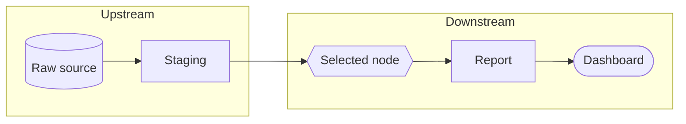

# Exploring the Graph

```tour-explore-lineage
```

*For Viewers (and anyone curious).* The **Explorer** is the open canvas where you
ask your own questions of the data — searching, tracing, expanding, and
filtering freely. Unlike opening a saved View, here *you* drive.

> **Note:** *Explorer vs Views* — A **View** is a curated, saved snapshot. The
> **Explorer** is a blank-canvas investigation. Start in a View to learn the
> landscape; come to the Explorer to answer a new question.


---

## Finding a starting point

Open **Explore** from the sidebar. An empty (or lightly seeded) canvas appears.
Begin with **search**:

- Use the on-canvas **search box** to find any node by name.
- Or press `⌘K` / `Ctrl-K` to open the **Command Palette** and search from
  anywhere.

Click a result to drop it onto the canvas as your anchor. From there, everything
is about following connections.

---

## Tracing lineage

Tracing is the core move. With a node selected, use the **Trace toolbar** or the
node's **right-click menu**:

| Action | What it does |
| --- | --- |
| **Trace Upstream** | Reveals where the data came from (its sources) |
| **Trace Downstream** | Reveals what the data feeds (its consumers) |
| **Depth** | How many hops to *show* — 1 for neighbours, more for full chains |

The traced path highlights the **blast radius** — everything connected to your
node in that direction. This is exactly what you want before changing or
trusting a piece of data.

A trace is **complete, hands-free**. The moment you start one, a **capsule**
at the top of the canvas says where the walk stands — **Focus · Picture ·
Flows · Drawn** — with the nodes, flows and requests ticking as each page
lands, and "N more to go" when the data source has said how many steps are
still owed. The immediate picture comes first, from the data source's own
summaries, and the detailed flows fill in behind it: a partner's count reads
"≈N flows" until its exact flows have landed. There is nothing to click to
keep it going — no "load more", no budget. A very large flow pauses once,
around fifty thousand nodes, to ask whether to **Continue**, because the rest
may slow your browser; a step that fails at the data source says so in the
dock and offers **Try again**, and what is already drawn stays.

Tracing a **table** shows exactly what tracing each of its columns would,
together: every partner whose columns feed or consume any of its columns,
with the container paths between them opened for you and the partners
themselves left **closed, with their counts** — open one when you want its
rows. **Depth** in the dock narrows what the canvas *shows* of a trace; it
never fetches less, so turning it down is always reversible.

### Handing a trace to someone else

A trace is usually an answer to somebody's question — *what feeds this
dashboard*, *what breaks if I drop this column* — so it can be handed over as
a link rather than a screenshot. **Share** in the trace dock copies a URL that
reopens the trace: the same entity, the same direction, the same hop limits,
and the same cards you had open.

The popover says what the link carries before you copy it, and one switch
decides how much travels:

| Switch | What your reader lands on |
| --- | --- |
| **Include the open cards** (default) | Your exact picture — the containers you opened, the rows you drilled into |
| Off | The same question, drawn the way a fresh trace opens |

Opening a link starts the trace on the reader's own canvas, so **it re-runs
against today's lineage** — it is a question, not a frozen snapshot, and it
takes as long as that trace takes. Anyone who can open the view can open the
trace; nobody else can. The trace also joins their own **Recent traces**, so
it is one click away after they close it.

---



---

## Expanding hierarchy

Many nodes *contain* others (a table contains columns; a domain contains
datasets). **Click to expand** a node and reveal its children, then collapse it
again to tidy up. This lets you drill into detail only where you need it, keeping
the rest of the canvas calm.

> **Note:** Expanding follows **containment**; tracing follows **lineage**. See
> [Reading Lineage](/guide/reading-lineage) for the difference.

---

## Filtering and focusing

As a graph grows, use these to keep it legible:

- **Entity-type filters** — show or hide whole categories of node (e.g. hide
  columns to see only tables).
- **Edge-type filters** — focus on lineage edges, containment edges, or both.
- **Granularity** — column → table → domain re-aggregates the whole picture to
  the altitude you need.
- **Search-to-select** — search highlights matching nodes so you can find them in
  a crowd.

---

## Focus with the Lineage Lens

When a graph gets dense, open the **Lineage Lens** on a node (select it and
press **F**) for a focus room that lays out just its lineage — sources on the
left, consumers on the right, the focus in the middle — complete, grouped by
the containers the partners share, and folded to the grain you choose
(**Overview · Grouped · Every card**). It's the fastest way to answer *"what
actually touches this?"* without hiding the rest by hand. A Trace keeps the
browse picture underneath and paints the lineage over it; the Lens gives the
lineage the whole screen. Full walkthrough: [The Lineage Lens](/guide/lineage-lens).

For big graphs, the **Layer Strip** along the edge of the canvas lets you move
through the picture one layer at a time — collapsing, expanding, and resizing
the layer columns so a tangle reads like a set of tidy tiers. More in
[Navigating Layers](/guide/navigating-layers).

---

## Canvas controls

The canvas itself has a control cluster (usually bottom-corner):

| Control | Purpose |
| --- | --- |
| **Pan** | Drag empty space to move around |
| **Zoom** | Scroll, or use the +/– buttons |
| **Fit / Recenter** | Frame everything on screen |
| **Minimap** | A small overview for large graphs; click to jump |
| **Layout** | Re-arrange nodes using an automatic layout algorithm |
| **Grid / Snap** | Align nodes neatly |

> **Tip:** *Lost in a big graph?* Hit *Fit* to recenter, then open the
> **minimap** to navigate the overall shape.

---

## The Command Palette (`⌘K` / `Ctrl-K`)

The Command Palette is the fastest way to do almost anything without hunting
through menus: search for nodes, start a trace, apply a filter, or jump to
another part of the app. If you remember one shortcut, make it this one.

---

## A typical investigation

A real example, start to finish:

1. *"Why does the Revenue dashboard look wrong?"*
2. Search for **Revenue dashboard**, click to anchor it.
3. **Trace Upstream**, depth 2 — see which tables feed it.
4. **Expand** the suspicious table to inspect its columns.
5. Switch **granularity** to *column* to pinpoint the exact field.
6. Found the culprit? **Save as View** and share it with the data team so the
   investigation isn't lost. → [Creating Views](/guide/creating-views)

---

## Where to next

- Turn your investigation into a shareable artefact → [Creating Views](/guide/creating-views)
- Understand the colours and edge types → [Reading Lineage](/guide/reading-lineage)
- Spotlight the context around one node → [The Lineage Lens](/guide/lineage-lens)
- Move through a graph layer by layer → [Navigating Layers](/guide/navigating-layers)
- Adopt good habits for naming and sharing → [Ways of Working](/guide/ways-of-working)
