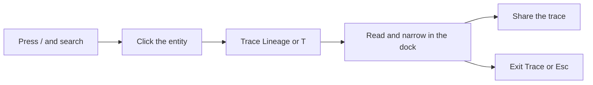

# Tracing Lineage on the Canvas

*For Viewers, and anyone investigating a data question.* A **trace** follows the
lineage of an entity as far as it goes: everything that feeds it (upstream) and
everything it feeds (downstream) — its blast radius. This page shows you how to
find an entity inside a view, trace it (or several at once), narrow and read the
result, and hand the trace to someone else as a link.

> **Before you start:** open a view from the [Explorer](/guide/browsing-views).
> The steps below are for a **Context View**, the canvas with one column per
> layer; [Graph and Hierarchy views](#trace-on-a-graph-or-hierarchy-view) trace
> a little differently. If **Trace Lineage** and **Focus Lens** are missing from
> the view's header, your administrator has turned off **Lineage trace** in
> **Administration → Features**.

```tour-explore-lineage
```


```mermaid
flowchart LR
  A["Press / and search"] --> B["Click the entity"]
  B --> C["Trace Lineage or T"]
  C --> D["Read and narrow in the dock"]
  D --> E["Share the trace"]
  D --> F["Exit Trace or Esc"]
```

## Trace an entity

1. In the view, press `/`. The **Search this view…** box in the header takes
   your typing.
2. Type part of the entity's name. When it appears under **Top matches**, click
   it (or highlight it with the arrow keys and press **Enter**). The canvas
   opens whatever the entity sits inside and scrolls to it.
3. Click the entity's row. It's highlighted, and its details panel opens on the
   right.
4. Click **Trace Lineage** in the header, or press `T`. The details panel
   closes to give the trace room, a progress capsule appears at the top of the
   canvas, and the trace dock opens at the bottom.
5. Read the result (next section). When you're done, click **Exit Trace** in
   the header, or press `Esc`. The view comes back exactly as you left it.

> **If you don't see Trace Lineage:** if it reads **Loading lineage…**, the view
> is still loading, so wait a moment. If it's greyed out, select an entity
> first (with nothing selected, it opens your trace history instead, once you
> have one). If it's missing altogether, see *Before you start* above.

You can start a trace from other places too:

| From | Do this | It traces |
| --- | --- | --- |
| The header | Select an entity, then **Trace Lineage** (or press `T`) | Both directions |
| The right-click menu | Right-click a row, then **Trace Lineage** | Both directions |
| The details panel | **Root Cause** (Trace Upstream), **Impact** (Trace Downstream) or **Full Lineage** (Both Directions) | The direction you pick |
| The row itself | Hold Shift and double-click the row | Both directions |
| Your trace history | Click the arrow beside **Trace Lineage**, then a row under **Pick up where you left off** | As you left it |

## Read a trace

A trace walks the whole flow for you. There is nothing to click to keep it
going and no "load more".

- **The capsule** at the top says where the walk stands: **Focus · Picture ·
  Flows · Drawn**, with the nodes, flows and requests counting up and *N more
  to go* while the data source still owes steps. **Cancel** stops the trace.
  When it finishes, it says **Complete** and goes away.
- **The columns** now show only what is on this lineage: the entity you traced,
  what feeds it, what it feeds, and the containers they sit in, each in the
  layer the view puts it in. The way to each partner is opened for you; the
  partners themselves stay closed and show **N on this lineage** (or **≈N
  flows** while their exact flows are still arriving). Open one to see its rows.
- **The trace dock** at the bottom names the direction you're reading
  (**Root Cause**, **Impact** or **Full Lineage**), the traced entity, and how
  many entities lie upstream (↑) and downstream (↓).

Tracing a table follows all of its columns, so you see every partner of any of
its columns at once. Partners the view can't place in any of its layers are
counted, not drawn: expand the dock and its **Overview** tab says how many
sources lie *outside this view*.

**Very large flows.** After about 20,000 nodes the walk pauses once and the
capsule says *This flow is larger than N nodes* and *Loading the rest may slow
this browser*. Click **Continue** to draw the rest. If a step fails at the data
source, the capsule says *Part of the lineage could not be loaded* and offers
**Try again**; everything already drawn stays.


## Narrow a trace by direction and depth

A trace always walks both directions, so narrowing it is instant and never
fetches anything again.

- **Direction:** in the dock, use the three arrow buttons: **Upstream only**,
  **Both directions** and **Downstream only** (hover for their names). The
  dock's label changes to **Root Cause**, **Full Lineage** or **Impact** to
  match.
- **Depth:** click **Depth** in the header. In **Trace settings**, set how many
  hops to draw on each side (0 to 25) with the **Upstream** (Root Cause) and
  **Downstream** (Impact) sliders, or pick a preset: **Direct** (1), **Nearby**
  (5) or **All hops** (25). A side set to 0 is hidden. The dock's **Settings**
  tab has the same **Upstream depth** and **Downstream depth** sliders.
- **Detail:** open or close containers to move between columns, tables and
  bigger groupings; there is no separate level setting (see
  [Changing the level of detail](/guide/reading-lineage#changing-the-level-of-detail)).
- **Kinds of flow:** in the **Flows** panel (bottom right), hide a kind of flow
  with its eye icon, or choose **Show only this type**.

Press `⌘I` / `Ctrl-I` (or click **Expand**) to open the dock's tabs —
**Overview**, **Drilldowns** and **Settings** — and again (**Compact**) to fold
it away.

## Trace several entities at once

1. Click the first entity's row.
2. Hold `⌘` (Mac) or `Ctrl` (Windows) and click each extra entity, or hold
   Shift and click to add a range. Prefer plain clicks? Click **Select** in the
   header (it changes to **Selecting**), then click rows.
3. A bar appears at the bottom of the canvas, naming what you've selected
   (*N entities*) and how much feeds it and flows from it.
4. Click **Trace all N** in the bar, **Trace N Entities** in the header, or
   press `T`. One trace follows all of them together.
5. In the dock, the chip reads **Tracing N entities**. Click it to see the list,
   and click **×** (**Remove from the trace**) to drop one without starting
   again.

- The first 25 entities are traced. Select more and a message says *Tracing the
  first 25 of N selected entities.*
- A trace of several entities can't be shared as a link: the dock has no
  **Share** button for it, and it has no link icon in your trace history.
- **Focus all N** in the bar (or `F`) opens the
  [Lineage Lens](/guide/lineage-lens) on the selection as a whole.
- **Clear** in the bar empties the selection.


## Handing a trace to someone else

A trace is usually an answer to somebody's question — *what feeds this
dashboard*, *what breaks if I drop this column* — so you can hand it over as a
link rather than a screenshot.

1. In the trace dock, click **Share**. The **Share this trace** panel names the
   entity, the direction and the hop limits the link will carry.
2. If you've opened cards, choose whether the link carries them with **Include
   the open cards** (on by default).
3. Click **Copy link**. It changes to **Link copied**.

| Include the open cards | What your reader lands on |
| --- | --- |
| On (default) | *They land on your exact picture* — the containers you opened, the rows you drilled into |
| Off | *They land on it as it first draws* — the same question, drawn the way a fresh trace opens |

> **If your browser blocks the clipboard:** the panel shows the link with *copy
> it by hand* — select it and copy it yourself.

Opening the link starts the trace on your reader's own canvas, so **it re-runs
against today's lineage** — it is a question, not a frozen snapshot, and it takes
as long as that trace takes. Anyone who can open the view can open the trace;
nobody else can. The trace also joins your reader's own trace history, so it's
one click away after they close it.

To share a trace you ran earlier without opening it again, click the arrow
beside **Trace Lineage** and, under **Pick up where you left off**, click the
link icon on its row (**Copy a link to this trace**).

## Go back to an earlier trace

Your traces in each view are remembered, per view, in this browser:

- **← / →** in the dock move to the previous or next trace in this view.
- **Recent** in the dock lists your recent traces; click one to reopen it, or
  **Clear** to empty the list.
- The arrow beside **Trace Lineage** opens **Pick up where you left off**: click
  a row to run that trace again, or **Clear history**.

## Focus on one entity with the Lineage Lens

When an entity has too many connections to read on the columns, open the
**Lineage Lens**: a full-screen board of just that entity's lineage, sources on
the left and consumers on the right, grouped by the containers they share. Select
the entity and press `F`, click **Focus Lens** in the header, choose **Focus
Connections** from the right-click menu, or click **Focus** in its details panel.
A trace draws the lineage in the view's own columns; the Lens gives one entity
the whole screen. Full walkthrough:
[The Lineage Lens & Context View](/guide/lineage-lens).

## Change how lines are drawn

**Display** in the header changes how the canvas is drawn, for you only — never
the view itself.

| If you want to… | In **Display**, set… |
| --- | --- |
| See lines without hovering | **Edge Density** to **Adaptive** (strongest flows stay visible) or **All Edges**. **On Hover** is the default |
| Draw more or fewer lines on a busy view | The **Edge Budget** slider (**Lines per entity** in On Hover), from 100 to 2,000 |
| Hide the arrowheads | **Direction → Arrow markers** off |
| Change the upstream and downstream colours | **Appearance → Lineage colours**: pick a preset, or set **Incoming** and **Outgoing** yourself |
| Stop the off-screen partner lists opening | **Appearance → Off-screen partners** off (a small hint shows instead) |
| Hide alerts about links to entities outside the view | **Missing Connections → Missing-link alerts** off |
| Make rows, icons and badges smaller | **Canvas → Density** (**Compact**, **Comfortable** or **Spacious**) and **Display options** |

The lineage settings work only while **Lineage** in the header is on; when it's
off, the menu says *Turn on Lineage to adjust edge appearance*. A trace draws
every line it walks, whatever **Edge Density** is set to.


## Sort the entities in a column

Each column header has a sort button. Click it to open **Sort nodes**:

- **View default** (named in brackets, for example *A → Z*), **A → Z**,
  **Z → A**, **By type** and **Most children** reorder the column straight
  away.
- Outside a draft, your choice applies only to you, on this device: the menu
  says *Only on this device · not saved to the view*.
- **Custom order**, **Apply to all layers** and **Reset custom order** change
  the view for everyone, so they work only in a draft (see
  [Editing in a Draft](/guide/editing-in-a-draft)).

A **Custom** chip in a column header means the layer uses a hand-arranged order.
If there's no sort button, your administrator has turned off **Node sorting
controls**; saved orders still show.

## Find things in this view or anywhere

| Press | What it searches | Use it to |
| --- | --- | --- |
| `/` | The entities in the view you're on | Jump to a table, column or dashboard on this canvas. See [Advanced Search](/guide/advanced-search) |
| `⌘K` / `Ctrl-K` | Pages, views, workspaces, data sources, templates, semantic layers, settings and docs | Jump somewhere else in {brandShort}. It never searches the data inside a view |

## Trace on a Graph or Hierarchy view

Click a node to open its details panel, then click **Root Cause**, **Impact** or
**Full Lineage**. A trace toolbar appears at the top of the canvas with the same
three choices (**Root Cause**, **Impact**, **Full**), buttons to show or hide
each side, **Trace settings** for depth and options, and **Exit**. The trace
dock, tracing several entities at once, trace links and the Lineage Lens are
Context View features.

## Keyboard shortcuts on a Context View

| Key | What it does |
| --- | --- |
| `/` | Jump to **Search this view…** |
| `T` | Trace the selected entity, or all selected entities |
| `F` | Open the Lineage Lens on the selection |
| `⌘`/`Ctrl` + click | Add an entity to the selection |
| Shift + click | Add a range to the selection |
| `⌘I` / `Ctrl-I` | Expand or compact the trace dock (during a trace) |
| `Esc` | During a trace, close any open popover, then leave the trace |
| `⌘0` / `Ctrl-0` | Fit every layer into the window width |

## Where to next

- [Reading Lineage](/guide/reading-lineage) — when you want to know what the
  rows, lines and roll-ups in a trace mean.
- [The Lineage Lens & Context View](/guide/lineage-lens) — when one entity has
  more connections than the columns can show.
- [Advanced Search](/guide/advanced-search) — when you want every match in a
  view, not just one entity.
- [Creating Views](/guide/creating-views) — when your investigation deserves a
  view of its own that you can share.
