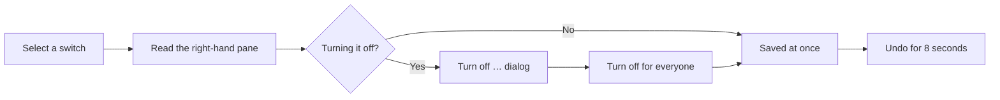

# Feature Switches

*For Administrators.* Turn whole capabilities on or off for everyone in your
deployment — editing, tracing, exports, sign-up, Analytics and more — and know
who will notice before you do. This page shows you how to change a switch
safely, then describes all 28 switches on **Administration → Features**.

> **Before you start:** You need the **Super admin** role (the `system:admin`
> permission). Nobody else sees **Features** under **Administration**, and the
> server refuses changes from anyone else.

---

## Change a switch

1. In the sidebar, select **Administration**, then **Features** (under
   **System**). The **Features** page opens. At the top, **This deployment**
   says how many features are available to your users — for example
   **17 of 28 features available to your users** on a deployment where nothing
   has been changed.
2. Find the switch in the list on the left. Switches are grouped by category;
   to filter them, type in **Search features…**.
3. Select the switch's name. The right-hand pane explains it: what it does,
   **What changes** (**When it's on** and **When it's off**, with the one in
   force marked **right now**), **Still works when it's off**, **Worth
   knowing** and, for some switches, **Only works while these are on**.
4. Use the toggle in the switch's row, or the one at the top of the right-hand
   pane.
   - Turning a switch **on** saves straight away.
   - Turning a switch **off** opens the **Turn off <name>?** dialog first.
5. If the dialog opened, read it, then select **Turn off for everyone** — or
   **Keep it on** to back out. The dialog shows **What your users lose**,
   **This also stops** (switches that depend on this one), **In your estate,
   right now** (a count of what it touches, or *We can't measure this one*
   where no honest count exists) and **Still works**.
6. Check the result. A notification says, for example, **Version control —
   turned off**, with **Undo** for 8 seconds. The pane now reads **Turned off
   for everyone**, and under the switch: *Turned off by <your name> · <time>*.

**View modes** is a list rather than an on/off switch: under **Which ones
people can use**, select a layout to withdraw it or bring it back. At least
one must stay available, and the row shows how many are on (for example
**3 of 4**).

> **If you don't see Features under Administration:** your account doesn't
> hold the Super admin role. Ask a Super admin to make the change, or to grant
> you the role in [Users & Access](/guide/users-access).

> **Note:** An **Early access** notice may sit at the top of the page. Its
> default text says some options aren't wired up yet — that text is out of
> date: every switch on this page does what the page says. Select **Turn off**
> on the notice to shrink it to a one-line reminder (**Turn on** brings it
> back), or **Edit notice** to reword it.

---

## What people see after a change, and how fast

| Who | When they see the change |
| --- | --- |
| You, in the tab you made it in | Immediately. |
| The server | Immediately on the server process that saved the change. Other server processes keep switch values for up to 30 seconds, so allow half a minute for the change to apply on every server. |
| Everyone else | Their browser checks when the product loads, whenever they switch back to its tab, and every minute while it stays in view — so the change reaches them within about a minute and a half at most. Nobody needs to reload. |

Turning a switch off makes a capability unavailable; it never deletes
anything. Turning it back on restores the capability as it was.

If someone tries something you have just turned off — say, from a tab that
hasn't caught up yet — the server refuses it, and they see an **Access
denied** card whose text names what is turned off.
[Messages people see when a switch is off](#messages-people-see-when-a-switch-is-off)
helps you match a report to a switch.

---

## Before you turn something off

> **Tip:** Every switch acts on everybody at once, and the person who notices
> is rarely you. Before you confirm:
>
> - Read **In your estate, right now** in the dialog — it counts what the
>   switch would touch on *your* deployment (for example, how many invite
>   links are still live).
> - Read **This also stops**. Some switches only work while another is on, so
>   one change can quietly silence two.
> - Warn people first with a banner from **Administration → Announcements**
>   (see [The Admin Console](/guide/governance-ops)).
> - Prefer the narrowest switch that solves your problem. To protect a
>   struggling graph store, **Lineage trace** is a smaller step than **Version
>   control**.
> - Missed the 8-second **Undo**? Turn the switch back on — nothing was
>   deleted.

---

## Read the page at a glance

The bar under **This deployment** splits every switch into four states. Select
a state in the legend to jump to a switch in it.

| Legend | Meaning |
| --- | --- |
| **Available** | On, and working for everyone with permission to use it. |
| **Limited** | A list switch (**View modes**) with some options withdrawn. |
| **Turned off** | Off — your users can't do this. They're also named in the *Your users cannot…* line under the bar. |
| **No effect** | Switched on, but something it depends on is off, so it does nothing. They're also named in the *On, but having no effect:* line. |

Badges in the right-hand pane tell you how a switch behaves:

| Badge | Meaning |
| --- | --- |
| **Enforced by the server** | Turning it off doesn't just hide a button — the server refuses the request. |
| **Not enforced — the endpoint still answers** | The switch only changes what the browser shows. On a new deployment the summary says **3 switches are not enforced**: **Guided product tours** and **Fold distant layers**, which only change the screen, and the retired **Roll up lineage to unloaded entities**. |
| **Security setting** | If the setting can't be read, the more restrictive answer is assumed. |
| **Preview — still being built** | A preview that ships off. Turning it on exposes unfinished work to everyone. |
| **Being removed** | On its way out. Don't rely on it. |

Under each switch, *Turned off by … · …* says who last changed it and when;
*Never changed — this is the shipped default.* means nobody has.

---

## Reset every switch to its default

1. Select **Reset to defaults** at the top of the page. The **Reset to
   defaults** dialog asks *Reset all features to their default values? This
   cannot be undone.*
2. Select **Reset**. A **Saved** notification appears and every switch returns
   to the default in the tables below.

---

## Two settings this page can't change yet

**What everyone can see** (Analytics) and **Publishing views to everyone**
are choices between levels, not on/off switches. The page lists each one with
a switch that reads on, but it has no control for picking a level, and turning
it off is refused with an error. Both keep their defaults — **Show colleagues**
and **Workspaces decide** — until someone changes them through the features
API, which needs the same Super admin role (see [API features](/docs/api-features)).

---

## All switches

Grouped as on the page. **Key** is the switch's name in the API and
configuration — it isn't shown on screen, but it's what your platform team
will ask for.

### Editing

| Switch (key) | Default | What it does | When it's off, who notices | Read more |
| --- | --- | --- | --- | --- |
| **Edit mode** (`editModeEnabled`) | On | Lets people change the data itself: edit entities and their properties in a draft of a view, then publish the draft. A data source without version control stays read-only. | Everyone who edits. Views become read-only, edit controls disappear from the entity drawer and the canvas, and the server refuses node and edge changes. Reading, filtering and exporting keep working. | [Editing in a Draft](/guide/editing-in-a-draft) |

### View Modes

| Switch (key) | Default | What it does | When it's off, who notices | Read more |
| --- | --- | --- | --- | --- |
| **View modes** (`allowedViewModes`) | All four: **Graph**, **Hierarchy**, **Context View**, **Layered Lineage** | Chooses which layouts a new view may use. | People building views. A withdrawn layout disappears from the View wizard and the server refuses new views in it. Views already built in it keep working and stay editable. | [Creating Views](/guide/creating-views) |

> **Note:** The View wizard builds **Graph**, **Hierarchy** and **Context
> View** views. **Layered Lineage** only governs older views of that type. If
> you leave it as the only layout on, the wizard still shows its three layouts
> and the server refuses the new view.

### Authentication

| Switch (key) | Default | What it does | When it's off, who notices | Read more |
| --- | --- | --- | --- | --- |
| **Self-registration** (`signupEnabled`) | Off | Lets anyone who reaches the sign-in page create their own account. | Strangers. The create-account link disappears and the server refuses registration. Invited people can still register, and everyone signs in as normal. | [Users & Access](/guide/users-access) |
| **Invite links** (`inviteLinksEnabled`) | On | Lets admins create shareable sign-up links that carry a role and group assignments. | Admins can't create links (**Invite by Link** disappears from **User Management**), and every link already sent stops working at once. Outstanding links stay listed so you can review and revoke them; turning this back on revives any that haven't expired. Use it as a kill switch when a link leaks. | [Users & Access](/guide/users-access) |

### Lineage

| Switch (key) | Default | What it does | When it's off, who notices | Read more |
| --- | --- | --- | --- | --- |
| **Version control** (`versioningEnabled`) | On | Drafts, reviews, publishing, history and rollback for data sources — the whole change workflow. | Everyone who edits or reviews. Every version-control surface is hidden and canvases become view-only: no drafts, reviews, publishing or blank models. History is kept, background sync of versioned data keeps running, and turning it back on restores everything. The widest switch on the page. | [Versioning & Change Control](/guide/versioning-change-control) |
| **Lineage trace** (`traceEnabled`) | On | Follows a node's lineage upstream and downstream, from the graph and the Context View. | Everyone who traces. The **Trace Lineage** button disappears from the view's toolbar and the server refuses trace requests. People can still browse and expand the graph by hand. | [Tracing Lineage on the Canvas](/guide/exploring-graph) |

### Semantic Layers

| Switch (key) | Default | What it does | When it's off, who notices | Read more |
| --- | --- | --- | --- | --- |
| **Edit semantic layers** (`semanticLayerEditMode`) | On | Create, change and delete semantic layers. | Everyone, admins included. The layer editor opens read-only and the server refuses create, update, delete, new versions and imports. Publishing, cloning and exporting still work. | [The Semantic Layer](/guide/semantic-layer) |
| **Let non-admins edit layers** (`semanticLayerNonAdminEditing`) | On | Lets people who aren't Super admins or Org admins edit layers, if they hold the permission to manage them. | Workspace admins and data engineers. Their edit controls are hidden and the server refuses their changes. Has no effect while **Edit semantic layers** is off. | [The Semantic Layer](/guide/semantic-layer) |
| **Import layers** (`semanticLayerImportEnabled`) | On | Brings a layer in from an exported JSON file, as a new layer or a new version. | People importing. **Import JSON** disappears from a layer's menu and the server refuses uploads. The editor and exporting still work. Does nothing while **Edit semantic layers** is off. | [The Semantic Layer](/guide/semantic-layer) |
| **Export layers** (`semanticLayerExportEnabled`) | On | Downloads a semantic layer as JSON. | People exporting. **Export JSON** disappears from a layer's menu and the server refuses the download. Reading and editing are unaffected. | [The Semantic Layer](/guide/semantic-layer) |
| **Suggest from graph** (`semanticLayerAutoSuggest`) | On | Scores existing layers against a connected data source, so onboarding can recommend the best fit. | People onboarding data. The suggestion step and match percentages disappear from the onboarding and data-source wizards, and layers are chosen by hand. | [The Semantic Layer](/guide/semantic-layer) |
| **Layer history & audit** (`semanticLayerVersionHistory`) | On | Shows every past version of a layer and who changed what, when. | Everyone. The history and audit tabs disappear and the server refuses them. Versions are still kept and recorded, and come back when you switch this on. | [The Semantic Layer](/guide/semantic-layer) |

### Data Governance

| Switch (key) | Default | What it does | When it's off, who notices | Read more |
| --- | --- | --- | --- | --- |
| **Export graph data** (`graphExportEnabled`) | On | Lets people download lineage data — a graph's nodes and edges — as a file. | Everyone who exports. Export controls disappear and the server refuses every export and download. Files already downloaded aren't recalled. If you're closing exports for confidentiality, also turn off **Export layers**. | [Import & Export](/guide/import-export) |
| **Publishing views to everyone** (`enterpriseViewPolicy`) | **Workspaces decide** | A ceiling on how far a workspace may open publishing (**Enterprise** visibility): **Workspaces decide**, **Always require approval** or **Not available**. | View owners and publishers. With **Always require approval**, people can only ask and a publisher answers; with **Not available**, Enterprise is withdrawn from new work. Published views keep working and can always be unpublished. See [Two settings this page can't change yet](#two-settings-this-page-cant-change-yet). | [Who can see a View](/guide/managing-views#who-can-see-a-view) |
| **Build lineage from scratch** (`blankModelsEnabled`) | On | Lets people draw a lineage model by hand, with no data source behind it. | People building views. **Start from blank** disappears from the View wizard and the server refuses to create one. Existing blank models keep working. Needs **Version control** on. | [Creating Views](/guide/creating-views) |
| **View versions, import and export** (`viewPortabilityEnabled`) | Off (preview) | A view's design history people can compare and restore, and moving views between environments as files. **Export views** and **Import views** decide which directions are allowed. | Everyone. Versions, Export and Import disappear from views, the Explorer and the View wizard, and the server refuses them. Versions keep being recorded, so turning this on later shows each view's whole history. | [Import & Export](/guide/import-export) |
| **Export views** (`viewExportEnabled`) | On | Downloads a view's design — layers, assignments and settings — as a file. Does nothing while **View versions, import and export** is off. | People exporting views. Export actions disappear and the server refuses to build the file. Files already downloaded aren't recalled. | [Import & Export](/guide/import-export) |
| **Import views** (`viewImportEnabled`) | On | Brings a view in from another environment's file, checks it against a data source here, and creates or updates a view. Does nothing while **View versions, import and export** is off. | People importing views. The import journey disappears from the View wizard, the Explorer and the workspace Views manager, and the server refuses uploads. | [Import & Export](/guide/import-export) |

### Display & UI

| Switch (key) | Default | What it does | When it's off, who notices | Read more |
| --- | --- | --- | --- | --- |
| **Node sorting controls** (`nodeSortingEnabled`) | On | Lets people choose how nodes are ordered in a Context View layer — alphabetical, by type, by size, or a custom order dragged into place in a draft. | People curating Context Views. The per-layer sort menu and drag-to-reorder disappear. Orders already saved still show exactly as curated. | [The Lineage Lens & Context View](/guide/lineage-lens) |

### Notifications

| Switch (key) | Default | What it does | When it's off, who notices | Read more |
| --- | --- | --- | --- | --- |
| **Announcements** (`announcementsEnabled`) | On | Shows announcement banners to everyone. | Everyone. Banners stop appearing because the server serves none. Your announcements are hidden, not deactivated, and return when you turn this back on. | [The Admin Console](/guide/governance-ops) |

### Analytics

| Switch (key) | Default | What it does | When it's off, who notices | Read more |
| --- | --- | --- | --- | --- |
| **Analytics for everyone** (`analyticsPublicEnabled`) | Off | Opens a redacted Analytics section to every signed-in person. | Everyone without an Analytics permission: **Analytics** disappears from their sidebar and the server refuses them. Super admins, Org admins and Org auditors keep the full section either way. | [Analytics](/guide/analytics) |
| **What everyone can see** (`analyticsPrivacyMode`) | **Show colleagues** | How much people without an Analytics permission see: **Aggregate only**, **Show colleagues** or **Show colleagues and operations**. | A level, not a switch — see [Two settings this page can't change yet](#two-settings-this-page-cant-change-yet). If the value can't be read, Analytics falls back to aggregate only. | [Analytics](/guide/analytics) |
| **Show every workspace in Analytics** (`analyticsWorkspaceVisibility`) | Off | Reports every workspace's name and figures in Analytics, including workspaces the reader isn't in. Reporting only — it never grants access. | People without an Analytics permission: workspaces they aren't in appear as locked rows, counted in the totals with their name and figures hidden. | [Analytics](/guide/analytics) |
| **Let people contact each other from Analytics** (`analyticsShowEmailAddresses`) | Off | Shows a colleague's email address beside their name, where they're attached to something the reader can already open — never on the platform-wide activity ranking. | People without an Analytics permission: names still appear (depending on **What everyone can see**); addresses don't. | [Analytics](/guide/analytics) |

### Experimental

| Switch (key) | Default | What it does | When it's off, who notices | Read more |
| --- | --- | --- | --- | --- |
| **Guided product tours** (`toursEnabled`) | Off (preview) | Offers new users an in-product walkthrough and lets anyone replay it from **Help**. | Nobody loses anything: no tour is offered and **Take a tour** is hidden. Help and every guide stay available. | [Welcome](/guide/welcome) |
| **Fold distant layers** (`canvasLayerFoldEnabled`) | Off (preview) | Offers a **Fold** button on the Context View when a view is wider than the screen, so layers outside the part being read fold into slim spines. Each person still chooses whether to fold. | People reading wide Context Views. Every layer stays full width and wide views scroll sideways; folding one layer from its header still works. | [The Lineage Lens & Context View](/guide/lineage-lens) |
| **Roll up lineage to unloaded entities** (`canvasLineageRollupEnabled`) | Off | Retired: nothing reads it, so it has no effect either way. A line to an entity the canvas hasn't loaded always rolls up to the nearest container on screen. | Nobody. It shows **Being removed** and will be removed in a later release. | — |
| **One placement rule for every view surface** (`placementContractEnabled`) | Off (preview) | Uses one shared rule to decide which layer each entity sits in, everywhere views place entities — the canvas, the View wizard's preview, trace lanes, search badges, edit mode and view imports — so they can't disagree. | Off keeps today's placement, including its known disagreements. Saved views aren't changed either way. While it's on, creating a view or saving its layers refuses a layer rule that can never match. Ask your platform team to run the placement dry run before you turn it on. | [Navigating Layers](/guide/navigating-layers) |

---

## Messages people see when a switch is off

When a switch stops someone who is signed in, the server refuses the request
and they see a floating card at the bottom of the screen headed **Access
denied**, with the server's message as its text (it closes by itself after a
few seconds). The heading says *access*, but nothing is wrong with their
permissions — the switch is what stopped them.

People without an account see it differently. With **Self-registration** off,
the sign-up page simply returns them to the sign-in page. With **Invite links**
off, an invitation link says *Invite links are turned off for this deployment.
Ask an administrator to set up your account.*

> **Note:** When the refused action belongs to a workspace, the same card also
> offers **Request access**. Requesting workspace access can't help with a
> switched-off feature; only turning the switch back on can.

Match a reported message to its switch:

| The message starts with… | Switch |
| --- | --- |
| "Publishing views to everyone is turned off for this deployment." | **Publishing views to everyone** |
| "Version control is turned off for this deployment." | **Version control** |
| "Lineage tracing is turned off for this deployment." | **Lineage trace** |
| "Editing is turned off for this deployment, so views are read-only." | **Edit mode** |
| "Self-registration is turned off. Ask an administrator for an invitation." | **Self-registration** |
| "Invite links are turned off for this deployment." | **Invite links** |
| "That view type is not available in this deployment." | **View modes** |
| "Exporting graph data is turned off for this deployment." | **Export graph data** |
| "View versions, import and export are a preview that is turned off for this deployment." | **View versions, import and export** |
| "Exporting views to a file is turned off for this deployment." | **Export views** |
| "Importing views from a file is turned off for this deployment." | **Import views** |
| "Building a lineage model from scratch is turned off for this deployment" | **Build lineage from scratch** |
| "Semantic layers are read-only for this deployment." | **Edit semantic layers** |
| "Only administrators can change semantic layers in this deployment." | **Let non-admins edit layers** |
| "Importing semantic layers is turned off for this deployment." | **Import layers** |
| "Exporting semantic layers is turned off for this deployment." | **Export layers** |
| "Suggesting a semantic layer from the graph is turned off for this deployment." | **Suggest from graph** |
| "Semantic layer history is hidden for this deployment." | **Layer history & audit** |
| "Analytics isn't open on this deployment" (a page, not a message) | **Analytics for everyone** |

Most messages end by saying an administrator can change it under **Admin →
Features** — that's **Administration → Features** in the sidebar.

---

## Where to next

- [Analytics](/guide/analytics) — when you want to see what the four Analytics
  settings mean for the people reading it.
- [Users & Access](/guide/users-access) — when you want to manage sign-up,
  invitations and who holds the Super admin role.
- [The Admin Console](/guide/governance-ops) — when you want to announce a
  change before you make it.
- [Feature flags lifecycle](/docs/feature-flags-lifecycle) — when an engineer
  needs to add, wire or retire a switch.
