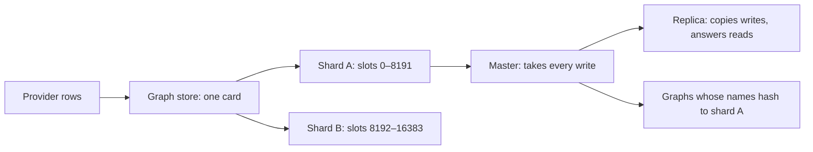

# The Graph Store: Shards, Replicas & Placement

*For Administrators.* **Administration → Graph store** shows every node of
every graph store {brand} talks to — masters and replicas — with what each one
holds, how far behind its replicas are, which data source owns each graph and
how much of the read load the view cache absorbs. This page shows you how to
check it at a glance, what every figure means, and what to do when one looks
wrong. Commands and deployment settings are collected in
[For operators](#for-operators) at the end.

> **Before you start:** You need the **Super admin** role. **Graph store**
> appears under **Administration → System** only for Super admins, and so do
> **Adjust limits** and **Rebuild cache**.




---

## Check the graph store at a glance

1. In the sidebar, select **Administration**, then **Graph store**. The strip
   of totals sits at the top, with *Measured <time> ago · refreshes every
   30s* beside **Re-measure**.
2. Check **Nodes answering**. Any node that didn't answer is listed in red
   near the top of the page.
3. Below the **View cache** card, find your store. With one store it opens
   straight away; otherwise select it from the list of stores.
4. Read the store on **Replication** (where you land), **By shard** or **All
   nodes**. If anything is wrong, a line says *N replication findings below*.
5. To take a fresh reading now, select **Re-measure**.

> **If the page says "No graph store is configured yet":** add a provider
> under **Ingestion → Providers** — see
> [Data Freshness & Ingestion](/guide/data-freshness).

> **If you see "Last refresh failed — showing the reading from …":** the
> latest measurement didn't finish; the figures shown are the last good
> reading. Select **Re-measure** to try again.

### The shape of a graph store

A FalkorDB graph lives entirely on **one node**. A cluster spreads graphs
across nodes; it never splits one. Three ideas follow, and the page is built
on them:

- **Slots.** A cluster divides the keyspace into 16,384 slots. A graph's name
  hashes to exactly one slot, so its home is decided by its *name*, not by
  where it was created.
- **Shards.** Each shard owns a range of slots. Every key in that range lives
  on the shard's **master**, which serves it and takes every write.
- **Replicas.** A master's replicas copy its writes and stand ready to be
  promoted if it goes away. They hold the same data and use the same memory.

**Slot coverage** below 16,384 means some slots have no master right now —
usually a master is down and no replica has been promoted yet. Keys in those
slots can't be read or written until one is.

### One card per store

The page groups by **store**, not by provider row, because memory, nodes,
slots and replication belong to the servers. Provider rows that point at the
same store share one card, titled with all their names, and a line under the
heading says so. {brand} decides this by asking the nodes what they call
themselves, not by comparing connection settings — two rows can list
different seeds of one cluster. Without this, every figure on a shared store
would be counted once per row.

The graph inventory stays per provider: each graph on a shard card names the
data source that owns it.

---

## Read the page

### The strip at the top

| Figure | What it means |
| --- | --- |
| **Graph stores** | Distinct stores, and how many provider rows point at them. Rows sharing a store count it once. |
| **Master shards** | Slot-range owners across all stores. |
| **Replicas** | Copies standing by. Zero means a node failure takes that shard offline until it comes back. |
| **Nodes answering** | How many nodes replied to this reading. Anything below the total is listed in red near the top. |
| **Data on masters** | Memory used on the masters — the size of the data itself — against their ceilings. Each replica holds its own copy, so the deployment needs this figure times one plus the replicas per shard. |
| **Graphs** | Graph keys found, and how many no data source claims. |

### The three views of a store

- **Replication**: every master and the replicas behind it. Each master sits
  on a tile coloured by its health, with its slot range, its memory against
  its ceiling and how many more rollup edges it fits. Its replicas hang off
  it, each naming the master it follows, its link status and how far behind
  it is. A master with *no* replica says so in amber — if it goes away,
  nothing can be promoted. A master that isn't answering says that its
  replicas are carrying the reads.
- **By shard**: the same nodes, plus the capacity arithmetic and every graph
  on the shard, searchable.
- **All nodes**: one row per node — the quick answer to "are they all up?".

**Open in Graph store** on a data source's profile or a provider lands
directly on the store that holds it.

### A shard card

- **Slots a–b** — the range this shard owns.
- **The master row** — address, health, uptime (or *restarted N min ago*),
  round-trip time, a memory meter with the fleet **reserve** marked on it, and
  the node's own limits.
- *fits ~N more rollup edges* — the free memory after the reserve,
  divided by the fleet's bytes per edge. It's the same arithmetic a rebuild
  does before it writes, so the page and the rebuild never disagree. If it's
  small, see [Rollup Capacity](/guide/rollup-capacity).
- **Replica rows**, indented — their link state, how far behind they are, and
  their own memory.
- **The replication line** — how many replicas, how many online, the worst
  lag, and how many **full resyncs** have happened since the master started. A
  full resync is expensive (the master copies its whole dataset to the
  replica), and a count that rises during a rebuild means the replicas can't
  keep up with its writes.
- **The graphs table** — every graph on the shard, the data source that owns
  it, whether it's the source graph or a rollup projection, its edge count and
  its size. A graph marked *not found on the node* is registered to a data
  source but isn't on the shard: never built, or dropped. An **Unregistered**
  graph is on the node but claimed by no data source — usually left over from
  a deleted source — and still uses memory.

### Health words

| Word | Meaning | What to do |
| --- | --- | --- |
| **Up** | The node answered, and its replicas are following it. | Nothing. |
| **Restarting** | It came back recently, or is loading its data. | Wait. Its replicas serve the shard's reads; rebuilds wait and keep their checkpoint. |
| **Behind** | A replica isn't in step with its master. | Look at the lag and the findings. A rebuild paces itself against this. |
| **Unreachable** | It didn't answer. | Check the node. If it's a master, the cluster promotes a replica; until then its slots aren't served. |

**Cannot govern** is different from **Unreachable**: the node answered but has
no memory ceiling (`maxmemory`), so nothing can be measured against it, and
rebuilds landing there fall back to a fixed edge cap.

---

## Act on a finding

Each shard lists what is wrong with its replication, in plain sentences,
with a fix. The findings you may see:

| Finding | What it means | What to do |
| --- | --- | --- |
| *Replicas re-run every rollup write on their main thread (effects threshold N µs).* | Replicas repeat every write instead of applying a change log, and a replica busy re-running a rebuild's writes answers no health check. | Set the effects threshold to `0` with **Adjust limits** (see below), then make it permanent — see [For operators](#for-operators). |
| *Replica … is N behind the master.* | Writes arrive faster than this replica applies them. | If a rebuild is running, it's already pacing itself. Lag with no rebuild running points at the network, or a replica short of CPU. |
| *Replica … has lost its link to the master.* | The replica is disconnected. | Check the replica. It starts a full copy on its own once it reconnects. |
| *Replica … is taking a full copy of the shard.* | A full resync is in progress. | Expect higher memory and disk use on both nodes until it finishes. |
| *… has taken N more full resync(s) since the last reading.* | Replicas keep falling too far behind and starting over. | The replication buffers are too small for the write rate — see [For operators](#for-operators). |
| *… restarted since the last reading.* | The node restarted. {brand} can't see why. | Ask whoever runs the cluster to check why the container stopped — see [For operators](#for-operators). |
| *The replica output buffer on … is N.* | The buffer is under 1 GB; a large rebuild can fill it in seconds and force a full resync. | Raise the replica output buffer — see [For operators](#for-operators). |
| *The cluster calls … a master; the node calls itself a replica.* | A failover is in progress. | Wait a few seconds. If it persists, check the network between the nodes. |

---

## Check the view cache

The **View cache** card, just under the totals, shows how much of the read
load for your current workspace — and its current data source — is answered
from the cache over a recent window of up to two hours (the card names it,
for example *Last 120 min.*). A hit answers in milliseconds; a
miss re-reads the graph, which costs around 55 queries on the replicas that
serve that source. Its hit rate is most of the difference between a view
that opens at once and one that takes seconds.


| On the card | Meaning |
| --- | --- |
| **Served from cache** | The share of reads answered from the cache, with *N of M*. Green from 80%, amber from 40%, red below. |
| **Fell back** | Reads answered from the last good copy because the graph store couldn't answer. Never counted as hits. |
| **Too large** | Answers bigger than the cache's size cap. They are never stored, so every repeat misses too. |
| **Answer size** | The average answer size, against the cap. |
| **Bypassed** | Reads that didn't use the cache — caching is off for that kind of read, or the cache couldn't be reached. |
| One row per kind of read | For example **Opening a view for the first time** or **Expanding a node to see what it contains**, with its average size (flagged **over cap** or **near cap**) and its own hit rate. |

What to do:

| You see | Do this |
| --- | --- |
| A low **Served from cache** just after a restart or a cache rebuild | Nothing — it climbs as people open views. |
| A low **Served from cache** that stays low | Look at **Too large** and **Bypassed** first, then ask whoever runs your deployment. |
| **Too large**, or rows marked **over cap** | Those answers can't be cached. Ask people to narrow what they open, or ask your operators to raise the cap — see [For operators](#for-operators). |
| A **Fell back** count | The graph store couldn't answer for a while. Check the store's nodes and findings below. |
| *Nothing served in this window …* | Nobody opened a view, or the counters haven't been written since a restart. Check again later. |

### Rebuild the cache after an outside change

If something changed a source's graph *without* going through {brand} — a
direct query, an external load, a restore — views can keep showing cached
answers. Changes made in {brand}, and finished rebuilds, already clear the
cache on their own.

1. Make sure the source you want is your current one: the card reports on
   your current workspace and its current data source.
2. On the **View cache** card, select **Rebuild cache**. (It only appears when
   a data source is selected.)
3. The card says *Cleared. The next person to open each view rebuilds it.*

The cost lands on whoever opens each view next, so for a busy source avoid
peak hours. The last good copies are kept, so if the store has an outage,
people still see the last answer rather than an error.

---

## Find where a data source's graph lives

Placement is arithmetic, not a lookup: a graph's name hashes to a slot, and
the slot belongs to a shard. Two things follow:

- A data source in **dedicated projection** mode writes its rollups to a
  *separate* graph, whose name hashes on its own — so its rollups can live on
  a different shard from its source graph. A data source's profile shows both
  under **Where this lives**.
- **Moving a graph to another shard means renaming it.** No command moves one
  graph between shards; its name decides. In practice you rebuild the source
  under a new name, or add memory to the shard it's on.

---

## Who answers a read

A shard's master takes every write. Read-only queries can be answered by its
**in-sync replicas** instead — that's what lets interactive load grow with
the number of replicas, and why reads keep flowing while a master restarts.

A replica answers only when all of this holds; otherwise the master does:

- the provider allows it (**Read queries** in a cluster provider's
  connection settings: **From in-sync replicas (recommended)**, the default,
  or **From masters only**);
- the replica is online and owes the master's write stream no more than
  8 MiB, checked every few seconds per shard;
- this server process hasn't written to that graph in the last 10 seconds, so
  people always see their own changes;
- the replica hasn't just failed a read — a replica that fails sits out for
  half a minute.

A rebuild always reads from the master, because it reads what it has just
written. A query the store refused for its size, or stopped at its own time
limit, is reported as it is rather than retried on the master: it would fail
the same way there.

Each provider's line on **Ingestion → Providers** says what share of its reads
replicas actually answered (*62% of reads from replicas*) once there have
been at least 20 reads. It counts one server process, so it tells you the
routing works, not a fleet-wide total.

---

## What people see while a node is being replaced

A master that goes away is a pause, not an outage:

- Its replicas keep serving the shard's reads. What comes back may be a
  little behind; without them, nothing would come back at all.
- Anything that must go to the master — every write, and every read a rebuild
  makes — fails fast and asks to retry shortly. A view that already shows data
  keeps it, with a **Preparing your graph** note, or on a Context View the
  line *Reconnecting to the graph store — the node holding this graph is
  restarting.* It retries by itself.
- A node being replaced doesn't trip the circuit breaker, so people aren't
  shut out of the whole provider while it happens.
- A rebuild waits for the node, reconnects to it (or to the replica promoted
  in its place) and carries on from its checkpoint. If it gives up, its
  failure names the node and how long it waited — see
  [A rebuild failed](/guide/data-freshness#a-rebuild-failed).

---

## Adjust a node's limits

Each master's row has **Adjust limits**. It opens **Graph store limits** —
the same dialog as on **Infrastructure** — which changes, while the node
runs:

| Field | What it limits |
| --- | --- |
| **Query time cap (TIMEOUT_MAX)** | The longest one query may run, 1–3,600 seconds. Every scan and write timeout is capped by it, and it can't go below the node's own default time limit. |
| **Per-query memory ceiling (QUERY_MEM_CAPACITY)** | What one query may hold at once. Raising it needs the container's memory limit (next two fields). |
| **Effects threshold (EFFECTS_THRESHOLD)** | Whether replicas apply a compact change log (`0`) or re-run each write. Leave it at `0` on any node with replicas. |
| **Container memory limit** | The node's container limit. {brand} can't read it, so you enter it (or your operators prefill it). |
| **Concurrent queries at the ceiling** | How many queries may hold the ceiling at once, for the sizing check. |

1. Select **Adjust limits** on the master. The dialog shows the node's current
   limits.
2. Change the fields you need. For the effects threshold, also tick **Apply
   the same limits on every primary node, not only this one.** — the change
   then goes to every node of the store, replicas included, so a promoted
   replica already carries it.
3. Select **Review change**, check the list of changes, then select **Apply
   now**. A notification says *Graph store limits applied on … — until the next
   restart.*
4. Copy the configuration fragment the dialog shows and pass it to whoever
   runs your deployment, so the change survives a restart (see
   [For operators](#for-operators)).

Raising the memory ceiling is checked against the container's size first;
for the full sizing rule, see
[Rollup Capacity](/guide/rollup-capacity#adjusting-the-graph-stores-own-limits).

---

## For operators

*For whoever runs the graph store.* The deployment-side half of the tasks
above.

**Make a runtime limit change permanent.** A change made with **Adjust
limits** lasts until the node restarts. Add the fragment the dialog hands you
to `FALKORDB_ARGS` — for example `EFFECTS_THRESHOLD 0`. The shipped Compose
file, Kubernetes manifests and Helm chart already include
`EFFECTS_THRESHOLD 0`.

**Full resyncs climbing, or a small replica buffer.** Raise
`client-output-buffer-limit replica` and `repl-backlog-size` on the store. The
page flags a replica output buffer whose hard limit is under 1 GB.

**Why a node restarted.** Kubernetes decides, and {brand} can't read the
reason. Ask the cluster:

```
kubectl get pod <pod> -o jsonpath='{.status.containerStatuses[0].lastState.terminated.reason}'
```

`OOMKilled` means the container limit is too low for the node's `maxmemory`
plus its per-query ceilings; anything else usually means a health probe gave
up while the node was busy.

**There is no "default" graph store.** Every data source belongs to a
provider, so every graph on this page belongs to a provider's store. The
connection in `FALKORDB_HOST` is what the application starts with, not where
anybody's lineage lives.

**Settings behind this page:**

| Setting | Default | What it controls |
| --- | --- | --- |
| `FALKORDB_REPLICA_READ_MAX_LAG_BYTES` | 8 MiB | How far behind a replica may be and still answer reads. |
| `FALKORDB_REPLICA_READ_SETTLE_S` | 10 seconds | How long a server process sends a graph's reads to the master after writing to it. |
| `GRAPH_CACHE_MAX_PAYLOAD_BYTES` | 4 MiB | The largest answer the view cache stores (**Too large** above it). |
| `GRAPH_STORE_TOPOLOGY_CACHE_TTL_S` | 30 seconds | How often the page's measurement refreshes. |
| `FALKORDB_CONTAINER_MEMORY_BYTES` | not set | The container memory limit, prefilled in **Graph store limits**. |

**Why replication is on this page.** A rebuild of a densely connected graph
used to take a whole shard down: replicas re-ran every batch on their main
thread, stopped answering health probes, were restarted, and the rebuild died
— after which the circuit breaker refused every user of that provider with a
message that named no node. Each of those steps is now visible here, and most
are prevented: the effects threshold, the lag, the resync count, the restarts
and which graph is on which node.

For sizing containers and probe tolerances, see the
[FalkorDB deployment guide](/docs/falkordb-deployment).

---

## Where to next

- [Rollup Capacity & Large Graphs](/guide/rollup-capacity) — when a shard is
  filling up or a rebuild won't fit.
- [Data Freshness & Ingestion](/guide/data-freshness) — when you want to
  refresh, rebuild or pause a data source.
- [FalkorDB deployment guide](/docs/falkordb-deployment) — when you size
  nodes and containers.
- [Production cluster overlay](/docs/kubernetes-cluster-overlay) — when you
  run the store as a Kubernetes cluster.
