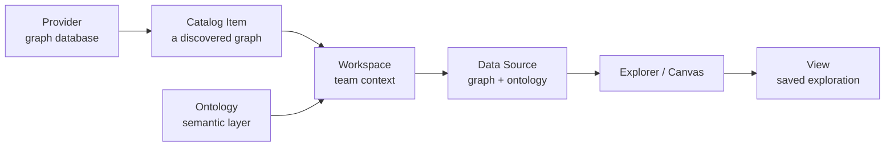

# Key Concepts

{brand} has a small vocabulary. Learn these ten words and the whole platform
becomes predictable. Read top to bottom — each concept builds on the one before.

> **Note:** *The one-sentence model* — A **Provider** holds graphs, which become
> **Catalog Items**, which are bound into a **Workspace** as a **Data Source**,
> interpreted through an **Ontology**, explored on a **canvas**, and saved as a
> **View**.

---

## The data plumbing

### Provider
A **Provider** is a *connection to a graph database* where your lineage data
actually lives — for example a FalkorDB, Neo4j, DataHub, or Spanner instance. It stores
the host, credentials, and health status. You'll only deal with Providers if
you're an administrator; everyone else benefits from them invisibly.

### Catalog Item
When a Provider is connected, {brand} *discovers* the graphs inside it and
registers each one as a **Catalog Item** — a named, governed dataset that can be
shared into workspaces. Think of the catalog as the **shelf of available
datasets** that admins curate.

### Workspace
A **Workspace** is a *team or project context*. It's the unit of isolation: the
people, data sources, and views inside one workspace are kept separate from
others. Open **Workspaces** from the sidebar to see the ones you have access to,
then enter the one you want to work in — each screen shows you which workspace
you're in, there's no separate global switcher to keep in sync. Entering a
workspace changes everything you see on the canvas.

### Data Source
Inside a workspace, a **Data Source** binds a Catalog Item (the graph) to an
**Ontology** (the meaning). It's the *actual thing you explore*. One workspace
can have several data sources.

---

## The meaning layer

### Ontology (the Semantic Layer)
An **Ontology** defines *what your data means*: the **entity types** (e.g.
Domain, Dataset, Table, Column) and **relationship types** (e.g. "feeds",
"contains"), plus the colour and icon for each. It's why a graph from a raw
database becomes a *readable* picture instead of anonymous dots.

- Ontologies are **versioned** — published versions are immutable, so a View
  always renders the same way it did when it was saved.
- They can be **shared** across workspaces, giving your whole organisation one
  consistent visual language.

Learn more in [The Semantic Layer](/guide/semantic-layer).

### Granularity
Real lineage exists at several **levels of detail**. {brand} lets you zoom
between them without losing your place:

| Level | You see… | Best for |
| --- | --- | --- |
| **Column / Field** | individual fields | precise impact analysis |
| **Table / Dataset** | tables and datasets | day-to-day tracing |
| **Domain / Business** | business areas | the executive overview |

Changing granularity is a *lens*, not a new query — the picture re-aggregates
around the same underlying graph.

### Persona toggle (Business vs Technical)
A switch in the top bar re-frames the same graph for a **Business** audience
(domains, products, plain names) or a **Technical** audience (schema fields,
URNs, system detail). Use it to make the same View legible to different
stakeholders.

---

## The things you create

### Lineage
**Lineage** is the network of connections itself — the lines between nodes that
show how data flows. *Upstream* means "where this came from"; *downstream* means
"what this feeds." Tracing lineage is the core activity in {brand}.

### Canvas / Explorer
The **canvas** is the interactive space where the graph is drawn. The
**Explorer** is the open-ended canvas where you search, trace, expand, and
filter freely. See [Exploring the Graph](/guide/exploring-graph).

### View
A **View** is a *saved snapshot of an exploration*: which nodes are shown, the
layout, the filters, the layers, and the granularity. Views are how knowledge is
captured and shared. Each View has a **visibility**:

- **Personal** — just you.
- **Team** — everyone in the workspace.
- **Enterprise** — everyone in the organisation.

You can **favourite** views for one-click access. See
[Browsing Views](/guide/browsing-views) and [Creating Views](/guide/creating-views).

### Context Lens / Layers
A **Context Lens** organises a View's nodes into **layers** (rows or lanes) — for
example by pipeline stage or ownership — so a busy graph reads like a tidy
diagram. You set these up in the **Layer Studio** when creating a view.

---

## Who can do what (access in one paragraph)

{brand} uses **role-based access control (RBAC)**. Every person has a **role** —
typically **Admin**, **User**, or **Viewer** — granted globally or per-workspace.
Roles map to fine-grained **permissions**. On top of that, individual Views can
be **explicitly shared** with specific people. If you ever wonder *"what am I
allowed to do?"*, every user has a **My Access** page that lays it out. Details
in [Users & Access](/guide/users-access).

---

## Quick reference

| Term | In one line |
| --- | --- |
| Provider | A connection to a graph database. |
| Catalog Item | A discovered graph, governed and shareable. |
| Workspace | An isolated team/project context. |
| Data Source | A graph + ontology you actually explore. |
| Ontology | The semantic layer: what your data *means*. |
| Granularity | The zoom level: column → table → domain. |
| Persona | Business vs Technical framing of the same graph. |
| Lineage | The connections showing how data flows. |
| View | A saved, shareable exploration. |
| Lens / Layers | How a view's nodes are organised visually. |

Next: put it into practice with the [Quick Start](/guide/quick-start), or skim
the full [Glossary](/guide/glossary) for every acronym.
