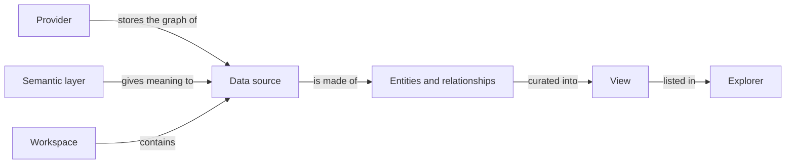

# Key Concepts

*For everyone new to {brand}.*
{brand} has a small vocabulary. This page walks through it in the order the
pieces fit together — from where your data lives, to the views you open every
day, to who can do what — so the rest of the guide reads easily. It explains the
*what* and *why*; each section links to the page that shows you *how*. Every
term is also in the [Glossary & Acronyms](/guide/glossary).

> **Note:** *The model in one sentence* — a **workspace** holds **data
> sources**; each data source is a graph of **entities** joined by
> **relationships** and given meaning by a **semantic layer**; a **view** is a
> curated picture of part of that graph, and the **Explorer** is where you find
> views.

```mermaid
flowchart LR
  P["Provider"] -->|"stores the graph of"| DS["Data source"]
  SL["Semantic layer"] -->|"gives meaning to"| DS
  W["Workspace"] -->|"contains"| DS
  DS -->|"is made of"| E["Entities and relationships"]
  E -->|"curated into"| V["View"]
  V -->|"listed in"| X["Explorer"]
```

---

## Workspaces

A **workspace** is a team's or a project's area in {brand}. It holds that
team's **data sources**, the **views** built on them, and its **members** — the
people and groups who can use it, each with a role. You can belong to several
workspaces and hold a different role in each.

You see the workspaces you belong to. Find them under **Workspaces** in the
sidebar, or on the Dashboard under **Your business areas**.

## Data sources and providers

A **data source** is one graph of your data, attached to a workspace — for
example, the lineage of a data warehouse. A workspace can hold several.

Behind every data source is a **provider**: the connection to the graph
database that stores it — FalkorDB, Neo4j, DataHub or Google Spanner Graph.
Providers are administrator territory: only a Super Admin can register one
(**Ingestion → Providers → Register Provider**). Everyone else simply uses the
data sources built on them. Setting this up is covered in
[Admin Setup](/guide/admin-setup).

## Entities and relationships

Inside a data source, every thing is an **entity** — a domain, a system, a
dataset, a table, a column, a dashboard — joined to other entities by
**relationships**. Every relationship type is marked as one of two kinds (or
both):

| Kind | It means | What you do with it |
| --- | --- | --- |
| **Containment** | A parent holds a child: a schema contains tables, a table contains columns | Open a container to see what's inside it |
| **Lineage** | Data flows from one entity to another: a table feeds a dashboard | Trace it upstream and downstream |

## Views and the Explorer

A **view** is a saved, curated picture of part of one data source: which
entities appear, how they're laid out and grouped, and how they look. Someone
builds a view once — with **New View** in the Explorer — and everyone who can
see it opens it in one click. Views are how a team captures and shares what it
knows.

The **Explorer** (**Explore** in the sidebar) is the catalogue of every view you
can open, across all your workspaces. Search it, filter it by workspace, type,
tag or creator, and see what's **Trending**. You *find* views in the Explorer;
you *work with the data* inside a view.

See [Finding Views (the Explorer)](/guide/browsing-views) and
[Creating Views](/guide/creating-views).

## Three kinds of canvas

A view draws its entities on one of three canvas types, chosen in the
**Layout** step when the view is created. Each view's card in the Explorer says
which one it uses.

| If you want to… | choose… | because it shows… |
| --- | --- | --- |
| read a pipeline from source to consumer | **Context View** — the recommended default | entities sorted into columns you define, with lineage drawn between them |
| explore how things connect | **Graph** | entities and their relationships, positioned freely |
| see what sits inside what | **Hierarchy** | entities nested inside their parents, as a tree you expand and collapse |

[Navigating Layers](/guide/navigating-layers) explains a Context View's columns.

## Lineage: upstream, downstream and tracing

**Lineage** is the web of data-flow relationships. Pick any entity and its
lineage runs two ways:

- **Upstream** — where its data comes from. When a number looks wrong, this is
  where you look for the *root cause*.
- **Downstream** — what its data feeds. This is its *impact*, or *blast
  radius*: everything a change to it would touch.

To **trace** an entity is to have {brand} follow its lineage for you and
highlight the whole chain. Click the entity, then use **Root Cause** (upstream),
**Impact** (downstream) or **Full Lineage** (both) in its details panel — or
right-click it and choose **Trace Lineage**. In a Context View there's also a
**Trace Lineage** button in the header.

Each trace has an **upstream depth** and a **downstream depth**: how many hops
of the chain it shows. Set them low to see only the direct neighbours, high to
see everything the trace found.

How much detail you see also depends on what's open. In a Context View, a
closed container carries the lineage of everything inside it, rolled up onto
the container; open it and its children's own connections appear. The
**Lineage Lens** — a focused view of one entity's connections — adds a
**Density** control (**Overview**, **Grouped** or **Every card**) for how much
it folds together.

> **Admins:** Tracing depends on the **Lineage trace** feature switch, which is
> on by default. With it off, the **Trace Lineage** button disappears and traces
> are refused.

See [Reading Lineage](/guide/reading-lineage),
[Tracing Lineage on the Canvas](/guide/exploring-graph) and
[The Lineage Lens & Context View](/guide/lineage-lens).

## The semantic layer

The **semantic layer** — also called the **ontology** — defines what your data
*means*: the **entity types** (for example Domain, Dataset, Column), the
**relationship types** and whether each is containment or lineage, and the
name, colour and icon each type gets on the canvas. It's why a raw graph reads
as a picture people recognise. A data source is assigned one, and several data
sources can share one, so a whole organisation can speak the same visual
language.

Semantic layers are versioned: changes are drafted and then published as a new
version. Browse them under **Semantic Layers** in the sidebar. See
[The Semantic Layer](/guide/semantic-layer).

## Who can see a view

Every view has a **visibility** — **Private**, **Workspace** or **Enterprise** —
that decides who can open it. A Private view is still open to the people it's
shared with and to the workspace's admins. The full rules, and how to share a
view, are in
[Who can see a View](/guide/managing-views#who-can-see-a-view).

## Who can do what: roles

{brand} uses **role-based access control** (RBAC): your **role** decides what
you can do, and there are two kinds.

**Platform-wide roles** are set on your account by a Super Admin, under
**Administration → User Management**:

| Role | What it lets you do |
| --- | --- |
| **User** | The default. No organisation-wide powers: you work in the workspaces you're added to. |
| **Org Auditor** | See every workspace and the activity log, without changing anything. |
| **Org Admin** | Manage every workspace and create new ones. Doesn't manage user accounts or sign-in (SSO) settings. |
| **Super Admin** | Everything, everywhere — including user accounts, sign-in and platform settings. |

**Workspace roles** are granted per workspace — to you, or to a group you're
in — by that workspace's admins, on its **Members** tab:

| Role | What it lets you do in that workspace |
| --- | --- |
| **Workspace viewer** | Open its views and see its data sources and semantic layers. Read-only. |
| **Workspace member** | Everything a viewer can, plus create, edit and delete views and manage data sources. |
| **Data engineer** | Look after the workspace's data — data sources, semantic layers, catalog and views — without managing its members or settings. |
| **Workspace admin** | Everything in the workspace, including its settings, its members, answering access requests, and deleting it. |

Administrators can also create custom roles, which show up under their own
names.

To see what you can do, click your avatar in the top bar and choose **My
access**: it lists every permission you hold and how you got it. On a
workspace's page, the badge under your name in that same menu shows your role
in that workspace. Missing something you need? See
[Requesting Access](/guide/requesting-access). Administrators manage all of this
in [Users & Access](/guide/users-access).

## Drafts and change control

Data in {brand} isn't edited in place. In a Context View, people allowed to
change data click **Edit** in the header, which opens a private **draft**. Their
changes stay invisible to everyone else until the draft is published — normally
after someone reviews it — and every published change is recorded, so it can be
undone or the graph restored to an earlier point. This is on by default; if your
administrator turns off **Version control**, editing is switched off with it.
See [Versioning & Change Control](/guide/versioning-change-control),
[Editing in a Draft](/guide/editing-in-a-draft) and
[The Review Center](/guide/review-center).

## Business or Technical names

The **Business** / **Technical** switch in the top bar changes how entities are
named, everywhere at once:

- **Business** — the name people use, and nothing else.
- **Technical** — the same name, with each entity's qualified name (or its URN)
  underneath, on the canvas and in the entity's details panel.

It changes labels only: the graph, its lineage and your access stay the same.
The words **Business View** or **Technical View** under the {brandShort} name at
the top left show which one is on, and the `⌘K` / `Ctrl-K` palette can switch
it too (**Switch to Technical View** / **Switch to Business View**).

---

## Quick reference

| Term | In one line |
| --- | --- |
| Workspace | A team's or project's area: data sources, views and members. |
| Data source | One graph of your data, attached to a workspace. |
| Provider | The connection to the graph database behind a data source. |
| Entity | One thing in the graph: a dataset, a table, a column, a dashboard… |
| Relationship | A connection between entities — containment, lineage, or both. |
| View | A saved, curated picture of part of a data source. |
| Explorer | The catalogue of every view you can open. |
| Context View / Graph / Hierarchy | The three canvas types a view can use. |
| Lineage | How data flows between entities. |
| Upstream / Downstream | Where data comes from / what it feeds. |
| Trace | Having {brand} follow and highlight an entity's lineage. |
| Semantic layer (ontology) | What your data means: types, names, colours and icons. |
| Visibility | Who can open a view: Private, Workspace or Enterprise. |
| Role | What you're allowed to do — platform-wide or in one workspace. |
| Draft | A private copy of your changes, invisible until published. |

---

## Where to next

- [Quick Start — Your First 10 Minutes](/guide/quick-start) — when you want to
  try all of this hands-on.
- [Finding Views (the Explorer)](/guide/browsing-views) — when you're ready to
  find your team's views.
- [Reading Lineage](/guide/reading-lineage) — when you want to read a canvas
  fluently.
- [Glossary & Acronyms](/guide/glossary) — when a word trips you up.
