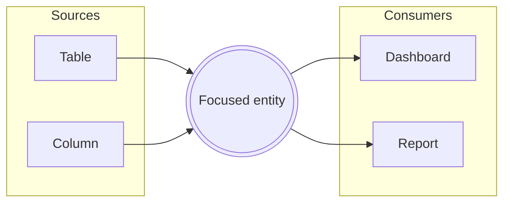

# The Lineage Lens & Context View

*For Viewers.* On a busy canvas, a single entity can have more connections
than you can comfortably read at a glance — and the ones you care about may be
scrolled off-screen or hidden behind the graph's ambient density budget. The
**Lineage Lens** solves this. It's a focused, on-demand view of *one* entity
and everything that touches it — clear, grouped, and searchable — no matter how
large or zoomed-out the canvas is. Think of it as the Context View for a node:
click, and the picture is laid out for you.

Here you'll learn to:

- **Open the Lens** from a dense node, the Anchor Rail, or a curated View.
- **Read its layout** — sources on the left, consumers on the right, the focused
  entity in the middle.
- **Walk a chain** of connections without ever touching the canvas.
- **See lineage beyond a View's boundary** and preview what sits outside it.

## What the Lens shows

The Lens opens as a centered panel over the canvas. The entity you focused sits
in the middle as a highlighted card, with two columns flanking it:

- **Data Sources** (left) — everything **upstream**, the entities your focal
  node draws from.
- **Data Consumers** (right) — everything **downstream**, the entities that
  depend on it.

Data flows **left to right** throughout, so the layout reads the same way the
canvas does. Each side is grouped by **entity type** (tables, columns,
dashboards, and so on) with a count per group, and the focal card shows a quick
tally — how many connections come *in* and how many go *out*. Numbers here
always match the canvas, because the Lens reads the same connections you see on
screen.

## Opening the Lens

There are a few natural ways in:

- When an entity has a **large connection fan**, the canvas shows only its
  strongest links to stay legible, and a chip appears reading *"Strongest N of
  M"* with an **Open lens** button. That's your cue that there's more to see.
- The **Anchor Rail** — the small docked chips that mark a focused entity's
  off-screen partners — ends in a **"+N more · Open lens"** control when there
  are more partners than it can show.
- From a **curated view**, the "outside this view" chip offers a **Preview**
  action that opens the Lens on the out-of-scope partners (more on that below).

However you open it, the Lens is strictly a way of *looking*. Nothing you do
inside it changes your data — it reads connections, it doesn't rewrite them.

## Moving through connections

The Lens is built for exploring, not just reading:

- **Click any connection** to re-center the Lens on *that* entity. Its own
  sources and consumers lay out around it, and a **Back** button appears so you
  can retrace your steps. This lets you walk a chain of relationships without
  ever touching the canvas.
- **Filter connections** with the search box in the header — handy when a node
  has dozens of neighbours and you're hunting for one by name.
- Each connection row has two quiet actions on hover: **Reveal on canvas**
  (scrolls the real entity into view) and **Open details** (opens its details
  panel).

At the bottom, two controls escalate beyond looking:

- **Reveal all on canvas** frames the focal node's neighbours together on the
  canvas.
- **Trace from here** hands off to a full lineage **Trace**, the deliberate way
  to follow a chain across many hops. See [Reading Lineage](/guide/reading-lineage)
  for how tracing works.

Press **Esc** or click the backdrop to close.

## When to reach for it

Open the Lens whenever a node is *too connected to read on the canvas*. A hub
table feeding forty dashboards, a widely-reused dimension, a column referenced
everywhere — on the canvas these show as a dense fan the ambient budget
summarises. The Lens lists **every** connection, grouped by type and searchable,
so "what actually depends on this?" becomes a question you can answer in
seconds.

## Curated views and lineage beyond your scope

A **View** is a curated subset of a Data Source — you chose which entities
belong in it. That means an entity inside your view may legitimately connect to
things *outside* it. Those aren't missing or broken connections; they're simply
beyond the boundary you drew. (See [Browsing Views](/guide/browsing-views) and
[Creating Views](/guide/creating-views) for what Views are and how they're
built.)

{brandShort} makes this visible instead of hiding it. When you select an entity
that has lineage reaching beyond the current view, a chip appears in the
bottom-right corner:

> **Selected: 12↑ 5↓ outside this view**

Those numbers come from a **node-degree signal** — {brand} asks the backend for
each entity's *total* lineage degree and subtracts what's already loaded on the
canvas. The remainder is the lineage that exists in the data source but leads to
entities your view doesn't include. Hovering the chip explains it in plain
terms: this is expected for a curated view, not a sign of missing data. Because
the count is measured, not guessed, an entity with no known external lineage
shows no chip at all — {brand} never invents a "zero."

## Previewing what's outside the view

The chip's **Preview** action is the guided path from that signal straight into
the Lens. It opens the focal entity's Lens with an extra **"Outside this view"**
section listing the out-of-scope partners — each labelled with its direction and
relationship, and each offering a **Trace** control to pull its lineage onto the
canvas if you decide you want it.

This preview is deliberately advisory. It shows you what's *there* without
adding anything to your view — nothing lands on the canvas until you act. It
answers "am I seeing the whole story?" honestly, then leaves the choice to
widen the picture in your hands. When you're ready to include those partners for
real, add them to the View or run a Trace from the row.

> **Note:** The external-lineage chip and the "Outside this view" preview are
> only shown when it makes sense — for curated Views where an out-of-scope
> boundary actually exists. On the open Explorer, where you're pulling in
> whatever you like, there's no boundary to report against.

## Where to next

- Follow a chain across many hops instead of one → [Reading Lineage](/guide/reading-lineage)
- Drive your own investigation on the open canvas → [Exploring the Graph](/guide/exploring-graph)
- Understand what a curated View is and how to build one → [Creating Views](/guide/creating-views)
